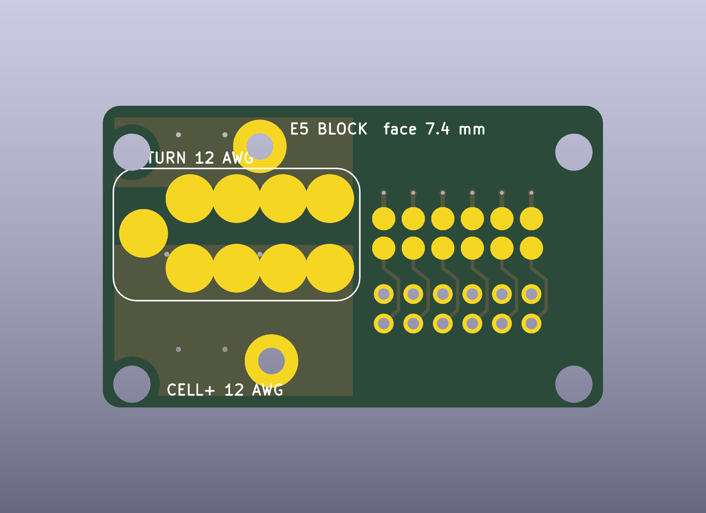

# MeshSat Field Kit hardware

Hardware for the MeshSat field kits: the portable go-boxes that carry a MeshSat Bridge (Raspberry Pi 5) with its radios, satellite modem, cellular modem, GPS and power into the field. The software lives in the [meshsat](https://github.com/meshsat/meshsat) repository. This repository holds the mechanical and electronic design, the build records and the manufacturing files.

MeshSat is a prototype. Nothing here has been through a field deployment yet. The V1 kits are bench and demo units; the V2 boards are designed, generated and checked, and none has been fabricated or ordered.

| Folder | What it is | State |
|---|---|---|
| `v1/` | tesseract and parallax as built: IP67 case, HDPE plates on M3 rods, UV-K5 + AIOC APRS chain, per-kit BOM and GPIO pinouts, FreeCAD plate model | built April 2026, in use |
| `v2/` | the Peli 1450 go-box of the MESHSAT-830 generation: six carrier PCBs around three Compute Module 5 slots, an aluminium control face in the 1450PF panel frame with a sealed monitor on it and a backer board under it, a removable stack on a floor dock, a built 4S smart pack in the east pocket | designed and generated 7 September 2026, nothing built or ordered |

## V1: tesseract and parallax

Two hand-built kits that differ only in the satellite modem (tesseract: RockBLOCK 9603 SBD, parallax: RockBLOCK 9704 IMT). Pi 5 with a Geekworm X1202 UPS, LilyGO T-Call A7670E, u-blox GPS, Quansheng UV-K5(8) with an AIOC for APRS, ESP32-S3 LoRa for Meshtastic, RTL-SDR v4, ZigBee CC2652P, DCF77 receiver, WeAct 3.7 inch e-paper, Raspberry Pi Touch Display 2, all on three HDPE plates in an IP67 case with SMA bulkheads. Details, BOM and pinouts in [`v1/README.md`](v1/README.md). **To build one: [`v1/BUILD.md`](v1/BUILD.md)** (parts, case drilling, plates, harness tables, software provisioning, checks).

## V2: the carrier set (MESHSAT-830 generation, 7 September 2026)

Seven KiCad 9 boards replace the plates, the loose wiring and the USB hub. Three Raspberry Pi Compute Module 5 sit in identical slots on one carrier, each with a PCIe switch, an NVMe drive, a USB 3 hub and a card slot; every radio and sensor is a USB device shared by the HAL across the three modules, which run k3s. The stack (PCB-A power with the VHF mezzanine, PCB-B compute) lifts straight out of the case, and a dock strip on the case floor carries the 9 to 36 V front end, the solar tracker, the sensor controller and the contact block that the stack lands on; eleven antenna paths blind-mate at the same time. The face is a 3 mm aluminium plate in the Peli 1450PF frame with a Xenarc IP67 monitor lying on it, a wide-temperature e-paper under a lens, sealed switches, two headset jacks and a camera window, with the backer board C7 (an RP2040 panel controller) under it and the 30 W VHF amplifier bolted to its underside. The pack is a built 4S smart pack of about 200 Wh in the pocket beside A22 at the east wall (the BB-2590/U did not fit the case; appendix 32.62). The device set, the budgets and the qualification plan are in [`v2/docs/V2-SPEC.md`](v2/docs/V2-SPEC.md) and [`v2/docs/TEST-PLAN.md`](v2/docs/TEST-PLAN.md); none of it has been built.

| Board | Rev | Size (mm) | Layers | Role |
|---|---|---|---|---|
| PCB-A POWER + I/O | A22 | 240 x 160 | 6 | the 14.4 V node from the 4S pack, BQ25731 SMBus charger, three 5.1 V slot rails and a device rail, the 13.8 V amplifier rail and the 12 V HF rail (both EMCON gated), the 54 V PoE rail, the 45 W USB-C outlet, INA226 rail monitors, the D8 mezzanine site, eleven blind-mate RF receptacles, the dock contacts |
| PCB-B COMPUTE | B16 | 330 x 200 | 6 | three Compute Module 5 slots on board-to-board receptacles, per slot a PCIe switch with an NVMe 2242 and a card slot (WiFi link card, 5G module, spare), a four-port USB 3 hub and a cooler fan; the KSZ9897 Ethernet switch to the wall port with PoE, the three-input HDMI switch to the monitor, the LimeSDR bay, the RockBLOCK site, the LG290P GNSS, the E22 1 W LoRa module, two E72 radios (Zigbee and Thread), the holdover clock, the secure element, the panel ribbon |
| PCB-C PANEL BACKER | C7 | 344 x 228 ring | 4 | the ring under the face plate: the RP2040 panel controller (a USB device with the hardware EMCON and ZEROIZE lines), the sixteen LEDs under IP68 light guides, two GPIO expanders, the e-paper flex socket and its boost stage, the sounder driver, the ambient light sensor, the lands for the sealed switches, the holes for the headset jacks and the monitor's connector block |
| PCB-D VHF APRS | D8 | 100 x 80 | 4 | the NiceRF SA868 exciter, the T/R relay, the low-pass filter and the leads to the RA30H1317M1 30 W module on the plate, a USB audio codec and headphone amplifier for the two headset jacks, a USB hub and the control bridge, the PTT and EMCON logic, the amplifier gate bias switch |
| PCB-E1 DOCK STRIP | E6 | 267 x 68 | 4 | the floor strip: 9 to 36 V vehicle and shore entry with the LM5176 front end, the solar tracker, the pack entry with its fuse and SMBus, the sensor controller (a second RP2040) with the climate, seal, water, gas, motion, lightning, Geiger and outside-pod inputs, two mixer fans, eleven blind-mate clamps, the raised contact block |
| PCB-E5 DOCK BLOCK | E5 | 43 x 26 | 2 | the raised block on the strip: the targets the stack's spring pins land on, wire lands underneath |
| PCB-P PACK BMS | P1 | 70 x 44 | 2 | inside the built 4S pack: the BQ4050 SMBus gauge with protection and balancing, two high-side N-FETs, the 2 mohm shunt, the 25 A blade, the cell tap, thermistor and SMBus headers, the lead lands (appendix 32.62) |

| | |
|---|---|
|  |  |
| PCB-A POWER + I/O | PCB-B COMPUTE |
|  |  |
| PCB-C PANEL BACKER | PCB-D VHF APRS |
|  |  |
| PCB-E1 DOCK STRIP | PCB-E5 DOCK BLOCK |

Concept renders of the assembled kit as designed (not built; `v2/cad/render/` holds the Blender scene, `v2/images/concept-1450/README.md` the full set):

| | |
|---|---|
|  |  |
| the open case from the front | the face from above |
|  |  |
| the front wall cut away and the face lifted | the stack without the face |
|  |  |
| the switch corner | closed for transport |

**To build one: [`v2/BUILD.md`](v2/BUILD.md)** (ordering the boards at JLCPCB, the parts to buy, case preparation, the pack, assembly order, coating, software, bench checks). Sources, generators, vendor references, the release and the order record are described in [`v2/README.md`](v2/README.md). The design record is [`v2/docs/MESHSAT-709-geometry-appendix.md`](v2/docs/MESHSAT-709-geometry-appendix.md), the build procedure [`v2/docs/ASSEMBLY.md`](v2/docs/ASSEMBLY.md), the panel controller contract [`v2/docs/PANEL.md`](v2/docs/PANEL.md).

## How to build one

| | Guide | What it covers |
|---|---|---|
| V1 | [`v1/BUILD.md`](v1/BUILD.md) | the 33-line parts list per kit, bulkhead and hole schedule, the three HDPE plates and the rod stack, what goes on which floor, the GPIO harness tables for both kits as wired, the Pi 5 provisioning sequence and its traps, the checks that prove the kit works |
| V2 | [`v2/BUILD.md`](v2/BUILD.md) | ordering the six boards at JLCPCB with the exact settings, everything else to buy, case and frame preparation, the 4S pack, the assembly order with torques, leads and pigtails, coating and labels, software bring-up, the open items of this generation |

## Working with this repository

- Binaries (STEP, FreeCAD, DXF, zips, PDFs, renders) are ordinary git objects; a clone is about 400 MB and needs no Git LFS.
- KiCad 9, Freerouting and the generator scripts run headless on a rented build host; see `v2/README.md` for the pipeline and the prerequisites.
- `v2/vendor/` holds third-party reference material (manufacturer CAD, datasheets) under the vendors' own terms; see `v2/vendor/README.md`.

## Licence

The hardware design, documentation and generator scripts in this repository are released under the CERN Open Hardware Licence Version 2, Strongly Reciprocal (CERN-OHL-S-2.0), see [`LICENSE`](LICENSE). Third-party files under `v2/vendor/` are not covered by it.

## Links

- Project site: [meshsat.net](https://meshsat.net)
- Bridge software: [github.com/meshsat/meshsat](https://github.com/meshsat/meshsat)
- This repository on GitHub: [github.com/meshsat/meshsat-fieldkit](https://github.com/meshsat/meshsat-fieldkit) (mirror of the GitLab original)
