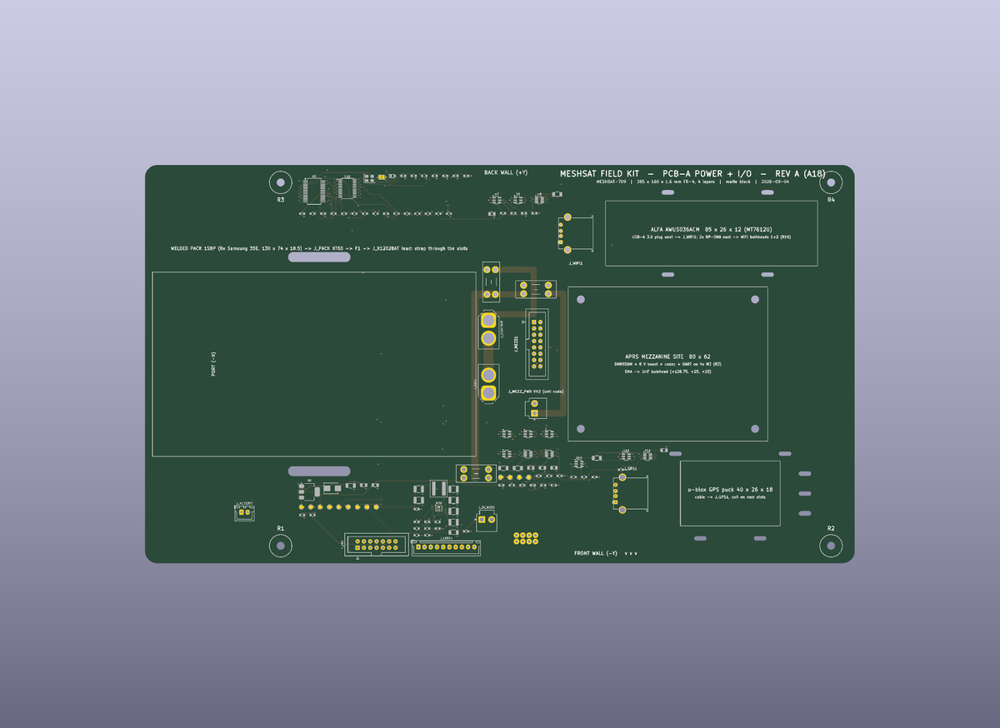
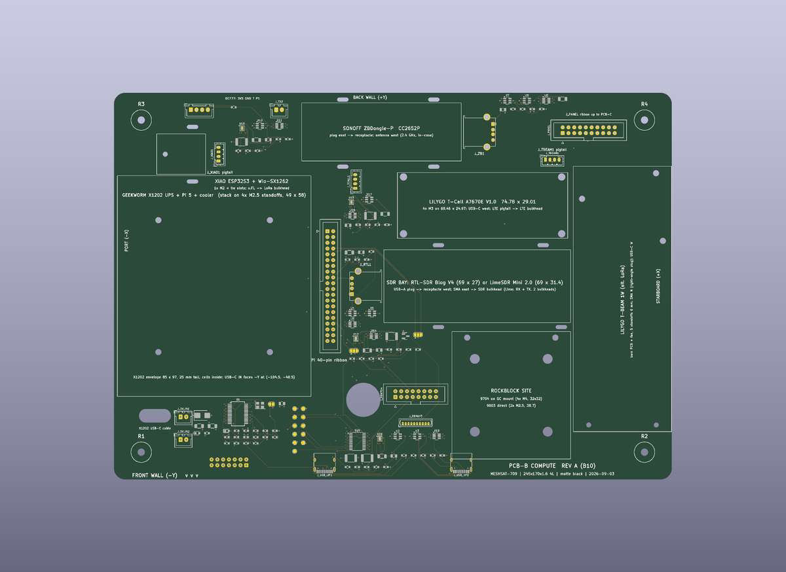
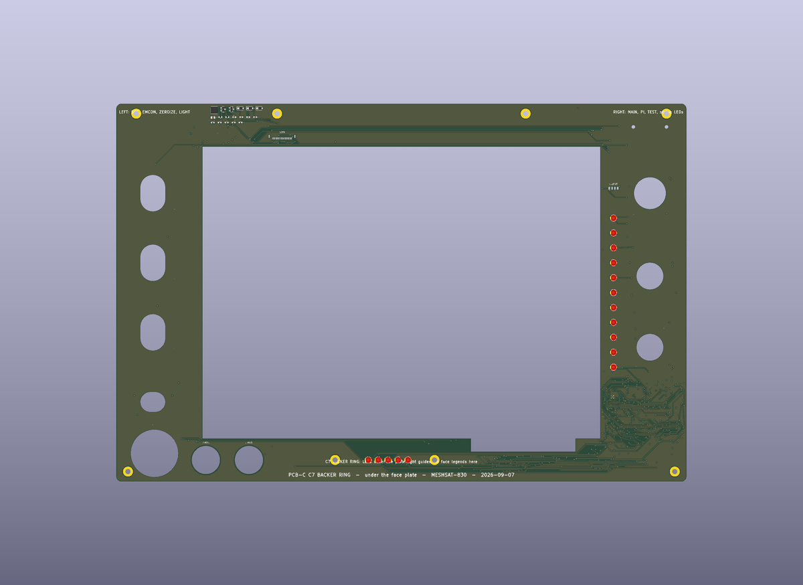
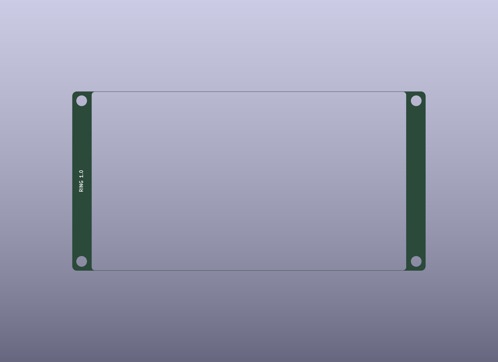
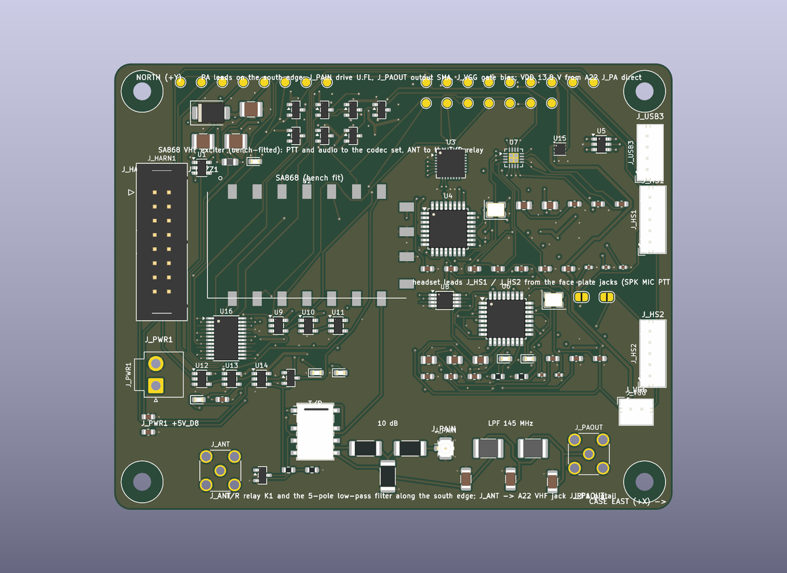
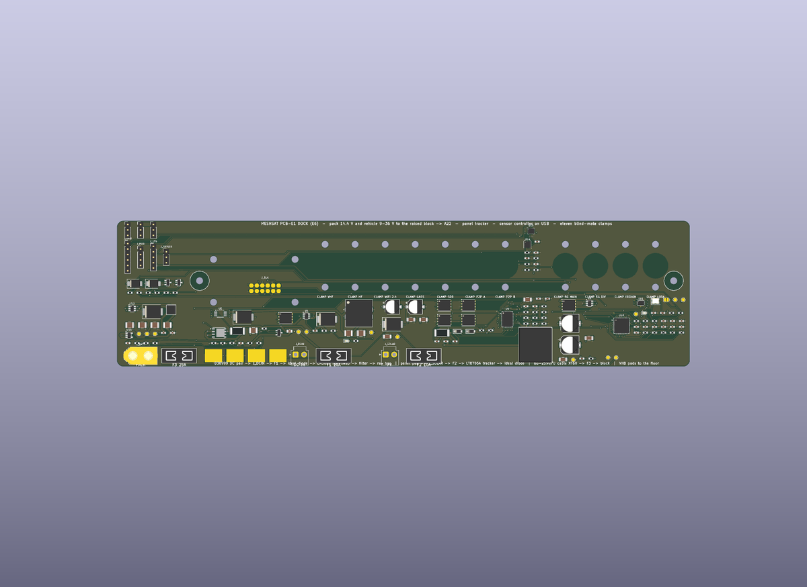
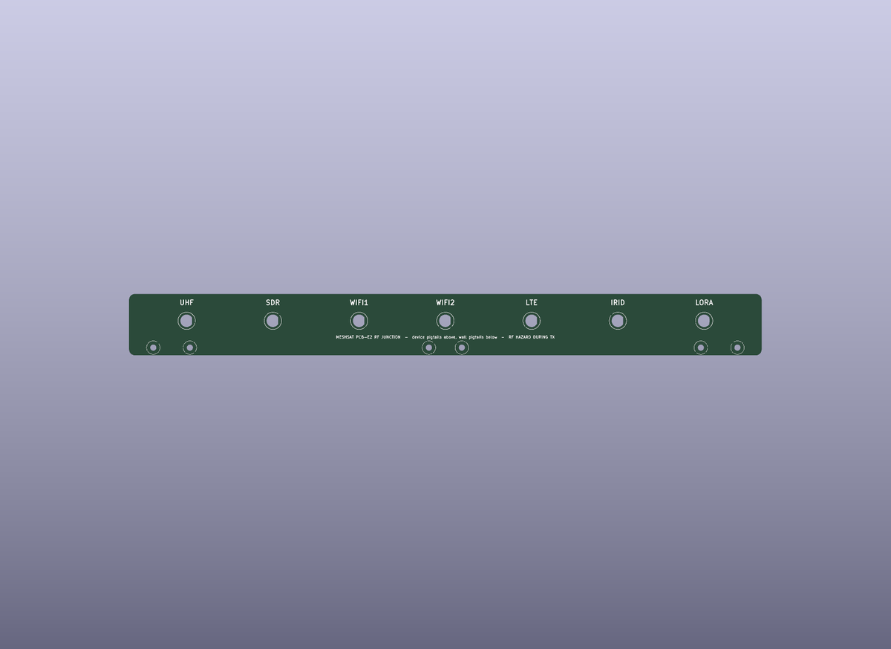

# MeshSat Field Kit hardware

Hardware for the MeshSat field kits: the portable go-boxes that carry a MeshSat Bridge (Raspberry Pi 5) with its radios, satellite modem, cellular modem, GPS and power into the field. The software lives in the [meshsat](https://github.com/meshsat/meshsat) repository. This repository holds the mechanical and electronic design, the build records and the manufacturing files.

MeshSat is a prototype. Nothing here has been through a field deployment yet. The V1 kits are bench and demo units, and the V2 boards are at their first fabrication order.

| Folder | What it is | State |
|---|---|---|
| `v1/` | tesseract and parallax as built: IP67 case, HDPE plates on M3 rods, UV-K5 + AIOC APRS chain, per-kit BOM and GPIO pinouts, FreeCAD plate model | built April 2026, in use |
| `v2/` | the Peli 1520 go-box: seven carrier PCBs, a control panel in the 1520PF panel frame, a removable stack on a floor dock | Rev A designed, JLCPCB order prepared September 2026, not yet built |

## V1: tesseract and parallax

Two hand-built kits that differ only in the satellite modem (tesseract: RockBLOCK 9603 SBD, parallax: RockBLOCK 9704 IMT). Pi 5 with a Geekworm X1202 UPS, LilyGO T-Call A7670E, u-blox GPS, Quansheng UV-K5(8) with an AIOC for APRS, ESP32-S3 LoRa for Meshtastic, RTL-SDR v4, ZigBee CC2652P, DCF77 receiver, WeAct 3.7 inch e-paper, Raspberry Pi Touch Display 2, all on three HDPE plates in an IP67 case with SMA bulkheads. Details, BOM and pinouts in [`v1/README.md`](v1/README.md). **To build one: [`v1/BUILD.md`](v1/BUILD.md)** (parts, case drilling, plates, harness tables, software provisioning, checks).

## V2: the carrier set

Seven KiCad 9 boards replace the plates, the loose wiring and the USB hub. The stack (PCB-A power, PCB-B compute) lifts straight out of the case; a dock strip on the case floor carries the shore power and the RF paths stay wired to the case. The control panel is the panel of a Peli 1520PF frame and carries the Touch Display 2, the e-paper, the switches and the indicators.

| Board | Rev | Size (mm) | Layers | JLCPCB assembly | Role |
|---|---|---|---|---|---|
| PCB-A POWER + I/O | A18 | 285 x 160 | 4 | top | pack node with fuses, 5 V module-rail boost, USB hub with eFuses and current sense, GPIO expander, dock spring pins |
| PCB-B COMPUTE | B11 | 245 x 170 | 4 | top, bottom 1 | Pi 5 + X1202 stack, module carriers (T-Call, RTL-SDR, ZigBee, RockBLOCK, LoRa), panel ribbon |
| PCB-C CONTROL PANEL | C4 | 442 x 311 | 2 | top 18, bottom 70 | the 1520PF panel: Touch Display 2 flush, recessed 3.7 inch e-paper window, MIL-STD-1472 controls, two GPIO expanders, MeshSat logo |
| PCB-C SPACER RING | R1 | 106 x 54 | 2 | none | 1.0 mm ring that brings the e-paper glass flush with the panel face |
| PCB-D APRS | D5 | 80 x 62 | 4 | top 78, bottom 1 | NiceRF DMR858M carrier: CM108 codec, PTT with hardware inhibit, USB-UART, boost, SMA |
| PCB-E1 DOCK | E1 | 250 x 44 | 2 | top 15 | floor strip: spring-pin targets, isolated 9 to 36 V shore entry to the X1202, fuse, remote inhibit |
| PCB-E2 RF JUNCTION | E3 | 330 x 32 | 2 | none | wall strip carrying the SMA bulkhead couplers |

| | |
|---|---|
|  |  |
| PCB-A POWER + I/O (A18) | PCB-B COMPUTE (B11) |
|  |  |
| PCB-C CONTROL PANEL (C4) | PCB-C SPACER RING (R1) |
|  |  |
| PCB-D APRS (D5) | PCB-E1 DOCK (E1) |
|  | |
| PCB-E2 RF JUNCTION (E3) | |

**To build one: [`v2/BUILD.md`](v2/BUILD.md)** (ordering the boards at JLCPCB, the parts to buy, case preparation, the pack, assembly order, coating, software, bench checks). Sources, generators, vendor references, the Rev A release and the order record are described in [`v2/README.md`](v2/README.md). The design record is [`v2/docs/MESHSAT-709-geometry-appendix.md`](v2/docs/MESHSAT-709-geometry-appendix.md), the build procedure [`v2/docs/ASSEMBLY.md`](v2/docs/ASSEMBLY.md), the panel software contract [`v2/docs/PANEL.md`](v2/docs/PANEL.md).

## How to build one

| | Guide | What it covers |
|---|---|---|
| V1 | [`v1/BUILD.md`](v1/BUILD.md) | the 33-line parts list per kit, bulkhead and hole schedule, the three HDPE plates and the rod stack, what goes on which floor, the GPIO harness tables for both kits as wired, the Pi 5 provisioning sequence and its traps, the checks that prove the kit works |
| V2 | [`v2/BUILD.md`](v2/BUILD.md) | ordering the seven boards at JLCPCB with the exact settings, everything else to buy, case and frame preparation, the welded pack and its bench checks, the assembly order with torques, leads and pigtails, coating and labels, software bring-up, the open items of Rev A |

## Working with this repository

- Binaries (STEP, FreeCAD, DXF, zips, PDFs, renders) are ordinary git objects; a clone is about 400 MB and needs no Git LFS.
- KiCad 9 and the generator scripts run on the design laptop; see `v2/README.md` for the pipeline and the prerequisites.
- `v2/vendor/` holds third-party reference material (manufacturer CAD, datasheets) under the vendors' own terms; see `v2/vendor/README.md`.

## Licence

The hardware design, documentation and generator scripts in this repository are released under the CERN Open Hardware Licence Version 2, Strongly Reciprocal (CERN-OHL-S-2.0), see [`LICENSE`](LICENSE). Third-party files under `v2/vendor/` are not covered by it.

## Links

- Project site: [meshsat.net](https://meshsat.net)
- Bridge software: [github.com/meshsat/meshsat](https://github.com/meshsat/meshsat)
- This repository on GitHub: [github.com/meshsat/meshsat-fieldkit](https://github.com/meshsat/meshsat-fieldkit) (mirror of the GitLab original)
