# MeshSat Field Kit hardware

Hardware for the MeshSat field kits, the portable go-boxes that carry a MeshSat Bridge (a Raspberry Pi 5 in V1, three Compute Module 5 in V2) with its radios, satellite modem, cellular modem, GPS and power into the field. Since October 2026 it also holds the compact kit, the pocket-sized node (`compact/`). The software lives in the [meshsat](https://github.com/meshsat/meshsat) repository. This repository holds the mechanical and electronic design, the build records and the manufacturing files.

MeshSat is a prototype. Nothing here has been through a field deployment yet. The V1 kits are bench and demo units. The V2 boards are designed and generated, and the engineering foundations beneath them are still being completed: no V2 board is ready for layout, no layout of boards A, B, C, D, E or P carries its board's corrected schematic (E5 has none), and none has been fabricated or ordered ([`v2/docs/CURRENT-EVIDENCE.md`](v2/docs/CURRENT-EVIDENCE.md): "Foundations incomplete; 0 boards ready for layout; 0 physically verified").

## Latest: compact v2, the pocket-sized node in a printed enclosure (6 October 2026)

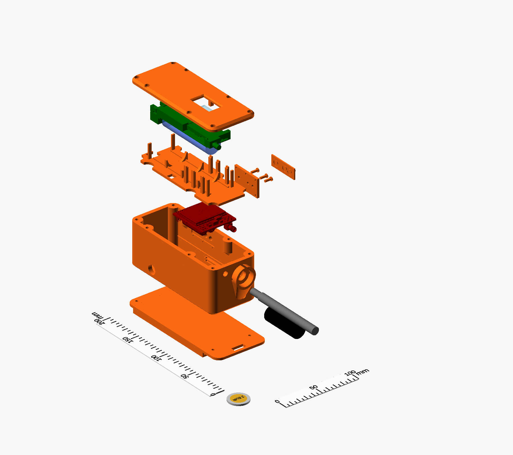

The compact v2 enclosure exploded, as designed (an OpenSCAD render; nothing printed). From the bottom: the belt plate, the body with the SOS guard and the LoRa antenna, the RockBLOCK 9704-SMA on its rails, the printed separator, the T-Beam Supreme with its 18650 cell, the lid with the OLED window; to the side, the TPU button membrane, the three plungers and their retainer.

The compact kit is the small MeshSat node: a Meshtastic LoRa radio and an Iridium modem in a case that fits a pocket, running the MeshSat fork of the Meshtastic firmware and talking to the MeshSat phone apps over one Bluetooth link. Its third version, **compact v2**, puts a LILYGO T-Beam Supreme over a RockBLOCK 9704-SMA in a 3D-printed stacked enclosure: ASA body, lid, separator and carry plates, a TPU membrane over the board's three side buttons, an O-ring cord seal, a polycarbonate pane over the OLED, two SMA bulkheads, an IP67 panel USB-C, an M12 vent and a 12 mm IP67 switch under a guard; 62.5 x 146.0 x 62.7 mm, 154.0 mm long with the SOS guard. The design is `meshsat-enclosure` v0.6 of 5 October 2026, the answer to an engineering audit of its v0.5: both boards are registered from the makers' STEP models, every printed part is clash-checked against them, and three test coupons (the 9704 rail slot, the rim with its seal and inserts, the upper bay with the real board) come before any full print. [`compact/`](compact/README.md) holds the version table for compact v0, v1 and v2; [`compact/v2/`](compact/v2/README.md) the source, the print files, the coupons, the renders and the validation chain.

State: designed, and cleared by its own audit response for prototype printing only. The first test coupons are being printed in October 2026; nothing has been printed, fitted or sealed. Open before a full build: the panel part numbers, how the 9704 is powered, Ground Control's certification condition on other transmitters in the same housing, and the leak, button and insert tests ([`compact/v2/AUDIT-RESPONSE.md`](compact/v2/AUDIT-RESPONSE.md)). Firmware, wiring and the Bluetooth contract: [meshsat-esp32](https://github.com/meshsat/meshsat-esp32), [meshsat-firmware](https://github.com/meshsat/meshsat-firmware) and [docs.meshsat.net/node/](https://docs.meshsat.net/node/).

## News

| Date | What |
|---|---|
| 6 October 2026 | The compact kit joins this repository as [`compact/`](compact/README.md): the version table for compact v0, v1 and v2, and the v2 enclosure package (OpenSCAD source, print STLs, test coupons, renders, validation chain, the makers' reference CAD). The first test coupons are being printed. |
| 5 October 2026 | The v2 enclosure reaches v0.6, the response to an engineering audit of v0.5 (findings F01 to F15, [`compact/v2/AUDIT-RESPONSE.md`](compact/v2/AUDIT-RESPONSE.md)): boards registered from the makers' STEP models, every printed part clash-checked, grounded test coupons in place of a floating fit check, a membrane and guided plungers for the side buttons. |
| 4 October 2026 | The V2 programme adopts an execution constitution ([`v2/docs/EXECUTION-CONSTITUTION.md`](v2/docs/EXECUTION-CONSTITUTION.md)): layer deliverables with explicit dependencies, independent checking, one freeze per candidate, and separate statements of handover readiness, power-design closure and fabrication release. |
| 3 October 2026 | A panel controller firmware for board C ([`v2/firmware/panel/`](v2/firmware/panel/README.md)): a portable core with its hardware layer, a pico-sdk port and host tests. The supplier engineering-handover entry page ([`v2/docs/handover/supplier/`](v2/docs/handover/supplier/)) with a per-board BOM reader from the committed netlists. Desk work: no board exists. |
| 27 September 2026 | The case set for the Peli 1450 ([`v2/release/case-2026-09-27/`](v2/release/case-2026-09-27/README.md)): face plate, RF entry plates, connector plate, frame legs and the lid tray as CAD, drawings and 1:1 templates. Nothing cut or fitted. |
| 26 September 2026 | Circuit corrections in the schematics of boards A, B, C, D, E and P. No committed layout carries them; the deliverable folders of `v2/release/revA/` predate them. |
| 7 September 2026 | The MESHSAT-830 generation: the Peli 1450 go-box around three Compute Module 5 slots, its boards generated from their generators (the V2 section below). |
| 3 September 2026 | This repository opens with the Rev A design release (`revA`) of the previous board generation (one compute module, the Touch Display, a twelve-cell battery module), kept on the GitHub release as the record. |
| April 2026 | The V1 kits tesseract and parallax built, in use since as bench and demo units ([`v1/`](v1/README.md)). |

## Folders

| Folder | What it is | State |
|---|---|---|
| `v1/` | tesseract and parallax as built: IP67 case, HDPE plates on M3 rods, UV-K5 + AIOC APRS chain, per-kit BOM and GPIO pinouts, FreeCAD plate model | built April 2026, in use |
| `v2/` | the Peli 1450 go-box of the MESHSAT-830 generation: seven carrier PCBs around three Compute Module 5 slots, an aluminium control face on the 1450PF panel frame with a sealed monitor in it and a backer board under it, a removable stack on a floor dock, a 4S pack built for the kit (about 145 Wh) in the east pocket | first generated 7 September 2026; circuits corrected on 26 September 2026 in the schematics only; foundations incomplete, 0 boards ready for layout, nothing built or ordered |
| `compact/` | the compact kit, the pocket-sized node: the version table for v0 (XIAO ESP32-S3 + Wio-SX1262 + RockBLOCK 9603 bench unit), v1 (LILYGO T-Beam Supreme + RockBLOCK 9603 for a Peli 1020) and v2 (T-Beam Supreme over a RockBLOCK 9704-SMA in a 3D-printed stacked enclosure, OpenSCAD, in `compact/v2/`) | v0 and v1 are bench units running since September 2026 (the v1 Peli build is not finished); v2 designed 5 October 2026, cleared by its own audit response for prototype printing only, nothing printed or fitted |

## V1: tesseract and parallax

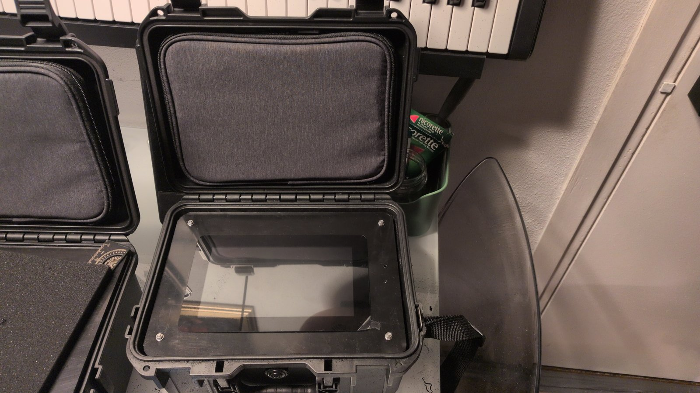

Two hand-built kits that differ only in the satellite modem (tesseract: RockBLOCK 9603 SBD, parallax: RockBLOCK 9704 IMT). Pi 5 with a Geekworm X1202 UPS, LilyGO T-Call A7670E, u-blox GPS, Quansheng UV-K5(8) with an AIOC for APRS, ESP32-S3 LoRa for Meshtastic, RTL-SDR v4, ZigBee CC2652P, DCF77 receiver, WeAct 3.7 inch e-paper, Raspberry Pi Touch Display 2, all on three HDPE plates in an IP67 case with SMA bulkheads. Details, BOM and pinouts in [`v1/README.md`](v1/README.md). **To build one: [`v1/BUILD.md`](v1/BUILD.md)** (parts, case drilling, plates, harness tables, software provisioning, checks).

## V2: the carrier set (MESHSAT-830 generation, 7 September 2026)

Seven KiCad 9 boards replace the plates, the loose wiring and the USB hub. Three Raspberry Pi Compute Module 5 sit in identical slots on one carrier, each with a PCIe switch, an NVMe drive, a USB 3 hub and a card slot; most radios and the sensor and panel controllers are USB devices on those hubs, shared by the HAL across the three modules, which run k3s; each of the three hub banks is designed to switch in hardware from its home module to a neighbour, decided by three I/O supervisors voting two of three, so losing a module is meant to move its USB peripherals instead of removing them. Not everything is on a hub: the two WiFi link cards are PCIe cards on two different modules, and only their antennas move; the compute modules' own WiFi and Bluetooth stay with each module; and two bearers have no second path and go with their module, the LoRa module on one module's SPI and the 5G data path on another's PCIe lane ([`v2/docs/ARCH-PCB-B-IOHA.md`](v2/docs/ARCH-PCB-B-IOHA.md) section 15). The stack (PCB-A power with the VHF mezzanine, PCB-B compute) lifts straight out of the case, and a dock strip on the case floor carries the 9 to 36 V front end, the solar tracker, the sensor controller and the contact block that the stack lands on; as generated, eleven antenna paths blind-mate at the same time (a twelfth, the third 5G jack, waits on the board E clamp fit under owner ruling D-07). The face is a 3 mm aluminium plate on the Peli 1450PF frame (over Peli's o-ring, case choice C1) with a Xenarc IP67 monitor set into it, a wide-temperature e-paper under a lens, sealed switches, two headset jacks and a camera window, with the backer board C7 (an RP2040 panel controller) under it and the 30 W VHF amplifier bolted to its underside. The pack is a 4S lithium-ion pack, built rather than bought, for the pocket beside A24 at the east wall (the BB-2590/U did not fit the case; appendix 32.62). On 26 September 2026 the owner ruled its size: one 4S3P block of Samsung INR18650-35E cells, about 145 Wh, shrink-wrapped in that pocket, its fit designed against Peli's own figures ([`v2/docs/CASE-MARGINS.md`](v2/docs/CASE-MARGINS.md)), with missions longer than the pack relying on vehicle or solar input. The product brief, the concept of operations with its PROVISIONAL runtime per power state, the device set and the qualification plan are in [`v2/docs/PRODUCT-BRIEF.md`](v2/docs/PRODUCT-BRIEF.md), [`v2/docs/CONOPS.md`](v2/docs/CONOPS.md), [`v2/docs/V2-SPEC.md`](v2/docs/V2-SPEC.md) and [`v2/docs/TEST-PLAN.md`](v2/docs/TEST-PLAN.md); none of it has been built. Against Peli's own figures, the antenna entries are twelve gas-discharge arrestors on one RF entry plate per end wall at 59 mm and the wall items share one connector plate between the hinge fairings, choices the design session took under the owner's standing rule of 26 September 2026 ([`v2/docs/CASE-MARGINS.md`](v2/docs/CASE-MARGINS.md) section 4); the case generators carry them since `c351115d` and the current case set, CAD, drawings and 1:1 templates, is [`v2/release/case-2026-09-27/`](v2/release/case-2026-09-27/README.md), while the committed board files and the deliverable folders of `v2/release/revA/` predate it.

| Board | Rev (newest deliverable folder) | Declared phase | Size (mm) | Layers | Role |
|---|---|---|---|---|---|
| PCB-A POWER + I/O | A24 | A32 | 240 x 160 | 6 | the 14.4 V node from the 4S pack, BQ25731 SMBus charger, three 5.1 V slot rails and a device rail, the 13.8 V amplifier rail and the 12 V HF rail (both EMCON gated), the 54 V PoE rail, the 45 W USB-C outlet, INA226 rail monitors, the D8 mezzanine site, eleven blind-mate RF receptacles, the dock contacts |
| PCB-B COMPUTE | B19 (quote only, not routed) | B21 | 330 x 200 | 6 (an 8-layer trial ruled 25 Sep 2026) | three Compute Module 5 slots on board-to-board receptacles, per slot a PCIe switch with an NVMe 2242 and a card slot (a WiFi link card, the 5G module, the second WiFi link card), a four-port USB 3 hub and a cooler fan; the KSZ9897 Ethernet switch to the wall port with PoE, the three-input HDMI switch to the monitor, the LimeSDR bay, the RockBLOCK site, the LG290P GNSS, the E22 1 W LoRa module, two E72 radios (Zigbee and Thread), the holdover clock, the secure element, the panel ribbon |
| PCB-C PANEL BACKER | C24 | C24 | 344 x 228 ring | 4 (6 ruled 25 Sep 2026, not yet regenerated) | the ring under the face plate: the RP2040 panel controller (a USB device with the hardware EMCON and ZEROIZE lines), the sixteen LEDs under IP68 light guides (and, in the schematic since its round 8, a seventeenth, the hardware EMCON lamp, whose light guide in the plate is owed), two GPIO expanders, the e-paper flex socket and its boost stage, the sounder driver, the ambient light sensor, the lands for the sealed switches, the holes for the headset jacks and the monitor's connector block |
| PCB-D VHF APRS | D11 | D12 | 100 x 80 | 4 | the NiceRF SA868 exciter, the T/R relay, the low-pass filter and the leads to the RA30H1317M1 30 W module on the plate, a USB audio codec and headphone amplifier for the two headset jacks, a USB hub and the control bridge, the PTT and EMCON logic, the amplifier gate bias switch |
| PCB-E1 DOCK STRIP | E9 | E17 | 267 x 68 | 4 | the floor strip: 9 to 36 V vehicle and shore entry with the LM5176 front end, the solar tracker, the pack entry with its fuse and SMBus, the sensor controller (a second RP2040) with the climate, seal, water, gas, motion, lightning, Geiger and outside-pod inputs, two mixer fans, one blind-mate clamp bar with twelve cavities (board A's eleven RF sites and the third 5G jack of owner ruling D-07), the raised contact block |
| PCB-E5 DOCK BLOCK | E5 | E5 (no schematic) | 43 x 26 | 2 | the raised block on the strip: the targets the stack's spring pins land on, wire lands underneath |
| PCB-P PACK BMS | P4 | P4 | 70 x 44 | 2 (4 at 2 oz ruled 25 Sep 2026, not yet regenerated) | inside the 4S pack: the BQ4050 SMBus gauge with protection and balancing, two high-side N-FETs, the 2 mohm shunt, the 25 A blade, the cell tap, thermistor and SMBus headers, the lead lands (appendix 32.62) |

The revision column names the newest deliverable folder in `v2/release/revA/boards/`, and the declared phase is the board this project is building ([`v2/docs/CURRENT-EVIDENCE.md`](v2/docs/CURRENT-EVIDENCE.md)). Every deliverable folder predates the circuit corrections of 26 September 2026 (`faf8c981`, `458b2873`, `d90f30e4`) and every later one, which are in the schematics only: no layout of boards A, B, C, D, E or P carries its board's corrected netlist (E5 has no schematic). The renders below show those older layouts.

**Reading this page inside an engineering handover snapshot** (`v2/release/handover/<version>.zip`): the snapshot leaves out `v2/images/` (renders, presentation) and `v1/` (the V1 kits, out of the V2 handover's scope), so the images below and the links into `v1/` do not resolve there; they do in this repository. The snapshot's `EXCLUDED.tsv` lists every file left out, and its `START-HERE.md` section 7 says why.

| | |
|---|---|
| 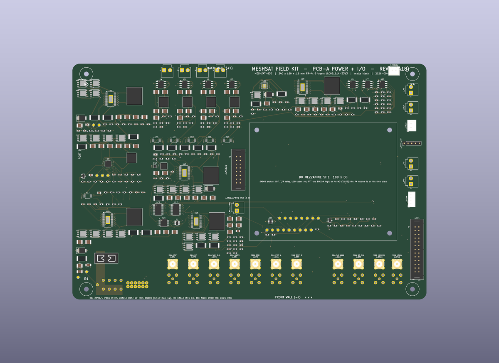 | 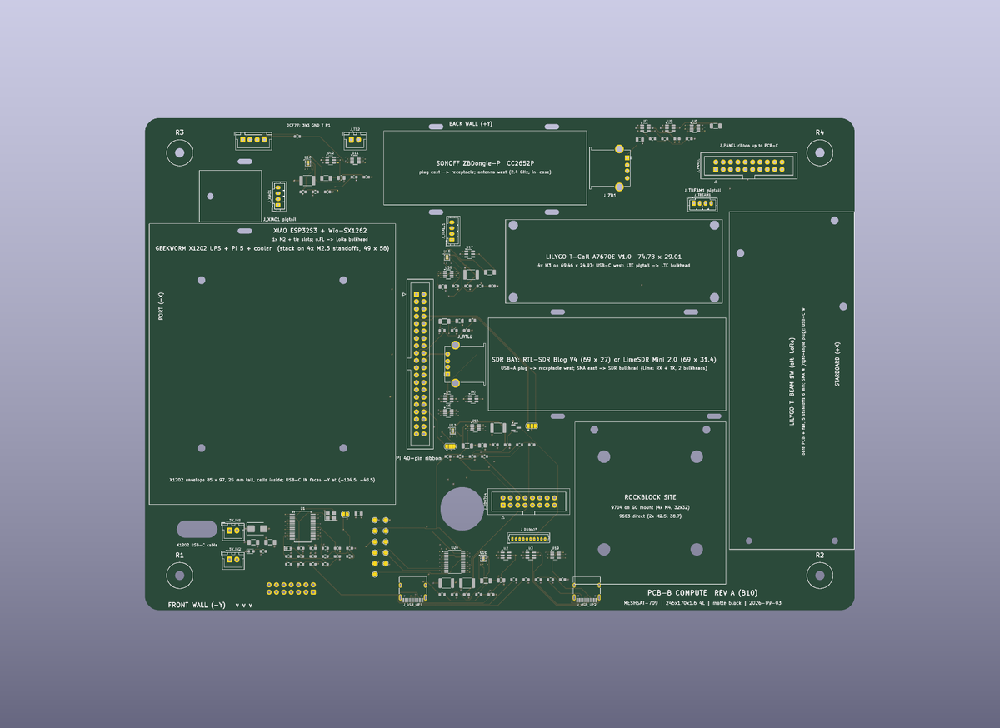 |
| PCB-A POWER + I/O | PCB-B COMPUTE |
| 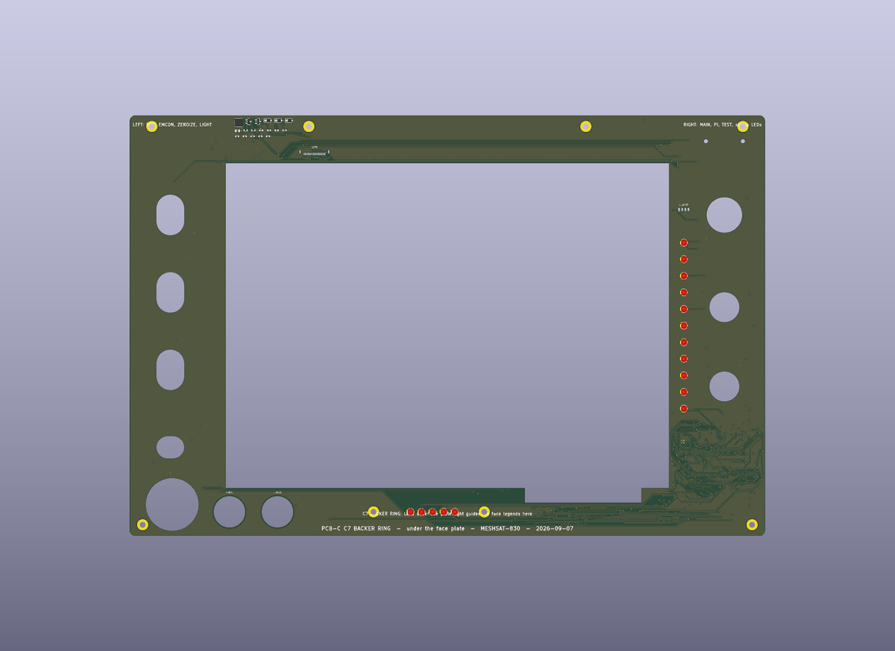 | 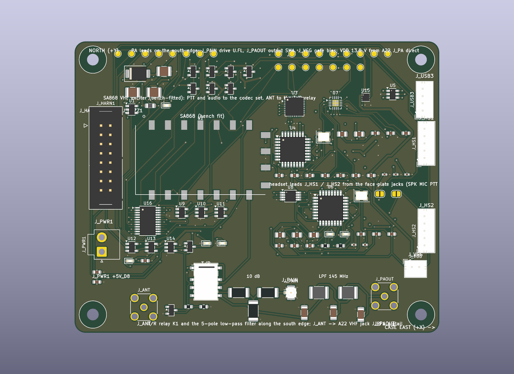 |
| PCB-C PANEL BACKER | PCB-D VHF APRS |
| 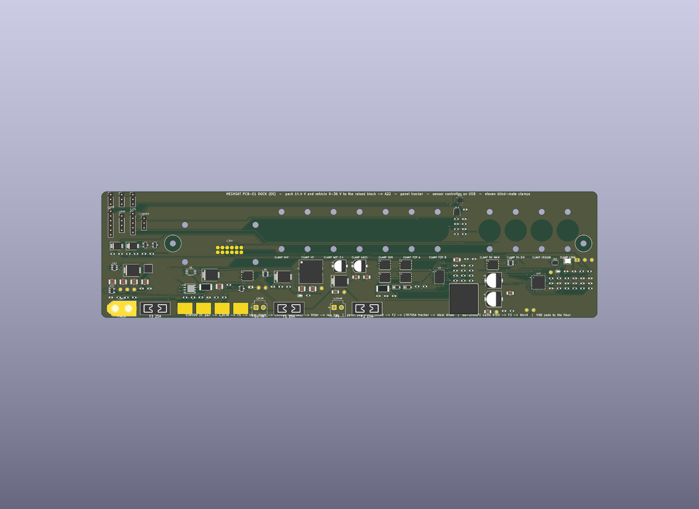 | 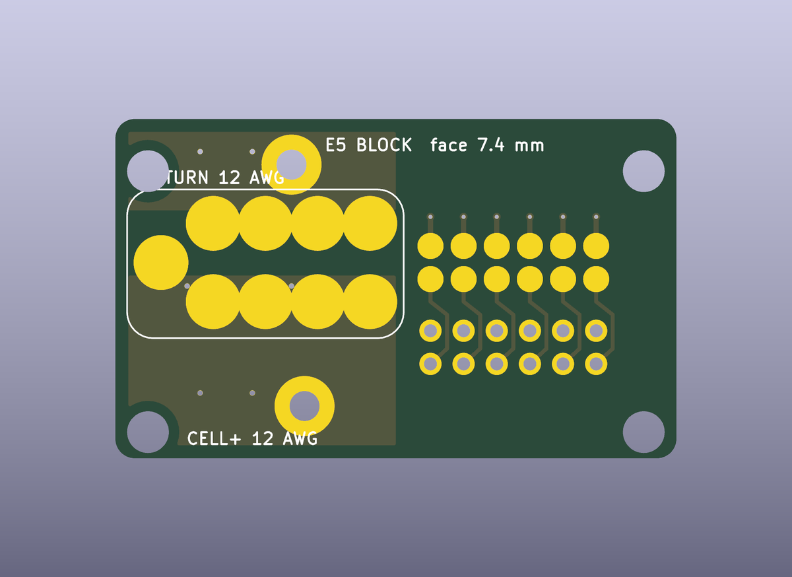 |
| PCB-E1 DOCK STRIP | PCB-E5 DOCK BLOCK |
| 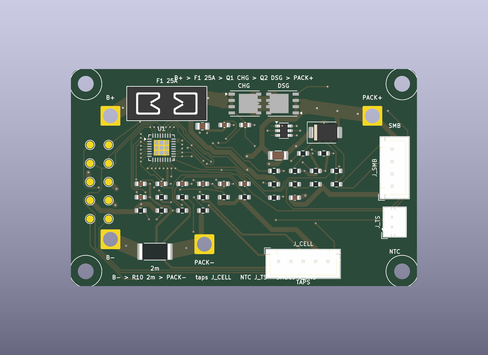 | |
| PCB-P PACK BMS | |

Concept renders of the assembled kit as designed (not built; `v2/cad/render/` holds the Blender scene, `v2/images/concept-1450/README.md` the full set):

| | |
|---|---|
| 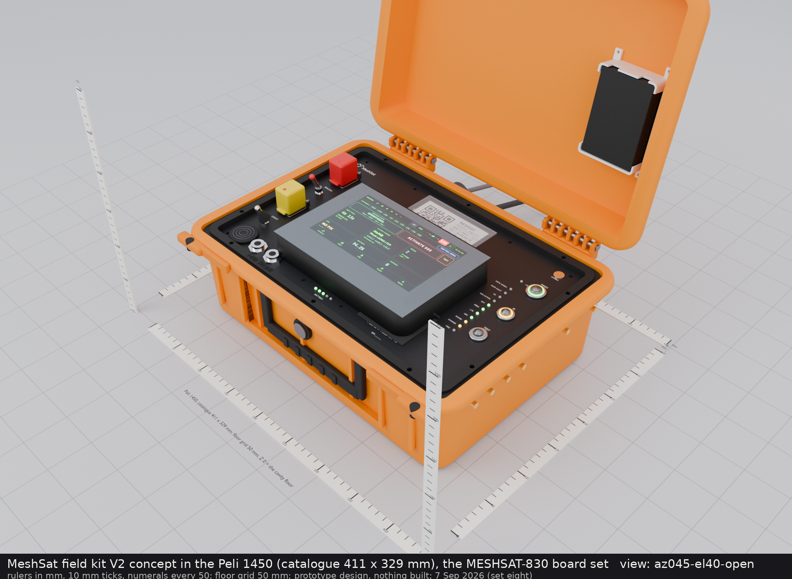 | 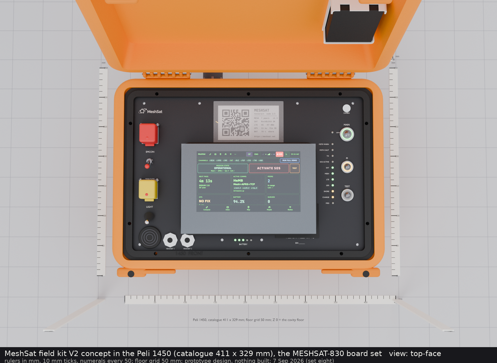 |
| the open case from the front | the face from above |
| 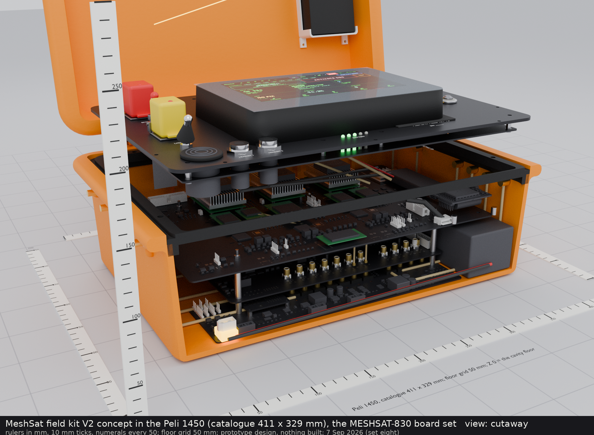 | 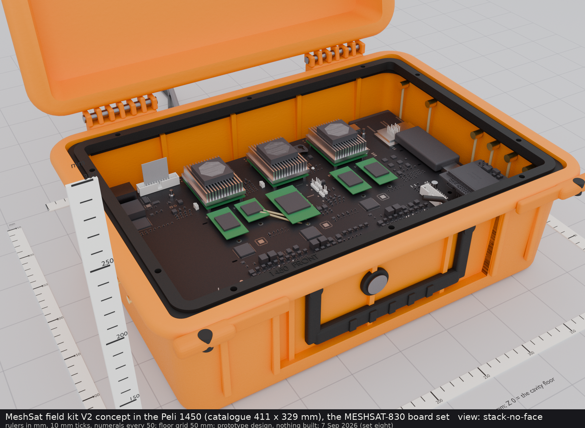 |
| the front wall cut away and the face lifted | the stack without the face |
| 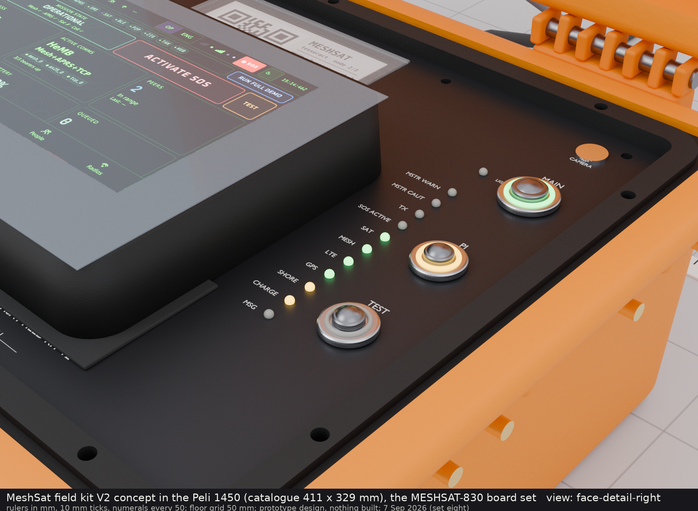 | 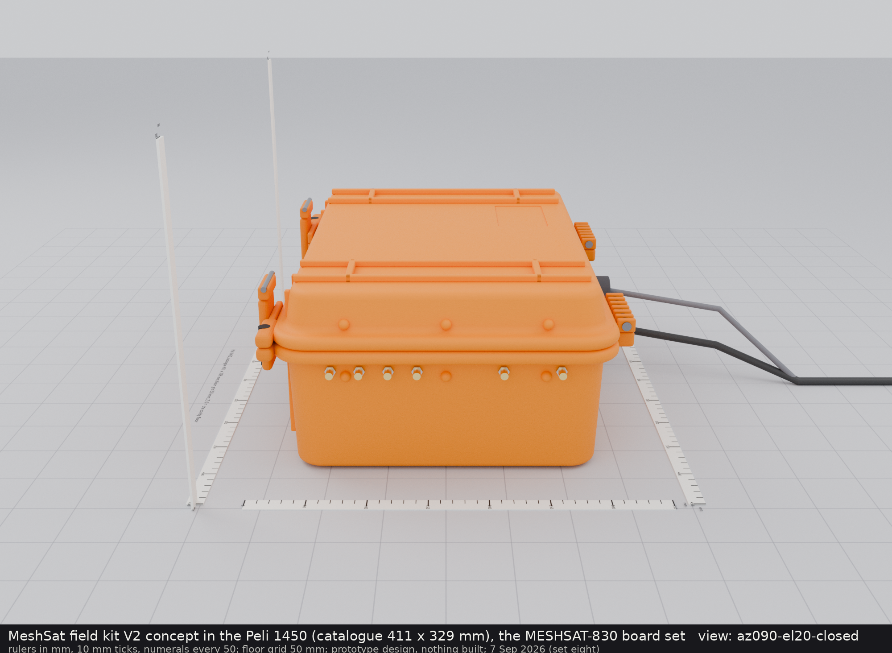 |
| the switch corner | closed for transport |

**The V2 build guide, [`v2/BUILD.md`](v2/BUILD.md), is the 7 September generation's guide, kept as the assembly narrative and not to be used to order boards:** no board is ready for layout, and the order folder is rebuilt and quarantined with nothing ordered from it (owner decision 41 of 25 September 2026). Sources, generators, vendor references, the release and the order record are described in [`v2/README.md`](v2/README.md). The design record is [`v2/docs/MESHSAT-709-geometry-appendix.md`](v2/docs/MESHSAT-709-geometry-appendix.md), the build procedure [`v2/docs/ASSEMBLY.md`](v2/docs/ASSEMBLY.md), the panel controller contract [`v2/docs/PANEL.md`](v2/docs/PANEL.md).

## How to build one

| | Guide | What it covers |
|---|---|---|
| V1 | [`v1/BUILD.md`](v1/BUILD.md) | the 33-line parts list per kit, bulkhead and hole schedule, the three HDPE plates and the rod stack, what goes on which floor, the GPIO harness tables for both kits as wired, the Pi 5 provisioning sequence and its traps, the checks that prove the kit works |
| V2 | [`v2/BUILD.md`](v2/BUILD.md) | the 7 September generation's guide, headed as history and not for ordering (decision 41; 0 boards ready for layout): the boards as generated, everything else to buy, case and frame preparation, the 4S pack, the assembly order with torques, leads and pigtails, coating and labels, software bring-up, the open items, with the lines that contradict the current baseline corrected in place |

## Working with this repository

- Binaries (STEP, FreeCAD, DXF, zips, PDFs, renders) are ordinary git objects; a clone is about 400 MB and needs no Git LFS.
- KiCad 9, Freerouting and the generator scripts run headless on a rented build host; see `v2/README.md` for the pipeline and the prerequisites.
- `v2/vendor/` holds third-party reference material (manufacturer CAD, datasheets) under the vendors' own terms; see `v2/vendor/README.md`.

## Licence

The hardware design, documentation and generator scripts in this repository are released under the CERN Open Hardware Licence Version 2, Strongly Reciprocal (CERN-OHL-S-2.0), see [`LICENSE`](LICENSE). Third-party files under `v2/vendor/` are not covered by it.

## Links

- Project site: [meshsat.net](https://meshsat.net)
- Bridge software: [github.com/meshsat/meshsat](https://github.com/meshsat/meshsat)
- This repository on GitHub: [github.com/meshsat/meshsat-fieldkit](https://github.com/meshsat/meshsat-fieldkit) (mirror of the GitLab original)
