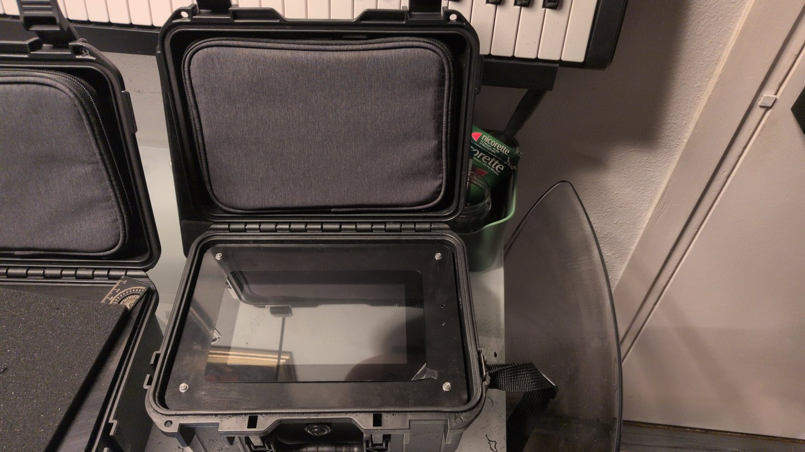
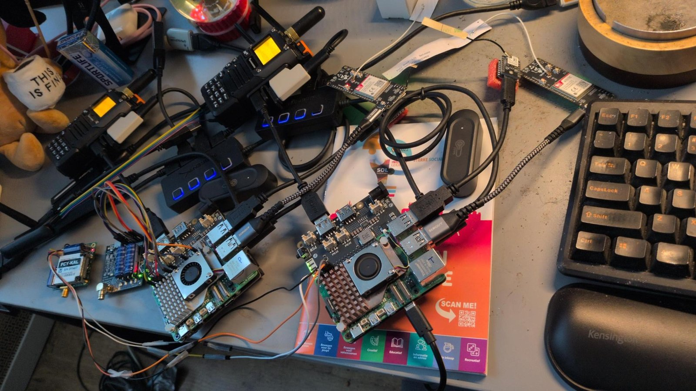
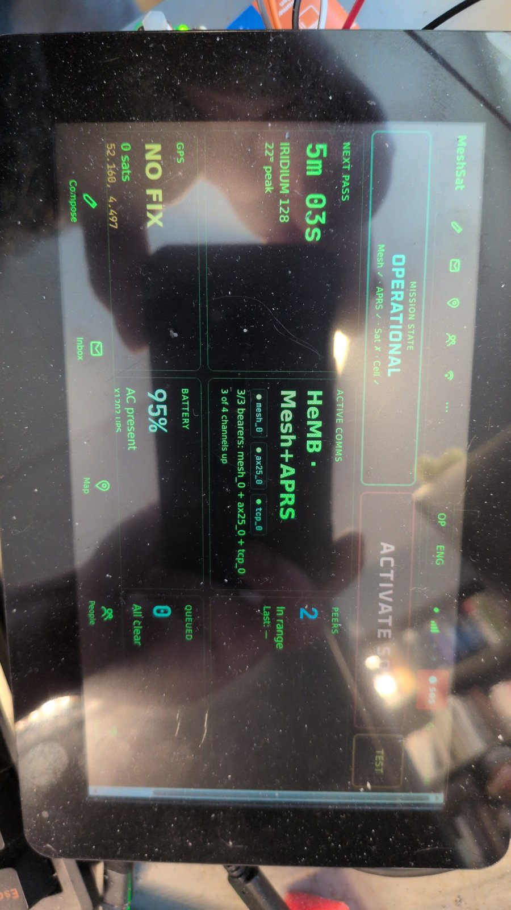

# V1 field kits: tesseract and parallax

Two hand-built kits (YouTrack MESHSAT-403), built in April 2026 and in use as bench and demo units. They are identical except for the satellite modem: **tesseract** carries a RockBLOCK 9603 (Iridium SBD, 19200 baud), **parallax** a RockBLOCK 9704 (Iridium IMT, 230400 baud on UART2).

Per kit: Raspberry Pi 5 8 GB with active cooler, Geekworm X1202 UPS (4 x 18650), LilyGO T-Call A7670E (4G/2G, KPN SIM), u-blox USB GPS, Quansheng UV-K5(8) with an AIOC v1.2 for APRS (Nagoya NA-771), ESP32-S3 LoRa (Meshtastic), RTL-SDR v4, ZigBee CC2652P coordinator, DCF77 receiver, WeAct 3.7 inch e-paper (SPI), Raspberry Pi Touch Display 2 in the lid, Sabrent HB-UM43 hub, TAOGLAS Iridium antenna, three HDPE plates on four M3 rods in an IP67 case with five SMA bulkheads, a USB-C inlet and a vent plug. Ubuntu Server 24.04.

**Build guide: [`BUILD.md`](BUILD.md).** The rest of this page is the inventory.

## Files

| Path | Content |
|---|---|
| `docs/MeshSat-Field-Kit-BOM.docx` | per-kit bill of materials (the version tracked in the meshsat repository since 20 April 2026) |
| `docs/MeshSat-Field-Kit-BOM-superseded.docx` | the 12 April 2026 copy that lived on the design laptop, kept for reference; the two differ |
| `docs/MeshSat-Field-Kit-GPIO-Pinout.docx` | GPIO harness table, Rev C |
| `docs/MeshSat-Field-Kit-GPIO-Pinout-Parallax.docx` | GPIO harness table for parallax, Rev D |
| `docs/direwolf-aioc-setup.md` | the APRS chain: Direwolf with the AIOC |
| `cad/` | FreeCAD model of the three plates and the component layout (`field_kit.FCStd`, build scripts, renders, `field_kit.step`) |
| `images/` | photos: the kit in its case with the display plate, both kits opened on the bench, the operator dashboard on the Touch Display 2 |

## Photos

## Software side

The kit provisioning lives with the software in the meshsat repository: `scripts/install-kiosk.sh` (Touch Display 2 kiosk), `scripts/install-kit-network.sh` (WiFi reliability), `scripts/x1202-monitor.py` (UPS monitor), `deploy/kiosk/`, and the hardware pages of the documentation site.

## What replaces it

The V2 carrier set in `../v2/` replaces the plates, the loose wiring and the USB hub with seven PCBs in a Peli 1520 case. The V1 kits stay as they are until those boards are proven.
