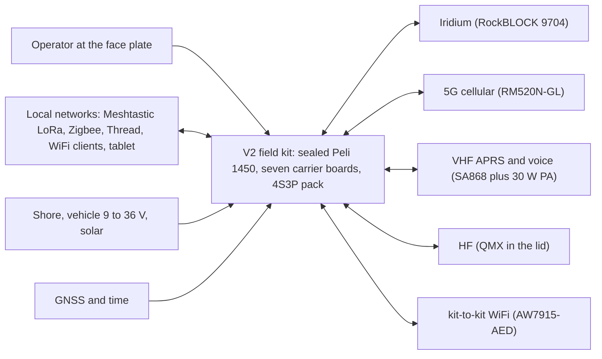
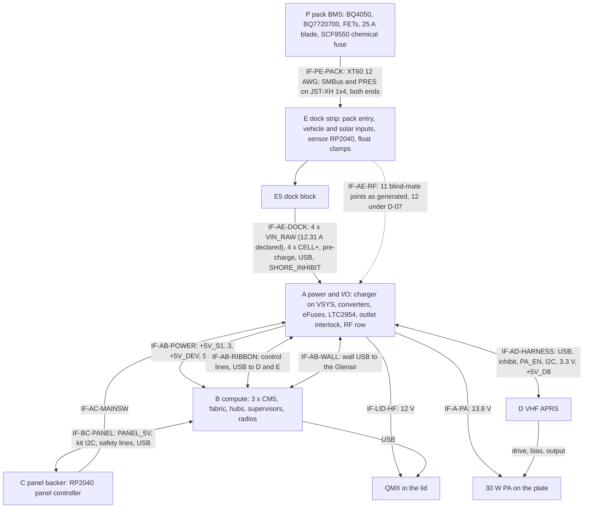
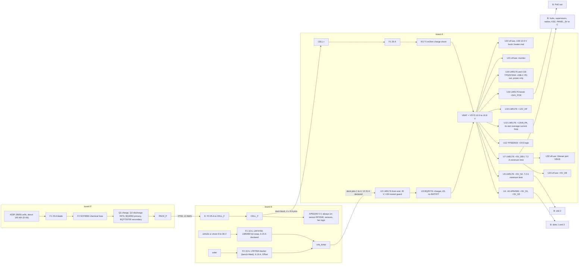
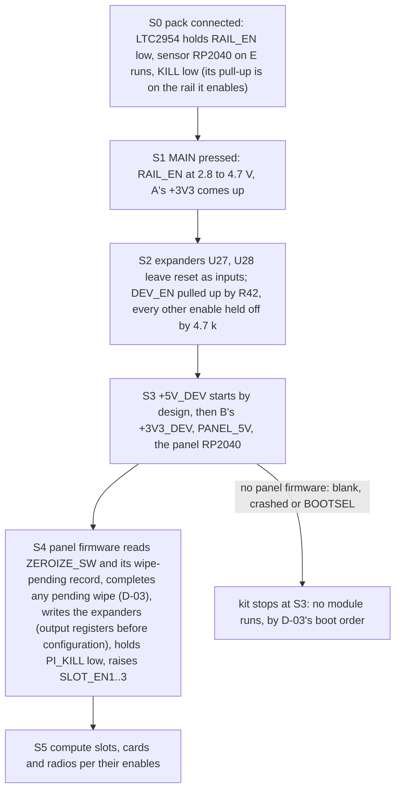
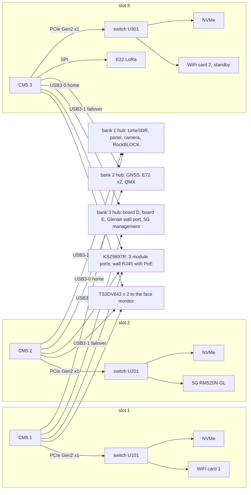

# MeshSat field kit V2: system architecture

MESHSAT-1357, the foundation baseline. Integrated on 26 September 2026 from the round-1 and round-2 foundation reviews
(seven workstreams, their challengers and eleven adjudications, A01 to A11), and **re-anchored the same evening to
`main` at `eadbe571`**. That revision carries:
- the circuit corrections of every schematic board: boards C, D, E and P at `faf8c981`, boards A, B and D at
  `458b2873`, board P's secondary over-temperature at `d90f30e4`, each regenerated on the KiCad box with parity and
  every netlist difference traced to a finding (RECORDED in those commits; not re-run here);
- the documents revised in this baseline: `ARCH-PCB-B-IOHA.md`, `PANEL.md`, `ASSEMBLY.md`, `OPERATING-ENVELOPE.md`,
  `pcb_decisions.yaml` and appendix 32.366 (`4ec785d8`); `CONOPS.md`, `PRODUCT-BRIEF.md` and `V2-SPEC.md` (`68bc9e8f`);
  the owner's reversal of D-08, D-08a, SC-02 and `CASE-MARGINS.md` (`b69f20db`, appendix 32.367);
- the evidence classes and `CURRENT-EVIDENCE.md` (`26e847bc`); the feasibility pages `v2/docs/feasibility/ZEROIZE.md`
  (`9b0635d1`), `FAILOVER-FABRIC.md` (`a5266aa8`), `DECOUPLING.md` (`9d566e8b`, decision 42 ruled by the session),
  `EMCON.md` (`cb996aca`) and `POWER-THERMAL.md` (`eadbe571`); the battery review packet
  `v2/docs/review-packets/battery/` (`d90f30e4`); `v2/docs/reviews/REVIEW-ROUTES.md` (`ccf5808e`).

Every generator line cited below was re-read at `eadbe571`; documents are cited by section as read there;
`V2-SPEC.md` keeps its 7 September line numbers by its own rule and is cited by line. The committed **board files**
(the layouts) are unchanged since `82dd1e4d` and predate the corrected netlists: where a statement is about a layout it
says so.

This is the one system view of the V2 kit: what each board is responsible for, how power, data and control move
between them, the mechanical stack, the thermal and RF plans, the hardware and firmware contract, the budgets, the
design findings that are still open, and the **core functions whose feasibility is not closed** (section 14).

**Prototype design.** No V2 board has been fabricated, ordered or powered, and no kit has been built or field deployed.
Every line below describes the design as generated or the design as intended, and says which. Where the two differ the
generated circuit is described as it is and the difference is an open finding (section 13); **a circuit with an open
finding is not the design**, it is the current state of a design that still has to be corrected. A document merge is
evidence of configuration control, not proof of architecture feasibility (the review of 26 September 2026, section 6
item 1): this page states what is designed, and section 14 states what is not yet shown to be feasible.

Related records: `PRODUCT-BRIEF.md` and `CONOPS.md` (the needs NEED-01 to NEED-19 in `CONOPS.md` section 2, the
prototype 1 core in section 2a, the power states PS-* in section 4a, the owner's rulings in section 7 and the choices
the session took under the owner's standing rule in section 7a), the requirement records
`v2/ecad/tools/pcb_requirements.yaml` (not on `main` at `eadbe571`; they land in the same baseline), `EXECUTION-PLAN.md`
(reviews, milestones, the owner's seven conditions), `CURRENT-EVIDENCE.md` (the evidence classes and the per-board
layout-entry table), `CASE-MARGINS.md` (the case held against Peli's own figures), the feasibility pages under
`v2/docs/feasibility/`, `B-FEASIBILITY.md` (board B), `TEST-PLAN.md`, `OPERATING-ENVELOPE.md`, `PANEL.md`,
`ARCH-PCB-B-IOHA.md`, `GROUNDING-AND-SHIELDS.md`, and the board-to-board contracts in
`v2/ecad/tools/pcb_interfaces.yaml` (section `board_to_board`).

## 0. How to read this page

**Evidence words.**

| Word | Meaning |
|---|---|
| VERIFIED (re-read) | read in the artefact cited by this integration: a generator line, committed netlist, board or datasheet, or a document, at `eadbe571` |
| VERIFIED (Axx), (Wn) or (a page) | read in the artefact by the named adjudication, workstream or feasibility page; the adjudications are settled |
| RECORDED | a regeneration, parity or box result written into a commit or a page whose run is not repeated here |
| INFERRED | reasoned from verified facts by the stated arithmetic; not measured |
| PROVISIONAL | arithmetic on loads that are themselves INFERRED or TBD (owner condition 2): never a design figure |
| TBD | no source in this tree; the effect of not knowing is stated |

**What "as generated" means.** The schematic generators `v2/ecad/tools/gen_sch_*.py` are the current design. At
`eadbe571` the committed schematic, netlist, intent, BOM and sidecar of boards A, B, C, D, E and P are what those
generators produce: each correcting commit regenerated its boards on the KiCad box, showed parity of `main`'s unchanged
generators first, and mapped every netlist difference to a finding (RECORDED, `faf8c981`, `458b2873`, `d90f30e4`;
owner condition 5). So the generators and the committed netlists are read interchangeably below. The committed **board
files** are older: A32, B21, C24, D12, E17 and P4 carry the netlists of before the corrections, so SCH-002 (netlist
against board) reads FAIL on A and B and INCONCLUSIVE on C, D, E and P (`CURRENT-EVIDENCE.md`, the candidate table), and
every layout reading on them is historical. E5 has no schematic; its board is its design.

The committed netlists at `eadbe571`, sha256/16 (VERIFIED re-read): A `2e8923d6853ee4e1`, B `6048ee56c48a028b`, C
`2834f0d8c4071d56`, D `f13d8b70099ab03e`, E `d910e49c5f5f50b2`, P `4342c4cbe1b43dc4`.

**Finding IDs** such as `F-SQ-01` or `W5-F4` are the foundation review's identifiers; `FAB-nn`, `SD-EMC-n`, `PWR-Fnn`,
`BAT-Fnn`, `L1` to `L7` and `FB-...` are the feasibility pages' and the battery packet's own. Each one this page relies
on is stated in section 13 or 14 with its state. A finding first raised by this integration carries an `I3-F`
identifier.

## 1. Owner rulings this page rests on, and what is still open

Every owner question of the foundation batch except the conditional D-18 was asked one at a time with its evidence,
options and a recommendation, and each was ruled at the recommendation (`CONOPS.md` section 7 is the record of each).
Decisions 27, 28, 41 and 43 were ruled on 25 September 2026 (appendix 32.365); D-01, D-02a and D-02b on 25 September
2026 between about 23:27 and 23:40 CEST; D-02c to D-17 on 26 September 2026 between about 00:05 and 00:55 CEST. Later
on 26 September the owner ruled D-08a, and at about 09:30 CEST he reversed D-08 (appendix 32.367). Nothing below is
built: a ruling fixes a requirement or a design direction, and section 1.3 says which of the engineering it names is in
a generator.

### 1.1 Ruled

| Ruling | Ruled | What the owner ruled | Where it acts here |
|---|---|---|---|
| Decision 27 | 25 Sep 2026 | board C goes to six layers (JLC06161H-3313); the price is quoted before anything is paid | 3.1; C24 stays four layers until regenerated |
| Decision 28 | 25 Sep 2026 | board P goes to four layers at 2 oz outer copper | 3.1; the stackup row JLC04162H-7628 is in `stackup_write.STACKS` since `d468613e`. The P8 measurement cited for the ruling was taken on the wrong BQ4050 land (W6-F2, corrected in the netlist at `faf8c981`) and has to be retaken on the corrected land |
| Decision 41 | 25 Sep 2026 | the order set is rebuilt from the deliverable folders and quarantined; nothing is ordered | executed at `29f00554`; 11: no cost or order figure is taken from the order set |
| Decision 43 | 25 Sep 2026 | board B is measured on eight layers first, one regeneration and one route; the eight-layer price goes to the owner before any order | 3.1; the row JLC08161H-2116 is in `STACKS` since `d468613e`; the whole-board eight-layer run is EXPERIMENTAL and never adopted as B's phase (owner condition 7); not run at `eadbe571`; `B-FEASIBILITY.md` |
| D-01, prototype scope | 25 Sep 2026 | **full design, staged acceptance.** Every ruled function stays designed and fitted where copper exists; prototype 1 is accepted on a named core: messaging over Iridium, 5G, LoRa and APRS; the three-slot failover fabric (IOHA tests A1 to A14); pack, vehicle and solar charging; hardware EMCON; ZEROIZE of the secure element; pack safety; service and programming access. Everything else is built where possible and reported NOT_YET_TESTED | 2, 14; each requirement record in `pcb_requirements.yaml` (same baseline) carries `prototype_1: core` or `deferred` |
| D-02a, qualification margins | 25 Sep 2026 | `TEST-PLAN.md`'s +55 C operation and +71 C storage (E3) and -33 C storage (E4) are qualification margins over the -20 to +40 C use and -20 to +45 C storage envelope; two pass lines: operate to specification inside the envelope, survive and recover at the margin | 8.3 |
| D-02b, closed lid | 25 Sep 2026 | the kit operates with the lid closed in a defined reduced mode (for example GNSS, LoRa mesh, Iridium and APRS beacons, monitor off, one CM5); a closed-lid state and thermal test join `TEST-PLAN.md`; a lid sensor is an engineering item (the tamper switch can serve both). **Accepted consequences:** above +35 C ambient the kit runs one module; with three loaded modules charging holds off above about +25 C | 8.3; the +35 C and +25 C rows are proposed controls, not established limits (`POWER-THERMAL.md` section 9.3) |
| D-02c, severities | 26 Sep 2026 | shock `TEST-PLAN.md` E1 (26 drops from 1.22 m), vibration E2 (composite wheeled vehicle, 1 h per axis); altitude 0 to 3000 m in use, 0 to 4500 m in transport; service life TBD for prototype 1 | 7.5 |
| D-02d, cold start | 26 Sep 2026 | a start from the pack below about -10 C cell temperature is **out of scope**, stated: a cold-soaked kit needs shore or vehicle power, or warming, first; once warm, use down to -20 C holds. No hardware added | 8.3; F-PK-01 is RULED |
| D-02e, direct sun | 26 Sep 2026 | **operate shaded** is a stated operating condition, with a shade accessory (a lid sun shield or a tarp); full-sun design is a later qualification item. No board change | 8.1, 8.4 |
| D-03, ZEROIZE (decision 30) | 26 Sep 2026 | **crypto-erase through the secure element**: drive and eMMC keys are wrapped by a key the SE holds; ZEROIZE destroys it, then running modules drop RAM keys, then the slots are cut. Firmware and provisioning, no board change. Precondition: the ATECC608B slot map must be erasable (TPM 2.0 the fallback). The ONLY trigger is the covered toggle held 5 s; the tamper or lid switch logs only; remote wipe deferred. LEVEL-SENSITIVE across a power loss. **Accepted residual risk:** drive unlock at boot depends on the SE, the panel and the kit I2C bus | 10.3, 14 (FB-ZER-1) |
| D-04, markets | 26 Sep 2026 | a non-commercial prototype in the Netherlands and the EU, operated by a licensed radio amateur; no CE or RED marking and no EMC claim (MIL-STD-461 runs are characterisation); the design keeps an EU route open; every transmitter configured to the operator's licence and the EU limits; a band lock on the VHF path; the pack's transport route stated. Since 26 September (appendix 32.367) no route is claimed: the pack's classification, conditions or exception are TBD before any route is claimed (road carriage has its own dangerous-goods rules, the ADR; `CONOPS.md` section 4, Transport row) | 9.4 |
| D-05, EMCON | 26 Sep 2026 | **radios dark**, as generated and completed: every radio with an emission path is powered off or RF-disabled in hardware; the VHF path keeps listening (its gate is on transmit only); GNSS, DCF77 and lightning continue. The gap fixes are the session's | 6.3, 14 |
| D-06, pack and runtime | 26 Sep 2026 | **one 4S3P 18650 pack (Samsung INR18650-35E) of about 145 Wh**, shrink-wrapped in the east pocket, subject to the case measurement; missions longer than the pack rely on vehicle or solar input; the runtime requirement is battery-only hours in idle and typical modes at +20 C for an aged pack; the mission duration for the solar energy balance is the owner's to set later. **Since D-08 was reversed the fit is judged on paper at the worst of Peli's own figures** (`CASE-MARGINS.md` M4a to M6; section 7.3) | 4.2, 7.3, 11 |
| D-07, 5G jacks | 26 Sep 2026 | **three jacks (ANT0, ANT2, ANT3)**, making twelve bulkheads, at the board A site found free (X +46), if the case measurement confirms that site and the board E clamp fit; otherwise two (ANT0, ANT2). The key-M socket is replaced by a key-B part either way (a session item, not the owner's ruling: `CONOPS.md` section 7, D-07). **Since D-08 was reversed the condition is judged on paper** (section 9.2): the case half is laid out at the worst of Peli's figures (`CASE-MARGINS.md` section 3.4), the board half stays a board item | 9.1, 9.2 |
| D-08, the case | 26 Sep 2026, **REVERSED the same day at about 09:30 CEST** | first ruled: the owner measures his used Peli 1450 and builds a cardboard mock-up from the session's written request. Reversed (the owner: "you have the CAD files and all the measurements why do you need from me to measure an old case?"): no measurement and no mock-up are asked of him; every case-dependent margin is held against the worst of Peli's own figures plus a stated minimum, a margin that rests on a tolerance no source states is OPEN, and sealing and the stack-up are verified on the prototype build in a new case of the current moulding (`CASE-MARGINS.md`; appendix 32.367) | 7, 9, 11, 14 |
| D-08a, the moulding | 26 Sep 2026 | the design targets the current 1450 moulding of Peli's 1451-931 customer drawing dated 15 January 2025 ("if it is older i will buy another newer case"): the design never adapts to an older moulding | 7 |
| D-09, review route | 26 Sep 2026 | the SIDN voucher goes to a ZEROIZE and key-fill security review; a paid battery-and-protection review before the pack is built; an EMC pre-compliance session once the prototype exists. The session prepares the packets; nothing is spent beyond the voucher without a quote and the owner's approval | 11 (cost), 14; routes R-SEC, R-BAT, R-EMC in `REVIEW-ROUTES.md` |
| D-10, SOS | 26 Sep 2026 | a distress message with position over the available bearers (Iridium first when nothing else is up) to a configured recipient list; never through EMCON: under EMCON it is queued and the operator is told. Firmware only | 2, 10.4 |
| D-11, peak | 26 Sep 2026 | every radio may still transmit at once, for a declared key-down time above a declared state of charge, with the outlets at their minimum contract; the session sets the thresholds from the fuse and gauge limits and adds a hardware interlock that drops the outlets while the PA keys | 4.5, 9.4, 11 |
| D-12, external USB | 26 Sep 2026 | the existing wall data path is routed to the sealed Glenair 233-370, which is also the console and key-fill port; the USB-C becomes a power-only outlet | 5.3, 12 |
| D-13, firmware integrity | 26 Sep 2026 | software-verified boot on the STM32H743 supervisors (and on the CM5 if Raspberry Pi documents it) is the prototype's floor; a hardware root of trust is required at a production trigger. The H743 is accepted; the mismatch with the STM32H753 closes when the schematic text and the BOM are aligned to the H743 and parity is re-proven | 5.5, 10.4 |
| D-14, dock lift | 26 Sep 2026 | the procedure (kit off, the pack's XT60 unplugged, shore removed) plus an insulating cap over E5 while the stack is out; lifting live is an accepted, recorded residual risk; a hardware stack-present interlock is studied at Review D | 12 (IF-AE-DOCK) |
| D-15, decision 40 | 26 Sep 2026 | cell under-voltage: a 4S secondary protector that also covers it if one is sourced near the over-voltage-only part's cost; otherwise firmware under-voltage with a data-flash check at commissioning. **The floor either way is the session's engineering under D-15, not the owner's ruling:** the over-voltage secondary protector, a chemical fuse, the BQ4050's FUSE output and its PTC input (`pcb_decisions.yaml` decision 40; `CONOPS.md` section 7) | 4.5, 10.1 |
| D-16, vehicle surge | 26 Sep 2026 | no vehicle surge claim for the prototype; the entry is recorded as not qualified, with a warning against 24 V military vehicle buses | 4.2 |
| D-17, USB-C CC | 26 Sep 2026 | an external low-capacitance ESD array at the USB-C CC pins by the connector, riding on the board A update | 12 (IF-EXT-USB) |

### 1.2 Still open, and the choices the session took

| Item | Whose | Effect on this architecture while open |
|---|---|---|
| D-18, IP68 fans | owner, conditional: it arises only if Delta's 40 mm IP68 fan does not fit the coolers; if it arises, the session settles it under the standing rule (`CONOPS.md` section 7) | the fans the thermal basis relies on have no part number (W4-F9, section 8.2) |
| Spend on the two review routes the owner did not approve with D-09 | owner (money) | R-PWR (board A's power design, board E's input stage, board B's PoE PSE) and R-HSD (board B's PCIe and USB 3 fabric) need his spending approval (`REVIEW-ROUTES.md`); both are timed before the board they review enters layout (section 14.2) |
| Prices: board B on eight layers, board C on six | owner (money), with a quote | nothing is ordered (decisions 27, 43; D-09) |

Since 26 September 2026 the owner is not asked further questions: where a ruling or a finding leaves a choice, the
session takes the option the evidence recommends and records it as its own, so that it can be reversed (the owner's
standing rule). The choices the session took this way for the product are in `CONOPS.md` section 7a, among them **SC-02
(about 11:35 CEST): the LoRa module and cellular data are named exceptions to NEED-03 for prototype 1**, which settles
the disagreement between `CONOPS.md` and `ARCH-PCB-B-IOHA.md` section 15a that this page recorded before (section 5.4).
Decision 42 (decoupling) is ruled by the session per part class (`DECOUPLING.md`, `9d566e8b`). The case choices C1 to
C6 are the session's in `CASE-MARGINS.md` section 4. This page takes four of its own, each marked where it is made:
- the form of the slot power-up fix under D-03, which withdraws the SLOT_EN pull-up (section 4.3);
- the supervisors' kit-bus addresses, 0x34 to 0x36, clear of the TPS23861's broadcast address (I3-F01, section 5.5);
- how D-07's condition is read now that no measurement will come (section 9.2);
- how the host-free charge share of board E's always-on loads is handled (BAT-F06, section 4.4).
Its earlier choice on where the RF arrestors go (made "after the case measurement") is withdrawn: `CASE-MARGINS.md` C2
and C4 place them (section 9.3).

### 1.3 Engineering the rulings leave to the session, and where it stands at `eadbe571`

| From | Item | Board | In the generator at `eadbe571` | Where |
|---|---|---|---|---|
| D-05 | the three CM5 on-module radios' disables onto EMCON through open drains that only pull low; the AW7915 cards' supply gated from EMCON | B | **yes** (`458b2873`, S-01: `gen_sch_b.py:719-741`, `:474-478`) | 6.3 |
| D-05 | the 5G module's firmware-independent inhibit (supply removal in the maker's order, SD-EMC-1); the back-feed paths (SD-EMC-2); a hardware EMCON lamp on board C (SD-EMC-6); the shared line items L1 to L4 and L7 | A, B, C, D | no | 6.3, 14 |
| A01, with D-03 | the device rail starts by design (R42 to +3V3); 4.7 k pull-downs on the expander-driven enables | A, B | **yes** (`458b2873`, S-08: `gen_sch_a.py:887`, `:1105-1112`, `:1125`; `gen_sch_b.py:981`, `:1011`) | 4.3 |
| A01, with D-03 | SLOT_EN powers up OFF (it does) **and holds its state across a panel reset** (for example a latch the panel sets and clears), so a panel reset or update no longer drops the running slots; the SLOT_EN pull-up is withdrawn (section 4.3) | C (or A) | no | 4.3 |
| D-06 | the charge current lowered from the 4 A setting for cell life (a firmware register, `CHARGER-STATE-SEQUENCE.md`); `pack_4s.py` redesigned around the shrink-wrapped block and its hold-down (`CASE-MARGINS.md` M4a, M5) | firmware, CAD | no | 4.4, 7.3 |
| D-07 | a key-B socket for slot 2 and SIM 2 on the module's pins | B | **yes** (`458b2873`, S-12, S-13: `gen_sch_b.py:623-644`, TE 2199119-3, C590866); its land is a mismatch until its two locating holes are drawn (`:639-640`) | 9.2 |
| D-07 | ANT0, ANT2 and ANT3 pigtails, board A's third site at X +46 and board E's clamp there | A, E | no: board A carries eleven sites (`gen_sch_a.py:1168-1172`) and board E eleven clamps (`gen_pcb_e.py:30`) | 9.2 |
| D-11 | a hardware interlock that drops the PoE and USB-C outlets while the PA keys | A | **yes** (`458b2873`, S-14: U30 NAND and U26's two spare gates, `gen_sch_a.py:1086-1104`) | 4.5 |
| D-11 | the key-down and state-of-charge thresholds | firmware | set PROVISIONAL by `POWER-THERMAL.md` section 7.2 (K1 to K5, C1 to C4); a firmware contract | 4.5 |
| D-12 | the wall data path to the Glenair 233-370 behind its own eFuse; the USB-C outlet power only | A | **yes** (`458b2873`: `gen_sch_a.py:1012-1015`, `:1151-1167`) | 5.3, 12 |
| D-13 | the schematic text and BOM aligned to the STM32H743 | B | **yes** (`458b2873`: `gen_sch_b.py:281-289`; the netlist's value reads STM32H743VIT6); software-verified boot is firmware, none exists | 5.5 |
| D-14 | the dock-lift procedure (`ASSEMBLY.md` section 7); the insulating cap for E5 drawn and sourced; the stack-present interlock study at Review D | E5, CAD | procedure on `main` since `4ec785d8`; cap no; study no | 12 |
| D-15 | the floor: a 4S secondary protector, a chemical fuse, the BQ4050 FUSE output wired and its PTC input enabled; and the owner's under-voltage branch | P | **yes** (`faf8c981`, `d90f30e4`): TI BQ7720700 (over-voltage 4.325 V **and under-voltage 2.25 V**, so the owner's first branch is taken; `gen_sch_p.py:25-35`, `:351-502`), Eaton SCF9550-30-05 (`:288`), PTC element RT1 (`:243`), the second level's own thermistor (`:373-419`) | 4.5, 14 |
| D-17 | a low-capacitance ESD array at the USB-C CC pins | A | **yes** (`458b2873`: U31 TPD2E2U06QDBZRQ1, `gen_sch_a.py:1026`) | 12 |
| D-04 | a band lock on the VHF path; every transmitter's configuration held to the operator's licence and the EU limits | D, firmware | no (no band lock in `gen_sch_d.py`) | 9.4 |
| D-02b | the lid and tamper sensor; the reduced mode's bearer set and power state | E, firmware | sensor **yes** (`faf8c981`, S-11: the sealed reed on `J_TAMP`, `gen_sch_e.py:524-540`); the mode no | 8.3 |
| D-03 | panel firmware for the crypto-erase and its power-loss resume; module provisioning; the slot map | C, B | the toggle's local sense `ZEROIZE_SW` and its buffer U12 **yes** (`faf8c981`: `gen_sch_c.py:168-178`); the design is in `ZEROIZE.md`; firmware and provisioning no | 10.3, 14 |

## 2. Purpose and the prototype 1 core

The kit takes messages off local off-grid networks and routes them out over whichever long-range bearer is still up
(`PRODUCT-BRIEF.md`). Its needs are NEED-01 to NEED-19 in `CONOPS.md` section 2.

**The prototype 1 acceptance core (owner ruling D-01) against the design as generated at `eadbe571`.** A core
function is accepted only when its tests pass; this table says what stands in the way today. The core functions whose
feasibility is not yet shown are section 14's blockers; this table names them by ID. SOS is in the core as D-10
defines it, a choice the session took under the owner's standing rule of 26 September 2026 (`CONOPS.md` sections 2a
and 7a).

| Core function | Needs | Boards | What stands in the way as generated |
|---|---|---|---|
| Messaging over Iridium | NEED-01, 02 | B (RockBLOCK 9704 on bank 1), A (blind-mate), E (clamp) | EMCON back-feed into its switched supply (SD-EMC-2, FB-EMC); the failover fabric blockers of its bank (FB-FAB); under EMCON its supply is cut, which D-05 rules is the intended behaviour |
| Messaging over 5G | NEED-01, 02 | B slot 2 (RM520N-GL on PCIe) | the socket key, the PCIe direction, SIM 2 and the card rail are corrected in the netlist (`458b2873`); the socket's land lacks its two locating holes; every PCIe switch's `TEST2` strap is wrong (FAB-01, FB-FAB-2); the only EMCON inhibit as drawn is a firmware-mediated mode (SD-EMC-1, FB-EMC); ANT3's site on A and clamp on E are in no generator (D-07). A named exception to NEED-03 (SC-02): cellular data does not survive slot 2 |
| Messaging over LoRa | NEED-01, 02 | B slot 3 SPI (E22-900M30S) | board E's clamp site now follows board A's (X 100, `faf8c981`), but eleven 16 mm nests do not fit the 14 mm pitch (A09, R4E-07's clamp bar owed); EMCON back-feed (SD-EMC-2). A named exception to NEED-03 (SC-02): LoRa does not survive slot 3 |
| Messaging over APRS | NEED-01, 02 | D, A (PA rail) | board D's circuit is corrected (`faf8c981`, `458b2873`: the clamp, the industrial hub, the regulated gate bias, the keying logic); decision 31's hold on D stays until fresh evidence matches the board (W7-F1); the SA868's PTT has no maker "receive" threshold (EMCON row 1, bench E-01); the PA's flange temperature, which every key-down is gated on, has no sensor (PWR-F15); the VHF band lock of D-04 is in no generator |
| Three-slot failover fabric, IOHA A1 to A14 | NEED-03 | B (supervisors, muxes, hubs), C (panel) | FB-FAB-2 to FB-FAB-8 (section 14): the `TEST2` strap, back-power into unpowered modules (FAB-02), a break-before-make that makes first (FAB-03), safe-state pull-downs that do not hold (FAB-04), the escape strategy and signal integrity at routed length; the supervisors' addresses (I3-F01); B unrouted (decision 43); the panel is the only path to slot power (D-03, by design) |
| Pack, vehicle and solar charging | NEED-05 | A (charger), E (inputs), P (gauge) | the charger strap (4S), the VSYS topology and the SMBus lead are corrected (`458b2873`, `faf8c981`); the charger with its host crashed is a state sequence in the battery packet, open on the bench (`CHARGER-STATE-SEQUENCE.md`, FW-A15); board E's always-on loads take part of the host-free trickle (BAT-F06, section 4.4); the vehicle entry is not qualified for surge (D-16) |
| Hardware EMCON | NEED-08 | C (toggle, U9), A, B, D (gates) | the CM5 radios and the card supplies are gated (`458b2873`); 16 of 17 transmitters are OPEN at desk on shared line items or on their own rows (FB-EMC, `EMCON.md` section 0); no transmitter is proven on the bench |
| ZEROIZE of the secure element | NEED-10 | C (panel controller), B (ATECC608B) | desk feasibility CLOSED, physical demonstration OPEN (FB-ZER-1): Z-EXP-A to C on a development device; residual R7 (the supervisors share the secure element's bus) for the D-09 review; the tamper sensor now exists (it logs only) |
| Pack safety | NEED-13 | P, E, A | the gauge land, the four cell thermistors, the SMBus clamp and the D-15 floor are in the netlist (`faf8c981`, `d90f30e4`); the qualified battery review has not run (R-BAT, FB-BAT); the gauge's golden image does not exist (BAT-F05); the chain's current contract needs re-declaring and the chemical fuse is not shown at 18 A (PWR-F12) |
| Service and programming access | NEED-14 | all | board B's test access, Kelvin shunts on the card rails and a fit-to-disable jumper per supervisor LDO are in the netlist (`458b2873`); first flash of the panel only over SWD (IF-BC-PANEL); B21's committed board carries a through-hole SWD land where the netlist carries the SMD one (W7-R2-01); the console on the Glenair now has its data path (D-12) |
| SOS | NEED-19 | C (toggle), B (bearers) | the action is firmware (D-10) on the bearers above, so it inherits their findings; under EMCON it queues |

**Deferred** (built where copper exists, reported NOT_YET_TESTED): Geiger, lightning sensor, DCF77, outside sensor pod,
camera, net recording, tablet bracket, the NVG claim, HF, a second pack. The second pack stays a deferred function of
D-01 with no location found: no pack is expected to fit the west pocket as the board set stands (`ASSEMBLY.md`
corrections note item 5, the case side at the worst of Peli's figures), and D-06 relies on vehicle or solar input for
missions longer than the one pack.

## 3. The boards and what each is responsible for

### 3.1 The set as committed

Board figures VERIFIED (re-read) from the committed board files, unchanged since `82dd1e4d`: the copper layer count
from the board's layer table, the outline as the bounding box of its Edge.Cuts items, 1.6 mm thick throughout. The
netlist column is the corrected netlist on `main`, which no committed layout carries yet.

| Board | Phase | Board sha256/16 | Netlist at `eadbe571`, last changed | Copper layers now | Layers ruled | Outline box (mm) | Role |
|---|---|---|---|---|---|---|---|
| A power and I/O | A32 | `58e26c67987b1daa` | `2e8923d6853ee4e1`, `458b2873` | 6 | not yet re-decided (P0 layer review, 11 Sep) | 240 x 160 | pack node, charger, every converter, eFuses, power control, the outlet interlock, the RF blind-mate row, the A-B and A-D harnesses, the dock pins |
| B compute | B21 | `2e64b5bf2d9cd3bc` | `6048ee56c48a028b`, `458b2873` | 6 | eight measured first (decision 43; JLC08161H-2116 in `STACKS`) | 330 x 200 | three CM5 slots, PCIe switches, NVMe and M.2 cards, three USB hub banks with host muxes, three I/O supervisors, Ethernet switch, display switch, radios on USB, secure element, holdover clock |
| C panel backer | C24 | `2a273803757c68fb` | `2834f0d8c4071d56`, `faf8c981` | 4 | six (decision 27; JLC06161H-3313) | 344 x 228 (U-shaped) | panel controller (RP2040), switches, indicators, e-paper, MAIN button, the kit I2C master |
| D VHF APRS | D12 | `929bf82d2bf6eed4` | `f13d8b70099ab03e`, `458b2873` | 4 | not yet re-decided | 100 x 80 | SA868 exciter, T/R relay, PA drive and gate bias, full-speed USB hub, codec, headset jacks |
| E dock strip | E17 | `a462ac2620b9b8d3` | `d910e49c5f5f50b2`, `faf8c981` | 4 | not yet re-decided | 267 x 68 | pack entry, vehicle and solar inputs, the always-on sensor controller (RP2040), sensors, the lid and tamper reed lead, fans, RF float clamps |
| E5 dock block | E5 | `686b29a734c55b9a` | none (no schematic) | 2 | not yet re-decided | 43 x 26 | contact targets for A's spring pins, wire lands to E |
| P pack BMS | P4 | `d79865e7b1aceb95` | `4342c4cbe1b43dc4`, `d90f30e4` | 2 | four at 2 oz (decision 28; JLC04162H-7628 in `STACKS`) | 70 x 44 | BQ4050 gauge and primary protection, BQ7720700 secondary, charge and discharge FETs, blade fuse and chemical fuse |

No board is ready for layout and none is promoted. `CURRENT-EVIDENCE.md`'s headline at `eadbe571`: "Foundations
incomplete; 0 boards ready for layout; 0 physically verified." Of the 333 rule-board pairs, 8 rest on current-candidate
evidence, 2 on valid historical evidence, 282 await revalidation, 20 are desk reviews, 0 are physical tests and 21 have
no evidence; the older 212 of 333 is a historical aggregate of mixed revisions and is not quoted as readiness. What
holds each board's layout entry is section 14.2. Board B has never routed (B21: 416 open after 40 h,
`B-FEASIBILITY.md`).

### 3.2 Inputs, outputs and failure boundaries

| Board | Inputs | Outputs | Failure boundary: what its loss takes down, as generated |
|---|---|---|---|
| P | cells (4S) | PACK_P and PACK_N to E; SMBus and PRES to E | the whole kit's stored energy; nothing else can supply it on the pack alone |
| E | pack lead (XT60), vehicle and shore 9 to 36 V (not qualified for vehicle surge, D-16), solar | CELL_F and VIN_RAW to A through E5; USB to B bank 3 port 2 | E's always-on sensor controller is the only reader of the pack gauge (A07; `gen_sch_e.py:197-219`); losing E loses the pack's state of charge and temperature for every charging decision, and with the gauge's host watchdog enabled the gauge holds charging off (BAT-F10) |
| E5 | A's spring pins | E's wire lands | passive; its loss opens the pack and input path |
| A | CELL+ and VIN_RAW from the dock, MAIN button, panel lines over J_AB1 | every rail (+5V_S1..3, +5V_DEV, +3V3, PA, HF, PoE, USB-C PD, monitor, heater, D's 5 V, the Glenair port's VBUS), the RF blind-mate row | the power controller (LTC2954ITS8-1), the charger and every converter are single points; an A fault is a whole-kit fault |
| B | slot rails and device rail from A, PoE feed, panel ribbon | USB, Ethernet, HDMI, the kit I2C devices, the radios | designed to survive one module or one supervisor (IOHA); LoRa and 5G data do not survive their slot, the named exceptions of SC-02 (section 5.4); the KSZ9897R, the display switch, the device rails and the kit I2C bus are common modes (IOHA section 15a) |
| C | PANEL_5V from B, the kit bus | SLOT_EN1..3, PI_KILL, EMCON_HW, TX_INHIBIT_n, ZEROIZE_HW (a buffered copy), HDMI selects, the kit bus master | **the only path to slot power, by D-03's boot order**: without the panel firmware no compute slot powers and nothing writes the expanders; a panel reset drops every slot rail until the SLOT_EN hold of section 4.3 exists (W5-F4) |
| D | +5V_D8 and +3V3 from A, the harness | RF to the PA and the VHF jack | APRS and voice only |

## 4. Power

### 4.1 The power tree as generated

Sources: `gen_sch_a.py` to `gen_sch_e.py` and `gen_sch_p.py` at `eadbe571` (rail declarations and parts VERIFIED
re-read).

Three properties of the corrected tree (VERIFIED re-read, `458b2873`): the kit's loads sit on the charger's VSYS side
of the charge shunt R17, TI's own topology, so shore carries the loads up to the input limit without software and the
charger's current loop measures the pack alone (S-04, `gen_sch_a.py:26-48`); slot 2 and the device rail are LM5176
stages whose average current loop limits at 7.2 to 9.5 A (F-PR-04, `:110-115`, `:855-886`); the monitor and heater
eFuses no longer lock out inside the 4S range (OVLO 143 k, F-SQ-06, `:1036-1046`) and the heater mat runs from a
regulated 12.0 V buck (F-PR-06, `:1049-1074`).

### 4.2 Sources and the stored-energy chain

| Stage | Element | Rating | Source | Status |
|---|---|---|---|---|
| cells | one 4S3P block of 12 Samsung INR18650-35E (owner ruling D-06; its fit at the worst of Peli's figures, section 7.3); 4S4P (16 cells) is comparison arithmetic only | 3,350 mAh minimum, 3.60 V nominal, 8 A continuous per cell; 144.7 Wh (4S3P) at minimum capacity | `v2/vendor/battery/samsung-35e-orbtronic.pdf` 3.1 to 3.8 | VERIFIED (W2); Wh INFERRED arithmetic; the usable energy after derating is `POWER-THERMAL.md` section 6 |
| pack fuses | F1 25 A blade in a Keystone 3568 holder; F2 Eaton SCF9550-30-05 chemical fuse (30 A, four to five cells, operating -20 to +60 C), blown by the secondary's COUT or the gauge's FUSE through an AO3400A, armed by jumper JP1 at commissioning | the blade's and holder's figures are BAT-F04; F2 at 18 A near +60 C is not shown (PWR-F12) | `gen_sch_p.py:246`, `:288`, `:17-35`; `FUSE-INTERPRETATION.md` | VERIFIED (re-read) |
| pack FETs, gauge and secondary | Q1, Q2 CSD17570Q5B high side; U1 BQ4050 on the RSM0032A land, 2 mOhm shunt in the negative; U2 BQ7720700 (over-voltage 4.325 V, under-voltage 2.25 V, open wire, 70 C over-temperature on its own thermistor) | settings in `PRIMARY-CONFIGURATION.md` (the golden image, BAT-F05) | SLUSC67B, SLUSEG7D; `gen_sch_p.py:165-167`, `:351-502` | VERIFIED (re-read); the protection architecture is `PROTECTION-ARCHITECTURE.md` |
| pack lead | 12 AWG, Amass XT60 | 30 A rated, 60 A instantaneous | `v2/vendor/battery/amass-xt60-spec-tme.pdf` | VERIFIED (W6) |
| dock strip, dock block | E F3 25 A (`gen_sch_e.py:194`); four CELL+ and four return spring pins, 9 A each (`gen_sch_a.py:205-208`); pre-charge pin through 10 R (`:209`) | | | VERIFIED (re-read); pin rating from the generator description, no Mill-Max sheet held (TBD) |
| power board | A F1 25 A to CELL_FUSED, then R17 to VBAT (`gen_sch_a.py:213`, `:26-48`); D1 SMCJ18A (`:224`) | | | VERIFIED (re-read) |
| vehicle and shore | J_DCIN 9 to 36 V, F1 10 A, LM74700, LM5069-2 (UVLO 9 V, OVLO 40 V), common-mode choke L2, D10 SMCJ40CA at the entry and D1 SMCJ40A behind the ideal diode | declared at the hot swap's maximum limit, 6.15 A (F-IN-02, `gen_sch_e.py:66-100`); **not qualified for vehicle surge** (D-16), not for 24 V military vehicle buses | `gen_sch_e.py:230-362` | VERIFIED (re-read); clamps corrected (`faf8c981`) |
| solar | LT8705A tracker, bench-fitted, ORed into VIN_RAW | TRK_OUT 15.1 V, 6.16 A declared | `gen_sch_e.py` | VERIFIED (re-read declaration) |
| VIN_RAW at the dock | the vehicle entry and the tracker together | **12.31 A declared** on board A (6.15 + 6.16 A), each of the four Preci-Dip 813 contacts at 3.08 A of its 3.5 A with even sharing (R4A-N13); board E's own VIN_RAW declares the vehicle's 6.15 A alone while its copper carries the tracker's current too (R4A-N12) | `gen_sch_a.py:49-66`; `gen_sch_e.py:93-94` | VERIFIED (re-read); the contact margin is IF-AE-DOCK's |
| RTC backup | CR2032 on B: the three modules' RTCs, the LG290P backup, the DS3231 | | `gen_sch_b.py:844` | VERIFIED (re-read) |

Three 25 A blades sit in series on the pack path (P F1, E F3, A F1) with equal ratings, and the chemical fuse F2 on board
P beside them, so which blade opens on a fault is undetermined (INFERRED, W3); the chain's current contract is PWR-F12.

### 4.3 Power-up and power control, as generated (adjudication A01, corrected at `458b2873`)

The fitted expanders are TI PCA9555PWR, which carry a 100 k internal pull-up on every I/O and power up as inputs
(SCPS131J section 8.1 and Figure 8-2; VERIFIED A01). Board A's power controller is now `LTC2954ITS8-1` (-40 to 85 C,
C580654): RAIL_EN is held by R2 over R184 inside the TPS62933's EN rating, KILL is pulled to +3V3 by R4, PDT carries
C152 (680 nF, about 4.4 s to a forced power-off), PI_SHDN_REQ is pulled up by R3 10 k and driven only by open drains,
and PI_KILL has R5 1 k so a powered slot cannot lift it (`gen_sch_a.py:227-264`, S-08, VERIFIED re-read).

Line states until the panel firmware writes the expanders (VERIFIED re-read at `eadbe571`; A01's thresholds):

| State | Lines |
|---|---|
| deasserted, guaranteed | SLOT_EN1..3 (100 k down on A: R30, R34, R38, and the RP2040 pad's reset pull-down); PA_SW_EN, HF_SW_EN, MON_EN, HEAT_EN, D8_EN, POE_SW_EN, PD_SW_EN (4.7 k down, `gen_sch_a.py:1105-1112`, `:1125`, `:1009`: 0.49 V at the expander's 100 uA worst case, under every OFF threshold); POE_EN and PD_EN also need OUTLET_OK; on B: LIME_SW_EN, RB_SW_EN, LORA_ON, ZB_ON, CAM_EN, KSZ_RST, 5G_OFF, 5G_RESET (4.7 k down, `gen_sch_b.py:957`, `:981`, `:1011`) |
| ON, by design | DEV_EN (R42 100 k to +3V3, `gen_sch_a.py:887`); CHG_INHIBIT low (R21 4.7 k, `:763`), so the charger is not inhibited |
| radios dark by design | the CM5 on-module radios: U6's off-requests pull up through 10 k into the KILL gates (`gen_sch_b.py:719-741`), so the radios stay disabled until the panel firmware writes U6, and are released (fail open) only if +3V3_DEV is lost while a slot runs (EMCON L3) |

**What changed since the first integration.** At `82dd1e4d` the device rail started only through the expander's
unspecified internal pull-up (F-SQ-01), KILL and RAIL_EN sat above their ratings (F-SQ-02), an ordinary MAIN press could
force the kit off (W5-F2), and seven enables powered up undefined (F-SQ-07). Each is corrected in the netlist at
`458b2873` and proven by its parity run (RECORDED); none is on a committed layout yet.

**What the documents say.** `PANEL.md` (corrected on `main` since `4ec785d8`, its corrections note and sections 5, 7 and
10) writes the boot order as a firmware act, and a kit without its panel neither computes nor transmits and does not
usefully charge. With the panel ribbon out the kit transmits nothing gated and computes nothing (W1R2-F01, W1R2-F02).

**The SLOT_EN pull-up is withdrawn (taken by the session under the owner's standing rule of 26 September 2026).**
The round-2 draft of the power-up fix pulled SLOT_EN up so that a kit computes without its panel. D-03 as ruled requires
the opposite: at boot the panel reads the ZEROIZE toggle first and completes any pending wipe, a wipe-pending record in
its flash included, before any slot is powered (`pcb_decisions.yaml` decision 30; `PANEL.md` section 5; `CONOPS.md`
section 4, Startup row; step 3 of section 10.2). A pull-up powers the slots before the panel firmware runs, and a
hardware gate on the toggle would not save it: after a wipe interrupted by a power loss with the toggle since returned,
only the panel's wipe-pending record knows the wipe is unfinished. So the panel stays the only path to slot power, which
follows from D-03 as ruled rather than being a defect, and the part of W5-F4 that is a defect is addressed instead:
SLOT_EN powers up OFF (it does, `458b2873`) and **holds its state across a panel reset** (for example a latch the panel
sets and clears), so a panel reset or an in-system update of the panel no longer drops the running slots. The hold is in
no generator at `eadbe571`; it is owed on board C (the source of the lines) or board A (their loads), and it changes the
semantics of IF-BC-PANEL and IF-AB-RIBBON. Why: the owner's D-03 decides the boot order, and the hold removes the
availability defect without touching it. Reverse by restoring the pull-up only together with a hardware path that also
holds the slots off while a wipe is pending, which no design here offers.

**After a supply loss** the LTC2954 initialises with EN off, so a pack swap, a gauge trip or a flat pack leaves the kit
off until MAIN is pressed (W5-F17, minor).

### 4.4 Charge path, as generated

| Item | As generated at `eadbe571` | Status |
|---|---|---|
| cell-count strap | **4S** (R26 13.3 k over R27 40.2 k: 75.14 percent of VDDA, inside VCELL_4S; ChargeVoltage 16.8 V; `gen_sch_a.py:765-771`) | VERIFIED (re-read); F-CH-01 corrected at `458b2873` |
| topology | the kit's loads on VSYS (VBAT), the pack beyond the charge shunt R17 through F1 (S-04, `gen_sch_a.py:26-48`); shore carries the kit up to the input limit without software | VERIFIED (re-read); F-CH-03 corrected |
| power-on ChargeCurrent and the host | 256 mA, returned to 256 mA by the 175 s watchdog; the host is the panel controller over the kit bus; the whole sequence (startup, watchdog expiry, temperature inhibit, termination, recovery, and the controller crashing in each state) is `CHARGER-STATE-SEQUENCE.md` in the battery packet | the register default is VERIFIED (SLUSE66A, TI E2E filed); whether charging starts without a host write is BAT-F12, a bench item (FW-A15) and question Q-TI-2 |
| board E's always-on loads on the pack side | board E's 5 V always-on domain (AP63205 U12 on CELL_F) and its two mixer fans sit on the pack side of R17, so their draw (declared 0.30 A typical at 5 V, about 0.12 A at 14.4 V, plus 0.10 A per fan; the 0.30 A is `gen_sch_e.py:125-129`, U12 itself is declared at `:32-34`) is paid out of the host-free 256 mA before the cells see any (BAT-F06) | INFERRED on declarations |
| cold and hot hold-off | the BQ4050's (charge 0 to 45 C at the cell), with its four cell thermistors, read by board E's controller; the charger has no thermistor input | VERIFIED (re-read, `gen_sch_p.py:210-221`) |
| charge current setting | 4 A as designed, above the cell's cycle-life rating on a 4S3P (W2); to be lowered for cell life (a session item under D-06, a firmware register) | INFERRED (W2) |
| input power | shore about 95 W into the system at 24 V or more; a 12 V vehicle about 51 W at the hot swap's limit, under PS-TYP so the pack discharges | INFERRED (W2), F-IN-02 reconciled |

**BAT-F06, the host-free charge share (taken by the session under the owner's standing rule of 26 September 2026).**
The battery packet names three options and hands the choice to this page (`CHARGER-STATE-SEQUENCE.md` section 7): accept
and state it; have the host set ChargeCurrent to cover the always-on loads; or feed board E's always-on domain from the
VSYS side, a change of the A to E dock contract. Taken: **state it, and make the host cover it.** With a host running,
the panel firmware sets ChargeCurrent above board E's measured always-on draw (a firmware contract item beside FW-A01 and
FW-A16); with no host, the kit on shore holds the pack near idle rather than charging it, which `CHARGER-STATE-SEQUENCE.md`
already states, and a charge from empty needs the host. The VSYS-side feed is not taken for prototype 1: it would make
board E's always-on gauge reader depend on the stack being seated on the dock (the stack lifts off live contacts,
D-14) and add a conductor to IF-AE-DOCK for a trickle-rate gain only. Why: the loss is usefulness with a crashed host,
not safety, and the other two options change no board. Reverse by the VSYS-side feed if the bench item FW-A15 shows the
pack discharging on shore at idle with no host.

### 4.5 Protection and fault current

The energy chain is data (`pcb_energy_chain.yaml`, gate `energy_chain.py`), and the gate decides two rules with two
kinds of verdict (`pcb_rules_coverage.yaml:204` and `:868`):
- **BAT-002, the chain bounded end to end**, is the set verdict `energy_chain`: PASS 98 of 98 on the corrected set
  (RECORDED at `458b2873`; this integration re-ran the gate on the corrected netlists at `eadbe571` with its verdicts
  written outside the tree, and it reads PASS 98 again). `CURRENT-EVIDENCE.md` classes the committed reading
  AWAITING_REVALIDATION on A, E and P (PREDATES_ARTEFACT) and on E5 (UNBOUND) until the tool records by sha the
  netlists it reads.
- **PWR-003, the protection coordination of each stage**, is decided per board by `energy_chain_<letter>`. It is not a
  PASS: `CURRENT-EVIDENCE.md` classes the readings on A, E and P AWAITING_REVALIDATION (PREDATES_ARTEFACT) and on E5
  AWAITING_REVALIDATION (UNBOUND), and **board B reads FAIL** on the stage B_PANEL_5V (the committed FAIL is classed
  AWAITING_REVALIDATION (PREDATES_ARTEFACT) like the others, `CURRENT-EVIDENCE.md:78`; the re-run below repeats it). Board B's F1
  (`gen_sch_b.py:1053`, "2A hold 1812"; the chain names it a Bourns MF-MSMF200, 2.0 A hold and 3.5 A trip) protects
  the PANEL_5V conductor, which B21's 0.4 mm PWR-class track rates at 1.23 A at 10 K. So the copper is the weaker
  element, and a fault at the panel end would run at the fuse's trip current through it (`pcb_energy_chain.yaml:217-245`,
  its known finding at `:306-313`). The corrected netlist keeps F1 and the conductor's rating follows B21's copper, so
  this integration's re-run repeats the FAIL. It closes on board B's next placement and route with the 0.8 mm PANEL
  class the generator already carries (`gen_pcb_b3.py:563-567`, 2.03 A at 10 K, which clears the hold), or with an
  MF-MSMF110 (1.1 A hold, 2.2 A trip) in F1's place. It is an open board B item (B_PANEL_5V, sections 13.2 and 14.2,
  and IF-BC-PANEL in section 12).

Open against the chain as well: the PA, HF, PoE and PD branches are not stages yet, and the chemical fuse F2 and the
chain's short-time rating are PWR-F12's re-declaration (`POWER-THERMAL.md` section 10). The PA rail's own stage limits
at 7.2 to 9.5 A (F-PR-01, `gen_sch_a.py:902-921`). The polarity of every one-way clamp is corrected in the
netlists (F-IN-01, `faf8c981`); the shared checking tools that would read polarity from the symbol are held in round 7
(`458b2873`'s record).

**The all-transmit peak (owner ruling D-11).** The hardware interlock is in the netlist: U30 makes OUTLET_OK = NOT
(TR_APRS AND PA_EN) and U26's two spare gates make POE_EN = POE_SW_EN AND OUTLET_OK and PD_EN = PD_SW_EN AND OUTLET_OK,
so the PoE and USB-C outlets drop while the PA keys (S-14, `gen_sch_a.py:1086-1104`). The thresholds are set PROVISIONAL
by the session in `POWER-THERMAL.md` section 7.2: all-transmit only above a 15.5 V pack rest voltage, the PA keyed
alone only above 12.4 V, every key-down at most 60 s with the outlets, the heater and the standby WiFi card off, key-on
only with every cell at most +55 C and the PA's flange at most +75 C, and an in-key guard at 18 A, a low cell or +85 C on
the flange. The flange sensor is on no board (PWR-F15), and a key-down near 18 A holds only once the chain is re-declared
with a short-time rating and F2 is shown inside its rating at it (PWR-F12).

**Cell protection (decision 40, ruled as D-15).** **What the owner ruled** is cell under-voltage: on a 4S secondary
protector that also covers it if one is sourced near the over-voltage-only part's cost, otherwise in the gauge's
firmware. The first branch is taken in the netlist: the BQ7720700 covers under-voltage at 2.25 V and holds the discharge
FET off through Q5 (`gen_sch_p.py:351-502`; the chosen threshold sits under the gauge's 2.50 V and is recorded as the
cost of a standard variant). **The floor is the session's engineering under D-15**, and it is in the netlist: the
secondary's over-voltage (4.325 V) and over-temperature (on its own Semitec 103AT-2, `d90f30e4`), the chemical fuse F2
that the secondary's COUT and the gauge's FUSE output both blow, and the PTC input enabled with its element RT1. The
design is `PROTECTION-ARCHITECTURE.md` and `SECONDARY-OT-DECISION.md`; it goes to the qualified battery review before
the pack is built (R-BAT, section 14).

### 4.6 Shutdown and brownout

Clean shutdown: a MAIN tap or the PI button raises PI_SHDN_REQ to every module; the panel waits for heartbeats to stop,
then drives PI_KILL, Q1 pulls KILL low and the LTC2954 releases EN (`gen_sch_a.py:227-264`). PI_SHDN_REQ is driven by
INT and the panel's GPIO18, both open drain, the panel's by firmware contract (FW-A10; W5-F6 corrected at `458b2873`).
On a falling pack the monitor drops first (10 V minimum), then the gauge's 2.50 V per cell cut-off and the secondary's
2.25 V hold; the converters run below them, so a clean shutdown has to come from the gauge's state of charge read by
board E (INFERRED, W2).

## 5. Data flow and lane allocation

Sources: `gen_sch_b.py` and the committed netlist `v2/ecad/pcb-b-compute-b19/out/pcb-b-compute.net` at `eadbe571`;
the lane, pin and clock map of `FAILOVER-FABRIC.md`; CM5, PI7C9X2G404SL, TUSB8041, TMUXHS4212, TS3USB221A, TS3DV642,
KSZ9897R and RM520N-GL documents in `v2/vendor/`.

### 5.1 What leaves each CM5

| CM5 interface | Limit (source) | Slot 1 | Slot 2 | Slot 3 |
|---|---|---|---|---|
| PCIe Gen 2 x1, 5 GT/s | 4.0 Gb/s per direction after 8b/10b; about 3.2 Gb/s usable (INFERRED, 80 percent) | switch U101: NVMe, WiFi card 1 (AW7915-AED) | switch U201: NVMe, 5G RM520N-GL | switch U301: NVMe, WiFi card 2 (standby) |
| USB3-0 (5 Gb/s plus its USB 2.0 pair) | "two USB 3.0 interfaces" (CM5 datasheet 2.4.1) | home host of bank 1 | home host of bank 2 | home host of bank 3 |
| USB3-1 | 5 Gb/s | failover host of bank 3 | failover host of bank 1 | failover host of bank 2 |
| USB 2.0 OTG | rpiboot | J_FLASH1 | J_FLASH2 | J_FLASH3 |
| Gigabit Ethernet | 1 Gb/s | KSZ9897R port 1, capacitively coupled (decision 29) | port 2 | port 3 |
| HDMI0 | HDMI 2.0 | TS3DV642 U3, then U4 | U3, then U4 | U4 (one stage) |
| SPI0, GPIO | | | | E22 LoRa (no failover, SC-02) |
| UART0, module I2C | bench | J_DBG1 | J_DBG2 | J_DBG3 |

### 5.2 PCIe per slot

One Gen 2 lane through a Gen 2 switch, so every downstream device trains at Gen 2 x1 at most. The NVMe drive and the
card share the lane: an NVMe drive alone can fill it; the AW7915-AED's 1.77 Gb/s PHY aggregate fits under it alone; the
RM520N-GL's NSA peak of 3.3 Gb/s is above it before the drive shares it (INFERRED, W3). **As generated at `eadbe571`**
every downstream link runs from each transmitter to its receiver with series coupling at the switch, and every used
reference clock output pair is coupled and source-terminated (W3-F01, W3-F03 corrected at `458b2873`). This integration
re-read the fabric map of `FAILOVER-FABRIC.md` on the committed netlist (`6048ee56c48a028b`) with that page's own
script (`fabmap.py`, sha256/16 `5b2bb0cfce37f5e5`, filed with that page in `v2/docs/feasibility/fab/`): **202 of 202 rows with
an expected far end read OK and 0 MISMATCH**, the same 341 rows as the page's candidate `af8a9186`, row for row
(VERIFIED re-read, INFERRED equivalence of the two files by that comparison). What that validates is connectivity,
direction, polarity, coupling location and termination on a netlist; it does not validate impedance, loss or jitter at
routed length (FB-FAB-7, FB-FAB-8). Every switch's `TEST2` strap is still pulled low where the datasheet asks 5.1 k to
3.3 V (FAB-01, `gen_sch_b.py:525`, `:568`). No PCIe path fails over (IOHA section 9).

### 5.3 USB banks

TUSB8041 hubs, one USB 3.0 upstream and four downstream each, four transaction translators (SLLSEE4E). All twelve
downstream ports are allocated; there is no spare (VERIFIED re-read, `gen_sch_b.py:764-766`).

| Bank (home / failover slot) | Port 1 | Port 2 | Port 3 | Port 4 | Under EMCON as generated |
|---|---|---|---|---|---|
| 1 (slot 1 / slot 2) | LimeSDR Mini 2.4, the only SuperSpeed device (its SuperSpeed pairs corrected, W3-F02) | panel RP2040, full speed | camera | RockBLOCK 9704 through a CP2102N | LimeSDR and RockBLOCK lose power |
| 2 (slot 2 / slot 3) | GNSS LG290P through a CP2102N | E72 Zigbee through a CP2102N | E72 Thread through a CP2102N | QMX HF | both E72 lose power; the QMX loses its DC input |
| 3 (slot 3 / slot 1) | board D (TUSB2046I full-speed hub) | board E's sensor RP2040 | the wall USB data path, a host port, to the sealed Glenair 233-370 (D-12, `gen_sch_a.py:1151-1167`) | RM520N-GL USB 2.0 management | the 5G module stays enumerated in airplane mode (its supply removal is SD-EMC-1, not drawn) |

USB 2.0 devices of a bank share the hub's one 480 Mb/s upstream (about 280 to 320 Mb/s usable, INFERRED). After a module
loss the adopting module hosts two banks on two separate ports; whether the CM5's controller has an aggregate limit
across both is TBD (the RP1 document is not held; small effect, only bank 1 carries a SuperSpeed device).

### 5.4 The failover ring and what does not fail over

The generator (`gen_sch_b.py:788`, `f = s % 3 + 1`, used by both host selects of the bank at `:793` and `:797`),
`ARCH-PCB-B-IOHA.md` sections 4 and 15, `check_pcb_b.py:112-115` and `:361`, and the committed netlist all give **bank 1
to slot 2, bank 2 to slot 3, bank 3 to slot 1** on the loss of the home module; `PANEL.md` (its hardware-record
paragraph) gives the same for bank 1, the only bank it names. The seven voted control bits evaluate as 2-of-3 majorities
on the committed netlist (VERIFIED re-read with `FAILOVER-FABRIC.md`'s `voters.py`, `v2/docs/feasibility/fab/`: 7 of 7, 38 gates). With three slots
in a row, either ring direction has one edge from slot 1 to slot 3 across slot 2's column, which is a floor-plan cost on
board B; the longest SuperSpeed path by the placement screen is slot 2's failover edge into bank 1 (`FAILOVER-FABRIC.md`
section 8.3).

Not covered by the fabric, as generated and as documented in IOHA section 15: **LoRa** (slot 3's SPI, no fabric path)
and **5G data** (slot 2's PCIe lane); the KSZ9897R, the display switch, the device rails and the kit I2C bus are common
modes. **Settled by the session under the owner's standing rule (SC-02, about 11:35 CEST on 26 September 2026): the
LoRa module and cellular data are named exceptions to NEED-03 for prototype 1** (`CONOPS.md` sections 2a and 7a,
`ARCH-PCB-B-IOHA.md` section 15a, appendix 32.367). Read against the ring, the four core messaging bearers of D-01
survive any one module loss three at a time at worst (INFERRED from the VERIFIED slot and bank assignments): slot 1
lost, all four stay (Iridium's bank 1 moves to slot 2); slot 2 lost, LoRa, Iridium and APRS stay; slot 3 lost, 5G,
Iridium and APRS stay (APRS's bank 3 moves to slot 1). Prototype 1's NEED-03 acceptance is IOHA tests A1 to A14
(D-01), which exercise neither excepted bearer. Making either critical needs a second LoRa path or the 5G module on USB
3 (IOHA open ruling 4), both of which change board B's floor plan, the board that has not routed; reverse SC-02 only
with that.

### 5.5 Ethernet, display, the kit I2C bus and the supervisor fabric

- **Ethernet:** KSZ9897R, ports 1 to 3 to the modules capacitively coupled (decision 29, auto-negotiation kept on),
  port 4 to the sealed wall RJ45 with PoE out (TPS23861 on B, 54 V from A).
- **Display:** two cascaded TS3DV642 switches, HDMI selects driven by the panel (HDMI_SEL1, HDMI_SEL2). Their 100 k
  pull-downs (R15, R16, `gen_sch_b.py:903`) do not hold a guaranteed low at the switch's input current (FAB-04).
- **The kit I2C bus** is one bus across boards A, B, C and D (the ribbons J_PANEL and J_AB1 and the harness J_MEZZ1),
  mastered only by the panel RP2040. Every part on the nets `/SDA` and `/SCL` of the committed netlists of A, B, C and D
  is listed; each address is read from the part's strap pins in the netlist against its datasheet, or from the
  datasheet where it is fixed (VERIFIED re-read at `eadbe571` unless marked):

| Address | Board | Device | How the address is set |
|---|---|---|---|
| 0x10 | C | VEML7700 ambient light sensor U_LIGHT | fixed (`gen_sch_c.py:298`) |
| 0x20 | B | PCA9555 U6 (switch reset, radio enables, module radio off-requests, 5G control) | A2, A1, A0 to GND (`gen_sch_b.py:1036`) |
| 0x21 | A | PCA9555 U27 (enables, charge inhibit) | A0 to +3V3 (`gen_sch_a.py:1117-1120`) |
| 0x22 | C | PCA9555 U1 (LED sinks, light mode inputs) | A1 to +3V3 (`gen_sch_c.py:139`) |
| 0x23 | C | PCA9555 U2 (LED sinks, battery bar, lamp test) | A1 and A0 to +3V3 (`gen_sch_c.py:143`) |
| 0x24 | A | PCA9555 U28 (power-good lines, the Glenair port's switch) | A2 to +3V3 (`gen_sch_a.py:1121-1124`) |
| 0x25 | B | PCA9555 U7 (faults, RockBLOCK status) | A2 and A0 to +3V3_DEV (`gen_sch_b.py:1040`) |
| 0x26 | D | PCA9555 U16 | A2 and A1 to +3V3 (`gen_sch_d.py:684`) |
| 0x28 | B | TPS23861 PoE controller U5 | its EEPROM, factory default 0x20 with A3 low and 0x28 with A3 open or high (TI SLUSBX9I, section 8.3.3.1); A3 (pin 23) is unconnected in the committed netlist (`gen_sch_b.py:883-884`), and the pin is pulled up inside the part |
| 0x30 | B | TPS23861 U5 again: "All TPS23861 devices respond to the broadcast address 30h regardless of the state of the A3 pin" (SLUSBX9I section 7.3.13) | fixed |
| 0x34 to 0x36 | B | the three I/O supervisors U41, U51, U61 (STM32H743, I2C1 on PB6 and PB7 since `458b2873`, `gen_sch_b.py:1138-1139`), as I2C targets | **firmware, taken by the session (I3-F01, below)**; `ARCH-PCB-B-IOHA.md` section 6 and `ZEROIZE.md` firmware rule Z-C3 still name 0x30 to 0x32 |
| 0x40, 0x41, 0x44, 0x45, 0x46, 0x47 | A | INA226 U8, U9, U10, U11 (slots 1 to 3, device rail), U14 (PA), U17 (PoE) | A1 and A0 to GND or +3V3, and on U14 and U17 A0 to SDA and SCL |
| 0x49 | B | TMP117 U10 under the coolers | ADD0 to +3V3_DEV (`gen_sch_b.py:1050`) |
| 0x5F | B | KSZ9897R U1, I2C management | fixed: "The 7-bit device address is fixed as 1011_111" (Microchip DS00002330D, section 4.9.2) |
| 0x60 | B | ATECC608B-SSHDA-T secure element U8 | the generator's label (`gen_sch_b.py:1046`); the SSHDA's factory configuration including its default address is `ZEROIZE.md`'s U4, closed by bench step Z-EXP-A A0, and the address is programmable before the configuration lock |
| 0x68 | B | DS3231MZ holdover clock U9 | fixed (`gen_sch_b.py:1047`) |
| 0x6B | A | BQ25731 charger U3 | the generator's label (`gen_sch_a.py:708-710`) |

  Free in the expander block 0x20 to 0x27: only 0x27. Not on the kit bus: board E's sensor bus (BME688 0x76, BMI270
  0x68, SGP41 0x59, the lightning and outside-pod connectors), board E's pack SMBus to the BQ4050 on board P, each CM5's
  own I2C (J_DBG1..3) and the HDMI DDC lines. `PANEL.md` section 7 (on `main` at `eadbe571`) lists the bus without the
  TPS23861, the KSZ9897R and board A's expanders at 0x21 and 0x24; the table above is read from the netlists.

  **I3-F01, now live on the netlist, and the address block taken (by the session under the owner's standing rule of
  26 September 2026).** Since `458b2873` the supervisors sit on the kit bus as I2C targets (W5-F3 corrected), and the
  TPS23861 answers the broadcast address 0x30 whatever its A3 pin. Supervisor 1 at 0x30, as `ARCH-PCB-B-IOHA.md` section
  6 and `ZEROIZE.md` rule Z-C3 intend, would put two targets on one address. Taken: **the supervisors answer at 0x34,
  0x35 and 0x36**, clear of every row above and not next to 0x30 (SLUSBX9I section 7.3.13 recommends at least 100 ms
  between writes to 0x30 and 0x31 during an I2C scan, to avoid an extra ACK), and the panel firmware never writes 0x30
  outside the TPS23861's address programming. It is a firmware address, no board change. Why: it removes the collision
  without touching the TPS23861's strap or the supervisors' pins. The IOHA note's section 6 and `ZEROIZE.md` section 9
  item 8 are owed the same block by their writers. Reverse by strapping the TPS23861's A3 low (its address moves to
  0x20, which U6 holds) or by a separate supervisor bus.

- **Supervisor fabric:** three STM32H743VIT6 I/O supervisors on two independent CAN fabrics (TI TCAN334D), 2-of-3
  quorum on bank ownership and hub resets (`gen_sch_b.py:1160-1163`). The fitted TCAN334D is specified to 1 Mbps, not
  the 5 Mbps the generator comment and IOHA section 6 claimed (FAB-05; the IOHA text is corrected in this baseline, the
  generator comment is board B's writer's). The owner accepted the H743 (D-13): the schematic text and the BOM read
  STM32H743VIT6 since `458b2873`, and pin parity is 100 of 100 on both parts (`v2/docs/records/r4b/pin_parity.py` of that round,
  RECORDED). Owner condition 1 is not closed by the text: the peripherals the supervisors use (FDCAN1 and FDCAN2, I2C1,
  GPIO) are read in the H743's own datasheet (`FAILOVER-FABRIC.md` section 4.9), and the firmware and build evidence
  that would prove compatibility do not exist. The firmware floor is software-verified boot on the supervisors; a
  hardware root of trust is required at a production trigger.

## 6. Control, reset, clocks and grounding

### 6.1 Controllers

| Controller | Board | Powered from | Reset and boot | Watchdog | Debug |
|---|---|---|---|---|---|
| 3 x CM5 (CM5108064) | B | slot rail +5V_Sx, enabled by SLOT_ENx | eMMC; rpiboot jumper and USB-C per slot; PMIC_EN and PWR_BUT not connected | OS watchdog (INFERRED); heartbeat HBx to the panel and the supervisors | J_DBGx: UART0, module I2C |
| 3 x STM32H743 I/O supervisors | B | a private AP2112K 3.3 V each from +5V_DEV, with a fit-to-disable jumper per LDO (`458b2873`) | RC reset; BOOT0 to GND | IWDG and BOR by design; option-byte start TBD (RM0433 not held) | SMD SWD land in the netlist (the B21 board carries the through-hole land, W7-R2-01); the LDO's dissipation bounds the firmware clock (PWR-F04) |
| RP2040 panel controller | C | C's LDO from PANEL_5V = +5V_DEV | RUN pull-up; BOOTSEL by solder jumper; USB bootloader over bank 1 | software-configured (the battery packet asks for the hardware watchdog) | SWD test points |
| RP2040 sensor controller | E | always on while the pack is connected (AP63205 EN tied to CELL_F) | as C | software-configured | SWD test points |
| BQ4050 | P | the cells | internal | AFE watchdog; host watchdog enabled at 10 s by an explicit write (BAT-F10, `PRIMARY-CONFIGURATION.md`) | P test points |
| BQ7720700 | P | the cells | none (hardware thresholds) | none | TP15 for the thermistor network |

Source: W5 round 2 contract with A01, A02, A07 and A11 applied, re-read against the corrected generators at `eadbe571`.

### 6.2 The hardware safety lines

| Line | Driven by | Consumed by | With the panel ribbon out | Source |
|---|---|---|---|---|
| EMCON_HW | C's U9, a 74LVC1G17 Schmitt buffer of TX_INHIBIT_n | A's PA and HF gates (U26), B's radio gates (U19, U20) and B's Q11, which inverts it into EMCON_ON | LOW: EMCON asserted | A R102 100 k, B R58 10 k to GND (`gen_sch_a.py:1112`, `gen_sch_b.py:1024`); the line's hold with its source gone is UNDECIDED as drawn (EMCON L2) |
| TX_INHIBIT_n | C's SW_EMCON (to GND) with R14 10 k up on C | D's KEY gate; A and B | LOW: inhibited | R145 (A), R59 (B), R2 (D), 100 k each |
| ZEROIZE_SW | C's covered SW_ZERO (to GND) | **only** C's RP2040 GPIO22 | not on the ribbon | `gen_sch_c.py:168-178`, `:217` |
| ZEROIZE_HW | C's U12, a buffered copy of ZEROIZE_SW (`faf8c981`) | nothing acts on it: in the committed netlists it reaches A's pull-up R117 and test points on B (TP8), C (TP12) and D (TP9) | HIGH: no wipe | R117 10 k to A's +3V3 (`gen_sch_a.py:1150`); U12's Ioff keeps R117 off C's rail |
| SLOT_EN1..3 | C's RP2040 GPIO13 to 15 | A's slot converters U4 to U6 | LOW: every slot off | R30, R34, R38 |
| PI_KILL | C | A's Q1, which pulls KILL low | LOW: no kill | R5 1 k (`gen_sch_a.py:263`) |
| PI_SHDN_REQ | A's LTC2954 INT and C's GPIO18, both open drain | every module through level stages | HIGH: no request | R3 10 k (`gen_sch_a.py:261`) |
| SHORE_INHIBIT | C | E's hot-swap UVLO through Q8 | LOW: inputs run | R118 (A), R26 (E, `gen_sch_e.py:309`) |

All VERIFIED (re-read) at `eadbe571`. With the ribbon cut every gated transmitter is inhibited and no module runs.

### 6.3 EMCON, transmitter by transmitter

The review of 26 September 2026 asked for "a transmitter-by-transmitter inhibit table: physical control, active level,
reset/default state, controller-failure behavior, powering/back-powering paths and proof required", and said that
"airplane mode" or "W_DISABLE" is not proof. That table is `v2/docs/feasibility/EMCON.md` section 4, read on the
corrected netlists; this section summarises it and does not restate it.

**What the owner ruled (D-05): radios dark.** Every radio with an emission path is powered off or RF-disabled in
hardware; the VHF path keeps listening because its gate is on transmit only; GNSS, DCF77 and the lightning sensor
continue.

| # | Transmitter | Hardware inhibit as generated | Status (`EMCON.md`) |
|---|---|---|---|
| 1 | SA868 VHF exciter (D) | PTT held at receive by TX_INHIBIT_n; supply kept | OPEN: the maker states no "receive" threshold (bench E-01) |
| 2 | RA30H1317M1 30 W PA (plate) | (a) the drain rail off on A; (b) the gate bias off and the relay at rest on D | **CLOSED at desk** on (b); single-fault tolerant only downstream of `SW_EMCON` and TX_INHIBIT_n (SD-EMC-6: accepted on condition of a hardware EMCON lamp on C) |
| 3 | QMX HF (lid) | its DC input rail off | OPEN on the shared items L1, L2, L4 |
| 4 | RockBLOCK 9704 (B) | eFuse off | OPEN: back-feed (SD-EMC-2) |
| 5 | RM520N-GL 5G (B) | W_DISABLE1# low, a firmware-mediated airplane mode; supply kept | OPEN: the only firmware-independent inhibit the maker documents is supply removal; SD-EMC-1 requires it in the maker's order, and the circuit is not drawn |
| 6, 7 | AW7915-AED cards, slots 1 and 3 (B) | card buck off (`458b2873`); W_DISABLE1# not counted | gate CLOSED at desk; back-feed OPEN |
| 8 to 13 | CM5 WiFi and Bluetooth, three slots (B) | WL_nDisable and BT_nDisable pulled low by open drains (`458b2873`) | gate CLOSED at desk; OPEN on L1 to L4 and L7 |
| 14 | E22-900M30S LoRa (B) | load switch off | OPEN: back-feed |
| 15, 16 | E72 Zigbee and Thread (B) | load switch off | OPEN: back-feed |
| 17 | LimeSDR Mini 2.4 (B) | eFuse on its USB VBUS off | OPEN on the shared items |

The shared line items (`EMCON.md` section 3): L1, four firmware-direction pins on EMCON_HW (buffers owed on B and C);
L2, the line's hold with its source gone (R102 10 k 1% and R58 4.7 k 1% with single gates, owed on A and B); L3, the loss
of +3V3_DEV releases nine radios (an EMCON_ON source that does not share it, owed on B); L4, gate supplies outside
their specified range; L6, the RF-002 instrument's gaps (tools); L7, the 2N7002s on EMCON_ON driven at about 3.3 V
with RDS(on) stated only at 5 V and 10 V. **Feasibility verdict of that page:** radios dark is feasible with the ruled
architecture, each open item has a named circuit remedy that changes no board-to-board interface, stackup or radio
part, the 5G row only at a stated cost (up to T_off + T_cut, at least 15.9 s plus the software's reaction time, in the
fault and booting cases, accepted by the session in SD-EMC-1), and every row shares the toggle and TX_INHIBIT_n. The
physical proof is twelve bench tests E-01 to E-12, none with the kit's own SDR, whose supply EMCON removes
(`TEST-PLAN.md`'s functional check still says "measured with the SDR" and is owed the correction; `ARCH-PCB-B-IOHA.md`
test A14 and `ASSEMBLY.md` section 8 item 7 already say an external receiver). EMCON is a core blocker of section 14.

### 6.4 Clocks and time

| Clock | Where | Source |
|---|---|---|
| CM5 PCIe reference clock | each module's PCIE_CLK into the switch's clock-buffer input; buffer outputs to the switch's own reference input and the two sockets, each used pair coupled and source-terminated (`458b2873`, W3-F03); quality at the endpoints unvalidated (FB-FAB-8) | `FAILOVER-FABRIC.md` sections 4.3 and 5.3; `gen_sch_b.py:549-564` |
| hub crystals | 24 MHz, one per bank | `gen_sch_b.py:777` |
| KSZ9897R crystal | 25 MHz | `gen_sch_b.py:860` |
| supervisor crystals | 25 MHz each (CAN bit timing) | `gen_sch_b.py:1150` |
| RP2040 crystals | 12 MHz on C and E | `gen_sch_c.py:130`, `gen_sch_e.py:514` |
| board D hub crystal | 6 MHz passive (decision 37) | `gen_sch_d.py:384-393` |
| GNSS time pulse | LG290P 1PPS to all three slots through level stages | `gen_sch_b.py:821` |
| holdover | DS3231MZ on the kit bus, CR2032-backed | `gen_sch_b.py:1047` |
| DCF77 | pulse into board E's sensor controller only (`V2-SPEC.md:35` is corrected on `main` since `68bc9e8f`, its correction 8) | `gen_sch_e.py:581` |

All VERIFIED (re-read). Holdover performance, 1PPS distribution skew and DCF77 decoding are TBD (no measurement; DCF77
is deferred under D-01).

### 6.5 Grounding and shields

`GROUNDING-AND-SHIELDS.md` (rule GND-002) sets the strategy: one signal ground per board, no split planes; the face plate
bonded to board C's ground at eight standoff rings (in the generated design); the connector plate as the cable-entry
reference with 360 degree shield clamps; **one** deliberate bond from the connector plate to board A's ground through a
defined impedance; cable shields never a signal return; the battery enclosure floating except through its own return.
**In no generator:** no board declares a CHASSIS, shield or earth net; the board changes (a CHASSIS net and strap pad on
A; the Ethernet common-node capacitor and RJ45 shell to CHASSIS on B) are session work that touches decision 29's
territory. `CASE-MARGINS.md` C4 adds a bond that document does not carry yet: each end wall's aluminium RF entry plate is
the common ground of its arrestors, with one lead to the ground stud F on the connector plate, outside; that document's
line 39 ("Every SMA jack grounds its body to the wall it is clamped in, which is plastic") and its "nine SMA" no longer
hold (section 9).

## 7. Mechanical stack and the case

**Design basis since 26 September 2026 (D-08 reversed, D-08a).** The case is the current Peli 1450 moulding of drawing
1451-931 of 15 January 2025 with the 1450PF frame. Every case-dependent margin is held against the worst of Peli's own
figures plus a stated minimum, a margin that rests on a tolerance no source states is OPEN, and nominal CAD establishes
no physical fit, blind-mate alignment or seal (`CASE-MARGINS.md` section 1, Verdicts; the review of 26 September 2026,
section 4). Of the 70 margins `CASE-MARGINS.md` computes for the session's chosen arrangement (C1 to C6), 35 are MET, 35
OPEN and none NOT MET; its section 7 names what closes each OPEN row, chiefly lookups of makers' drawings and a targeted
unpowered mock-up that the session recommends for the build stage in a new case of the current moulding. Nothing is
asked of the owner; buying the case and the mock-up's parts stays his decision at the build.

### 7.1 The stack in Z (case frame, floor = 0)

| Item | Z (mm) | Source | Status |
|---|---|---|---|
| dock strip E | 0 to 1.6, on VHB 5952 pads of 1.1 mm that lift the whole stack | `v2/cad/render/scene.py`; `ASSEMBLY.md` section 1; `CASE-MARGINS.md` 3.1 | the pads are in `CASE-MARGINS.md`'s chain; the render model does not carry them |
| blind-mate gap | 13.4 (12.4 to 14.4 window) | appendix 32.21 and 32.30; `ASSEMBLY.md` section 1, rod stack row | VERIFIED; spacer part not named (TBD in `CASE-MARGINS.md` section 6) |
| board A | 15.0 to 16.6 before the VHB lift | `scene.py` | VERIFIED |
| board D (mezzanine) | on 6 mm standoffs, its underside 6.0 mm above A's top | `scene.py`, appendix 32.85; `ASSEMBLY.md` section 1 (corrected since `4ec785d8`) | VERIFIED (A09); `v2/BUILD.md` still gives "M3 x 22.6 standoffs" (line 45) and "22.6 mm standoffs" (line 75) |
| board B | about 31.3 mm bay above A (INFERRED until the stack is drawn) | `ASSEMBLY.md` corrections item 3; `z_budget.py` | the bay spacer is not named |
| CM5 heatsink top | B's top copper + 21.0 | `panel1450.py`; height from the render scene, not a Raspberry Pi drawing | TBD source (`CASE-MARGINS.md` section 6) |
| face plate | as coded 98.4 to 101.4 on "base 109.4, lip 8", a datum no Peli file supports; **chosen: the plate on the frame, the frame on four setting legs, face top 106.52 (104.77 to 108.27)** | `CASE-MARGINS.md` C1 and C6, finding 2 | the base is 108.97 (STEP and drawing), the frame's ring 9.39; `panel1450.py` still codes 101.4 until the CAD follows |
| antenna bulkheads | as coded Z 88 at a 24 mm pitch; **chosen: the ruled arrestors as the bulkheads at Z 59, 31 mm pitch** | `panel1450.py:115-118`; `CASE-MARGINS.md` C2 | section 9 |

### 7.2 The face Z budget

The tightest chain in the kit is the monitor body over the Compute Module 5 heatsinks, floor 2.0 mm (`CASE-MARGINS.md`
section 3.1, row M1). As coded (`z_budget.py`, face top 101.4) it reads +2.24 mm nominal and +0.95 at the worst on a
datum that is not Peli's; with the plate under the frame's ring and the frame on Peli's ribs it is -8.08 nominal; with
the plate on a frame resting where Peli's ribs put it, anywhere from -25.23 to +5.60 (the rib seat is a knife edge, 0.012
mm at nominal, and the frame can rest anywhere in an 11.9 mm band on its own tolerance). **With the session's C1 on C6**
(the plate on the frame as Peli documents it, the frame on four setting legs referenced to the floor, the VHB pads
lifting the stack) it is **+6.26 nominal, +3.62 at the worst and +5.09 RSS low: OPEN**, because three contributors have
no source (the Xenarc body's 28.66 mm, the heatsink's 21.0 mm, the gap and bay spacers) and, with the unstated
allowances taken twice, it keeps 1.80 against the 2.0 floor. It closes on the Xenarc's drawing, a Raspberry Pi drawing
of the heatsink and the named spacers, then on check T4 with the real monitor and heatsink on the mock-up. This
supersedes W4-F5's engineering choice (a shorter bay spacer or a new datum): C6 is the new datum. The Xenarc's steel rear
frame is still a Z item no budget carries (W4-F18, minor; TBD in `CASE-MARGINS.md` section 6).

### 7.3 Pockets under board B and the pack (adjudication A06, judged at Peli's worst figures)

- **The ruled pack's fit on paper (D-06, restated after the D-08 reversal).** A06 found that only a shrink-wrapped 4S3P
  of 18650 cells (56.65 x 133.5 x 38.1 mm, about 145 Wh at minimum capacity) fits, in the **east** pocket with board P
  mounted at its south end, "with 1.35 mm to spare": that figure was taken against the X 178 of appendix 32.62, which is
  not a Peli surface (`ASSEMBLY.md` section 3, corrected). At the worst of Peli's own figures (`CASE-MARGINS.md` 3.2),
  with the block's west face at X 122 (2.0 mm from board A's edge) and Peli's R 15.88 floor fillet:
  - **M4a**, the block's east corner to the fillet: 3.71 mm nominal, **1.85 at the worst**, 0.85 with the unstated
    allowances doubled: **OPEN**, on the pack's placement by hand;
  - **M4b**, the block to the east wall: 9.68 nominal, 7.38 at the worst: **MET**;
  - **M5**, the pack group (block, board P and 2 mm) between the setting legs in Y: 3.65 per side nominal, **1.77 at the
    worst**: **OPEN**, on the placement and the legs' locator;
  - **M6**, the pack's top under board B's underside (the VHB lift included): 4.42 nominal, 3.66 at the worst: **MET**.
  No row is NOT MET, so D-06's fit no longer waits on anything that would come back from a measurement: the OPEN rows
  close on the pack's hold-down (the `pack_4s.py` redesign, a session item of D-06, which must also hold the block
  against E1 and E2) and on check T4 at the build.
- **No 4S4P fits either pocket** in any packaging tried, the west pocket fits no pack, and the rigid box of `pack_4s.py`
  fits in no configuration (W4-F1, critical, RULED by D-06 to the finding; W4-F3).
- Board B's underside parts over the east pocket (J_AB2 2x5 header, six U.FL receptacles, pin tails, M4 hardware) set
  the Z clearance (W4-F2): M6 is MET with them.
- The east wall's RF jumpers past the pack (W4-F4) now have a **planned route**, not a closed one: each east plug turned
  30 degrees down into a bundle over the pack's outer strip, inboard of the legs' columns and down beyond the legs;
  every jumper row is OPEN, and two (M17g, the layering under 5G MAIN; M17x, the inboard column against B's edge) fall
  below their minimum at the limit of the jumper plug's class, until the plug is picked (`CASE-MARGINS.md` section 3.4,
  findings 21 and 24; check T10).

### 7.4 Plan, case and tolerances

| Item | Figure | Status |
|---|---|---|
| stack lift-out through the 1450PF frame window | B 330 x 200 through 349.65 x 233.83: 9.83 mm per side in X nominal, 8.25 at the worst; 16.91 in Y | **MET** (`CASE-MARGINS.md` M7) |
| face plate edge to the case | the chosen 377.2 x 263.0 plate on Peli's 6-32 inserts, the frame centred: X +2.41 and Y +2.36 nominal, +1.10 and +1.05 at the worst | OPEN (M8: the case's width in the rim zone, the frame's centring; check T3) |
| Peli base depth | 108.97 in both the STEP and the drawing; the web page's figure is not used | VERIFIED (`CASE-MARGINS.md` section 2.2; W4-F14 answered) |
| the frame's seat | undefined on Peli's ribs at the current moulding (0.012 mm catch at nominal, an 11.9 mm band on the frame's own tolerance); the C6 legs give it a height, 84.38 to 87.62 at the frame's bottom | OPEN (M20; check T2) |
| the back wall's connector plate | 114.0 x 68.3 x 5.0 between the hinge fairings, carrying all six ruled items; the sealed RJ45 and USB-C picks are constrained by it (the recommended Bulgin PX0833 does not fit and is rated 42 V against the 54 V PoE feed) | `CASE-MARGINS.md` C3; its OPEN rows M14a, M14b, M14i, M14m |
| A-to-D bay | A32's J_AB2 header body reaches about Z 25.7 inside board D's outline, 3.1 mm into D's underside | positions VERIFIED, height INFERRED (W4-F17, A09); a board item, outside `CASE-MARGINS.md` |

What only hardware can show is `CASE-MARGINS.md` section 5, checks T1 to T11, run on the new case of the current
moulding by the assembler, recommended first on the unpowered mock-up; a check that fails stops the build. No row of
that document stands in for any of them. The ban on asking the owner to measure a COTS part holds without exception
(appendix 32.367).

### 7.5 Retention and the mechanical environment

The rod stack is held to the case only by the dock strip's VHB pads; the two north rods have no foot, the bottom Nyloc
nuts of `ASSEMBLY.md` section 1 (the rod stack row) have no room, and 3M places polypropylene in its low-surface-energy
group where 5952 may need a primer (W4-F7). `CASE-MARGINS.md` check T8 is the bond test on the case's polypropylene and on
the 1450PF's polymer under a leg's pad. `TEST-PLAN.md` E1 (26 drops from 1.22 m) and E2 (composite wheeled vehicle, 1 h
per axis), ruled as the severities by D-02c, load exactly these joints, and E1's drops onto an end wall now land on the
arrestor bodies 43.9 mm off the skin (a guard or a stated exclusion is owed before E1 runs, `CASE-MARGINS.md` section
6). Altitude is 0 to 3000 m in use and 0 to 4500 m in transport (D-02c); service life is TBD for prototype 1. The
retention design is an engineering item (W4 proposal RF-1: a bonded floor plate locating the rods, held down by the
face plate's frame). How the shrink-wrapped pack of D-06 is held against E1 and E2 has not been designed (`ASSEMBLY.md`
section 1, pack row).

## 8. Thermal budget (PROVISIONAL throughout)

`v2/docs/feasibility/POWER-THERMAL.md` is the current power and thermal feasibility page (PROVISIONAL, `eadbe571`). It
sources or bounds six of the eight dominant undocumented loads the review named, re-derives every figure from the
converters' own datasheets, and applies each thermal estimate only to its load and enclosure state. This section carries
its figures and does not restate its method.

### 8.1 Heat inside, per power state

Heat inside is battery watts plus the cells' own I2R, less what the outlets deliver outside (`POWER-THERMAL.md` sections
4 and 9.1; PLAN with the HIGH bound in brackets):

| State | Enclosure | Battery W, PLAN (LOW to HIGH) | Heat inside, PLAN (HIGH) W |
|---|---|---|---|
| PS-RED, slot 3 only, monitor off (the closed-lid reduced mode of D-02b) | lid closed, fans | 22.2 (12.7 to 45.9) | 22.4 (46.7) |
| PS-RED-b, three idle, monitor off | lid closed, fans | 35.7 (26.9 to 71.5) | 36.1 (73.5) |
| PS-IDLE / PS-IDLE-SPEC | lid open, fans | 39.7 / 42.8 (30.9 to 82.8) | 43.4 (85.4) for PS-IDLE-SPEC |
| PS-EMCON (the dark meaning of D-05) | lid open, fans | 53.1 (37.3 to 103.3) | 54.0 (107.4) |
| PS-TYP, three typical, monitor on | lid open, fans | 63.0 (46.9 to 120.6) | 64.2 (126.2) |
| PS-BUSY, a sustained bound, not a duty-cycle estimate | lid open, fans | 92.0 (54.6 to 134.4) | 94.7 (141.4) |
| PS-ALLTX, outlets off | a burst, never a steady state (section 4.5) | 203.8 (168.9 to 272.0) | n/a |

The undocumented share of PS-TYP is now about a fifth (11.7 of 63.0 W), down from about half (PWR-F07). The two idle
figures of the earlier records, 29.4 W and about 32 W, are two scenarios at the same boundary, not a defect
(`POWER-THERMAL.md` section 5). Sun on the open face (84.8 to 93.9 W absorbed, INFERRED, W4) and on a closed lid is outside the
operating condition: the kit is operated shaded (D-02e).

### 8.2 Conductance and rise

| Case | Conductance, inside air to ambient (W/K): W4 bound | Appendix 32.53 |
|---|---|---|
| fans on, lid open | 1.22 to 2.85 | 3.0 to 3.3 |
| fans on, lid closed | 1.06 to 2.49 | 1.5 to 2 |
| fans off, lid open | 0.77 to 1.57 | about 2.1 (still air) |

| State, enclosure | Rise on W4's bound (K) | Rise on 32.53's conductance (K) |
|---|---|---|
| PS-RED, lid closed, fans | 9.0 to 21.1 | 11.2 to 14.9 |
| PS-IDLE-SPEC, lid open, fans | 15.2 to 35.6 | 13.2 to 14.5 |
| PS-TYP, lid open, fans | 22.5 to 52.7 | 19.5 to 21.4 |
| PS-TYP, lid open, fans off | 40.9 to 83.4 | 30.6 |
| PS-BUSY, lid open, fans | 33.2 to 77.6 | 28.7 to 31.6 |

The envelope's own figures (`pcb_envelope.yaml`: 10 K one module, 16 K three loaded, both "an ESTIMATE ... not a
measurement") sit below even 32.53's conductance applied to PS-TYP (W4-F8, PWR-F08). Neither is a measurement. The
experiment `POWER-THERMAL.md` recommends before more layout is an **empty-case heat-balance test** in a current-moulding
1450 with a plate blank and resistive heat, lid open and closed, fans on and off, with a resistive block at the PA's
flange to measure the plate's local patch; the case purchase is money and stays with the owner. No test in
`TEST-PLAN.md` measures the rise yet: an inside-air rise test per power state, lid open and closed, is owed to the test
plan (D-02b adds the closed-lid state) before any rise figure is used for acceptance. The fans the basis relies on have
no part number yet (W4-F9; D-18 conditional).

### 8.3 The envelope, the qualification margins and the closed lid

- **Envelope** (`OPERATING-ENVELOPE.md` section 4, pinned by ENV-001; the owner's rulings in its section 8): -20 to +40 C
  in use, -20 to +45 C storage for three months, with carve-outs below -10 C (pack warmed before charge), below -15 C
  (e-paper degraded) and above +35 C (reduced mode, one module).
- **Qualification margins (D-02a, ruled):** +55 C operating, +71 C storage and -33 C storage are margins over that
  envelope. Pass line inside the envelope: operate to specification. Pass line at the margin: survive and recover.
- **Closed lid (D-02b, ruled):** operation in a defined reduced mode; a closed-lid state and thermal test are to join
  `TEST-PLAN.md` (owed); the lid and tamper reed sensor is in board E's netlist (`faf8c981`). The owner accepted that above
  +35 C ambient the kit runs one module and that with three loaded modules charging holds off above about +25 C. **Both
  are proposed controls, not established limits:** with `POWER-THERMAL.md`'s heat, 32.53's own conductance puts the
  charge hold-off for three typical modules at +19.5 to +21.6 C, and W4's bound anywhere from -18 to +19 C (PWR-F08); the
  controls that page takes act on measured pack current and temperatures (its section 9.3, C1 to C4).
- **Cold start (D-02d, ruled):** out of scope for the prototype and stated: a kit cold-soaked below about -10 C at the
  cells needs shore or vehicle power, or warming, before it starts from the pack; once warm, use down to -20 C ambient
  holds. No hardware is added.
- **Direct sun (D-02e, ruled):** "operate shaded" is a stated operating condition; full-sun design is a later
  qualification item.

### 8.4 Parts at risk under the bound

| Part | Rated range | Under the bound | Status |
|---|---|---|---|
| Sensirion SGP41 (battery-bay VOC, on board E since `faf8c981`) | -20 to +55 C absolute; recommended -10 to +50 C; short-term storage +70 C | at the envelope's hot edge every state can exceed +55 C at the bound's upper end; +70 C storage is under the +71 C margin (PWR-F11) | at risk (W6-P7, PWR-F11) |
| AW7915-AED WiFi cards | 0 to +70 C (-10 to +70 C on the maker's current page) | outside the envelope's cold end | PWR-F09, not in `pcb_part_temps.yaml` |
| LimeSDR Mini v2.4 | 0 to +70 C operating and storage | outside the cold end and the storage range | PWR-F09 |
| supervisor LDOs AP2112K | SOT-23-5 at 184 C/W | past the 150 C junction at the H743's own maximum | PWR-F04: bound the firmware clock or feed the LDOs from 3.3 V |
| Board B T1 Pulse H5007NL | 0 to +70 C | cold end outside | known outside (`pcb_part_temps.yaml`) |
| TUSB2046 (D's hub) | the I grade, -40 to 85 C, since `faf8c981` | inside | W6-F5 corrected |
| LTC2954 (A's power controller) | the I grade, -40 to 85 C, since `458b2873` | inside | F-SQ-03 corrected |
| the cells | charge 0 to 45 C, discharge -10 to 60 C | three typical modules at +20 C put the cells at 45 to 81 C on W4's bound | the controls C1 to C4 (`POWER-THERMAL.md` 9.3) |
| chemical fuse F2 | operating -20 to +60 C, no current derating published | 0.32 to 0.81 W of its own at 18 A at the block's temperature | PWR-F12, R-BAT |
| RA30H1317M1 PA case | "below 90 C" for reliability, +100 C rating | a 60 s key-down from a +50 C plate ends at 95 to 118 C on 32.56's patch figure | PWR-F15 (flange sensor) |
| CM5 | -20 to +85 C | three loaded reach the throttle point at about +15 to +38 C ambient | INFERRED (W4) |

## 9. RF plan

### 9.1 The jacks and the blind-mate row

**As generated:** eleven blind-mate paths, each a Radiall SMP-MAX receptacle on board A's underside (`J_BM1..11`) mating a
float-clamped plug on board E, then RG-316 to the end-wall bulkhead (`gen_sch_a.py:1168-1172`). **As chosen for the case
(`CASE-MARGINS.md` C2 and C4, the session's choices):** the ruled gas-discharge arrestors are the twelve antenna
bulkheads, bodies outside, five on the east wall and seven on the west at a 31 mm pitch and Z 59, each end wall's set
on one 6 mm aluminium RF entry plate that is also their common ground; the Amphenol 132170 couplers of `ASSEMBLY.md`
(its RF jumpers row) retire, and the two WiFi P2P bulkheads move to the west wall so that every jumper has a planned
route past the pack and the setting legs.

| Wall and Y, chosen (`CASE-MARGINS.md` 3.4) | Path | A's site X (`gen_pcb_a.py:38`) | E's clamp X (`gen_pcb_e.py:30`) | Antenna of record | Jumper length on its route |
|---|---|---|---|---|---|
| west -93 | VHF 144 to 146 MHz, 30 W | -52 | -52 | none picked | 253 mm |
| west -62 | HF (QMX) | -38 | -38 | wire kit | 236 mm |
| west -31 | WIFI 2.4 (one jack for three wireless CM5; slot 1's antenna-kit lead feeds it, `ASSEMBLY.md` section 4, W1-F11) | -24 | -24 | Raspberry Pi antenna kit | 232 mm |
| west 0 | GNSS (LG290P) | -10 | -10 | YEGD006U1A puck | 277 mm |
| west +31 | SDR | +4 | +4 | YECM001L1AH whip | 322 mm |
| west +62 | WiFi P2P A (moved from the east wall, C2) | +18 | +18 | YEBT064W1AM | 367 mm |
| west +93 | WiFi P2P B (moved from the east wall, C2) | +32 | +32 | YEBT064W1AM | 412 mm |
| east -62 | 5G ANT0 (D-07; the "5G MAIN" legend) | +60 | +60 | not picked | 250 mm |
| east -31 | 5G ANT2 (D-07; the "5G DIV" legend) | +74 | +74 | not picked | 267 mm |
| east 0 | 5G ANT3, the third jack of D-07 | +46, the free site between +32 and +60 on the 14 mm pitch (INFERRED from the site list); in no generator | none; a clamp to fit (section 9.2) | not picked | 326 mm |
| east +31 | Iridium | +88 | +88 | Maxtena M1621HCT-P-SMA | 315 mm |
| east +62 | LoRa (1 W class) | +100 | +100 (since `faf8c981`) | YECT003W1A | 340 mm |

Board E's clamp list and its gate now read board A's site X (`gen_pcb_e.py:16-30`; `check_pcb_e.py` parses board A's
`RF_X`), so W4-F16 is corrected in the generator; the committed E17 board still carries 102 until E is regenerated, and
the 16 mm nests still overlap at the 14 mm pitch (A09; R4E-07 proposes one clamp bar for all sites, owed). The jumpers'
lengths are 232 to 412 mm on their routes against the 150 to 250 mm of `ASSEMBLY.md` (its RF jumpers row); each link
budget takes its own length, and no RG-316 sheet is held (`CASE-MARGINS.md` section 6). A monopole on a polypropylene
wall has no ground plane, so the return loss on the case and every path's insertion loss need measuring; no test in
`TEST-PLAN.md` measures either yet, so both are owed to the test plan (TBD until then). The 5G legends 5G MAIN and 5G
DIV (`gen_sch_a.py:1169`, `panel1450.py`) are to follow the module's port names; board B's J_M2C2 value text still says
"subject to D-08" (`gen_sch_b.py:643`), a stale string for its writer.

### 9.2 The 5G ports, and how D-07's condition is read now

The RM520N-GL has four antenna ports, ANT0 to ANT3, and no MAIN or DIV connector (A08). **Owner ruling D-07 (26
September 2026): three jacks, ANT0, ANT2 and ANT3,** at the board A site found free (X +46), if the case measurement
confirms that site and the board E clamp fit; **otherwise two, ANT0 and ANT2**, the pairing Quectel's port table leaves
for the n77/n78 primary path (the session's derivation, A08). Two jacks give up 4x4 download, low-band diversity (about
2.3 to 3.9 dB of sensitivity on B8, B20, B28, n8, n20, n28) and the module's own GNSS; the third recovers most of that.
The key-B socket and SIM 2 on the module's pins are in the netlist (`458b2873`); the socket's land lacks its two
locating holes (`gen_sch_b.py:639-640`).

**The condition, restated after the D-08 reversal (taken by the session under the owner's standing rule of 26 September
2026).** No measurement will come, so the condition is judged on paper at the worst of Peli's figures, in two halves:
- **The case half** is laid out (`CASE-MARGINS.md` section 3.4): ANT3 is the east wall's arrestor at Y 0, Z 59, between
  5G DIV and IRIDIUM. Its wall rows are MET (the web between holes M11a 3.40 mm at the worst, neighbouring bodies M18b
  7.30), or OPEN on allowances common to every bulkhead (M10, M13); the east jumpers' layering under the plugs is OPEN,
  and two rows fall below their minimum at the limit of the jumper plug's class (M17g, -2.43 mm at the worst under 5G
  MAIN, which three cables pass: IRIDIUM, ANT3 and DIV; M17x, -0.38). **No case row is NOT MET.**
- **The board half** stays a board item: board A's site at X +46 and a board E clamp there, neither in a generator; board
  E's clamps do not fit their pitch today (A09), and R4E-07's clamp bar is where the ANT3 clamp is drawn.
- **Reading:** the three-jack branch is the design direction. The two-jack fallback applies only if (a) the picked
  jumper plug leaves M17g or M17x NOT MET and none of `CASE-MARGINS.md`'s levers closes it (5G MAIN turned less, a
  shorter-reach plug, IRIDIUM in the back bundle; dropping ANT3 is itself a lever for M17g, since it takes one cable from
  under 5G MAIN), or (b) board E's clamp bar cannot seat a clamp at X +46. Why: this is what the owner's condition asked,
  judged by the only evidence that will exist, and it keeps the stronger link unless a real part forbids it. Reverse by
  taking two jacks now, which gives up the diversity above.

The module's own GNSS is not a kit function; the LG290P is the kit's receiver.

### 9.3 Arrestors and earth

The owner-approved gap list names RF arrestors at the end walls (appendix 32.50 item 4; `V2-SPEC.md:51`), and decision 31
declares for board D "the same PolyPhaser GTH-SFF-AL at the antenna bulkhead that J_ANT already declares"
(`pcb_decisions.yaml:281-282`). **Where they go is settled by `CASE-MARGINS.md` C2 and C4 (the session's choices under
the owner's standing rule):** the arrestors are the bulkheads themselves, bodies outside (an arrestor diverts a surge
before the conductor enters the case), each clamped through a 6 mm aluminium RF entry plate spot-faced under its nut,
the plate sealed over 27 mm wall holes and joined by one lead to the ground stud F on the connector plate, outside. At
the 31 mm pitch neighbouring bodies keep 7.30 mm at the worst (M18b, MET); the arrestor's nut on its thread is OPEN
until PolyPhaser dimensions the O-ring its drawing shows (M13, check T11); the arrestors add 1361 g, the plates about 293
g, and make the case about 67 mm longer over the arrestor rows, so it can no longer stand on an end wall. The earth bond
that every option needed is the entry plate and its lead; the lead's route, its lug stack on F and its relation to
`GROUNDING-AND-SHIELDS.md`'s one deliberate bond are that document's items. **This page's earlier choice is
withdrawn:** it had placed the arrestors "after the case measurement (D-07, D-08)" because "no placement can be shown to
fit before the walls are measured", a reason the D-08 reversal removed. The arrestors stay outside prototype 1's core
(D-01 does not name them).

### 9.4 Coexistence and simultaneity

The 30 W VHF antenna shares the west wall with HF, WiFi 2.4, GNSS, SDR and now both WiFi P2P jacks at a 31 mm pitch; the
6th harmonic of 144.8 MHz is 868.8 MHz, inside EU868; the LoRa 1 W antenna is 62 to 124 mm from the 5G jacks on the east
wall; the SDR limiter of `V2-SPEC.md:49` is in no generator (W4-F12, INFERRED coupling). Simultaneous transmission on
every radio at these spacings is therefore not an achievable default without receive protection. The owner's 4
September ruling removed transmit serialisation as a hardware requirement and allows the bridge software a
receiver-protection preference. **D-11** bounds the power, not the coupling, so the receive protection stays engineering
(the SDR limiter, and the self-compatibility test M6 of `TEST-PLAN.md`). The WiFi P2P antennas' placement beside the SDR
and the GNSS is an RF budget item of `CASE-MARGINS.md` section 6. **D-04** scopes the prototype to a licensed radio
amateur in the Netherlands and the EU with no CE, RED or EMC claim: every transmitter is configured to the operator's
licence and the EU limits, and the VHF path gets a band lock, which no generator carries yet.

## 10. Hardware and firmware contract (summary)

### 10.1 Who owns what

| Owner | Owns |
|---|---|
| panel RP2040 (C) | the kit I2C bus (every device of section 5.5), SLOT_EN1..3, PI_KILL, HDMI selects, the ZEROIZE read and the crypto-erase of D-03, the SOS switch read (the message itself is the bridge's, D-10), heartbeat supervision, the charger's configuration (ChargeCurrent covering board E's always-on draw, section 4.4) |
| sensor RP2040 (E) | the pack gauge (its I2C1 block on GPIO2/3, SMBC and SMBD, and PRES on GPIO17 with its pad pull-down turned off before it is read), environment sensors, the lid and tamper reed (logs only, D-03.2), fans, water detection; always on with the pack |
| I/O supervisors (B) | bank ownership and hub resets by 2-of-3 quorum over two CAN fabrics at 1 Mbps or less (FAB-05); I2C targets at 0x34 to 0x36 (I3-F01), never a master and never at 0x60 (`ZEROIZE.md` rule Z-C3); software-verified boot (D-13) |
| CM5 modules (B) | the bridge software, drives, radios on USB and PCIe; heartbeat on GPIO16 as a 1 Hz toggle only while the bridge runs; never force Ethernet speed on ports 1 to 3 (decision 29) |
| BQ4050 (P) | primary protection from its data flash (the golden image of `PRIMARY-CONFIGURATION.md`, every word written explicitly and read back after a reset at commissioning; BAT-F05, BAT-F13); the FUSE output into F2's drive; the host watchdog at 10 s (BAT-F10); SUV permanent fail at 1.0 V (BAT-F14) |
| BQ7720700 (P) | the D-15 floor in hardware: cell over-voltage 4.325 V and over-temperature 70 C blow F2 through its COUT; cell under-voltage 2.25 V holds the discharge FET off through its DOUT |

### 10.2 Boot order the panel firmware must keep (as generated)

1. PI_KILL driven low first, never released while any slot is powered.
2. PI_SHDN_REQ left released (open drain; never driven high).
3. ZEROIZE_SW and the panel's wipe-pending record read, and any pending wipe completed, before anything else is
   enabled (D-03; `PANEL.md` section 5; the boot notes of `gen_sch_c.py:111-123`: read GPIO22 before any SLOT_EN write,
   never the RP2040-E5 fix, a BOOTSEL activity mask of 0 or GPIO25 only).
4. Expander output registers written **before** configuration registers, keeping DEV_EN at 1.
5. Charger serviced: sense scaling, ChargeVoltage (4S), ChargeCurrent (covering board E's always-on draw), input limit,
   watchdog.
6. SLOT_EN1..3 one at a time.

DEV_EN is never written 0 except as the last act of a shutdown: it removes the panel's own supply. Since `458b2873` the
hardware holds every other enable off until written and the device rail on by design, so the list is shorter than it
was; steps 3 and 6 stay: under D-03 the slots power only after the panel has read ZEROIZE (section 4.3).

### 10.3 ZEROIZE (owner ruling D-03, decision 30)

The design is `v2/docs/feasibility/ZEROIZE.md` (architecture feasibility blocker FB-ZER-1, section 14): two
key-encryption keys (KEK_A in slot 0, KEK_B in slot 1) on the fitted ATECC608B-SSHDA-T, both needed to unlock any drive,
both destroyed by GenKey mode 0x04 over updatable, non-lockable slots after every zone lock; the wipe takes about 0.52 s
with no retry and at most 0.82 s with every allowed retry, the modules are told to drop their keys by 1.504 s whatever
the part or the bus does, and a hardware timer cuts the slots at 3.0 s.

| Element | Ruled | As generated at `eadbe571` | Owed |
|---|---|---|---|
| what is erased | crypto-erase: drive and eMMC keys wrapped by keys only the SE holds; ZEROIZE destroys them, running modules drop RAM keys, then the slots are cut | the SE (0x60) on the kit bus the panel masters; the toggle's local sense ZEROIZE_SW reaches only the panel RP2040's GPIO22 and U12 exports a copy; the SW_ZERO value string now says what the hardware does (`gen_sch_c.py:212-217`) | firmware and provisioning, no board change; Z-EXP-A (the mechanism on the fitted part) on a development device |
| trigger | the covered toggle held 5 s, only; tamper or lid switch logs; remote wipe deferred | the toggle and its sense exist; the lid and tamper reed is on board E's J_TAMP (`faf8c981`) and logs | panel firmware |
| power loss | LEVEL-SENSITIVE: read at boot before any slot powers; a wipe-pending record resumes; re-arm only when the toggle returns | the toggle is a maintained part | Z-EXP-B (GenKey interrupted by a power loss, the fitted part), Z-EXP-C (panel resume and slot gating) |
| precondition | the slot map must be erasable | supported by public Microchip documents for the ATECC608B (desk result, `ZEROIZE.md` section 1), not yet shown on the fitted MPN | Z-EXP-A; the fallback is an SLB 9673 TPM 2.0 on board B's U8 site only (no JLCPCB stock on 26 September 2026) |
| who can command the part | the panel alone | the modules cannot reach it (netlist); the three supervisors share its bus | firmware rule Z-C3 under D-13; residual R7 (a supervisor that breaks it could hold the bus, run ECDH on the KEK slots, read the bus or impersonate the SE) with two board mitigations and an attested-verification candidate for the D-09 review |
| accepted residual risk | drive unlock at boot depends on the SE, the panel and the kit I2C bus | the panel is also the only path to slot power (D-03), and a panel reset drops every slot until the SLOT_EN hold exists | section 4.3's hold removes the panel-reset drop, not either dependency |

`TEST-PLAN.md` has one line for ZEROIZE today, in its functional check (section 4): "ZEROIZE wipes the secure element
(verified by a failed key operation afterwards)". A demonstration of the ruled crypto-erase (no drive unlocks
afterwards, a powered-off module's included; a wipe interrupted by a power loss resumes at the next boot; the kit re-arms
only when the toggle returns) is owed to the test plan; Z-EXP-A to C of `ZEROIZE.md` are its bench form. `ASSEMBLY.md`
section 8 item 7 carries the first part as a commissioning step (the erase, after which no drive unlocks), not the
power-loss resume or the re-arm. The D-09 security review (R-SEC, the SIDN voucher) covers ZEROIZE and key fill.

### 10.4 Open contract items

**SOS (owner ruling D-10):** the panel controller reads the covered toggle (closed 2 s) and the bridge sends a distress
message with the kit's position over the bearers that are up, Iridium first when nothing else is, to a configured
recipient list; under EMCON the message is queued and the operator told, never transmitted. Firmware only, no board
change; the recipient list and the message format are the session's (`CONOPS.md` section 4, the SOS row), and so is
how the operator is told under EMCON (`PANEL.md` section 9). **Firmware integrity (owner ruling D-13):**
software-verified boot on the supervisors is the prototype's floor, and on the CM5 if Raspberry Pi documents it. The CM5
bootloader EEPROM is writable by software (`EEPROM_nWP` floats), so whether the CM5 part of the floor needs that pin tied
is an engineering item once Raspberry Pi's secure-boot document is read (not held in this tree). The panel's own
firmware bounds ZEROIZE and has no integrity floor (`ZEROIZE.md` residual R5, for the D-09 review). **Charger firmware**
(`CHARGER-STATE-SEQUENCE.md` section 7): the RP2040 hardware watchdog enabled; on every boot U27's outputs before its
configuration, then RSNS_RAC, IIN_HOST, ChargeVoltage and ChargeCurrent; termination by ChargeCurrent 0 with the
watchdog on. **Power controls** C1 to C4 and key-down rules K1 to K5 of `POWER-THERMAL.md` sections 7.2 and 9.3, a W5
firmware contract with PROVISIONAL thresholds re-derived at bring-up.

## 11. Budgets

Every figure carries its source and status. Nothing here is a measurement.

| Budget | Figure | Source | Status | Effect of what is TBD |
|---|---|---|---|---|
| stored energy | 144.7 Wh: one 4S3P at minimum cell capacity, the pack the owner ruled (D-06); 108.1 Wh (PS-IDLE-SPEC) and 106.8 Wh (PS-TYP) after rate, sag, a 5 percent shutdown reserve and 80 percent ageing | cell spec; `POWER-THERMAL.md` section 6 | INFERRED arithmetic on VERIFIED cell data | "aged" is undefined for REQ-014 (60 to 80 percent brackets it); the fit is section 7.3 |
| runtime, 4S3P, +20 C, new / aged 80 percent | PS-IDLE-SPEC 3.2 / **2.5 h** (aged bound 1.3 to 3.3); PS-TYP 2.1 / **1.7 h** (aged bound 0.9 to 2.3); PS-RED 6.2 / 4.9 h; PS-EMCON 2.5 / 2.0 h; PS-ALLTX 0.61 / 0.49 h (energy only, D-11 bounds it) | `POWER-THERMAL.md` section 6 | **PROVISIONAL** (owner condition 2): a fifth of PS-TYP is still undocumented loads; cold factor 0.41 to 1.00 between -10 C and 23 C | the requirement's form is ruled (D-06; the session took PS-IDLE-SPEC and PS-TYP as the two modes, `CONOPS.md` section 7a); its values are TBD and measured on the prototype, so no runtime is claimed; `CONOPS.md` sections 4a and 6 still carry the earlier 3.4 h and 1.8 h (PWR-F07, for their writer) |
| typical and peak power at the battery | PS-TYP 63.0 W; PS-BUSY 92.0 W as a sustained bound; PS-ALLTX 203.8 W with the outlets off (181.3 W with the standby card off, the D-11 case); the outlets add 85.2 W at VBAT, which the interlock removes while the PA keys | `POWER-THERMAL.md` sections 4 and 7 | PROVISIONAL | the key-down and state-of-charge thresholds are set PROVISIONAL (section 4.5); PWR-F12 |
| standby drain, pack connected, kit off | board E's always-on domain 0.2 to 1.7 W (its firmware sleep state TBD) plus the gauge's 336 uA; the Geiger module and P's SMBus clamp are off the always-on path (`faf8c981`) | `POWER-THERMAL.md` section 4 | PROVISIONAL | storage uses the gauge's shutdown over SMBus |
| charge power into the kit | shore about 95 W at 24 V or more; 12 V vehicle about 51 W at the hot swap's limit; solar TBD; host-free 256 mA less board E's always-on draw (BAT-F06) | W2; `CHARGER-STATE-SEQUENCE.md` | INFERRED; the 4 A charge setting is to be lowered for cell life (D-06) | charge time TBD; the solar energy balance waits on the mission duration the owner sets later (D-06) |
| thermal | heat per state 22.4 to 94.7 W (PLAN); conductance 0.77 to 3.3 W/K; rise 9.0 to 77.6 K on W4's bound; shaded (D-02e) | `POWER-THERMAL.md` 9.1; W4 bound; 32.53 | PROVISIONAL and INFERRED | the hot end is undecided until the conductance is measured (the empty-case test, or `TEST-PLAN.md` E3) |
| PCIe per slot | one Gen 2 x1 lane, about 3.2 Gb/s usable, shared by the NVMe and the card | CM5 and switch datasheets (W3) | INFERRED efficiency; the links are wired correctly on the netlist (section 5.2) | loss and eye at routed length (FB-FAB-7) |
| USB | 12 of 12 hub ports allocated; one 480 Mb/s USB 2.0 upstream per bank | `gen_sch_b.py:764-766` | VERIFIED allocation; usable throughput INFERRED | D-12 needed no new port |
| Ethernet, display | 1 Gb/s per module to the KSZ9897R; HDMI 2.0 through two switch stages, runs up to about 400 mm by the placement screen | W3; `FAILOVER-FABRIC.md` 8.3 | VERIFIED topology; monitor resolution TBD | HDMI channel budget owed (FB-FAB-7) |
| mass | sourced floor about 7.0 kg: case 2.5, monitor 1.2, plate about 0.45, 12 cells 0.60, bare laminate about 0.52, the twelve arrestors 1.36 and their two entry plates 0.29 (`CASE-MARGINS.md` 3.4), modules | W4 mass table; `CASE-MARGINS.md` | INFERRED floor; total **TBD** (CM5, coolers, LimeSDR, cards, drives, fans, PA, QMX, frame, legs, harness have no sourced mass) | no mass claim; weighing the built kit is owed to the test plan (`TEST-PLAN.md` has no mass item) |
| dimensions | board outlines section 3.1; the face margin M1 +6.26 nominal, +3.62 worst (OPEN); the pack M4a 1.85 and M5 1.77 at the worst (OPEN), M4b and M6 MET; lift-out M7 MET; the case about 67 mm longer over the arrestor rows | committed boards; `CASE-MARGINS.md` 3.1 to 3.4 | VERIFIED for outlines; INFERRED for the case rows, 35 MET and 35 OPEN of 70, none NOT MET | the OPEN rows close by lookups and checks T1 to T11 (`CASE-MARGINS.md` section 7) |
| cost | **TBD** | no priced bill of materials for the current phases in this tree; the order set is quarantined (decision 41); the eight-layer board B and six-layer board C prices are owed from a quote (decisions 43 and 27) | TBD | no cost claim; a price goes to the owner with a quote, and nothing beyond the SIDN voucher is spent without his approval (D-09) |

The 7.0 kg mass floor is the earlier 6.6 kg with the arrestors at their sheet's 1.36 kg in place of 1.25 kg and the two
entry plates' 0.29 kg added (INFERRED arithmetic).

## 12. Interface contracts

The board-to-board contracts are data in `v2/ecad/tools/pcb_interfaces.yaml`, section `board_to_board`, re-read against
the corrected netlists at `eadbe571`: both ends, the pin map, the state of every control line when the cable is out, the
power carried, the hot-plug rule, which tool judges which part, and the open findings. **Why that file.** It already
holds each interface's requirements from the part that defines it, so the contracts that Review C asks to be "owned on
both ends" (`EXECUTION-PLAN.md`) sit beside them instead of in a second registry. Its only reader, `interfaces.py` (rule
INT-001), and its fixtures read the `interfaces` and `boards` keys and nothing else; no tool reads the new section yet,
and the map-identity checks it cites stay in `check_contracts.py` as code. So a contract line is a contract, not a
verdict. `check_contracts.py` read PASS 91 of 91 across the corrected set in the integration tree of `458b2873`
(RECORDED). The committed INT-001 readings on `main` are PASS on all seven boards (`interfaces_<letter>`, and
`check_contracts` at PASS 73 of 73 in every board's committed evidence of 21 September 2026; board E5's `interfaces_e5`
is a PASS over a denominator of 0, so nothing was checked on E5), and `CURRENT-EVIDENCE.md`
classes each of them AWAITING_REVALIDATION (TOOL_CHANGED) until `check_contracts.py` and `interfaces.py` record by sha
the netlists they read.

| Contract | Ends | Carries | Judged today by | Open items |
|---|---|---|---|---|
| IF-BC-PANEL | B J_PANEL, C J_PANEL (2x13) | PANEL_5V, kit I2C, every safety line, heartbeats, slot enables, panel USB | `check_contracts.py:196-207` map identity | the SLOT_EN hold (4.3); I3-F01 (supervisor addresses); EMCON L1, L2; FAB-04 on HDMI_SEL1/2; B_PANEL_5V: PWR-003 reads FAIL on board B, its F1 (2.0 A hold, 3.5 A trip) over a PANEL_5V conductor rated 1.23 A on B21, repeated on the corrected netlist (4.5) |
| IF-AB-RIBBON | A J_AB1, B J_AB1 (2x13) | control lines to A, USB to D and E | `check_contracts.py:267-269` | the SLOT_EN hold; EMCON L2 |
| IF-AB-WALL | A J_AB2, B J_AB2 (2x5) | the wall USB pair, on A to the Glenair 233-370 behind U32 (D-12) | `check_contracts.py:274-278`, `:292` | W4-F17 (the header under board D) |
| IF-AB-POWER | A and B J_5V_S1..3, J_5V_DEV, J_54V (VH) | slot rails, device rail, 54 V | net presence only | the two ends' current declarations disagree: +5V_S2 (A 2.5 A typical; B 4.2 A typical, 5.63 A coincident peak, I-03) and the device rail (A apportions 3.2 A to the lead; B declares 3.8 A typical, 6.0 A peak) |
| IF-AD-HARNESS | A J_MEZZ1 and J_MEZZ_PWR1, D J_HARN1 and J_PWR1 | D's USB, inhibit, PA_EN, I2C, 3.3 V and 5 V | `check_contracts.py:281-283` (not the 5 V lead) | W4-F17; EMCON L4 on D; PWR-F15 (a flange sensor lead would join this harness or the PA leads) |
| IF-AE-DOCK | A J_DOCK and pack pins, E5, E J_BLK, P_CP, P_CN | VIN_RAW (12.31 A declared), CELL+, pre-charge, USB, SHORE_INHIBIT; lifted only by the D-14 procedure, with a cap over E5 | `check_contracts.py:236-241`; `block_contract.py` needs pcbnew | the VIN_RAW contacts at 3.08 A of 3.5 A with even sharing and no margin for one open contact (R4A-N13); E's VIN_RAW declaration (R4A-N12); A04-D2 on the A32 board; BAT-F06 (stated, section 4.4) |
| IF-PE-PACK | P W_P, W_N, J_SMB; E J_BATT, J_SMB | pack power, gauge SMBus and PRES on JST-XH 1x4 at both ends in P's pin order | `check_contracts.py:357-380` for the power pair; **no check yet for the SMBus lead** (the P/E lead check is held in round 7) | PRES's contract (P's R14 10 k must stay; E's GPIO17 pad pull-down off before a read); E's J_BATT text still names the BB-2590/U |
| IF-AC-MAINSW | C J_MAINSW, A J_MAINSW | the MAIN button | none | none open in the circuit (`458b2873`) |
| IF-AE-RF | A J_BM1..11, E float clamps, the end-wall arrestors | eleven RF paths as generated, twelve under D-07 | `check_pcb_e.py`, which now reads board A's `RF_X` | the nest overlap (A09, R4E-07); ANT3's site and clamp (D-07); the jumpers to the arrestors (`CASE-MARGINS.md` 3.4) |
| IF-A-PA | A J_PA, D J_VGG, J_PAIN, J_PAOUT, the PA module | 13.8 V limited by its stage's own loop, bias at 4.48 V, RF | none | F-PR-02 (drain current, bench); PWR-F15; D-04 band lock |
| IF-LID-HF | A J_HF, J_RF2, B J_QMX, the QMX | 12 V, USB, HF antenna | none | W3-F25 (checks) |
| IF-EXT-USB | the wall ports | data on the Glenair 233-370 (console and key fill) behind U32; the USB-C power only, with the CC ESD array U31 (D-12, D-17) | `check_contracts.py:292` for the wall pair | `ASSEMBLY.md`'s wall USB host row still names `J_USBX` |

## 13. Known design findings

Every critical and major finding of the two review rounds, with its state at `eadbe571`, the one this integration
added (I3-F01), and the one gate FAIL that the corrected netlists repeat (B_PANEL_5V, rule PWR-003 on board B, section
4.5). State words: **NETLIST CORRECTED (commit)**: the corrected generator and the committed netlist carry the
fix, regenerated with parity (RECORDED in that commit), and no committed layout carries it yet; **OPEN**; **RULED
(D-nn)** (an owner ruling settled the question; the engineering it names is said); **DOC** (a document correction);
**tool fix landed** (a checking tool corrected on `main`, its verdicts still to be re-taken). The feasibility pages'
own findings (FAB, SD-EMC, L, PWR-F, BAT-F, DEC) are carried by section 14, not repeated here.

### 13.1 Critical

| ID(s) | Finding | State |
|---|---|---|
| F-IN-01 | Ten diodes drawn reversed: seven one-way surge clamps (board E D1 to D4 and D10, board P D1, board D D1) and board C's e-paper rectifiers D19 to D21 | NETLIST CORRECTED (`faf8c981`: E's cathodes on the lines and D10 the bidirectional SMCJ40CA, `gen_sch_e.py:297-362`; P's terminal clamp; D's D1 SMBJ6.0A, `gen_sch_d.py:231-263`; C's rectifiers SS2040FL); the polarity checks in the shared tools are held in round 7 |
| F-SQ-01, W3-F22, W5-F1 | No designed power-up path: the device rail started only through the expander's unspecified internal pull-up | NETLIST CORRECTED (`458b2873`, R42 to +3V3, `gen_sch_a.py:887`); no slot powers until the panel firmware runs, which follows from D-03 (section 4.3) |
| F-CH-01 | The charger's cell-count strap selected 2S | NETLIST CORRECTED (`458b2873`, R26 13.3 k, 4S) |
| F-DAT-01, W3-F01 | Every PCIe downstream link wired transmitter to transmitter, no AC coupling | NETLIST CORRECTED (`458b2873`); 202 of 202 fabric rows OK on the committed netlist (section 5.2) |
| F-DAT-07, W3-F21, W6-F13 | Board B's 5G socket was key M for a key-B-only module; SIM 2 on the wrong pins | NETLIST CORRECTED (`458b2873`: TE 2199119-3, C590866; SIM 2 on USIM2 pins 40 to 48); the land is a mismatch until its two locating holes are drawn (`gen_sch_b.py:639-640`) |
| W4-F1 (W4-F1-r2) | The pack as designed fits neither pocket under board B; only a shrink-wrapped 4S3P fits | RULED (D-06, to this finding); judged at the worst of Peli's figures (section 7.3: M4b and M6 MET, M4a and M5 OPEN); `pack_4s.py` redesign owed |
| W6-F2 | Board P's BQ4050RSMR sat on a 5 x 5 mm, 0.5 mm land | NETLIST CORRECTED (`faf8c981`, the RSM0032A land); the P8 route measurement is void and to be retaken; notice N-01 (appendix 32.366) |
| W1-F01, W3-F05, W5-F7 | EMCON had no hardware path to the three CM5 modules' own radios; U6 drove their disable pins push-pull | NETLIST CORRECTED (`458b2873`, S-01: open drains from KILL = OFF OR EMCON_ON, `gen_sch_b.py:719-741`); `EMCON.md` rows 8 to 13 CLOSED at desk, OPEN on L1 to L4 and L7 |

### 13.2 Major: power, charge and protection

| ID(s) | Finding | State |
|---|---|---|
| F-SQ-02, W5-F15 | LTC2954 KILL (7 V) and the TPS62933 EN (6 V) pulled to VBAT | NETLIST CORRECTED (`458b2873`: R4 to +3V3; R2 over R184) |
| F-SQ-03, W5-F16, W6-F15 | The power controller was the 0 to 70 C grade | NETLIST CORRECTED (`458b2873`: LTC2954ITS8-1, C580654) |
| F-SQ-06 | Monitor and heater eFuses locked out above VBAT 12.87 to 13.42 V | NETLIST CORRECTED (`458b2873`: OVLO 143 k) |
| F-SQ-07 | PA and HF software enables, CHG_INHIBIT and board B's radio enables powered up undefined | NETLIST CORRECTED (`458b2873`: 4.7 k pull-downs on A and B) |
| F-CH-02 | Without a host the charger holds its 256 mA default | the state sequence is `CHARGER-STATE-SEQUENCE.md`; with the loads on VSYS shore carries the kit without software, and a crashed host holds the pack near idle; OPEN on the bench (FW-A15, BAT-F12) and questions Q-TI-2, Q-TI-3; BAT-F06 taken (section 4.4) |
| F-CH-03 | Loads behind the charge shunt | NETLIST CORRECTED (`458b2873`, S-04: VSYS topology) |
| F-CH-04, W3-F04, W5-F9 | The pack SMBus lead had no single connector | NETLIST CORRECTED (`faf8c981`, S-05: JST-XH 1x4 both ends in P's order); no check judges the lead yet |
| F-IN-02 | The vehicle hot swap limits at 4.85 to 6.15 A against an 8 A / 10 A declaration | RECONCILED (`faf8c981` on E: 6.15 A; `458b2873` on A: VIN_RAW 12.31 A with the tracker ORed); the contact share is R4A-N13 (IF-AE-DOCK) |
| F-IN-03 | The vehicle entry is not sized for vehicle surges | RULED (D-16): no vehicle surge claim for the prototype |
| F-BP-01 | Board P's SMBus ESD array had its rail pin on the pack terminal | NETLIST CORRECTED (`faf8c981`: PESD5V0S1BA to the pack side of the shunt) |
| F-BP-02 | No storage state with the pack connected | NETLIST CORRECTED in part (`faf8c981`: the Geiger module behind a load switch); board E's always-on domain 0.2 to 1.7 W depends on its firmware's sleep state (TBD); storage by the gauge's shutdown over SMBus |
| F-PK-01 | No cold start from the pack below -10 C at the cells | RULED (D-02d): out of scope, stated |
| F-PK-02 | One thermistor for twelve cells | NETLIST CORRECTED (`faf8c981`: four, one per series group; the secondary has its own since `d90f30e4`) |
| F-PR-01 | Nothing acted near the 13.8 V PA rail's 6 A | NETLIST CORRECTED (`458b2873`: the stage's average current loop at 7.2 to 9.5 A); the PA, HF, PoE and PD branches are still not energy-chain stages |
| F-PR-02 | The PA's drain current is not characterised | OPEN, bench; the gate bias is now regulated at 4.48 V on board D (`faf8c981`); `POWER-THERMAL.md` bounds the PA at 75 to 113 W |
| F-PR-03 | All-transmit against the gauge's 20 A / 2 s and the 25 A blades | RULED (D-11); interlock NETLIST CORRECTED (`458b2873`); thresholds set PROVISIONAL (section 4.5); PWR-F12 open |
| F-PR-04, W3-F11 | +5V_DEV declared 6.0 A peak on a 5 A converter | NETLIST CORRECTED (`458b2873`: LM5176, 7.2 A minimum limit; 6.9 A declared peak with the Glenair port) |
| F-PR-05 | The 5G card rail declared 1.5 A peak against the module's 3.0 A and 4 A peak | NETLIST CORRECTED (`458b2873`: 3.456 V, compensated for 0.5 mF); the +5V_S2 declarations of A and B disagree (I-03, IF-AB-POWER) |
| F-PR-06 | The heater mat fed unregulated from VBAT | NETLIST CORRECTED (`458b2873`: U33 12.0 V buck) |
| F-DC-01 | The LM5176 stages' VIN and BIAS 0.1 uF capacitors absent | NETLIST CORRECTED (`458b2873`: each stage's BIAS bypass and, with external BIAS, a VIN blocking diode with the pin's own capacitor, `gen_sch_a.py:282-305`); their seats are judged under decision 42's class R (`DECOUPLING.md`) |
| F-DEC40 | The single-cell protectors considered could not protect a 4S block | RULED (D-15, the first branch: the BQ7720700 covers under-voltage); the floor NETLIST CORRECTED (`faf8c981`, `d90f30e4`); R-BAT review owed |
| A04-D2 | Board A's VIN_RAW clamp D2 is SMCJ40A in the netlist and SMCJ33A on the committed A32 board | OPEN until A's next phase; board A's decision 31 hold stays |
| B_PANEL_5V (PWR-003 on B) | Board B's F1 (2.0 A hold, 3.5 A trip) protects the PANEL_5V conductor to the panel, which B21's 0.4 mm PWR-class track rates at 1.23 A at 10 K: the copper is the weaker element, so a fault at the panel end would run at the fuse's trip current through it | OPEN: `energy_chain_b` reads FAIL, and this integration's re-run on the corrected netlists repeats it (F1 is unchanged, `gen_sch_b.py:1053`); `pcb_energy_chain.yaml` carries it as a known finding, not a waiver (`:306-313`). Closes on B's next placement and route with the 0.8 mm PANEL class already in `gen_pcb_b3.py:563-567` (2.03 A at 10 K), or with an MF-MSMF110 in F1's place (section 4.5) |
| F-RT-01, RT-01, W1-F08, W1-F09, W1R2-F03 | The published 8 to 9.5 h runtime was invalid | RULED (D-06); the provisional runtime is section 11; `V2-SPEC.md:23` withdrawn on `main` since `68bc9e8f` (DOC done) |

### 13.3 Major: control, sequencing and firmware contract

| ID(s) | Finding | State |
|---|---|---|
| W5-F2 | MAIN forced the kit off on an ordinary press | NETLIST CORRECTED (`458b2873`: C152 on PDT) |
| W5-F3, W6-F4 | The supervisors' kit I2C landed on pins with no I2C function | NETLIST CORRECTED (`458b2873`: PB6/PB7, I2C1) |
| I3-F01 | Board B's TPS23861 answers the broadcast address 0x30, the address the IOHA note intends for supervisor 1; since W5-F3's fix the supervisors are on the bus, so the collision is live | OPEN on firmware; the address block 0x34 to 0x36 taken by the session (section 5.5); the IOHA note's section 6 and `ZEROIZE.md` Z-C3 owed the same by their writers |
| W5-F4, W1R2-F01 | Without the panel no module is powered; a panel reset drops all three slot rails; an in-system update of the panel from a module cannot complete | in part: no module without the panel follows from D-03 (by design); the panel-reset drop and the update are OPEN until the SLOT_EN hold exists (section 4.3) |
| W5-F5 | A powered slot could switch the whole kit off through PI_KILL | NETLIST CORRECTED (`458b2873`: R5 1 k keeps three back-driving slots under Q1's threshold, INFERRED arithmetic); bench owed |
| W5-F6 | PI_SHDN_REQ had two drivers of opposite sense | NETLIST CORRECTED (`458b2873`: INT drives the net, open-drain drivers only by contract FW-A10) |
| W1R2-F02, W3-F06, W1-F02 | `PANEL.md` sections 7 and 10 were stale | DOC, corrected since `4ec785d8` |
| W1R2-F04 | The expander's internal pull-up sourced current into a switched-off module's disable pin | NETLIST CORRECTED (`458b2873`: U6 drives requests into gates; only open drains touch the module pins) |
| W1R2-F05 | SOS had no defined action | RULED (D-10); firmware pending |
| W1-F04, W5-F11 | The approved tamper switch was placed on no board | NETLIST CORRECTED (`faf8c981`: the sealed reed on board E's J_TAMP, also the lid sensor of D-02b) |
| W1-F03, W5-ZEROIZE | ZEROIZE was described four incompatible ways | RULED (D-03); the SW_ZERO string and the local sense corrected (`faf8c981`); FB-ZER-1 (section 14) |
| W5-TESTACCESS-B | Board B had no GND test point, no current shunt, supervisor LDOs that could not be switched off, no pads for several IOHA tests | NETLIST CORRECTED (`458b2873`: test access, Kelvin shunts on the card rails, a fit-to-disable jumper per supervisor LDO; the CAN break links and pads are round 6's); its coverage against IOHA A4 to A10 is not re-read here |
| W6-F1 | STM32H753VI in the schematic against STM32H743VIT6 bought | RULED (D-13); text and BOM aligned (`458b2873`); condition 1's firmware and build evidence do not exist yet (section 5.5) |

### 13.4 Major: EMCON and RF

| ID(s) | Finding | State |
|---|---|---|
| F-DAT-08, W1-F07, W3-F24 | EMCON's gates on board B are power enables | RULED (D-05): radios dark, so power removal is intended |
| W5-F8 | The AW7915-AED cards' W_DISABLE1# effect is unproven | NETLIST CORRECTED (`458b2873`: the card supply is removed by EMCON_ON; W_DISABLE1# not counted); back-feed OPEN (SD-EMC-2) |
| SD-EMC-1 (`EMCON.md`) | The RM520N-GL's only inhibit as drawn is a firmware-mediated airplane mode | OPEN: supply removal in the maker's order owed on board B (FB-EMC) |
| W1-F11 | Three wireless CM5 share one WIFI 2.4 wall jack, fed by slot 1's antenna-kit lead | OPEN |
| W4-F10 | The RM520N-GL has four live antenna ports and the design recorded no pairing | RULED (D-07): ANT0, ANT2, ANT3; the condition read on paper (section 9.2); wiring on A and E owed |
| W4-F11 | The recommended arrestor barely fit the pitch, reached the frame skirt and needed an earth bond | SUPERSEDED by `CASE-MARGINS.md` C2 and C4 (section 9.3); M13 OPEN on the O-ring's height |
| W4-F12 | High-power antennas share walls with receiver jacks; the SDR limiter is in no generator | RULED for the power peak (D-11); receive protection is engineering pending |
| W4-F16 | Boards A and E disagreed on the LoRa blind-mate X by 2.0 mm | CORRECTED in E's generator and gate (`faf8c981`); the E17 board still carries 102; the nest overlap (A09, R4E-07) OPEN |
| W3-F25 | Board-to-device leads had no contract | contracts drafted (`pcb_interfaces.yaml`); checks OPEN |

### 13.5 Major: board B data paths and feasibility

| ID(s) | Finding | State |
|---|---|---|
| F-DAT-02, W3-F02 | The LimeSDR's SuperSpeed pairs were crossed | NETLIST CORRECTED (`458b2873`) |
| F-DAT-03, W3-F03 | The switch's reference clock input was not AC coupled | NETLIST CORRECTED (`458b2873`: coupled and source-terminated) |
| F-DAT-04, W1-F06 | `ARCH-PCB-B-IOHA.md` section 15 gave the reverse ring | DOC, corrected since `4ec785d8` |
| W3-F08 | The Glenair USB feed-through had no data path | RULED (D-12); NETLIST CORRECTED (`458b2873`) |
| W3-F09 | The dock is mated and unmated live whenever the stack is lifted | RULED (D-14) |
| W3-F16, W3-F17 | Board B's escape collisions are one escape pattern's; two of four routing layers are controlled-impedance pair layers | OPEN, `B-FEASIBILITY.md`; FB-FAB-6, FB-FAB-7 |
| FAB-01 to FAB-08 (`FAILOVER-FABRIC.md` section 9) | the `TEST2` strap, back-power, break-before-make, pull-downs, CAN rate, symbol, key E evidence, pocket seating | OPEN on `main` (FAB-04 re-read: 23 of 23 lines FAIL at 100 k, section 14) |
| W7-R2-01 | B21's committed board carries a through-hole SWD header where the netlist carries the SMD land | OPEN until B's next phase |

### 13.6 Major: mechanical and thermal

| ID(s) | Finding | State |
|---|---|---|
| W4-F2 | Board B's underside parts over the east pocket set the pack's Z clearance | M6 MET (`CASE-MARGINS.md`) |
| W4-F3 | `pack_4s.py` cannot hold its declared contents | OPEN, engineering fix pending (D-06 redesign) |
| W4-F4 | No drawn path for the east-wall RF leads past the pack | a planned route (`CASE-MARGINS.md` C2, 3.4); every jumper row OPEN, M17g and M17x below minimum until the plug is picked (check T10) |
| W4-F5 (W4-F5-r2) | With the VHB pads the face margin was under the 2.0 mm floor | SUPERSEDED by C1 on C6: M1 +6.26 nominal, +3.62 worst, OPEN on three TBD contributors (section 7.2) |
| W4-F7 (W4-F7-r2) | Nothing but VHB pads holds the rod stack | OPEN, engineering and the bond test (check T8) |
| W4-F8 | The inside-air rise sits at the optimistic end of an independent bound | OPEN; `POWER-THERMAL.md`'s empty-case heat-balance test |
| W4-F9 | The fans have no part number; the mixers no position | OPEN, research first; D-18 only if no 40 mm IP68 part fits |
| W4-F14 | Peli's sources disagreed and publish no tolerance | RULED (D-08 reversed, D-08a): the design takes the worst of Peli's figures; base 108.97 in STEP and drawing (`CASE-MARGINS.md` section 2) |
| W4-F17 | A32's J_AB2 header stands 3.1 mm into board D's underside | OPEN (A's next phase) |
| W1-F05, W6-P7 | The envelope's hot-end bar rested on an SGP41 no generator fitted | the SGP41 is on board E (`faf8c981`, `gen_sch_e.py:563`); its rating stays at risk (PWR-F11) |
| W1-F10 | TEST-PLAN limits outside the envelope; vent steps against the no-vent ruling | margins RULED (D-02a); the vent steps of E5 and E8 are a DOC correction owed to `TEST-PLAN.md` |

### 13.7 Major: parts, manufacturing and evidence integrity

| ID(s) | Finding | State |
|---|---|---|
| W6-F3 | `jlc_certify.py` matched parts too loosely | tool fix landed (`6104cb81`); the certification re-taken over the whole table at `29f00554` (720 rows); one `jlc_certify` run for the new and changed parts of A, B and D is owed (`458b2873`) |
| W6-F5 | Board D's hub named in a grade and package that do not exist together | NETLIST CORRECTED (`faf8c981`: TUSB2046IBVFR on its own 3.44 V rail) |
| W6-F14, W7-F3 | Board D's microphone clamps sat at their stand-off | NETLIST CORRECTED (`faf8c981`: PESD12VL1BA) |
| W6-F17 | No certification rows for the clamps on D and E | re-take owed with W6-F3's |
| W7-F1 | Decision 31's resolution is in the netlists of D and E but not on their committed boards | OPEN: the holds on A, D and E stay until fresh evidence matches the board (`CURRENT-EVIDENCE.md`) |
| W7-F2, W7-R2-02 | SCH-002 was blind to values and footprints | tool fix landed (`6104cb81`); SCH-002 reads FAIL on A and B and INCONCLUSIVE on C, D, E and P against the committed layouts, as expected until layout entry |
| W7-F4 | The netlist provenance identity hashed too few generator inputs | tool fix landed (`6104cb81`); all six sidecars read current since `458b2873` |
| W7-F5 | A suite run writes verdicts into the tree's own evidence | fixed for the named fixtures; the evidence the four contaminating fixtures wrote is invalidated by content hash (`v2/docs/evidence/INVALIDATED-2026-09-26.md`); the remaining writes under `out/` OPEN |

Minor and informational findings (for example F-CH-05, F-IN-04, F-IN-05, F-SQ-04, F-SQ-05, F-PK-03, F-PR-07, F-PR-08,
F-DC-02, F-DC-03, F-BP-03, F-DAT-05, W1R2-F06 to F08, W4-F6, W4-F13, W4-F15, W4-F18, W5-F12 to F14, W5-F17, W5-F18,
W6-F16, W6-P9, W7-R2-03 to R2-08, W6-P1) stay in the review's working files and the requirement records; none changes
this architecture. W4-F6 is the one a builder would meet first: `ASSEMBLY.md` is corrected to 6 mm standoffs for board D
and about 31.3 mm bays, and `v2/BUILD.md` (lines 45 and 75) still gives 22.6 mm standoffs (section 7.1).

## 14. Architecture feasibility blockers

The review of 26 September 2026 asks that prototype-core feasibility items be explicit architecture blockers, not
questions for a future reviewer (its section 3), and that the next checkpoint show "a coherent, reviewed
requirements/architecture candidate, with explicit unresolved core-feasibility dependencies" (its section 6, item 1).
This section is that list. A blocker is a core function (D-01) or a design property the core depends on whose
feasibility is not closed by evidence of the kind it needs: a desk result closes a desk question; a physical question
closes only on a bench test, an experiment or a qualified review. Closing a blocker never authorises layout by itself
(owner condition 7).

### 14.1 The blockers

| ID | Core function | Feasibility page | What is closed | What is open, and its bound | Closing evidence | Owner |
|---|---|---|---|---|---|---|
| FB-ZER-1 | ZEROIZE of the secure element (D-03) | `feasibility/ZEROIZE.md` | at desk: the mechanism exists on the ATECC608B family (GenKey mode 0x04 over updatable, non-lockable slots after the zone locks; Microchip documents and CryptoAuthLib's own tests); the slot map is generated and checked (`zer_config.py`); the wipe time is bounded (0.517 s nominal, 0.817 s worst, the modules told by 1.504 s, the slot cut by a hardware alarm at 3.0 s) | the mechanism on the fitted MPN; GenKey interrupted by a power loss (U1); physical remanence (U2, a residual); the panel's resume and slot gating; residual R7 (the supervisors share the bus); the supervisor addresses (I3-F01) | **experiment**: Z-EXP-A and Z-EXP-B on a development device with the fitted MPN, before board B's layout entry; Z-EXP-C with the panel firmware; **qualified review**: R-SEC (the SIDN voucher, approved by D-09) with R1 to R7 | session (experiments; the bench spend is the owner's under D-09); the D-09 reviewer for R7 |
| FB-EMC | Hardware EMCON, every transmitter dark (D-05) | `feasibility/EMCON.md` | at desk: the PA on its gate-bias path; the gates of the QMX, RockBLOCK, E22, both E72, both AW7915 cards, the six CM5 radios and the LimeSDR; the census of 17 transmitters | the shared line items L1 to L4 and L7; the SA868's receive threshold; the 5G module's firmware-independent inhibit (SD-EMC-1, bound: emission up to T_off + T_cut, at least 15.9 s plus the reaction time, in the fault and booting cases, accepted); back-feed into the power-gated radios (SD-EMC-2); the common element (SD-EMC-6, a hardware lamp on C) | **circuit changes** on A (R102, single gates), B (SD-EMC-1's stages, R58, single gates, an EMCON_ON source off +3V3_DEV, logic-level FETs), C (the GPIO21 buffer, the lamp) and D; then **bench tests** E-01 to E-12 with an external receiver | board authors A, B, C, D; tools author for L6; session for the bench |
| FB-FAB | The three-slot failover fabric (IOHA A1 to A14) and board B's escape strategy | `feasibility/FAILOVER-FABRIC.md`, `B-FEASIBILITY.md` | the lane, pin and clock map, reviewed against the makers' documents; **FB-FAB-1's netlist half**: the corrected netlist is on `main` (`458b2873`) and reads 202 of 202 OK and 7 of 7 majorities (section 5.2, 5.4); the escape diagnosis (three tangled causes, `B-FEASIBILITY.md` section 1) | FB-FAB-1's board half (`check_pcb_b.py` at 0 FAIL, which judges the board file and so waits for board B's next placement); FB-FAB-2 `TEST2` strap; FB-FAB-3 back-power into unpowered modules (FAB-02); FB-FAB-4 break-before-make (FAB-03); FB-FAB-5 the 23 safe-low pull-downs (FAB-04, re-read on `main`: 23 of 23 FAIL at 100 k); FB-FAB-6 escape and placement (32 parts to seat in slot 3's block, 18 at the switch; PLC-001 FAIL; no complete route); FB-FAB-7 signal integrity at routed length (USB 3 edges to about 255 mm plus a mux, HDMI to about 400 mm); FB-FAB-8 reference clock quality | **netlist changes** (FB-FAB-2 to 5) with their assertions in `check_pcb_b.py`; **experiment**: Q-B-ESC-1 (`B-FEASIBILITY.md` section 7, box-ready, not run) and decision 43's eight-layer run, both EXPERIMENTAL; the paper floor-plan study A4 with A2 and A7; **qualified review**: R-HSD (needs the owner's spending approval); **bench**: IOHA A1 to A14, link training, clock at the sockets | board B author; integrator (run order); owner (R-HSD spend) |
| FB-PWR | Power and thermal: the budget, the pack chain's current contract, the hot end | `feasibility/POWER-THERMAL.md` | at desk, PROVISIONAL: the dominant loads sourced or bounded; conversion losses per rail; runtime (2.5 h and 1.7 h aged); D-11's thresholds and the key-down rules; each thermal estimate applied to its own state | PWR-F12, the chain declared at 10 A continuous and 18 A peak with no duration while every key-down makes 18 A a service current for 60 s, and F2 not shown at 18 A near +60 C; PWR-F15, the PA's flange temperature, which gates every key-down, has no sensor; the enclosure conductance (a 2.3 x spread decides the hot end); the +35 C and +25 C controls proposed; PWR-F01 to F06 on B, PWR-F02 on A | **experiment**: the empty-case heat-balance test with the PA patch block (`POWER-THERMAL.md` section 10; the case purchase is the owner's); **bench readings** at bring-up (section 10's list); **qualified review**: R-PWR (needs the owner's spending approval); the chain re-declaration in the battery stream's two YAML files | session; board A's writer (pack-node copper at 18 A); board D's writer (flange sensor); battery stream (chain, F2); owner (spend) |
| FB-BAT | Pack safety (NEED-13) | `review-packets/battery/` | the protection architecture, the secondary over-temperature on its own thermistor (BAT-F01, `d90f30e4`), the fuse's rating read for the assembled pack (BAT-F03), the charger as a state sequence, the golden image's requirements | BAT-F05 (the golden image does not exist; TI's defaults conflict with this pack); BAT-F07 (turning off a hard short through 5.1 k gate resistors is marginal to the FETs' SOA); BAT-F12, BAT-F14 (0-V charging); the questions Q-P0 to Q-P13 and the makers' questions | **qualified review**: R-BAT, the paid battery-and-protection review approved in principle by D-09 (a quote and the owner's approval needed), on the packet at the revision that merges it, before the pack PCB is released or the pack is built; then the golden image and the extended protection test | owner (engaging the reviewer, the spend); session (the packet, `check_manifest.py` before sending); board P's writer |
| FB-DEC | Decoupling placement at every fine-pitch part (decision 42) | `feasibility/DECOUPLING.md` | the ruling by part class from the makers' words (the 3 mm is a project heuristic; the only maker distance is the TPA6132A2's 5 mm); the escape fan and the seats never overlap (3.26 to 5.49 mm on the 83 fanned declarations) | the tool changes T1 to T10; the generator changes G1 to G14 (among them five circuit gaps on B, the TPA6132A2's values on D); the PI7C9X2G404SL's decoupling requirement (TBD, a Diodes question); effective capacitance at bias (TBD); the per-device distance for classes D and L | **tool and generator changes**, then **a placement re-read** on each board's next placement (box); class A items to R-BAT | integrator (tools); each board's writer (G items); session (the Diodes question) |

What the blockers do not include, and why: the other core functions of D-01 (messaging over each bearer, charging,
service access, SOS) rest on circuits whose corrections are in the netlists and on the blockers above (EMCON for every
transmitter, the fabric for every USB bearer, FB-PWR and FB-BAT for charging); their remaining items are board findings
(section 13) or bench tests, not open feasibility questions.

### 14.2 Per board: what holds its layout entry

Layout entry here is `CURRENT-EVIDENCE.md`'s test (every applicable required schematic-phase rule a PASS on
current-candidate evidence, no owner-decision hold) **plus** the board's own interfaces, circuits, stackup and geometry,
as the review asks (its section 6, item 6: do not hold a board on unrelated architecture prose; do hold it on unresolved
interfaces, circuit requirements, stackup or geometry). The rule-evidence columns are `CURRENT-EVIDENCE.md`'s
layout-entry table at `eadbe571`, by the step that closes each row first. Which blockers hold which board is the
session's reading of the feasibility pages under the owner's standing rule of 26 September 2026; a blocker holds a
board only where closing it can change that board's circuit, interface, stackup or geometry.

| Board | Rule evidence (`CURRENT-EVIDENCE.md`): re-take alone / tool records its artefact / tool judges the netlist / registry / hold | Feasibility blockers that hold it | Its own open circuit, interface, stackup and geometry items |
|---|---|---|---|
| A | 12: 4 / 5 / 2 / 0 / 1 (decision 31) | FB-EMC (L2: R102 and single gates on U26's EMCON sections; L4); FB-PWR (PWR-F12: the pack-node copper and R17 at 18 A; PWR-F02); FB-DEC (G1 to G3); R-PWR, which `REVIEW-ROUTES.md` times before board A enters layout and which needs the owner's spending approval | IF-AB-POWER's current declarations (I-03); IF-AE-DOCK's contact margin at 12.31 A (R4A-N13); D-07's third site at X +46; J_AB2 under board D (W4-F17); the SLOT_EN hold if it is drawn on A; layer count not re-decided (P0) |
| B | 13: 5 / 5 / 2 / 1 / 0 | FB-FAB (FB-FAB-2 to 8); FB-EMC (SD-EMC-1's stages, SD-EMC-2, L2, L3, L7); FB-ZER-1 (the U8 site only, until Z-EXP-A and B decide between the ATECC608B and the TPM fallback); FB-PWR (PWR-F01, F03 to F06); FB-DEC (G4 to G7, G10); R-HSD before a board B layout is committed (needs the owner's spending approval) | stackup: decision 43's eight-layer measurement (EXPERIMENTAL; JLC08161H-2116 recorded) and its price; the key-B socket's locating holes; B_PANEL_5V, PWR-003's FAIL on B (F1's 2.0 A hold over a PANEL_5V track rated 1.23 A; the 0.8 mm PANEL class at the next placement and route, or an MF-MSMF110, section 4.5); I3-F01 (firmware only, holds nothing on the board) |
| C | 8: 4 / 2 / 2 / 0 / 0 | FB-EMC (L1: GPIO21 behind a buffer; SD-EMC-6: the hardware EMCON lamp); FB-DEC (G9, G13, G14) | stackup: six layers ruled (decision 27), C24 is four and C is not regenerated at six; the SLOT_EN hold if it is drawn on C |
| D | 11: 5 / 3 / 2 / 0 / 1 (decision 31) | FB-EMC (L4 on D's gates); FB-PWR (PWR-F15: the PA flange sensor, a circuit on D); FB-DEC (G12, G14: the TPA6132A2's 2.2 uF and its 5 mm; the other-side entries) | the VHF band lock of D-04 if it is hardware; W4-F17 (A's header under D) |
| E | 13: 5 / 5 / 2 / 0 / 1 (decision 31) | FB-DEC (G11, G13, G14) | the clamp bar (A09, R4E-07) and D-07's clamp at X +46; E's VIN_RAW declaration (R4A-N12); BAT-F06 is stated, not held (section 4.4) |
| P | 12: 4 / 6 / 2 / 0 / 0 | FB-BAT (R-BAT's findings answered: the reviewer examines this board's schematic and BOM, and a finding can change its circuit); FB-PWR (PWR-F12: F2 at 18 A); FB-DEC (G8) | stackup: four layers at 2 oz ruled (decision 28), P4 is two and P is not regenerated at four; the P8 measurement to retake on the corrected land |
| E5 | 5: 0 / 5 / 0 / 0 / 0 | none | the insulating cap of D-14 (a mechanical part, not E5's layout) |

**Reading the table.** No board's entry is held by prose on this page. Boards C and E carry the fewest feasibility
holds; their entry waits mostly on the tools stream's rule-evidence steps, their own generator items and, for C, its
six-layer regeneration. Board B carries the most, and its escape strategy (FB-FAB-6) is an experiment that has not run.
A fabrication estimate stays unsupported until board B's feasibility and the remaining electrical dependencies are
bounded (the review's recommendation).

## 15. What this page does not claim, and what is still owed

- It does not claim the kit works, or that any board is ready for layout, fabrication or order.
- It does not claim any runtime, peak power, thermal rise, mass or cost as a design figure: every such number is
  PROVISIONAL, INFERRED or TBD as marked.
- It does not claim that a case fit is established: `CASE-MARGINS.md` gives MET, NOT MET or OPEN on the design basis
  only, and the checks T1 to T11 on hardware decide.
- It does not settle board B's feasibility: `B-FEASIBILITY.md` specifies one bounded trial and decision 43's eight-layer
  run is EXPERIMENTAL; neither has run, and neither authorises a layout (owner condition 7).
- It does not claim that a ruling is implemented beyond what section 1.3 says is in a generator.
- It does not claim that a netlist correction is on a layout: every committed layout predates the corrected netlists.
- It does not claim any test exists that `TEST-PLAN.md` does not contain: the rise test lid open and closed, the
  closed-lid state, the ZEROIZE demonstration, the RF return and insertion loss measurements and weighing the built kit
  are owed to the test plan, and the functional check's EMCON instrument has to change (section 6.3).

Owed, in the order the architecture depends on them: the feasibility blockers of section 14, each by its closing
evidence; the engineering of section 1.3 that is in no generator (the SLOT_EN hold, SD-EMC-1, the D-07 site and clamp,
the band lock, the cap for E5); the lookups and picks `CASE-MARGINS.md` section 7 lists before parts are made (the
Xenarc's and the heatsink's drawings, the spacers, the jumper plug, the arrestor's O-ring, the sealed RJ45 and USB-C);
the tests owed to `TEST-PLAN.md` listed above; the review packets for A, B and D after round 7 (`ccf5808e`); the owner's
spending decisions for R-PWR and R-HSD. Sibling records still stale at `eadbe571`, for their writers: `CONOPS.md`
section 4 (the Transport row's "fits no chemical fuse and holds PTC disabled", the Charging row's topology) and sections
4a and 6 (the runtime figures, PWR-F07); `ARCH-PCB-B-IOHA.md` section 6 (the supervisor addresses, the PB1/PB2 finding
now corrected, "baseline 3x STM32H753") and section 10a (the H753 text), outside the fabric stream's corrections this
baseline applies; `ZEROIZE.md` section 9 item 8 (Z-C3's addresses); `PANEL.md` section 7's I2C table;
`GROUNDING-AND-SHIELDS.md` line 39 and its "nine SMA"; `ASSEMBLY.md` section 4 (the RF jumpers row, the 5G pigtails row,
the wall USB host row); `TEST-PLAN.md` section 4 (the SDR as the EMCON instrument) and the vent steps of E5 and E8;
`v2/BUILD.md` lines 45 and 75; the generator strings `gen_sch_b.py:643` ("subject to D-08"), `:1160` ("5 Mbps") and
`gen_sch_e.py:193` (J_BATT's BB-2590/U).
