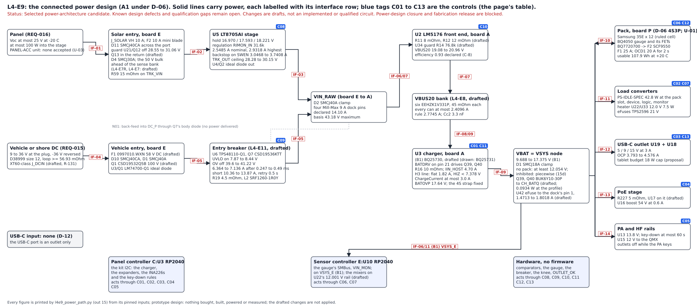

# L4-E9: Layer 4's connected power design and its closure statement (MESHSAT-1357; consolidated 2 October 2026)

**Status:** Selected power-architecture candidate. Known design defects and qualification gaps remain open. Changes are drafts, not an
implemented or qualified circuit. Power-design closure and fabrication release are blocked. This is the owner's review's text
(L4-SH03, 3 October 2026, on the supplier handover), verbatim; it replaces the earlier status phrase, which overstated closure
because D-10's guard-on case, D-16 and E11-40 are design defects that need a supported circuit correction or a supply change, not
bench evidence. Never "complete" or "closed"; an unavailable measurement is never counted as done work.

**Prototype design, desk arithmetic.** Nothing is bought, built, powered or measured, and no board of this set has a layout.
This page edits no generator, registry record, Layer 3 file, `pcb_interfaces.yaml`, `HW-FW-CONTRACT.md` or other record; its
circuit changes are drafts (`apply_gen_sch_e_q1.py`, `apply_gen_sch_e_f1.py`, `apply_gen_sch_e_hotswap.py`, `apply_gen_sch_a_u17.py`, and
L4-E11's `apply_gen_sch_e_entry.py` and `apply_gen_sch_a_guard.py`, which it carries) and its interface
changes are drafts for Layer 5 (`LAYER5-HANDOVER.md`). Every figure below is printed by `l4e9_power_path.py` into
`l4e9_power_path.out` ("out N" is its section), which reads each figure from a generator, a committed netlist, a record's
committed output or a maker's document, each pinned by sha256, and never retypes a figure another record computed. Classes:
MAKER, NETLIST, MODELED, INFERRED, CONDITIONAL (a calculated result on an unwarranted assumption or an open measurement),
ASSUMPTION, PENDING, and SESSION for a choice this record takes.

**Fixed by the owner** (2 October 2026, 11:25; the frame of `OWNER-INSTRUCTION-2026-09-30.md`): battery and solar are
mandatory; HF and the tablet stay; the store is internal to the Peli 1450, no external battery; D-06's 4S3P with the ruled cell
is the baseline and every alternative (A2, the lid pack, the 16.340 V hold, P-03's 200 W, the proposed cell) stays a proposal;
REQ-016 and every other mandatory requirement are preserved; Layer 3 stays closed; 48 to 72 h is an endurance OBJECTIVE,
reported battery-only and solar-assisted separately, with what the tablet's optional charging takes; electrical feasibility
and endurance are separate questions; the approved profile is preserved and any other duty cycle is labelled as such.
Downstream tasks are kept apart from unresolved choices that could overturn the architecture, and an owner does not close a
choice. Layer 4 selects the power architecture and establishes its feasibility; Layer 5 writes the interfaces it creates.

**How the page is built.** Sections 1 to 6 are the consolidated design: one connected diagram, one budget, one change list,
the operating behaviour, the implementation handover and the exit statement against the owner's definition. Sections 7 to 12
carry the analyses and registers they rest on. The inputs of each round and the record's history are in Appendix A; the
traces as first written in Appendix B. Every table of sections 1 to 6 is printed by `l4e9_power_path.py` (out 15 to 21) and
held equal to it by `test_l4e9.py`.

## In short

- **The design.** A1 under D-06: one 4S3P pack inside the case, fed by the panel through board E's LT8705A stage and by the vehicle or shore supply through its ideal diode and the TPS48110-Q1 breaker, ORed onto VIN_RAW, converted once to VBUS20 by board A's LM5176 and once more by the charger onto VBAT, from which every load converter and both outlets run (section 1). The two sources share ONE charger input limit; their capacities do not add. The charger is (B1), TI's BQ25730 with the battery FET pair Q39 and Q40 (two BUK6Y10-30P) and board E's auxiliary domain on VSYS_E over the dock's pin 1, drafted (the board as drawn carries the BQ25731); the system node 9.688 to 17.375 V. A2 stays a proposal. There is no USB-C input.
- **Electrical feasibility** (apart from thermal feasibility and endurance): 14 interfaces, 2 MEET, 10 CONDITIONAL, 2 NOT MET, 0 PENDING (1d). The review's B1 and B2 on (B1)'s draft are D-13 (board E's auxiliary domain on the pack's side of the battery FET) and D-14 (the FET bounded at an unprinted corner, a fallback lowering 18 A for 60 s), and the review of the provisional fixes adds D-15 (the dock's new VSYS contact without branch protection, L4-F03); all three are ADDRESSED IN DRAFTS by L4-E11's fix rounds (board E on VSYS_E, R-177 and R-178; the battery FETs, R-157 with Q42 since L4-E11's round 9 (R-209), sized to an RDS(on) allowance of 21.136 mOhm, the hottest junction at most 150 C held at 23.93 A from 76.25 C for each FET's (Zself + 2 Zmut) at most 40.78 K/W steady for any split with R17 apart (E11-29 as L4-E11 restates it), 18 A for 60 s kept, D-14 CONDITIONAL on E11-29, E11-30 and E11-36 with the three's Ciss against TI's 5 nF OPEN, E11-37; the eFuse U42, R-181, 1.4713 to 1.8018 A, sustained-overload remedy drafted; fault qualification open, E11-38; the held pack current at most 1 mA on the bench, 0.1408 mA its quantified subset; the start bounded to VSYS_MIN or a latch within 3.062 s; since L4-E11's fan-feed round the mixers sit on U22's regulated 12.0 V rail from VSYS_E and the branch is declared 1.3208 A, 89.8 % of U42's least limit, R228 kept; board B's coolers on a 5.1 V feed are a finding for its owner, E11-40, R-190). IF-01 carries the solar entry's single faults from L4-E7's panel-lead derivation, D-10, a stiff 36 V source on the port, and D-11, a reversed panel, and reads NOT MET on D-10's: L4-E7's selected remedies are drafted (the over-voltage cut-off U21 with Q12, the return switch Q13, the port bank C131, C132, C135 and C136, C133 and C134, C71 to C74, C126, R96 and R97 at 0.1 %; R-173, apply_gen_sch_e_solar_guard.py, not applied), D-11 CONDITIONAL on Q13's leakage above +25 C, D-10's cut-off holding and its cold connection inside the absolute ratings at both fault positions but over its margin lines at a connector fault; D-10 is OPEN, an UNRESOLVED PROTECTION DEFECT in the present model, the receiving company's remaining engineering item E-1 (set 29's B6-ENG-1 as P0-7 restates it; round 2's 3.30 uH loop stays WITHDRAWN as a passing floor): the guard's port-level transient (F1 and F2 absolute-rating violations below about 2.4 uH, F1 PV_F 321.9 V MODEL against the port's 100 V; F3 PV_F 83.48 V over the recommended 80 V row at 3.30 uH; F4 the arriving source's slew over its 54 V/us line) and the lower-source back-feed (S1's row (b)); U5's absolute-rating violation corrected in draft by P0-7 (R-240). D-16 is ADDRESSED IN DRAFTS: corrected in draft by P0-7 (R-240, not applied; U5's input sense not used, 0 V by construction; the regulation's sense U23 on the bank), PROVISIONAL in A7's zero-differential output (S3) and in the regulation at 25 V (S4). D-17, decision D-11's all-transmit basis on the final drafts (Layer 9's L9P-F01), is OPEN: it needs 16.214 V rest against REQ-018's 15.5 V pass line; round 7's raised floor is withdrawn as a correction (it narrowed the requirement); its correction, the PA drain-current cap (R-227, R-238), is DRAFTED and PROVISIONAL: C-ALLTX rev 3 at the cap 15.1308 V (MODEL on PRINTED bounds) against the 15.5 V rest, on B-PA1 and B-PA2, with cx46 item 2 NOT CLOSED (remaining engineering RE-2); round 8's fan design-out (R-210 to R-212) is WITHDRAWN (FAN_OK rejected). A residual band between 25 V and the cut-off is named for layer 8 (R-175); D-12, CS116 and CS115 on the panel lead, is resolved in the drafted entry with the guard: CS116 MEETS with the block on and off; CS115 MEETS with the block off and, with it on, is CONDITIONAL on R-174 (the cable's recorded loop current under 15.68 A, or U5's differential measured under 0.3 V). D-01 to D-05 and D-08 are resolved in design, D-06 by L4-E11, D-07 and D-09 superseded (8a); every resolution is a DRAFT or a register row, none applied.
- **Endurance** (apart from feasibility; the approved profile 42.8 W kept): battery-only 2.52 h ENERGY ONLY (2.516 h with (B1)'s pair; 1.73 h with the tablet's window at the start) at room temperature and 1.04 h with the cells at -10 C (energy only); ENERGY AND THERMAL (L4-E12 12c): on the conservative bound C1 sheds the profile at 2.01 to 2.51 h and the run with the shed states lasts 2.52 to 2.95 h; 2.52 h is not an established unshed endurance (2c'). Solar-assisted on the candidate panel's day: first stop at h 6 (06 UTC start) / h 2 (18 UTC start), unserved 1367.4 / 1368.1 Wh at 48 h; the steady load carried 8.0 W at both horizons; with the tablet at most 1.61 W lower (6.4 to 8.0 W). The objective of 48 to 72 h is NOT MET: a deficit of 34.8 W against the profile, +1361.5 / +2094.1 Wh of storage to add; a charger change does not close it. The tablet's optional charging takes at most 38.7 Wh a day. The cold end's solar case is not computed. The proposed cells (PROPOSALS, energy only): the HL18650V 2.11 h, the Saft MP 176065 xtd 1.25 to 1.37 h (MODELLED; 2b').
- **The change list:** 118 changes in application order, none APPLIED (DRAFTED 74; MISSING DRAFT 23; OWED 18; WITHDRAWN 3), each with its board, generator, apply script, dependency and release guard; the release records first (section 3).
- **Thermal feasibility** (apart from both; L4-E12's fix round for the review's B3, B4 and B7): each required mode has its governing LOCAL limit (2c). At REQ-024's +40 C the required state is the heat stage; as ruled the SGP41's Table 4 +50 C governs it, 2.554 W/K on the pack and 2.709 W/K on shore; under CFL-002's C, A or B the cells' hot stop H1, 1.666 and 1.642 W/K (the SGP41's +55 C is an absolute rating, a screen, never a line). The profile's own line is M5, C1's air trigger at REQ-014's +20 C, 1.447 W/K; charging on the design day (52.134 W, a balance) is governed by T4 on the charging cells, 2.025 and 2.525 W/K. T-H1 decides every class (i) and (ii) line; **four lines lie over the modelled capacity, none shown impossible** (a model figure on named coefficient ends, not a physical bound): E3-L lid closed as ruled, a MODELLED SHORTFALL OF THE ANALYSED ARRANGEMENT (M3 short by 0.275 W/K, M4 by 0.430 W/K), and E3-O and E5 on the e-paper's operating row read to cover it unpowered, a MISSING STORAGE QUALIFICATION (M6 short by 0.955 W/K, M7 the whole 21.587 W); no DEMONSTRATED CONFLICT, so no requirement question goes to the owner (OW-10 held for a DEMONSTRATED CONFLICT: every admitted arrangement failed its measurement, or a bound; 2c, section 6).
- **The exit** (section 6, the owner's definition): three decisions, kept apart: the architecture candidate CONDITIONAL; the power-design closure gate BLOCKED (an unresolved material protection or feasibility condition is enough for that); fabrication release BLOCKED; the engineer handoff READY TO START, PROVISIONAL, its omitted dependencies named. Desk work on the open items stops here: they advance only by the prototype qualification route (5d: 14 experiment rows, the purchase list EUR 176.49; NZD 238.72; USD 225.82 of prices read with 9 items unpriced, the send list 8 drafts) or by a design change that removes the dependency (5d names one for each). Layer 4 power closure is not reached on this reading. U-02 is a closure condition T-H1's points decide for every class (i) and (ii) line (as ruled at +40 C a reading of at least 2.905 W/K on the pack and 3.081 W/K on shore; under C 1.804 and 1.767 W/K) plus the storage evidence (its four lines over the modelled capacity a modelled shortfall and a missing storage qualification, no demonstrated conflict); U-04 becomes a downstream qualification test once R-157, R-177 and R-178 are applied and stays a closure condition on the board as drawn; U-01 has a route supported on published evidence for the temperature windows (the Saft MP 176065 xtd), NOT YET ADOPTABLE (current at temperature and the storage dwell await Saft or the limited sample qualification; the owner's approval required), and the ruled 35E is unsuitable on its own published evidence for the margins. Beside them D-13, D-14 and D-15 (the review's B1 and B2 and the provisional fixes' L4-F03; D-14 CONDITIONAL on E11-29, E11-30 and E11-36 with Ciss OPEN; D-15 sustained-overload remedy drafted; fault qualification open, E11-38), D-11 (on Q13's hot leakage) and D-10's cut-off and cold connection are addressed in drafts, none applied; D-10 is OPEN (E-1: the guard's port-level transient and the lower-source back-feed; U5's absolute-rating violation corrected in draft by R-240), D-16 is ADDRESSED IN DRAFTS (P0-7, R-240; PROVISIONAL on S3 and S4) and D-17 is OPEN (its correction the PA drain-current cap, R-227 and R-238, PROVISIONAL; RE-2); the band between 25 V and the cut-off a residual for layer 8 (R-175). The independent checks as given: cx45 on the P0 candidate reads 'P0 CANDIDATE: NOT CONFIRMED.' and cx46, its one targeted recheck, 'P0 RECHECK: CORRECTIONS NOT CLOSED.' (the second negative, which ends the method); twelve findings pass to the receiving company as remaining engineering (records/l4close/REMAINING-ENGINEERING.md); the earlier collaborator's targeted recheck (astra-check-l4close-2) reads NOT YET and is history: the drafts it found defective were corrected after it (L4-E11's fan rail designators and L4-CP01 texts, L4-E7's passing-floor claim, sense model and R96, the escalation rule and the storage soak), none re-reviewed (8e). Each has its exact missing fact and the smallest experiment or manufacturer clarification that resolves it. The findings ledger, as filed: 58 rows, 22 CLOSED, 21 CLOSED AS CONDITIONAL, 11 OPEN DOWNSTREAM, 4 STILL OPEN; the review's E6 found L4-E12:2.1 and 1.2 regressed and L4-E7R:1.6 and 2.4 needing B6's condition, and this record does not claim them closed. **Status:** Selected power-architecture candidate. Known design defects and qualification gaps remain open. Changes are drafts, not an implemented or qualified circuit. Power-design closure and fabrication release are blocked.

## 1. The selected architecture as one connected design

**The one figure**, `L4-POWER-DIAGRAM.svg`, generated by `l4e9_power_path.py --write-svg` (the script refuses to run when the
committed file is not what it generates; out 15). Every source is traced through protection, conversion, charging and
storage to the loads; each power edge carries its interface row (1d), each block its settings and limits, and the blue
tags are the control edges of 1c: which controller, gauge, comparator or firmware rule acts on which block. Parts and settings
marked drafted are not applied to any generator.

### 1a. The blocks

| Block | What | Settings and limits (as read; drafted parts named) |
|---|---|---|
| SRC_PV | Panel (REQ-016) | Voc at most 25 V at -20 C; at most 100 W into the stage; PANEL-ACC unit: none accepted (U-03) |
| SRC_DC | Vehicle or shore DC (REQ-015) | 9 to 36 V at the plug, -36 V reversed; D38999 size 12, loop >= 56.93 mOhm; XT60-class J_DCIN (drafted, R-131) |
| SRC_USB | USB-C input: none (D-12) | the USB-C port is an outlet only |
| SOL_IN | Solar entry, board E | J_SOLAR VH 10 A; F2 10 A mini blade; D11 SMCJ40CA across the port; guard U21/Q12 off 28.55 to 31.06 V; Q13 in the return (drafted); D4 SMCJ30A; the 50 V bulk; ahead of the sense bank; (L4-E7R, L4-E7: drafted); R59 15 mOhm on TRK_VIN |
| DC_IN | Vehicle entry, board E | F1 0997010.WXN 58 V DC (drafted); D10 SMCJ40CA, D1 SMCJ40A; Q1 CSD19532Q5B 100 V (drafted); U3/Q1 LM74700-Q1 ideal diode |
| U5 | U5 LT8705AI stage | hold 16.970 / 17.593 / 18.221 V; regulation RIMON_IN 31.6k; 2.5485 A nominal, 2.9318 A highest; backstop on SWEN 3.0468 to 3.7408 A; TRK_OUT ceiling 28.28 to 30.15 V; U4/Q2 ideal diode out |
| ENTRY | Entry breaker (L4-E11, drafted) | U6 TPS48110-Q1, Q7 CSD19536KTT; UVLO on 7.87 to 8.44 V; OV off 39.6 to 41.22 V; 6.364 to 7.136 A after 0.247 to 0.49 ms; short 10.36 to 13.87 A, retry 0.5 s; R19 4.5 mOhm, L2 SRF1260-1R0Y |
| VINRAW | VIN_RAW (board E to A) | D2 SMCJ40A clamp; four Mill-Max 9 A dock pins; declared 14.10 A; basis 43.18 V maximum |
| FE | U2 LM5176 front end, board A | R11 8 mOhm, R12 12 mOhm (drafted); U34 guard R14 76.8k (drafted); VBUS20 19.08 to 20.96 V; efficiency 0.93 declared (C-8) |
| BANK | VBUS20 bank (L4-E8, drafted) | six EEHZK1V331P, 45 mOhm each; every can at most 2.4096 A; rule 2.7745 A; Cc2 3.3 nF |
| CHG | U3 charger, board A | (B1) BQ25730, drafted (drawn: BQ25731); BATDRV on pin 21 drives Q39, Q40; R16 10 mOhm; IIN_HOST 4.70 A; H3 line: flat 1.82 A, HIZ < 7.378 V; ChargeCurrent at most 3.0 A; BATOVP 17.64 V; the 4S strap fixed |
| VBAT | VBAT = VSYS node | 9.688 to 17.375 V (B1); D1 SMCJ18A clamp; no pack: at least 12.054 V;; inhibited: piecewise (15d); Q39, Q40 BUK6Y10-30P; to CH_BATQ (drafted;; 0.0934 W at the profile); U42 eFuse to the dock's pin 1,; 1.4713 to 1.8018 A (drafted) |
| PACK | Pack, board P (D-06 4S3P; U-01) | Samsung 35E x 12 (ruled cell); BQ4050 gauge and its FETs; BQ7720700 -> F2 SCF9550; F1 25 A; OCD1 20 A for 2 s; usable 107.9 Wh at +20 C |
| LOADS | Load converters | PS-IDLE-SPEC 42.8 W at the pack; slot, device, logic, monitor; heater U22/U33 12.0 V 7.5 W; eFuses TPS2596 21 V |
| USBC | USB-C outlet U19 + U18 | 5 / 9 / 15 V at 3 A; OCP 3.793 to 4.576 A; tablet budget 18 W cap (proposal) |
| POE | PoE stage | R227 5 mOhm, U17 on it (drafted); U16 boost 54 V at 0.6 A |
| PA | PA and HF rails | U13 13.8 V; key-down at most 60 s; U15 12 V to the QMX; outlets off while the PA keys |
| CTL_PANEL | Panel controller C:U3 RP2040 | the kit I2C: the charger,; the expanders, the INA226s; and the key-down rules |
| CTL_SENS | Sensor controller E:U10 RP2040 | the gauge's SMBus, VIN_MON;; on VSYS_E (B1); the mixers on; U22's 12.001 V rail (drafted) |
| CTL_HW | Hardware, no firmware | comparators, the gauge, the; breaker, the knee, OUTLET_OK |

### 1b. The power edges

| Edge | From | To | Through | Interface rows (status) |
|---|---|---|---|---|
| P01 | SRC_PV | SOL_IN | J_SOLAR, D11, F2, the guard (U21, Q12, Q13), D4, the bulk, the sense bank | IF-01 (NOT MET) |
| P02 | SOL_IN | U5 | PV_P to TRK_VIN, U5's input | IF-02 (CONDITIONAL) |
| P03 | U5 | VINRAW | TRK_OUT through U4/Q2 | IF-03 (MEETS) |
| P04 | SRC_DC | DC_IN | the plug, the interconnect, J_DCIN, F1, Q1 | IF-04 (CONDITIONAL) |
| P05 | DC_IN | ENTRY | DC_P into U6/Q7 | IF-05 (CONDITIONAL) |
| P06 | ENTRY | VINRAW | R19, L2 to VIN_RAW | IF-05 (CONDITIONAL) |
| P07 | VINRAW | FE | the dock's pins, U2's input | IF-06 (MEETS), IF-07 (CONDITIONAL) |
| P08 | FE | BANK | VBUS20 | IF-07 (CONDITIONAL) |
| P09 | BANK | CHG | VBUS20 through R16 into U3 | IF-08 (CONDITIONAL), IF-09 (CONDITIONAL) |
| P10 | CHG | VBAT | U3's output, VSYS | IF-09 (CONDITIONAL) |
| P11 | VBAT | PACK | (B1) Q39 and Q40 to CH_BATQ, then R17, A F1, the pack pins, board P | IF-10 (NOT MET) |
| P12 | VBAT | LOADS | the converters' inputs | IF-11 (CONDITIONAL) |
| P13 | VBAT | USBC | U19's input, R138 | IF-12 (CONDITIONAL) |
| P14 | VBAT | POE | R227 to POE_VIN | IF-13 (CONDITIONAL) |
| P15 | VBAT | PA | U13's and U15's inputs | IF-14 (CONDITIONAL) |
| P16 | VBAT | CTL_SENS | (B1) VSYS through the eFuse U42 (TPS16630, 1.47 to 1.80 A, auto-retry) over the dock's pin 1 to board E's VSYS_E: U12, the controller, the mixer fans (drafted, L4-E11 15a, 16e) | IF-06 (MEETS), IF-11 (CONDITIONAL) |
| N01 | VINRAW | DC_IN | the tracker back-feeds DC_P through Q7's body diode (no power is delivered this way) | none: no power is delivered this way |

### 1c. The control edges

| Control | Controller | Acts on | What | Kind |
|---|---|---|---|---|
| C01 | CTL_PANEL | CHG | FW-A01 to A03, A16, A17: RSNS_RAC, IIN_HOST 4.70 A, ChargeCurrent at most 3.0 A, the charger's 175 s watchdog; CHG_INHIBIT (FW-A14) and rules R-a to R-d (R-126); under (B1) EN_OOA 0 at boot, ChargeCurrent 0 A at POR, R-b' (R-158) | firmware |
| C02 | CTL_PANEL | LOADS | the expanders (FW-A08): SLOT_EN, DEV_EN, HEAT_EN; the margin hold (R-138, R-139); MAIN and PI_KILL (FW-A10 to A12) | firmware |
| C03 | CTL_PANEL | USBC | PD_SW_EN AND OUTLET_OK (FW-A06); the tablet's window (a proposal) | firmware and hardware |
| C04 | CTL_PANEL | POE | POE_SW_EN AND OUTLET_OK (FW-A06); U17 read on R227 (FW-A09, R-27) | firmware and hardware |
| C05 | CTL_PANEL | PA | the key-down rules K1 to K5 and C4 (FW-A05, D-11): at most 60 s, the rest floors 15.5 and 12.4 V (REQ-018); K4 with the outlets and the heater off while keyed (the fans never on it: FAN_OK and the fans' cut are rejected, R-210 to R-212 WITHDRAWN; D-17's correction the PA cap, R-227 and R-238) | firmware |
| C06 | CTL_SENS | PACK | the gauge's SMBus (FW-E01): its ranges relayed to the charger by the host; SHUTDOWN for storage (FW-E09); HWD 10 s | firmware |
| C07 | CTL_SENS | LOADS | the mixer fans (FW-E07), the Geiger supply (FW-E08), VIN_MON for FW-A16 (FW-E04) | firmware |
| C08 | CTL_HW | U5 | the hold (FBIN divider R8, R9 at 0.1 %), the regulation (IMON_IN, RIMON_IN 31.6k), the backstop comparators on SWEN, off below 2.662 V of TRK_LDO33 | hardware |
| C09 | CTL_HW | ENTRY | the TPS48110-Q1's own UVLO, OV, breaker and short-circuit trip; the LM74700-Q1 blocks reverse current | hardware |
| C10 | CTL_HW | FE | U34's restart guard (R14 76.8k: 6.754 to 7.139 V); R11's average and R12's cycle-by-cycle limits | hardware |
| C11 | CTL_HW | CHG | the H3 line on ILIM_HIZ (the corrected knee), the charger's VINDPM, ACOV, BATOVP and SYSOVP; under (B1) BATDRV drives Q39 and Q40 (LDO mode below VSYS_MIN) | hardware |
| C12 | CTL_HW | PACK | the BQ4050's protections on its FETs (COV, CUV, OCC 5 A, OCD, SCD 60 A, UTC, OTC); the BQ7720700 drives F2 | hardware (the gauge's own firmware) |
| C13 | CTL_HW | USBC | OUTLET_OK = NOT (TR_APRS AND PA_EN), A:U30, drops both outlets while the PA keys; U18's OCP | hardware |

There is **no separate shore entry** (shore is J_DCIN) and **no USB-C input**: the USB-C port is a power-only outlet (D-12).

### 1d. The interface rows (out 4: every figure, check and source)

Modes: PS-IDLE-SPEC (42.8 W at the pack terminals), PS-ALLTX (203.8 W plan, 272.0 W high) and the PA keyed alone at 113 W
(162.3 W) (rv-pwr's figures, the boards at `1f614233`; on the current design, Layer 9's R1, out 30: 43.301, 205.652 and 274.291,
163.465 W as drawn, 44.576, 209.89 and 292.027, 166.149 W DRAFTED on the final drafts, Layer 9's round 2), charging at the window (the stage takes at most 53.42 W in at the hold under L4-E7R's regulation; 93 W out at the
window is a ceiling), and the tablet outlet (45 W on PS-TYP, 112.3 W plan). Thermal basis: the worst inside air, 62.1 C lid
closed (59.2 C lid open); at the margins, since L4-E12's fix round, each required mode's governing local limit (2c): at M7's
maker-stated +70 C line 2.159 W/K (lid open, fans) the mixed air 67.55 C (E3-O) and 70.00 C (E5 under the hold), screens at the
mixed air; at LO-01a's floor with no hold 71.25 and 76.25 C (L4-E10's corner plus the ballasts). **The system node:** 10.0 to
16.884 V as drawn; under (B1) 9.688 to 17.375 V (the supplement floor at OCD1's 20 A; the held top), at least 12.054 V with no
pack and adequate input (L4-E11 15d).

| Row | Interface | Voltage, both sides | Current asked / available (modes) | Losses | Thermal assumption | Protection, each side | Settled by | Status (class) |
|---|---|---|---|---|---|---|---|---|
| IF-01 | panel to the solar entry | at most 25 V at -20 C; PANEL-ACC's A-1 Vm20 + U_V at most 25.000 V at -20 C and 1000 W/m2 (24.1505 V on the typical rows, margin 0.8495 V; Voc25 20.315 to 22.156 V) / D4 standoff 28 V on TRK_VS, reached by a unit at A-1's ceiling only above 8574 W/m2 at n 2; under CS101 the input at most 27.82 V; TRK_VS 44.25 V and PV_P 44.74 V at the capability scenario | hot short circuit 6.802 A with the sheet's tolerance; PANEL-ACC's A-3 (a) 3.987 A, (b) 8.1817 A, (c) 13.82 A at the design level 2111.4 W/m2 / F2 10 A; J_SOLAR's VH 10 A with the lead at AWG 16 (R-29); A-3(c) over JST VH's printed 10 A (R-148); under CS101 the filtered ripple at most 0.0585 A against a 0.1130 A margin | the lead about 0.0465 Ohm; the bank 0.5262 Wh a day | the entry at 62.1 C inside air; the bulk up to 4.45 times its ripple rating under CS101 (M2 reads it) | none / F2, the 50 V bulk ahead of the bank, D4 and C71 to C74, the INB filter (L4-E7R, drafted) | l4e O-1, L4-E7R (accepted), L4-E13 (accepted; PANEL-ACC), L4-E7's panel-lead derivation (set 27) and its solar-fault remedies (check 5) | NOT MET (CONDITIONAL): D-10, an UNRESOLVED PROTECTION DEFECT in the present model, the receiving company's remaining engineering item E-1: the guard's port-level transient (F1 and F2 absolute-rating violations below about 2.4 uH, F1 PV_F 321.9 V MODEL against the port's 100 V; F3 PV_F 83.48 V over the recommended 80 V row at 3.30 uH; F4 the arriving source's slew over its 54 V/us line) and the lower-source back-feed (S1's row (b)); U5's absolute-rating violation corrected in draft by P0-7 (R-240) (L4E7-P0SOL.md section 5: "U5's pins" leave the NOT MET list; set 29's reading, round 2's 3.30 uH WITHDRAWN as a passing floor with U5's pins -0.3021 V at a connector fault, is this page at 7070f106), and the cold connection's 10 % margin lines at a connector fault (inside the absolute ratings); D-11 (a reversed panel) and D-10's cut-off addressed in drafts by the solar guard (R-173, not applied; D-11 CONDITIONAL on Q13's leakage above +25 C); CS116 and CS115 MEET with the guard on and off (D-12, R-174); the band between 25 V and the cut-off a residual for layer 8 (R-175); no unit bought or measured (R-35), A-3(c)'s rating (R-148), M3's n (R-149), the lead at AWG 16 (R-29), the loop's typical rows (break-even 2.51 times), the bulk's temperature, the bank's pulse capability |
| IF-02 | PV_P through U5 to TRK_OUT | hold 16.970 / 17.593 / 18.221 V, at most 25 V; SWEN off below 2.662 V on TRK_LDO33 / ceiling 28.28 to 30.15 V | the stage's input at most 100 W (REQ-016) / the regulation 2.5485 A nominal, 2.9318 A highest (44.84 and 53.42 W in) on the drafted RSENSE1 sense (out 4, L4-E7R); under P0-7's arrangement (R-240, not applied) the regulation 2.5378 A nominal, 2.9212 A highest with U23 on the bank and R16 34.0k, the margin to the trip 0.3645 A, correlated, check (b)'s allowance 1.052 ms, A7 at zero differential PROVISIONAL (L4E7-P0SOL.md section 5); the backstop 3.0468 to 3.7408 A at 25 V; the static bound 93.5521 W (out 4), 93.5783 W with U23's VIN+ currents added under R-240; the regulation's corner 73.3436 W | stage 0.93 DECLARED (C-8) | U5's junction about 105.4 C (INFERRED) against the I grade's 125 C | the regulation, the backstop on SWEN inside 1.087 ms after the filter's 0.4205 J / U4 | l4e7, l4e5, L4-E7R (accepted) | CONDITIONAL (CONDITIONAL): G_CM and U18's VIN+ bias (break-evens 168.8 % and 22.0 mA), the 0.1 s interpretation |
| IF-03 | TRK_OUT through U4/Q2 to VIN_RAW | at most 30.15 V / VIN_RAW to the 43.18 V basis with TRK_OUT at 0 (the selected OV maximum 41.22 V) | 4.22 A at H3's lowest settle at the window / declared 10.33 A | Q2 | 62.1 C inside air | the stage / U4 blocks | l4e5, this record | MEETS (MAKER/NETLIST), with C26 and C27 re-rated (as drawn 121 % of 25 V) |
| IF-04 | vehicle and shore into DC_F and DC_P | 9 to 36 V at the plug with CS101's 2.83 V peak, reversed to -36 V / the selected entry's OV off above 39.6 / 40.36 / 41.22 V (as drawn the LM5069's 37.78 / 40.09 / 42.49 V); D10 44.4 V either way at 25 C, 42.4 V at -20 C on a typical coefficient (CONDITIONAL), above the OV maximum both ways | in service at most 5.983 A from a 9.00 V plug; the breaker 6.364 / 6.8 / 7.136 A; a stiff source's fault at most 900 A (the interconnect's specified floor; 569.8 A with the drawn cable) / F1 0997010.WXN 10 A (7.3 A at its 80 C column), 1000 A at 58 V DC; Q1 17 A; J_DCIN a 30 A class and the interconnect at least 20 A continuous (D-06, resolved in design) | the plug to DC_P 94.47 mOhm hot, 3.382 W at 5.983 A; Q1 at most 0.487 W at 7.136 A | Q1's junction at most 86.4 C; the interconnect's elements at 20 A where installed | supply's own / F1 in a 20 A holder, D10, U3/Q1 (CSD19532Q5B), D1, the entry's UVLO and OV | d8dec31, this record (part A, out 12), L4-E11, l4e5 | CONDITIONAL (CONDITIONAL): D10's cold coefficient, the four-wire loop acceptance (R-130), the interconnect's makers' ratings and F1's clearing I2t at 900 A (R-113, R-115, R-129 to R-132) |
| IF-05 | DC_P through the selected entry (TPS48110-Q1, CSD19536KTT, R19 4.5 mOhm) and L2 to VIN_RAW | D1 clamp 64.5 V; 8.971 V before any current and 8.435 V at 5.983 A from a 9.00 V plug / U6 VS 80 V (100 V absolute), its pins at most 18.36 V against 20 V; Q7 100 V; the UVLO on at most 8.44 V, off at most 7.95 V | in service 5.983 A, up to 7.136 A under the breaker; the start 0.382 to 1.219 A for at most 2.5 ms; starts into a resistive fault (0.704 of the derated chart) and into a hard short (73.4 A, 0.743); a hard short in service 13.87 A plus VIN x 8.31 us / L / the breaker 6.364 / 6.8 / 7.136 A after 0.247 / 0.37 / 0.49 ms, the short circuit 10.36 / 12.04 / 13.87 A filtered, retry 0.5 s; Q7's derated IDM 178.2 A; L2 98.2 C at 7.14 A against 105 C | DC_P to VIN_RAW 47.87 mOhm hot, 1.714 W at 5.983 A; Q7 0.22 W | the 0.4454 derating holds while Q7's case stays under 108.19 C | D1 / D2, the breaker, the UVLO and OV, the slew-limited start | L4-E11, this record (E11-19, out 12) | CONDITIONAL (CONDITIONAL): the in-service margin on the front end's efficiency at least 0.88021 (E11-06), the fault starts on the derating and the transconductance bound (E11-17), the hard short in service OPEN on the loop's inductance (E11-20); as drawn the LM5069 cannot start from a 9.00 V plug |
| IF-06 | VIN_RAW over the dock to board A | the corrected knee's certain HIZ 7.378 V (solar) to 30.15 V; vehicle 9 to 36 V at the plug (8.148 V at 5.983 A from 9.00 V); at most 41.22 V (43.18 V the basis); under (B1) the dock's pin 1 carries VBAT (VSYS) to board E's VSYS_E, 9.688 to 17.375 V, 1.0 A on one 813 contact (L4-E11 15a) / U2 60 V | in service at most 5.983 A (a 9.00 V plug); fault at most 11.65 A (13.315 A at 7 mOhm) / declared 14.10 A, four 9 A pins | the dock's contacts | the pins about 6 K over air at 14.10 A (IF-AE-DOCK) | the entry, D2 / D2, U34 | l4e5, l4e6, IF-AE-DOCK, L4-E11 | MEETS (INFERRED); A-N1 a recorded residual |
| IF-07 | VIN_RAW through U2 to VBUS20 | 7.378 to 43.18 V / 19.08 to 20.96 V, bound 23.40 V | 4.964 A asked through R11 / 4.986 A stacked minimum at 62.1 C with C-1's taps; highest permitted 7.262 A; R12 peak limit 8.06 A over a 6.50 A service peak | front end 0.93 DECLARED (at 8.1 V at least 0.88021 for the entry's margin) | FETs at most 130 C on the assumed 50 C/W (C-3); L1 at most 85 C (C-5); R11 68.8 to 77.5 C | U34 (R14 76.8k: 6.754 to 7.139 V, 0.239 V under the certain HIZ), D2 / R11, R12, no hiccup, OVP; no clamp on VBUS20 (S-111) | l4e4, l4e5, l4e6, r11dep, s120, L4-E11 | CONDITIONAL (CONDITIONAL): C-7, V-A07, C-5, C-3; as drawn the guard falls at up to 8.309 V, over the 9.00 V plug's 8.148 V |
| IF-08 | VBUS20's bank | 23.40 V bound / the cans' 35 V | every can at most 2.4096 A (R11 8 mOhm), 2.7661 A (7 mOhm) / the rule's 2.7745 and 2.7709 A | ballasts at most 2.09 W (0.0093 W at nominal parts), in the energy and thermal budgets once | the cans' rise a bench reading (lifetime); the cold ESR envelope INFERRED; the ballasts' heat at most 1.25 K on the inside air at T-H1's floor | R12, R11 / the ballasts | l4e8 (accepted) | CONDITIONAL (CONDITIONAL): lifetime, the cold envelope, the 7 mOhm fallback |
| IF-09 | VBUS20 through U3 to VBAT | 19.08 to 20.96 V / U3 32 V absolute; VBAT 10.0 to 16.884 V as drawn, 9.688 to 17.375 V under (B1) (at least 12.054 V with no pack); SYSOVP 19.0 to 20.0 V | the window needs 4.517 A / U3 minimum 4.537 A (C-7); 84.5 to 99.6 W at VBAT; charge at most 3.0 A; with no usable pack 29.09 to 42.52 W at a 9.00 V plug against the shed warm-up's 28.12 W | U3 0.9733 INFERRED | 62.1 C inside air; the charge only inside the cells' 0 to 45 C window (the gauge) | H3 line, IIN_HOST, VINDPM, ACOV / BATOVP 17.64 V, SYSOVP, the gauge's OCC 5 A; rules R-a to R-d | l4e4, l4e5, s120, FW-A02, L4-E11 | CONDITIONAL (CONDITIONAL): C-7; U-04 (E11-05, E11-06, E11-09, E11-22, E11-23) |
| IF-10 | VBAT and the pack | 10.0 to 16.884 V as drawn, 9.688 to 17.375 V under (B1) / D1 standoff 18 V, the pack FETs 30 V, under (B1) the pair Q39 and Q40 30 V | PS-IDLE-SPEC 2.5 to 4.3 A; the PA keyed at 113 W 16.6 A at 10.0 V; decision D-11's all-transmit basis at 18 A from a 13.9 V stack as drawn, 14.77 V on the final drafts, needing 16.214 V rest against REQ-018's 15.5 V (D-17 OPEN, its correction the PA drain-current cap R-227 and R-238, PROVISIONAL); a dead pack's charge under R-b at most 21.22 W / declared 10 A continuous, 18 A peak; OCD1 20 A for 2 s; XT60 30 A | 22.5 mOhm path | the cells 0 to 45 C charge, -10 to 60 C discharge (REQ-046); FEA-008 not closed (L4-E10: approach (II), CONDITIONAL); F2 near +60 C at 18 A (PWR-F12); Q2's diode under R-b at most 124.9 C | D1, A F1 / BQ4050, BQ7720700, F1, F2 | pcb_pack_protection.yaml, POWER-THERMAL 7, FEA-004, L4-E10, L4-E11 | NOT MET (CONDITIONAL): D-17, decision D-11's all-transmit basis on the final drafts over REQ-018's 15.5 V (its correction drafted, R-227 and R-238, PROVISIONAL on B-PA1 and B-PA2; the fans' design-out R-210 to R-212 WITHDRAWN); PWR-F12, U-01, R-b's case (i) and board P's copper (E11-22) |
| IF-11 | VBAT to the load converters | 10.0 to 16.884 V as drawn, 9.688 to 17.375 V under (B1) / the converters assumed to run to 10.0 V (9.688 V under (B1) in supplement at OCD1's current, not shown) | PS-IDLE-SPEC 33.1 to 82.8 W (42.8 W plan; 43.301 W as drawn, 44.576 W DRAFTED); PS-ALLTX 168.9 to 272.0 W (203.8 W plan; 205.652 / 274.291 W as drawn, 209.89 / 292.027 W DRAFTED); 8.4 W undocumented / each converter's own rating (pwr_budget.py) | the converters' floors | each required mode's governing local limit (2c, U-02); at M7's maker-stated line 2.159 W/K (lid open, fans) E3-O's mixed air 67.55 C (27.086 W) and E5's 70.00 C under the hold (21.587 W), screens at the mixed air, the ballasts counted once; the design as it stands (LO-01a's floor, no hold) 71.25 and 76.25 C | eFuses (TPS2596 21 V against SYSOVP 20.0 V) / each converter | pwr_budget, load_trace, POWER-THERMAL, L4-E12 | CONDITIONAL (ASSUMPTION): U-02 (T-H1's points per required mode and the storage evidence; four lines over the modelled capacity, a modelled shortfall and a missing storage qualification, no demonstrated conflict; the hold's reference, the fans, placement); the 8.4 W; the converters' floor |
| IF-12 | VBAT to the USB-C outlet | VBAT 10.0 to 16.884 V (9.688 to 17.375 V under (B1)) into U19 / 5, 9 and 15 V contracts | 3 A each; with PS-TYP 112.3 W plan, 7.8 A at 14.4 V / trip 3.793 to 4.576 A; receptacle 5 A; J_USBC_OUT unrated | U19 0.93 | R138 its own 3.5 K at the trip (L4-E4); 62.1 C inside air | OUTLET_OK, C2 / U18 OCP and OVP | l4e4 | CONDITIONAL (ASSUMPTION): VI(TRIP)'s row, the header |
| IF-13 | VBAT through R227 to the PoE stage and U17 | VBAT 10.0 to 16.884 V (9.688 to 17.375 V under (B1)), 20.135 V at the pack-open bound, 29.2 V at D1's pulse / 54 V; U17 on VBAT and POE_VIN, common mode at most 20.135 V against 36 V (as drawn 54 V against 40 V); POE_VIN at most 33.77 V at a hard connect; 0.072 V under VBAT in the boost current-limit case only | 0.6 A at 54 V; 3.682 A at the stage's input at 10.0 V, 14.33 A at its fault bound; a buck fault 11.71 A peak, 10.71 A RMS / R227 5 mOhm 3 W; 18.59 and 72.38 mV against 81.92 mV (16.384 A); a saturated sample is not damage (40 V differential) | U16 0.88; R227 at most 0.0685 W in service, 0.58 W in a buck fault, 2.879 mJ nominal at a hard connect (the maximum unresolved) | 62.1 C inside air | OUTLET_OK / U16's limits, TPS23861 | HF-F02, this record (part A, B3) | CONDITIONAL (CONDITIONAL): R227's pulse rating and capacitance envelope (R-101), L10's L(I) at temperature (R-120, R-121) |
| IF-14 | VBAT to the PA rail | VBAT 10.0 to 16.884 V (9.688 to 17.375 V under (B1)) into U13 / 13.8 V | the drain 5.4 to 8.2 A uncharacterised; the pack 16.6 A at 10.0 V / declared 5 / 6 A, the stage's loop 7.2 to 9.5 A | U13 0.93 | key-down at most 60 s, the flange gated at +75 C and cut at +85 C (D-11, PROVISIONAL) | the K rules, OUTLET_OK / the stage | POWER-THERMAL 7.2, FEA-004 | CONDITIONAL (ASSUMPTION) |

**What the rows show about the stages together:**
- With the corrected knee the in-service maximum is 5.983 A from a 9.00 V plug (VIN_RAW 8.148 V), 6.4 % under the selected
  breaker's lowest 6.364 A, while the front end's efficiency there is at least 0.88021 (L4-E11; E11-06 measures it); on
  L4-E5's drawn line at VIN_RAW 9 V it was 4.629 A against the LM5069's 4.85 A.
- R11 8 mOhm (L4-E4) carries U3's 4.964 A with +0.023 A at 62.1 C with C-1's full taps; H3's pin path (5.095 A on a stiff
  26.50 to 27.24 V source) holds on R11 alone and needs V-A07 for the full taps (else 7 mOhm, which changes nothing else).
- R12 12 mOhm (L4-E6) bounds L1 and the FETs at the highest permitted current, 1.56 A over H3's 6.50 A service peak.
- The bank (L4-E8) holds every can at the same highest permitted current, and goes in only with R12; its ballasts are a loss on
  the charge path, counted once in the energy and thermal budgets (section 2).
- L4-E7R's regulation (2.9318 A at its highest) sits under its backstop's lowest trip (3.0468 A at 25 V) when the regulation's
  unprinted values are inside the joint assumptions, and the filtered CS101 ripple (0.0585 A) under that 0.1130 A margin; the
  stage takes at most 53.42 W in at the hold, so the 93 W out at the
  window that U3's IIN_HOST was sized for is a ceiling, not an expectation.
- **Stage resolutions that reached another stage:** L4-E5's raised tracker ceiling on Q1 in reverse (round 1; Q1 to the
  CSD19532Q5B); the vehicle entry's OVLO moved up by R22 and R23 (round 2): the raised maximum, 43.18 V, is re-checked on F1
  (58 V), Q2 and U2 (60 V), U4 (75 V), C26 and C27 (re-rated to 50 V) and D10 (44.4 V at 25 C); the LM5069's replacement
  (update round) moves the OV maximum to 41.22 V (the checks keep the 43.18 V basis), puts up to 7.136 A continuously through Q1
  (86.4 C) and F1 (its 7.3 A column), and changes the knee and the restart guard on board A (R-03, R-124).

## 2. The budget: one input set (out 16)

One set of inputs, each read by the script from its pinned file: the approved profile PS-IDLE-SPEC (`load_trace.out`, 42.8 W
at the pack terminals over 39 loads, kept as approved; any other duty cycle is labelled as such), the power budget
(`pwr_budget.out`), the energy replay (`l4e_replay.out`) and L4-E10's chain for the stores, L4-E7R's accepted stage and L4-E13
for the panel, L4-E12 for the modes at the margins, L4-E11 for the source-only state and the tablet's service budget
(`tablet.out`, a PROPOSAL). The component revisions are the drafted selection of section 3 (none applied). **Electrical
feasibility, thermal feasibility and endurance are separate questions:** 2a is the electrical budget of each mode; 2c and 2c'
are the thermal (each required mode against its governing local limit, L4-E12's fix round); 2b is endurance, reported
battery-only and solar-assisted separately, each runtime labelled ENERGY ONLY or ENERGY AND THERMAL.

### 2a. Power per mode

| Mode | State | The loads | At the pack or VBAT | Auxiliaries | Into the case | Leaves the case | Read from |
|---|---|---|---|---|---|---|---|
| M1 | PS-IDLE-SPEC, the approved profile (the tablet not charged) | 36.5 W at the load pins; 6.3 W in the converters and the distribution | 42.8 W (low 33.1, high 82.8 W, every load at its maximum); on the current design 43.301 W as drawn and 44.576 W DRAFTED (Layer 9's R1, out 30) | inside the 42.8 W: 4 fans 3.128 W at the pack; 8.4 W of loads with no document (tier T); the board logic rows carry the power path's quiescent draws (not itemized by part); with (B1), the battery FET pair 0.0934 W more on battery (0.218 % of the pack's output; drafted) | 43.4 W (the pack's I2R 0.59 W inside), plus the pair's 0.0934 W with (B1) | 0 W | pwr_budget.out, load_trace.out, L4-E12 out 8c, L4-E11 out 15c |
| M2 | the same with the tablet charged in its window (a PROPOSAL: 13 to 15 UTC, the outlet capped at 18 W) | the outlet 18 W for 2 h, at 0.93 through U19 | 42.8 W plus 19.4 W at VBAT for 2 h: 38.7 Wh a day | the outlet converter's idle 1.09 to 1.44 W only while enabled (on all day: 73.4 Wh a day) | 43.4 W plus the converter's 1.4 W in the window | 18 W to the tablet in the window | tablet.out (l3batt) |
| M3 | E3-O: the heat stage on shore (PS-SURV-R), every radio C1 leaves on | one module running; the shed set off | 23.272 W at the pack | 2 fans 2.000 W at the pack; the ballasts at most 2.09 W (the bound's worst corner) | 24.996 W on shore (the front end's and the charger's loss on the loads), 27.086 W with the ballasts | 0 W | L4-E12 out 2a, 8a |
| M4 | E5: the hold at the +60 C dwell, on shore | 14.671 W at the load pins; 3.445 W in the converters; 0.036 W in the distribution | 18.152 W at the pack | 2 fans 2.010 W at the pack; the ballasts at most 2.09 W | 19.497 W on shore (+1.345 W), 21.587 W with the ballasts | 0 W | L4-E12 out 8a |
| M5 | source-only at a 9.00 V plug, no usable pack (state S4; U-04) | P1 at VBAT 19.57 W plan (11.17 to 35.24 W), at most 20.51 W by the rule; the shed warm-up P2 28.12 W plan | the source delivers 29.09 to 42.52 W at VBAT | the entry's loop 5.095 W at 5.983 A (on the source's side); the front end at least 0.88021 there | 23.94 W at the rule's bound (the loads, U3 at 0.9733 and the front end at 0.88021) | 0 W | L4-E11 out 3g, 3h |
| M6 | solar charging at the window (the source's side) | the stage takes at most 53.42 W in at the hold (44.84 W nominal) under L4-E7R's regulation | into VBUS20 through U4/Q2 | the stage's own drive and quiescent 1.27 W (from the panel); the sense bank 0.5262 Wh a day; the ballasts at most 2.09 W while U3 runs (0.0093 W at nominal parts) | a charge on shore adds 3.446 W | 0 W | L4-E7R, L4-E13 out (A-2), L4-E8, L4-E12 out 2d |

**The quiescent draws** of the power path are not itemized part by part in any record: the profile carries them inside the
declared board rows (board A's logic and board E's controller and sensors), the solar stage's own drive and quiescent power
comes from the panel (M6), and the outlet converter idles only while it is enabled (M2). An itemized list would move the
profile by the parts' printed quiescent currents; it is not counted here as done.

### 2b. Energy: battery-only and solar-assisted, separately

| Case | Cell | Basis | The store | Runtime, the tablet not charged | With the tablet's window | The steady load each horizon carries | Read from |
|---|---|---|---|---|---|---|---|
| B1 | ruled 35E, D-06 4S3P | battery-only, room temperature (the chain's +20 C) | 107.9 Wh usable | 2.52 h ENERGY ONLY (2.516 h with (B1)'s pair); ENERGY AND THERMAL (L4-E12 12c, the bound, C 8 to 10 kJ/K): C1 sheds the profile at 2.01 to 2.51 h, the run with the shed states 2.52 to 2.95 h; unshed for its whole energy only from a constant 0.960 W/K | 1.73 h (the window at the start, the worst placement; energy only) | 2.25 W over 48 h, 1.50 W over 72 h | l4e_replay.out 2 (MODELED); L4-E12 out 12c |
| B2 | ruled 35E | battery-only, the cells at -10 C (the 35E's discharge floor) | 44.5 Wh usable | 1.04 h ENERGY ONLY (1.037 h with (B1)'s pair) | 0.72 h (energy only) | 0.93 W over 48 h, 0.62 W over 72 h | l4e_replay.out 2 |
| B3 | ruled 35E | battery-only, the cells at -5.52 C (REQ-024's -20 C with the kit's heat, LO-01b) | 54.0 Wh usable | 1.26 h ENERGY ONLY | 0.87 h (energy only) | 1.12 W over 48 h, 0.75 W over 72 h | L4-E10 out 9c |
| S1 | ruled 35E | solar-assisted, room temperature, the candidate panel's day (350.0 Wh into the stage, L4-E7's first round) | first stop at h 6 (06 UTC start) / h 2 (18 UTC start) | unserved 1367.4 / 1368.1 Wh at 48 h (33.4 % of the profile's 2054.4 Wh served at most), 2103.9 / 2104.6 Wh at 72 h (31.7 % served) | unserved at most 77.4 / 116.1 Wh more at 48 / 72 h (38.7 Wh a day for 2 / 3 windows; INFERRED bound); the first stops unchanged (they precede the 13 UTC window) | 8.0 W at both horizons; with the tablet at most 1.61 W lower (6.4 to 8.0 W) | l4e_replay.out 12 (MODELED; the corrected path, WE) |
| S2 | ruled 35E | solar-assisted, L4-E7R's accepted stage (336.6 Wh a day at the nominal hold) | as S1 (not re-run); the drafted solar guard takes 1.32 Wh more of SC-37's 336.6 Wh a day (0.39 %; 0.217 W at the regulation's highest current; L4-E7's remedies, check 5) | unserved at most 26.8 / 40.2 Wh more than S1 (13.4 Wh a day less into the stage; INFERRED bound) | as S1, plus S1's tablet bound | 7.4 to 8.0 W; with the tablet 5.8 to 8.0 W (INFERRED bounds) | L4-E13 check 4, l4e_replay.out 12 |
| S3 | ruled 35E | solar-assisted at the cold end | NOT COMPUTED: no cold-day sun trace is held, and the cells' temperature through the day is not modelled | not computed | not computed | 3.3 W if the steady load scales with the store as at room temperature (44.5 Wh against 107.9 Wh; INFERRED, an estimate, not a run) | this record (the method stated) |
| S4 | ruled 35E | solar-assisted: whether the sealed case admits the charge (the cells at or under the gauge's 42 C start) | the solar rows assume the pack accepts charge at +20 C | with the profile running, on the bound only below -30.6 C ambient (L4-E10); on SC-37's design day the charge's heat is 52.134 W (L4-E12 12b, the balance with the ballasts): T3's start needs 1.8102 to 2.1997 W/K (readings 1.8892 to 2.3150 W/K), T4 on the charging cells governs a running charge at 2.025 to 2.525 W/K (readings 2.123 to 2.677 W/K), class (i) at the optimistic ends and (ii) at the conservative (12e); T-H1's M8 and M9 decide (12d) | the window adds 1.4 W of heat in the case | where the case does not admit the charge the battery-only rows apply: S1 to S3 are CONDITIONAL on T-H1 (U-02) | L4-E10 out 10c, this record 2c (out 16e) |
| P1 | proposed HL18650V (a PROPOSAL, U-01; not adopted) | battery-only, room temperature (L4-E10's chain at +25 C) | 90.2 Wh usable | 2.11 h ENERGY ONLY | 1.45 h (energy only) | 1.88 W over 48 h, 1.25 W over 72 h | L4-E10 out 9c |
| P2 | proposed HL18650V (a PROPOSAL) | battery-only at the cold end (brackets, ASSUMPTION) | 45.1 to 69.6 Wh with the cells at -5.52 C; 37.2 to 54.1 Wh from a cold start at -20 C | 1.05 to 1.63 h; 0.87 to 1.26 h ENERGY ONLY | less, by the same arithmetic | 0.94 to 1.45 W over 48 h at -5.52 C | L4-E10 out 9c |
| P4 | the Saft MP 176065 xtd as 4S1P (a PROPOSAL, U-01's route supported for the temperature windows; not yet adoptable, not adopted) | battery-only, room temperature (L4-E10's chain, aged 0.80) | 53.5 to 58.8 Wh usable (81.76 Wh nominal; MODELLED: Saft prints no curve; the current at temperature AWAITING, 10g) | 1.25 to 1.37 h ENERGY ONLY | 0.86 to 0.95 h | 1.11 to 1.22 W over 48 h, 0.74 to 0.82 W over 72 h | L4-E10 out 11c (check 6) |
| P5 | the Saft MP 176065 xtd (a PROPOSAL) | solar-assisted, room temperature; and the cold end | not run by the replay; no cold capacity is printed | not computed | as S1's bound | 4.0 to 4.4 W if the steady load scales with the store (INFERRED estimate) | L4-E10 out 11c |
| P3 | proposed HL18650V (a PROPOSAL) | solar-assisted, room temperature | not run by the replay | not computed | as S1's bound | 6.7 W if the steady load scales with the store (INFERRED estimate); every storage shortfall grows by at most 17.7 Wh | L4-E10 out 9c |

**Endurance, apart from electrical feasibility.** The objective of 48 to 72 h is NOT MET by A1 (DR-01): the steady load the
store and the sun carry through either horizon is the replay's 8.0 W against the approved profile's 42.8 W, a deficit of
34.8 W (81 % of the profile), and the least storage to add is +1361.5 / +2094.1 Wh at 48 / 72 h. **A charger change does not
close it:** the deficit is the store and the day's harvest, not a conversion efficiency. No mandatory function is reduced to
narrow it, and the profile is not lowered. The tablet's optional charging lowers what is carried by at most its 38.7 Wh a
day (S1, S2). The cold end's solar-assisted case is not computed (S3): no cold-day sun trace is held. **(B1)'s battery FET
pair Q39 and Q40** (two BUK6Y10-30P; U-04's selected charger after L4-E11's fix round, drafted) takes 0.0934 W at PS-IDLE-SPEC
on battery, 0.218 % of the pack's output: the battery-only runtimes move by less than their printed precision (2.516 h,
1.037 h), and no other runtime figure changes. **Every runtime is labelled** (the review's B7): 2.52 h is ENERGY ONLY, the 107.9
Wh at the profile's 42.8 W; coupled to C1 on L4-E12's conservative bound (ENERGY AND THERMAL, 12c) the kit sheds the profile at
2.01 to 2.51 h and runs 2.52 to 2.95 h with the shed states, so 2.52 h is not an established unshed endurance (2c'). **U-01's
route** (L4-E10, checks 4 to 6 and its fix round for the review's B5 at `ee09aa09`), the Saft MP 176065 xtd as 4S1P, supported on
published evidence for the temperature windows and NOT YET ADOPTABLE (current at temperature and the storage dwell await Saft
or the limited sample qualification), stands beside the ruled pack as a labelled PROPOSAL (P4, P5; 2b'): 53.5 to 58.8 Wh
usable, 1.25 to 1.37 h battery-only (energy only, MODELLED), against 81.76 and 144.72 Wh nominal; the ruled 35E
stays the baseline, and it is UNSUITABLE on its own published evidence for E3-O, E5's dwell and the +71 C and -33 C storage rows
(section 6).
**Whether the sealed case admits the charge (S4):** the solar-assisted rows assume the pack accepts charge; with the profile
running the cells reach the gauge's 42 C start on the conservative bound above -30.6 C ambient, so the solar part of S1 to S3 is
CONDITIONAL on T-H1's M8 and M9 (2c): the charging heat is a balance, 50.044 W on the model's boundary and 52.134 W with L4-E8's
ballasts (L4-E12 12b, the review's B4); T3's start needs 1.8102 to 2.1997 W/K and T4 on the charging cells governs a running
charge at 2.025 to 2.525 W/K (2c'). **The drafted solar guard** (L4-E7's remedies, check 5; R-173) takes 0.217 W at the
regulation's highest current (0.353 W at the trip's), 1.32 Wh of SC-37's 336.6 Wh a day (0.39 %), an endurance cost carried in
S2; with its own currents around the bank and B6's added parts the static bound at the panel entry is 93.5957 W (93.5521 W
without it; IF-02, 2d).

### 2b'. The cell, compared on one boundary (L4-E10's battery comparison, its section 16; check 6 at `e2d20bf2`; out 24)

L4-E10's table as filed, carried as the budget's and the handover's cell row: the approved pack against the Saft route on the
42.8 W profile, the 3.00 V graceful line, 0.80 ageing and +20 C, each item classed **GUARANTEED** (a maker's printed limit),
**MODELLED** (L4-E10's model, its assumptions named) or **AWAITING** (evidence owed, and by whom). **Adoption is not supported
yet:** the fit mock-up (R-167), the current at temperature and the storage dwell and recovery (R-168: Saft's statement, its request
expanded after the review's B5, or the limited sample qualification of L4-E10 10g), the gauge data and T-H1 are awaited, and the
owner's approval of the cell change and of any purchase is required and not given.

| Item | Approved pack (D-06) | Saft route (a proposal) |
|---|---|---|
| Part and specification | Samsung SDI INR18650-35E; product specification Ver. 1.1, 2015-07-09 (GUARANTEED, filed) | Saft MP 176065 xtd; datasheet Doc. n 31109-2-0625, June 2025 (GUARANTEED, held back) |
| Chemistry, rechargeability | lithium-ion, rechargeable (GUARANTEED) | lithium-ion, rechargeable (GUARANTEED) |
| Arrangement | 4S3P, 12 cylindrical 18650 cells (D-06; the cell sizes GUARANTEED) | 4S1P, 4 prismatic cells (the sizes GUARANTEED; the pack's fit MODELLED, AWAITING the mock-up) |
| Nominal energy | 12 x 3.35 Ah (the minimum, 0.2C to 2.65 V) x 3.60 V = **144.72 Wh**, D-06's "about 145 Wh" (GUARANTEED inputs); 149.04 Wh on the typical 3.45 Ah | 4 x 5.60 Ah (typical, C/5 to 2.5 V) x 3.65 V = **81.76 Wh** (GUARANTEED as typical); 79.39 Wh on an assumed minimum (ASSUMPTION: Saft prints none) |
| Usable energy, one boundary | **107.9 Wh, 2.52 h** at +20 C; 44.5 Wh, 1.04 h with the cells at -10 C (MODELLED) | **53.5 to 55.1 Wh, 1.25 to 1.29 h** on the 35E's curves at the same current; 57.0 to 58.8 Wh, 1.33 to 1.37 h at the same C-rate; 22.1 to 24.3 Wh at -10 C (MODELLED; no Saft discharge or cold curve: AWAITING Saft) |
| Charge limits | 0 to 45 C at the surface; CC-CV 4.2 V; 1.70 A standard, 1.02 A for cycle life, 2.00 A at most a cell; ends at 0.02C (GUARANTEED) | the window -30 to +85 C and CC/CV 4.2 V; 5.6 A at most, with Saft's note only below 0 C (GUARANTEED); the drawn 3.0 A from 0 C to 42 C under it; any current below 0 C AWAITING Saft or the sample qualification; the termination AWAITING Saft |
| Discharge limits | -10 to 60 C at the surface; 8 A continuous, 13 A not continuous (no duration); cut-off 2.65 V (GUARANTEED) | the window -40 to +85 C and the cut-off 2.5 V (GUARANTEED); 11 A continuous and 22 A pulses, which "Can vary depending on temperatures" (footnote 2): the kit's 10 A continuous, 18 A for 60 s and 20 A for 2 s on one cell at -20 to +80 C AWAITING Saft or the sample qualification |
| Storage limits | 1 month -20 to 60 C, 3 months -20 to 45 C, 1 year -20 to 25 C at 30 %, recovery over 80 % (GUARANTEED) | the window: allowable -40 to +85 C, recommended +15 to +30 C (GUARANTEED); the dwell (24 h at +71 C and at -33 C at 30 %, E5's rest) and the recovery, none printed: AWAITING Saft or the sample qualification |
| Physical fit | the ruled block, 56.65 x 133.5 x 38.1 mm, 0.2881 L (GUARANTEED cell sizes) | four cells 0.308 L with terminals; along the axis +6.90 mm against 5.30 mm as designed, so at most 1.40 mm of wrap and spacers (the 35E block uses 3.00 mm); the room round the block 0.0865 L as designed, 0.0559 L at the worst stack; thickness at the beginning of life and full charge, "can increase with temperature and during battery life" (MODELLED fit; AWAITING the mock-up, the session and Layer 7, and Saft's life thickness) |
| Charger (the drawn BQ25731) | strap 16.800 V = 4 x 4.20 V; set 3.0 A = 1.00 A a cell; BATOVP 17.47 V; the gauge's taper 250 mA = 0.083 A a cell; the CUV 2.50 V (the 35E's pack guideline terminates at 2.50 V) (GUARANTEED settings, compatible) | the same 16.800 V; 3.0 A a cell against 5.6 A; BATOVP 17.47 V; taper 0.250 A a cell against no printed termination; the CUV 2.50 V against the 2.5 V cut-off (compatible; the termination AWAITING Saft) |
| Protection | U2 BQ7720700 (OVP 4.325 V, UVP 2.25 V, OT 70 C); the gauge's UTC 1.0, T3 42, OTC 44.0, OTD 57.5, UTD -9.0 C; F2 Eaton SCF9550-30-05, 30 A for 4 to 5 cells (compatible as drawn) | the same parts protect it as drawn, the gauge's thresholds inside its windows; using its +85 C needs U2's 83 C variant and a re-derived network and the ladder (drafts); the pack's 10 A, 18 A and the gauge's 20 A trip pulse fall on one cell, at temperature AWAITING Saft or the sample qualification; the gauge's capacity and chemistry data AWAITING (TI's list or a learning cycle, the firmware owner) |
| Cost | USD 8.25 a cell, USD 99.00 for 12 (the l3batt reading; a quote AWAITING the purchase) | NZ$ 238.72 a cell, NZ$ 954.88 for 4 (a distributor's listing archived in January 2025; a quote AWAITING the owner's purchase) |

### 2c. Heat into the sealed case per required mode, against its governing local limit (out 16c)

Since L4-E12's fix round (12a, 12e; the review's B3) each required mode carries its heat balance, its ambient and lid, every
correctly categorised LOCAL limit (the cells at the air plus their own I2R; the control thresholds that end or shed the mode;
the parts at their local air, the cooler's exhaust included; the junctions; the unpowered parts' storage rows) and the tightest
of them as its governing line; absolute ratings, the SGP41's Table 5 +55 C among them, are screens, never lines. A T-H1 point
closes only the conductance it reads. The class is 12e's: (i) reachable in the bare case, (ii) only with the combined route. A
line over the modelled capacity even with the route at the optimistic ends (a model figure on named coefficient ends, not a
physical bound) is put in a named category (the review of the provisional fixes, L4-F04): a MODELLED SHORTFALL OF THE ANALYSED
ARRANGEMENT (an engineering task), a MISSING STORAGE QUALIFICATION (an evidence task) or a DEMONSTRATED CONFLICT (the measured
failure of every admitted arrangement, the analysed one and the route with the local sensor relocated, or a bound that none can
meet the limit; one arrangement's failed test is a measured shortfall of that arrangement; none at present). Local part
temperatures are kept apart from
the mixed-air screens. A1 to A3 are additions to a mode.

| Heat | Mode | Into the case (W) | Lid, ambient | The governing local limit as ruled [category]: needs, a reading of at least | Under CFL-002's C, A or B | The maker-stated alternative | The capacity class (12e: the optimistic ends; the conservative beside) | What remains |
|---|---|---|---|---|---|---|---|---|
| M1 | REQ-024 and E3-A at +40 C, lid open, shaded: C1's end state, the heat stage on the pack (the required set, REQ-052) | 25.536 | lid open, +40.0 C | the SGP41's Table 4 (the air to 50.00 C): 2.554 W/K, a reading of at least 2.905 W/K [MAKER recommended (Table 4)] | the cells' hot stop H1 (the air to 55.32 C): 1.666 W/K, a reading of at least 1.804 W/K [CONTROL, ends the mode] | none | the SGP41's Table 4 (governing, as ruled): (i), over the model at the conservative ends; the cells' hot stop H1 (governing, C): (i) | T-H1's lid-open point at this heat; the cells' own rise in the pocket (the block's film 5 to 15 W/m2K, the lowest taken; L4-E10, U-01) and the gauge's reading error at H1 (records/hc2/hotstop_bounds.out; the thresholds PROVISIONAL, HOT-R1 owed on boards A and E, CONOPS 4c); the parts' local air (T-H2), the junctions (THM-001), the 33 lines an absolute rating alone clears, the picked fans' draw at the duty the controls set (R-150; D-18 settled by Layer 7, their start current NOT READ) |
| M2 | the same on shore (E3-A's 2 h): the pack idle, no charge starting above T3 | 27.086 | lid open, +40.0 C | the SGP41's Table 4 (the air to 50.00 C): 2.709 W/K, a reading of at least 3.081 W/K [MAKER recommended (Table 4)] | the idle cells' hot stop H1 (the air to 56.50 C): 1.642 W/K, a reading of at least 1.767 W/K [CONTROL, ends the mode] | none | the SGP41's Table 4 (governing, as ruled): (i), over the model at the conservative ends; the idle cells' hot stop H1 (governing, C): (i) | T-H1's lid-open point at this heat; the idle cells at the air (no own heat) and the gauge's reading error at H1; the parts' local air (T-H2), the junctions (THM-001), the 33 lines an absolute rating alone clears, the picked fans' draw at the duty the controls set (R-150; D-18 settled by Layer 7, their start current NOT READ) |
| M3 | REQ-024 and E3-L at +40 C, lid closed: the heat stage on the pack | 25.536 | lid closed, +40.0 C | the SGP41's Table 4 (the air to 50.00 C): 2.554 W/K, a reading of at least 2.905 W/K [MAKER recommended (Table 4)] | the cells' hot stop H1 (the air to 55.32 C): 1.666 W/K, a reading of at least 1.804 W/K [CONTROL, ends the mode] | none | the SGP41's Table 4 (governing, as ruled): MODELLED SHORTFALL OF THE ANALYSED ARRANGEMENT, SHORT of the model by 0.275 W/K, 2.749 W; the cells' hot stop H1 (governing, C): (i), over the model at the conservative ends | T-H1's lid-closed point at this heat; the cells' own rise in the pocket (the block's film 5 to 15 W/m2K, the lowest taken; L4-E10, U-01) and the gauge's reading error at H1 (records/hc2/hotstop_bounds.out; the thresholds PROVISIONAL, HOT-R1 owed on boards A and E, CONOPS 4c); the parts' local air (T-H2), the junctions (THM-001), the 33 lines an absolute rating alone clears, the picked fans' draw at the duty the controls set (R-150; D-18 settled by Layer 7, their start current NOT READ) |
| M4 | the same on shore, lid closed (E3-L's second half) | 27.086 | lid closed, +40.0 C | the SGP41's Table 4 (the air to 50.00 C): 2.709 W/K, a reading of at least 3.081 W/K [MAKER recommended (Table 4)] | the idle cells' hot stop H1 (the air to 56.50 C): 1.642 W/K, a reading of at least 1.767 W/K [CONTROL, ends the mode] | none | the SGP41's Table 4 (governing, as ruled): MODELLED SHORTFALL OF THE ANALYSED ARRANGEMENT, SHORT of the model by 0.430 W/K, 4.300 W; the idle cells' hot stop H1 (governing, C): (i), over the model at the conservative ends | T-H1's lid-closed point at this heat; the idle cells at the air and the gauge's reading error at H1; the parts' local air (T-H2), the junctions (THM-001), the 33 lines an absolute rating alone clears, the picked fans' draw at the duty the controls set (R-150; D-18 settled by Layer 7, their start current NOT READ) |
| M5 | REQ-014 at +20 C: PS-IDLE-SPEC on the pack, battery-only, unshed by C1 | 43.413 | lid open, +20.0 C | C1's air trigger (the air to 50.00 C): 1.447 W/K, a reading of at least 1.508 W/K [CONTROL, sheds the profile] | as ruled (every option) | none | C1's air trigger (governing, as ruled): (i) | T-H1's point at the profile's heat; the cells' own rise in the pocket (the block's film 5 to 15 W/m2K, the lowest taken; L4-E10, U-01) and the gauge's reading error at H1 (records/hc2/hotstop_bounds.out; the thresholds PROVISIONAL, HOT-R1 owed on boards A and E, CONOPS 4c); the battery-only run's transient (12c): on the bound C1 sheds the profile before its energy ends; the parts' local air (T-H2), the junctions (THM-001), the 33 lines an absolute rating alone clears, the picked fans' draw at the duty the controls set (R-150; D-18 settled by Layer 7, their start current NOT READ) |
| M6 | E3-O at D-02a's +55 C margin, 4 h: the heat stage, every radio C1 leaves on, on shore, the cells kept out (TEST-PLAN's deviation) | 27.086 | lid open, +55.0 C | the EPAPER's +60 C (the air to 60.00 C): 5.417 W/K, a reading of at least 7.758 W/K [operating, INFERRED to cover it unpowered] | as ruled (every option) | the RB9704's +70 C (operating) (the air to 70.00 C): 1.806 W/K, a reading of at least 1.958 W/K [operating] (once the maker states the unpowered range) | the EPAPER's +60 C (governing, as ruled): MISSING STORAGE QUALIFICATION, SHORT of the model by 0.955 W/K, 4.775 W; the RB9704's +70 C (maker-stated, as ruled): (i) | the e-paper's unpowered range (PDi's storage statement, the clarification drafted; only its operating row is held); E3-O runs with the cells kept out (TEST-PLAN's deviation): the fitted pack at the margin is U-01's (BAT-F19, CFL-017); the unpowered SGP41's short-term storage duration (Sensirion); T-H1's lid-open point at the heat stage's heat; the parts' local air (T-H2), the junctions (THM-001), the 33 lines an absolute rating alone clears, the picked fans' draw at the duty the controls set (R-150; D-18 settled by Layer 7, their start current NOT READ) |
| M7 | E5's +60 C dwell: the hold, logging, on shore, the cells kept out (TEST-PLAN's deviation) | 21.587 | lid open, +60.0 C | the EPAPER's +60 C: no conductance (the limit at or under the ambient) [operating, INFERRED to cover it unpowered] | as ruled (every option) | the LIME's +70 C (storage) (the air to 70.00 C): 2.159 W/K, a reading of at least 2.455 W/K [storage] (once the maker states the unpowered range) | the EPAPER's +60 C (governing, as ruled): MISSING STORAGE QUALIFICATION, SHORT of the model by the whole 21.587 W; the LIME's +70 C (maker-stated, as ruled): (i), (ii) at the conservative ends | the e-paper's unpowered range as in M6, with no conductance meeting its operating row at E5's +60 C; the cells kept out (TEST-PLAN's deviation; U-01, BAT-F19); the parts the hold turns off on their operating rows read to cover them unpowered until their makers state storage; T-H1's point at the hold's heat; the parts' local air (T-H2), the junctions (THM-001), the 33 lines an absolute rating alone clears, the picked fans' draw at the duty the controls set (R-150; D-18 settled by Layer 7, their start current NOT READ) |
| M8 | charging on SC-37's design day, cold end: PS-IDLE-SPEC running, the solar stage charging the pack | 52.134 | lid open, +13.2 C | T4 on the charging cells (the air to 38.95 C): 2.025 W/K, a reading of at least 2.123 W/K [CONTROL, a running charge stops] | as ruled (every option) | none | T4 on the charging cells (governing, as ruled): (i), (ii) at the conservative ends; T3's charge start (the start line (K7, K8)): (i) | T-H1's point at the charging heat; the charging cells' rise over the air (U-01); the source path's efficiency (the model's 0.95 front end taken for the solar stage, INFERRED); a charge started under T3 cycles on T4 once the cells pass it; the parts' local air (T-H2), the junctions (THM-001), the 33 lines an absolute rating alone clears, the picked fans' draw at the duty the controls set (R-150; D-18 settled by Layer 7, their start current NOT READ) |
| M9 | the same, warm end | 52.134 | lid open, +18.3 C | T4 on the charging cells (the air to 38.95 C): 2.525 W/K, a reading of at least 2.677 W/K [CONTROL, a running charge stops] | as ruled (every option) | none | T4 on the charging cells (governing, as ruled): (i), (ii) at the conservative ends; T3's charge start (the start line (K7, K8)): (i), (ii) at the conservative ends | as M8, at the design day's warm end; the parts' local air (T-H2), the junctions (THM-001), the 33 lines an absolute rating alone clears, the picked fans' draw at the duty the controls set (R-150; D-18 settled by Layer 7, their start current NOT READ) |
| A1 | the profile with the tablet's window (M5 plus the window) | 44.800 | lid open, +20.0 C | C1's air trigger: 1.493 W/K with the window's 1.4 W (M5's 1.447 W/K without it) | as ruled | none | not computed (12e has no row for it) | a PROPOSAL's window; T-H1 at M5's point reads the conductance it needs |
| A2 | source-only at a 9.00 V plug (state S4; U-04) | 23.940 | the envelope's state | not a mode of L4-E12 12a: at REQ-024's +40 C C1 sheds to the heat stage, M2's lines | as M2 | none | M2's | the loads and the two stages' losses at the rule's bound (INFERRED) |
| A3 | (B1)'s battery FET pair on battery (added to a mode; drafted) | 0.0934 | added to M5 | 0.0934 W at PS-IDLE-SPEC, 0.2023 W at PS-TYP; +0.0031 W/K on M5's line | as ruled | none | M5's | each FET's installed path (E11-29) |

**Against L4-E12's conservative bound** (check 5 at `7f41632d`; the fans' airflow, the boards' radiation and the floor's
support credited at zero): 0.566 W/K at E5 and 0.607 W/K at E3-O lid open. The 1.540 to 1.571 W/K once called the outside films'
cap is a bound with a 50 m/s inside flow (L4-E12 12e's correction); the capacity proper, the inside resistance at zero, is 1.856
and 1.906 W/K at those rises and 1.810 W/K at K1's, and the table's classes are read against it. On the bound E5's hold holds
only with every session measure (0.671 against 0.621 W/K) and E3-O falls 0.212 W/K short (the module's intake at 92.61 C), both
screens at the mixed air. The battery-only profile, coupled to C1, sheds at 2.01 to 2.51 h on the bound (12c; 2c'). T-H1's
points (5c) measure what the bound credits at zero; they decide every class (i) and (ii) line; the four lines over the modelled
capacity are decided with the local channels (the SGP41 at its port, the e-paper at its window) and the storage evidence, and go
to the owner only as a DEMONSTRATED CONFLICT, every admitted arrangement failed its measurement or a bound (section 6).

**The heat-rejection approaches beside the bound** (L4-E12 section 15, check 6 at `589f18ac`; out 16c'). Three passive approaches
inside the rulings (no vent or opening, 32.53; the Peli 1450; the 3 mm aluminium face, 32.40), computed at the profile's 43.413 W
on the same bound (two nodes, the inside air and the plate), each alone and together. They were asked against the profile at
+40 C, a state L4-E12's check 7 shows no requirement asks for; **their need is M5's line** (K6), the profile at REQ-014's
+20 C under C1's +50 C, the same 1.447 W/K, and M8 and M9's T4 lines with the charging heat as a balance. **None reaches it on
the bound:** the combined route falls 1.252 W (0.063 W/K) short of K6; the bound is not the capacity (12e), so the classes of
the table, not this shortfall, say whether a reading can pass. Each item enters the register only under a class (ii) line read
short (R-170 to R-172). **The heat stage at +40 C** (M1 to M4) is the required state there; as ruled the SGP41's Table 4
governs it, under CFL-002's C, A or B the cells' hot stop H1 (2c, section 6).

| Approach | Its change, inside the rulings | +40 C: the air / the plate / G | Design day 13.2 C: the air / G | 18.3 C: the air / G | Against the need | Register |
|---|---|---|---|---|---|---|
| none | the bound: the inside by natural convection, the fans' film credited at zero | 96.61 C / 62.34 C / 0.767 W/K | 80.37 C / 0.776 W/K | 85.28 C / 0.778 W/K | under M5's (K6) 1.447 W/K, T3's start (K7, K8) 1.810 to 2.200 W/K and T4's 2.025 and 2.525 W/K on the charging cells (M8, M9) | R-104 (T-H1 reads it) |
| a2 | fins on the face's free strips, effective area multiplier k 2 (ASSUMPTION) | 92.89 C / 56.15 C / 0.821 W/K | 75.74 C / 0.834 W/K | 80.69 C / 0.836 W/K | under M5's (K6) 1.447 W/K, T3's start (K7, K8) 1.810 to 2.200 W/K and T4's 2.025 and 2.525 W/K on the charging cells (M8, M9) | R-170 |
| a3 | fins on the face's free strips, k 3 | 90.84 C / 52.78 C / 0.854 W/K | 73.16 C / 0.869 W/K | 78.15 C / 0.871 W/K | under M5's (K6) 1.447 W/K, T3's start (K7, K8) 1.810 to 2.200 W/K and T4's 2.025 and 2.525 W/K on the charging cells (M8, M9) | R-170 |
| b | the large loads, 23.641 W at their pins, led into the plate | 79.59 C / 70.08 C / 1.096 W/K | 64.43 C / 1.018 W/K | 69.29 C / 1.022 W/K | under M5's (K6) 1.447 W/K, T3's start (K7, K8) 1.810 to 2.200 W/K and T4's 2.025 and 2.525 W/K on the charging cells (M8, M9) | R-171 |
| ba | (b) with (a)'s fins, k 3 | 72.41 C / 56.96 C / 1.339 W/K | 55.76 C / 1.225 W/K | 60.71 C / 1.229 W/K | under M5's (K6) 1.447 W/K, T3's start (K7, K8) 1.810 to 2.200 W/K and T4's 2.025 and 2.525 W/K on the charging cells (M8, M9) | R-170, R-171 |
| c | a skin on the open lid's ceiling (at most 0.0803 m2) on a 2.56 K/W braid (ASSUMPTION) | 94.17 C / 58.27 C / 0.801 W/K | 77.31 C / 0.813 W/K | 82.26 C / 0.815 W/K | under M5's (K6) 1.447 W/K, T3's start (K7, K8) 1.810 to 2.200 W/K and T4's 2.025 and 2.525 W/K on the charging cells (M8, M9) | R-172 |
| all | (b) + (a) + (c): the combined route | 71.36 C / 55.12 C / 1.384 W/K | 54.46 C / 1.263 W/K | 59.43 C / 1.268 W/K | short by 1.252 W (0.063 W/K) of M5's (K6) 1.447 W/K; under T3's start (K7, K8) 1.810 and 2.200 W/K and T4's 2.025 and 2.525 W/K on the charging cells (M8, M9) (10d's 0.547 and 0.932 W/K short were against the uncorrected needs) | R-170 to R-172 |
| need | the profile's 43.413 W: K6, C1's +50 C at REQ-014's +20 C (once read as the +70 C class at +40 C, X2, no requirement) | K6: 1.447 W/K | K7, the charge path counted: 1.810 W/K | K8: 2.200 W/K | readings of at least 1.508 (K6), 1.889 (K7) and 2.315 W/K (K8) | R-104 |

### 2c'. Normal operation in the in-use envelope (out 16e)

On L4-E12's thermal reconciliation (its section 16, output section 11; the coordinator's check 7 at `6f8fd652`), which
corrects this section's earlier framing: each condition of the in-use envelope with its requirement and mode, its heat (the fans
counted once), its ambient, its limit, the conductance it needs and the bench reading that meets it, read from L4-E12's output,
and, since the fix round (12a), its kind: a screen at the mixed air, a mode's governing line, or no requirement. The X rows are
states no requirement asks for, kept to show what was withdrawn.

| Condition | Requirement and mode | Lid | Heat (W) | Ambient | The limit | Needs (W/K) | A bench reading of at least (W/K) | Its kind since the fix round |
|---|---|---|---|---|---|---|---|---|
| K1 | REQ-024 and E3-A at +40 C: C1's end state, the heat stage on shore with the ballasts; a SCREEN, not a closure line (12a) | open | 27.086 | +40.0 C | the SGP41's Table 5 +55 C, an ABSOLUTE rating (REQ-052's and E3-L's fail line reads it): an exclusion screen, never the sensor's function | 1.806 | 1.958 | a SCREEN (the SGP41's Table 5, absolute; option C switches it off at 54.0 C) |
| K2 | the same, the SGP41 judged on its Table 4 +50 C (this record's corrected rule; the owner's CFL-002 open) | open | 27.086 | +40.0 C | the SGP41's +50 C (Table 4) | 2.709 | 3.081 | M2's governing line as ruled (CFL-002 open) |
| K3 | the same, the +70 C class in the heat stage (the H5007NL, the ATP16, the PXP4043/C and the radios C1 leaves on) at the MIXED air; a component screen (the exhaust, the cells and the junctions are 12a's) | open | 27.086 | +40.0 C | +70 C (the makers' sheets of section 4) | 0.903 | 0.941 | a component SCREEN at the mixed air (the parts' local air is the line, T-H2) |
| K4 | the same, the module's intake | open | 27.086 | +40.0 C | the module's +85 C (CM5 4.4) | 0.602 | 0.620 | a SCREEN (the module's intake) |
| K5 | REQ-052 and E3-L at +40 C: the heat stage; a SCREEN (12a) | closed | 27.086 | +40.0 C | the SGP41's Table 5 +55 C (E3-L's fail line; ABSOLUTE, a screen) | 1.806 | 1.958 | a SCREEN, lid closed (M4's governing line as ruled is K2's, over the modelled capacity lid closed: a modelled shortfall) |
| K6 | REQ-014 at +20 C: the profile on the pack, not shed by C1 | open | 43.413 | +20.0 C | C1's inside-air trigger +50 C (REQ-024) | 1.447 | 1.508 | M5's governing line (REQ-014 at +20 C) |
| K7 | charging on SC-37's design day, the profile running, the balance of 12b (the source path, the charge path, the charging cells, the solar stage's ballasts), cold end | open | 52.134 | +13.2 C | the gauge's charge start T3 42 C (E3-A; the idle cells at the air; the running charge's T4 with the cells' own rise is 12a's) | 1.810 | 1.889 | T3's start under M8 (T4 governs a running charge, 12a) |
| K8 | the same, warm end | open | 52.134 | +18.3 C | T3 42 C | 2.200 | 2.315 | T3's start under M9 |
| K9 | E3-O, D-02a's +55 C AMBIENT margin: the heat stage, every radio C1 leaves on | open | 27.086 | +55.0 C | +70 C (U-02) | 1.806 | 1.958 | a SCREEN at the mixed air (M6: the e-paper's row governs; the RB9704's +70 C once PDi states) |
| K10 | E5's +60 C dwell under the hold | open | 21.587 | +60.0 C | +70 C (U-02) | 2.159 | 2.455 | M7's maker-stated alternative (the e-paper's row governs E5: a missing storage qualification) |
| X1 | the profile at +40 C (no requirement: C1 sheds it, REQ-024; D-02b runs one module above +35 C) | open | 43.413 | +40.0 C | C1's +50 C | 4.341 | none: no requirement | no requirement: C1 sheds the profile |
| X2 | the profile's +70 C class at +40 C (the consolidation's framing, no requirement) | open | 43.413 | +40.0 C | +70 C | 1.447 | none: no requirement | no requirement: the withdrawn framing |
| X3 | the owner's conditional check: 42.4 W under a +55 C inside-air limit at +40 C | open | 42.400 | +40.0 C | +55 C | 2.827 | none: no requirement | no requirement's mode |

<!-- gen:normal:begin -->
**The 42.8 W profile is not a required state at +40 C** (L4-E12's reconciliation, check 7; the earlier framing withdrawn). REQ-024's C1 sheds it on +50 C inside air or a +55 C cell to the reduced mode and the heat stage, and D-02b runs the reduced mode above +35 C ambient. The X rows show what no requirement asks: the profile under C1's +50 C at +40 C needs 4.341 W/K (X1), its +70 C class 1.447 W/K (X2, the reading 1.509 W/K once read as deciding), the owner's conditional 42.4 W under +55 C 2.827 W/K (X3).

**Section 11's conditions, each with its kind since the fix round** (L4-E12 12a): K1 and K5 (the SGP41's Table 5 +55 C, an absolute rating) and K3, K4 and K9 (the +70 C class and the module's intake at the MIXED air) are screens: a reading over them is necessary, never sufficient, since each part's LOCAL air, the cooler's exhaust included, is its line (T-H2). K2 is M2's governing line as ruled; K6 is M5's; K7 and K8 are T3's start under M8 and M9; K10 is M7's maker-stated alternative. The per-mode governing lines and their classes are 2c's table.

**The profile's own line is M5 (K6), at REQ-014's +20 C:** 43.413 W under C1's +50 C needs 1.447 W/K, a reading of at least 1.508 W/K; class (i). **The battery-only run coupled to C1** (L4-E12 12c, ENERGY AND THERMAL, the bound, C 8.0 to 10.0 kJ/K): C1 sheds the profile at 2.01 to 2.51 h and the run with the shed states lasts 2.52 to 2.95 h, the cells under H1; 2.52 h is ENERGY ONLY, not an established unshed endurance: the profile runs its whole energy unshed only from a constant 0.960 W/K at 8 kJ/K (0.630 W/K at 10 kJ/K), and for any duration from M5's 1.447 W/K. The bench shows it on T-H1's transient point and the built kit's run (5c).

**Charging with the profile running** (M8, M9; L4-E12 12b, the review's B4): 95.944 W in less 45.900 W stored less 0 W exported is 50.044 W of heat (the profile's 42.824 W at the battery node, the source path's 3.1738 W, the charge path's 3.4463 W, the charging cells' 0.6 W), 52.134 W with L4-E8's ballasts; section 11's 46.859 W had left the source path's loss on the profile out. T3's start needs 1.8102 to 2.1997 W/K (readings 1.8892 to 2.3150 W/K); T4 on the charging cells governs a running charge, 2.025 and 2.525 W/K (readings 2.123 and 2.677 W/K). The solar-assisted rows of 2b assume a charge the sealed case may not admit, so their solar part stays CONDITIONAL on M8 and M9; on the bound the profile charges only below -30.6 C ambient (L4-E10).

**Electrical feasibility is a separate question** (1d, 8a): every interface row MEETS or is CONDITIONAL; D-10 to D-15 addressed in drafts or resolved. Thermal feasibility in normal operation is U-02's, decided per mode by T-H1's points and the storage evidence; its four lines over the modelled capacity are a modelled shortfall and a missing storage qualification, no demonstrated conflict.
<!-- gen:normal:end -->

### 2d. The reconciliation of every figure that differs between records

| Figure | Quantity | The figures, each with its basis and the file that prints it | Kept | Why |
|---|---|---|---|---|
| R01 | the 35E pack's usable energy at room temperature | 107.9 (l4e_replay.out: the energy chain (energy_budget.py: the 35E's rate, mean-voltage and end-fraction curves, aged 0.80, to the graceful 3.00 V line) at PS-IDLE-SPEC); 108.1 (pwr_budget.out: pwr_budget.py's derating chain (12 x 3.35 Ah x 3.60 V, rate 0.997, sag, ageing 0.80, the 5 % reserve)) | 107.9 Wh | the endurance runs (battery-only and solar-assisted) rest on the energy chain; 108.1 Wh stays only as L4-E10's first-chain comparison and in the U-01 bullet L4-E10 reads back (Appendix A) |
| R02 | the proposed HL18650V pack's usable energy | 90.2 (l4e10_cell_thermal.out: L4-E10's chain, the same as R01's 107.9 Wh); 90.4 (l4e10_cell_thermal.out: L4-E10's first chain, the same as R01's 108.1 Wh) | 90.2 Wh | one chain with the ruled cell; the difference to the 35E is 17.7 Wh on both chains |
| R03 | the panel's day into the stage at the nominal hold | 350.0 (l4e_replay.out: the candidate's trace with no input limit (L4-E7's first round); every solar-assisted run of the replay); 336.6 (l4e7_stage_settings.out: the same day under L4-E7R's accepted regulation (RIMON_IN 31.6k)) | 336.6 Wh for the design | the replay is not re-run: its solar rows stay on 350.0 Wh, bounded at most 13.4 Wh a day worse at the accepted stage (S2) |
| R04 | the hold corners' days | 344.0 (l4e7_stage_settings.out: L4-E7R, the hold 16.970 to 18.221 V with the regulation); 373.5 (l4e_replay.out: L4-E7's first round, the hold 16.695 to 18.490 V, no limit); 307.9 (l4e7_stage_settings.out: L4-E7R's upper corner); 280.6 (l4e_replay.out: L4-E7's first round's upper corner) | L4-E7R's 344.0 / 336.6 / 307.9 Wh | the accepted stage; the replay's corners are the first round's window |
| R05 | L4-E7R's highest regulated current | 2.9318 (l4e7_stage_settings.out: at the hold's corners, the stage's operating range); 2.9337 (l4e13_panel.out: at REQ-016's 25 V ceiling, A-3(a)'s conservative input) | both | two operating points of the same regulation; neither replaces the other |
| R06 | the 100 W bound's layers | 73.3436 (l4e13_panel.out: the regulation's own 25 V corner); 93.5521 (l4e7_stage_settings.out: the backstop's static bound, CONDITIONAL on G_CM and U18's VIN+ bias); 93.5957 (l4e7_stage_settings.out: the same at the panel entry with the solar guard's own currents (the remedies, B6's parts)); 96.25 (l4e7_stage_settings.out: L4-E7's stack A, CONDITIONAL on five unprinted values) | all three, each with its layer | the regulation acts first, the backstop second; 96.25 W is the earlier qualification, kept as context |
| R07 | A1's steady load through the horizon | 8.0 (l4e_replay.out: on the candidate panel's trace (350.0 Wh a day)); 8.8 (l4e_replay.out: on the 100 W screening stimulus (a 400 Wp series REQ-016 does not admit)) | 8.0 W | the screening stimulus is not a source REQ-016 admits |
| R08 | the profile's power | 42.8 (load_trace.out: the profile's stated figure); 42.82 (load_trace.out: load_trace's sum of 39 loads); 42.824 (l4e12_thermal.out: L4-E12's reproduction of the same sum) | 42.8 W | one quantity at three roundings |
| R09 | the enclosure lines (W/K) | 1.666 (l4e10_cell_thermal.out: LO-01a's floor: the inside air at the SGP41's +55 C at +40 C on shore, the heat stage); 1.8058 (l4e12_thermal.out: LO-01a's floor with L4-E8's ballasts counted); 1.806 (l4e12_thermal.out: E3-O alone: the heat stage with the ballasts, +55 to +70 C); 2.159 (l4e12_thermal.out: E5 under the hold, +60 to +70 C: the BINDING line); 2.709 (l4e12_thermal.out: E5 with no hold); 2.416 (l4e12_thermal.out: T-H1's pass reading at a 10 K rise: 2.159 W/K plus its expanded uncertainty) | all, each with its criterion | different states and limits; since L4-E12's fix round each mode's governing local limit (12a) sets its line: 2.159 W/K is M7's maker-stated alternative (the e-paper's row governs E5), 1.806 W/K M6's, 1.666 W/K the cells' hot stop under CFL-002's C |
| R10 | E5's heat under the hold | 18.152 (l4e12_thermal.out: at the pack); 19.497 (l4e12_thermal.out: into the case on shore); 21.587 (l4e12_thermal.out: with L4-E8's ballasts) | 21.587 W for the line | three boundaries of one budget |
| R11 | E3-O's heat | 24.996 (l4e12_thermal.out: into the case on shore); 27.086 (l4e12_thermal.out: with the ballasts) | 27.086 W | the ballasts counted once |
| R12 | the charge current | 3.0 A (HW-FW-CONTRACT.md: the drawn ChargeCurrent limit (FW-A02)); 3.06 A (l4e_replay.out: energy_inputs.yaml's D-06 figure (1.02 A a cell), the replay's runs) | 3.0 A for the design | the replay's solar rows charge 2 % faster than the drawn limit allows, so they lean optimistic (not re-run) |
| R13 | the 35E's usable energy cold | 44.5 (l4e_replay.out: the cells at -10 C, the 35E's discharge floor); 54.0 (l4e10_cell_thermal.out: the cells at -5.52 C, REQ-024's -20 C with the kit's heat (LO-01b)) | both, each at its cell temperature | two temperatures |
| R14 | the hold's point | 17.6 V (l4e7_stage_settings.out: REQ-016's stated point); 17.593 (l4e7_stage_settings.out: the FBIN divider's nominal (R8 102 k, R9 7.50 k at 0.1 %)) | 17.593 V nominal | the divider's own value; 17.6 V is the requirement's rounded point |
| R15 | ChargeCurrent at the charger's POR | 256 mA (l4e11_power.out: the drawn BQ25731: TI's E2E answer (the register's reset code)); 0 A (l4e11_power.out: the BQ25731's register description); 0000h (l4e11_power.out: the selected BQ25730 (B1): its printed reset, 0 A) | 256 mA on the board as drawn; 0 A once (B1) is applied | two parts; L4-E11 corrected the drawn part's figure, and SLUSE65A prints the BQ25730's |
| R16 | the ballasts' loss | 2.09 (ripple_dense.out: at the bound's worst corner); 0.0093 (ripple_dense.out: at L4-E8's nominal illustration) | 2.09 W in every heat budget | the worst corner is what the thermal lines carry |
| R17 | the pack heater | 7.5 W into the cells (l4e10_cell_thermal.out: the mat's output); 8.5 W at the pack (l4e10_cell_thermal.out: with its buck's loss) | both, each at its boundary | one heater, two boundaries |
| R18 | P1, the kit's shed state with no usable pack | 19.57 (l4e11_power.out: the plan figure at VBAT); 20.51 (l4e11_power.out: the rule's bound); 35.24 (l4e11_power.out: the loads' high corner) | 20.51 W as the bound | the high corner exceeds the source's least, which is why REQ-015 at 9.00 V is a CONDITIONAL CANDIDATE |
| R19 | the panel's day at the conditioned upper corner | 240.0 (l4e13_panel.out: the rated unit); 52.3 (l4e13_panel.out: a unit at A-2's floor) | both | PANEL-ACC accepts any unit inside the window; the unserved energy grows toward the floor's unit |
| R20 | T-H1's pass reading for E5's +70 C line (M7's maker-stated alternative) | 2.416 (l4e12_thermal.out: the eight-point procedure at a 10 K rise, one heater's 21.2 W); 2.462 (l4e12_thermal.out: 9f's point at its 8.6 K rise); 2.455 (l4e12_thermal.out: K10: E5's own heat, 21.587 W with the fans counted (11e)) | 2.455 W/K | the same 2.159 W/K plus the expanded uncertainty; M7's point at E5's own heat replaces the 21.2 W lines (L4-E12 16.8, 12d); the e-paper's row governs E5 with no conductance (a MISSING STORAGE QUALIFICATION) |
| R22 | the Saft pack's nominal energy | 81.6 (l4e10_cell_thermal.out: four times the sheet's 20.4 Wh); 81.8 (check-l4e10-5.md: 4 x 3.65 V x 5.6 Ah); 81.76 (l4e10_cell_thermal.out: the comparison: 4 x 5.60 Ah x 3.65 V (11b)) | 81.76 Wh | three roundings of the sheet's typical figures; the usable 53.5 to 58.8 Wh (MODELLED) is what the budget uses |
| R21 | the case's conductance lid open with the fans | 1.22 (pwr_budget.out: W4's lumped low case, the fans' inside film assumed (10 W/m2K)); 0.566 (l4e12_thermal.out: the conservative bound at E5, the fans' flow credited at zero); 0.607 (l4e12_thermal.out: the conservative bound at E3-O) | the bound for feasibility; W4's range as a sensitivity | W4's low end already assumes the fans' film, which no held document bounds (L4-E12 9c) |
| R23 | the conservative bound lid open at +40 C | 0.598 (l4e12_thermal.out: one node at the envelope's +40 C, the air 15 K up (9b)); 0.720 (l4e12_thermal.out: one node at E3-O's heat, its 37.6 K rise (9d)); 0.767 (l4e12_thermal.out: two nodes, the inside air and the plate, at the profile's 43.413 W (10b)) | all three, each at its rise and model | the conductance grows with the rise; 2c' and the heat table keep the one-node points as the conservative side and name 0.767 W/K at the profile's own heat |
| R24 | T-H1's readings near 1.5 W/K | 1.509 (l4e12_thermal.out: at 42.4 W, the fans left out: X2, the profile's +70 C class at +40 C, no requirement (10e, withdrawn in 11a)); 1.508 (l4e12_thermal.out: K6: the profile at REQ-014's +20 C under C1's +50 C, 43.413 W with the fans (11e)); 1.516 (l4e12_thermal.out: at E5's hold's 21.2 W: E3-O with F4, a fallback line (9f)) | 1.508 W/K for the profile; 1.516 W/K as a conservative fallback line | the 1.509 W/K reading established X2 only and is withdrawn (L4-E12 check 7) |
| R26 | the charging need with the profile running on the design day (T3's start) | 1.7376 (l4e12_thermal.out: 12b: the balance's 50.044 W on the reviewer's boundary, cold end); 2.1115 (l4e12_thermal.out: 12b: the same, warm end); 1.8102 (l4e12_thermal.out: 12b: with L4-E8's ballasts, 52.134 W, cold end (K7)); 2.1997 (l4e12_thermal.out: 12b: the same, warm end (K8)) | 1.8102 to 2.1997 W/K (T3's start; a running charge is governed by T4 on the charging cells, 2.025 and 2.525 W/K, M8 and M9) | section 11's charging heat (46.859 W) and its needs added only the charge increment and left out the source path's loss on the profile's power (the review's B4); 10a's 1.507 and 1.832 W/K left the charge path out |
| R32 | the charging heat with the profile running | 50.044 (l4e12_thermal.out: 12b: input less stored less exported on the model's boundary); 52.134 (l4e12_thermal.out: 12b: with L4-E8's ballasts at their worst corner (the solar stage charges)) | 52.134 W for the lines | the balance replaces section 11's 46.859 W (the review's B4) |
| R33 | the battery-only runtime at PS-IDLE-SPEC | 2.52 (l4e12_thermal.out: 12c: ENERGY ONLY, 107.9 Wh at 42.8 W); 2.01 (l4e12_thermal.out: 12c: C1 sheds the profile at 2.01 to 2.51 h on the bound (energy and thermal)); 2.95 (l4e12_thermal.out: 12c: the run with the shed states, 2.52 to 2.95 h (energy and thermal)) | each with its label: energy only, or energy and thermal | 2.52 h is not an established unshed PS-IDLE-SPEC endurance (the review's B7): the profile runs unshed for its whole energy only from a constant 0.960 W/K at 8 kJ/K |
| R27 | K3's bench pass line | 0.941 (l4e12_thermal.out: 11e: at K3's own rise, 28.8 K, U 4.0 %); 0.98 (check-l4e12-7.md: check 7: 'near', K1's uncertainty applied) | 0.941 W/K, a component screen at the mixed air | the expanded uncertainty is taken at the reading's own rise; check 7's figure is an approximation; the +70 C class needs each part's LOCAL air, the cooler's exhaust included, not the mean of the air probes (L4-E12 12a) |
| R28 | the case's outside capacity | 1.540 (l4e12_thermal.out: 9b: at E5's rise, a bound with a 50 m/s inside flow (12e), not the capacity); 1.571 (l4e12_thermal.out: 9b: at E3-O's rise, the same); 1.504 (l4e12_thermal.out: 11d: at K1's rise, the same 50 m/s figure); 1.856 (l4e12_thermal.out: 12e: the capacity proper at E5's rise, conservative ends); 1.906 (l4e12_thermal.out: 12e: at E3-O's rise); 1.810 (l4e12_thermal.out: 12e: at K1's rise) | 12e's capacity (the inside resistance at zero), per line in its class table | the earlier 'cap' figures were the bound with a 50 m/s inside flow (L4-E12 12e's correction); the classes (i) and (ii), and the lines over the model with their categories, are read against the modelled capacity with the route at the optimistic ends |
| R30 | D4's clamp at CS116's 10 A at the hot end | 39.00 (l4e7_stage_settings.out: the drafted SMCJ28A (D1)); 41.91 (l4e7_stage_settings.out: the SMCJ30A with the guard (the remedies)) | 41.91 V | D4 changes to the SMCJ30A with the guard; both under the drafted entry's 50 V |
| R31 | the solar cut-off's rising band | 29.11 (l4e7_stage_settings.out: new parts); 28.55 (l4e7_stage_settings.out: aged by the divider's printed load-life, with the pin's leakage) | 28.55 to 31.06 V | the record's convention for a protection threshold: the aged band |
| R29 | the 35E pack's nominal energy | 145 (l4e10_cell_thermal.out: D-06's 'about 145 Wh'); 144.72 (l4e10_cell_thermal.out: 12 x 3.35 Ah (the minimum) x 3.60 V (11b)); 149.04 (l4e10_cell_thermal.out: on the typical 3.45 Ah (11b)) | 144.72 Wh | D-06's figure is the minimum capacity's; the usable 107.9 Wh is what the budget uses |
| R25 | the approved profile's heat into the case | 43.4 (l4e12_thermal.out: this record's figure at a0212d9e, as L4-E12 10a quotes it); 43.413 (l4e12_thermal.out: L4-E12 10a: 42.824 W at the pack plus the pack's own I2R) | 43.4 W in this record's tables; 43.413 W in L4-E12's thresholds | one quantity at two roundings; 1.447 W/K either way |

## 3. The circuit-change list, in application order (out 17)

Every change L4-E4 to L4-E13 and this record hand to the generators, the firmware and the interface texts, with the U-01 and
U-04 drafts as they stand: each with its board and generator, apply script, dependency, release guard, what it changes and its
state. **None is APPLIED:** every apply script refuses the tree's own generator until its release record reads "released: yes".
**The release records come first:** R-90 (L4-E4's, naming the accepted checks of L4-E4 to L4-E6 and L4-E8), R-91 (L4-E8's),
R-92 (L4-E7's), R-93 (this record's) and R-147 (L4-E11's). **The order constraints**, each checked by the script on the list:
R12 (R-01) before R11 (R-04) and before the ballasts and Cc2 (R-07); the H3 line (R-03) with R12; Q1 and E-F1's capacitor
(R-17) no later than R10 (R-13), which goes only with board A's H3 line, and E-F1's capacitor (R-16) in the same release, LAST in board E's round (step 4f: it takes the next free capacitor at apply time, and first in the round it took C65 before L4-E7's input-limit draft writes its own; L4-E11 17e, the set 27 run; R-196 the FINDING for its owner); F1 (R-18) before the hot-swap settings (R-94),
and those before the selected entry's draft (R-123), which replaces the timer draft (R-119, the LM5069 alternative only); L4-E7's
hold and input limit before its backstop; U17's move (R-06) before its recalibration (R-27); each board regenerated after its
circuit changes. **U-04's selected charger (R-157, (B1): the BQ25730 with the battery FET pair Q39 and Q40 and the dock's
pin 1 on VSYS_DOCK behind the eFuse U42, R-181, in the same draft)** goes into board A's round at step (a), with U34's guard (R-124) in either order and before the regeneration,
the dock's interface (R-178) with it, and its firmware rules (R-158) after it; board E's VSYS_E feed (R-177) goes into board E's
round after R-157; the hold-up (R-152) stays only for arrangement (A). **U-02's session measures** are carried as R-111 (the plate coupling, Layer 7), R-141 (the HX
magnetics and the wider buttons, Layer 6), R-163 and R-164 (F3's switches on board B and their firmware), R-165 and R-166
(board B's +85 C connectors and their fitting). The U-01 rows apply only under approach (II) after the owner's approval.
**Layer 8's drafts and d8dec31's PB network** (Layer 8's finding L8G-F12, record `v2/docs/records/l8gnd/` at `226e9143`, cited by
path and commit only; its drafts arrive with set 28): l8gnd's board A drafts, GND-002's CHASSIS net with R229 and the strap pad
H1 (R-191) and the SLOT_EN hold U43 with R230 to R232 and C240 (R-192), go after board A's power round (step 3g, in either order);
d8dec31's `apply_gen_sch_a_mainpb.py` (R-193), which takes the next free R and C at apply time, goes LAST in board A's round (step
3h), where it takes R233 and C241 (on the base generator it would take R221 and C236, the bank's and the charger's), with a FINDING
for its owner to write fixed references (R-194); board A's regeneration (R-11) follows at 3i; board B's GND-002 draft (R-195) goes
into board B's round, which no other draft touches.

**The P0 round (record l9t5, Slot A, 5 October 2026; the independent check V6's V6-m11).** Rows R-220 to R-245 add the drafts the P0 candidate composes that had no row (Slot C's containment of the supervisors on board B, R-245; record l8p's fail-safe delta on the guard, R-244; P0-7's board E solar sense, R-240, after the solar guard (route B2 is out of the baseline: no row); Slot C's T10 set point delta, R-242 and R-243, taken by SESSION L9T5-D9; record l8r2's d8v3, vbus20ov, fandec, panel5v, ph4, gndret and gndrtn on both boards; d8dec31's board D PTT draft; record l8p's guard; record l9t5's I-03, T10 and CAN SHDN drafts on both boards and the PA drain-current cap on boards A and D, F01 / D-17 PROVISIONAL; the efuse record's three settings), each with its order constraint; R-210 to R-212 (FAN_OK) are WITHDRAWN by the owner's rejection of FAN_OK, D-17's correction being R-227 and R-238. `l9t5_connected.py` composes boards A, B and D in this order and reads every record check on the result. d8dec31's PB network (R-193), a next-free taker, takes R603 and C607 on the full composition (R-194 still owes its fixed references). This table and the register are regenerated from `l4e9_power_path.py`'s change list; its other generated sections (5b, 29, outputs 10, 17 and 21) take these rows when L4-E9 itself is re-run, which on this tree refuses at its pin of L4-E11's output since the P0 base (L4-E9's delta, the coordinator's queue).

| # | Step | Row | Board and generator | Apply script | Depends on | Release guard | What it changes (the register's item) | State |
|---|---|---|---|---|---|---|---|---|
| 1 | 1 | R-23 | HW-FW-CONTRACT.md (Layer 5) | apply_fw_a16.py | with board A's H3 line | the draft refuses a second application | HW-FW-CONTRACT.md: FW-A16 restated (IIN_HOST a constant 4.70 A, EN_EXTILIM kept), FW-A18, V-A06 to V-A10, FW-E04 and FW-C01's touches; V-A08 and L4-E5's source-change transient cell as L4-E11 restates them for the selected entry (R-135) | DRAFTED (not applied) |
| 2 | 1 | R-24 | pcb_interfaces.yaml, HW-FW-CONTRACT.md (Layer 5) | a text draft (this record) | with the release records | a text draft | The Layer 5 handover entries LH-01 to LH-09 written into pcb_interfaces.yaml and HW-FW-CONTRACT.md | DRAFTED (not applied) |
| 3 | 1 | R-125 | HW-FW-CONTRACT.md, PANEL.md (Layer 5) | a text draft (L4-E11 7a (E11-03); LAYER5-HANDOVER LH-10) | with the release records | a text draft | FW-C08 (SHORE_INHIBIT), FW-A14 (CHG_INHIBIT) and PANEL.md section 10 restated as L4-E11 7a (rule R-a's state table, S4's exception, the hold's persistence); DCIN_PGD restated as the entry's fault flag (U6's FLT_I and FLT_T) | DRAFTED (not applied) |
| 4 | 1 | R-133 | CONOPS | a text draft (L4-E11 7b (E11-18)) | with the release records | a text draft | The source-only statement in CONOPS (L4-E11 7b): with no usable pack the kit runs within the source envelope at its plug (about 29 W at 9 V, 32 W at 12 V and 70 W at 24 V on its bus at the least), sheds at 9 V and warms a cold pack on the headroom; a deeply discharged pack holds the node under the converters' floor while it pre-charges; a brown-out may latch the charger off until a re-plug | DRAFTED (not applied) |
| 5 | 1 | R-135 | L4-E5's V-A08 (Layer 4) | a text draft (L4-E11 7a (E11-21)) | with the release records | a text draft | L4-E5's V-A08 and its source-change transient cell restated as L4-E11 7a drafts them for the selected entry: the breaker never trips (over 6.364 A for less than 0.247 ms, the filtered sense under 10.36 A) and VIN_RAW never under 7.24 V | DRAFTED (not applied) |
| 6 | 1 | R-138 | CONOPS 4, HW-FW-CONTRACT.md (Layer 5) | a text draft (L4-E12 sections 6 and 9; LAYER5-HANDOVER LH-11) | with the release records | a text draft | The margin hold as a mode (CONOPS 4, HW-FW-CONTRACT): its trigger at the window's middle (68.65 C of mixed air plus the calibrated offset), restore 5 K under after 30 minutes, its actions and enables, the SOS queue; the SGP41's own shutdown (off at a TMP117 reading of 54.0 C, on and used at or under 49.0 C, off at every start until then) | DRAFTED (not applied) |
| 7 | 1 | R-204 | pcb_decisions.yaml (the integrator) | apply_decisions_l9stk.py | with the release records; decisions_render.py after it | a text draft for the integrator (it refuses a second run) | One stackup decision per board in pcb_decisions.yaml (seven decisions and the owner's open copper choice L9STK CU), then decisions_render.py: `apply_decisions_l9stk.py` | DRAFTED (not applied) |
| 8 | 1 | R-205 | pcb_energy_chain.yaml (the integrator) | apply_energy_chain_l9stk.py | INSTEAD of l8r2's apply_energy_chain_e1oz.py, never both; R-95, when drafted, on its texts | a text draft for the integrator (it refuses a second run) | The energy chain's conductor texts of DOCK_ENTRY, SHORE_INPUT and BOARD_A_NODE and the 25 A blade's citation (the MINI 297 sheet): `apply_energy_chain_l9stk.py`, run INSTEAD of l8r2's round 3 energy-chain draft (its e1oz text) | DRAFTED (not applied) |
| 9 | 3a | R-01 | board A, gen_sch_a.py | apply_gen_sch_a_r12.py | first in board A's round, together with R-03 and R-124: L4-E6 forbids R12 before the H3 line | none: L4-E6's draft carries no release guard | R12 12 mOhm (HoJLR2512-3W-12mR-1%, C2904242) and C147 330 pF C0G (C1664) on the front end U2 | DRAFTED (not applied) |
| 10 | 3a | R-02 | board A, lcsc_fill.py | apply_lcsc_fill_r12.py | with R-01 | none | The lcsc_fill.py line mapping "12mOhm 1% 2512" to C2904242 | DRAFTED (not applied) |
| 11 | 3a | R-03 | board A, gen_sch_a.py | none: a missing draft | with R-01 and R-124 (the corrected knee) | no draft yet | U3's ILIM_HIZ network (H3), drawn to L4-E11's corrected knee: a flat 1.82 A of board current from VIN_RAW 7.95 V up to 10.549 V, where L4-E5's line 1.000 V + 0.0690 V/V x VIN_RAW takes over; below 7.95 V L4-E5's knee slope (2.484 V/V at the pin), zero at 7.657 V, HIZ certain below 7.378 V; Q6's HIZ pull-down kept | MISSING DRAFT (not applied) |
| 12 | 3a | R-124 | board A, gen_sch_a.py | apply_gen_sch_a_guard.py | with R-03 (the guard under the corrected knee) | L4-E11's RELEASE.md (R-147: check-l4e11-3.md at a15ab384) | The front end's restart guard U34 with R14 76.8k (C23107), together with the corrected knee (R-03) | DRAFTED (not applied) |
| 13 | 3a | R-157 | board A, gen_sch_a.py | apply_gen_sch_a_charger.py | U-04's selected charger (B1): the BQ25730 and the battery FET pair Q39 and Q40 in U3's land, J_DOCK pin 1 on VSYS_DOCK behind U42 (R-181), with R-124 in either order; the strap kept fixed | L4-E11's RELEASE.md (R-147: check-l4e11-3.md at a15ab384) and its check 5 at 5aa18a69 (the pair: its fix round at 656fc540) | U-04's selected charger (B1, L4-E11's E11-27 and its fix round): U3 BQ25730RSNR (C5219071) with pin 21 on CH_BATDRV; the battery FET pair Q39 and Q40, two Nexperia BUK6Y10-30PX (C3278350) in parallel, sources on VBAT, drains on CH_BATQ, gates on CH_BATDRV; R17 and R149 on CH_BATQ; C236 EEHZK1V181P (C242139) on VBAT; U42 TPS16630PWPR (R-181) from VBAT to the new net VSYS_DOCK and J_DOCK pin 1 on VSYS_DOCK for board E's VSYS_E; CH_BATQ declared a segment of the pack path; the LFPAK56 lands against Nexperia's SOT669 drawing, seated by R17 with matched paths; CELL_BATPRESZ kept a fixed 4S strap (75.14 % of VDDA), never wired to battery presence | DRAFTED (not applied) |
| 14 | 3a | R-181 | board A, gen_sch_a.py | apply_gen_sch_a_charger.py | with R-157 (the same draft): U42 from VBAT to the new net VSYS_DOCK on J_DOCK pin 1; before board E's VSYS_E feed (R-177) | L4-E11's RELEASE.md (R-147: check-l4e11-3.md at a15ab384) and its fix round at d2a59468 (L4-F03) | The dock's VSYS branch protection (the review of the provisional fixes' L4-F03; D-15): U42 TI TPS16630PWPR on board A between VBAT and a new net VSYS_DOCK on J_DOCK pin 1; R228 11.0 kOhm (R221 before L4-E11's designator fix at 787e7b15: L4-E8's bank took R221 to R226) 0.1 % on ILIM (I(OL) = 18 / R(ILIM), 1.4713 to 1.8018 A over TJ -40 to 125 C); C237 22 nF on dVdT; MODE and OVP to GND (auto-retry after 500 to 800 ms); UVLO and P_IN on IN; SHDN, IMON, FLT and PGOOD open; after the second review's L4-CP01 (L4-E11 17a): C238 1 uF at IN, C239 0.1 uF at OUT and D23 B540C-13-F (C72264) from GND to OUT, U42 within 20 nH of C236 (a layout requirement); the setting is a regulated, steady limit and not an instantaneous ceiling; after L4-E11 18 the branch declared 1.3208 A sits at 89.8 % of the least limit 1.4713 A (0.1504 A in hand), so R228 stays 11.0 kOhm; after the recheck (L4-E11 17a at b929d8be) the 566 A hard-short figure is a resistive extrapolation and E11-38 (c)'s test target, not a bound (TI prints RON at 0.6 to 6 A only), the start into a short is not bounded by printed data (the pre-regulation interval, the regulated current and the total on-time unprinted) and no retry duty is claimed: at any duty the contact's heating is at most case (1)'s 15.9 K | DRAFTED (not applied) |
| 15 | 3a | R-209 | board A, gen_sch_a.py | apply_gen_sch_a_charger.py | with R-157 (the same draft, L4-E11 19b): the third battery FET Q42 beside Q39 and Q40 (l9stk 15.5); RT1 (R-208) on the three FETs' copper | L4-E11's RELEASE.md naming an accepted check of its round 9 (R-147; the draft refuses the tree's generator until then) | The third battery FET Q42 beside Q39 and Q40 (l9stk 15.5, SELECTED: three BUK6Y10-30P at 7.0453 mOhm against the pair's 10.568), drafted by L4-E11 round 9 (19b): a third BUK6Y10-30PX (C3278350) on the LFPAK56 land, gate CH_BATDRV, drain CH_BATQ, source VBAT; Q41 is record l8r2's VIN_RAW cut-off FET | DRAFTED (not applied) |
| 16 | 3a | R-178 | pcb_interfaces.yaml (IF-AE-DOCK; the Layer 4 coordinator) | apply_pcb_interfaces_dock.py | with R-157 and R-177: the dock's pin 1 VSYS_DOCK (behind U42) and VSYS_E, seven ground contacts | L4-E11's RELEASE.md (R-147: check-l4e11-3.md at a15ab384) | The dock's interface for board E's feed (E11-34): IF-AE-DOCK pin 1 VSYS_DOCK and VSYS_E behind U42's eFuse (L4-E11 16e), the alias, BAT-F06's charge_share replaced by the VSYS feed, the ground return with seven 813 contacts (2.406 A each with one open at the 32.1 A coincidence, 79.3 C at the 51 C air); the pin's declared current 1.3208 A since L4-E11 18 (was 1.0 A: U12 0.8 A and U22's 0.5208 A at the floor with both fans at full speed; the contact at 37.7 % of 3.5 A, 8.54 K; the drop at the floor 0.1795 V, VSYS_E 9.508 V, 9.494 V at U42's least limit) | DRAFTED (not applied) |
| 17 | 3b | R-04 | board A, gen_sch_a.py | apply_gen_sch_a_r11.py | after R-01: R11 never before R12 | L4-E4's RELEASE.md (R-90: accepted checks of L4-E4, L4-E5, L4-E6 and L4-E8) | R11 8 mOhm (HoJLR2512-3W-8mR-1%, C2904240), with IIN_HOST 4.70 A in firmware | DRAFTED (not applied) |
| 18 | 3c | R-07 | board A, gen_sch_a.py | apply_gen_sch_a_bank.py | after R-01: the ballasts and Cc2 only with R12 | L4-E8's RELEASE.md (R-91: check-l4e8-3.md), and the draft refuses a generator without R12 | Six ballasts R221 to R226, 45 mOhm (HoJLR2512-3W-45mR-1%, C2903491), one in series with each EEHZK1V331P, and Cc2 (C6) 680 pF to 3.3 nF (C1613) | DRAFTED (not applied) |
| 19 | 3c | R-08 | board A, lcsc_fill.py | none: a missing draft | with R-07 | no draft yet | The lcsc_fill.py line mapping "45mOhm 1% 2512" to C2903491 | MISSING DRAFT (not applied) |
| 20 | 3d | R-05 | board A, gen_sch_a.py | apply_gen_sch_a_r138.py | independent | L4-E4's RELEASE.md (R-90: accepted checks of L4-E4, L4-E5, L4-E6 and L4-E8) | R138 5 mOhm (HoJLR2512-3W-5mR-1%, C2903482) and its PD_SW note | DRAFTED (not applied) |
| 21 | 3e | R-06 | board A, gen_sch_a.py | apply_gen_sch_a_u17.py | after 3a to 3d | this record's RELEASE.md (R-93, after its check) | The PoE monitor U17 moved off the 54 V rail (HF-F02, S-60): R227 5 mOhm (HoJLR2512-3W-5mR-1%, C2903482) from VBAT to a new rail POE_VIN; U16's VIN and BIAS on POE_VIN; U17 IN+ on VBAT, IN- and VBUS on POE_VIN | DRAFTED (not applied) |
| 22 | 3f | R-09 | board A, gen_sch_a.py | a text draft (L4-E8) | with R-07 | a text draft | L4-E8's text corrections: gen_sch_a.py's third fix-up comment (the conservative bound replacing the lost dense figures) and the superseded bank notes of r11dep and L4-E6 | DRAFTED (not applied) |
| 23 | 3f | R-10 | board A, the declarations | none: a missing draft | with R-04 | no draft yet | The declarations on board A: VBUS20 and FE_OUT stay at 6.0 / 8.0 A (they cover 4.964 A in service and 7.262 A highest at 8 mOhm; their peak rises to 8.300 A only if V-A07 fails); VIN_RAW stays 14.10 A (it covers the front end's 11.65 A fault, 13.315 A at 7 mOhm); pcb_sensitive.yaml's FE_ISNS text (3.80 A) restated to 4.964 A | MISSING DRAFT (not applied) |
| 24 | 3g | R-191 | board A, gen_sch_a.py | apply_gen_sch_a_gnd002.py | after board A's power round (3a to 3f); with R-192 in either order (l8gnd's composition proof, its section 4); before d8dec31's R-193 | l8gnd's RELEASE.md (an accepted check of Layer 8's record l8gnd at 226e9143; its drafts arrive with set 28) | Board A for GND-002 (Layer 8, LAYER-STATUS row 5.12): changes 1 and 4 of `GROUNDING-AND-SHIELDS.md`, the CHASSIS net with its 0 Ohm link R229 to GND and the strap pad H1 beside the dock (the one bond between the case metal and the boards) | DRAFTED (not applied) |
| 25 | 3g | R-192 | board A, gen_sch_a.py | apply_gen_sch_a_hotr1.py | with R-191 in either order; before d8dec31's R-193 | l8gnd's RELEASE.md (an accepted check of Layer 8's record l8gnd at 226e9143; its drafts arrive with set 28) | Board A's SLOT_EN hold (Layer 8, LAYER-STATUS row 5.6): three keepers on an SN74LVC08A, U43 with R230 to R232 and C240, holding each SLOT_EN line at its last driven level while the panel's pad is in its reset state | DRAFTED (not applied) |
| 26 | 3g | R-220 | board A, gen_sch_a.py | apply_gen_sch_a_d8v3.py | after board A's power round; before d8dec31's R-193 (l8r2's item 3; the P0 composition's place) | l8r2's RELEASE.md (each draft refuses the tree's generator until it names an accepted check) | Board A's +3V3 branch to board D limited: the eFuse U44 (TPS259631, R234 3.83 k: 0.224 to 0.269 A) from +3V3 to a new net +3V3_A2D on J_MEZZ1 pin 13, a 1 A harness conductor (L5R2-F05): `apply_gen_sch_a_d8v3.py` | DRAFTED (not applied) |
| 27 | 3g | R-221 | board A, gen_sch_a.py | apply_gen_sch_a_vbus20ov.py | after board A's power round; before d8dec31's R-193 (l8r2's item 2; the P0 composition's place) | l8r2's RELEASE.md (each draft refuses the tree's generator until it names an accepted check) | Board A's VBUS20 over-voltage cut-off on VIN_RAW (R-48, S-111): Q41, U45, R241 and R242: `apply_gen_sch_a_vbus20ov.py` | DRAFTED (not applied) |
| 28 | 3g | R-201 | board A, gen_sch_a.py | apply_gen_sch_a_packrtn.py | after board A's power round; in either order with R-199 (l8r2 section 5); before d8dec31's R-193 | l8r2's RELEASE.md (its rounds 4 to 6 at 89924e40 on fnd/l8r3; each draft refuses the tree's generator until it names an accepted check) | Board A's pack return declared as a rail (GND from J_CN1 to J_CN4 returning CELL+), so the power rules solve its copper: `apply_gen_sch_a_packrtn.py` | DRAFTED (not applied) |
| 29 | 3g | R-199 | board A, gen_sch_a.py | apply_gen_sch_a_slotlm.py | AFTER L4-E11's charger (R-157): its anchor names VBAT's U4, which this draft rewrites (l8r2 round 4); before d8dec31's R-193 | l8r2's RELEASE.md (its rounds 4 to 6 at 89924e40 on fnd/l8r3; each draft refuses the tree's generator until it names an accepted check) | Slots 1 and 3 on board A's LM5176 stages (U501, U531, 6 mOhm ISNS), the AP64500s U4 and U6 retired (L9P-F02): `apply_gen_sch_a_slotlm.py` | DRAFTED (not applied) |
| 30 | 3g | R-200 | board A, gen_sch_a.py | apply_gen_sch_a_fb01.py | with or after R-199 (either order composes, l8r2 section 5); before d8dec31's R-193 | l8r2's RELEASE.md (its rounds 4 to 6 at 89924e40 on fnd/l8r3; each draft refuses the tree's generator until it names an accepted check) | Every LM5176 5.1 V divider at 0.1 % (F5-03: 53.6 k over 10 k at 1 % reached 5.252 V over the CM5's 5.25 V): `apply_gen_sch_a_fb01.py` | DRAFTED (not applied) |
| 31 | 3g | R-210 | board A, gen_sch_a.py | none: withdrawn work | D-17's design-out: FAN_OK beside OUTLET_OK's gates; before d8dec31's R-193; in the release of R-211 and R-212 | no draft yet | D-17's design-out on board A: FAN_OK = NOT (TR_APRS AND PA_EN), OUTLET_OK's logic, to the coolers' step-ups (board B) and U22 (board E), so the five fans' supplies are off while the PA keys (Layer 9's L9P-F01; the fans run at full speed whenever their PWM lead is not driven, so the supply is the only lever) | WITHDRAWN (FAN_OK rejected; never applied) |
| 32 | 3g | R-208 | board A, gen_sch_a.py | apply_gen_sch_a_ptc.py | after 3g's other drafts and before d8dec31's R-193 (l8p section 6 item 4); in one release with R-206, R-207, R-222, R-244 and R-246 (record l8p's drafts, L8P-BREAKER.md section 6 item 1) | l8p's RELEASE.md (one release for its drafts on boards P, E and A, L8P-BREAKER.md section 6 item 1; each refuses the tree's generator until it names an accepted check) | Board A's half of the loop: J_DOCK pins 3 and 5 carry DOCK_EN_RET and DOCK_EN_OUT through the PRF15BB103 PTC RT1 on the battery FETs' copper (l9stk 15.5, the thermal guard): `apply_gen_sch_a_ptc.py` | DRAFTED (not applied) |
| 33 | 3g | R-217 | board A, gen_sch_a.py | apply_gen_sch_a_dd7.py | AFTER record l8p's PTC draft (R-208: it refuses a target without DOCK_EN_RET) and L4-E11's charger (R-157: CH_BATDRV and the three battery FETs); before d8dec31's R-193; in the release of R-206 to R-208 (L4-E11 19h) | L4-E11's RELEASE.md naming an accepted check of its round 9 (R-147; the draft refuses the tree's generator until then) | DD-7 on board A (record l9stk 15.4b, the latch-off LM5069-1, and the checker's B-R2; L4-E11 round 9, 19h): the input-return reset Q44 to Q46, R106 to R108 and D25 on DOCK_EN_RET (a pulse of at least 78.6 ms that resets the latched breaker when an input arrives while the pack's terminal is dead) and the hardware charge inhibit Q47 to Q49, R82, R83, R109 and R144 on CH_BATDRV (the battery FETs held off while the enable loop is powered and CELL+ is dead, with no firmware) | DRAFTED (not applied) |
| 34 | 3g | R-222 | board A, gen_sch_a.py | apply_gen_sch_a_thguard.py | AFTER R-208 (the loop it rewrites: RT1 out, the guard's pair in) and R-217 (DD-7's readers on the loop); before d8dec31's R-193; in one release with R-206, R-207, R-208, R-244 and R-246 (record l8p's drafts, L8P-BREAKER.md section 6 item 1) | l8p's RELEASE.md (the guard refuses the tree's generator until it names an accepted check) | Board A's thermal guard on the battery FETs' copper, the guard's pair R260 and R261 closing the dock's make-last loop in place of the withdrawn PTC RT1 (L8P-F07, L8P-F08): `apply_gen_sch_a_thguard.py` | DRAFTED (not applied) |
| 35 | 3g | R-244 | board A, gen_sch_a.py | apply_gen_sch_a_thgfs.py | AFTER R-222 (a delta on the guard: it refuses a target without it); before d8dec31's R-193; in one release with R-206, R-207, R-208, R-222 and R-246 (record l8p's drafts, L8P-BREAKER.md section 6 item 1) | l8p's RELEASE.md (the guard refuses the tree's generator until it names an accepted check) | Board A's fail-safe delta on the thermal guard as two paths (V6-m7, the owner's part 22 item A, cx45 Q5; L8P-D9 withdrawn): path 1 round 8's guard kept with the cold clamp Q62 and Q63 on Q60's gate (THG_ODN pulled up by R268 and R269) and U61's input split C261 and C268 330 nF; path 2 a second LM26LV-130 U62 on the same pour, supplied by U63 (TPS70950) from VBAT, its own gate network R270, C272, R271 to Q61 on DOCK_EN_OUT; TP64 to TP67: `apply_gen_sch_a_thgfs.py`, AFTER R-222 | DRAFTED (not applied) |
| 36 | 3g | R-223 | board A, gen_sch_a.py | apply_gen_sch_a_iocbuck.py | after board A's power round; in one release with R-233; before d8dec31's R-193 | l9t5's RELEASE.md (I-03's drafts refuse the tree's generators until it names an accepted check) | Board A's +5V_IOC buck U601 (TPS62933) from VBAT for board B's three supervisor LDOs over J_5V_IOC (I-03 on C-DEV rev 1): `apply_gen_sch_a_iocbuck.py` | DRAFTED (not applied) |
| 37 | 3g | R-224 | board A, gen_sch_a.py | apply_gen_sch_a_iocpre.py | AFTER R-223 (it rewrites U601's divider); in one release with R-234; before d8dec31's R-193 | l9t5's RELEASE-T10.md (T10's drafts refuse the tree's generators until it names an accepted check) | Board A's +5V_IOC set point lowered for T10 (R602 13.3 k, the LDOs' drop): `apply_gen_sch_a_iocpre.py`, AFTER R-223 | DRAFTED (not applied) |
| 38 | 3g | R-242 | board A, gen_sch_a.py | apply_gen_sch_a_iocset.py | AFTER R-224 (a delta on its R602): in one release with R-243; before d8dec31's R-193 | l9t5's RELEASE-T10.md (T10's drafts refuse the tree's generators until it names an accepted check) | Board A's set point delta for T10 (L9T5-F22, part 22): R602 13.3 k to 14.0 k, U601's value text, +5V_IOC declared at 4.01 V: `apply_gen_sch_a_iocset.py`, AFTER R-224 | DRAFTED (not applied) |
| 39 | 3g | R-225 | board A, gen_sch_a.py | apply_gen_sch_a_gndrtn.py | after R-224 (l9t5's drafts before it on board A); in one release with R-232; before d8dec31's R-193 | l8r2's RELEASE.md (each draft refuses the tree's generator until it names an accepted check) | Board A's half of the dedicated return between boards A and B (L8R2-F31): the return sockets J_GR1 to J_GR3 on GND: `apply_gen_sch_a_gndrtn.py` | DRAFTED (not applied) |
| 40 | 3g | R-226 | board A, gen_sch_a.py | apply_gen_sch_a_u23ilm.py | after board A's power round; before d8dec31's R-193 | the efuse record's RELEASE.md (each draft refuses the tree's generator until it names an accepted check) | Board A's eFuse U23 (+5V_D8IN to +5V_D8) setting R98 at 511 R (EF-F03, V6-m6): `apply_gen_sch_a_u23ilm.py` | DRAFTED (not applied) |
| 41 | 3g | R-227 | board A, gen_sch_a.py | apply_gen_sch_a_paloop.py | AFTER R-200 (it refuses a generator without fb01's rfb_tol keyword); in one release with R-238; before d8dec31's R-193 | l9t5's RELEASE-F01.md (both halves refuse the tree's generators until it names an accepted check) | Board A's half of the PA drain-current cap (F01 / D-17, selection (c), PROVISIONAL): U551 INA250A2 between +13V8_PA and +13V8_PAJ, the set point U552 TLV75801P, the integrator and inverter U553 TLV9062, the hold Q551 on OUTLET_OK, PA_ILIM to J_MEZZ1 pin 16; U13's divider at 0.1 % and its BIAS on PA_OUT: `apply_gen_sch_a_paloop.py`, AFTER R-200 (fb01's keyword); replaces the withdrawn FAN_OK rows R-210 to R-212 as D-17's correction | DRAFTED (not applied) |
| 42 | 3h | R-194 | d8dec31's draft, apply_gen_sch_a_mainpb.py (its owner) | none: a missing draft | before R-193 is applied: fixed references above every board A draft's (L8G-F12) | no draft yet | A FINDING for the owner of d8dec31's draft (Layer 8's L8G-F12; d8dec31's drafts are proposals for gen_sch_a.py's owner): `apply_gen_sch_a_mainpb.py` takes "the next free R and C at apply time", so its references depend on when it runs, and run early it takes designators the fixed-designator drafts then refuse (the bank R221 to R226, U17's R227, the charger R228 and C236 to C239, Layer 8's R229 to R232 and C240); the draft to write fixed references above every board A draft's (R233 and C241 today) and to refuse when either is taken | MISSING DRAFT (not applied) |
| 43 | 3h | R-193 | board A, gen_sch_a.py | apply_gen_sch_a_mainpb.py, apply_interfaces_mainsw.py | LAST in board A's round, after 3a to 3g, where it takes R233 and C241 (L8G-F12; on the base generator it would take R221 and C236, the bank's and the charger's); its interface change apply_interfaces_mainsw.py (IF-AC-MAINSW) after the regeneration (R-11) | none: d8dec31's draft carries no release guard | d8dec31's network at the LTC2954's PB pin (decision 31's review, finding A-F2; ADI 2954fb pp.12 and 13): J_MAINSW pin 1 on a new net MAIN_PB_LEAD, 5.1 k from MAIN_PB_LEAD to MAIN_PB and 100 nF from MAIN_PB to GND at U1 pin 2; the draft takes the next free R and C at apply time, so LAST in board A's round it takes R233 and C241; on the base generator it would take R221 and C236 (the bank's and the charger's), and before Layer 8's drafts R229 and C240 (theirs, which then refuse): Layer 8's finding L8G-F12 (`v2/docs/records/l8gnd/L8-GND002-SLOTEN.md` at `226e9143`, sections 4 and 6, cited by path and commit only) | DRAFTED (not applied) |
| 44 | 3i | R-11 | board A, regenerated on the box | none: owed work | after 3a to 3h | the gates and the evidence re-taken | Board A regenerated with R-01 to R-10, its gates and evidence re-taken on the box | OWED (not applied) |
| 45 | 4a | R-17 | board E, gen_sch_e.py | apply_gen_sch_e_q1.py | no later than R-13 | this record's RELEASE.md (R-93, after its check) | Q1, the vehicle entry's ideal-diode FET, to the CSD19532Q5B (100 V, C473333, the part Q7 carries) on Q7's PPAK land | DRAFTED (not applied) |
| 46 | 4b | R-13 | board E, gen_sch_e.py | none: a missing draft | only in the same release as board A's H3 line (R-03) | no draft yet | R10 115 k to 232 k (E96, 1 %): TRK_OUT's ceiling 28.28 / 29.21 / 30.15 V | MISSING DRAFT (not applied) |
| 47 | 4b | R-14 | board E, gen_sch_e.py | none: a missing draft | with R-13 | no draft yet | C26 and C27 (10u 25 V on TRK_OUT) re-rated to the drawn C13's 10u 50 V part | MISSING DRAFT (not applied) |
| 48 | 4b | R-15 | board E, the declarations | none: a missing draft | with R-13 | no draft yet | TRK_OUT's declaration: v_work to the raised ceiling's 30.15 V | MISSING DRAFT (not applied) |
| 49 | 4c | R-12 | board E, gen_sch_e.py | apply_gen_sch_e_u5_grade.py | board E's round | L4-E7's RELEASE.md (R-92: L4-E7R's check 4) | U5 to the I grade, LT8705AIUHF#PBF (C674169); procurement from a distributor with stock (LCSC held none on 1 October 2026) | DRAFTED (not applied) |
| 50 | 4c | R-19 | board E, gen_sch_e.py | apply_gen_sch_e_hold.py | board E's round | L4-E7's RELEASE.md (R-92: L4-E7R's check 4) | R8 102 k and R9 7.50 k as 0.1 % 25 ppm/K parts (C861068, C728597): REQ-016's 17.6 V point kept | DRAFTED (not applied) |
| 51 | 4c | R-20 | board E, gen_sch_e.py | apply_gen_sch_e_input_limit.py | after R-19 | L4-E7's RELEASE.md (R-92: L4-E7R's check 4) | RSENSE1 R59 15 mOhm (C2903494) on the new net TRK_VIN, RIMON_IN R16 23.2 k (C861244), CIMON_IN C65 100 nF (C14663), their declarations (P0-7, 5 October 2026: R59 and TRK_VIN superseded by R-240; R16 and C65 kept, R16 at 34.0k) | DRAFTED (not applied) |
| 52 | 4c | R-144 | board E, gen_sch_e.py | none: a missing draft | U-02's board E changes | no draft yet | Board E for U-02: the SGP41's load switch (a TPS22810 feeding +3V3_SGP from +3V3_E6, enabled from U10's GPIO20 with a 100k pull-down), its bus on GPIO21 and GPIO22 with pull-ups to +3V3_SGP, the TMP117 beside it on the always-powered sensor bus (or option A's or B's change, OW-1); U13 to a buck, or a DRV-package LDO with the rail's load re-derived under 0.323 A (MESHSAT-1479) | MISSING DRAFT (not applied) |
| 53 | 4d | R-21 | board E, gen_sch_e.py | apply_gen_sch_e_backstop.py | on the texts R-19 and R-20 leave | L4-E7's RELEASE.md (R-92: L4-E7R's check 4) | L4-E7R's backstop and corrected solar entry with its CS101 correction, `apply_gen_sch_e_backstop.py` (9 edits on the text the hold and input-limit drafts leave: the sense bank on PV_P to TRK_VS, R59 and CSPIN behind it, SWEN with R70 and R71 as the supply guard, the 50 V bulk on PV_P ahead of the bank, D4 and C71 to C74 on TRK_VS, the INB filter of five 100 nF C0G across R66, R66 8.45k, R14 on TRK_VS, R16 (RIMON_IN) 31.6k) | DRAFTED (not applied) |
| 54 | 4d | R-98 | board E, gen_sch_e.py | apply_gen_sch_e_backstop.py | with R-21 (the same draft) | L4-E7's RELEASE.md (R-92: L4-E7R's check 4) | L4-E7R's CS101 correction (D-01): the bulk ahead of the sense bank, the INB filter (five 100 nF C0G across R66, 3.960 to 4.496 ms), R66 8.45k, RIMON_IN 31.6k; drafted inside R-21's `apply_gen_sch_e_backstop.py` | DRAFTED (not applied) |
| 55 | 4e | R-18 | board E, gen_sch_e.py | apply_gen_sch_e_f1.py | after 4c and 4d | this record's RELEASE.md (R-93, after its check) | F1 (vehicle entry) to the Littelfuse 0997010.WXN, MINI 58 V DC, 1000 A at 58 V DC (E-F2, S-107), in a holder whose maker prints at least 20 A (R-132; the draft names the 3568, which prints none); the BOM, the kit's label and ASSEMBLY.md name the 0997, since a MINI holder also takes a 32 V MINI | DRAFTED (not applied) |
| 56 | 4e | R-95 | board E, pcb_energy_chain.yaml | none: a missing draft | with R-18 | no draft yet | pcb_energy_chain.yaml's SHORE_INPUT stage restated for the 0997 and the selected entry: the ATOF 287 table and 56 C ambient replaced by the 0997 derating table at its 80 C column; conductor 20 A (the interconnect, D-06); the breaker's 7.14 A; prospective high 900 A (the specified loop floor at 43.18 V); the stage names what it protects (the interconnect) | MISSING DRAFT (not applied) |
| 57 | 4e | R-96 | pcb_fuse_derating.yaml | none: a missing draft | with R-18 | no draft yet | pcb_fuse_derating.yaml: the 0997 table (-40 to 100 C columns) added from the held sheet | MISSING DRAFT (not applied) |
| 58 | 4e | R-132 | board E, gen_sch_e.py | none: a missing draft | with R-18 (F1's holder) | no draft yet | F1's holder: a MINI 297/997 holder whose maker prints a current rating of at least 20 A (the 3568 prints none) | MISSING DRAFT (not applied) |
| 59 | 4e | R-94 | board E, gen_sch_e.py | apply_gen_sch_e_hotswap.py | after R-18: the base the entry draft applies on | this record's RELEASE.md (R-93, after its check) | The vehicle entry's hot-swap settings (D-02, D-07) as the base the selected entry's draft applies on: R22 100k and R23 6.42k, both 0.1 %, so the LM5069's OVLO reads 39.71 / 41.44 / 43.18 V; R24 22k 1 %, at least 5.06 mV at 43.18 V. R-123's draft overwrites R20 to R24 and C5: these values stand only for the LM5069 alternative | DRAFTED (not applied) |
| 60 | 4e | R-123 | board E, gen_sch_e.py | apply_gen_sch_e_entry.py | AFTER R-94 (its old texts are that draft's results) and INSTEAD of the timer draft (R-119) | L4-E11's RELEASE.md (R-147: check-l4e11-3.md at a15ab384) | The selected vehicle entry: U6 TPS48110AQDGXRQ1, Q7 CSD19536KTT, R19 4.5 mOhm, L2 SRF1260-1R0Y and the network of L4-E11 3c; the DGX-19 land added to meshsat.pretty from TI's DGX0019A drawing and the D2PAK land checked against TI's KTT drawing; _VEH_T restated to 7.14 A | DRAFTED (not applied) |
| 61 | 4e | R-116 | board E, lcsc_fill.py | none: a missing draft | with R-123 | no draft yet | LCSC codes (or lcsc_fill.py lines) for the parts the selected entry's draft names without one (R20 59.0k, R21 10.0k, R22 332k 0.1 %, R23 10.0k 0.1 %, R80 100R 0.1 %, R81 3.01k, R82 36.5k, R83 10R, R84 100k, R85 39k, R86 100R, C123 1u 25V, C124 100n 100V, C125 1n C0G 100V); with the LM5069 kept, R22 100k 0.1 %, R23 6.42k 0.1 % and R24 22k 1 % | MISSING DRAFT (not applied) |
| 62 | 4e | R-173 | board E, gen_sch_e.py | apply_gen_sch_e_solar_guard.py | AFTER L4-E7's three drafts (R-19, R-20, R-21), L4-E9's hot swap (R-94) and L4-E11's entry draft (R-123): it uses their texts and the DGX19 land, and refuses a generator without them | L4-E7's RELEASE.md (R-92: L4-E7R's check 4) and its check 5 at 573fd5b8 | D-10 and D-11 (L4-E7's D4 and D5: a stiff 36 V source on the solar port and a reversed panel, single faults): the solar guard, L4-E7's selected remedies (check 5 at 573fd5b8; round 2 for the review's B6 and L4-F01 at 68bc3bad), drafted in `apply_gen_sch_e_solar_guard.py` (8 edits, never applied): J_SOLAR.2 becomes PV_RTN and F2 feeds PV_F; D11 SMCJ40CA across the port; the port bank C131, C132, C135 and C136, four Samsung CL32B225KCJSNNE (2.2 uF 100 V X7R 1210), on PV_F; U21 TPS48110AQDGXRQ1 with R87 4.5 mOhm and Q12 CSD19532Q5B, L4-E11's network but the OV divider R98 90.9k + R99 95.3k over R100 7.68k (off above 28.55 to 31.06 V, back under 27.07 V or more, aged), R96 100k at 0.1 % 25 ppm/K (YAGEO RT0603BRD07100KL, code owed; round 5) and R97 28.0k at 0.1 % 25 ppm/K (YAGEO RT0603BRD0728KL, code owed; round 4: U21 on by 9.16 V at the most); INP 18.29 V at a connector fault at the 3.30 uH reference loop, over its 18 V margin line, inside its 20 V absolute maximum (round 5) and C126 330 pF; C133 and C134 on PV_P beside the bulk and C71 to C74 on TRK_VS, Samsung CL32B106KBJNNNE (10 uF 50 V X7R 1210); Q13 CSD19532Q5B in the return with R101, R102 100k and D12 BZT52C12-7-F; D4 to the SMCJ30A (P0-7, 5 October 2026: its R97 superseded by R-240's 24.9k) | DRAFTED (not applied) |
| 63 | 4e | R-240 | board E, gen_sch_e.py | apply_gen_sch_e_p0sol.py | AFTER L4-E7's input limit (R-20), backstop (R-21) and the solar guard (R-173): it refuses a generator without them; before L4-E11's aux (R-177) | L4-E7's RELEASE.md (P0-7's draft refuses the tree's generator until it names an accepted check) | P0-7 (D-16 corrected in draft; D-10 an UNRESOLVED PROTECTION DEFECT in the model, the receiving company's engineering item l4e7's E-1 (its later validation step is S1; the owner's part 23 and record l4e7's SUPPLIER-P1-1-P0SOL.md); record l4e7's `L4E7-P0SOL.md`): board E's solar input sense moved off U5 onto the backstop's bank: R59 and TRK_VIN removed, U5's pins 32 to 34 on TRK_VS (its own input sense not used, 0 V by construction), U23 INA169 (C44322) on the bank into IMON_IN with C79, R16 34.0k (C705770), R97 24.9k (C136967): `apply_gen_sch_e_p0sol.py` (13 edits) | DRAFTED (not applied) |
| 64 | 4e | R-177 | board E, gen_sch_e.py | apply_gen_sch_e_aux.py | with R-157 and R-181 (board A's J_DOCK pin 1 on VSYS_DOCK behind U42) and in the same release: J_BLK pin 1 on VSYS_E, U12 and C31 off CELL_F; the aux draft rewritten by L4-E11 18: U22 LTC3115-1 and its TA04 network (R103 to R109, C142 to C148, L4) on +12V_FAN, four-wire fan headers, Q9 and Q10 as PWM drivers, D7 and D8 removed; the designators renumbered after the recheck (U18, R59 to R65 and C65 to C71 were the solar drafts'), a disjointness test over every board E draft composed in this list's order in test_l4e11 | L4-E11's RELEASE.md (R-147: check-l4e11-3.md at a15ab384) and its fan-feed round at af4672f4, corrected at b929d8be | Board E's auxiliary domain on a source-capable feed (the review's B1; E11-33, re-derived by L4-E11 18 after Layer 7's D-18): J_BLK pin 1 on the new net VSYS_E; U12's VIN and EN and C31 on VSYS_E; the mixer fans (Sanyo Denki 9WL0612P4H001, 12 V, 10.8 to 13.2 V) on a regulated 12.0 V rail +12V_FAN from U22 LTC3115-1 (ADI's TA04 network: L4 Coilcraft XAL6060-103ME 10 uH, C142 10 uF in, C143 22 uF out, C144 4.7 uF PVCC, C145 and C146 100 nF bootstraps, R105 1M and R106 90.9k FB, R107 40.2k and C147 820 pF on VC, R108 10k and C148 33 pF feed-forward, R109 35.7k RT, R103 1.5M and R104 255k RUN, PWM/SYNC to VCC; U18, R59 to R65 and C65 to C71 before Astra's recheck of set 27, which found them taken by the solar drafts: renumbered at b929d8be, and the capacitors again at 1080e085 (C135 and C136 collided with L4-E7's port bank C131 to C136), against every board E draft composed in the change list's order, a disjointness test in test_l4e11 that also reads duplicate part calls; input 2.7 to 40 V over VSYS_E's 9.494 to 17.375 V, output 11.512 to 12.431 V at FB's limits with the 1 % divider, RUN enabled at 8.33 V and disabled at 6.89 V so a fan fault is a rail hiccup and not a U12 reset), four-wire fan headers, Q9 and Q10 as PWM drivers, D7 and D8 removed; VSYS_E declared (source J_BLK, 1.3208 A: U12 0.8, U22's input 0.5208 at the floor with both fans at full speed); +12V_FAN declared (source L4, 0.34 A: two fans at 0.17); CELL_F's loads the pack path alone; E6_SW and E6_BST re-declared to VSYS's 17.375 V; 15a's fans directly on VSYS_E withdrawn | DRAFTED (not applied) |
| 65 | 4e | R-202 | board E, gen_sch_e.py | apply_gen_sch_e_packrtn.py | any position in board E's round (l8r2 section 6b), before d8dec31's input capacitor (R-16) | l8r2's RELEASE.md (its rounds 4 to 6 at 89924e40 on fnd/l8r3; each draft refuses the tree's generator until it names an accepted check) | Board E's pack return declared as a rail (GND from J_BATT pin 1 to P_CN returning CELL_F): `apply_gen_sch_e_packrtn.py` | DRAFTED (not applied) |
| 66 | 4e | R-207 | board E, gen_sch_e.py | apply_gen_sch_e_enable.py | after L4-E11's aux (R-177), before d8dec31's input capacitor (R-16); in one release with R-206, R-208, R-222, R-244 and R-246 (record l8p's drafts, L8P-BREAKER.md section 6 item 1) | l8p's RELEASE.md (one release for its drafts on boards P, E and A, L8P-BREAKER.md section 6 item 1; each refuses the tree's generator until it names an accepted check) | Board E's half of the breaker's make-last enable loop: J_SMB a JST-XH 1x7 with DOCK_EN_OUT and DOCK_EN_RET, J_BLK pins 3 and 5 to the block: `apply_gen_sch_e_enable.py` | DRAFTED (not applied) |
| 67 | 4e | R-212 | board E, gen_sch_e.py | none: withdrawn work | D-17's design-out: U22's RUN from FAN_OK, after L4-E11's aux (R-177, which draws U22), before R-16 | no draft yet | D-17's design-out on board E: U22's RUN (the mixers' 12.0 V rail, L4-E11 18a) from FAN_OK, so the mixers stop while the PA keys | WITHDRAWN (FAN_OK rejected; never applied) |
| 68 | 4f | R-196 | d8dec31's draft, apply_gen_sch_e_cin.py (its owner) | none: a missing draft | before R-16 is applied: a fixed reference above every board E draft's (L4-E11 17e) | no draft yet | A FINDING for the owner of d8dec31's board E draft (L4-E11's section 17e at `1080e085`; the coordinator's set 27 run; d8dec31's drafts are proposals for gen_sch_e.py's owner): `apply_gen_sch_e_cin.py` takes the next free capacitor at apply time, so in this list's former order (first in board E's round) it took C65 before L4-E7's input-limit draft writes its own `c("C65", ...)`, and the composed generator carried C65 twice; its next-free reading also misses names a draft makes in a loop (L4-E7's backstop writes `for _cf in ("C70", ...)`), so after the backstop alone it picks C70 and refuses by its own check; the draft to write a fixed reference above every board E draft's and to refuse when it is taken, or to keep its place LAST in board E's round (R-16) | MISSING DRAFT (not applied) |
| 69 | 4f | R-16 | board E, gen_sch_e.py | apply_gen_sch_e_cin.py | LAST in board E's round, after 4a to 4e, in the same release as R-13: the draft takes the next free capacitor at apply time, and earlier it took C65 before L4-E7's input-limit draft (R-20) writes its own (L4-E11 17e; the set 27 run) | none: d8dec31's draft carries no release guard | E-F1: the LM74700-Q1's input capacitor, 1 uF 100 V X7R 1210 (C382212), DC_F to GND_V at U3's ANODE | DRAFTED (not applied) |
| 70 | 4g | R-22 | board E, regenerated on the box | none: owed work | after 4a to 4f | the gates and the evidence re-taken | Board E regenerated with R-12 to R-21, its gates and evidence re-taken on the box | OWED (not applied) |
| 71 | B | R-107 | board B, gen_sch_b.py | none: a missing draft | board B's round | no draft yet | BANK-R1 in gen_sch_b.py (E3-L's stage criteria fail where the heat stage is entered without it) | MISSING DRAFT (not applied) |
| 72 | B | R-163 | board B, gen_sch_b.py | none: a missing draft | U-02's F3: board B's round | no draft yet | U-02's deeper hold in E5 (F3): supply switches for the KSZ9897R's rails, NVMe slot 3, the PCIe switch and the LG290P on board B, so E5's hold can turn them off while the module logs on its own storage | MISSING DRAFT (not applied) |
| 73 | B | R-166 | board B, gen_sch_b.py | none: a missing draft | U-02's +85 C connectors and HX magnetics, after R-165's picks | no draft yet | Board B for U-02: R-165's +85 C connectors and the H5007NL's HX version (R-141) fitted | MISSING DRAFT (not applied) |
| 74 | B | R-195 | board B, gen_sch_b.py | apply_gen_sch_b_gnd002.py | board B's round: GND-002 changes 2 and 3; no other draft targets gen_sch_b.py (l8gnd section 4), so its place in board B's round is free | l8gnd's RELEASE.md (an accepted check of Layer 8's record l8gnd at 226e9143; its drafts arrive with set 28) | Board B for GND-002 (Layer 8, LAYER-STATUS row 5.12): changes 2 and 3, the 1 nF 2 kV common-node capacitor C33 and J_ETH's shell moved from GND to CHASSIS (no DC bond on board B) | DRAFTED (not applied) |
| 75 | B | R-190 | board B, gen_sch_b.py | apply_gen_sch_b_fans12.py | board B's round: the coolers' regulated 12.0 V feed (E11-40, Layer 7's F-L7-02), l8r2's per-slot step-up (round 6 at 89924e40) | l8r2's RELEASE.md (its rounds 4 to 6 at 89924e40 on fnd/l8r3; each draft refuses the tree's generator until it names an accepted check) | Board B's coolers' feed (E11-40, a FINDING from L4-E11 18d; Layer 7's F-L7-02): J_FAN1 to J_FAN3's pin 1 is the slot rail +5V_Sn at 5.1 V and board B has no +12V net, so Layer 7's coolers (Sanyo Denki 9WPA0412P6G001, 12 V, 10.8 to 13.2 V, three) cannot run as drafted; a per-slot step-up from +5V_Sn (Layer 7's 0.436 A each at full speed at the step-up's input) or a 12 V feed from board A over the bay harness, decided by board B's owner; drafted by Layer 8's l8r2 (item 1 to round 6, `apply_gen_sch_b_fans12.py` at `89924e40` on `fnd/l8r3`, copied into this folder's inputs): a per-slot TPS61089 step-up from +5V_Sn, the cooler at full speed with no Fan_PWM maximum (the fan runs at full speed whenever its PWM lead is not driven), its envelope 2.75 W through the step-up at 0.80, CONDITIONAL on l8r2's C4-3 | DRAFTED (not applied) |
| 76 | B | R-228 | board B, gen_sch_b.py | apply_gen_sch_b_fandec.py | AFTER R-190 (it completes fans12's decoupling entries in board B's table) | l8r2's RELEASE.md (each draft refuses the tree's generator until it names an accepted check) | Board B's coolers' step-up capacitors given their decoupling class in board B's own table (_dec_rule's TPS61089 row; L8R2-F32, the composed generator stopped without it): `apply_gen_sch_b_fandec.py`, AFTER R-190 | DRAFTED (not applied) |
| 77 | B | R-229 | board B, gen_sch_b.py | apply_gen_sch_b_panel5v.py | board B's round, any order (l8r2's item 3) | l8r2's RELEASE.md (each draft refuses the tree's generator until it names an accepted check) | Board B's panel 5 V through the eFuse U901 and the fuse F1 (L5R2-F03): `apply_gen_sch_b_panel5v.py` | DRAFTED (not applied) |
| 78 | B | R-230 | board B, gen_sch_b.py | apply_gen_sch_b_ph4.py | board B's round, any order (l8r2's item 3) | l8r2's RELEASE.md (each draft refuses the tree's generator until it names an accepted check) | Board B's J_QMX and J_CAM on the JST PH 1x4 land (key PH4, B4B-PH-K-S, C131334) in place of the 2.54 mm pin header, as IF-LID-HF and ASSEMBLY.md section 4 say (L5R2-F04): `apply_gen_sch_b_ph4.py` | DRAFTED (not applied) |
| 79 | B | R-203 | board B, gen_sch_b.py | apply_gen_sch_b_rt500.py | board B's round, any order (l8r2 section 6) | l8r2's RELEASE.md (its rounds 4 to 6 at 89924e40 on fnd/l8r3; each draft refuses the tree's generator until it names an accepted check) | Board B's six slot bucks (buck33, AP64500) at RT 200 k, 500 kHz, the frequency of the maker's curves (68 k drawn sets 1.47 MHz; O-20): `apply_gen_sch_b_rt500.py` | DRAFTED (not applied) |
| 80 | B | R-211 | board B, gen_sch_b.py | none: withdrawn work | D-17's design-out: each cooler step-up's EN from FAN_OK, after R-190's step-ups | no draft yet | D-17's design-out on board B: each cooler step-up's EN (now on +5V_Sn) from FAN_OK AND +5V_Sn, so an empty slot stays dark and a key-down stops the cooler | WITHDRAWN (FAN_OK rejected; never applied) |
| 81 | B | R-231 | board B, gen_sch_b.py | apply_gen_sch_b_gndret.py | board B's round after R-190 and R-228 (l8r2 round 7) | l8r2's RELEASE.md (each draft refuses the tree's generator until it names an accepted check) | Board B's ground return declared from the leads and the ribbons (RSM-01, task T5b): `apply_gen_sch_b_gndret.py` | DRAFTED (not applied) |
| 82 | B | R-232 | board B, gen_sch_b.py | apply_gen_sch_b_gndrtn.py | AFTER R-231; in one release with R-225 | l8r2's RELEASE.md (each draft refuses the tree's generator until it names an accepted check) | Board B's half of the dedicated return (L8R2-F31): the return sockets J_GR1 to J_GR3 on GND: `apply_gen_sch_b_gndrtn.py`, AFTER R-231 | DRAFTED (not applied) |
| 83 | B | R-233 | board B, gen_sch_b.py | apply_gen_sch_b_iocbuck.py | AFTER R-232 (l9t5's draft after l8r2's on board B); in one release with R-223 | l9t5's RELEASE.md (I-03's drafts refuse the tree's generators until it names an accepted check) | Board B's three supervisor LDOs moved from +5V_DEV to +5V_IOC on J_5V_IOC with D900 and C900 (I-03): `apply_gen_sch_b_iocbuck.py`, AFTER R-232 | DRAFTED (not applied) |
| 84 | B | R-234 | board B, gen_sch_b.py | apply_gen_sch_b_iocpre.py | AFTER R-233; in one release with R-224 | l9t5's RELEASE-T10.md (T10's drafts refuse the tree's generators until it names an accepted check) | Board B's half of T10's set point (the LDOs' declarations at the bounded state): `apply_gen_sch_b_iocpre.py`, AFTER R-233 | DRAFTED (not applied) |
| 85 | B | R-243 | board B, gen_sch_b.py | apply_gen_sch_b_iocset.py | AFTER R-234; in one release with R-242 | l9t5's RELEASE-T10.md (T10's drafts refuse the tree's generators until it names an accepted check) | Board B's half of T10's set point delta (the LDOs' declarations at 4.01 V): `apply_gen_sch_b_iocset.py`, AFTER R-234 | DRAFTED (not applied) |
| 86 | B | R-235 | board B, gen_sch_b.py | apply_gen_sch_b_canshdn.py | AFTER R-234 (order-free against the others, placed after T10's set point) | l9t5's RELEASE-T10.md (T10's drafts refuse the tree's generators until it names an accepted check) | Board B's CAN transceivers' SHDN pins on the supervisors' outputs PD2 and PB14 with 100 k (L9T5-F16 to F18, L9T5-F20): `apply_gen_sch_b_canshdn.py`, AFTER R-234 | DRAFTED (not applied) |
| 87 | B | R-245 | board B, gen_sch_b.py | apply_gen_sch_b_iocguard.py | AFTER R-235 and R-243 (it edits their lines: the transceivers' SHDN and the LDOs' inputs); in one release with R-234 | l9t5's RELEASE-T10.md (T10's drafts refuse the tree's generators until it names an accepted check) | Board B's containment of the three supervisors by hardware no firmware sets (cx45 Q3, Slot C's T10 round 6): a transmit-share limiter per transceiver (six; SHDN raised when TXD's dominant share passes 4.7 to 12.4 %) and a rail trip per supervisor (three; 0.3 ohm sense, INA169, a 1 s average, the LDO's EN held low over 0.22 to 0.25 A), the LDOs' inputs behind their sense resistors: `apply_gen_sch_b_iocguard.py`, AFTER R-235 and R-243 | DRAFTED (not applied) |
| 88 | B | R-236 | board B, gen_sch_b.py | apply_gen_sch_b_u23ilm.py | board B's round, after l9t5's drafts (the efuse record's order) | the efuse record's RELEASE.md (each draft refuses the tree's generator until it names an accepted check) | Board B's eFuse U23 (+5V_DEV to +5V_LIME) setting R36 750 R (EF-F01): `apply_gen_sch_b_u23ilm.py` | DRAFTED (not applied) |
| 89 | B | R-237 | board B, gen_sch_b.py | apply_gen_sch_b_u24ilm.py | board B's round, after R-236 | the efuse record's RELEASE.md (each draft refuses the tree's generator until it names an accepted check) | Board B's eFuse U24 (+5V_DEV to +5V_RB) setting R43 1.21 k (EF-F02): `apply_gen_sch_b_u24ilm.py` | DRAFTED (not applied) |
| 90 | D | R-239 | board D, gen_sch_d.py | apply_gen_sch_d_ptt.py | first in board D's round: it takes the next free R and D at apply time, above R-238's fixed R57, R58 and C76 | none: d8dec31's drafts carry no release guard | d8dec31's push-to-talk conductors on board D (finding D-F1 of decision 31's review): each jack side its own net PTT_HSn_LEAD with the clamp and the 100 nF, a 1 k resistor to the logic side, two BAT46W to +3V3_D8 and GND; it takes the next free R and D at apply time (R96, R97, D15 to D18 on the P0 composition): `apply_gen_sch_d_ptt.py` | DRAFTED (not applied) |
| 91 | D | R-238 | board D, gen_sch_d.py | apply_gen_sch_d_paloop.py | board D's round: after d8dec31's PTT draft, before Layer 6's two board D tables; in one release with R-227 | l9t5's RELEASE-F01.md (both halves refuse the tree's generators until it names an accepted check) | Board D's half of the PA drain-current cap (F01 / D-17, PROVISIONAL): R57 110k from PA_ILIM into VGG_FB, R83 to 11.0k, C76 on PA_ILIM, the bleed R58 470 R on VGG_SW, J_HARN1 pin 16 on PA_ILIM: `apply_gen_sch_d_paloop.py` | DRAFTED (not applied) |
| 92 | P | R-206 | board P, gen_sch_p.py | apply_gen_sch_p_breaker.py | board P's round with l6r2's two board P tables in either order; in one release with R-207, R-208, R-222, R-244 and R-246 (record l8p's drafts, L8P-BREAKER.md section 6 item 1); board P regenerated on the box after it | l8p's RELEASE.md (one release for its drafts on boards P, E and A, L8P-BREAKER.md section 6 item 1; each refuses the tree's generator until it names an accepted check) | Board P's pack breaker C-1 (W4DP-F2): U101 LM5069MM-1, the latch-off variant (record l8p's L8P-BREAKER.md item 1: the -2's retry overheats its own FET under a persistent fault; its order code OWED to Layer 6), the sense R101 4 mOhm and R102 7.5 mOhm in parallel, Q101 and Q102 CSD18510Q5B, the make-last enable loop's driver: `apply_gen_sch_p_breaker.py` | DRAFTED (not applied) |
| 93 | P | R-246 | board P, gen_sch_p.py | apply_gen_sch_p_idealdiode.py | AFTER R-206 (it reads BRK_VIN and refuses a target without the breaker draft); in one release with R-206, R-207, R-208, R-222 and R-244 (record l8p's drafts, L8P-BREAKER.md section 6 item 1); l6r2's two board P tables before or after the pair; board P regenerated on the box after it | l8p's RELEASE.md (one release for its drafts on boards P, E and A, L8P-BREAKER.md section 6 item 1; each refuses the tree's generator until it names an accepted check) | Board P's ideal diode beside the charge FET Q1 (DD-5; the battery packet's BAT-F20): Q109 CSD17570Q5B (C529279) beside Q1 on SCP_OUT and SW, its controller U105 LM74700QDBVRQ1 (C2941042) on Q109's gate alone, C111 220 nF on VCAP, R130 10 MOhm gate to source, EN from BRK_VIN through D104 1N4148W with R131 1 MOhm, the anode pair C112 and C113 and the cathode pair C114 and C115 in series, TP109; SCP_OUT's loads and SW's sources re-declared with Q109: `apply_gen_sch_p_idealdiode.py` | DRAFTED (not applied) |
| 94 | C | R-145 | board C, gen_sch_c.py | none: a missing draft | board C's round | no draft yet | Board C for U-02: the MAIN, PI and TEST pushbuttons (R-141's pick); U5 to the DRV package; U5's declared 0.72 A peak against its 500 mA (MESHSAT-1479) | MISSING DRAFT (not applied) |
| 95 | 5 | R-25 | firmware | none: owed work | only on a board A with the H3 line (else the derated limit) | firmware | Firmware: IIN_HOST 4.70 A (code 94, 0x5E00, RSNS_RAC 0b), rewritten after every adapter removal; on the drawn board the derated 4.00 A | OWED (not applied) |
| 96 | 5 | R-26 | firmware | apply_fw_a16.py | with R-23 | firmware | Firmware: FW-A18's diagnostic (the pin's band, three readings, the fallback) | OWED (not applied) |
| 97 | 5 | R-27 | firmware | none: owed work | after R-06 | firmware | Firmware: FW-A09's U17 row recalibrated to R227 (5 mOhm in the PoE stage's input): full scale 16.384 A, Current_LSB 0.5 mA, CAL 2048; the readings are the stage's INPUT current and POE_VIN (VBUS pin 8; VBAT is POE_VIN plus the shunt's drop); a full-scale sample is a saturated transient, not a current; the output power inferred through the stage's efficiency | OWED (not applied) |
| 98 | 5 | R-28 | firmware | none: owed work | with the D-11 rules at REQ-018's pass lines (out 30); K4's off-list without the fans (R-210 to R-212 WITHDRAWN) | firmware | Firmware: FW-A05's D-11 thresholds at REQ-018's pass lines (the all-transmit rest floor 15.5 V, the PA alone 12.4 V, 60 s, 18 A unkey; round 7's 16.1 V WITHDRAWN as a correction in round 8, since it narrowed REQ-018's pass line), K4's off-list as before round 8 (the outlets, the heater and the standby WiFi card off while keyed; the fans NOT on it: round 8's fans while keyed WITHDRAWN 5 October 2026 with R-210 to R-212) and ChargeCurrent at most 3.0 A (FW-A02) kept, re-derived at bring-up; with the PA drain-current cap's hardware (R-227, R-238) where FW-A05 names it; LH-12's text is restated by its owner record the same way (set 31, PC-08) | OWED (not applied) |
| 99 | 5 | R-126 | firmware | none: owed work | with R-125 | firmware | Firmware: rules R-a to R-d: R-a's state table with its S4 exception and the hold's persistence; R-b's two settings (ChargeCurrent() 0x0000 or 0x0200 and no other value while U3's SRN reading is under 14.0 V or the gauge reports XDSG or PRECHARGE); R-c's shedding sequence with the mat on measured headroom and the VSYS_UVP recovery; R-d's PCHG_COMM 1 and SUV check | OWED (not applied) |
| 100 | 5 | R-139 | firmware | none: owed work | with R-138 | firmware | Firmware: the hold (the expanders' outputs and the software enables U503 RB_SW_EN, U504 LORA_ON, U505 ZB_ON and GEIGER_EN; the charge by the charger's bit; the running module idled with its logging) and the SGP41's switch, thresholds and bus handling | OWED (not applied) |
| 101 | 5 | R-158 | firmware | none: owed work | only on a board A carrying R-157 (the BQ25730's register rules) | firmware | Firmware for (B1) (E11-28): EN_OOA 0 at boot; ChargeCurrent written for any charge (0 A at POR and after the watchdog's 175 s), the watchdog serviced or WDTMR_ADJ 00; VSYS_MIN, EN_LDO, EN_PORT_CTRL, BATFET_ENZ and BATFETOFF_HIZ never written from their power-on values; the device ID D5h checked; R-a's bit following the hold flag in every state (S4's exception withdrawn); R-b' (under VSYS_MIN ChargeCurrent 0x0080 only, at most 0.33616 A with R17's 1 %, no charge under 5.7 V on SRN) | OWED (not applied) |
| 102 | 5 | R-164 | firmware | none: owed work | with R-163 (F3's switches) | firmware | Firmware for F3: E5's deeper hold (the switch chip, NVMe slot 3, the PCIe switch and the GNSS off, the module logging on its own storage) | OWED (not applied) |
| 103 | 5 | R-188 | firmware | none: owed work | with R-177 and R-158: board E's fans started one at a time by a PWM-duty ramp into the fan's PWM input, never while U12 or U22 starts (E11-39) | firmware | Firmware for board E's fans (E11-39, L4-E11 17a and 18c): board E's mixer fans started one at a time, each by a PWM-duty ramp into the fan's PWM input (Q9 and Q10), never both within 1 s and never while U12 or U22 starts (section 18b: one fan's start has 1.21 W at U22's rail beside U12 and the other fan running, U42's room 0.1504 A at the floor) | OWED (not applied) |
| 104 | 5 | R-218 | firmware | none: owed work | only on a board A carrying R-217, with R-158 (record l9stk's IF-7: the trip reported, ChargeCurrent written only after the terminal reads alive; E11-44) | firmware | Firmware for DD-7 (record l9stk's IF-7 with L4-E11 19h's hardware): the bridge reports a tripped pack breaker (the BQ25730's ADC reads SRN dead while the gauge reports its FETs on, or the charge inhibit holding) and writes ChargeCurrent only after the terminal reads alive; R-b's bound kept; the hardware inhibit holds the charge whether or not this rule runs | OWED (not applied) |
| 105 | 8 | R-129 | Layer 7, the DC receptacle and plug | none: a missing draft | before the harness is built | no draft yet | The DC receptacle and plug on MIL-DTL-38999 size 12 contacts (insert 17-6, or 13-26 with the solar pair on rated contacts elsewhere) | MISSING DRAFT (not applied) |
| 106 | 8 | R-130 | Layer 7, the interconnect | none: a missing draft | with R-129 | no draft yet | The DC interconnect specified by its loop, the NATO plug's pins to J_DCIN's board pins: cores and the NATO plug with a maker's rating of at least 20 A, the selected construction 3.05 m of AWG 14 with the 0.5 m lead | MISSING DRAFT (not applied) |
| 107 | 8 | R-131 | Layer 7, the inside lead and J_DCIN | none: a missing draft | with R-129 | no draft yet | The inside lead (a maker's rating of at least 20 A) and J_DCIN as a board connector rated at least 20 A, XT60 class of the gender opposite J_BATT's, or soldered lands | MISSING DRAFT (not applied) |
| 108 | 8 | R-111 | Layer 7, the enclosure | none: owed work | U-02: to T-H1's line | no draft yet | MESHSAT-1478 (U-02): the enclosure designed to T-H1's 2.159 W/K lid open with the fans (inside fins on the plate, mixer flow); the plate coupling of the radio modules and the LimeSDR as the fallback if T-H1 reads between 1.806 and 2.159 W/K; the NKK MBN cutouts; the combined route, if a T-H1 point reads under its line (R-104), is R-170 to R-172. This assignment does not close U-02 | OWED (not applied) |
| 109 | 8 | R-180 | Layer 7, a stiff source's loop at J_SOLAR (the harness rules) | none: a missing draft | only if B6-ENG-1 selects route (2); before the harness is built; with R-176's row 3 (the loop measured first) | no draft yet | B6-ENG-1 route (2) (the review's B6 and L4-F01; L4-E7's round 2 at 68bc3bad, restated after its round 5 at 1a73f5b4): the kit's rules bound a stiff source's loop and resistance at J_SOLAR (the connector and the leads a source can arrive through), measured, as one input of the engineer's stage question, no longer a passing route; round 2's wording, "the selected network holds every rating with its margin only from that loop (two conductors 6.09 mm apart over 5 m); no document gives a source's loop, and a vehicle or shore lead in the panel's receptacle is not the kit's panel lead", is WITHDRAWN as a passing floor (round 5: at that 3.30 uH loop a fault at the connector, no lead resistance credited, reads U5's pins -0.3021 to +0.2591 V, past the -0.3 V absolute maximum) | MISSING DRAFT (not applied) |
| 110 | 8 | R-170 | Layer 7, the face plate's fins | none: owed work | U-02's combined route, only under a T-H1 point reading under its line (R-104); with R-171 and R-172, read together at the same point | no draft yet; conditional on T-H1's reading (R-104) | Under a T-H1 point reading under a class (ii) line only (R-104, L4-E12 12d and 12e: the mode's governing reading, as ruled or under C; lid open only) (U-02's combined route, item (a)): fins on the face's free strips, 0.0552 m2 (the plate 0.0912 m2 less the monitor window 0.0288 m2 and the e-paper lens 0.0071 m2), bonded to the 3 mm plate under M3's space beneath the QMX tray (19.92 mm nominal, 14.11 mm with the unstated allowances doubled), about 0.39 kg of 1.5 mm fins at an 8 mm pitch, the light guides kept clear; or a clip-on exchanger with its stowage. Passive: no power, no endurance change | OWED (not applied) |
| 111 | 8 | R-171 | Layer 7, the plate's conduction kit (heat pipes, bars and pads from board B's and the face's parts) | none: owed work | with R-170 (the plate the kit loads carries the fins) | no draft yet; conditional on T-H1's reading (R-104) | Under a T-H1 point reading under a class (ii) line only (R-104, L4-E12 12d and 12e: the mode's governing reading, as ruled or under C; lid open only) (U-02's combined route, item (b)): the large loads, 23.641 W at their pins (the Xenarc, the live WiFi card, the three CM5, panel board C, the KSZ9897R's rails, the three NVMe, the VHF PA), led into the plate by heat pipes, bars and gap pads in the 11.9 to 22.9 mm between board B's tall parts and the face parts (W4); the face's switches to +85 C parts (Layer 6's picks); the face's touch temperature evaluated (the plate at 55.12 C in the combined route, 70.08 C with (b) alone, at +40 C on the bound). Passive | OWED (not applied) |
| 112 | 8 | R-172 | Layer 7, the open lid's skin and its braid | none: owed work | with R-170 and R-171 | no draft yet; conditional on T-H1's reading (R-104) | Under a T-H1 point reading under a class (ii) line only (R-104, L4-E12 12d and 12e: the mode's governing reading, as ruled or under C; lid open only) (U-02's combined route, item (c)): the open lid as a second radiator, a 1 mm aluminium skin on the lid's flat ceiling (at most 0.0803 m2, shared with the QMX tray and the tablet bracket; 0.329 m tall when open) on a copper braid from the plate's edge inside the seal line (0.20 m, 200 mm2, 2.56 K/W assumed), about 0.58 kg, no penetration; the strap carries 4.37 W in the route. Passive | OWED (not applied) |
| 113 | U-01 | R-105 | board P, gen_sch_p.py | none: owed work | only under U-01's approach (II), after the owner's approval | no draft yet | Under U-01's approach (II) only: gen_sch_p.py U2 to the BQ7720704 (83 C, OVP 4.275 V, UVP 2.0 V, COUT an open-drain active pulldown) and F2's drive re-drawn; pcb_pack_protection.yaml re-derived; the ladder C1 75.0, H1 76.5, H2 77.0, OTD 77.5 C (first cut), SOT, the PTC, the release | OWED (not applied) |
| 114 | U-01 | R-106 | firmware, the gauge image | none: owed work | only under (II) | firmware | Under U-01's approach (II) only: the gauge image with the new cell's data, the re-derived ladder and cold cutoffs | OWED (not applied) |
| 115 | U-01 | R-154 | firmware, the gauge image and the host | a text draft (L4-E10 section 14b (out 9b)) | only under (II), with R-106 | a text draft | Under U-01's approach (II) only: L4-E10 section 14b's charge drafts in the gauge image, relayed by the host to the charger: Low Temp T1 -9 C to T2 1 C at 0.84 A to 16.40 V (BATOVP 17.06 V); Standard Temp low T2 1 C to T5 11 C at 1.68 A to 16.80 V; T5 11 C to T3 42 C at the drawn 3.00 A to 16.80 V (BATOVP 17.47 V); UTC -9.0 C (recovery -5.0 C); T3 42 C, T4 43 C and OTC 44.0 C kept; the kit's charge hold below -7 C (from +3 C), the mat warming the block first; CUV 2.50 to 2.75 V a cell; the termination current 250 mA (TI's default, ASSUMPTION) | DRAFTED (not applied) |
| 116 | B6-ENG-1 | R-187 | board E, gen_sch_e.py | none: a missing draft | only if B6-ENG-1 selects route (3), instead of R-180 and R-186: the input current sense moved off the stage's input capacitance | no draft yet | B6-ENG-1 route (3): the stage's input current sense moved off its input capacitance. Worked to the circuit by L4-E7's round 3 as seven splits of the input ceramics: it does NOT hold (result (ii)); the splits that hold U5's transient at 0.30 uH leave the sense's +-100 mV operating range in normal operation at the 25 V corner (resistive peaks 0.1212 to 0.1297 V), the splits that keep more behind RSENSE1 bring the transient back, and the port's own ratings keep their floors whatever the split. Its wider form, the current-sense arrangement itself (where the input current is sensed and with what), is the engineer's row B6-ENG-2 (R-189, D-16); no further desk split (P0-7, 5 October 2026: worked to the circuit; alternative A rejected, D-10 worse and M2 failing; the sense arrangement changed instead, R-240) | MISSING DRAFT (not applied) |
| 117 | ALT | R-119 | board E, gen_sch_e.py | apply_gen_sch_e_timer.py | the LM5069 alternative only: refuses once the selected entry (R-123) has run | L4-E11's RELEASE.md (R-147: check-l4e11-3.md at a15ab384) | D-09, only if the LM5069 is kept (the selected entry has no fault timer against a power limit): L4-E11's `apply_gen_sch_e_timer.py` (C5 GRM3195C1H104GA05 with C121 GRM3195C1H683JA05), ITIMER and VTMRH at temperature, tFAULT and the 2 mA turn-off with Q7's gate charge, the start into VIN_RAW (34 uF) with the front end held off by U34 | DRAFTED, the alternative only (not applied) |
| 118 | ALT | R-152 | board A, gen_sch_a.py | none: a missing draft | arrangement (A) only: withdrawn once R-157 is applied (its zone and height Layer 9's) | no draft yet | Arrangement (A) only, withdrawn once R-157 (B1) is applied: U-04's bounded fallback on VBAT, the charger's VSYS (L4-E11's E11-24, SESSION, never applied): one Panasonic EEHZK1V181P directly on VSYS (C242139) and a hold-up bank of four EEHZK1E471P (C242138) charged through R_CH 330 Ohm RC2512FK-07330RL (C137025) and discharging through D_H B540C-13-F (C72264); it takes D2 and D5 off TI's statements, not D1 or D3; the zone and the height are Layer 9's | MISSING DRAFT (not applied) |

## 4. The operating behaviour (out 18)

One table per item; every row names the record it rests on and a figure the script read. The traces as first written
(rounds 1 to 4) are kept in Appendix B for their narrative.

### 4a. Source changes

| Source change | What acts | The figure | Record |
|---|---|---|---|
| plug in (vehicle or shore) | the entry's UVLO, then its slewed start; U3 in HIZ under the knee; the H3 line from the first cycle; U34 releases the front end | on at 7.87 / 8.14 / 8.44 V of DC_P; 0.382 to 1.219 A for at most 2.5 ms; HIZ certain below 7.378 V; the flat 1.82 A from 7.95 V | L4-E11 3c, 3f |
| plug out | the LM74700-Q1 blocks; the pack carries VBAT with no break, under (B1) through the battery FETs Q39 and Q40 (ideal-diode supplement, SLUSE65A p.38; their body diodes conduct first), as drawn (A) the pack and VBAT one node; U3 resets IIN_HOST and firmware rewrites it; U34's guard stops the front end; the bank bleeds | IIN_HOST 3.25 A at removal, 4.70 A rewritten (FW-A16); the guard 6.754 to 7.139 V; the bleed 0.455 to 1.494 s | CHARGER-STATE-SEQUENCE.md, L4-E11, L4-E8 |
| panel at dawn | U5's own UVLO and soft start; SWEN off while TRK_LDO33 is low; the hold; the regulation | SWEN off below 2.662 V; the hold 17.593 V; 2.5485 A nominal, at most 2.9318 A (44.84 / 53.42 W in) | L4-E7R |
| panel at dusk | the panel falls under the hold and the stage stops delivering; U4/Q2 blocks VIN_RAW from TRK_OUT; with no other source VIN_RAW falls into the knee's HIZ | HIZ below 7.378 V; the guard 6.754 to 7.139 V | L4-E7R, L4-E11 3f |
| pack connected | the gauge's FETs close onto VBAT; under (B1) board E's always-on comes up on VSYS_E (board A's VSYS over the dock's pin 1, L4-E11 15a), as drawn on CELL_F; the inrush into VBAT's capacitors, under (B1) through the pair's body diodes (E11-30) | 242.9 A peak, over ASCD's 55.6 A for 61.5 us against its 183 us delay (with E11-24's direct can; the drawn VBAT holds less); under (B1) the whole 242.9 A pulse in one FET (no sharing credited), TJ 123.3 C from the +70 C air on the stated VF bound, CONDITIONAL on VF and ISM hot (E11-30) | L4-E11 out 10, 16d |
| pack disconnected, or both FETs open, with a source | (B1): the BQ25730 regulates VSYS at VSYS_MIN (at least 12.054 V with adequate input); board E's auxiliary domain runs on VSYS_E from the source (L4-E11 15a); as drawn (A): U3 holds VBAT at ChargeVoltage, CONDITIONAL on TI's D1 | (B1) at least 12.054 V (SLUSE65A p.10, printed; EN_OOA written 0 first); with no pack and an overloaded source no floor, R-c sheds; as drawn VSYS at least 16.716 V against VSYS_MIN 12.3 V once the mode is shown | L4-E11 12c, 15a, 15d, 9 (D1) |
| the charge inhibited (the hold's flag), the pack present | (B1): Q39 and Q40 off, VSYS piecewise; board E on VSYS_E; the pack feeds no kit load, its monitor 0.1398 mA (L4-E11 15a, 15d); as drawn (A): D3 open | (B1) SRN under 12.054 V: VSYS at least 12.054 V; SRN over 12.546 V: VSRN + 150 mV within +-2 % (the upper side an assumed reading of TI's column, A11-18); between: at least 11.96 V; the held pack current at most 1 mA on the bench (0.1408 mA the quantified subset; hot clamp leakage and body-diode current not bounded by a printed figure; E11-31) | L4-E11 15a, 15d, 16e |
| the pack present, the source on | (B1): the battery FETs fully on while charging or supplementing; VSYS_MIN the floor with adequate input; with the source overloaded VSYS follows the pack through the pair and R17 | VSYS from 12.054 V to 17.375 V with adequate input; down to 9.688 V in supplement at CELL_FUSED's 10 V and OCD1's 20 A | L4-E11 12c, 15d |

### 4b. Simultaneous operation

| Together | What acts | The figure | Record |
|---|---|---|---|
| the profile with solar at the window and a 24 V vehicle | the two sources OR-connected onto VIN_RAW feed ONE shared charger input limit (U3's IIN_HOST), not two additive charger capacities; the tracker's ceiling above 24 V: the panel carries the bus first; the H3 line at VIN_RAW | at most 4.194 A at 24 V, 65.9 % of the breaker's lowest 6.364 A | L4-E5, L4-E11 |
| what reaches VBAT from the sources | U3 between its minimum at the lowest bus and its board-current maximum | 84.5 to 99.6 W | this record out 5 |
| PS-IDLE-SPEC, 42.8 W | the loads take the sources first, the pack the rest; the outlets drop while the PA keys (OUTLET_OK) | up to 41.7 W left to charge, at most 3.0 A | this record out 5 |
| PS-TYP with the USB-C outlet at 45 W, 112.3 W | the loads take the sources first, the pack the rest; the outlets drop while the PA keys (OUTLET_OK) | the pack supplies at least 27.8 W | this record out 5 |
| the PA keyed alone at 113 W, 162.3 W | the loads take the sources first, the pack the rest; the outlets drop while the PA keys (OUTLET_OK) | the pack supplies at least 77.8 W | this record out 5 |
| PS-ALLTX (plan), 203.8 W | the loads take the sources first, the pack the rest; the outlets drop while the PA keys (OUTLET_OK) | the pack supplies at least 119.3 W | this record out 5 |
| a 9.00 V plug with the profile | the pack supplements: the source's least cannot sustain the 42.8 W profile without the pack, and with no usable pack the kit sheds (R-c, P0 to P3); it charges only while the kit draws under the source's least | 29.09 to 42.52 W at VBAT from the plug, against the profile's 42.8 W | L4-E11 3h |

### 4c. Startup: cold, dead pack, source-only

| Start | What acts | The figure | Record |
|---|---|---|---|
| cold start on the pack | MAIN brings up board A's +3V3; DEV_EN on by its pull-up; the panel controller runs FW-C01's order: PI_KILL low, the expanders' outputs before their configuration, the charger with FW-A01 first, then SLOT_EN one at a time | before the host writes IIN_HOST the input limit gives about 31 W into VSYS (INFERRED) | ARCHITECTURE.md 4.3, HW-FW-CONTRACT, CHARGER-STATE-SEQUENCE.md |
| power-on under (B1) | ChargeCurrent 0 A until firmware writes it; EN_OOA resets to 1 and is written 0 at boot (the printed VSYS accuracy holds only after that write, E11-31); CELL_BATPRESZ a fixed 4S strap, never wired to battery presence; the docking inrush through the pair's body diodes | the strap 75.14 % of VDDA; the whole 242.9 A pulse in one FET, TJ 123.3 C from the +70 C air on the stated VF bound, CONDITIONAL on VF and ISM hot (E11-30) | L4-E11 12a, 15d, 16d (R-157, R-160) |
| a source-only start under (B1) (no pack, or both FETs open) | the source and the entry; the front end to VBUS20; U3's POR, ChargeCurrent 0 A; the converter up; VSYS through VSYS_UVP's start to VSYS_MIN; board A's always-on and board E's U12 on VSYS_E; board E's controller up and driving HOT-R1; firmware: EN_OOA 0, IIN_HOST 4.70 A, CHRG_INHIBIT from the hold flag | on held evidence the start ends in VSYS_MIN or in a latch within 3.062 s (the hiccup's 500 ms off and 10 ms retries; the 7th failure inside 90 s latches; a re-plug clears it); whether the first window succeeds is not bounded: 0.5 A is an input ceiling, not a delivered current (the earlier 502.3 ms withdrawn); E11-31 at -20, 25 and 62.1 C | L4-E11 15a, 15b (R-161) |
| a dead pack (at or under CUV) | the gauge's CUV holds; U3 charges through the open discharge FET's body diode at its clamp (as drawn); under (B1) R-b' precharges through one FET of the pair in LDO mode; rules R-a to R-d; the image's pre-charge | CUV 2.50 V a cell; as drawn the clamp 384 mA typical (no maximum printed: D7) and ChargeCurrent 256 mA at POR; (B1) 0x0080, at most 0.33616 A with R17's 1 % (all of it in one FET), no charge under 5.7 V on SRN | L4-E11 2, 4, 9, 15c |
| a cold pack | UTC holds the charge FET; the mat warms the block first (FW-A13); under U-01's (II) the kit's hold moves to -7 C | warm before charge below -10 C at the cell; the mat 12.0 V, 7.5 W | HW-FW-CONTRACT FW-A13, L4-E10 14b |
| source-only at a 9.00 V plug | the shedding sequence P0 to P3 (L4-E11 3g): P1 kept, the warm-up P2 on the source's headroom; the profile does not run there (the source's least is under it) | P1 at most 20.51 W; P2 28.12 W plan carried with 0.98 W in hand; the source 29.09 to 42.52 W at VBAT | L4-E11 3g, 3h (U-04) |

### 4d. Shutdown

| Stop | What acts | The figure | Record |
|---|---|---|---|
| graceful, on battery | the firmware's graceful line ends the run before either cell's end voltage | 3.00 V a cell under load | L4-E10 9b, 9c |
| the gauge's under-voltage | CUV opens the discharge FET | 2.50 V a cell (2.75 V under U-01's (II)) | pcb_pack_protection.yaml, L4-E10 14b |
| MAIN pressed | an ordinary press asks the modules to shut down (PI_SHDN_REQ), then PI_KILL; held, the LTC2954 forces the kit off | forced off after about 4.4 s (3.3 to 6.0 s) | HW-FW-CONTRACT FW-A10 to A12 |
| C1 at the inside air | module shedding: normal to the reduced mode, then the heat stage; restores 5 K below | inside air +50 C or any cell +55 C | CONOPS 4 via L4-E12 1f |

### 4e. Faults: each trip, what it isolates, the recovery

| Trip | What acts, its threshold and time | What it isolates | The recovery | Record |
|---|---|---|---|---|
| the vehicle entry's breaker | 6.364 / 6.8 / 7.136 A after 0.247 / 0.37 / 0.49 ms | the vehicle source from VIN_RAW (Q7 off) | retry every 0.5 s | L4-E11 3c |
| the entry's short-circuit trip | 10.36 / 12.04 / 13.87 A filtered | the same | retry every 0.5 s; a hard short in service inside Q7's derated 178.2 A only with the loop's inductance at least 2.08 uH (OPEN, R-134) | L4-E11, out 12 |
| the entry's OV and UVLO | off above 39.6 / 40.36 / 41.22 V; off under 7.46 / 7.66 / 7.95 V | the vehicle source | on again inside the window | L4-E11 3c |
| F1, the vehicle fuse | the 0997010.WXN (58 V DC, drafted); a stiff source's fault at most 900 A by the specified loop | the vehicle lead | replace the fuse | part A, L4-E11 6 |
| the solar backstop | trips at 3.0468 to 3.7408 A, inside 1.087 ms after the filter | the panel (SWEN off) | restarts through the stage's soft start | L4-E7R |
| F2, the panel fuse | 10 A mini blade (Keystone 3568 holder) | the panel lead | replace the fuse | board E as drawn |
| the front end's limits | R11's average and R12's cycle-by-cycle limit (peak 8.06 A, L1 at most 12.6 A) | nothing: they limit, no hiccup | U34 cycles the front end when VIN_RAW falls | L4-E4, L4-E6 |
| U18's outlet OCP | 3.793 to 4.576 A | the USB-C outlet | the PD contract renegotiated | L4-E4 |
| OUTLET_OK | while the PA keys (a key-down at most 60 s) | both outlets | on again when the key ends | HW-FW-CONTRACT FW-A05, FW-A06 |
| the gauge's SCD and OCD | SCD 60 A; OCD1 20 A for 2 s | the pack from VBAT (its FETs) | the gauge's own recovery | pcb_pack_protection.yaml |
| the gauge's OCC | 5 A | the charge path | the gauge's own recovery | pcb_pack_protection.yaml |
| A F1, the pack fuse | 25 A | the pack from VBAT | replace the fuse | board A as drawn |
| F2 SCF9550, the BQ7720700 | the second level drives SCF9550-30-05 self-control fuse (Eaton, 30 A, 4-5 cells) | the pack, for good (a chemical fuse) | none: the pack is replaced | pcb_pack_protection.yaml |
| BATOVP and SYSOVP | BATOVP 17.64 V; SYSOVP 19.0 to 20.0 V | U3's switching | U3 resumes | SLUSE66A via this record |
| the charge FET opening mid-charge (a designed event) | U3's voltage loop holds VBAT; BATOVP stops switching | nothing: VBAT reaches 20.135 V at a fifth of the capacitance (ASSUMPTION), under the TPS2596's 21 V | the charge resumes when the FET closes | this record out 7 |
| the vehicle input reversed (-36 V) | D10 does not conduct; the LM74700-Q1 and Q1 block | Q1 sees 66.15 V (the raised ceiling plus the reversed input) against the CSD19532Q5B's 100 V (the drawn 60 V part fails: NOT MET as drawn) | none needed | part A (R-17, drafted) |
| a disturbance (M2 CS101, M3 CS114, M7) | the entry's OV stays off above CS101's peak at 36 V; the solar input stays under D4 | the OV minimum 39.6 V; the solar input at most 27.82 V; the backstop's filtered ripple 0.0585 A against 0.113 A | no trip, no upset (CONDITIONAL on the loop's typical rows) | part A, L4-E7R (D-01, D-02) |
| a short behind F1 from a weak source | F1's long-time band | every element of the interconnect at least 20 A continuous where installed (D-06, CONDITIONAL on the makers' ratings) | replace the fuse | L4-E11 6 (R-129 to R-132) |
| U2's single faults (Q2 short, FB open) | nothing: VBUS20 follows VIN_RAW past U3's 32 V | no clamp on VBUS20 | S-111's decision is open (R-48) | s120 11 |
| U5's regulation failing | the backstop on SWEN | trip at most 3.7408 A | the stage restarts; a fault defeating both is Layer 8's analysis (R-100) | L4-E7R |
| the panel lead's surge (CS116, CS115; D-12) | D4 (the SMCJ30A, drafted) on PV_P under the drafted entry's 50 V parts; with the block off D11 clamps the port | D4 at most 41.91 V at CS116's 10 A and 40.04 V at CS115's 5 A (hot end); a pulse over the cut-off turns the block off within 4 us | no trip; CS116 MEETS with the block on and off; CS115 MEETS with the block off and, with it on, is CONDITIONAL on R-174 (the cable's recorded loop current under 15.68 A, or U5's differential measured under 0.3 V). | L4-E7 (D1, D2, the remedies, B6's round) |
| the solar guard's over-voltage cut-off (D-10, a single fault: a stiff 36 V source on the solar port) | U21 (TPS48110-Q1) holds Q12 off: rising 28.55 to 31.06 V, falling 27.07 V or more (aged); its UVLO on at 9.16 V at most, under the stage's enable | the panel port from PV_P: the block never turns on, Q12 holds 36 of 100 V, D4 and the bulk see nothing | on again once the input falls under the falling threshold (drafted, R-173, not applied) | L4-E7 (the remedies, check 5) |
| a stiff 36 V source stepping onto the port with the guard already on (B6; D-10) | the short-circuit trip (C126 330 pF) or the OV path turns Q12 off: at most 62.7 A within 11.4 us; the port bank (C131, C132, C135, C136, Samsung CL32B225KCJSNNE) takes the source's current, C133 and C134 (CL32B106KBJNNNE) the turn-off's charge on PV_P | at round 2's 3.30 uH reference loop, no loop claimed to pass (L4-E7's round 5): PV_F at most 83.5 V (slew 26.6 V/us), PV_P 29.28 V, TRK_VS 29.15 V, D4 carrying nothing; U5's pins, the complete budget, -0.3021 to +0.2591 V at a fault at the connector (past the -0.3 V ABSOLUTE MAXIMUM) and -0.2884 to +0.2486 V at the lead's far end, against the +-0.240 V design target; INP 18.29 V over its 18 V margin line, inside 20 V; at 1.00 uH U5 0.5858 V | on again under the falling threshold; OPEN: an absolute-rating violation at a connector fault, not a missed target; the stage question is the receiving company's E-1 (set 29's B6-ENG-1 as P0-7 restates it, 8a; R-176 row 3) | L4-E7 (THE GUARD ALREADY ON, rounds 2 to 5) |
| a reversed panel (D-11, a single fault) | Q13 in the return stays off, its body diode reverse biased | the reversed panel: no current; the high side within 1 V of GND | none needed (drafted, R-173; CONDITIONAL on Q13's leakage above +25 C) | L4-E7 (the remedies); DECISION-31 E-N1 closed |
| a stiff source between 25 V and the cut-off (the residual band, R-175) | nothing at the entry: the backstop's current trip only | the stage runs, at most 116.5 W, outside REQ-016's window | layer 8's TRN-001 judgement (R-175) | L4-E7 (the remedies) |

### 4f. Thermal management: the hold, the heater, the fans

| Thermal | What acts | The figure | Record |
|---|---|---|---|
| the margin hold (E5) | off board D, the PA rail, the RockBLOCK, the LoRa module, both E72 and the Geiger module; the running module idled; the charge held | trigger 68.65 C of mixed air plus the calibrated offset (the reference within +-0.899099 K); restore 5 K under after 30 minutes (PROVISIONAL) | L4-E12 6 (R-138, R-139) |
| C1, module shedding | normal to the reduced mode, reached again to the heat stage | inside air +50 C or any cell +55 C; restores 5 K below | CONOPS 4 |
| the SGP41's own shutdown | its load switch from board E's controller; under CFL-002's option C its VOC channel is reported not covered above a 49.0 C reading (sensing supported to Table 4's +50 C only; Table 5's +55 C an absolute rating, a screen) | off at 54.0 C on the TMP117, used at or under 49.0 C; the lag assumed 61 s (R-139, restated) | L4-E12 6, 12a |
| the pack heater | the mat on U22/U33 at 12.0 V; UTC holds the charge FET until the block warms | warm before charge below -10 C at the cell; 1.6 Wh to T1 from -20 C (the HL18650V class) | FW-A13, L4-E10 14b |
| the fans | two mixers (Sanyo Denki 9WL0612P4H001, Layer 7's D-18) on board E from the inside climate, on U22's regulated 12.001 V rail from VSYS_E (11.512 to 12.431 V with the 1 % divider inside their 10.8 to 13.2 V; a fan fault drives U22 to its limit and VSYS_E falls only to U22's 6.89 V disable: a rail hiccup, not a controller reset; L4-E11 18, drafted, its parts renumbered after the recheck), their start current and PWM level NOT READ (E11-35); each running slot's cooler (board B's feed at 5.1 V a finding, E11-40); a stalled fan reported | the hold's 2 fans 2.010 W; a stall reported within 5 s; with the fans stopped E5's air 72.38 to 85.36 C | FW-E07, V-E07, L4-E12 8b |
| the PA's key-down | the K rules and OUTLET_OK | at most 60 s a key-down, 2 s apart; gates at +55 C cells, +50 C air, +75 C flange | FW-A05, D-11 (PROVISIONAL) |

### 4g. Control dependencies: what still acts if the firmware stalls

| If it stalls | What still acts with no firmware | What does not (not fail-safe) | Record |
|---|---|---|---|
| the panel controller (C:U3) | the charger falls back after its 175 s watchdog (as drawn to 256 mA; under (B1) to 0 A); the H3 line, U34, the entry, the backstop, OUTLET_OK, the eFuses, BATOVP and SYSOVP; the RP2040's own watchdog restarts it | the margin hold (E5's +70 C class goes unprotected); the key-down time limit (OUTLET_OK still drops the outlets); the expanders keep their last outputs | HW-FW-CONTRACT FW-A03, FW-A05, FW-A08; L4-E12 |
| the sensor controller (E:U10) | the gauge stops charging after its host watchdog's 10 s; the gauge's protections and the second level act alone; the RP2040's watchdog restarts it | the mixer fans' control (a stopped fan is the fans-off case, 72.38 to 85.36 C in E5); VIN_MON for FW-A16's diagnostic; the SGP41's switch | HW-FW-CONTRACT FW-E01, FW-E07, FW-E09 |
| both controllers | every hardware limit of 4e acts; the source bound holds with no firmware (the H3 line and the knee) | the charge ranges relayed from the gauge (UTC still holds the charge FET); the hold; the heater's policy | this record out 7 |
| the gauge's own firmware | the BQ7720700 and F2 (hardware) | COV, CUV, OCD, SCD and the temperature limits, which are the gauge's | pcb_pack_protection.yaml |

## 5. The implementation handover (out 19)

The selected topology is section 1's; its settings are the blocks of 1a and the change list of section 3; its interface limits
are the rows of 1d, drafted for Layer 5 in `LAYER5-HANDOVER.md` (LH-01 to LH-11; `pcb_interfaces.yaml` and `HW-FW-CONTRACT.md`
are not edited); its control behaviour is 1c and section 4. Every item reaches its later layer as a register row with one
owner and an acceptance (`DOWNSTREAM-REGISTER.md`, section 11). **Drafted, not applied:** no row is applied; a DRAFTED row has
a script or a text that refuses the tree until its release record reads "released: yes". **(B1)** reaches Layer 8 as R-157
(board A, the pair and the dock's pin 1) and R-177 (board E's VSYS_E), Layer 4's coordinator as R-178 (the dock's interface),
Layer 5 and the firmware as R-158, Layer 9 as R-159 (each FET's installed path) and R-161, Layer 6 as R-160, R-162 and R-179.
**T-H1 at Layer 9** (the bench, R-104) runs the points of L4-E12 12d, one per mode's heat and lid state (5c). **The combined
route** reaches Layer 7 as R-170 to R-172, each only under a class (ii) line read short. **The solar guard already on** (B6,
L4-F01) reaches the engineer as B6-ENG-1 (8a), OPEN since L4-E7's round 5 (an absolute-rating violation at a connector fault,
no loop claimed to pass), its earlier routes in the register, none a passing route: R-186 (Analog Devices' answer on a sense-pin
filter, Layer 6), R-180 (a stiff source's loop and resistance at J_SOLAR bounded and measured as an input, Layer 7) and R-187 (the
input current sense moved off the stage's input capacitance, Layer 8 board E); R-176 row 3 is its layer 9 acceptance. **The cell** (the budget's 2b', L4-E10's comparison): the ruled 35E
stays the baseline; the Saft route reaches Layer 7 and Layer 6 only as R-167 to R-169 (R-168 the current at temperature and the
storage dwell, Saft's statement or the limited sample qualification), its adoption the owner's once the evidence supports it; the
fit mock-up R-167 blocks that adoption and the dependent mechanical release only (L4-QR02).

### 5a. The selected parts and their document revisions

| Ref | Part | Role | Document revision | Read from | State |
|---|---|---|---|---|---|
| U5 | LT8705AIUHF#PBF | the solar stage: hold, regulation RIMON_IN 31.6k, backstop on SWEN | 8705af | l4e7_stage_settings.out | DRAFTED (R-12, R-19 to R-21, R-98) |
| U6, Q7 | TPS48110-Q1 with CSD19536KTT | the vehicle entry's breaker and its pass FET | SLUSEE5E | l4e11_power.out | DRAFTED (R-123) |
| U21, Q12 (board E) | TPS48110AQDGXRQ1 with CSD19532Q5B | the solar guard's over-voltage cut-off (off above 28.55 to 31.06 V) and its FET | SLUSEE5E | l4e7_stage_settings.out | DRAFTED (R-173); U21's DGX-19 land owed |
| Q13 (board E) | CSD19532Q5B | the solar guard's return switch (a reversed panel blocked) | SLPS414B | ti-csd19532q5b-n-fet.pdf | DRAFTED (R-173); its leakage above +25 C CONDITIONAL |
| D4 (board E) | SMCJ30A | the solar entry's clamp, from the SMCJ28A | SMCJ30A | littelfuse-smcj-series-tvs.pdf | DRAFTED (R-173); its LCSC code owed |
| D11 (board E) | SMCJ40CA | the solar port's two-way clamp | SMCJ40CA | littelfuse-smcj-series-tvs.pdf | DRAFTED (R-173) |
| Q7's sheet | CSD19536KTT | the pass FET's safe operating area | SLPS540C | l4e11_power.out | DRAFTED (R-123) |
| Q1 | CSD19532Q5B | the ideal diode's FET, 100 V | SLPS414B | ti-csd19532q5b-n-fet.pdf | DRAFTED (R-17) |
| U3 (board E) | LM74700-Q1 | the vehicle entry's ideal-diode controller | SNOSD17G | ti-lm74700-q1.pdf | as drawn |
| U2 | LM5176 | the front end to VBUS20 | SNVSAI1D | lm5176-datasheet.pdf | as drawn; R11, R12 DRAFTED (R-04, R-01) |
| U3 (board A) | BQ25731 | the charger onto VBAT = VSYS, as drawn | SLUSE66A | bq25731-datasheet.pdf | as drawn; replaced in (B1) by the BQ25730 (R-157) |
| U3 (board A), (B1) | BQ25730RSNR | the selected charger: VSYS bounded in all three modes; BATDRV on pin 21 | SLUSE65A | l4e11_power.out | DRAFTED (R-157), not applied; LCSC stock 0 (R-162) |
| Q39, Q40 (board A), (B1) | Nexperia BUK6Y10-30PX, two in parallel | the battery FET pair between VBAT and CH_BATQ (L4-E11's fix round; the AONS21357 replaced) | 2020-04-17 | l4e11_power.out | DRAFTED (R-157); sized to the RDS(on) allowance 21.136 mOhm (R-182); the installed Zself + Zmut R-159, the docking pulse R-160, Ciss R-183 (OPEN), the supply R-162 |
| U42 (board A), (B1) | TI TPS16630PWPR | the eFuse on the dock's VSYS contact to board E's VSYS_E (L4-E11 16e): R228 11.0k 0.1 % on ILIM, 1.47 to 1.80 A; C237 22 nF on dVdT; MODE to GND, auto-retry | SLVSET9G | l4e11_power.out | DRAFTED (R-181), not applied; the hard short's peak R-184 |
| U17 and five more | INA226 | the rail monitors; U17 moved onto R227 | SBOS547C | ti-ina226.pdf | DRAFTED (R-06) |
| eFuses | TPS2596 | the load converters' inputs, 21 V absolute | SLVSET8A | tps2596.pdf | as drawn |
| U1 (board P) | BQ4050 | the pack's gauge and its FETs | SLUUAQ3A | l4e11_power.out | as drawn; U-01's (II) re-derives it (R-106) |
| U2 (board P) | BQ7720700 | the second-level protector | BQ7720700 | gen_sch_p.py | as drawn; BQ7720704 under U-01's (II) (R-105) |
| F2 (board P) | SCF9550-30-05 | the self-control fuse | SCF9550-30-05 | gen_sch_p.py | as drawn; Eaton's statement owed (R-103) |
| F1 (board E) | Littelfuse 0997010.WXN | the vehicle fuse, 58 V DC | rev2025-11-18 | littelfuse-997-mini58v-rev2025-11-18.pdf | DRAFTED (R-18), its 20 A holder owed (R-132) |
| the bank | Panasonic EEHZK1V331P with HoJLR2512 45 mOhm | VBUS20's six cans and their ballasts | EEHZK1V331P | ripple_dense.out | DRAFTED (R-07) |
| the cells | Samsung INR18650-35E, 4S3P | D-06's ruled cell | INR18650-35E | pcb_pack_protection.yaml | as ruled (144.72 Wh nominal, 107.9 Wh, 2.52 h energy only); the Saft MP 176065 xtd 4S1P a PROPOSAL compared in 2b' (81.76 Wh nominal, 53.5 to 58.8 Wh, 1.25 to 1.37 h energy only, MODELLED): supported for the temperature windows, not yet adoptable (current at temperature and the storage dwell AWAITING, L4-E10 10g), the owner's approval required; the HL18650V a PROPOSAL (U-01) |
| the alternative only | LM5069 | the drawn hot swap, kept only as the alternative | SNVS452G | ti-lm5069.pdf | superseded by R-123 |

### 5b. Every register row by the later layer that receives it

| Layer | Owners | Register rows | By kind | By state |
|---|---|---|---|---|
| 4 (release records) | Layer 4 coordinator | 14: R-47, R-90, R-91, R-92, R-93, R-128, R-135, R-147, R-155, R-178, R-197, R-198, R-204, R-205 | EVIDENCE 3; IMPLEMENTATION 4; RELEASE 7 | CLOSED 2; DRAFTED 4; OWED 8; APPLIED 0 |
| 5 | Layer 5 interfaces, CONOPS owner | 5: R-23, R-24, R-125, R-133, R-138 | IMPLEMENTATION 5 | DRAFTED 5; APPLIED 0 |
| 5 (firmware, by the contract) | firmware owner | 12: R-25, R-26, R-27, R-28, R-106, R-126, R-139, R-154, R-158, R-164, R-188, R-218 | IMPLEMENTATION 12 | DRAFTED 1; OWED 11; APPLIED 0 |
| 6 | Layer 6 components | 28: R-30, R-31, R-32, R-33, R-34, R-35, R-36, R-101, R-102, R-103, R-113, R-114, R-115, R-136, R-141, R-142, R-143, R-148, R-149, R-150, R-160, R-162, R-165, R-168, R-179, R-182, R-183, R-186 | EVIDENCE 27; TEST 1 | OWED 27; WITHDRAWN 1; APPLIED 0 |
| 7 | Layer 7 mechanical | 10: R-29, R-111, R-129, R-130, R-131, R-167, R-170, R-171, R-172, R-180 | EVIDENCE 1; IMPLEMENTATION 8; TEST 1 | MISSING DRAFT 4; OWED 6; APPLIED 0 |
| 8 | Layer 8 board A generator owner, Layer 8 board E generator owner, Layer 8 board P generator owner, Layer 8 board B generator owner, Layer 8 board C generator owner, Layer 8 board D generator owner | 92: R-01, R-02, R-03, R-04, R-05, R-06, R-07, R-08, R-09, R-10, R-11, R-12, R-13, R-14, R-15, R-16, R-17, R-18, R-19, R-20, R-21, R-22, R-94, R-95, R-96, R-98, R-100, R-105, R-107, R-116, R-123, R-124, R-132, R-144, R-145, R-152, R-156, R-157, R-163, R-166, R-173, R-174, R-175, R-177, R-181, R-187, R-190, R-191, R-192, R-193, R-194, R-195, R-196, R-199, R-200, R-201, R-202, R-203, R-206, R-207, R-208, R-209, R-210, R-211, R-212, R-217, R-220, R-221, R-222, R-223, R-224, R-225, R-226, R-227, R-228, R-229, R-230, R-231, R-232, R-233, R-234, R-235, R-236, R-237, R-238, R-239, R-240, R-242, R-243, R-244, R-245, R-246 | EVIDENCE 3; IMPLEMENTATION 88; TEST 1 | DRAFTED 63; MISSING DRAFT 19; OWED 7; WITHDRAWN 3; APPLIED 0 |
| 9 | Layer 9 pre-layout analysis | 24: R-37, R-38, R-39, R-40, R-41, R-42, R-43, R-44, R-45, R-46, R-48, R-49, R-50, R-51, R-52, R-97, R-108, R-117, R-119, R-120, R-127, R-134, R-146, R-159 | EVIDENCE 10; LAYOUT 14 | OWED 24; APPLIED 0 |
| 9 (the bench) | prototype bench | 47: R-60, R-61, R-62, R-63, R-64, R-65, R-66, R-67, R-68, R-69, R-70, R-71, R-72, R-73, R-74, R-75, R-76, R-77, R-78, R-79, R-80, R-81, R-82, R-83, R-84, R-85, R-86, R-99, R-104, R-109, R-112, R-118, R-121, R-122, R-137, R-153, R-161, R-169, R-176, R-184, R-185, R-189, R-213, R-214, R-215, R-216, R-219 | TEST 47 | OWED 46; WITHDRAWN 1; APPLIED 0 |
| 9 (the test plan) | TEST-PLAN owner | 3: R-110, R-140, R-151 | EVIDENCE 2; TEST 1 | DRAFTED 1; OWED 2; APPLIED 0 |

### 5c. T-H1's points at Layer 9 (out 19)

<!-- gen:th1:begin -->
**T-H1 at Layer 9 (the bench, R-104): the points of L4-E12 12d, one per mode's heat and lid state** (the fix round; the order K1, K5, K10, K6, K7 and K8 of section 11 superseded). Each point runs at its mode's heat with the heaters set to it less the fans' measured draw (P = the heaters + the fans), and its reading is judged against the mode's governing line as ruled and under CFL-002's C (2c). It is a dummy-load, mixed-air measurement: it establishes the conductance between the mixed air and the ambient for its own configuration and closes no mode's function. Lid-closed and fans-off states have their own points. Authorising the bench is the owner's (OW-8); accepting a result goes through the coordinator's check. **The fans in these points** are the model's representative rows at the duty the controls set (1.95 W at the heat stage, 2.97 W at the profile; pwr_budget tier R, L4-E12 R-150); Layer 7's picks (Sanyo Denki 9WL0612P4H001 and 9WPA0412P6G001, five at 0.17 A and 12 V) draw 4.08 W at full speed plus 0.72 W of conversion in U22 at an assumed 0.85 (0.254 W at the plan's 1.44 W), so a point run at full speed carries up to 2.85 W more than the lines assume; R-150 replaces the representative rows with the picked fans' figures at the duty the controls set, and board B's coolers have no 12 V feed yet (E11-40, R-190).
<!-- gen:th1:end -->

| T-H1 point | Configuration | The reading | Settles | Read from |
|---|---|---|---|---|
| M2 and M6 | lid open; the heaters 25.136 W plus the fans' 1.95 W (P 27.086 W); room air; tau 1.57 h, steady at 7.2 h, the fit's three time constants 4.7 h | M2 as ruled: the SGP41's Table 4 2.709 W/K read at 3.081; M2 C: the idle cells' hot stop H1 1.642 W/K read at 1.767; M6 as ruled: the EPAPER's +60 C 5.417 W/K read at 7.758 (stated: the RB9704's +70 C 1.806 W/K read at 1.958); M6 C: the EPAPER's +60 C 5.417 W/K read at 7.758 (stated: the RB9704's +70 C 1.806 W/K read at 1.958) | the conductance for this heat and lid state only; the modes' functions, the cells' rise, the parts' local air and the junctions keep their own evidence (U-01, T-H2, THM-001) | L4-E12 12d, 12a |
| M1 | lid open; the heaters 23.586 W plus the fans' 1.95 W (P 25.536 W); room air; tau 1.54 h, steady at 7.1 h, the fit's three time constants 4.6 h | M1 as ruled: the SGP41's Table 4 2.554 W/K read at 2.905; M1 C: the cells' hot stop H1 1.666 W/K read at 1.804 | the conductance for this heat and lid state only; the modes' functions, the cells' rise, the parts' local air and the junctions keep their own evidence (U-01, T-H2, THM-001) | L4-E12 12d, 12a |
| M4 | lid closed; the heaters 25.136 W plus the fans' 1.95 W (P 27.086 W); room air; tau 1.57 h, steady at 7.2 h, the fit's three time constants 4.7 h | M4 as ruled: the SGP41's Table 4 2.709 W/K read at 3.081; M4 C: the idle cells' hot stop H1 1.642 W/K read at 1.767 | the conductance for this heat and lid state only; the modes' functions, the cells' rise, the parts' local air and the junctions keep their own evidence (U-01, T-H2, THM-001) | L4-E12 12d, 12a |
| M3 | lid closed; the heaters 23.586 W plus the fans' 1.95 W (P 25.536 W); room air; tau 1.54 h, steady at 7.1 h, the fit's three time constants 4.6 h | M3 as ruled: the SGP41's Table 4 2.554 W/K read at 2.905; M3 C: the cells' hot stop H1 1.666 W/K read at 1.804 | the conductance for this heat and lid state only; the modes' functions, the cells' rise, the parts' local air and the junctions keep their own evidence (U-01, T-H2, THM-001) | L4-E12 12d, 12a |
| M7 | lid open; the heaters 19.637 W plus the fans' 1.95 W (P 21.587 W); room air; tau 1.13 h, steady at 5.2 h, the fit's three time constants 3.4 h | M7 as ruled: the EPAPER's +60 C no conductance (stated: the LIME's +70 C 2.159 W/K read at 2.455); M7 C: the EPAPER's +60 C no conductance (stated: the LIME's +70 C 2.159 W/K read at 2.455) | the conductance for this heat and lid state only; the modes' functions, the cells' rise, the parts' local air and the junctions keep their own evidence (U-01, T-H2, THM-001) | L4-E12 12d, 12a |
| M5 | lid open; the heaters 40.443 W plus the fans' 2.97 W (P 43.413 W); room air; tau 1.84 h, steady at 8.5 h, the fit's three time constants 5.5 h | M5 as ruled: C1's air trigger 1.447 W/K read at 1.508; M5 C: C1's air trigger 1.447 W/K read at 1.508 | the conductance for this heat and lid state only; the modes' functions, the cells' rise, the parts' local air and the junctions keep their own evidence (U-01, T-H2, THM-001) | L4-E12 12d, 12a |
| M8 and M9 | lid open; the heaters 49.164 W plus the fans' 2.97 W (P 52.134 W); room air; tau 1.31 h, steady at 6.0 h, the fit's three time constants 3.9 h | M8 as ruled: T4 on the charging cells 2.025 W/K read at 2.123; M8 C: T4 on the charging cells 2.025 W/K read at 2.123; M9 as ruled: T4 on the charging cells 2.525 W/K read at 2.677; M9 C: T4 on the charging cells 2.525 W/K read at 2.677 | the conductance for this heat and lid state only; the modes' functions, the cells' rise, the parts' local air and the junctions keep their own evidence (U-01, T-H2, THM-001) | L4-E12 12d, 12a |
| the route, only under a class (ii) line | the same point with the combined route fitted (R-170 to R-172; lid open only) | the point's own line | the route's effect at that heat; still short with the part's local temperature over its limit: a measured shortfall of that arrangement, the next admitted arrangement (the local sensor relocated) tried; a DEMONSTRATED CONFLICT (OW-10) only when every admitted arrangement has failed or a bound shows none can meet the limit | L4-E12 12e, 15 |
| the fans-off case | at M2's heat, the fans stopped | no pass line (the failure case) | what a stopped fan costs (L4-E12 8e) | L4-E12 12d |
| the transient point (12c) | the empty case soaked at room temperature; the heaters stepped to 40.443 W, then, once the mixed air has risen 30 K, to 21.496 W, logged to the run's end | the time to C1 and the air after it | the battery-only run's shed point on the bench (the empty case's thermal mass under the kit's: the conservative side); then the built kit's run (Layer 9) | L4-E12 12c |
| open after the points | none on this bench | none | the four lines over the modelled capacity: M3 and M4 a modelled shortfall (the SGP41's local air at its port, a closed-lid path), M6 and M7 a missing storage qualification (PDi's statement or a storage soak); the cells' rise in the pocket (U-01), the parts' local air (T-H2), the junctions (THM-001), the picked fans' draw at the duty the controls set (R-150; D-18 settled by Layer 7), full sun (D-02e) | L4-E12 12a, 12e |

### 5d. The prototype qualification route (out 27)

The second external review's next milestone is "a coherent power-design package with a defined prototype qualification route", and
the owner's question of 2 October 2026, why three days of desk rounds have not converged, has the same answer: the open items are
physical questions (a source loop's inductance, a hot FET's resistance, the case's conductance in W/K, the e-paper's storage limit)
that desk analysis cannot settle, and the acceptance standard rightly refuses closure on unprinted figures. This table is the
deliverable of this round: one row for every measurement row of the register that decides a Layer 4 condition, with the
documentary alternatives last. The specimen, what it represents, what transfers and what it blocks are L4-E11's 17d for its rows
(read from its page, not restated); the others are this record's. Since the owner's review L4-QR01 (L4-E11 at `a1d15601`) each of
those rows has its 17d block: the lot, operating point, mounting, thermal boundaries, measurement uncertainty, permitted
extrapolation, comparison rule and re-test triggers. A coupon's thermal result transfers only where the final board's thermal
boundaries are shown no worse by its block's rule (a junction-to-air figure belongs to the board and its environment, TI SPRA953D
1.2 and 1.8, as L4-E11 cites it), and a sample's pulse result is prototype evidence for that lot and those conditions, never a
production limit or an extension of the maker's limiting values (Nexperia AN11158 2.4); the first version's copper-area transfer
and "layout-independent" pulse capability are withdrawn there and nowhere restored here. **The fit mock-up (R-167)** blocks the
adoption of the PROPOSED pack arrangement (U-01's Saft route, OW-3) and the mechanical release that depends on it (the pocket,
its cradle and the pack's enclosure), and nothing else: not A1's baseline work, not an unrelated interface (the owner's review
L4-QR02: the Saft row's adoption needs it, so it cannot be a row that blocks nothing). Prices are the ones this tree has read and filed, each checked
against its source file by the script; an item whose price was not read says so, and the owner buys nothing on an indicator
without a quote.

| Experiment | Specimen | What it represents | What transfers to the final board | The decision it resolves | Blocks only | Performer | Authorisation | What to buy | What to send |
|---|---|---|---|---|---|---|---|---|---|
| T-H1 (R-104, R-151; T-H1-PROCEDURE-DRAFT.md) | an empty current-moulding Peli 1450 with the 1450PF frame and a 3 mm aluminium plate blank; the heaters at each mode's heat less the fans' measured draw; the picked fans; sixteen thermocouple channels and a logger; room air, no chamber | the sealed case's conductance per required mode and lid state at the mixed air with the fans running, the loads as dummies; the SGP41's port and the e-paper's window as local channels | the conductance of the case, frame, plate and fans as built, fully; the kit's own heat sources and local temperatures do not (T-H2, THM-001 and the cells' rise keep their own evidence) | U-02: each class (i) and (ii) line per mode (as ruled and under CFL-002's C); the four lines over the modelled capacity read, not expected to pass; the combined route R-170 to R-172 at the same point where a line reads short | U-02's closure (criteria 1 and 5) and the combined route's rows; no board draft is blocked | an engineer, on a bench | the owner's: the case, frame, plate blank, heaters, fans and loggers (OW-8 authorises the bench) | price not read: a current-moulding Peli 1450, the 1450PF frame, a 3 mm aluminium plate blank, resistive heaters to 52.134 W, sixteen thermocouple channels and a logger; the mixers 9WL0612P4H001 (board E's J_FAN1 and J_FAN2; D-18 settled by Layer 7), Sanyo Denki: 2 at 73.69 USD each (Sager at 1, stock 0, FindChips 3 October 2026 00:27 UTC, no EU row; Layer 7's reading, cited at its commit; v2/docs/records/l4e9/inputs/l7pwr-findchips-fans-heaters-2026-10-03.json); the coolers 9WPA0412P6G001 (board B's J_FAN1 to J_FAN3; their 12 V feed is E11-40's finding), Sanyo Denki: 3 at 58.83 EUR each (RS 101593 at 1, stock 51 (Farnell 4218284 EUR 76.83, stock 0), FindChips 3 October 2026 00:27 UTC; Layer 7's reading, cited at its commit; v2/docs/records/l4e9/inputs/l7pwr-findchips-fans-heaters-2026-10-03.json) (the T-H1 mock-up's own bill is Layer 7's T-H1-MOCKUP-SPEC.md at 2087060b, cited, not copied) | v2/docs/records/l4e12/clarification/sensirion-sgp41.txt (OW-4), beside it |
| E11-29 (R-159) | a power-stage coupon of board A's battery-switch region with the three gates brought out apart (round 13, 23); the controlled first prototype of board A only once its gate branches carry removable links | the three FETs' self and mutual junction-to-air impedance in their thermal environment, with the band and R17 in place (round 9, 19c) | the steady figures only by the comparison rule of its block; the transients only from a region copied unchanged or from the first prototype; the rule: L4-E11 17d's block E11-29 (lot, operating point, mounting, thermal boundaries, uncertainty, permitted extrapolation, comparison rule, re-test triggers; L4-QR01) | D-14's installed path, the three FETs (E11-29 as L4-E11's row restates it, its rounds 9 to 16; record l9stk's junction limit, l9stk's E-1): each FET's (Zself + 2 Zmut) at most 40.78 K/W without m (each junction's worst-split figure at its own m at most 45.88 K/W) with the band carrying 23.93 A and R17 dissipating in place, R17's coupling into each junction at most 1 K/W, so the hottest junction stays at most 150 C held at 23.93 A from 76.25 C for any split of the RDS(on) spread; the design target Zw at most 37.59 K/W, R17's coupling at most 0.29 K/W; the fallback, if E11-37 refuses three, the pair's (Zself + Zmut) at most 20.39 K/W with R17 apart | board A's final release | an engineer, on a bench (round 13's method: one channel at a time, each junction by its threshold voltage; the fixture's 10 mW a lead demonstrated by the supplier first) | the owner's: the coupon's fabrication and parts | BUK6Y10-30PX (the samples of E11-29's two coupons of three, E11-30's six pulsed parts, E11-36's Kelvin coupon, E11-37's three, four spare), Nexperia: 6 of the 23 at 1.7386 USD each (the 10-piece tier, LCSC C3278350, stock 67 on 2 October 2026; v2/docs/records/l4e11/inputs/lcsc-C3278350-2026-10-02.json); price not read: the power-stage and Kelvin coupons' fabrication; an oven to 150 C | none |
| E11-30 (R-160) | six BUK6Y10-30PX samples on single-device coupons on a heated mounting base, and a capacitor-discharge rig | the device under the whole hot docking waveform, one FET carrying all of it | to the build only for the tested lot and inside the tested envelope; prototype evidence, not a production limit; the rule: L4-E11 17d's block E11-30 (lot, operating point, mounting, thermal boundaries, uncertainty, permitted extrapolation, comparison rule, re-test triggers; L4-QR01) | D-14's docking pulse: the whole hot waveform (242.9 A peak, 33.8 us) accepted by 6 parts at 2000 pulses each, 267.2 A and 37.2 us at a 75 C mounting base (L4-E11 17b, D2) | board A's final release | an engineer, on a bench (a capacitor-discharge rig) | the owner's: the parts and the rig; Q-NXP-1 to Nexperia | BUK6Y10-30PX (the samples of E11-29's two coupons of three, E11-30's six pulsed parts, E11-36's Kelvin coupon, E11-37's three, four spare), Nexperia: 6 of the 23 at 1.7386 USD each (the 10-piece tier, LCSC C3278350, stock 67 on 2 October 2026; v2/docs/records/l4e11/inputs/lcsc-C3278350-2026-10-02.json); price not read: a capacitor-discharge rig and a heated mounting base | v2/docs/records/l4e11/clarification/TI-QUESTIONS.md (OW-7): Q-NXP-1, in parallel (D1) |
| E11-36 (R-182) | BUK6Y10-30PX samples on a Kelvin coupon in an oven | RDS(on) at VGS -8.5 V and a 150 C junction | to the lot read, at a drive at least 8.5 V and a junction at most 150 C; only Nexperia's maximum holds for every lot; the rule: L4-E11 17d's block E11-36 (lot, operating point, mounting, thermal boundaries, uncertainty, permitted extrapolation, comparison rule, re-test triggers; L4-QR01) | D-14's RDS(on) allowance: at most 21.136 mOhm at VGS -8.5 V and a 150 C junction; over it R-159 is re-sized before layout | the sizing's confirmation and board A's final release | an engineer, on a bench (an oven to 150 C, a pulsed Kelvin reading) | the owner's: the parts and the coupon | BUK6Y10-30PX (the samples of E11-29's two coupons of three, E11-30's six pulsed parts, E11-36's Kelvin coupon, E11-37's three, four spare), Nexperia: 4 of the 23 at 1.7386 USD each (the 10-piece tier, LCSC C3278350, stock 67 on 2 October 2026; v2/docs/records/l4e11/inputs/lcsc-C3278350-2026-10-02.json); price not read: the power-stage and Kelvin coupons' fabrication; an oven to 150 C | none drafted: Nexperia's maximum at -8.5 V and 150 C would close it for every lot (a draft is owed to L4-E11) |
| E11-37 (R-183) | TI's BQ25730 evaluation hardware (whether TI offers one, and its price, not read) modified as drafted, or the controlled first prototype of board A | BATDRV with the three FETs' gate load, their sharing and coupling (round 9, 19d) | only when the gate loop, the three FETs and VSYS's capacitance are the draft's; the rule: L4-E11 17d's block E11-37 (lot, operating point, mounting, thermal boundaries, uncertainty, permitted extrapolation, comparison rule, re-test triggers; L4-QR01) | D-14's gate drive with the three FETs on one BATDRV (L4-E11 19d): Ciss 7.08 nF typical at -15 V and about 8.61 nF near 0 V against TI's 5 nF, each FET's current share and junction; OPEN on Q-TI-17 or this bench: the three (S1), or on a negative answer the pair at its fallback or one FET with a heat path through the case (S2) | the choice between (S1) and (S2) for the final design | an engineer, on a bench | the owner's: the evaluation hardware and parts; Q-TI-17 to TI | BUK6Y10-30PX (the samples of E11-29's two coupons of three, E11-30's six pulsed parts, E11-36's Kelvin coupon, E11-37's three, four spare), Nexperia: 3 of the 23 at 1.7386 USD each (the 10-piece tier, LCSC C3278350, stock 67 on 2 October 2026; v2/docs/records/l4e11/inputs/lcsc-C3278350-2026-10-02.json); price not read: TI's BQ25730 evaluation hardware, whether TI offers one; BQ25730RSNR (LCSC C5219071, 2.8553 USD at 1 but stock 0 on 2 October 2026: an authorised source, its price not read) | v2/docs/records/l4e11/clarification/TI-QUESTIONS.md (OW-7): Q-TI-17 |
| E11-31 (R-161) | E11-37's specimen (TI's BQ25730 evaluation hardware set as drafted, or the controlled first prototype of board A) with a board E stub on VSYS_E (U12, C31, U22's 12.0 V rail with its capacitors C142 to C148 and the four-wire fan headers) and the pack or a pack simulator | the charger's three modes under (B1): the pack absent, the charge inhibited with the pack present, the held pack current, the start from cold at -20, 25 and 62.1 C, D2's step response | the charger's register behaviour and VSYS's modes (device properties) fully; the start's first window and D2's recovery only where VSYS's capacitance and the always-on loads are the draft's; otherwise re-read on the first prototype | U-04: its move from a closure condition to a downstream qualification test once R-157, R-177 and R-178 are applied; the held pack current at most 1 mA; D2 against the 2.054 V margin | board A's final release; the charger's firmware rules (R-158) are written to the draft meanwhile | an engineer, on a bench | the owner's: the evaluation hardware; Q-TI-15 and Q-TI-16 to TI | price not read: TI's BQ25730 evaluation hardware, whether TI offers one; BQ25730RSNR (LCSC C5219071, 2.8553 USD at 1 but stock 0 on 2 October 2026: an authorised source, its price not read) | v2/docs/records/l4e11/clarification/TI-QUESTIONS.md (OW-7): Q-TI-15, Q-TI-16; v2/docs/review-packets/battery/REVIEW-REQUEST.md (OW-7) |
| E11-38 (R-184) | a coupon of the dock's VSYS branch (U42 and its network, VSYS's local capacitance, one 813 in a dock block, 60 mm of 24 AWG, a board E stub with C31, U22's rail and the fan headers), or the first prototypes of boards A and E (U22's rail as R-177 drafts it: U22, L4, C142 to C148 and R103 to R109) | the branch through the fault envelope of 17a | U42's limits and timings as device properties of the lot; peaks, pin spikes and contact temperatures only where the block's comparison rule holds; the rule: L4-E11 17d's block E11-38 (lot, operating point, mounting, thermal boundaries, uncertainty, permitted extrapolation, comparison rule, re-test triggers; L4-QR01) | D-15 (L4-F03): the dock's VSYS branch through the complete histories (a) to (h) of L4-E11 17a and 18 with pass limits: the hard short against the 566 A test target, the start into a short with its pre-regulation interval and regulated current recorded, one hour of retry and intermittent shorts, the pin excursions, the wiring's and copper's integrity, the contact body at or under 85 C, the fans and U22 on the rail, a stalled fan and a shorted rail; until then sustained-overload remedy drafted; fault qualification open | board A's and board E's final release | an engineer, on a bench | the owner's: the parts and the coupon; Q-TI-18 to TI | price not read: TPS16630PWPR (U42); one Preci-Dip 813 contact and 24 AWG; the coupon's fabrication; B540C-13-F (D23 on E11-38's specimen), Diodes: 5 at 0.2332 USD each (the 5-piece tier, LCSC C72264; v2/docs/records/l4e11/inputs/lcsc-C72264-price-2026-10-02.json); EEHZK1V181P (C236 on E11-38's specimen), Panasonic: 2 at 1.1407 USD each (the 1-piece tier, LCSC C242139; v2/docs/records/l4e11/inputs/lcsc-C242139-price-2026-10-02.json) | v2/docs/records/l4e11/clarification/TI-QUESTIONS.md (OW-7): Q-TI-18 |
| E11-35 (R-179) | the fans Layer 7 selected (Sanyo Denki 9WL0612P4H001) on a 12.0 V bench channel and on E11-38's coupon behind U22 | the fans' starting current and PWM input level | the start current as a property of the fan's lot within the tested voltage and temperature; the installed running current only from the first prototype; the rule: L4-E11 17d's block E11-35 (lot, operating point, mounting, thermal boundaries, uncertainty, permitted extrapolation, comparison rule, re-test triggers; L4-QR01) | the mixers' start current and PWM level on U22's 12.001 V rail against U42's room (0.1504 A at the floor, 1.21 W at the rail for one fan's start; E11-35, E11-38 f); D-18 settled by Layer 7 (Sanyo Denki 9WL0612P4H001, v2/docs/records/l7pwr/L7-FANS-AND-TH1.md at 2087060b), the stagger kept (E11-39, R-188) | the fans' acceptance for board E's final release | an engineer, on a bench | the owner's: the fans (Layer 7's prices read) and the rail's parts | the mixers 9WL0612P4H001 (board E's J_FAN1 and J_FAN2; D-18 settled by Layer 7), Sanyo Denki: 2 at 73.69 USD each (Sager at 1, stock 0, FindChips 3 October 2026 00:27 UTC, no EU row; Layer 7's reading, cited at its commit; v2/docs/records/l4e9/inputs/l7pwr-findchips-fans-heaters-2026-10-03.json); price not read: U22 LTC3115EFE-1 (Analog Devices; U18 before the recheck's renumbering): price NOT READ (LCSC's search refused L4-E11's host); L4 XAL6060-103ME (Coilcraft): no price read; the mixers' EU price not read | none drafted; the maker's manual M0011876C is behind a form (Layer 7's F-L7-11) |
| The solar guard's bench (R-176 rows 1 to 6; R-174 at layer 8) | the controlled first prototype of board E with the drafted guard applied (U21, Q12, Q13, D11, the port bank, C133, C134, C71 to C74, D4, the bulk, the sense bank and U5's input), or a coupon of that solar entry on the intended stack-up; a stiff 36 V supply stepped on through a loop measured first, and a ramped supply | the cut-off's thresholds, the cold connection, the reversed panel's leakage, and the guard-on case through the measured loop | the cut-off's thresholds and Q13's leakage (device properties) fully; the guard-on and cold-connection waveforms only for the measured source loop and fault position, and only where the specimen's input-loop inductance and RSENSE1's fitted part are the final layout's | D-10 (the cut-off and the cold connection at both fault positions; the guard-on case: U5 within +-0.240 V at the IC pins through the measured loop, the margin a DESIGN TARGET that L4-E7's complete pin budget does not meet (round 5: at round 2's 3.30 uH reference loop, with RSENSE1's 5 nH, the Kelvin pair's 1 nH and the numerical error 0.000781 V, the pins read -0.3021 to +0.2591 V at a fault at the connector, no lead resistance credited, and -0.2884 to +0.2486 V at the lead's far end: outside +-0.240 V in both polarities; the connector's -0.3021 V is past U5's -0.3 V ABSOLUTE MAXIMUM, an absolute-rating violation, not a missed target; no inductance tried, 0.5 to 5.0 nH, brings both polarities inside, and round 4's 3.0 nH bound is withdrawn); no loop is claimed to pass, the stage question is B6-ENG-1's; PV_F 83.47 V over the recommended 80 V row OPEN, under it from 4.03 uH), D-11 (Q13's leakage above +25 C), D-12's CS115 with R-174 | D-10's closure and R-176's step row; board E's other drafts are not blocked (B6-ENG-1) | an engineer, on a bench; R-174's CS116 and CS115 a MIL-STD-461 laboratory | the owner's: the parts and the prototype; Analog Devices' question 6 | price not read: TPS48110AQDGXRQ1 (U21; LCSC C17556513, stock 326 on 2 October 2026, price not filed), CSD19532Q5B (Q12, Q13; LCSC C473333), the Samsung CL32B225KCJSNNE and CL32B106KBJNNNE and the SMCJ30A (codes owed); the controlled first prototype of board E | v2/docs/records/l4e7/clarification/analog-devices-lt8705a.txt (OW-4): question 6 (R-186) |
| B6-ENG-2's bench (R-189; D-16) | the controlled first prototype of board E's solar stage, or the guard bench's coupon with U5's input sense (RSENSE1, CSPIN, CSNIN, C13 to C15 behind it, C71 to C74 ahead), delivering from 25 V in into a 12.0 V bus at the regulation's highest current and at the trip's | the sense pins' waveform in normal operation at the 25 V corner against the +-100 mV operating range, and the regulated input current against its setting | only where the specimen's input ceramics, RSENSE1 (its inductance) and the Kelvin taps are the final layout's; the amplifier's reading above 100 mV is Analog Devices' to state (item 7) | D-16 (B6-ENG-2): the drafted sense arrangement accepted at the corner, or the engineer's rearrangement of where and how the input current is sensed | L4-E7R's regulation acceptance row at layer 9; not the drafts | an engineer, on a bench | the owner's: the prototype; Analog Devices' item 7 | price not read: TPS48110AQDGXRQ1 (U21; LCSC C17556513, stock 326 on 2 October 2026, price not filed), CSD19532Q5B (Q12, Q13; LCSC C473333), the Samsung CL32B225KCJSNNE and CL32B106KBJNNNE and the SMCJ30A (codes owed); the controlled first prototype of board E | v2/docs/records/l4e7/clarification/analog-devices-lt8705a.txt (OW-4): item 7 |
| The limited sample qualification of one cell (R-168, R-169; L4-E10 15g) | one Saft MP 176065 xtd cell of the lot to be fitted (three if the owner prefers a spread), never fitted afterwards, a thermocouple on its surface, soaked to each temperature first | the cell's current at temperature (10 A continuous, 18 A for 60 s, 20 A for 2 s at -20 to +80 C), the charge from 0 C, the storage dwell and recovery (24 h at +71 C and -33 C at 30 %, E5's rest), the lot's capacity at receipt | to the pack as evidence for that lot and sample only; Saft's statement closes the rows for every lot | U-01's Saft route: adoptable or not (with the fit mock-up R-167, which blocks the same adoption, and T-H1); the owner's approval (OW-3) follows the evidence | U-01's adoption and board P's cell rows under route (II); nothing else | a laboratory (a chamber from -40 to +85 C, a 25 A load, a CC/CV source and a logger; about two weeks) | the owner's: the cell(s) and the laboratory; Saft's request | MP 176065 xtd, one cell for the limited sample qualification (three if the owner prefers a spread), Saft: 1 at 238.72 NZD each (SIMPOWER's listing archived 16 January 2025, a price indicator and not a quote; v2/docs/records/l4e10/inputs/prices-2026-10-02.json); price not read: a chamber from -40 to +85 C, a 25 A load, a CC/CV source and a logger (a laboratory's service) | v2/docs/records/l4e10/clarification/saft-mp176065xtd.txt (OW-9) |
| The HL18650V lot soak (R-103, R-47; route (II) only) | ten HL18650V cells of one lot, soaked at +71 C and -33 C for 24 h at 30 % and rested at full charge (E5), their capacity read before and after | the cells' storage rows LO-01e to LO-01g for that lot, which their maker's page states and no signed specification yet does | to the pack as evidence for that lot only; Topwell's signed specification closes the rows for every lot | U-01's HL18650V alternative (route (II)); L4-E10's margins re-run on the specification | route (II)'s drafts (R-105, R-106, R-154); nothing of A1 | a laboratory (a chamber) | the owner's: the cells and the laboratory; Topwell's request | HL18650V, a lot soak of ten (route (II) only), Yichun Topwell Power (the listing is a marketplace seller's, not Topwell's): 10 at 3.5 USD each (the 10 to 4,999 pieces tier; v2/docs/records/l4e10/inputs/prices-2026-10-01.json); price not read: a chamber from -40 to +85 C, a 25 A load, a CC/CV source and a logger (a laboratory's service) | v2/docs/records/l4e10/clarification/topwell-hl18650v.txt (OW-2); v2/docs/records/l4e10/clarification/eaton-scf9550.txt (OW-4) |
| The fit mock-up (R-167) | a printed mock-up of four MP 176065 xtd cells at the sheet's maximum dimensions in D-06's pocket at the built stack | the cells' fit along the pocket's axis with at most 1.40 mm of wrap | fully (a geometry) | U-01's fit: whether the proposed pack arrangement fits D-06's pocket; adoption needs it with the limited sample qualification and T-H1 (L4-QR02) | the adoption of the PROPOSED pack arrangement (U-01's Saft route: four MP 176065 xtd cells as 4S1P in D-06's pocket, OW-3) and the mechanical release that depends on it (the pocket, its cradle and the pack's enclosure at Layer 7); nothing else: not A1's baseline work, not an unrelated interface | an engineer (Layer 7) | none beyond the print | nothing (a print) | none |
| The e-paper's storage soak (R-185) | one PDi E2370KS0C1 sample held unpowered at the CLAIMED maximum local part temperature, +70 C at its glass (the proposed replacement storage line), the chamber's setpoint raised by its and the glass thermocouple's stated uncertainty so the glass never sits under +70 C, for E5's 6 h dwell and E3-O's 4 h (each soak separately), mounted behind the window in a 3 mm plate section as in the kit (the T-H1 mock-up's blank serves); its function read back after recovery to +25 C at 1 h and at 24 h (an image written, refreshed and read against the pre-soak image: no missing or stuck segment, no new ghosting); an ambient-only +55 or +60 C soak establishes nothing above the ambient (the recheck) | the unpowered part's survival of the claimed local temperature for the required durations, for that lot; the glass trace, its uncertainty and the durations filed with the result | to the kit as evidence for that lot only; PDi's storage statement governs once filed | U-02's MISSING STORAGE QUALIFICATION (M6, M7): the e-paper's line replaced by the +70 C class once a storage limit at or over it is shown; a failed soak bounds the part's storage limit below +70 C and the line stays a missing storage qualification against that bound (a conflict only by the corrected rule) | M6's and M7's lines; nothing of the boards | an engineer with an oven, or a laboratory | the owner's: the sample; PDi's request | price not read: E2370KS0C1, Pervasive Displays, one sample; a chamber to at least +70 C with a thermocouple on the glass; a 3 mm plate section with the window cut (the T-H1 mock-up's blank serves) | v2/docs/records/l4e12/clarification/pervasive-displays-e2370ks0c1.txt (OW-4) |
| The documentary alternatives (the makers' statements) | none: a maker's written statement | a limit for every lot where the maker prints one; a typical figure closes nothing | fully, production-wide, where the answer is a limit | the same decisions as the experiments above, row by row: TI (U-04, D-14's Ciss, D-15), Nexperia (D-14's docking pulse), Saft and Topwell (U-01), PDi and Sensirion (U-02), Analog Devices (D-10's B6-ENG-1 route (1)) | nothing by itself | the maker, through the owner | the owner's: sending each draft (OW-2, OW-4, OW-7, OW-9) | nothing | v2/docs/records/l4e11/clarification/TI-QUESTIONS.md (OW-7); v2/docs/review-packets/battery/REVIEW-REQUEST.md (OW-7); v2/docs/records/l4e10/clarification/saft-mp176065xtd.txt (OW-9); v2/docs/records/l4e10/clarification/topwell-hl18650v.txt (OW-2); v2/docs/records/l4e10/clarification/eaton-scf9550.txt (OW-4); v2/docs/records/l4e12/clarification/pervasive-displays-e2370ks0c1.txt (OW-4); v2/docs/records/l4e12/clarification/sensirion-sgp41.txt (OW-4); v2/docs/records/l4e7/clarification/analog-devices-lt8705a.txt (OW-4) |

<!-- gen:qual:begin -->
**The rule.** An evidence build proceeds under its own scope; the design and production release stays held until the measurements pass; a row is not closed because it has an owner and a future test. A sample result is evidence for that lot and that sample, never a production limit; only a maker's printed limit closes a row for every lot. Purchases and outside contact are the owner's: nothing here is bought or sent.

**The purchase list** (the owner's, in one sitting; the prices read and filed in this tree, each an indicator at the tier named, none a quote; nothing is bought; the fans' prices are Layer 7's reading in `inputs/l7pwr-findchips-fans-heaters-2026-10-03.json`, copied from fnd/l7pwr at 2087060b, its v2/docs/records/l7pwr/inputs/findchips-fans-heaters-2026-10-03.json, sha256 63fad48957e8a0f3, until Layer 7 merges in set 28; the source is Layer 7's record L7-FANS-AND-TH1.md at that commit, cited by path and commit only, never read with git: that commit is outside this branch's history):
- BUK6Y10-30PX (the samples of E11-29's two coupons of three, E11-30's six pulsed parts, E11-36's Kelvin coupon, E11-37's three, four spare), Nexperia: 23 at 1.7386 USD (the 10-piece tier, LCSC C3278350, stock 67 on 2 October 2026) = 39.99 USD; v2/docs/records/l4e11/inputs/lcsc-C3278350-2026-10-02.json
- B540C-13-F (D23 on E11-38's specimen), Diodes: 5 at 0.2332 USD (the 5-piece tier, LCSC C72264) = 1.17 USD; v2/docs/records/l4e11/inputs/lcsc-C72264-price-2026-10-02.json
- EEHZK1V181P (C236 on E11-38's specimen), Panasonic: 2 at 1.1407 USD (the 1-piece tier, LCSC C242139) = 2.28 USD; v2/docs/records/l4e11/inputs/lcsc-C242139-price-2026-10-02.json
- the mixers 9WL0612P4H001 (board E's J_FAN1 and J_FAN2; D-18 settled by Layer 7), Sanyo Denki: 2 at 73.69 USD (Sager at 1, stock 0, FindChips 3 October 2026 00:27 UTC, no EU row; Layer 7's reading, cited at its commit) = 147.38 USD; v2/docs/records/l4e9/inputs/l7pwr-findchips-fans-heaters-2026-10-03.json (copied from fnd/l7pwr at 2087060b, its v2/docs/records/l7pwr/inputs/findchips-fans-heaters-2026-10-03.json, sha256 63fad48957e8a0f3, until Layer 7 merges in set 28; the source is Layer 7's record L7-FANS-AND-TH1.md at that commit, cited by path and commit only, never read with git: that commit is outside this branch's history)
- the coolers 9WPA0412P6G001 (board B's J_FAN1 to J_FAN3; their 12 V feed is E11-40's finding), Sanyo Denki: 3 at 58.83 EUR (RS 101593 at 1, stock 51 (Farnell 4218284 EUR 76.83, stock 0), FindChips 3 October 2026 00:27 UTC; Layer 7's reading, cited at its commit) = 176.49 EUR; v2/docs/records/l4e9/inputs/l7pwr-findchips-fans-heaters-2026-10-03.json (copied from fnd/l7pwr at 2087060b, its v2/docs/records/l7pwr/inputs/findchips-fans-heaters-2026-10-03.json, sha256 63fad48957e8a0f3, until Layer 7 merges in set 28; the source is Layer 7's record L7-FANS-AND-TH1.md at that commit, cited by path and commit only, never read with git: that commit is outside this branch's history)
- HL18650V, a lot soak of ten (route (II) only), Yichun Topwell Power (the listing is a marketplace seller's, not Topwell's): 10 at 3.5 USD (the 10 to 4,999 pieces tier) = 35.00 USD; v2/docs/records/l4e10/inputs/prices-2026-10-01.json
- MP 176065 xtd, one cell for the limited sample qualification (three if the owner prefers a spread), Saft: 1 at 238.72 NZD (SIMPOWER's listing archived 16 January 2025, a price indicator and not a quote) = 238.72 NZD; v2/docs/records/l4e10/inputs/prices-2026-10-02.json
- **Total of the prices read: EUR 176.49; NZD 238.72; USD 225.82.** Items with no price read (9), each owed a quote before the owner buys:
  - T-H1: a current-moulding Peli 1450, the 1450PF frame, a 3 mm aluminium plate blank, resistive heaters to 52.134 W, sixteen thermocouple channels and a logger
  - T-H1, E11-35: U22 LTC3115EFE-1 (Analog Devices; U18 before the recheck's renumbering): price NOT READ (LCSC's search refused L4-E11's host); L4 XAL6060-103ME (Coilcraft): no price read; the mixers' EU price not read
  - E11-38: TPS16630PWPR (U42); one Preci-Dip 813 contact and 24 AWG; the coupon's fabrication
  - E11-29, E11-36: the power-stage and Kelvin coupons' fabrication; an oven to 150 C
  - E11-30: a capacitor-discharge rig and a heated mounting base
  - E11-31, E11-37: TI's BQ25730 evaluation hardware, whether TI offers one; BQ25730RSNR (LCSC C5219071, 2.8553 USD at 1 but stock 0 on 2 October 2026: an authorised source, its price not read)
  - the guard bench: TPS48110AQDGXRQ1 (U21; LCSC C17556513, stock 326 on 2 October 2026, price not filed), CSD19532Q5B (Q12, Q13; LCSC C473333), the Samsung CL32B225KCJSNNE and CL32B106KBJNNNE and the SMCJ30A (codes owed); the controlled first prototype of board E
  - the cell qualification, the lot soak: a chamber from -40 to +85 C, a 25 A load, a CC/CV source and a logger (a laboratory's service)
  - R-185: E2370KS0C1, Pervasive Displays, one sample; a chamber to at least +70 C with a thermocouple on the glass; a 3 mm plate section with the window cut (the T-H1 mock-up's blank serves)

**The send list** (the owner's, in one sitting; each a drafted request in this tree, the owner chooses the channel; nothing is sent):
- v2/docs/records/l4e11/clarification/TI-QUESTIONS.md: Texas Instruments: Q-TI-15 (D2), Q-TI-16 (VSYS_MIN's maximum), Q-TI-17 (the 5 nF), Q-TI-18 (U42's OUT undershoot, I(OL) at 17 V); Nexperia: Q-NXP-1 (the docking waveform) (OW-7; for E11-31, E11-37, E11-38, E11-30)
- v2/docs/review-packets/battery/REVIEW-REQUEST.md: Texas Instruments: the battery packet's questions (section 4) (OW-7; for U-04 on the board as drawn)
- v2/docs/records/l4e10/clarification/saft-mp176065xtd.txt: Saft: the currents at the cells' temperatures, the storage dwell and recovery, the termination and the life thickness (OW-9; for R-168)
- v2/docs/records/l4e10/clarification/topwell-hl18650v.txt: Yichun Topwell Power: the HL18650V's signed specification, ten questions (OW-2; for R-103)
- v2/docs/records/l4e10/clarification/eaton-scf9550.txt: Eaton: F2's rating above +60 C and below -20 C, the storage questions (OW-4; for R-103)
- v2/docs/records/l4e12/clarification/pervasive-displays-e2370ks0c1.txt: Pervasive Displays: the E2370KS0C1's storage temperature and an unpowered hot exposure (OW-4; for R-185)
- v2/docs/records/l4e12/clarification/sensirion-sgp41.txt: Sensirion: the SGP41's storage and operation outside Table 4 (OW-4; for T-H1's screens)
- v2/docs/records/l4e7/clarification/analog-devices-lt8705a.txt: Analog Devices: the LT8705A's IMON_IN limits and question 6, a sense-pin filter on CSPIN and CSNIN (OW-4; for R-186, R-33)
<!-- gen:qual:end -->

## 6. The exit statement (out 20)

<!-- gen:deciding:begin -->
**The thermal question (U-02), restated by L4-E12's fix round for the review's B3, B4 and B7 (`b1cd32ba`).** The SGP41's sensing is supported to +50 C only (Table 4); its +55 C (Table 5) is an absolute rating, an exclusion screen that never stands in for the sensor's function. The earlier statement that option C keeps the SGP41 powered with its +55 C as the deciding line (K1, 1.806 W/K) is WITHDRAWN: K1 and K5 are screens. Option C as defined reports the VOC channel not covered above a 49.0 C reading and switches the sensor off at 54.0 C. At REQ-024's +40 C the required state is the heat stage (C1 sheds the 42.8 W profile; D-02b runs the reduced mode above +35 C), and each required mode has its own governing LOCAL limit: the cells at the air plus their own I2R, the control thresholds that end or shed the mode, the parts at their local air with the cooler's exhaust, the junctions and the unpowered parts' storage rows (2c).

**The governing lines** (with the route's measures; as ruled, then under CFL-002's C, A or B): M1 and M3, the heat stage on the pack, lid open and closed, 25.536 W: the SGP41's Table 4, 2.554 W/K (a reading of at least 2.905 W/K); the cells' hot stop H1, 1.666 W/K (a reading of at least 1.804 W/K). M2 and M4, on shore, 27.086 W: 2.709 W/K (a reading of at least 3.081 W/K); the idle cells' H1, 1.642 W/K (a reading of at least 1.767 W/K). M5, REQ-014's profile at +20 C, 43.413 W: C1's air trigger, 1.447 W/K (a reading of at least 1.508 W/K). M6, E3-O at +55 C, 27.086 W: the e-paper's +60 C operating row read to cover it unpowered (INFERRED), 5.417 W/K (a reading of at least 7.758 W/K); once PDi states its range, the RB9704's +70 C, 1.806 W/K (a reading of at least 1.958 W/K). M7, E5's +60 C dwell, 21.587 W: the e-paper, no conductance; then the LimeSDR's +70 C storage row, 2.159 W/K (a reading of at least 2.455 W/K). M8 and M9, charging on the design day, 52.134 W (the balance of 12b): T4 on the charging cells, 2.025 W/K (a reading of at least 2.123 W/K) and 2.525 W/K (a reading of at least 2.677 W/K). A T-H1 point is a dummy-load, mixed-air reading: it closes the conductance it reads and no mode's function.

**Which lines a reading can pass at all** (12e: the outside capacity with the inside resistance at zero, 1.810 W/K at K1's rise, correcting the 1.504 to 1.571 W/K that were a bound with a 50 m/s inside flow). Every line is class (i) (reachable bare: T-H1 decides) or (ii) (reachable with the combined route R-170 to R-172: T-H1 with the route decides), except **four lines over the modelled capacity** even with the route at the optimistic ends; the capacity is a model figure on named coefficient ends, not a physical bound, so none of them is shown impossible (the review of the provisional fixes, L4-F04). **A MODELLED SHORTFALL OF THE ANALYSED ARRANGEMENT:** **M3**, E3-L lid closed on the pack as ruled, short by 0.275 W/K (2.749 W), and **M4**, on shore, 0.430 W/K (4.300 W), the SGP41's Table 4 on the mixed air; what could change it is engineering: a closed-lid conduction path (the combined route carried to the closed lid, Layer 7) and the SGP41's local air measured at its port, apart from the mixed-air screen. **A MISSING STORAGE QUALIFICATION:** **M6**, E3-O on the e-paper's row, 0.955 W/K (4.775 W), and **M7**, E5's dwell on that row, the whole 21.587 W; the unpowered e-paper is judged on its operating row read to cover storage (INFERRED); what resolves it is evidence: PDi's storage statement (the +70 C class, class (i); at E5 2.159 W/K, class (i)) or a storage soak of a sample with its function read back, and at E3-O the e-paper's window temperature measured (a plate fraction of 0.362 needs 1.963 W/K, 0.725 needs 3.926 W/K). **A DEMONSTRATED CONFLICT: none at present**; a DEMONSTRATED CONFLICT needs the measured failure of every arrangement the design admits (the analysed arrangement AND the heat-rejection route with the local sensor relocated, each with the part's local temperature measured over its mandatory limit), or a bound showing that no arrangement the design admits can meet the limit; one arrangement's measured failure demonstrates the failure of that arrangement, not an incompatibility between requirements, so until then a failed local test stays a modelled or measured shortfall of that arrangement and the next arrangement is tried, and only then does a requirement or ruling option go to the owner (OW-10: CFL-002's C, A or B, a closed-lid ceiling on REQ-042's VOC channel, on the model +31.3 to +38.8 C ambient on the pack and +30.2 to +38.2 C on shore, or D-02b restated; CHO-001 or a recorded deviation). **Its executable resolution path:** T-H1 (OW-8 authorises it; the bench runs 12d's points, R-104, 5c, with the SGP41's port and the e-paper's window as local channels) and the storage evidence (PDi's statement, OW-4, or the soak).
<!-- gen:deciding:end -->

**The owner's definition** (2 October 2026): "Layer 4 power closure requires a selected architecture whose mandatory operating
requirements have a defensible feasibility basis, consistent interfaces, and explicit implementation obligations. A downstream
qualification test may remain open where the design already has bounded supporting evidence and a workable fallback. An unknown
that could invalidate the selected architecture stays a closure condition."

**Against it, on this record's reading with the consolidation's results, the fix round of the Layer 4 review and the review of
the provisional fixes (L4-F02 and L4-F03, L4-E11 at `d2a59468`) integrated:** the architecture is selected (section 1), its
interfaces are stated (1d: 14 rows, 2 MEET, 10 CONDITIONAL, 2 NOT MET (IF-01 on D-10, IF-10 on D-17), 0 PENDING; the review's B1 and B2 on (B1)'s draft, D-13 and D-14, and the provisional
fixes' L4-F03, D-15, addressed in drafts, not applied), and its implementation obligations are explicit (sections 3 and
5). What is not met is the feasibility basis of three mandatory operating cases, each an architecture-level
choice on the board as drawn:

| U | Class | The exact missing fact | The smallest experiment or manufacturer clarification | The bounded evidence today | The fallback | What it decides | The result |
|---|---|---|---|---|---|---|---|
| U-01 | (ii) as ruled (the 35E unsuitable on its own published evidence); a route supported on published evidence for the temperature windows (the Saft MP 176065 xtd), NOT YET ADOPTABLE: current at temperature and the storage dwell and recovery await Saft or the limited sample qualification, the fit the mock-up; the owner's approval required | with the ruled 35E, LO-01d to LO-01g UNSUITABLE on its own published evidence (E3-O's cells 61.26 to 72.42 C over +60 C; E5's idle pack 74.73 C; +71 C and -33 C storage); with the Saft MP 176065 xtd: the current at temperature (10 A continuous, 18 A for 60 s and the gauge's 20 A for 2 s on one string at the modelled cells, -20 to +80 C; its 11 A and 22 A 'Can vary depending on temperatures', footnote 2), the storage dwell and recovery, whether four cells fit along the pocket's axis with at most 1.40 mm of wrap, and T-H1 for LO-01a's complete pass and LO-01e | Saft's statement (the request expanded after the review's B5; drafted, the owner sends: OW-9), or the limited sample qualification in its place (L4-E10 10g: one cell, a chamber from -40 to +85 C, a 25 A load, about two weeks, NZ$ 238.72; R-168); a printed mock-up of four cells (hours, no purchase; R-167); T-H1 (R-104); for the higher-energy HL18650V its signed specification or a lot soak (USD 35.00, 4 to 12 days) | Saft's published datasheet supports the temperature windows of every cell-limit row (charge -30 to +85 C, discharge -40 to +85 C, storage allowable -40 to +85 C), not current and temperature together; L4-E10's comparison (check 6): 81.76 Wh nominal against the 35E's 144.72 Wh, 53.5 to 58.8 Wh usable and 1.25 to 1.37 h battery-only, energy only, against 107.9 Wh and 2.52 h (MODELLED: Saft prints no curve) | the HL18650V (90.2 Wh usable) on its specification or a soak; with no approval U-01 stays a release gate; (I)'s powered cooling is INCONCLUSIVE (8.18 to 35.21 W into the sealed case) | the owner's adoption of D-06's cell, energy (144.72 to 81.76 Wh nominal) and spend (NZ$ 954.88 for four), NOT YET ADOPTABLE: current at temperature, the storage dwell and recovery, the fit, the gauge data and T-H1 awaited, the owner's approval required; the topology stays; missing evidence is not proof that no cell meets the rows | integrated: L4-E10's cell route (checks 4 and 5 at 1c321773) and its fix round for the review's B5 (ee09aa09: the temperature windows supported, not yet adoptable) |
| U-02 | (ii) a closure condition decided by T-H1 plus the storage evidence: T-H1 decides every class (i) and (ii) line; four lines over the modelled capacity, none shown impossible: E3-L lid closed as ruled a MODELLED SHORTFALL OF THE ANALYSED ARRANGEMENT (an engineering task), E3-O and E5 on the e-paper's row a MISSING STORAGE QUALIFICATION (an evidence task); no DEMONSTRATED CONFLICT, so no requirement question goes to the owner (OW-10 held for a measured conflict) | the sealed case's conductance with the fans, lid open and lid closed, at each required mode's heat against that mode's governing local limit (L4-E12 12a): as ruled the SGP41's Table 4 in the heat stage at +40 C (2.554 W/K on the pack, 2.709 W/K on shore), under CFL-002's C, A or B the cells' hot stop H1 (1.666 and 1.642 W/K); M5, C1's air trigger, 1.447 W/K; M8 and M9, T4 on the charging cells, 2.025 and 2.525 W/K; the four lines over the modelled capacity need the SGP41's local air at its port, a closed-lid path, and PDi's storage statement or a storage soak, not an owner's decision | T-H1's points of L4-E12 12d (R-104, R-151): M2 and M6 at 27.086 W lid open first (the heaters 25.136 W plus the fans), then M1, M4 and M3 lid closed, M7, M5, M8 and M9, the fans-off case and the transient point; under a class (ii) line the combined route (R-170 to R-172) read at the same point; the SGP41's local air at its port and the e-paper's window temperature as T-H1 channels apart from the mixed air; PDi's and Sensirion's statements (OW-4); an e-paper storage soak with its function read back; OW-8 authorises the bench; CFL-002 (OW-1) and OW-10 only on a demonstrated conflict | the conservative bound (0.598 to 0.661 W/K at K1's rise; the fans' film at zero); the outside capacity with the inside resistance at zero (12e; 1.810 W/K at K1's rise): at +40 C lid open bare 1.725 / 2.849, with the route 2.468 / 4.391 W/K, lid closed 1.335 / 2.279 W/K (conservative / optimistic): every line class (i) or (ii) but four over the modelled capacity (a model figure, not a physical bound): M3 short by 0.275 W/K (2.749 W) and M4 by 0.430 W/K (4.300 W), a modelled shortfall of the analysed arrangement; M6 by 0.955 W/K (4.775 W) and M7 the whole 21.587 W on its row, a missing storage qualification; the charging heat 52.134 W (12b, the balance); the battery-only run sheds at C1 at 2.01 to 2.51 h on the bound (12c) | under a class (i) or (ii) line, the combined route (R-170 to R-172, passive); for the modelled shortfall, a closed-lid conduction path at Layer 7 (not modelled, closing nothing yet) and the SGP41's local air at its port; for the missing storage qualification, PDi's statement or a storage soak, and the e-paper's window temperature (a plate fraction of 0.362 needs 1.963 W/K, 0.725 needs 3.926 W/K); only on a demonstrated conflict the owner's options (CFL-002's C, A or B; a closed-lid ceiling on REQ-042's VOC channel, on the model +31.3 to +38.8 C on the pack and +30.2 to +38.2 C on shore; D-02b restated; CHO-001; a recorded deviation) | at or over each class (i) or (ii) line's reading the architecture stands for that mode (with the route where needed); the four lines over the modelled capacity are not shown impossible and set no ruling against a requirement until every admitted arrangement has failed its measurement or a bound shows none can meet the limit, a DEMONSTRATED CONFLICT (then the owner's, OW-10); never the power path's topology; T-H1 and the storage evidence decide, they do not merely confirm; missing evidence is not proof of a shortfall | integrated: L4-E12's verdict, heat-rejection comparison and reconciliation (checks 5 to 7) and its fix round for the review's B3, B4 and B7 (b1cd32ba: each mode's governing local limit, the classes of 12e) |
| U-04 | (i) once R-157, R-177 and R-178 are applied ((B1) with the battery FET pair and board E on VSYS_E); (ii) on the board as drawn | with (B1): D2 (load steps against the 2.054 V margin), the three battery FETs' installed Zself + 2 Zmut (at most 40.78 K/W without m, for any split, with R17 placed apart (E11-29 as L4-E11 restates it), the hottest junction at most 150 C held at 23.93 A from 76.25 C; the pair's (Zself + Zmut) at most 20.39 K/W the fallback; E11-29) at the RDS(on) allowance (E11-36); the three's Ciss against TI's 5 nF with their current sharing (E11-37, open); the docking pulse whole in one FET, VF and ISM hot (E11-30); the start from cold into VSYS_MIN and the held pack current (E11-31); the mixers' start current and PWM level on U22's 12.001 V rail, the branch declared 1.3208 A under U42's 1.4713 A (E11-35, L4-E11 18); the dock branch's hard short (E11-38); D6, D8, D9, D10 and the BQ25730's supply; on the board as drawn, TI's D1 and D3 | apply R-157 with R-181, R-177 and R-178 (after L4-E11's release record); then the three modes, the held pack current, the start and D2 on one build (R-161), Zself and Zmut of the three steady and at 60 s on the coupon or the first prototype (R-159), Nexperia's maximum or a Kelvin reading at -8.5 V and 150 C (R-182), TI's answer or the bench's BATDRV behaviour with the three (R-183), VF and ISM hot or a pulse test (R-160), the branch's limit and shorts (R-184); Q-TI-15 to Q-TI-17 sent (OW-7; Q-AOS-1 withdrawn) | SLUSE65A bounds VSYS: at least 12.054 V with no pack; inhibited, piecewise (VSRN + 150 mV within +-2 % over 12.546 V, at least 12.054 V under 12.054 V, at least 11.96 V between); the system node 9.688 to 17.375 V; the pair 0.0934 W at the profile; at the RDS(on) allowance 21.136 mOhm the three's hottest junction at most 150 C held at 23.93 A from 76.25 C for each FET's (Zself + 2 Zmut) at most 40.78 K/W steady for any split with R17 apart (E11-29 as L4-E11 restates it), 118.0 C in the 18 A service; the docking pulse whole in one FET at TJ 123.3 C on the stated VF bound; the dock's VSYS branch limited by U42 to 1.4713 to 1.8018 A (51.5 % of the contact's 3.5 A), VSYS_E at least 9.539 V; the start bounded to VSYS_MIN or a latch within 3.062 s; the held pack: 0.1408 mA is the quantified subset (the monitor and D3 at 25 C); hot clamp leakage and body-diode current are not bounded by a printed figure; the bench acceptance at most 1 mA stands (E11-31) | R-c's step rule (D2); more copper or a heat path for the three, never a lowered protection or service; on a negative Ciss answer the pair at its fallback or one BUK6Y10-30P with a heat path through the case (L4-E11 16c's (S2), 19d, the engineer's); a slower discharge-FET turn-on on board P for the docking pulse (board P's owner); a series inductance or a second contact for the branch's hard short; arrangement (A) with E11-24's hold-up if (B1) fails | once R-157 (with R-181), R-177 and R-178 are applied, nothing of the architecture (L4-E11 check 5 and its fix rounds); on the board as drawn TI's D1 and D3 decide the charger's power path | integrated: L4-E11's charger selection (check 5 at 5aa18a69), its fix round for the review's B1 and B2 (656fc540: the battery FET pair, board E on VSYS_E) and its fix round for the review of the provisional fixes (d2a59468: L4-F02, the pair's qualification basis; L4-F03, the eFuse U42) |

**The known defects beside them** (8a). They are defects of the power path, known: D-13, D-14, D-15 and D-11 are **addressed in drafts**, D-16 is addressed in a draft by P0-7 (R-240), D-12 is resolved in the drafted entry, and D-10 (the source arriving with the guard already on) and D-17 (decision D-11's all-transmit basis) stay **OPEN**: the review's B1
and B2 on (B1)'s draft, D-13 and D-14 (L4-E11's fix round: board E on VSYS_E, R-177 and R-178; the pair, R-157; not applied; D-14
CONDITIONAL on E11-29, E11-30 and E11-36 with Ciss against TI's 5 nF OPEN, E11-37), and the provisional fixes' L4-F03, D-15 (the
dock's VSYS contact behind the eFuse U42, R-181, not applied; the hard short's peak CONDITIONAL on E11-38);
and, at the solar entry, single faults from L4-E7's panel-lead derivation (set 27; 7a), L4-E7's selected remedies (check 5 at
`573fd5b8`), drafted in `apply_gen_sch_e_solar_guard.py` (R-173), not applied, D-11 CONDITIONAL on Q13's hot leakage; the band
between 25 V and the cut-off is a residual named for layer 8 (R-175); none changes the topology:

| Defect | Its fault | State | The missing step | The evidence still needed | What it decides |
|---|---|---|---|---|---|
| D-13 | (B1)'s draft left board E's auxiliary domain on the pack's side of the battery FET (the review's B1) | ADDRESSED IN DRAFTS: board E on VSYS_E over the dock's pin 1 (L4-E11 15a; R-177, R-178), not applied; the held pack's drains: 0.1408 mA is the quantified subset (the monitor and D3 at 25 C); hot clamp leakage and body-diode current are not bounded by a printed figure; the bench acceptance at most 1 mA stands (E11-31); the start bounded to VSYS_MIN or a latch within 3.062 s | the drafts applied with R-157 under L4-E11's release record | the held pack current at most 1 mA and the start from cold (R-161); the mixers' start on U22's 12.001 V rail (R-179; VSYS_E 9.494 to 17.375 V no longer reaches them) | nothing of the topology: a feed inside (B1) |
| D-14 | (B1)'s battery FET bounded at an unprinted corner and a fallback lowering 18 A for 60 s (the review's B2) | ADDRESSED IN DRAFTS: the pair Q39 and Q40 (two BUK6Y10-30P; L4-E11 15c, 16; R-157) and the third, Q42, since L4-E11's round 9 (19b; R-209), not applied; CONDITIONAL on E11-29, E11-30 and E11-36, with E11-37 (the three's Ciss against TI's 5 nF) OPEN: sized to an RDS(on) allowance of 21.136 mOhm, the hottest junction at most 150 C held at 23.93 A from 76.25 C for each FET's installed (Zself + 2 Zmut) at most 40.78 K/W without m (E11-29 as L4-E11's row restates it; each junction's worst-split figure at its own m at most 45.88 K/W) with R17 placed apart, the design target Zw at most 37.59 K/W (set 29's 45.88 K/W per FET of 4 October 2026, L4-E11's round 9, SUPERSEDED as the per-FET bar) (the pair's 20.39 K/W the fallback), 118.0 C in the 18 A service, the docking pulse whole in one FET at TJ 123.3 C | the draft applied (R-157, with R-209) | Zself and Zmut of the three on the coupon or the first prototype (R-159); RDS(on) at -8.5 V and 150 C at most 21.136 mOhm (R-182); TI's answer on Ciss or BATDRV with the three on the bench (R-183); VF and ISM hot (R-160) | nothing of the topology: a part inside (B1); on a negative Ciss answer the engineer chooses the pair at its fallback or one FET with a heat path through the case |
| D-15 | the dock's new VSYS contact without branch protection (L4-F03) | ADDRESSED IN DRAFTS: the eFuse U42 (TPS16630, R228 11.0k, C237 22 nF; L4-E11 16e; R-181), not applied; the contact at most 1.802 A (51.5 % of 3.5 A) once the limit settles, VSYS_E at least 9.539 V; sustained-overload remedy drafted; fault qualification open (E11-38) | the draft applied with R-157 (R-181) | the limit read at -20, 25 and 70 C, the overload and a hard short at VSYS_E, the contact's resistance after (R-184) | nothing of the topology: a branch protection inside (B1) |
| D-10 | a stiff 36 V source on the solar port (a single fault) | OPEN: an UNRESOLVED PROTECTION DEFECT in the present model, the receiving company's remaining engineering item E-1: the guard's port-level transient (F1 and F2 absolute-rating violations below about 2.4 uH, F1 PV_F 321.9 V MODEL against the port's 100 V; F3 PV_F 83.48 V over the recommended 80 V row at 3.30 uH; F4 the arriving source's slew over its 54 V/us line) and the lower-source back-feed (S1's row (b)); U5's absolute-rating violation corrected in draft by P0-7 (R-240); the cut-off (rising at 28.55 to 31.06 V, falling back at 27.07 V or more) and the cold connection drafted, not applied (the cold connection's margin lines not held at a connector fault near 0.3 uH, inside the absolute ratings); set 29's guard-on reading at the reference loop (round 2's 3.30 uH WITHDRAWN as a passing floor, the margin a DESIGN TARGET that L4-E7's complete pin budget does not meet (round 5: at round 2's 3.30 uH reference loop, with RSENSE1's 5 nH, the Kelvin pair's 1 nH and the numerical error 0.000781 V, the pins read -0.3021 to +0.2591 V at a fault at the connector, no lead resistance credited, and -0.2884 to +0.2486 V at the lead's far end: outside +-0.240 V in both polarities; the connector's -0.3021 V is past U5's -0.3 V ABSOLUTE MAXIMUM, an absolute-rating violation, not a missed target; no inductance tried, 0.5 to 5.0 nH, brings both polarities inside, and round 4's 3.0 nH bound is withdrawn)) is history (8a) | E-1's correction or a measured model revision (record l4e7's SUPPLIER-P1-1-P0SOL.md, UNSENT; the ledger's HO-F), then the drafts applied after their release records | the LCSC codes of D4 and of the Samsung parts, U21's DGX-19 land, the regeneration and its gates, the bench rows (R-176); E-1, then S1 and S2 on the correction (R-180 and R-187 inputs, no passing route; R-186 WITHDRAWN under R-240) | nothing of the topology: protection added at the solar entry |
| D-11 | a reversed panel (E-N1, a single fault) | ADDRESSED IN DRAFTS: a selected remedy (L4-E7, check 5), drafted in apply_gen_sch_e_solar_guard.py (R-173), not applied; CONDITIONAL on Q13's leakage above +25 C | the same draft | Q13's leakage at the hot end (R-176) | nothing of the topology: protection added at the solar entry |
| D-16 | the drafted input current sense out of its +-100 mV operating range in normal operation at the 25 V corner (L4-E7's B6-ENG-2) | ADDRESSED IN DRAFTS: corrected in draft by P0-7 (R-240, not applied; U5's input sense not used, 0 V by construction; the regulation's sense U23 on the bank, its average at most 1.34 % high, the safe side); PROVISIONAL in A7's zero-differential output (S3) and in the regulation at 25 V (S4) | the draft applied after its release record (R-240, L4-E7's RELEASE.md) | S3 and S4 (record l4e7's SUPPLIER-P1-1-P0SOL.md, UNSENT; R-189 replaced by them) | nothing of the topology: the sense's place on the stage's input |
| D-17 | decision D-11's all-transmit basis not supplied from REQ-018's 15.5 V pass line on the final drafts (Layer 9's L9P-F01) | OPEN: its correction, the PA drain-current cap (R-227, R-238), DRAFTED and PROVISIONAL (C-ALLTX rev 3 at the cap 15.1308 V, MODEL on PRINTED bounds) | the reference's loading through Q551's hold and release bounded at the desk (cx46 item 2, RE-2) | V-PA-REF, B-PA1 and B-PA2 (F01's validation rows, UNSENT) | whether the all-transmit service holds from REQ-018's 15.5 V rest under the cap; nothing of the topology |
| D-12 | CS116 and CS115 on the panel lead, as drawn | RESOLVED in the drafted entry (R-21, R-173): CS116 MEETS with the block on and off; CS115 MEETS with the block off and, with it on, is CONDITIONAL on R-174 (the cable's recorded loop current under 15.68 A, or U5's differential measured under 0.3 V). | the loop current recorded (R-174) | the test of R-174 at layer 8 | nothing: the drafted entry's parts |
| residual | a stiff source between 25 V and the cut-off (outside the window) | a residual named for layer 8: the stage runs, at most 116.5 W under the backstop's trip | TRN-001's judgement whether the single fault needs more (R-175) | the cut-off cannot go below CS101's 27.82 V input peak without a different immunity basis | not the topology |

<!-- gen:ledger:begin -->
**The findings ledger** (`records/l4close/FINDINGS-LEDGER.md`, set 27's integration, as filed): 58 rows of rejected collaborator findings, 22 CLOSED, 21 CLOSED AS CONDITIONAL, 11 OPEN DOWNSTREAM and 4 STILL OPEN. The still-open rows are named in the ledger's count section; this record does not restate them. The Layer 4 review of set 27's candidate (astra-check-l4close-1, its E6) found L4-E12:2.1 and L4-E12:1.2 REGRESSED (the SGP41's absolute +55 C line used again for a powered option C; restated in the fix round, L4-E12 12a and U-02 here), and L4-E7R:1.6 and L4-E7R:2.4 needing B6's condition (the solar guard's already-on over-voltage transient), which L4-E7's rounds 2 to 5 leave OPEN (round 5 at 1a73f5b4: round 2's 3.30 uH passing floor withdrawn; an absolute-rating violation at a connector fault), sent to the engineer as B6-ENG-1; this record does not claim those four rows closed, and updating the ledger is the coordinator's.
<!-- gen:ledger:end -->

**The exit: Layer 4 power closure is not reached on this reading.** U-04: L4-E11 selects (B1), TI's BQ25730 (check 5 at
`5aa18a69`), and its fix rounds (`656fc540`, `d2a59468`) answer the review's B1 and B2 and the review of the provisional fixes'
L4-F02 and L4-F03: board E's auxiliary domain on VSYS_E over the dock's pin 1, behind the eFuse U42 (L4-E11 16e, D-15), so the
held pack feeds no kit load (its quantified drains 0.1408 mA, the monitor and D3 at 25 C; D3's hot leakage and the battery FETs'
body-diode current not bounded on held evidence; the bench at most 1 mA, L4-E11 15a, 16e), the start bounded to VSYS_MIN or a
latch within 3.062 s, and the battery FET as a pair of BUK6Y10-30P sized to an RDS(on) allowance of 21.136 mOhm (E11-36), every
protection event from the held 20 A at TJ 150 C or under for the installed (Zself + Zmut) of E11-29 (L4-E11 16a, 16b), with
18 A for 60 s kept; Ciss against TI's 5 nF stays OPEN (E11-37) and the docking pulse is taken whole in one FET (E11-30); once
R-157, R-177 and R-178 are applied U-04 is a downstream qualification test with bounded
evidence and a workable fallback, and on the board as drawn it stays a closure condition. U-02: L4-E12's fix round (`b1cd32ba`)
restates the thermal question per required mode against its governing local limit (the top of this section): T-H1's points
decide every class (i) and (ii) line, and the four lines over the modelled capacity are not shown impossible (the review of the
provisional fixes, L4-F04): E3-L lid closed as ruled is a MODELLED SHORTFALL OF THE ANALYSED ARRANGEMENT (a closed-lid conduction
path and the SGP41's local air at its port may change it), E3-O and E5 on the e-paper's row a MISSING STORAGE QUALIFICATION
(PDi's storage statement or a storage soak resolves it, R-185); there is no DEMONSTRATED CONFLICT, so U-02 stays a closure
condition decided by T-H1 plus the storage evidence and no requirement question goes to the owner (OW-10 held for a
DEMONSTRATED CONFLICT: every admitted arrangement failed its measurement, or a bound). U-01:
L4-E10 (checks 4 to 6, its fix round at `ee09aa09`) finds the Saft MP 176065 xtd supported on published evidence for the
temperature windows and NOT YET ADOPTABLE: its current at temperature and the storage dwell and recovery await Saft's answer to
the expanded request or the limited sample qualification, the fit the mock-up; compared on one boundary (2b'): 81.76 against
144.72 Wh nominal, 1.25 to 1.37 h against 2.52 h, energy only (MODELLED); the owner's approval is required; the ruled 35E is
unsuitable on its own published evidence for the margins. The panel lead's surge is in too (L4-E7, set 27): CS116 meets on the
drafted entry and CS115 is conditional on the loop current, while a stiff 36 V source on the port (D-10) and a reversed panel
(D-11) have L4-E7's selected remedies drafted (check 5; R-173, not applied), the band between 25 V and the cut-off named for
layer 8 (R-175). A stiff source arriving with the guard already on (the review's B6 and L4-F01, L4-E7's rounds 2 to 5 and its
P0-7) is **OPEN**: D-10, an UNRESOLVED PROTECTION DEFECT in the present model, the receiving company's remaining engineering item E-1: the guard's port-level transient (F1 and F2 absolute-rating violations below about 2.4 uH, F1 PV_F 321.9 V MODEL against the port's 100 V; F3 PV_F 83.48 V over the recommended 80 V row at 3.30 uH; F4 the arriving source's slew over its 54 V/us line) and the lower-source back-feed (S1's row (b)); U5's absolute-rating violation corrected in draft by P0-7 (R-240); the requirements unchanged, no new exclusion; E-1's correction or a measured model revision first,
then S1 and S2 (8a; R-176 rows 2 and 3 and R-180 PROVISIONAL; R-186 WITHDRAWN under R-240; R-187 an input). Set 29's reading of the
guard-on case (round 2's 3.30 uH loop WITHDRAWN as a passing floor, U5's pins -0.3021 V past the -0.3 V ABSOLUTE MAXIMUM at a
connector fault, B6-ENG-1) is this page at 7070f106 and the history in 8a. **Missing evidence is not proof of impossibility:** every missing fact above has a named experiment
or manufacturer clarification that settles it, and none of them is counted as done.

<!-- gen:decisions:begin -->
**The decisions, kept apart** (the second external review, of the 22:30 checkpoint): "conditional candidate" and "closure gate blocked" are different decisions, and an unresolved material protection or feasibility condition is enough to keep a release gate blocked.
- **The architecture candidate: CONDITIONAL.** A1 under D-06 is selected and connected (section 1); its feasibility basis rests on the unresolved choices U-01, U-02 and U-04 and on the CONDITIONAL interface rows of 1d; nothing measured.
- **The power-design closure gate: BLOCKED.** an unresolved material protection or feasibility condition keeps it blocked, and no requirement conflict is needed for that: D-10 is OPEN, an UNRESOLVED PROTECTION DEFECT in the present model (E-1: the guard's port-level transient, F1 to F4, and the lower-source back-feed; U5's absolute-rating violation corrected in draft by R-240), D-17 is OPEN (its correction, the PA drain-current cap R-227 and R-238, PROVISIONAL; RE-2), the P0 round's findings are REMAINING ENGINEERING after cx46 (RE-2, RE-4 to RE-10, RE-13, RE-17), D-16 is addressed in a draft (R-240), PROVISIONAL on S3 and S4, D-14 is CONDITIONAL with Ciss OPEN, D-15 reads sustained-overload remedy drafted; fault qualification open, U-02 waits on T-H1 and the storage evidence, U-01 is not adoptable, U-04 is a closure condition on the board as drawn; criteria 1 and 5 CONDITIONAL, criterion 2 FAIL (section 8).
- **Fabrication release: BLOCKED.** no circuit change is applied (every change in section 3 is a draft, APPLIED 0), no board of the set has a layout, and the closure gate is blocked.
- **The engineer handoff: READY TO START, PROVISIONAL.** sections 3 and 5 with the register are the packet an engineer's review can start on now; it is provisional, and its omitted dependencies are named: Layer 7's fan record (v2/docs/records/l7pwr at 2087060b), cited through L4-E11 and not in this base; the held-back documents (Littelfuse's 0997 sheet under v2/vendor/power/held/, Samsung's characteristic data under v2/vendor/passives/held/, Saft's MP 176065 xtd sheet), fetched by each record's fetch script, never published; the generators, netlists and configuration files of the repository that the drafts apply to; the findings ledger (records/l4close/, the coordinator's file); no board of this set has a layout.
**What stands where, exactly** (the collaborator's recheck and the owner's review of the supplier handover, L4-SH03, found the earlier status phrase overstating closure while the drafts carried defects): **known design defects, open** (KNOWN ENGINEERING DEFECT, 8f; each a design-correction task for the receiving company, 8g): D-10 (E-1, the guard's port-level transient and the lower-source back-feed), D-17 (decision D-11's all-transmit basis; its correction PROVISIONAL, RE-2), the P0 round's findings carried as remaining engineering after cx46 (8f), and E11-40 (board B's coolers' feed, R-190) and VBUS20 against U2's single faults (R-48), each with a correction drafted at the desk by record l8r2, unchecked; **defects with a drafted correction, not implemented, no qualification done:** D-11, D-13, D-14, D-16, D-15, and D-10's over-voltage cut-off and cold connection (the cold connection's margin lines not held at a connector fault, inside the absolute ratings); D-14 CONDITIONAL with Ciss OPEN, D-15 sustained-overload remedy drafted; fault qualification open. **Drafts corrected after the recheck:** L4-E11's board E fan rail (the designators U22, R103 to R109 and C142 to C148, at b929d8be and 1080e085) and its L4-CP01 texts at b929d8be; L4-E7's guard (R96 at 0.1 %, the passing-floor claim withdrawn) and its sense model at 1a73f5b4; L4-E12's and this record's escalation rule and storage soak at 20188e03. **Open:** D-10, D-17 (D-10, an unresolved protection defect, E-1; D-17, its correction PROVISIONAL, RE-2), the remaining engineering of the ledger after cx46, the architecture-level choices U-01, U-02 and U-04, and every qualification row of 5d, none performed (8e: the checks of the P0 candidate as given, and the recheck's six items as history).
**Status:** Selected power-architecture candidate. Known design defects and qualification gaps remain open. Changes are drafts, not an implemented or qualified circuit. Power-design closure and fabrication release are blocked.
<!-- gen:decisions:end -->

<!-- gen:stop:begin -->
**Desk work on these items stops here.** The open items are physical questions (a source loop's inductance, a hot FET's resistance, the case's conductance in W/K, the e-paper's storage limit) that desk analysis cannot settle, and the acceptance standard refuses closure on unprinted figures. They advance only by the measurements and answers of 5d (14 experiment rows; the purchase list EUR 176.49; NZD 238.72; USD 225.82 of prices read, 9 items unpriced; the send list 8 drafts), or by a design change that removes the dependency, one candidate named for each and none selected here: for the solar guard already on and the sense (D-10, D-16), the current-sense arrangement itself, the engineer's B6-ENG-2 (R-189; route (3) as a split of the input ceramics, R-187, does not hold: result (ii)), and for PV_F over the recommended 80 V a larger port bank (the bounded candidate, not tried); for U-04, the hold-up bank of arrangement (A) on VBAT (R-152, E11-24); for M6 and M7, an e-paper with a storage range at or over +70 C (CHO-001, the owner's); for U-02, a case heat-rejection route (the combined route R-170 to R-172 and a closed-lid conduction path at Layer 7).
<!-- gen:stop:end -->

## 7. Standalone analyses, each answering a named question

| Analysis | The question it answers | Where |
|---|---|---|
| Part A | Do Q1, F1 and U17 hold their normal, reverse, transient and fault conditions with the raised ceiling? | `L4E9-ENTRY-PROPOSALS.md`, out 11 |
| E11-19 | Does any finding that rested on the LM5069's power limit survive the selected TPS48110-Q1 entry? | out 12 |
| The budget's bounds | What do L4-E7R's accepted stage, the tablet's window and a cold store do to the replay's endurance figures, without re-running it? | 2b, out 16 (INFERRED bounds, the method stated) |
| The battery-only run coupled to C1, read | How long does the approved profile run on the pack before C1 sheds it, and with the shed states? | L4-E12 12c (B7), read into 2b and 2c' (out 16b, 16e, 25f); not recomputed |
| The fix round, read | How did L4-E10, L4-E11 and L4-E12 answer the Layer 4 review's B1 to B5, and what does this record withdraw? | out 25; not recomputed |
| The heat rejection, read | If T-H1 reads under the profile's need, what restores it inside the rulings? | L4-E12 section 15 (check 6), read into 2c, 5c and section 6 (out 16c', 19, 20, 22); not recomputed |

| The panel lead's surge and its remedies, read | Which disturbances on the panel lead does the candidate meet, and what addresses the two that it did not? | 7a, out 23; L4-E7's verdicts and remedies read, not recomputed (check 5) |

No other analysis is added by the consolidation: every other figure is read from its record.

### 7a. The panel lead's surge: L4-E7's verdicts and the two remedies compared (out 23)

L4-E7's derivation (set 27 at `6d76453e`; `L4E7-CONTROL-DECISION.md`, "The panel lead's surge and sustained over-voltage,
derived") takes the panel lead's surge as MIL-STD-461G CS116 and CS115, the transients of the "Ground, Army" row REQ-063
commits to (both A), and adds the sustained cases: the panel's cold open circuit, a stiff source on the port by mistake and a
reversed panel. The criterion is REQ-016's: D4's clamp at the disturbance's current, with its tolerance, at or under the lowest
limit on PV_P (50 V on the drafted entry, 35 V as drawn). Two verdicts were **known defects of the candidate's power path at the
solar entry, single faults** (D-10, D-11). L4-E7's author selected a remedy for each in a separate round, with its circuit changes
and a bounded analysis (the owner's amendment of 2 October 2026, 14:20), accepted by the coordinator's check 5 at `573fd5b8`: the
table's "drafted entry" column reads the entry with that guard. The remedies below are L4-E7's comparison as filed. **The guard
already on** (the review's B6; round 1 at `11339ec7` added four parts; the external review's L4-F01 found its 0.3 % headroom on
one shared bias factor not demonstrated; rounds 2 to 4 to `f73b07ea`; round 5 at `1a73f5b4` after the collaborator's targeted
recheck): the margin is chosen first, U5's CSPIN to CSNIN within +-0.240 V with the numerical error 0.000781 V added on top, a
DESIGN TARGET; each ceramic bank is bounded on its own from Samsung's curves (the port bank four CL32B225KCJSNNE, C133, C134 and
C71 to C74 CL32B106KBJNNNE, TRK_VIN the drawn CL31B106KBHNNNE), the 16 corners searched (7 hold every rating with its margin),
R96 and R97 at 0.1 %. Both fault positions are evaluated, the connector with no lead resistance credited and the lead's far end;
round 2's 3.30 uH loop is WITHDRAWN as a passing floor and kept as a reference loop: there the pins' complete budget reads -0.3021 to
+0.2591 V at the connector, past the -0.3 V absolute maximum, and -0.2884 to +0.2486 V at the far end, and no loop is claimed to
pass; at 1.00 uH U5 reads 0.5858 V. A pin-level limiter is not taken (8705af p.30 forbids series resistors on the CSxIN and
CSxOUT pins; Analog Devices' question 6 is drafted), nor the TPS48111-Q1 (its resistive peak alone meets the line from 1.64 uH,
no floor claimed; U5 still 0.3262 V at 1.00 uH): **OPEN**, an absolute-rating violation at a connector fault, the engineer's row
B6-ENG-1 (8a). The cold connection keeps its absolute ratings at both positions and misses its 10 % margin lines at a connector
fault near 0.30 uH. The re-runs: the start's inrush 6.109 A, CS101 0.0591 A, check (b) 0.771 ms, the static bound 93.5957 W. D-12's text is L4-E7's: CS116
MEETS with the block on and off; CS115 MEETS with the block off and, with it on, is CONDITIONAL on R-174 (the cable's recorded loop
current under 15.68 A, or U5's differential measured under 0.3 V).

| Disturbance | Source, waveform and duration | D4 at its current | The drafted entry | As drawn | Defect and register |
|---|---|---|---|---|---|
| D1 | CS116 on PV_IN alone and on the J_SOLAR cable (MIL-STD-461G 5.14): damped sinusoids, Ip to 10 A from 1 to 30 MHz, the lead's 15.0 MHz added; five minutes | 41.91 V with the SMCJ30A (10 A, hot end; 39.00 V with the drawn SMCJ28A) | MEETS (its 50 V parts; the block on or off) | NOT MET (39.00 > 35 V) | D-12 (R-21, R-173); R-174 |
| D2 | CS115 on the cable (5.13): 5 A, 30 ns, 30 Hz for one minute; the loop current recorded, not limited | 40.04 V with the SMCJ30A (5 A, hot end) | MEETS with the block off; with it on CONDITIONAL on R-174 (U5 0.135 V at the 5 A calibration level; a pulse over the cut-off turns it off within 4 us) | NOT MET (37.34 > 35 V) | D-12; R-174 |
| D3 | the panel's cold open circuit, 25 V at most at -20 C, held | 25 V, under its 28 V standoff (the SMCJ30A's 30 V drafted) | MEETS (CONDITIONAL on PANEL-ACC) | MEETS | R-35 |
| D4 | a stiff source on the port (the declared 9 to 36 V) through the lead's 0.0465 Ohm loop and F2, held | nothing with the guard; without it conducts 2.7 to 16.6 A, 95.9 to 585.8 W against 1.17 W on the board | with the guard the block never turns on (the cut-off rises at 28.55 to 31.06 V, Q12 holds 36 of 100 V); L4-E7's verdict by fault position: NOT MET (round 5: at a connector fault, no lead resistance credited, the ring near 0.30 uH takes PV_F's slew to 56.1 V/us against the 54 V/us margin line and INP to 18.54 V against 18 V, inside the 60 V/us and 20 V absolute ratings; the margin lines hold from 0.53 uH; with the lead's resistance credited, round 2's case, 74.4 V, 45.7 V/us and 16.30 V) | NOT MET | D-10; R-173 (drafted) |
| already on (B6) | the same source stepping or rising onto the port while the guard is on, through the lead (its 0.0465 Ohm at the cold end's copper) | nothing: TRK_VS at most 29.1532 V, 2.6483 V under the SMCJ30A's least breakdown; ramps at least 0.06 V under it | NOT MET (L4-E7's round 5): round 2's 3.3 uH is WITHDRAWN as a passing floor; at that reference loop a fault at the connector reads U5's pins -0.3021 to +0.2591 V (past the -0.3 V absolute maximum, over the +-0.240 V design target), the far end -0.2884 to +0.2486 V; no loop is claimed to pass (B6-ENG-1) | the guard as first drafted fails PV_F, its slew, INP and U5 | D-10; R-173, R-176 row 2, R-180 |
| D5 | a reversed panel (DECISION-31's E-N1), the panel's 6.802 A forward, held | nothing with the guard; without it forward, inside 1.17 W only below a 0.172 V drop | MEETS with Q13 in the return, CONDITIONAL on its leakage above +25 C | NOT MET | D-11; R-173 (drafted) |
| the residual band | a stiff source between 25 V and the cut-off (outside REQ-016's window, a single fault) | nothing: the block stays on | the stage runs under the backstop's current trip, at most 116.5 W: not claimed, a residual for layer 8 | the same | R-175 (TRN-001's judgement) |
| beyond the basis | a direct strike, or one nearer than MIL-STD-464's nearby lightning (CS117 S, not taken) | D11's own rating with the guard, 23.3 A at 10/1000 us | a residual outside every requirement | D4's own rating | R-156; REQ-041's mast-down alarm |

| Remedy | What it changes (as L4-E7 compared it) | D-10, a 36 V source | D-11, a reversed panel | L4-E7's verdict |
|---|---|---|---|---|
| (1) | the TPS48110-Q1 alone driving back-to-back FETs (SLUSEE5E Figure 9-14) | closed | its VS, CS+ and ISCP pins rated -1 V see the reversal | not taken (L4-E7) |
| (2) | the LM74700-Q1 ideal diode ahead of the TPS48110-Q1 (the vehicle entry's pair) | closed | closed | not taken: CATHODE to ANODE 76.21 V under CS116's negative lobes against 75 V, and CS101's ripple rectified inside M2's band (L4-E7) |
| (3) | U21 TPS48110AQDGXRQ1 with Q12 CSD19532Q5B and R87 4.5 mOhm (L4-E11's network but the OV divider, R98 90.9k + R99 95.3k over R100 7.68k); Q13 CSD19532Q5B in the return (PV_RTN) with R101, R102 and D12 BZT52C12; D11 SMCJ40CA across the port; the port bank C131, C132, C135 and C136 (Samsung CL32B225KCJSNNE) on PV_F; C133 and C134 on PV_P and C71 to C74 on TRK_VS (Samsung CL32B106KBJNNNE); R97 28.0k; C126 330 pF; D4 to SMCJ30A | closed: off above 28.55 to 31.06 V rising, back under 27.07 V or more | closed, CONDITIONAL on Q13's leakage above +25 C | SELECTED by L4-E7 (SESSION; check 5): the path linear when on, no control on a reverse current; drafted in apply_gen_sch_e_solar_guard.py (8 edits), not applied; the guard-on case NOT CLOSED (B6-ENG-1) |
| TVS only | SMCJ36A with the entry's 50 V parts at the 63 V class | closed at D4 | not closed | evaluated and not taken: it re-opens the CS101 correction and runs the stage at 105.73 to 135.26 W from 36 V |

<!-- gen:surge:begin -->
**The remedies are selected and drafted, not applied** (L4-E7, its check 5 at `573fd5b8`; rounds 2 to 5, round 5 at `1a73f5b4`). D-10: the over-voltage cut-off, U21 with Q12, rises at 28.55 to 31.06 V and falls back at 27.07 V or more (aged), 0.731 V over CS101's peak at the input, 0.737 V under the SMCJ30A's least breakdown at the cold end and 2.07 V over 25 V on the fall, so it never trips inside REQ-016's window and the block never turns on under a 36 V source. D-11: Q13 in the return blocks a reversed panel, CONDITIONAL on its leakage above +25 C (printed at 25 C only). CS116 MEETS with the block on and off; CS115 MEETS with the block off and, with it on, is CONDITIONAL on R-174 (the cable's recorded loop current under 15.68 A, or U5's differential measured under 0.3 V). **With the guard already on** (the review's B6 and the external review's L4-F01, L4-E7's rounds 2 to 5, round 5 at `1a73f5b4`) a 36 V source stepping on is cut, Q12 off at most 62.7 A within 11.4 us and D4 carrying nothing, with the margin chosen first (U5 within +-0.240 V, the numerical error 0.000781 V added on top; the margin is a DESIGN TARGET that L4-E7's complete pin budget does not meet (round 5: at round 2's 3.30 uH reference loop, with RSENSE1's 5 nH, the Kelvin pair's 1 nH and the numerical error 0.000781 V, the pins read -0.3021 to +0.2591 V at a fault at the connector, no lead resistance credited, and -0.2884 to +0.2486 V at the lead's far end: outside +-0.240 V in both polarities; the connector's -0.3021 V is past U5's -0.3 V ABSOLUTE MAXIMUM, an absolute-rating violation, not a missed target; no inductance tried, 0.5 to 5.0 nH, brings both polarities inside, and round 4's 3.0 nH bound is withdrawn)) and each ceramic bank bounded on its own (the port bank four Samsung CL32B225KCJSNNE, C133, C134 and C71 to C74 CL32B106KBJNNNE, R96 and R97 at 0.1 %, C126 330 pF). Round 2's 3.30 uH loop (two conductors 6.09 mm apart over 5 m) is **WITHDRAWN as a passing floor** and kept as a reference loop only: both fault positions evaluated, no loop is claimed to pass, and at 1.00 uH U5 reads 0.5858 V, over its 0.3 V absolute maximum; the guard-on case is **OPEN** (an absolute-rating violation at a connector fault) and goes to the engineer as B6-ENG-1, the stage's current-sense arrangement itself (R-176 row 3; R-180, R-186, R-187 its earlier routes). The cold connection (D4's case) keeps the absolute ratings at both positions and misses its 10 % margin lines at a connector fault near 0.30 uH. Re-run: the start's inrush 6.109 A under U21's 6.364 A; CS101's worst ripple 0.0591 A against the 0.113 A margin; check (b)'s allowance 0.771 ms (the accepted 1.087 ms); the static bound 93.5957 W (93.5521 W without it). The block's loss: 0.217 W at the regulation's highest current, 1.32 Wh on SC-37's day (0.39 %). **Named for layer 8:** a stiff source between 25 V and the cut-off is outside the window but still runs the stage, at most 116.5 W under the backstop's current trip (R-175); the cut-off cannot go below CS101's 27.82 V input peak without a different immunity basis. Owed: the LCSC codes of D4 and of the Samsung parts, U21's DGX-19 land, the regeneration and the bench rows (R-176). The guard adds protection and changes no topology.
<!-- gen:surge:end -->

## 8. The closure gate in detail (criteria 1 to 5)

The gate's rule, held by the script (out 9) and by `test_l4e9.py`: a criterion reads PASS only on interface rows that read
MEETS, never on an ASSUMPTION, CONDITIONAL or PENDING row; never while an unresolved choice it names stands; and criterion 2
never while a material defect is open. Every feasibility claim below cites its evidence by class; the software tests establish
tested behaviour of the record's own scripts and drafts only, never an electrical or thermal property.

**Set 31: the DESIGN gate read on the set 30 candidate** (the P0 candidate after cx46; this record's base bbba3e53, set 30's integration 2a). The DESIGN gate (criteria 1 to 5 below) is not the DESK handover gate of the owner's part 19; the desk package proceeds with every dependant marked PROVISIONAL; power-design closure BLOCKED, fabrication release BLOCKED, design accepted NO, implemented NONE, physical qualification NONE. The evidence below is read from the candidate's records as they stand; the verdict of each criterion is the coordinator's assessment (the owner's part 19: sequential DESK acceptance per layer, [OWN:477]; part 24: the Layer 4 desk-handover gate "can then be assessed against the agreed supplier-takeover scope. It must not claim technical closure of open defects." [OWN:789]). This record takes no verdict.

**Citations in section 8.** `[ALIAS:N]` is line N, `[ALIAS:N-M]` lines N to M, of the file the alias names as it stands at commit 7070f106 (set 30's integration 1, in this record's history; the files cited are unchanged at bbba3e53, and [PAGE] and [REG] are this page and the register at 7070f106, so set 29's text stays readable where it is cited), except [OWN:N], which is line N of the owner file as it stands at commit b0a67a45 (the owner's part 26 filed, one line inserted above the cited lines; the file is unchanged since, in this tree): W20's re-citations of 6 October 2026 (f08dbb97) moved every [OWN] citation of this section to those lines (one basis per alias; W41, 6 October 2026, W38's F6). The texts come from record l4e9's section 8 draft for set 30 (`L4E9-SECTION8-SET30.draft.md`, `fnd/l4e9s8` at f47d1fc4) and its page consistency draft (`L4E9-PAGE-CONSISTENCY-SET30.draft.md`, `fnd/l4e9pc` at 8282895e), as `SET31-CHANGES.md` applies and reconciles them.

| Alias | File |
|---|---|
| PAGE | `v2/docs/records/l4e9/L4-POWER-ARCHITECTURE.md` (this page, at 7070f106: set 29's text) |
| REG | `v2/docs/records/l4e9/DOWNSTREAM-REGISTER.md` (at 7070f106) |
| LH | `v2/docs/records/l4e9/LAYER5-HANDOVER.md` |
| REM | `v2/docs/records/l4close/REMAINING-ENGINEERING.md` |
| P0L | `v2/docs/records/l4close/P0-POWER-LIST.md` |
| ANX | `v2/docs/records/l4close/SUPPLIER-VALIDATION-ANNEX-2026-10-05.md` |
| V6 | `v2/docs/records/l4close/CHECK-V6-POWER-DRAFTS-7a82e82a-AS-RECEIVED.md` |
| CX44 | `v2/docs/records/l4close/CHECK-CX44-F01-SELECTION-8c7c335f-AS-RECEIVED.md` |
| CX45 | `v2/docs/records/l4close/CHECK-CX45-P0-CANDIDATE-06077cee-AS-RECEIVED.md` |
| CX46 | `v2/docs/records/l4close/CHECK-CX46-P0-RECHECK-4d0ff8a2-AS-RECEIVED.md` |
| T5R | `v2/docs/records/l9t5/README.md` |
| CON | `v2/docs/records/l9t5/l9t5_connected.out` |
| F01 | `v2/docs/records/l9t5/l9t5_f01.out` |
| L8R2 | `v2/docs/records/l8r2/L8R2-KNOWN-DEFECTS.md` |
| BRK | `v2/docs/records/l8p/L8P-BREAKER.md` |
| EFS | `v2/docs/records/efuse/EFUSE-SETTINGS.md` |
| P0SOL | `v2/docs/records/l4e7/L4E7-P0SOL.md` |
| B2 | `v2/docs/records/l4e7/B2-PRESENCE.md` |
| P11 | `v2/docs/records/l4e7/SUPPLIER-P1-1-P0SOL.md` |
| ADI8 | `v2/docs/records/l4e7/clarification/analog-devices-lt8705a-p0sol.txt` |
| E11 | `v2/docs/records/l4e11/l4e11_power.out` |
| OWN | `v2/docs/handover/OWNER-INSTRUCTION-2026-10-05.md` |
| CONST | `v2/docs/EXECUTION-CONSTITUTION.md` |

| Criterion | Evidence | Verdict | The exact constraint (if not PASS) | Could it overturn the architecture? |
|---|---|---|---|---|
| 1. One architecture selected; its mandatory functions have a defensible feasibility basis | A1 under D-06 and set 29's rows and choices, unchanged as evidence ([PAGE:966], column 2); on the composed set 30 candidate (L4-E9's rows R-220 to R-245 applied, [REG:314-338], [CON:365]): REQ-018's all-transmit service at the PA drain-current cap, D-17's drafted correction R-227 and R-238 (C-ALLTX rev 3 at the cap's top needs 15.1308 V, a MODEL margin of 0.3692 V under 15.5 V, [F01:142-145]); the supervisors' rail and CAN service (T10, L9T5-F06; R-223, R-224, R-233 to R-235, R-242, R-243, R-245) on MODEL rows whose acceptance reads REMAINING ENGINEERING ([CON:350-352], [CON:387-388]); the device rail with I-03 on C-DEV rev 2 ([CON:380]); the return between boards A and B as a STUDY ([L8R2:1087-1094]); the connected output's own verdict, "THE CONNECTED ELECTRICAL VERDICT: REMAINING ENGINEERING." ([CON:336]); U-01, U-02 and U-04 carried in the supplier validation annex with their dependent outputs PROVISIONAL ([ANX:60], [ANX:76], [ANX:96]); U-03 a downstream unit selection ([PAGE:1161]) | CONDITIONAL | set 29's constraint stands ([PAGE:966], column 4: the 100 W bound on G_CM and U18's VIN+ bias, PANEL-ACC, REQ-015 at 9.00 V a CONDITIONAL CANDIDATE, U-02's thermal feasibility per mode, U-01's battery path, PWR-F12); added by the P0 round: F01 / D-17 PROVISIONAL, the 30 W service under the cap's least not established by any printed row and the reference's loading and acceptance limits REMAINING ENGINEERING ([F01:155], [CON:341-342]); T10's thermal bound and T10-A3's hardware bound weakened by the latent rail trip and the sustained peaks, both OPEN ([CON:322-325]); CON-004's quorum service and FW-B22 weakened by L9T5-F21, OPEN ([CON:328-329]); controller survival under VOS0, OPEN ([CON:330-331]); the return's rows with V6-B1 OPEN ([CON:332-333]); no row of the connected output's sections 5 to 10 is a positive electrical acceptance ([CON:336-340]) | on named evidence only, as set 29's row says for U-01, U-02 and U-04 ([PAGE:966], column 5), now carried as the annex's ARCHITECTURE-LEVEL rows ([ANX:21], [ANX:62], [ANX:81]); the P0 list classes only U-01, U-02 and U-04 as 3 ARCH ([P0L:26-28]), P0-1's overlap as 3 without ARCH ([P0L:18]) and E11-29 as a qualification, not ARCH ([P0L:29]); the remaining engineering items are design tasks inside their boards' circuits as the ledger states them ([REM:589-607]); no record read here states that one of them can overturn the architecture |
| 2. Material power-path defects have engineering resolutions and bounded supporting calculations | 8a: D-01 to D-17 with set 30's states (D-10 an unresolved protection defect carried as the receiving company's item E-1, [P0SOL:101-126]; D-16 ADDRESSED IN DRAFTS by P0-7 (corrected in draft, R-240, not applied; PROVISIONAL on S3 and S4), [P0SOL:155-157], [REG:334]; D-17 OPEN, its correction, the PA drain-current cap R-227 and R-238, PROVISIONAL, [CON:341-342], the FAN_OK design-out WITHDRAWN, [REG:304-306]); 8a's second table: the P0 round's power-path findings of Layers 8 and 9 (the dedicated return L8R2-F31 with V6-B1, [L8R2:1087-1094]; T10 with the CAN fault rows, [CON:350-352]; the thermal guard L8P-F07 and L8P-F08 with V6-m7, [BRK:1398-1400]; the eFuse settings EF-F01 to EF-F03, [EFS:19-23]); the checks as given (8e): V6 ([V6:20-28]), cx44 ([CX44:10]), cx45 ([CX45:10]), cx46 ([CX46:10]) | FAIL | two material defects are open: D-10 (E-1) and D-17 (RE-2); the P0 round's power-path findings OPEN as REMAINING ENGINEERING after cx46: the ledger's RE-2, RE-4, RE-5, RE-6, RE-7, RE-9, RE-10, RE-13, RE-17 ([REM:589-607]); on the set 30 candidate the records read: D-10 an unresolved protection defect with failing cases F1 to F4 ([P0SOL:104-110], [P11:19-49]); D-17 OPEN, its correction PROVISIONAL with REMAINING ENGINEERING ([CON:341-342]); twelve cx46 findings NOT CLOSED and seven handed-over cases carried as REMAINING ENGINEERING ([REM:585]), among them V6-B1 (the return), the T10 bounds, the guard's latent double failure and retry heating, the CAN service ([CON:322-335]); the eFuse conditions CLOSED AS CONDITIONAL ([CX46:191-194]); no correction of the P0 round reads independently confirmed: cx46, "P0 RECHECK: CORRECTIONS NOT CLOSED." ([CX46:10]); the gate's rule above refuses PASS on criterion 2 while a material defect is open; set 29's other rows stand ([PAGE:967]): D-13 and D-14 addressed in drafts, D-14 CONDITIONAL on E11-29, E11-30 and E11-36 with E11-37 OPEN; D-15 sustained-overload remedy drafted; fault qualification open (E11-38); D-11 CONDITIONAL on Q13's leakage above +25 C; the band between 25 V and the cut-off a residual for layer 8 (R-175) | set 29's answer for D-01 to D-17 stands ([PAGE:967], column 5); the P0 list classes P0-1 to P0-7 as 1 or 2 (desk-fixable or boundable at the desk; P0-1's overlap 3), none 3 ARCH ([P0L:18-24]); D-10's correction candidates stay at the solar entry (a choke rated over the cut current and damped against CS101, a lower-impedance clamp or a snubber, a different cut-off element or method, a model revision on measured loops, [P0SOL:116-122]) |
| 3. Remaining assumptions are explicit, with their impact and verification method | section 10's register A-01 to A-30 ([PAGE:1462-1495]); the P0 round's labelled assumptions in their own records: the PA's DC current for 30 W transferred to the kit's conditions, an ASSUMPTION, with B-PA1 and B-PA2 ([F01:155-160], [F01:221-234]); the reference's load residual at ten times the TYPICAL row, an ASSUMPTION, with V-PA-REF ([F01:100-108], [F01:235-239]); the return study's stand-in XT60-M land, assumed sites and uniform fill ([L8R2:1088-1092]); the XT60's board-soldered end, its rating MISSING ([L8R2:1065]); the LDO dropout at 0.4512 A INFERRED ([T5R:102]); the eFuse ratings' own 25 C an ASSUMPTION and the contacts' rise at current not printed ([EFS:140], [EFS:149-157]); A7's zero-differential output PROVISIONAL with S3 ([P0SOL:155-157], [P11:100]); the guard's on-resistance ASSUMED ([BRK:1346]); each is explicit, with its label, what it moves and its validation task, in its own record, and section 10 itself carries none of them (no row names B-PA1, V-PA-REF, L8R2-F33a, the XT60-F land, V-T10-DROP or V-B20: [PAGE:1462-1495]); none is classed ARCH ([P0L:18-25]) | PASS |  |  |
| 4. Downstream implementation changes, layout constraints and tests have named owners and acceptance criteria | `DOWNSTREAM-REGISTER.md`: 235 rows, R-01 to R-246 (no R-53 to R-59, R-87 to R-89 or R-241), each with one owner and an acceptance; the P0 round's R-220 to R-245 applied at 7070f106 by `v2/docs/records/l9t5/apply_l4e9_changelist_p0.py` ([REG:314-338], [CON:365]) and R-246 (board P's ideal diode, DD-5) added in set 31; by State: DRAFTED 74, MISSING DRAFT 23, OWED 131, WITHDRAWN 5, CLOSED 2; by Class: SETTLED WORK 138, PHYSICAL UNCERTAINTY 78, KNOWN ENGINEERING DEFECT 13, UNCERTAIN DESIGN CHOICE 6 (counted from the register's own columns); `LAYER5-HANDOVER.md` LH-01 to LH-12 ([LH]); the release order (section 11); the remaining engineering ledger and the supplier validation annex name the receiving company's tasks ([REM:583-617], [ANX:21-119]). Set 31 restates what the section 8 draft found out of line on the base (`SET31-CHANGES.md`): (a) the item count (set 29's 186 and the register's 209, [PAGE:969], [REG:59]); (b) R-28 without the fans on K4's list and R-213 WITHDRAWN with FAN_OK ([REG:132], [REG:307]); (c) the classes of the P0 rows whose acceptance or the ledger reads REMAINING ENGINEERING ([REG:335], [REG:337], [REG:338]); (d) R-159 from E11-29's row ([REG:253], [ANX:103-104]); (e) R-227's band after cx46 ([REG:321], [F01:132]); (f) R-48 and R-190 to the check of record l8r2's desk drafts ([REG:152], [REG:284], [L8R2:10-12]) | PASS |  |  |
| 5. No unresolved uncertainty could overturn the selected architecture while described merely as routine later testing | U-01, U-02 and U-04 kept as architecture-level choices in 8b and carried as the receiving company's ARCHITECTURE-LEVEL validation scope with specimen, quantity, pass limit, capability and the outputs kept PROVISIONAL ([ANX:21-99]); the ledger's EXTERNAL ARCHITECTURE FACTS HO-I to HO-K ([REM:609-611]); U-03 a downstream unit selection ([PAGE:1161]); E11-29 kept apart as a QUALIFICATION ([ANX:101-109], [REM:608]); the remaining engineering items carried as design tasks, as cx46 instructs: "Do not repeat this review method or relabel these tasks as qualification only." ([CX46:206]) | CONDITIONAL | three unresolved choices could overturn it and are named as such, not as later testing ([PAGE:970], column 4, unchanged as to the choices); since the owner's part 19 their evidence routes are the receiving company's and the owner is asked for nothing ([ANX:111-119]); none is answered by a held document or a measurement on this base ([ANX:60], [ANX:76], [ANX:96]) | yes, on named evidence only, as set 29's row ([PAGE:970], column 5) |

**The verdicts** (the coordinator's, on the filed evidence; set 31): criterion 1 CONDITIONAL (its inputs PROVISIONAL and EXTERNAL: U-01, U-02, U-04); criterion 2 FAIL (material power-path defects OPEN as REMAINING ENGINEERING after cx46: the ledger's RE-2, RE-4, RE-5, RE-6, RE-7, RE-9, RE-10, RE-13, RE-17; the rule "never with an open material defect" leaves no other word); criterion 3 PASS (the calculations reproduce from the repository on the candidate: the cascade's stability record, the record tests); criterion 4 PASS (every downstream task named: the ledger, the annex, the register's rows R-220 to R-245); criterion 5 CONDITIONAL (the architecture-level external facts stand). A PASS here is the DESIGN gate's reading of that criterion on the desk package, never a closure, a qualification or a release.

**Layer 4's power architecture closes: NO**: on the set 30 candidate **the power-design closure gate is BLOCKED**, as the connected output and set 29's text say ([CON:4], [PAGE:972-974]); no P0 row is independently accepted ([P0L:10]). The categories stay apart below: the material defects and the P0 round's power-path findings (8a), the unresolved choices that could overturn the architecture (8b: U-01, U-02, U-04; U-03 downstream as PANEL-ACC), the downstream tasks (8c), the owner's items (8d, none a condition of the handover since part 19), the independent checks as given (8e), the open items by class (8f) and the receiving company's task list (8g).

**Set 29's inconsistency, corrected in the text.** Set 29's criterion 2 row named three material defects open ([PAGE:967]: "three material defects are open"), while the paragraph under the table said the material defects were "none open since the update round" ([PAGE:975-976]) and that "criterion 2 has no open defect" ([PAGE:979]). The row agreed with its own table (D-10, D-16 and D-17 read OPEN at [PAGE:1007], [PAGE:1012], [PAGE:1014]), and the same paragraph later adds D-16 as OPEN ([PAGE:989-992]); the two sentences are the ones out of line. This text states the open items from 8a and the ledger only.

**What the P0 round changed, on the records:** D-16 addressed in drafts (corrected in draft, R-240, PROVISIONAL on S3 and S4); D-10 restated as an unresolved protection defect, the receiving company's E-1, with route B2 UNSELECTED and WITHDRAWN AS DRAFTED; D-17's FAN_OK design-out withdrawn and replaced by the PA drain-current cap, PROVISIONAL, D-17 OPEN; the Layer 8 and 9 power-path findings drafted, composed and checked; and the four independent checks (8e), whose last, cx46, ended the method with the twelve findings it left NOT CLOSED handed over as remaining engineering ([REM:585-611]).

### 8a. The material power-path defects (criterion 2)

**Set 30's states** (the P0 candidate after cx46). Rows D-01 to D-09 and D-11 to D-15 stand as set 29 wrote them: the P0 list names D-01 to D-05, D-07 to D-09 and D-11 to D-15 as not reopened ([P0L:34-35]), and no P0 record changes the defect D-06. D-10, D-16 and D-17 are restated. The P0 round's power-path findings of Layers 8 and 9 follow in a second table; they carry no D number here (numbering them, and entering them in the script's DEFECTS, is the coordinator's). The State column below reads set 30's state for D-10, D-16 and D-17 (`SET31-CHANGES.md` reconciles the two drafts: D-16 ADDRESSED IN DRAFTS, D-17 OPEN, the narrower readings); D-17's What and constraint cells keep Layer 9's round 2 basis (16.214 V), which the script's figure check reads, and its state carries C-ALLTX rev 3's figures.

| Defect | What | The constraint | The options | State |
|---|---|---|---|---|
| D-01 | the solar backstop trips under TEST-PLAN M2 (CS101) | CS101's injected current crossed the sense bank and its peaks over the trip less the operating current stopped the stage for td each time, so solar charging stopped for the test, against M2's 'no upset' line (L4-E7R's check 3) | the bulk moved ahead of the sense bank, five 100 nF C0G across R66 (3.960 to 4.496 ms), R66 8.45k and RIMON_IN 31.6k: the filtered ripple at most 0.0585 A against the 0.1130 A margin, the response allowance 1.087 ms after the filter's 0.4205 J; CONDITIONAL on the loop's typical rows (break-even 2.51 times), the bulk's temperature, the bank's pulse capability, the 0.1 s window | RESOLVED (drafted): L4-E7R accepted (check 4, fnd/l4e7 91e9a4b5, figures at 675b8068); register R-21 and R-98, apply_gen_sch_e_backstop.py; M2, R-122 |
| D-02 | the vehicle entry's over-voltage lockout opens under TEST-PLAN M2 (CS101) at REQ-015's 36 V | 36 V plus CS101's 2.83 V peak reaches 38.83 V, past the drawn OVLO minimum 37.78 V | the selected entry's OV (TPS48110-Q1, R22 332k over R23 10.0k at 0.1 %): off above 39.6 / 40.36 / 41.22 V, 0.77 V over the peak and 3.18 V under D10's breakdown minimum (L4-E11, selected); for the LM5069 alternative R22 100k and R23 6.42k at 0.1 %: 39.71 / 41.44 / 43.18 V; M2 at the source's nominal (not taken) | RESOLVED (drafted): apply_gen_sch_e_entry.py (E11-01, R-123) after apply_gen_sch_e_hotswap.py (R-94) |
| D-03 | Q1 over its rating on a reversed input with the raised ceiling | 66.15 V across the drawn 60 V BSC039N06NS | the CSD19532Q5B (100 V) | RESOLVED (drafted): register R-17, apply_gen_sch_e_q1.py |
| D-04 | F1 cannot interrupt at the entry's highest steady input | the drawn 32 V DC MINI against 43.18 V | the Littelfuse 0997010.WXN (58 V DC, 1000 A at 58 V DC), in a holder rated at least 20 A (E11-13) | RESOLVED (drafted): register R-18 and R-132, apply_gen_sch_e_f1.py |
| D-05 | U17 on the 54 V rail (HF-F02) | 54 V on the INA226's IN+ and IN- against its 40 V absolute | U17 on R227, 5 mOhm in the PoE stage's input | RESOLVED (drafted): register R-06, apply_gen_sch_a_u17.py |
| D-06 | the vehicle entry's interconnect in F1's long-time band from a weak source | a source under 30 A (ECSS 6.17.3c's three times) can leave 10 to 11 A flowing indefinitely, 13.5 A for up to 600 s and 20 A for up to 5 s through J_DCIN's VH contact (10 A), the D38999 size 16 contacts (13 A test current) and the kit's cable and lead, whose held sheets print no current or time-current rating | L4-E11's option (i), selected: every element at least 20 A continuous where installed, 35 A for 5 s, 60 A for 0.5 s and F1's total clearing I2t at 900 A; size 12 contacts (insert 17-6), J_DCIN an XT60-class connector, a holder rated at least 20 A, AWG 14 cores, the loop specified by its resistance (at least 56.93 mOhm at 20 C, accepted four-wire at 58.51 to 64.21 mOhm) so a stiff source stays at 900 A against F1's 1000 A; (ii) a smaller fuse rejected (it fails 9 V); (iii) the source's capability in REQ-015 not needed | RESOLVED (in design): L4-E11 (accepted, check a15ab384), CONDITIONAL on its evidence items E11-10 to E11-16 (R-129 to R-132, R-43, R-95, R-113, R-115) |
| D-07 | the hot swap's power limit under the sense voltage TI recommends | R24 20k gives 4.7429 mV at 43.18 V, under SNVS452G's 5 mV, and the hot-short pulse was compared at 36 V with a by-eye reading | the selected entry limits no power (E11-19, out 12): its starts sit inside Q7's derated chart (0.704 into a resistive fault, 0.743 into a hard short); for the alternative R24 22k 1 %: 5.06 mV at its low corner | SUPERSEDED (the LM5069 alternative only): superseded by E11-01's entry (R-123); R-94's R24 stands only if the LM5069 is kept |
| D-08 | R227's transients bypass U16's current control | the capacitors behind R227 (20.2 uF) charge outside U16's cycle limit, so 72.38 mV did not bound every transient | bounded in part A: the differential at most the VBAT step, POE_VIN under 40 V in every required event, a saturated sample distinguished from damage; R227's pulse energy 2.879 mJ nominal, the maximum unresolved until a capacitance envelope and the pulse's shape meet Milliohm's rating; moving the capacitors ahead of R227 not taken (they close U16's input loop) | RESOLVED (bounded, conditions named): IF-13's checks; R-101 (Milliohm's pulse rating), R-117 (the loop's inductance), R-120 and R-121 (L10) |
| D-09 | the hot swap's fault time against the start into VIN_RAW | with C5 (100 nF, K, X7R) at its printed rows stacked the fault time's minimum is 2.035 ms, under TI's half-again margin over the start into VIN_RAW at 43.18 V (3.814 ms; the start alone 2.542 ms at the corners, 1.324 ms nominal), the front end's own load during the start not included | the replacement has no fault timer against a power limit (its start 0.382 to 1.219 A for at most 2.5 ms); with the LM5069 kept, L4-E11's C5 GRM3195C1H104GA05 with C121 GRM3195C1H683JA05 (apply_gen_sch_e_timer.py): 4.927 to 14.653 ms against 4.593 ms on a recomputed 3.062 ms start (34 uF) | SUPERSEDED (the LM5069 alternative only): superseded by E11-01's entry (R-123); R-119 only if the LM5069 is kept |
| D-10 | a stiff 36 V source on the solar port (a single fault: a vehicle or shore lead in the panel's receptacle) | without the guard D4, the drafted SMCJ28A, conducts 2.67 to 16.63 A and takes 95.9 to 585.8 W against its 1.17 W on the board at the hot end's air; the largest sustained source the drafted entry holds is 29.70 V (L4-E7's D4) | the selected guard, U21 TPS48110-Q1 with Q12 CSD19532Q5B as an over-voltage cut-off and D4 the SMCJ30A (R-173, drafted, not applied; set 29's row, this page at 7070f106); with the guard already on, P0-7 compared three circuit alternatives on both failing cases (L4E7-P0SOL.md section 2): A, RSENSE1 ahead of every bank, rejected (U5 over its absolute maximum at 3.30 uH; M2 fails); B1, a series choke, rejected (the cut current 31.1 A over the choke's 26.3 A Isat; a resonance inside M2's band); B2, a presence pair on the solar receptacle, UNSELECTED and WITHDRAWN AS DRAFTED, outside the baseline, no protection credit and no owner item (B2-PRESENCE.md); C2 selected: U5's own input sense retired (CSPIN and CSNIN tied to VIN), the regulation fed into IMON_IN by U23 INA169 on the backstop's bank (R-240, apply_gen_sch_e_p0sol.py, 13 edits, drafted, not applied), which corrects U5's absolute-rating violation (0 V by construction) and INP's margin line (R97 24.9k) and leaves the guard's port-level transient; open to the receiving company's engineering: a choke rated over the cut current and damped against CS101, a lower-impedance clamp or a snubber sized for the port's energy, a different cut-off element or method, a model revision only on measured loops and resistances; set 29's options, kept as history (L4-E7's rounds 2 to 5 on the drafted RSENSE1 sense): L4-E7's three, each on its held sheet: the TPS48110-Q1 alone on back-to-back FETs (its -1 V input pins on a reversal: not taken); the LM74700-Q1 ahead of the TPS48110-Q1 (76.21 V across CATHODE to ANODE under CS116 against 75 V: not taken); SELECTED, U21 TPS48110-Q1 with Q12 CSD19532Q5B as an over-voltage cut-off, rising at 28.55 to 31.06 V and falling at 27.07 V or more, with D4 the SMCJ30A: the block never turns on and Q12 holds 36 of 100 V (the TVS-only change, SMCJ36A with the 63 V class, evaluated and not taken). The cold connection by fault position (round 5): at the connector, no lead resistance credited, the ring near 0.30 uH takes PV_F's slew to 56.1 V/us against its 54 V/us margin line and INP to 18.54 V against 18 V, inside the 60 V/us and 20 V absolute ratings (the margin lines hold from 0.53 uH); at the lead's far end 74.4 V, 45.7 V/us and 16.30 V. With the guard already on (the review's B6; the external review's L4-F01; L4-E7's rounds 2 to 5): the margin chosen first, U5's CSPIN to CSNIN within +-0.240 V with the numerical error 0.000781 V added on top, a DESIGN TARGET; each ceramic bank bounded on its own from Samsung's curves (the port bank four CL32B225KCJSNNE, PV_P and TRK_VS CL32B106KBJNNNE, TRK_VIN the drawn CL31B106KBHNNNE), 7 of the 16 corners holding every rating with its margin; R96 100k and R97 28.0k at 0.1 % 25 ppm/K, C126 330 pF; both fault positions evaluated: at round 2's 3.30 uH reference loop (two conductors 6.09 mm apart over 5 m; WITHDRAWN as a passing floor) U5's resistive peak with the numerical error reads 0.2493 V at the connector and 0.2395 V at the far end, and the pins' complete budget (RSENSE1 5 nH, the Kelvin pair 1 nH) -0.3021 to +0.2591 V and -0.2884 to +0.2486 V: outside +-0.240 V in both polarities at both positions, the connector's -0.3021 V past the -0.3 V absolute maximum; INP 18.29 V over its 18 V margin line, inside its 20 V absolute maximum (from 3.58 uH); PV_F 83.47 V over the TPS4811-Q1's RECOMMENDED 80 V VS row, OPEN (under it from 4.03 uH); no inductance tried (0.5 to 5.0 nH) brings both polarities inside, round 4's 3.0 nH bound withdrawn; at 1.00 uH U5 0.5858 V and at 0.30 uH 1.4059 V, over its absolute maximum; a pin-level limiter (B) not taken (8705af p.30 forbids series resistors on the CSxIN and CSxOUT pins; Analog Devices' question 6 drafted); the TPS48111-Q1 (D) not taken (its resistive peak alone meets the line from 1.64 uH, no floor claimed; at 1.00 uH U5 still 0.3262 V); route (3), the sense moved off the stage's input capacitance, worked to the circuit in round 3 as seven splits of the input ceramics, does NOT hold (result (ii)): the splits that hold the transient at 0.30 uH leave the sense's +-100 mV operating range in normal operation (resistive peaks 0.1212 to 0.1297 V), the splits that keep more behind RSENSE1 bring the transient back | OPEN, REMAINING ENGINEERING: D-10 is an UNRESOLVED PROTECTION DEFECT in the present model ([P0SOL:101]), the receiving company's item E-1 (set 29's B6-ENG-1 as P0-7 restates it; `v2/docs/records/l4e7/SUPPLIER-P1-1-P0SOL.md`, UNSENT; the ledger's HO-F, [REM:484]): with the guard on, F1 at the envelope's least loop 0.30 uH PV_F 321.9 V, Q12's VDS 307.4 V, INP 64.3 V; F2 at about 1.04 uH PV_F 118.5 V; F3 at the 3.30 uH reference loop PV_F 83.48 V over the TPS4811-Q1's recommended 80 V row; F4, a source arriving with the guard off at the least loop, slew 56.10 V/us over the 54 V/us SESSION line, inside the 60 V/us absolute maximum (MODELED, [P0SOL:104-110]); the requirements unchanged, no new exclusion ([P0SOL:111-115]); PROVISIONAL until E-1's correction: IF-01's D-10 protection claim, R-173 as a protection, R-176 rows 2 and 3, R-180, the port's parts and layout ([P0SOL:123-124]); S1 and S2 qualify the correction once it exists ([P11:98-99], [P11:110-129]); cx46 on the disposition: "D-10 itself remains OPEN REMAINING ENGINEERING." ([CX46:188]) |
| D-11 | a reversed panel (DECISION-31's E-N1, a single fault) | without the guard D4 carries the panel's 6.802 A forward, held, and holds inside its 1.17 W on the board only below a 0.172 V drop, which no silicon junction has at that current (INFERRED); the keyed receptacle was the only barrier (L4-E7's D5) | SELECTED, Q13 CSD19532Q5B in the panel's return (J_SOLAR.2 becomes PV_RTN), its gate from R101 and R102 with a D12 BZT52C12 clamp: it blocks a reversal with its 100 V rating and no controller; the high side's pins stay within 1 V of GND while Q13 leaks under 32.1 uA, its sheet printing 1 uA at 25 C only (DECISION-31's E-N1 closed by it) | ADDRESSED IN DRAFTS (a selected remedy, drafted, not applied), CONDITIONAL on Q13's leakage above +25 C: R-173 with D-10 (the same draft, not applied); Q13's hot leakage a bench row (R-176) |
| D-12 | the panel lead's CS116 and CS115 (MIL-STD-461G under REQ-063) on the drawn entry | D4 clamps at 39.00 V at CS116's 10 A and 37.34 V at CS115's 5 A (hot end), over the drawn C11 and C12's 35 V (L4-E7's D1, D2) | the drafted entry's 50 V parts (L4-E7R) with the solar guard and D4 the SMCJ30A (R-173): D4 at 41.91 V (CS116) and 40.04 V (CS115) at the hot end, under 50 V; CS116 MEETS with the block on and off; CS115 MEETS with the block off and, with it on, is CONDITIONAL on R-174 (the cable's recorded loop current under 15.68 A, or U5's differential measured under 0.3 V). | RESOLVED (drafted); CS115 with the block on CONDITIONAL on R-174: R-21 (apply_gen_sch_e_backstop.py) and R-173 (apply_gen_sch_e_solar_guard.py); R-174 records the loop current; R-156 judges under TRN-001 |
| D-13 | (B1)'s draft left board E's auxiliary domain on the pack's side of the battery FET (the review's B1) | U12, board E's controller rail and both mixer fans sat on CELL_F, behind R17 on the pack's side of Q39: with the charge inhibited and a source present the battery FET is off (SLUSE65A p.38) and they still discharged the pack; with the pack absent or isolated nothing fed them; the 502.3 ms start leaned on a 0.5 A input ceiling as a delivered current | SELECTED (L4-E11 15a): VSYS alone over the dock, J_DOCK pin 1 from GND to VBAT and board E's J_BLK pin 1 to VSYS_E, U12, C31, the fans and D7, D8 on VSYS_E (since L4-E11 18 the fans on U22's regulated 12.0 V rail from VSYS_E, D7 and D8 removed; the branch declared 1.3208 A on one 813 contact, 37.7 % of 3.5 A, 89.8 % of U42's least limit; the ground return on seven, 79.3 C at the 51 C air with one open); a diode or ideal-diode OR with CELL_F not taken (it takes the pack whenever VSYS sits under it, which the +-2 % row allows); the held pack's drains: 0.1408 mA is the quantified subset (the monitor and D3 at 25 C), hot clamp leakage and body-diode current are not bounded by a printed figure, the bench acceptance at most 1 mA stands (L4-E11 16e); the start bounded to VSYS_MIN or a latch within 3.062 s; since L4-F03 the dock's pin 1 is VSYS_DOCK behind the eFuse U42 (D-15) | ADDRESSED IN DRAFTS (L4-E11's fix round, drafted, not applied): R-177 (apply_gen_sch_e_aux.py, E11-33) and R-178 (apply_pcb_interfaces_dock.py, E11-34), not applied; the bench rows of E11-31 (R-161: the held pack current at most 1 mA, the start from cold); the mixers on U22's regulated 12.0 V rail (R-177, E11-33; L4-E11 18), their start and PWM level (R-179, E11-35) |
| D-14 | (B1)'s battery FET bounded at a drive and temperature corner the sheets do not print, and a fallback that lowered the 18 A for 60 s service (the review's B2) | Q39 (AONS21357) was bounded at 10.7 mOhm at VGS -10 V and 125 C while BATDRV gives 8.5 V at its least; 12 mOhm at the real corner, the review's counterexample, puts TJ over 150 C; R-159's fallback limited 18 A to 0.916 s after 10 A held against IF-AE-DOCK's 18 A for 60 s; the review of the provisional fixes (L4-F02) found the replacement's qualification overstated: an RDS(on) inferred at -8.5 V and 150 C that no printed point bounds, AOS's transient shape borrowed for the new FETs, Ciss typical taken as meeting TI's 5 nF, and the docking pulse judged by an I2t the sheet does not print | L4-E11's three on one basis (RDS(on) from the printed maxima at BATDRV's 8.5 V and the hot junction): (Q-a) one AONS21357, a bar of 10.1 C/W; (Q-b) one SQJ403EP, 9.49 C/W; SELECTED (Q-c) two Nexperia BUK6Y10-30P in parallel (Q39, Q40), a third (Q42) added by L4-E11's round 9 on record l9stk's selection (19b); after L4-F02 (L4-E11 16): sized to an RDS(on) ALLOWANCE of 21.136 mOhm per FET, no printed point bounding -8.5 V hot (E11-36); since round 9 (19c) record l9stk's junction limit: the hottest junction at most 150 C held at 23.93 A from 76.25 C with the band and R17 in place, each FET's installed (Zself + 2 Zmut) at most 40.78 K/W without m (E11-29 as L4-E11's row restates it, its rounds 11 to 16; each junction's worst-split figure at its own m at most 45.88 K/W) with R17 placed apart, the design target Zw at most 37.59 K/W (set 29's per-FET bar of 4 October 2026, 45.88 K/W steady with R17 placed apart (L4-E11's round 9, 19c), SUPERSEDED as the per-FET bar by that row), the pair's 20.39 K/W the fallback (the pair's earlier steady and transient targets withdrawn with record l8p's breaker) (E11-29); 18 A for 60 s kept, 118.0 C at the allowances; Ciss of the three 7.08 nF typical at -15 V and about 8.61 nF near 0 V, not shown under TI's 5 nF (E11-37, OPEN, their current sharing and each junction read; on a negative answer the pair at its fallback or one FET with a heat path through the case, the engineer's); the docking pulse whole in one FET, TJ 123.3 C from +70 C on the stated VF bound, VF and ISM hot not printed (E11-30); R-159's fallback withdrawn; after the second review's L4-CP02 (L4-E11 17b) a junction temperature does not extend ISM's printed 10 us: the WHOLE hot waveform is accepted by a defined pulse qualification, SELECTED (D2): 6 parts, each 2000 pulses 10 s apart at 267.2 A peak and 37.2 us (1.1 times the waveform), the mounting base at 75 C, with Nexperia's Q-NXP-1 asked in parallel (D1) and board P's inrush bound (D3) only if (D2) fails; L4-CP03: the charger draft no longer writes the withdrawn claims (tested) | ADDRESSED IN DRAFTS (L4-E11's fix rounds, drafted, not applied), CONDITIONAL on E11-29, E11-30 and E11-36, with E11-37 (Ciss) OPEN: R-157 (apply_gen_sch_a_charger.py, the pair, with Q42 since L4-E11's round 9, R-209), not applied; E11-29 (R-159: the three's installed Zself + 2 Zmut against the junction limit), E11-30 (R-160: the docking pulse in one FET), E11-36 (R-182: RDS(on) at -8.5 V and 150 C), E11-37 (R-183: Ciss of the three, OPEN), E11-32 (R-162: the parts' supply) |
| D-16 | the drafted input current sense leaves its +-100 mV operating range in normal operation at the 25 V corner (L4-E7's B6-ENG-2, a demonstrated defect of the drafted sense arrangement) | at the 25 V corner RSENSE1's resistive peak is 0.1174 V at the regulation's highest current, the pins -0.1866 to +0.1863 V, and M1's 10 ns edges put -0.4329 V on them, past the -0.3 V absolute maximum (reproduced by P0-7 on the base, [P0SOL:22-24]) | P0-7's alternative C2 (D-10's row): U5's input sense not used, so its pins see 0 V by construction; the regulation's sense U23 on the backstop's bank, its average at most 1.34 % high, the safe side; B6-ENG-2 answered at the desk; R-189 replaced by S4 and S3; R-186 obsolete under R-240 (L4E7-P0SOL.md section 5); set 29's options, kept as history (L4-E7's rounds 2 to 5 on the drafted RSENSE1 sense): measured at the desk by L4-E7's round 3 (seven splits of the input ceramics): the sheet's Figure 1 arrangement (nothing ahead of RSENSE1 but the bank, everything behind) reads 0.0983 V resistive, the monitor's average +0.7 %, but fails U5's transient at every loop on the grid; the splits that hold the transient at 0.30 uH (C64 alone, one 2.2 uF behind) leave the operating range by more (0.1297 and 0.1280 V); no split measured holds both duties (route 3, result (ii)). What resolves it: the pins' waveform in operation at 25 V in and the lowest bus (the regulation's error against its setting, R-189); Analog Devices' statement of what the amplifier reads above 100 mV (clarification item 7); enough low-derating capacitance behind RSENSE1 (which raises B6's floor); or the current-sense arrangement itself reconsidered by the engineer | ADDRESSED IN DRAFTS: CORRECTED IN DRAFT by P0-7 (R-240, drafted, not applied, [REG:334]); PROVISIONAL in A7's zero-differential output (the supplier's S3, [P11:100], [P11:131-133]) and in the regulation at 25 V (S4, [P11:101], [P11:135-137]); board E composes with it in L4-E9's order, every record check DRAWN and every mutation failing on the composed candidate ([CON:369], [CON:373-374], [CON:386]); cx45: "although D-16's correction and D-10's remaining-engineering classification are supported" ([CX45:10]); not independently accepted as closing D-16 |
| D-15 | the dock's new VSYS contact without branch protection (the review of the provisional fixes, L4-F03) | D-13's feed put board A's VSYS, designed for 10 A continuous and 18 A pulses with far higher upstream thresholds, on one Preci-Dip 813 contact of 3.5 A with only a 1 A load declaration, which limits nothing; the review's counterexample, 5 A from 14.4 V (2.88 Ohm) on VSYS_E, is over the contact and under every upstream threshold, in source-only and battery operation alike | L4-E11's three on maker-printed rows over temperature and time: (F) a Littelfuse 0997 MINI 2 A fuse, which may carry 3.5 to 4 A for up to 600 s (not taken); (P) a Bourns MF-MSMF150/24X PTC, hold 0.88 A at 70 C under the 1.0 A load and a trip near 4.2 A at -40 C (not taken); SELECTED (E) U42 TI TPS16630PWPR on board A between VBAT and a new net VSYS_DOCK on J_DOCK pin 1, R228 11.0 kOhm 0.1 % on ILIM (1.4713 to 1.8018 A over TJ), C237 22 nF on dVdT, MODE to GND (auto-retry): the contact at most 1.802 A, 51.5 % of 3.5 A, once the limit settles (a regulated setting, not an instantaneous ceiling; the second review's L4-CP01, restated after the recheck at b929d8be): an operating overload held, then off, at a duty of at most 0.288; a short applied while on: 566 A for 4.5 us (1.441 A2s) is a resistive EXTRAPOLATION and E11-38 (c)'s test target, not a bound (TI prints RON at 0.6 to 6 A only; the typical 45 A threshold and the 0.0091125 A2s built on it withdrawn), IN at most 41.1 V with U42 within 20 nH of C236 (a layout requirement), OUT's negative spike clamped by D23; a start into a pre-existing short: limited at I(OL) until the junction reaches T(J_REG), then a lower regulated current for the 1.1 to 1.5 s timeout, then off, the pre-regulation interval, the regulated current and the total on-time NOT PRINTED (E11-38 (d)); the retry's duty is not claimed (the first version's 0.75 withdrawn): at any duty the contact's heating is at most case (1)'s 15.9 K, intermittent shorts E11-38 (h); C238 1 uF at IN, C239 0.1 uF at OUT and D23 B540C-13-F added to the draft (L4-E11 17a); since L4-E11 18 the mixers sit on U22's regulated 12.0 V rail (U18 before the recheck's renumbering) and the branch is declared 1.3208 A (U12 0.8 A and U22's 0.5208 A at the floor), 89.8 % of U42's least limit 1.4713 A with 0.1504 A in hand, so R228 stays 11.0 kOhm; the drop at the floor 0.1795 V, VSYS_E 9.508 V; one fan's start has 1.21 W at the rail before U42 limits, the stagger kept (E11-39); 17a's fan-start figures on VSYS_E (0.3356 and 0.5713 A, 9.494 V) are superseded | ADDRESSED IN DRAFTS (L4-E11's fix round for L4-F03, drafted, not applied): sustained-overload remedy drafted; fault qualification open (E11-38): R-181 (apply_gen_sch_a_charger.py, with R-157; C238, C239, D23; U42 within 20 nH of C236), not applied; E11-38 (R-184: the complete histories (a) to (h) of L4-E11 17a and 18 with pass limits, the pin excursions, the wiring's and copper's integrity, the contact body at or under 85 C); E11-35 (R-179: the fans' start on U22's rail under U42's room); E11-39 (R-188: the fans started one at a time with a PWM-duty ramp) |
| D-17 | decision D-11's all-transmit basis is not supplied from REQ-018's 15.5 V pass line on the final drafts (Layer 9's L9P-F01, a demonstrated analysis defect) | the basis (every transmitter keyed, non-transmit loads typical, the standby card off, every other load at HIGH) at the gauge's 18 A needs 16.214 V rest at R_cell 0.06 Ohm on the final drafts (Layer 9's round 2), 0.714 V over REQ-018's 15.5 V pass line (D-11's declared value, SC-35): the drawn 15.338 V, the battery FET pair 0.1902 V, the mixers on U22, the coolers at full speed through their step-ups (their envelope alone 0.2019 V over round 1's), slots 1 and 3 on the LM5176 0.0264 V, board P's breaker and the third battery FET cancelling (0.0633 V and -0.0634 V); round 7's 15.986 V on round 1's drafts reproduces; a PWM cap is impossible (the fans run at full speed whenever their PWM lead is not driven) | not a correction: the floor raised (round 7's rule now gives 16.4 V, the window 0.484 V; 16.2 V if the coolers read the maker's 2.0 W), which removes all-transmit between 15.5 V and the floor that REQ-018 requires; round 8's one design-out attempt, WITHDRAWN 5 October 2026 (the owner's rejection of FAN_OK; R-210 to R-212 WITHDRAWN): the five fans' supplies off while the PA keys (FAN_OK like OUTLET_OK, to the coolers' step-up EN and U22's RUN; K4's off-list), the need at most 15.374 V (a bound), at least +0.126 V under 15.5 V, CONDITIONAL on the 60 s fan-stop thermal test; not taken: the pack path (all of it 0.685 V at 18 A), the PA's share (a weaker required service); the P0 round (record l9t5's F01): no floor or service change; three corrections compared on one standard, each resting on an unprinted transfer of the PA's behaviour, so each at most a PROVISIONAL choice; selected: (c) a PA drain-current cap, U551 INA250A2 on the PA rail, the set point U552, the integrator and inverter U553, the hold Q551 on OUTLET_OK, PA_ILIM to board D (R-227) and board D's VGG loop (R-238), drafted, not applied | OPEN, REMAINING ENGINEERING (RE-2): its correction, the PA drain-current cap (R-227, R-238), DRAFTED and PROVISIONAL: C-ALLTX rev 3 (every transmitter keyed 60 s from a 15.5 V rest, fans running, other loads typical) needs 15.5162 V nominal and 16.0718 V with the printed uncertainties bounded on the drafts without the cap ([T5R:10-12], [P0L:18]); the cap 6.3518 to 6.9259 A over every corner (MODEL, [F01:132]); C-ALLTX rev 3 at the cap's top needs 15.1308 V, a MODEL margin of 0.3692 V under 15.5 V ([F01:142-145]); "THE OVERLAP IS NOT ESTABLISHED BY ANY PRINTED ROW" ([F01:155]): the 30 W service under the cap's least is the supplier's B-PA1 (IDD at 30.0 W at most 6.351 A less the measurement's expanded uncertainty, [F01:222-230]), the loop's dynamics B-PA2 ([F01:231-234]), the reference at its actual load V-PA-REF ([F01:235-239]); the reference's loading through Q551's hold and release and the acceptance limits REMAINING ENGINEERING ([CON:341-342]; the ledger's RE-2, [REM:110]); cx44: "F01 SELECTION: NOT SUPPORTED because the selected current cap has no established bound showing that it preserves the mandatory 30 W RF service across the operating envelope." ([CX44:10]); cx45 and cx46 read P0-1 NOT CONFIRMED ([CX45:10], [CX46:10]) |

**The P0 round's power-path findings of Layers 8 and 9 (criterion 2), as the records read them on the base.** Each correction is a drafted change in L4-E9's change list, composed on its board, its netlist check DRAWN with its mutations failing ([CON:366-374]); none is applied, and none reads independently confirmed.

| Finding (P0 row) | The failing case | The attempted correction (drafted, not applied) | The checks, as given | State on the base | Remaining engineering (the ledger) |
|---|---|---|---|---|---|
| L8R2-F31 with V6-B1 and V6-B2: the ground return between boards A and B (P0-2) | the boards' plane copper in series with the return bundle puts a ribbon conductor over its printed 1 A ([L8R2:1062]) | the dedicated return J_GR1 to J_GR3 on both boards (R-225, R-232) after board B's declared return (R-231) ([REG:319], [REG:325-326]); the placed, distributed return labelled a STUDY ([L8R2:1072-1094]) | V6 item A: "CONFIRMED AS CONDITIONAL", with V6-B1 and V6-B2 blocking ([V6:20]); cx45 and cx46 read P0-2 NOT CONFIRMED ([CX45:10], [CX46:10]) | "V6-B1 OPEN, REMAINING ENGINEERING for the receiving company." ([L8R2:1087-1088]); the declared upper bound's least rows OPEN on vendor curves; V6-B2's vendor tasks UNSENT ([CON:343-345]) | RE-4 ([REM:161], [REM:591]) |
| T10 (L9T5-F06), the supervisors' LDOs, with the CAN fault rows F13, F16 and F17 (P0-3) | each regulator's junction against 125 C (150 C absolute maximum) under the supervisors' transmit share and with one or both fabrics faulted ([P0L:20]) | U601 and its set point (R-223, R-224, R-242), the LDOs on +5V_IOC (R-233, R-234, R-243), each transceiver's SHDN (R-235), the containment by hardware (R-245) ([REG:317-318], [REG:327-329], [REG:335-336], [REG:338]) | V6 item C: "CONFIRMED AS CONDITIONAL, but NOT on T10-A1 alone; the deficit is NOT corrected on the candidate." ([V6:22]); cx45 and cx46 read P0-3 NOT CONFIRMED ([CX45:10], [CX46:10]) | the T10 rows hold on the MODEL with their acceptance REMAINING ENGINEERING ([CON:387]); the worst-case margin row PROVISIONAL/OPEN ([CON:388]); four fault rows OPEN: the latent rail trip, the sustained peaks, L9T5-F21, VOS0 ([CON:322-325], [CON:328-331]) | RE-5 to RE-8, HO-C, HO-D, HO-E ([REM:592-595], [REM:603-605]) |
| the thermal guard C4: L8P-F07, L8P-F08, V6-m7 (P0-5) | Q60's gate-to-drain short, C261 open, U60's ground pad open ([P0L:22]); a latent first failure followed by a second, and the retry heating with path 1 lost ([BRK:1376-1384]) | the guard (R-222) and its two-path delta (R-244) ([REG:316], [REG:337]) | V6 item E: "CONFIRMED AS CONDITIONAL." ([V6:24]); cx45 and cx46 read P0-5 NOT CONFIRMED ([CX45:10], [CX46:10]) | "V6-m7 OPEN and NOT CLOSED" and "C-PROT rev 1 for the guard PROVISIONAL" ([BRK:1398-1399]); L8P-F07 and L8P-F08 OPEN ([BRK:1400]); L4-E11's 20c and 20f with the delta PROVISIONAL, not closed ([E11:2066-2070]) | RE-9, RE-10, HO-A, HO-B ([REM:596-597], [REM:601-602]) |
| the eFuse settings EF-F01 to EF-F03 (P0-4) | each eFuse's band against its load's printed demand and its downstream rating ([EFS:19-23]) | R36 750 R, R43 1.21 k and R98 511 R (R-236, R-237, R-226) ([REG:330-331], [REG:320]) | V6 item D: "CONFIRMED AS CONDITIONAL" ([V6:23]); cx46: "16. P0-4 eFuse conditions retained: CLOSED AS CONDITIONAL" ([CX46:191]) | the downstream contacts at the inside air PROVISIONAL with the supplier's 76 C chamber task; the RockBLOCK's charge pads OPEN as a build condition ([EFS:148-165]) | CO-16 ([REM:564], [REM:617]) |
| the final composition, V6-m11 (P0-6) | every draft composed on its board in L4-E9's change-list order ([P0L:23]) | the rows R-220 to R-245 applied to L4-E9's change list and register at 7070f106 ([REG:314-338]); every board composes and regenerates and every mutation fails ([CON:365-374]) | V6 item F: "CONFIRMED AS CONDITIONAL" ([V6:25]); cx45 and cx46 read P0-6 NOT CONFIRMED ([CX45:10], [CX46:10]); cx46: "14. Q7 regeneration and stable bindings: CLOSED AS CONDITIONAL" ([CX46:181]) | the connected verdict "REMAINING ENGINEERING" ([CON:336]); the stability runs kept in `v2/docs/records/l9t5/stability/` ([T5R:129-132]) | RE-13, RE-17, CO-14 ([REM:598-599], [REM:616]) |

**The paragraphs below are set 27 to 29's record and stay as history.** Since P0-7, B6-ENG-2 is answered at the desk and B6-ENG-1 becomes E-1, the port's remaining engineering ([P0SOL:157]); the paragraph "D-10's source arriving with the guard already on is OPEN" and the engineer's rows B6-ENG-1 and B6-ENG-2 (below; [PAGE:1030-1087]) read as that history, and their current state is the D-10 and D-16 rows above.

**E11-19 adds no material defect** (out 12a, decision 13). What it leaves open is evidence, not a defect: the loop's inductance
for a hard short in service (E11-20, R-134), the transconductance bound of a start into a hard short (A11-10, E11-17), and the
input current's transients against the breaker's 0.247 ms (E11-06, E11-21).

**L4-E7's panel-lead derivation adds D-10 to D-12** (set 27 at `6d76453e`, out 23, 7a). D-10 (a stiff 36 V source on the solar
port) and D-11 (a reversed panel, DECISION-31's E-N1) are single faults, **addressed in drafts** since L4-E7's remedies (check 5 at
`573fd5b8`): the over-voltage cut-off U21 with Q12 (rising 28.55 to 31.06 V, falling 27.07 V or more) and the return switch Q13,
drafted in `apply_gen_sch_e_solar_guard.py` (R-173, 8 edits), not applied; D-11 is CONDITIONAL on Q13's leakage above +25 C. D-12 (CS116 and CS115 on the drawn entry's 35 V bulk) is resolved
in the drafted entry with the guard and D4 the SMCJ30A (R-21, R-173): CS116 MEETS with the block on and off; CS115 MEETS with the
block off and, with it on, is CONDITIONAL on R-174 (the cable's recorded loop current under 15.68 A, or U5's differential measured
under 0.3 V). The
band between 25 V and the cut-off, where a stiff source still runs the stage, is named for layer 8 (R-175). The guard adds
protection and changes no topology.

**D-10's source arriving with the guard already on is OPEN** (the review's B6 and the external review's L4-F01; L4-E7's rounds 2
to 5, round 5 at `1a73f5b4` after the collaborator's targeted recheck; out 23, 26d). Round 1 read every rating as met from a 2.47 uH
lead on one bias factor shared by three ceramic banks, 0.3 % short of U5's limit; the review found that not demonstrated. Round 2
chose the margin first (U5's CSPIN to CSNIN within +-0.240 V, the numerical error added on top, now 0.000781 V; the margin a DESIGN
TARGET), bounded each bank on its own from Samsung's curves and searched their 16 corners, and called 3.30 uH the floor from which
every rating held. **Round 5 withdraws that floor** (the recheck: a fault at the connector credits no lead resistance, and the
pins' complete budget with RSENSE1's inductance is outside the margin in both polarities). At round 2's 3.30 uH, now a reference
loop only, both fault positions evaluated: U5's resistive peak with the numerical error reads 0.2493 V at the connector and 0.2395
V at the far end; the pins' complete budget (RSENSE1 5 nH, the Kelvin pair 1 nH) reads -0.3021 to +0.2591 V at the connector and
-0.2884 to +0.2486 V at the far end. **Both miss the +-0.240 V design target in both polarities, and the connector's -0.3021 V is
past U5's -0.3 V ABSOLUTE MAXIMUM**: a missed target and an absolute-rating violation are kept apart, and neither reads as a pass.
No inductance tried (0.5 to 5.0 nH) brings both polarities inside, so round 4's 3.0 nH bound is withdrawn; INP reads 18.29 V there
at a connector fault, over its 18 V margin line and inside its 20 V absolute maximum; PV_F 83.47 V exceeds the TPS4811-Q1's
RECOMMENDED 80 V VS row, OPEN (under it from 4.03 uH); at 1.00 uH U5 reads 0.5858 V. The cold connection keeps its absolute ratings
at both positions; at a connector fault near 0.30 uH its slew (56.1 V/us) and INP (18.54 V) pass their 10 % margin lines (54 V/us,
18 V; held from 0.53 uH), and at the far end it MEETS. No approach within the makers' printed rules removes the dependency: a
pin-level limiter is excluded by 8705af p.30, the TPS48111-Q1 still reads 0.3262 V at 1.00 uH, and route 3, the sense moved off the
stage's input capacitance, worked to the circuit as seven splits of the input ceramics, does NOT hold (round 3, result (ii)). The
remedy stays selected and drafted (R-173: the port bank's four Samsung CL32B225KCJSNNE, C133, C134 and C71 to C74
CL32B106KBJNNNE, R96 100k and R97 28.0k at 0.1 % 25 ppm/K (YAGEO RT0603BRD07100KL and RT0603BRD0728KL), U21 on by 9.16 V at the
most, 8 edits; the LCSC codes of D4 and the Samsung parts owed); R-176 has L4-E7's six rows as round 5 gives them, row 3 the layer
9 acceptance at +-0.240 V at the IC pins with no loop claimed to pass. **The guard-on case is therefore OPEN**, and the complete
stage question (the current-sense arrangement itself, with RSENSE1's unprinted inductance and the source's loop and resistance
bounded and measured) goes to the engineer as B6-ENG-1; R-180, R-186 and R-187 stay register rows as its earlier routes, none a
passing route. **D-16 (B6-ENG-2), corrected in round 5:** the as-drafted sense leaves its +-100 mV operating range at the 25 V
corner in normal operation (resistive peak 0.1174 V, the pins -0.1866 to +0.1863 V), and that exceedance stands; the sense model is
rectified (no monitor current for a negative differential, 8705af p.31), so the monitor's average reads +7.9 % at the regulation's
highest current (-10.2 % at the trip's): the limit regulates BELOW its setting, MODELED on a clipping model the sheet does not print
(Analog Devices' item 7); round 3's 5.7 % low and its unconditional "no damage" are withdrawn, and M1's 10 ns edges reach -0.4329 V
at the pins, beyond the -0.3 V absolute maximum, a possible stress. The 100 W backstop bound is unaffected, L4-E7R's regulation
acceptance row at layer 9 is affected, and under the owner's rule the current-sense arrangement itself goes to the engineer (R-189),
with no further desk split. Both engineer's rows follow:

<!-- gen:b6eng:begin -->
**The engineer's row B6-ENG-1** (L4-E7's rounds 2 to 5, restated in round 5 at `1a73f5b4` after the recheck, as it prints it: round 2's 3.30 uH loop is WITHDRAWN as a passing floor and no loop is claimed to pass; both fault positions; the connector's -0.3021 V past U5's -0.3 V absolute maximum; round 4's 3.0 nH bound withdrawn; PV_F 83.47 V over the recommended 80 V row, OPEN; its earlier routes stay register rows, R-186 (1), R-180 (2) and R-187 (3), none a passing route):

| Field | Entry |
|---|---|
| Affected circuit | board E's solar guard (U21, Q12, the port bank) and U5's input sense (RSENSE1, CSPIN, CSNIN, C13 to C15) |
| Evidence and failed condition | at round 2's 3.30 uH the pins' complete budget (the resistive peak, RSENSE1's inductance at 5 nH, the Kelvin pair's 1 nH, the numerical error) reads -0.3021 to +0.2591 V at a fault at the connector (no lead resistance credited) and -0.2884 to +0.2486 V at the lead's far end, against +-0.240 V: outside the line in both polarities, inside the +-0.3 V absolute maximum only in the positive one; at 1.00 uH U5's resistive peak alone reads 0.5858 V, over the absolute maximum, because any guard that is closed when a stiff source arrives charges the stage's capacitance at a rate only the loop sets; the source's own resistance is not bounded by any document |
| Decision or measurement needed | the stage's current-sense arrangement itself (where the input current is sensed and with what, B6-ENG-2's stage-level note), with RSENSE1's inductance (unprinted for the chosen part) and the source's loop and resistance bounded by the kit's rules and measured before any step is applied; a sense-pin filter only if Analog Devices permits it with a bounded error |
| Pass criterion | U5's differential within +-0.240 V at the IC pins for the declared envelope, both fault positions, captured at layer 9 with the guard on and a 36 V supply stepped on from about 7.5 V and from 25 V |
| Consequence of failure | U5's sense pins over their absolute maximum, the LT8705A possibly damaged and the solar stage lost (the 100 W bound and the backstop rest on it) |
| Work blocked | D-10's closure and R-176's step row; board E's other drafts are not blocked |

**The engineer's row B6-ENG-2** (L4-E7's rounds 3 and 5, as its page prints it; a demonstrated defect, D-16, register R-189; round 5 rectified the sense model, no monitor current for a negative differential, so the error reads +7.9 % at the regulation's highest current, the limit regulating BELOW its setting, on an amplifier model the sheet does not print, and withdrew the earlier 'no damage'; the stage's current-sense arrangement itself goes to the engineer under the owner's rule, no further desk split):

| Field | Entry (B6-ENG-2) |
|---|---|
| Affected circuit | U5's input sense: RSENSE1, CSPIN, CSNIN, C13 to C15 behind it, C71 to C74 ahead of it |
| Evidence and failed condition | the periodic model above against 8705af p.5 (the +-100 mV operating range) and p.31: at 25 V in and a 12.0 V bus the resistive peak across RSENSE1 is 0.1174 V at the regulation's highest current, the pins -0.1866 to +0.1863 V with RSENSE1's 5 nH; the monitor's average +7.9 % (MODELED; positive: high) |
| Decision or measurement needed | the pins' waveform in operation at 25 V in and the lowest bus (the regulation's error measured against its setting); or Analog Devices' statement of what the amplifier delivers above 100 mV (clarification item 7); or enough low-derating capacitance behind RSENSE1 (which worsens B6's guard-on transient); and RSENSE1's inductance bounded or measured |
| Pass criterion | the pins within +-100 mV at every operating point, or the regulated input current measured within check (a)'s error budget at the 25 V corner |
| Consequence of failure | the input limit regulating off its setting at high input and a low bus (this model: below it, by the figure above), and a possible stress on the sense pins at the switching edges: the sensitivity at 10 ns edges reaches -0.4329 V at the pins, beyond the -0.3 V absolute maximum (round 3's unconditional "no damage" is withdrawn); the 100 W bound rests on the backstop |
| Correction candidates already measured here | the sheet's own Figure 1 arrangement (nothing ahead of RSENSE1 but the bank, everything behind): resistive peak 0.0983 V at the regulation's highest current, the pins -0.1552 to +0.1658 V with 5 nH, the monitor's average +0.7 %, but U5's transient then fails at every loop on the grid (u5p none); the splits that hold the sense's transient at 0.30 uH (C64 alone, one 2.2 uF behind) leave the operating range by more (0.1297 and 0.1280 V resistive). No split measured here holds both |
| Stage-level note (the owner's rule) | this is the third compensating change asked of the solar input stage's sense and guard (L4-E7R's C71 to C74 ahead of RSENSE1, B6 round 1's port bank and C133/C134, B6 round 2's part bounds and floor). The stage's current-sense arrangement itself (where the input current is sensed and with what) is handed to the engineer for reconsideration, the wider form of B6-ENG-1's route 3; no further split is tried at the desk |
| Work blocked | the regulation's acceptance row at layer 9; not the drafts |
<!-- gen:b6eng:end -->

**The Layer 4 review adds D-13 and D-14** (astra-check-l4close-1, its B1 and B2 on (B1)'s draft; out 25a, 25b). D-13: the draft
left board E's auxiliary domain (U12, its controller, both mixer fans) on CELL_F, behind R17 on the pack's side of the battery
FET, so with the charge inhibited the pack still fed it and with the pack absent nothing did. L4-E11's fix round moves it to
VSYS_E over the dock's pin 1 (R-177, R-178); of the held pack's drains, 0.1408 mA is the quantified subset (the monitor and D3
at 25 C), hot clamp leakage and body-diode current are not bounded by a printed figure, and the bench acceptance at most 1 mA
stands (L4-E11 16e). D-14: Q39 was bounded at a drive and temperature corner the sheet does not print, and R-159's fallback
lowered the 18 A for 60 s service; the fix round selects two BUK6Y10-30P in parallel (R-157), the fix round for the review
of the provisional fixes (L4-F02, L4-E11 16) sizes them to an RDS(on) allowance of 21.136 mOhm that no printed point bounds at
-8.5 V hot (E11-36, R-182), and L4-E11's round 9 (19b to 19d, on record l9stk's selection and its junction limit E-1) adds a third,
Q42 (R-209), and restates the basis: the hottest junction at most 150 C held at 23.93 A, the pack breaker's largest limit, from
76.25 C with the band and R17 in place, for each FET's installed (Zself + 2 Zmut) at most 45.88 K/W steady with R17 placed apart (set 29's per-FET bar of 4 October 2026; SUPERSEDED as the per-FET bar by E11-29's row as L4-E11 restates it, its rounds 11 to 16: each (Zself + 2 Zmut) at most 40.78 K/W without m, each junction's worst-split figure at its own m at most 45.88 K/W, the design target Zw at most 37.59 K/W)
(E11-29, R-159; the pair's (Zself + Zmut) at most 20.39 K/W the fallback), 118.0 C in the 18 A service; the three's Ciss, 7.08 nF
typical at -15 V and about 8.61 nF near 0 V, is not shown under TI's 5 nF, and their current sharing and junctions are read with it
(E11-37, R-183, OPEN); the docking pulse is taken whole in one FET, TJ 123.3 C on the stated VF bound, VF and ISM hot not printed
(E11-30, R-160). D-14 is CONDITIONAL on E11-29, E11-30 and E11-36 with E11-37 OPEN: a qualification gap, not a demonstrated
failure of the battery FETs. Both are a feed and a part inside (B1);
neither changes the topology.

**The review of the provisional fixes adds D-15** (L4-F03; out 26b). D-13's feed put board A's VSYS on one 813 contact of
3.5 A with only a 1 A declaration; the review's counterexample, 5 A from 14.4 V (2.88 Ohm) on VSYS_E, sits over the contact and
under every upstream threshold. L4-E11 16e compares a fuse, a PTC and an eFuse on their printed rows and selects the eFuse U42
(TPS16630PWPR, R228 11.0k 0.1 % on ILIM (R221 before L4-E11's designator fix), 1.4713 to 1.8018 A over TJ; C237 22 nF; auto-retry) on board A between VBAT and the
new net VSYS_DOCK on J_DOCK pin 1, drafted in `apply_gen_sch_a_charger.py` (R-181): the contact carries at most 1.802 A (51.5 %
of 3.5 A) once the limit settles, and VSYS_E stays at least 9.539 V at 1.0 A. The sustained overload is the case the draft
remedies; the fault envelope (a short applied while on, a start into a short, the retry, the pin spikes) is the bench's
(E11-38, R-184), so D-15 reads **sustained-overload remedy drafted; fault qualification open** (the second review's L4-CP01).
L4-E11's round 3 (`1a4245c3`, its 17a), restated after Astra's recheck of set 27 (`b929d8be`), marks each case's figures printed,
inferred or typical: the setting is regulated and not an instantaneous ceiling; for a short applied while on the 566 A for 4.5 us
(1.441 A2s) is a resistive extrapolation and E11-38 (c)'s test target, not a bound (TI prints RON at 0.6 to 6 A only, not at
hundreds of amperes; the typical 45 A threshold and the figure built on it withdrawn), IN at most 41.1 V with U42 within 20 nH of
C236 (a layout requirement), OUT's negative spike clamped by D23; a start into a pre-existing short is limited at I(OL) until the
junction reaches T(J_REG), then a lower regulated current for the 1.1 to 1.5 s timeout, then off: the pre-regulation interval,
the regulated current and the total on-time are not printed, so the start into a short is not bounded by printed data (E11-38
(d)); the retry's duty is not claimed (the first version's 0.75, from the timeout alone, is withdrawn): at any duty the contact's
heating is at most case (1)'s 15.9 K, and intermittent shorts faster than the retry are E11-38 (h); the fans start one at a time
(E11-39, R-188). C238, C239 and D23 join the draft (R-181); E11-38 (R-184) covers the complete histories (a) to (h) with pass
limits, the pin excursions, the wiring's and copper's integrity and the contact body at or under 85 C. A branch protection inside
(B1); no topology changes.

**L4-E11's fan-feed round after Layer 7's D-18** (`af4672f4`, its section 18; out 26f). Layer 7 selected the fans
(`v2/docs/records/l7pwr/L7-FANS-AND-TH1.md` at `2087060b`, its sections 2d, 2e, 2f and 5; the record is cited here and is not
in this base; its FindChips price file is copied byte for byte into `inputs/l7pwr-findchips-fans-heaters-2026-10-03.json`, sha256
`63fad48957e8a0f3`, until Layer 7 merges in set 28, because a record reads only its own tree and its own history): Sanyo Denki 9WL0612P4H001 as the two mixers on board E and 9WPA0412P6G001 as the three coolers on board B, 12 V,
printed 10.8 to 13.2 V, 0.17 A each at 12 V, four wires, IP68, -20 to +70 C, their starting current NOT READ (the maker's manual
is behind a form). No fan read covers VSYS_E's 9.494 to 17.375 V, so 15a's fans directly on VSYS_E are withdrawn and the mixers
sit on a regulated 12.0 V rail on board E: U22 ADI LTC3115-1 (a four-switch buck-boost, input 2.7 to 40 V) as the sheet's TA04
network with L4 Coilcraft XAL6060-103ME (R103 to R109, C142 to C148; the first draft's U18, R59 to R65 and C65 to C71 were the
solar drafts' designators, found by Astra's recheck of set 27 and renumbered at `b929d8be`, its capacitors again at `1080e085` after
L4-E7's port bank C131 to C136, against every board E draft composed in
the change list's order, a disjointness test in test_l4e11), 12.001 V out (11.512 to 12.431 V at FB's limits with the drafted 1 %
divider, the recheck's minor) inside the fans' window; its RUN divider enables at 8.33 V and disables at 6.89 V, under the floor
and over U12's 3.8 V start, so a fan fault that drives U22 to its limit against U42's lets VSYS_E fall only to U22's disable: a
rail hiccup, not a controller reset. Heat into the case 0.72 W at full speed (4.08 W of fans at an assumed 0.85), 0.254 W at the
plan's 1.44 W; TJ 97.4 C at +70 C; the prices of U22 and L4 NOT READ. The branch is re-derived: 1.3208 A declared on IF-AE-DOCK
pin 1 (U12 0.8 A and U22's 0.5208 A at the floor with both
fans at full speed; was 1.0 A), 89.8 % of U42's least limit 1.4713 A with 0.1504 A in hand, so R228 stays 11.0 kOhm; the
contact at 37.7 % of 3.5 A; the drop at the floor 0.1795 V, VSYS_E 9.508 V. One fan's start has 1.21 W at the rail beside U12
and the other fan before U42 limits, so the fan and not the rail is the unknown of E11-35 (R-179 restated); E11-39's stagger
stays as a PWM-duty ramp into each fan's PWM input (R-188). The aux draft is rewritten (R-177: U22 and its network, four-wire
headers, Q9 and Q10 as PWM drivers, D7 and D8 removed), R-178 and R-181 carry the new current. E11-40 is a FINDING for board B's
owner, not a draft of L4-E11: J_FAN1 to J_FAN3's pin 1 is the slot rail +5V_Sn at 5.1 V and board B has no 12 V net, so the
coolers' window is not met; a per-slot step-up from +5V_Sn (Layer 7's 0.436 A each at full speed) or a 12 V feed from board A
over the bay harness, board B's owner's choice (R-190, MISSING DRAFT, step B). The thermal lines (2c, 5c) keep the model's
representative fan rows at the duty the controls set (R-150 replaces them with the picked fans' figures); a T-H1 point run at
full speed carries up to 4.08 W of fans plus 0.72 W of conversion. A feed inside (B1); no topology changes.

### 8b. The unresolved choices that could overturn the architecture (no owner closes them), and U-03 moved downstream

| Choice | Class | What | The exact unresolved question | The present state (the exact constraint) | The evidence: (vendor) / (physical) / (owner) | Who supplies it | The fallback, with its numbers | What it could overturn |
|---|---|---|---|---|---|---|---|---|
| U-01 | ARCHITECTURE-LEVEL CHOICE | FEA-008: the battery path's cell and thermal design (L4-E10; the Saft MP 176065 xtd a supported route for the temperature windows on published evidence, not yet adoptable, a PROPOSAL) | which cell does D-06's pocket carry? The ruled 35E is UNSUITABLE on its own published evidence for LO-01d (E3-O: the cells at 61.26 to 72.42 C over its +60 C), LO-01e (E5's dwell: the idle pack at 74.73 C), LO-01f (+71 C storage) and LO-01g (-33 C storage); the Saft MP 176065 xtd as 4S1P is supported on its published datasheet for the TEMPERATURE WINDOWS of every cell-limit row (charge -30 to +85 C, discharge -40 to +85 C, storage allowable -40 to +85 C), not for current and temperature together: its 11 A continuous and 22 A pulses 'Can vary depending on temperatures' (its footnote 2), so the kit's 10 A continuous, 18 A for 60 s and the gauge's 20 A for 2 s at the modelled cells (-20 to +80 C) AWAIT Saft or the limited sample qualification (L4-E10 10g), as do the storage dwell and recovery, and the fit awaits the mock-up; the owner's approval is required; the HL18650V needs its signed specification to confirm the rows L4-E10 holds only on its product page (MAKER-PAGE): the idle hot limit (+80 C, the 30-day storage row), storage at -33 C, each storage row's state of charge and recovery, charge below 0 C, the charge current from +10 C (at least 0.357C), continuous discharge (at least 6.0 A a cell for PS-ALLTX), the end voltages and the minimum capacity | LO-01d to LO-01g (E3-O, E5, E3-S, E4-S with the pack fitted) have no route that holds on held evidence with the ruled cell; LO-01a holds only with T-H1 at least 1.666 W/K in both lid states (1.8058 W/K with L4-E8's ballasts counted, L4-E12). L4-E10's dependency round (check 4 at e464ff88) states the HL18650V's limits by mode and drafts the charge for the 4S3P, never applied: 0.84 A to 16.40 V from T1 -9 C, 1.68 A to 16.80 V from T2 1 C, the drawn 3.00 A to 16.80 V from T5 11 C to T3 42 C, UTC -9.0 C, the kit's hold below -7 C; usable energy 90.2 Wh (2.11 h) against the 35E's 107.9 Wh (2.52 h) at +25 C, 16.4 % less; at the cold end only brackets (45.1 to 69.6 Wh with the cells at -5.52 C, 37.2 to 54.1 Wh from a cold start at -20 C, ASSUMPTION). L4-E10's consolidation (check 5 at 1c321773): a supported route on published manufacturer evidence, the Saft MP 176065 xtd (3.65 V, 5.6 Ah; charge -30 to +85 C, discharge -40 to +85 C at 11 A continuous and 22 A pulses with no duration, storage allowable -40 to +85 C) as 4S1P: 81.6 Wh nominal, 53.5 to 55.1 Wh usable, 1.25 to 1.29 h battery-only, about NZ$ 954.88 for four cells; its fix round for the review's B5 (L4-E10 at ee09aa09): the temperature windows SUPPORTED on published evidence; NOT YET ADOPTABLE: current and temperature together and the storage dwell and recovery AWAIT Saft (the request expanded to seven questions) or the limited sample qualification (10g), the fit the mock-up (at most 1.40 mm of wrap), LO-01a's complete pass and LO-01e T-H1; approach (III)'s E5 route REJECTED (the pocket's room as designed 0.0865 L) | (vendor) Saft's published datasheet (Doc. 31109-2-0625, held) for the temperature windows of every cell-limit row of the MP 176065 xtd; Saft's statement on the currents at the cells' temperatures, the storage dwell and recovery, the minimum capacity and the thickness (the drafted request, expanded after the review's B5); Yichun Topwell Power's signed product specification answering the drafted request's ten questions for the HL18650V; Eaton's statement on F2 above +60 C and in storage (R-103); (physical) a printed mock-up of four Saft cells at the sheet's maximum dimensions in the pocket at the built stack (hours, no purchase; R-167); in Saft's place the limited sample qualification (L4-E10 10g: one cell of the lot, a chamber from -40 to +85 C, a 25 A load, about two weeks; NZ$ 238.72 a cell; 10 A continuous, 18 A for 60 s and 20 A for 2 s at -20 to +80 C, the storage soaks and cycles; R-168); the lot's minimum capacity at receipt (R-169); T-H1 in both lid states (R-104, R-151); for the HL18650V a lot soak (about ten cells, USD 35.00, 4 and 12 days); with the cell chosen, L4-E10's margins re-run (1.06 K under H1 and 0.97 K under U2's INFERRED trip at LO-01e) and each LO row's TEST-PLAN run with the pack fitted (R-47, R-109); (owner) approve D-06's cell, energy and spend once the evidence supports it, which it does not yet: the Saft as 4S1P (about 145 to about 82 Wh nominal, NZ$ 954.88; OW-3), or the HL18650V once its specification or a soak confirms; send the requests and authorise the qualification (OW-2, OW-9); if declined, LO-01d to g stay a release gate | the receiving company, as its validation scope ([ANX:111-119]): Saft's statement through whichever party engages Saft (drafted, UNSENT), the one-cell screen and the printed mock-up ([ANX:89-93]); Yichun Topwell Power's signed specification for the HL18650V route (drafted, UNSENT, [ANX:94]); Layer 6 files the answers (R-103, R-168) and L4-E10's margins are re-run (R-47), as set 29's cell says ([PAGE:1159]); the ADOPTION of a cell is a separate owner decision, not requested ([ANX:96]) | the HL18650V, the higher-energy alternative (90.2 Wh usable), on its signed specification or a lot soak; with no answer and no approval, U-01 stays a release gate and every row CONDITIONAL (no ruling needed). With a narrower signed HL18650V figure, at L4-E10's thresholds: an idle limit under 78.94 C makes H1 act in E5's dwell, under 74.73 C E5's cells pass it, under 73.07 C E3-O loses its 'no shutdown', under 71.00 C E3-S fails, under 68.86 C E3-O's cells pass it; E3-O and E5 then fall back to (I)'s cooler (8.18 to 35.21 W into the sealed case, INCONCLUSIVE) and E3-S to requirement change A (the owner's); storage warmer than -33 C to (III)'s primary-fed heater (470 to 940 Wh of added storage, an owner's ruling under D-06) or requirement change A; continuous discharge under 6.0 A a cell back to (I); the charge current, the end voltage and the capacity (3.22 Wh per 100 mAh a cell) move energy, not the architecture; or the 35E kept with (I), or a requirement change (the owner's, D-29) | D-06's pack energy, not the power path's topology: with the Saft 53.5 to 55.1 Wh usable against the 35E's 107.9 Wh, with the HL18650V 16.4 % less (90.2 against 107.9 Wh at +25 C), each with its protection settings and charge ranges; with a narrower idle limit and no requirement change, (I)'s powered cooling (up to 35.21 W into the sealed case) would reopen U-02's heat budget, and a narrower storage floor would add 470 to 940 Wh of primary storage under D-06 |
| U-02 | ARCHITECTURE-LEVEL CHOICE | MESHSAT-1478: the sealed case's heat rejection in each required mode against its governing local limit; four lines over the modelled capacity, a modelled shortfall and a missing storage qualification (L4-E12, the fix round; its categories after the review's L4-F04) | what conductance does the sealed Peli 1450 with its 3 mm plate give, lid open and lid closed with the fans, in each required mode of L4-E12 12a against that mode's governing local limit? As ruled (CFL-002 open: REQ-042's VOC channel sensing across the envelope) the SGP41's Table 4 +50 C governs the heat stage at REQ-024's +40 C: 2.554 W/K on the pack (M1 lid open, M3 lid closed; a reading of at least 2.905 W/K) and 2.709 W/K on shore (M2, M4; at least 3.081 W/K); under CFL-002's C, A or B the cells' hot stop H1 governs: 1.666 W/K on the pack (at least 1.804 W/K), 1.642 W/K on shore (at least 1.767 W/K); M5, REQ-014's profile at +20 C, C1's air trigger, 1.447 W/K (at least 1.508 W/K); M6, E3-O at +55 C, the e-paper's +60 C operating row read to cover it unpowered (INFERRED), 5.417 W/K (at least 7.758 W/K), the maker-stated alternative the RB9704's +70 C, 1.806 W/K (at least 1.958 W/K); M7, E5's +60 C dwell, the e-paper with no conductance, the alternative the LimeSDR's +70 C storage row, 2.159 W/K (at least 2.455 W/K); M8 and M9, charging on the design day, T4 on the charging cells, 2.025 and 2.525 W/K (at least 2.123 and 2.677 W/K). A dummy-load mixed-air point closes only the conductance it reads; a part's local temperature (the SGP41 at its port, the e-paper at its window) is read apart from the mixed-air screen | L4-E12's fix round for the review's B3, B4 and B7 (12a to 12e at b1cd32ba): the SGP41's sensing is supported to +50 C only (Table 4); its +55 C (Table 5) is an absolute rating, a screen, never a line; option C reports the VOC channel not covered above a 49.0 C reading and switches the sensor off at 54.0 C, so section 11's K1 and K5 are screens, withdrawn as lines; each local limit is categorised (the cells at the air plus their own I2R, the control thresholds that end or shed a mode, the parts at their LOCAL air with the cooler's exhaust, the junctions, the unpowered parts' storage rows), absolute ratings listed as screens. The outside capacity with the inside resistance at zero (12e; 1.810 W/K at K1's rise, correcting 1.504 to 1.571 W/K, which were a bound with a 50 m/s inside flow): every line is class (i) or (ii), T-H1 deciding bare or with the route, except four lines over the MODELLED capacity even with the route at the optimistic ends (a model figure on named coefficient ends, not a physical bound; none shown impossible): M3 (E3-L lid closed on the pack, as ruled) short by 0.275 W/K, 2.749 W, and M4 (on shore) short by 0.430 W/K, 4.300 W, a MODELLED SHORTFALL OF THE ANALYSED ARRANGEMENT (the SGP41's Table 4 on the mixed air); M6 (E3-O, the e-paper) short by 0.955 W/K, 4.775 W, and M7 (E5's dwell, the e-paper) the whole 21.587 W on that row, a MISSING STORAGE QUALIFICATION (an operating row INFERRED to cover the part unpowered); no DEMONSTRATED CONFLICT (no local temperature measured). The charging heat as a balance (B4): 95.944 W in less 45.900 W stored = 50.044 W, 52.134 W with L4-E8's ballasts; T3's start (K7, K8) needs 1.8102 and 2.1997 W/K (readings 1.8892 and 2.3150 W/K). The battery-only run coupled to C1 (B7): C1 sheds the profile at 2.01 to 2.51 h on the bound, the run with the shed states 2.52 to 2.95 h (energy and thermal); 2.52 h unshed is energy only. The fans counted in the energy budget (pwr_budget.py's rows, tier R; D-18) | (vendor) Sensirion's statement of the SGP41's short-term storage duration (its survival unpowered above the 54.0 C reading, a screen; drafted); PDi's storage statement for the E2370KS0C1 (drafted, clarification/pervasive-displays-e2370ks0c1.txt), which moves M6 and M7 to the +70 C class; D-18's picked fans: their power, operating range (REQ-043) and, under (B1), their feed the regulated 12.0 V rail U22 on board E (R-177; the picked Sanyo Denki 9WL0612P4H001, Layer 7's D-18; R-142, R-150, E11-35); (physical) T-H1's points (12d; R-104, R-151; T-H1-PROCEDURE-DRAFT.md as revised), each at its mode's heat with the heaters set to it less the fans' measured draw: M2 and M6 at 27.086 W lid open, M1 at 25.536 W lid open, M4 and M3 lid closed, M7 at 21.587 W, M5 at 43.413 W, M8 and M9 at 52.134 W, each read against its governing line as ruled and under C; then the fans-off case and 12c's transient point; under a class (ii) line the combined route (R-170 to R-172) read at the same point; the e-paper's own temperature at its window (a T-H1 channel: a plate fraction of 0.362 needs 1.963 W/K, 0.725 needs 3.926 W/K); the SGP41's local air at its port lid closed (a channel apart from the mixed air); a storage soak of an e-paper sample at E3-O's and E5's temperatures with its function read back (evidence for that lot); the cells' rise in the pocket (U-01), the parts' local air in the built kit (T-H2), the junctions (THM-001); on the built kit the battery-only run from a 24 h soak at +20 C (12c); (owner) send PDi's storage request (OW-4) and authorise T-H1's bench (OW-8); CFL-002 (OW-1) and the requirement or ruling options for the four lines (OW-10: CFL-002's C, A or B; a closed-lid ceiling on REQ-042's VOC channel, on the model an ambient of +31.3 to +38.8 C on the pack, +30.2 to +38.2 C on shore; D-02b's closed-lid test restated; a different e-paper, CHO-001; a recorded deviation, TEST-PLAN) stay the owner's and go to him only on a DEMONSTRATED CONFLICT (every admitted arrangement failed its measurement, or a bound; one arrangement's failed local test is that arrangement's shortfall and the next arrangement is tried) | the receiving company's bench or laboratory for T-H1 (cost NOT QUOTED, its capability to be confirmed, [ANX:60]); the makers' statements (Sensirion, PDi) drafted, UNSENT; Layer 6 and Layer 7 as set 29's cell names them ([PAGE:1160]) | under a class (i) or (ii) line's point, the combined route inside the rulings (R-170 to R-172, passive: no power, no endurance change) read at the same point; for the MODELLED SHORTFALL (M3, M4) the session develops a closed-lid conduction path from the plate to the lid's inner face inside the seal (the combined route carried to the closed lid; Layer 7, not modelled, it closes nothing yet) and reads the SGP41's local air at its port; for the MISSING STORAGE QUALIFICATION (M6, M7) PDi's storage statement or a storage soak of a sample with its function read back, and at M6 the e-paper's window temperature measured (the plate fraction decides); only a DEMONSTRATED CONFLICT (the measured failure of every admitted arrangement, the analysed one and the route with the local sensor relocated, or a bound that none can meet the limit) goes to the owner (CFL-002, a requirement or ruling change, CHO-001, a recorded deviation). Charging lies under the modelled capacity (class (i)): charging only in the heat stage (31.133 W into the case) needs 1.209 and 1.508 W/K, class (i), at the cost of the profile while charging (an owner's duty-cycle choice, not taken) | the sealed case's thermal design, only on a DEMONSTRATED CONFLICT: the measured failure of every admitted arrangement (the analysed one and the route with the local sensor relocated), or a bound that none can meet the limit (none at present; one arrangement's failure is its own) would set the rulings (no vent, the Peli 1450, the device set) against that mode's requirement, and which gives way is then the owner's (CFL-002, REQ-042's coverage, D-02b, CHO-001, TEST-PLAN), never the power path's topology; a modelled shortfall or a missing storage qualification is an engineering or evidence task, not a conflict; a class (i) or (ii) line read short with the route also short is judged the same way |
| U-03 | CONDITIONAL DOWNSTREAM UNIT SELECTION (PANEL-ACC) | O-1: the solar panel inside REQ-016's window (L4-E13, accepted) | which physical unit is inside REQ-016's window: a unit measured to PANEL-ACC and accepted on A-1 (Vm20 plus U_V at most 25.000 V at -20 C and 1000 W/m2), A-2 (at least 1.365591 W) and A-3(b); not whether the window can be met, which L4-E13 shows on a unit equal to the typical rows | L4-E13 (accepted, checks 3 and 4 at fae419d1 and 33b6b7be): route 1, a maker's warranted band, closes nothing today; route 2, one identified SunPower SPR-E-Flex-100 measured against A-1 to A-3, is feasible on a unit equal to the typical rows: A-1 Vm20 + U_V 24.1505 V against 25.000 V at -20 C and 1000 W/m2 (margin 0.8495 V), the window Voc25 20.315 to 22.156 V; A-2 27.0849 W above 1.365591 W; A-3 (a) 3.987 A, the conservative bound over L4-E7R's regulation (2.5485 A nominal, at most 2.9337 A at 25 V) and backstop (trip at most 3.7408 A), (b) 8.1817 A, (c) 13.82 A, a COMPONENT_LIMITATION on J_SOLAR and PV_IN; A-4 on L4-E7R's two layers (the regulation's 25 V corner 73.3436 W; the backstop's static bound 93.5521 W, CONDITIONAL on G_CM and the VIN+ bias); no physical unit accepted | (vendor) route 1, a maker's warranted Voc band inside the window (the drafts to SunPower and Solbian, OW-4); it closes nothing today; (physical) one unit bought, recorded by serial number and measured (M1 to M3 and A-2's reading at the specification) and accepted on A-1, A-2 and A-3(b) (R-35); its trace rerun (R-52); J_SOLAR and PV_IN with a rating that covers A-3(c) (R-148); M3's n at or under 2 for the disturbance check (R-149); L4-E7R's regulation and backstop applied (drafted) for A-3(a) and A-4; (owner) the purchase and the measurement of one unit (OW-6) and sending the two route-1 drafts (OW-4): actions, not questions | the owner (the purchase, the two drafts sent); the measurement to the specification under his authority; Layer 6 components (PANEL-ACC's acceptance R-35, J_SOLAR and PV_IN R-148, M3's n R-149); the makers, if they answer | another unit of the same curve shape inside the window; route 1 if a maker warrants a band; REQ-016's window restated (the owner's; not needed) | nothing of the architecture: it decides which unit, not the topology and not the source class; REQ-016's window, the stage, its hold and its 100 W control stay; it returns to an architecture-level choice only if route 2 proves infeasible with route 1 still closed (L4E13-06) |
| U-04 | ARCHITECTURE-LEVEL CHOICE | source-only and dead-pack operation (L4-E11: (B1) selected, the BQ25730 with the battery FET pair Q39 and Q40 and board E on VSYS_E, drafted; the drawn board is arrangement (A)) | with (B1) selected and drafted, does the BQ25730's VSYS hold the kit's load steps inside the 2.054 V margin (D2), does the three battery FETs' installed (Zself + 2 Zmut) meet the junction limit at the RDS(on) allowance (E11-29, E11-36), does BATDRV run the three's Ciss against TI's 5 nF with their current shared (E11-37), does the docking pulse stay inside one FET's hot VF and ISM (E11-30), does the start from cold reach VSYS_MIN (E11-31), does the dock's VSYS branch hold its limit and a hard short (E11-38), and is the BQ25730 obtainable? On the board as drawn (arrangement (A)) D1 and D3 stay TI's | L4-E11's consolidation (check 5 at 5aa18a69), its fix round for the review's B1 and B2 (section 15 at 656fc540) and its fix round for the review of the provisional fixes, L4-F02 and L4-F03 (section 16 at d2a59468): (B1), TI's BQ25730 with two Nexperia BUK6Y10-30P in parallel as the battery FET (Q39, Q40; LCSC C3278350) and the eFuse U42 on the dock's VSYS contact, drafted in apply_gen_sch_a_charger.py, and board E's auxiliary domain (U12, its controller, the two mixer fans) moved from CELL_F to VSYS_E over the dock's pin 1 (J_DOCK.1 to VSYS_DOCK behind U42; apply_gen_sch_e_aux.py, apply_pcb_interfaces_dock.py; E11-33, E11-34), none applied. SLUSE65A bounds VSYS: no pack, at least 12.054 V (LDO mode); the charge inhibited, piecewise: SRN under 12.054 V at least 12.054 V, over 12.546 V VSRN + 150 mV within +-2 % (12.546 V an assumed reading of TI's malformed column, A11-18), between at least 11.96 V; with the source overloaded VSYS follows the pack through the pair and R17 down to 9.688 V: the system node 9.688 to 17.375 V. In the held state no kit load is fed from the pack: 0.1408 mA is the quantified subset of its drains (the monitor and D3 at 25 C; hot clamp leakage and body-diode current are not bounded by a printed figure), the bench acceptance at most 1 mA (E11-31). The start is bounded on held evidence to VSYS_MIN or a latch within 3.062 s (the earlier 502.3 ms withdrawn: 0.5 A is an input ceiling, not a delivered current). Since L4-E11's round 9 (19b to 19d, on record l9stk's E-1 and C3) the battery switch is three BUK6Y10-30P (Q39, Q40 and Q42), each sized to an RDS(on) allowance of 21.136 mOhm per FET that no printed point bounds at -8.5 V hot (E11-36): the hottest junction at most 150 C held at 23.93 A, the pack breaker's largest limit, from 76.25 C with the band and R17 in place, for each FET's installed (Zself + 2 Zmut) at most 40.78 K/W without m (E11-29 as L4-E11's row restates it, its rounds 11 to 16; each junction's worst-split figure at its own m at most 45.88 K/W; the design target Zw at most 37.59 K/W) with R17 placed apart (set 29's per-FET bar of 4 October 2026, each FET's (Zself + 2 Zmut) at most 45.88 K/W steady with R17 placed apart (L4-E11's round 9, 19c), SUPERSEDED as the per-FET bar by that row; E11-29; the pair's (Zself + Zmut) at most 20.39 K/W the fallback; the pair's earlier targets withdrawn with record l8p's breaker); at the allowances 118.0 C in the 18 A service, kept (R-159's fallback, which lowered it, withdrawn); Ciss 7.08 nF typical at -15 V and about 8.61 nF near 0 V for the three, not shown under TI's 5 nF, their current sharing and each junction read (E11-37, OPEN); the docking pulse 242.9 A whole in one FET, TJ 123.3 C from +70 C on the stated VF bound, VF and ISM hot not printed (E11-30); the dock's VSYS branch behind U42, 1.4713 to 1.8018 A, the contact at 51.5 % of its 3.5 A, VSYS_E at least 9.539 V at 1.0 A, the hard short's peak open (E11-38); the precharge at most 0.33616 A, no charge under 5.7 V on SRN; 0.0934 W in the pair at PS-IDLE-SPEC (0.218 % of the pack's output); L2 at 14.55 A peak against Isat 25.4 A; 98 of the 107 row blocks identical, so L4-E4 to L4-E8 carry over; still open: D2 against the 2.054 V margin, D6, D8, D9, D10, the BQ25730's supply (LCSC stock 0), the mixer fans' start current and PWM level on U22's regulated 12.0 V rail (E11-35, NOT READ, Layer 7), and REQ-015 at 9.00 V at the plug, a CONDITIONAL CANDIDATE (P1 at most 20.51 W, the shed warm-up 28.12 W carried with 0.98 W in hand; the source's least 29.09 W at VBAT does not sustain the 42.8 W profile without the pack or shedding; at the load's hi corner P1 (35.24 W) exceeds the source's least); on the board as drawn the BQ25731 leaves D1 and D3 (Q-TI-3) to TI | (vendor) TI's SLUSE65A (held) bounds the three modes; Q-TI-15 (D2), Q-TI-16 (VSYS_MIN's maximum) and Q-TI-17 (what TI's 5 nF bounds, E11-37) to TI, drafted in clarification/TI-QUESTIONS.md (Q-AOS-1 withdrawn); Nexperia's RDS(on) maximum at -8.5 V and 150 C (E11-36), VF above 80 A and hot and ISM at a hot mounting base (E11-30); TI's TPS16630 sheet (held) bounds U42's limit; the BQ25730's supply from an authorised source (R-162); the fans' start and PWM level (E11-35); (physical) the three modes, the held pack current, the start from cold and D2 on one BQ25730 build (E11-31, R-161), every step's minimum over the converters' floor; Zself and Zmut of the three steady and at 60 s on the coupon or the first prototype by the body diode's VSD (E11-29, R-159); a pulsed Kelvin RDS(on) at -8.5 V and 150 C on parts from the lot (E11-36, R-182); BATDRV with the three at -20, 25 and 70 C, their current sharing and junctions read (E11-37, R-183); the docking pulse's VF and ISM hot by a pulse test (E11-30, R-160); the dock branch's limit, its overload and a hard short at VSYS_E (E11-38, R-184); R-85 extended at the plug (E11-06) and E4-O's warm-up (E11-23, R-137); (owner) send TI's questions (OW-7); the BQ25730 and the pair bought for the build (money, the owner's) | the receiving company: route (R1), TI's evaluation module, and/or route (R2), a controlled coupon of the drafted charger block ([ANX:71-76]); TI's and Nexperia's questions drafted, UNSENT ([ANX:76]); Layer 8 board A, Layer 9 and Layer 6 as set 29's cell names them ([PAGE:1162]) | inside (B1): R-c's step rule for D2; more copper or a heat path for the pair's installed sum, never a lowered protection or service (18 A for 60 s and 10 A continuous kept); a reading over the RDS(on) allowance re-sizes the installed path before layout (E11-36); on a negative Ciss answer one BUK6Y10-30P with a heat path through the case (L4-E11 16c's (S2), the engineer's choice); a slower discharge-FET turn-on on board P for the docking pulse (board P's owner, with ASCD's turn-off shown unchanged); a series inductance or a second contact for the dock branch's hard short; if (B1) fails on these or on supply, arrangement (A) with its dependency round stands: E11-24's hold-up (54.07 mJ, 1.117 ms for the worst admitted step, R-152) for D2 and D5, with TI's D1 and D3 deciding | once R-157 (with U42, R-181), E11-33 and E11-34 are applied, nothing of the architecture: each open claim has a test or an analysis that bounds it and a fallback inside (B1), so U-04 becomes a downstream qualification test (L4-E11 check 5); on the board as drawn a negative D1 or D3 from TI changes the charger's power path, which (B1) already is; the efficiency, the pin's band or P1's load move the knee or F1, not the topology |

**Whether each can still overturn the architecture, and on exactly what:** U-01 on D-06's pack energy, not the topology: the
Saft route (supported on published evidence for the temperature windows, not yet adoptable: its current at temperature and the
storage dwell await Saft or the limited sample qualification) halves the usable energy, and the HL18650V rests on its signed
specification (D-06's pack energy, its protection settings and charge ranges; a narrower idle limit or storage floor with no
requirement change would bring (I)'s powered cooling, up to 35.21 W into the sealed case, or (III)'s 470 to 940 Wh of primary
storage); U-02 only on a DEMONSTRATED CONFLICT: its four lines over the modelled capacity (L4-E12 12e: E3-L lid closed as ruled,
M3 and M4 short of the model by 0.275 and 0.430 W/K, a MODELLED SHORTFALL OF THE ANALYSED ARRANGEMENT; E3-O and E5 on the
e-paper's operating row read to cover it unpowered, M6 short by 0.955 W/K and M7 by the whole 21.587 W, a MISSING STORAGE
QUALIFICATION) are engineering and evidence tasks, not shown impossible; a measured local temperature over a mandatory limit
with the route fitted would set the rulings (no vent, the Peli 1450, the device set) against that requirement, the owner's to
resolve then (OW-10); and on any class (i) or (ii) line read short with the combined route also short; CFL-002 changes a
sensor's coverage, not the architecture; U-04 only on the board as drawn, on TI's D1 or D3 (the charger's power path): (B1),
the BQ25730 with the battery FET pair and board E on VSYS_E, is selected and drafted, and once applied its open claims (D2, each
FET's installed path and the docking split, the start and the held pack current, D6, D8, D9, D10, the supply, the mixers' start on
U22's 12.0 V rail)
each have a test and a fallback inside (B1), while the efficiency, the pin's band or P1's load move the knee or F1 and not the
topology. **U-03 no longer can** (update round 3): L4-E13 makes it a CONDITIONAL DOWNSTREAM
UNIT SELECTION (PANEL-ACC) that decides which unit, not the topology and not the source class; REQ-016's window, the stage, its
hold and its 100 W control stay; it would return to this category only if route 2 proved infeasible with route 1 still closed
(L4E13-06). Its row stays in the table, with its class, so the move is visible; criteria 1 and 5 no longer name it.

**Set 30.** The three choices stand as set 29 states them. The annex carries U-01, U-02 and U-04 as the receiving company's ARCHITECTURE-LEVEL validation scope, each with the claim it supports, specimen, quantity, pass limit, capability and the outputs kept PROVISIONAL until it is known ([ANX:21-99]); the ledger names them EXTERNAL ARCHITECTURE FACTS ([REM:529-553]). Asked of the owner: nothing ([ANX:113]); none of the drafted owner texts is a condition of the handover ([ANX:113-114]). The P0 round answered none of the three: P0-8 (E11-37, the charger's gate drive into three FETs) reads unchanged ([P0L:25]). The cell "Who supplies it" of U-01, U-02 and U-04 reads the receiving company since the owner's part 19 ([ANX:111-119]); the questions, states, fallbacks and overturn answers are set 29's.

### 8c. The downstream implementation and verification tasks (criterion 4)

`DOWNSTREAM-REGISTER.md` (section 9): an owner and an acceptance criterion close the ASSIGNMENT, not the item. The items that
exist only under a choice's outcome are marked there (Order "U-01"), and the items that carry a choice's evidence say so
("U-02"); none stands in for a choice.

**What closure needs, exactly:** U-04 settled by applying (B1) (R-157 with its firmware R-158, board E's VSYS_E feed R-177 and the
dock's interface R-178), then the three modes, the held pack current, the start and D2 on the bench (R-161), each FET's installed
path (R-159), the docking split (R-160), the BQ25730's and the pair's supply (R-162) and the mixers' start current and PWM level on
U22's regulated 12.0 V rail (R-179), with E11-06
(R-85 extended), E11-09 (the knee drawn) and E11-23 (the warm-up time); on the board as drawn, TI's D1 and D3 (R-114, E11-05,
E11-25); U-02 settled by T-H1's points of L4-E12 12d (R-104, R-151) at or over each class (i) and (ii) line's reading, with the
combined route under a class (ii) line (R-170 to R-172), the picked fans (R-142, R-150), the forced hold and the SGP41's
shutdown with its lag (R-138, R-139), the parts' readings in E3-O and E5 (R-109), the SGP41's local air at its port and the
e-paper's window temperature (R-104), PDi's storage statement or the e-paper's storage soak (OW-4, R-185); CFL-002 (OW-1) and the
owner's options for the four lines (OW-10) only on a demonstrated conflict;
U-01 settled by the owner's adoption of the Saft route (OW-3) once its evidence supports it (the mock-up R-167, the current at
temperature and the storage dwell R-168, the lot's capacity R-169) and T-H1, or by the HL18650V's signed specification (R-103, R-47), or held open as a release gate; the
HL18650V's charge drafts applied only under (II) (R-154); D-06's CONDITIONAL parts by the makers' ratings and F1's clearing I2t (R-113, R-115, R-129 to R-132) and the
four-wire loop (R-130); the hot short in service by the loop's inductance (R-134); and for criterion 1 the CONDITIONAL inputs
with their named evidence (G_CM and U18's VIN+ bias R-101, PWR-F12 R-46 and R-83, C-7, C-3, C-5, V-A07).

**Added for the set 30 candidate.** The twelve findings cx46 left NOT CLOSED and the seven handed-over cases, each a REMAINING ENGINEERING task for the receiving company with its failed cases, attempted correction and affected outputs ([REM:589-607]); D-10's E-1, then S1 and S2 on its correction ([P11:19-49], [P11:110-129]); D-16's S3 and S4 ([P11:131-137]); D-17's B-PA1, B-PA2 and V-PA-REF ([F01:221-239]); the eFuse conditions ([EFS:148-165]); E11-29's TP-E11-29 ([ANX:101-109]). The register's own restatements the section 8 draft named as owed are made in set 31 (`SET31-CHANGES.md`; criterion 4's evidence above): R-159 from E11-29's row for TP-E11-29 ([ANX:103-104], [REG:253]); R-28 without the fans and R-213 WITHDRAWN after FAN_OK's withdrawal ([REG:132], [REG:307]); R-48 and R-190 to the check of record l8r2's drafts ([L8R2:10-12]); R-227's band ([REG:321], [F01:132]); the classes of the P0 rows whose acceptance or the ledger reads remaining engineering ([REG:335-338]); the item count ([REG:59]). TP-E11-29's quotation of R-159 and its check are re-taken by their owner.

The coordinator decides whether a CONDITIONAL criterion with these named is acceptable for Layer 4's closure; this record does not.

### 8d. The owner's items (decisions and outside contacts only; the session contacts no outside party)

Kept apart from the engineering work above: each is a decision only the owner takes, a text only the owner sends or an
action under his authority (a purchase, a bench's authorisation): actions, not questions. The script reads each document at its
pinned sha256 (out 9 (c)). Update round 5 adds OW-7 (the TI request: REVIEW-REQUEST.md with TI-QUESTIONS.md) and OW-8 (T-H1's
bench authorisation), and OW-2's request carries ten questions. The fix round adds OW-10 (one option for each of U-02's four
lines then called the owner's), restates OW-1 (CFL-002 as defined), OW-8 (12d's points) and OW-9 (Saft's expanded request or the
limited sample qualification), and withdraws Q-AOS-1 from OW-7. **The review of the provisional fixes** (L4-F04) makes OW-10 and
OW-1's CFL-002 no longer forced questions: their options stay the owner's and go to him only on a DEMONSTRATED CONFLICT (since the
recheck's blocking discrepancy 6: the measured failure of every arrangement the design admits, or a bound that none can meet the
limit; one arrangement's failed local test is that arrangement's shortfall); OW-7 carries Q-TI-17 (L4-F02).

**Since the owner's part 19 (the desk engineering package for a receiving company):** asked of the owner: nothing. OW-3, OW-7, OW-8 and OW-9 remain drafted authorisations and letters, UNSENT and unexecuted, and none is a condition of the handover ([ANX:113-114]); the rows below are kept as drafted texts on the same footing. Route B2 carries no owner item ([B2:3-6], [CON:359-360]).

| Item | The decision or action | The document (path, where, sha256/16) |
|---|---|---|
| OW-1 | CFL-002 (U-02): the SGP41 in the battery bay against REQ-042's VOC channel inside the envelope: A, a BME688-class sensor in its place (L4-E12's recommendation); B, the VOC channel dropped; C, the SGP41 kept, its channel reported as not covered above a 49.0 C reading and after storage outside 5 to 30 C, the sensor off from a 54.0 C reading; it also sets the governing line at REQ-024's +40 C (L4-E12 12a): with no option taken, the SGP41's Table 4 +50 C, 2.554 W/K on the pack and 2.709 W/K on shore, over the modelled capacity with the lid closed (a MODELLED SHORTFALL OF THE ANALYSED ARRANGEMENT, M3 and M4); under C, A or B the cells' hot stop H1, 1.666 and 1.642 W/K; held in reserve, not a forced question: the options stay the owner's and the request goes to him only on a DEMONSTRATED CONFLICT (every admitted arrangement failed its measurement, or a bound; one arrangement's failed local test is that arrangement's shortfall) | L4-E12's page, section 8: `v2/docs/records/l4e12/L4E12-ELECTRONICS-THERMAL.md`, in the tree, b0e303a557e38898 |
| OW-2 | U-01, item 1: send the drafted request for the HL18650V's signed product specification (Yichun Topwell Power), ten questions since L4-E10's dependency round (7 to 10 added: the cold charge band and termination, the pulse current, the cold capacity, the end-of-life capacity and self-discharge) | Yichun Topwell Power: the HL18650V's signed specification, ten questions (U-01): `v2/docs/records/l4e10/clarification/topwell-hl18650v.txt`, in the tree, 1ca762d83bbb58b2 |
| OW-3 | U-01, item 2: approve D-06's cell, energy and spend: the Saft MP 176065 xtd as 4S1P (the supported route on published evidence for the temperature windows: about 145 Wh to about 82 Wh nominal, 53.5 to 55.1 Wh usable, NZ$ 954.88 for four cells; NOT YET ADOPTABLE: current at temperature, the storage dwell and recovery and the fit awaited), or the HL18650V in the 4S3P (about 121 Wh nominal, about USD 42 a pack) once its specification or a soak confirms L4-E10's rows; REQ-046 and REQ-077 restated with the cell; if declined, LO-01d to g stay a release gate | L4-E10's page, sections 8 and 15: `v2/docs/records/l4e10/L4E10-CELL-THERMAL.md`, in the tree, 0be7bf53a380b58d |
| OW-4 | the other outside-contact drafts to send (the owner chooses the channel; Topwell's is OW-2, TI's OW-7) | Pervasive Displays: the E2370KS0C1's storage and operation (U-02): `v2/docs/records/l4e12/clarification/pervasive-displays-e2370ks0c1.txt`, in the tree, 4f7db1348cc0b4ac; Sensirion: the SGP41's duration, recovery and storage (U-02, CFL-002): `v2/docs/records/l4e12/clarification/sensirion-sgp41.txt`, in the tree, 43c47549235fe6e8; Analog Devices: the LT8705A's IMON_IN limits (the 100 W bound; R-33, R-101) and question 6, a sense-pin filter on CSPIN and CSNIN (B6-ENG-1, R-186): `v2/docs/records/l4e7/clarification/analog-devices-lt8705a.txt`, in the tree, 4051a1e5dfa6ac5b; Milliohm: the HoJLR2512's temperature coefficient below +25 C (R-101): `v2/docs/records/l4e7/clarification/milliohm-hojlr2512.txt`, in the tree, e920420419a677e0; Vishay: the WSL2512's pulse capability (R-101): `v2/docs/records/l4e7/clarification/vishay-wsl2512.txt`, in the tree, 5d96017a5051257b; Texas Instruments: the INA169's error envelope (R-101): `v2/docs/records/l4e7/clarification/texas-instruments-ina169.txt`, in the tree, 405fb3988f41d8ac; Eaton: the SCF9550 above +60 C and in storage (PWR-F12; R-103): `v2/docs/records/l4e10/clarification/eaton-scf9550.txt`, in the tree, 9dffb95e8b4874fc; SunPower (the module's maker): a warranted Voc band at STC for the SPR-E-Flex-100 (U-03's route 1): `v2/docs/records/l4e13/clarification/sunpower-spr-e-flex-100.txt`, in the tree, 453a5a957648a322; Solbian: a warranted Voc band for the SX 156 (U-03's route 1): `v2/docs/records/l4e13/clarification/solbian-sx-156.txt`, in the tree, fb66bfb76e7e252c; Analog Devices, item 8: the LT8705A's input-current regulation driven by an external current-output amplifier into IMON_IN with CSPIN and CSNIN tied to VIN (P0-7, R-240): `v2/docs/records/l4e7/clarification/analog-devices-lt8705a-p0sol.txt`, in the tree, f3adcf9cebc9655d, UNSENT; under that arrangement items 6 and 7 of the earlier Analog Devices draft apply only if the drafted RSENSE1 arrangement is ever restored ([ADI8:3-5]); the narrowed supplier request P1-1 (E-1, S1 to S4): `v2/docs/records/l4e7/SUPPLIER-P1-1-P0SOL.md`, in the tree, f64a657a4343954a, UNSENT ([P11:1-4]) |
| OW-5 | the fallbacks, to send only if T-H1 reads under a +70 C line that governs (M6's 1.806 W/K once PDi states the e-paper's range, M7's 2.159 W/K; L4-E12 12a) | Ground Control: the RockBLOCK 9704: `v2/docs/records/l4e12/clarification/ground-control-rockblock-9704.txt`, in the tree, 738245875bec70c5; NiceRF: the SA868: `v2/docs/records/l4e12/clarification/nicerf-sa868.txt`, in the tree, 92324668c17d4f6c; Bulgin: the PXP4043C: `v2/docs/records/l4e12/clarification/bulgin-pxp4043c.txt`, in the tree, c7accd3dd6dc1d89 |
| OW-6 | PANEL-ACC (U-03, L4-E13): buy one SunPower SPR-E-Flex-100, recorded by serial number, and have it measured to the specification (M1 to M3 and A-2's reading); actions under the owner's authority (money), not questions | L4-E13's page, PANEL-ACC: `v2/docs/records/l4e13/L4E13-PANEL.md`, in the tree, 1c7f11716db4c2f2 |
| OW-7 | U-04: send TI the battery packet's questions (REVIEW-REQUEST.md section 4) with L4-E11's TI-QUESTIONS.md: under (B1) Q-TI-15 (D2), Q-TI-16 (VSYS_MIN's maximum), Q-TI-17 (what TI's 5 nF bounds, E11-37, R-183) and Q-TI-18 (U42's OUT undershoot and I(OL) at 17 V, E11-38, R-184) to TI, and Q-NXP-1 (the body diode's acceptance of the docking waveform, E11-30, R-160) to Nexperia, all in TI-QUESTIONS.md (Q-AOS-1 withdrawn in L4-E11's fix round: the pair's ISM is printed); on the board as drawn Q-TI-11 to Q-TI-14 and the addendum to Q-TI-3 (D1 and D3 decide U-04 there; E11-05, E11-25; R-114, R-160); an action, not a question | Texas Instruments: the battery packet: `v2/docs/review-packets/battery/REVIEW-REQUEST.md`, in the tree, 91a257430cbeb53a; Texas Instruments and AOS: the dependency rounds' questions: `v2/docs/records/l4e11/clarification/TI-QUESTIONS.md`, in the tree, 9e26dfae5fd7962f |
| OW-8 | U-02 (T-H1 decides every class (i) and (ii) line): authorise T-H1 on the bench, its points of L4-E12 12d (M2 and M6 first: the heat stage lid open, one heater at 25.136 W plus the fans, one logger; then M1, M4 and M3 lid closed, M7, M5, M8 and M9, the fans-off case and the transient point), the combined route's kit (R-170 to R-172) only if a point reads under its line; its purchase (a current-moulding Peli 1450 with the 1450PF frame, a 3 mm plate blank, the heaters, the picked fans (Layer 7's D-18, Sanyo Denki) or stand-ins at their draw, a second PicoLog TC-08) and who runs it; a chamber run at +60 C only if wanted, at a laboratory, his spend; the procedure is drafted and the session cannot run it (R-104, R-151); an action, not a question | T-H1's procedure, drafted: `v2/docs/records/l4e12/T-H1-PROCEDURE-DRAFT.md`, in the tree, 61fa23a04f592a9f |
| OW-9 | U-01's smallest experiments and Saft's statement: send the drafted request to Saft (expanded after the review's B5: the currents at the cells' temperatures, the pulses, charge below 0 C, the storage dwell and recovery, the minimum capacity, the thickness, the charge termination); authorise the limited sample qualification in Saft's place (L4-E10 10g: one cell, NZ$ 238.72, a chamber from -40 to +85 C and a 25 A load, about two weeks) and the printed mock-up of four cells in the pocket (no purchase); actions, not questions | Saft: the MP 176065 xtd in a 4S1P pack: `v2/docs/records/l4e10/clarification/saft-mp176065xtd.txt`, in the tree, 6a47b9b803041549 |
| OW-10 | U-02's four lines over the modelled capacity (L4-E12 12e, its categories after the review's L4-F04): NOT a forced owner question. M3 and M4 (E3-L at +40 C lid closed) are a MODELLED SHORTFALL OF THE ANALYSED ARRANGEMENT and M6 and M7 (E3-O and E5, the unpowered e-paper) a MISSING STORAGE QUALIFICATION: engineering and evidence tasks (a closed-lid conduction path at Layer 7, the SGP41's local air at its port, PDi's storage statement sent under OW-4 or a storage soak, the e-paper's window temperature), not his. The request reaches him only on a DEMONSTRATED CONFLICT (the measured failure of every arrangement the design admits, the analysed one and the route with the local sensor relocated, each with the part's local temperature over its limit, or a bound that none can meet it; one arrangement's failed local test is a measured shortfall of that arrangement and the next arrangement is tried; none at present); his options then, none lowering a requirement silently: (1) E3-L: CFL-002's C, A or B (OW-1), a closed-lid ceiling on REQ-042's VOC channel (on the model an ambient of +31.3 to +38.8 C on the pack, +30.2 to +38.2 C on shore), or D-02b's closed-lid test at +40 C restated; (2) E3-O: an e-paper with a held range at or over +70 C (CHO-001), or E3-O with the e-paper's state recorded as a deviation (TEST-PLAN); (3) E5: a different e-paper (CHO-001), or E5 with the e-paper out as a recorded deviation; held in reserve | L4-E12's page, section 17.9: `v2/docs/records/l4e12/L4E12-ELECTRONICS-THERMAL.md`, in the tree, b0e303a557e38898 |

Not yet drafted (engineering work first, then the owner sends): Littelfuse, F1's total clearing I2t at 900 A and 58 V DC
(R-115, E11-16); Coilcraft, L10's inductance against current at temperature (R-120) and L1's Isat at 85 C (R-31); Milliohm,
R227's single-pulse rating (R-101).

### 8e. The independent checks of the P0 candidate, as given (V6, cx44, cx45, cx46; the method ended), and the earlier recheck kept as history (out 28)

<!-- gen:check2:begin -->
**The independent checks of the P0 candidate, kept as given** (AI reviews, labelled so; each filed unchanged in `v2/docs/records/l4close/`). None accepts the design; each verdict is quoted as filed.

| Check | Candidate read | What it checked | Verdict, as filed | Record |
|---|---|---|---|---|
| V6 (Claude, the independent checker) | 7a82e82a | the board A and B power drafts, items A to F | each of the six items "CONFIRMED AS CONDITIONAL" ([V6:20-25]); "The affected supply path is not complete:" ([V6:27]); "Neither may be reported as closed on this check." ([V6:28]) | `v2/docs/records/l4close/CHECK-V6-POWER-DRAFTS-7a82e82a-AS-RECEIVED.md` |
| cx44 (Astra, an advisory challenge before drafting) | 8c7c335f | P0-1's selection (c), the PA drain-current cap | "F01 SELECTION: NOT SUPPORTED because the selected current cap has no established bound showing that it preserves the mandatory 30 W RF service across the operating envelope." ([CX44:10]) | `v2/docs/records/l4close/CHECK-CX44-F01-SELECTION-8c7c335f-AS-RECEIVED.md` |
| cx45 (Astra, the one focused check) | 06077cee | the complete P0 candidate, P0-1 to P0-7 | "P0 CANDIDATE: NOT CONFIRMED. P0-1: NOT CONFIRMED because the reference-loading disposition and complete tolerance claim need correction, although the service and dynamics are correctly PROVISIONAL. P0-2: NOT CONFIRMED because the return resistance is not demonstrated realisable on the current placement. P0-3: NOT CONFIRMED because CAN fault containment, thermal-envelope coverage and the final contract remain incomplete. P0-4: CONFIRMED AS CONDITIONAL on connector thermal qualification and the RockBLOCK build condition. P0-5: NOT CONFIRMED because the guard correction has not been propagated through the connected calculation and common-path protection failures remain open. P0-6: NOT CONFIRMED because successful composition does not establish complete protection coordination, preserved service or stable regenerated outputs. P0-7: NOT CONFIRMED because B2's connection and short-circuit guarantees do not stand, although D-16's correction and D-10's remaining-engineering classification are supported." ([CX45:10]) | `v2/docs/records/l4close/CHECK-CX45-P0-CANDIDATE-06077cee-AS-RECEIVED.md` |
| cx46 (Astra, the one targeted recheck) | 4d0ff8a2 | the corrected candidate against cx45's findings | "P0 RECHECK: CORRECTIONS NOT CLOSED. P0-1 NOT CONFIRMED: the steady-state MODEL band reproduces, but complete reference-loading coverage and conservative acceptance limits remain REMAINING ENGINEERING. P0-2 NOT CONFIRMED: the distributed return study improves the evidence, but actual socket geometry and the complete electrical bound remain REMAINING ENGINEERING. P0-3 NOT CONFIRMED: independent hardware is drafted, but fault containment, response timing and sustained peak-temperature bounds remain REMAINING ENGINEERING. P0-4 CONFIRMED AS CONDITIONAL: connector thermal qualification, exact parts and the RockBLOCK pads-open build condition remain required. P0-5 NOT CONFIRMED: the second guard path improves single-fault coverage, but propagation, repeated thermal exposure and latent-fault coverage remain REMAINING ENGINEERING. P0-6 NOT CONFIRMED: composition records and input digests are improved, but unsupported dependent claims remain REMAINING ENGINEERING. P0-7 NOT CONFIRMED: D-10 remains explicit REMAINING ENGINEERING, while B2 has lost protection credit and baseline membership but still has inconsistent selection and owner-action wording." ([CX46:10]) | `v2/docs/records/l4close/CHECK-CX46-P0-RECHECK-4d0ff8a2-AS-RECEIVED.md` |

**The method ended.** cx46 is the second negative on the method, which ends it ([CX46:3]; the constitution: "After two negative checks of the same proposed solution, end that correction loop." [CONST:49]); the constitution's default is one focused check and one targeted recheck for a candidate, a further check needing a materially changed approach and an explicit bounded reason ([CONST:55]); the coordinator runs none on this candidate (the coordinator's brief for this draft). The owner: "Stopping an unsuccessful method after cx46 is reasonable." ([OWN:785]); "A review limit stops an unsuccessful method; it does not make an unresolved defect disappear." ([OWN:851]). cx46's next action, as filed: "Preserve cx45 and this targeted recheck unchanged. End this correction loop, reconcile the unsupported claims and governing records, and transfer each unresolved circuit or model issue to the receiving company as a bounded REMAINING ENGINEERING task with its failed cases, attempted correction and affected provisional outputs." ([CX46:113]).

**cx46's eighteen items, as filed, and where each is carried** (the ledger's identifiers: RE remaining engineering, CL closed in its stated scope, CO closed as conditional):

| Item, as filed | Class, as filed | Carried as |
|---|---|---|
| "1. Missing governing inputs and twelve-row states: NOT CLOSED" ([CX46:116]) | MISSING_EVIDENCE | RE-1 ([REM:90]) |
| "2. Q1 reference loading, resistor corners and propagation: NOT CLOSED" ([CX46:121]) | IMPLEMENTATION_DEFECT | RE-2 ([REM:110]) |
| "3. Q1 obsolete draft-script texts: CLOSED BY THE CORRECTION" ([CX46:126]) | IMPLEMENTATION_DEFECT | CL-3 ([REM:559]) |
| "4. Q2 return placement and distributed solution: NOT CLOSED" ([CX46:131]) | MISSING_EVIDENCE | RE-4 ([REM:161]) |
| "5. Q3 CAN schedule, containment, quorum and recovery: NOT CLOSED" ([CX46:136]) | IMPLEMENTATION_DEFECT | RE-5 ([REM:196]) |
| "6. Q3 independent clock/share/excess-current protection: NOT CLOSED" ([CX46:141]) | IMPLEMENTATION_DEFECT | RE-6 ([REM:228]) |
| "7. Q3 sustained peak junction and qualification envelope: NOT CLOSED" ([CX46:146]) | IMPLEMENTATION_DEFECT | RE-7 ([REM:259]) |
| "8. Q3 consistency across active rows: NOT CLOSED" ([CX46:151]) | IMPLEMENTATION_DEFECT | RE-8 ([REM:291]) |
| "9. Q5 guard propagation into L4-E11 and dependents: NOT CLOSED" ([CX46:156]) | IMPLEMENTATION_DEFECT | RE-9 ([REM:316]) |
| "10. Q5 common-path faults and automatic diagnostic: NOT CLOSED" ([CX46:161]) | IMPLEMENTATION_DEFECT | RE-10 ([REM:342]) |
| "11. Q6 cold-connection guarantee: CLOSED BY THE CORRECTION" ([CX46:166]) | MISSING_EVIDENCE | CL-11 ([REM:560]) |
| "12. Q6 presence-pair short and protection credit: CLOSED BY THE CORRECTION" ([CX46:171]) | IMPLEMENTATION_DEFECT | CL-12 ([REM:561]) |
| "13. Q7 connected coordination and service claims: NOT CLOSED" ([CX46:176]) | IMPLEMENTATION_DEFECT | RE-13 ([REM:374]) |
| "14. Q7 regeneration and stable bindings: CLOSED AS CONDITIONAL" ([CX46:181]) | MISSING_EVIDENCE | CO-14 ([REM:563]) |
| "15. D-10 retained as remaining engineering: CLOSED BY THE CORRECTION" ([CX46:186]) | IMPLEMENTATION_DEFECT | CL-15 ([REM:562]) |
| "16. P0-4 eFuse conditions retained: CLOSED AS CONDITIONAL" ([CX46:191]) | MISSING_EVIDENCE | CO-16 ([REM:564]) |
| "17. Handed-over cases propagated to every affected claim: NOT CLOSED" ([CX46:196]) | IMPLEMENTATION_DEFECT | RE-17 ([REM:394]) |
| "18. B2 uniformly unselected and withdrawn outside baseline: NOT CLOSED" ([CX46:201]) | IMPLEMENTATION_DEFECT | RE-18 ([REM:410]) |

**The earlier targeted recheck, as history.** astra-check-l4close-2 read set 27's candidate b138fec0 NOT YET ([PAGE:1241]); its six blocking discrepancies and the states after their corrections are set 29's record and stay unchanged below as history.

**The collaborator's targeted recheck: NOT YET** (v2/docs/records/l4close/checks/astra-check-l4close-2.md, filed on fnd/int27 at 650b5694 (not in this base; cited by path and commit only), on set 27's candidate b138fec0). Six blocking discrepancies and three minors. Both runs the owner authorised for L4-CLOSE are spent; the coordinator's verification follows the corrections and is labelled as such. The states below are this record's reading after the corrections, each with the commit that carries it; none is restated as accepted, and a correction is not a closure.

| # | Blocking discrepancy | The collaborator's class | The state after the corrections | Where |
|---|---|---|---|---|
| 1 | B1 and the connected board E drafts | IMPLEMENTATION_DEFECT: the composed board E drafts duplicated U18, R59 to R65 and C65 to C71 | CORRECTED IN DRAFTS, not re-reviewed: L4-E11 at b929d8be renumbered the fan rail U22 and R103 to R109, and at 1080e085 its capacitors C142 to C148 (C135 and C136 had collided with L4-E7's port bank), against every board E draft composed in this record's order, a disjointness test in test_l4e11; B1's topology unchanged; nothing applied | R-177 to R-179, R-188; section 3 |
| 2 | B6 and L4-F01, the solar guard already on | MODELLING_ASSUMPTION: the passing floor; the complete pin budget outside +-0.240 V; a connector fault credits no lead resistance | NOT CLOSED: the passing floor withdrawn by L4-E7's round 5 at 1a73f5b4, both fault positions evaluated; B6 moves from a margin question to an ABSOLUTE-RATING VIOLATION at a connector fault (at the 3.30 uH reference loop U5's pins -0.3021 V, past the -0.3 V absolute maximum, and +0.2591 V over the +-0.240 V design target); D-10's guard-on case OPEN; the complete stage question with the engineer (B6-ENG-1) | D-10, R-176, R-180, R-186, R-187; 8a |
| 3 | B6-ENG-2's monitor transfer | IMPLEMENTATION_DEFECT: the model kept negative monitor current against 8705af p.31 | CORRECTED (the model) by L4-E7's round 5: no monitor current for a negative differential; the error +7.9 % at the regulation's highest current (the limit regulating BELOW its setting) and -10.2 % at the trip's, MODELED on a clipping model the sheet does not print (Analog Devices' item 7); round 3's 5.7 % low and 'no damage' withdrawn, the 10 ns edges' -0.4329 V named as a possible stress; the operating-range exceedance stands: D-16 OPEN | D-16, R-189; 8a |
| 4 | B2, L4-F02 and L4-CP02, the battery FET pair | MISSING_EVIDENCE: the hot resistance, the installed coupling, BATDRV's loading and the whole hot docking waveform | OPEN as evidence, no design change asked: the qualification route defined with L4-E11 17d's blocks after the owner's review L4-QR01 (a1d15601: lot, operating point, mounting, thermal boundaries, uncertainty, permitted extrapolation, comparison rule, re-test triggers); none performed; D-14 CONDITIONAL with Ciss OPEN | D-14, R-159, R-160, R-182, R-183; 5d |
| 5 | L4-F03 and L4-CP01, the dock branch's fault envelope | MISSING_EVIDENCE: the 566 A ceiling and the 1.5 s start into a short overstated as bounds; intermittent shorts missing | CORRECTED IN TEXT by L4-E11 at b929d8be: the 566 A a resistive extrapolation and E11-38 (c)'s test target, the start into a short not bounded by printed data, no retry duty claimed, E11-38 extended to the histories (a) to (h) with the pin excursions, the wiring's and copper's integrity and the contact at or under 85 C; the fault qualification OPEN: sustained-overload remedy drafted; fault qualification open | D-15, R-181, R-184 |
| 6 | L4-F04 and the qualification route | IMPLEMENTATION_DEFECT: one arrangement's measured failure called a requirement conflict; the storage soak below the claimed temperature | CORRECTED at 20188e03: the escalation rule in L4-E12 17.9 and here (a DEMONSTRATED CONFLICT needs the measured failure of every arrangement the design admits, or a bound); the e-paper soak at the claimed +70 C at the glass for E5's 6 h and E3-O's 4 h behind the window with its uncertainty and recovery criteria; the storage qualification itself OPEN (R-185 not performed) | U-02, OW-1, OW-10, R-185 |

The minors: R96 at 0.1 % (L4-E7's draft at 1a73f5b4); L4-E11 16d's withdrawn sentence marked historical (b929d8be); the fan rail's 11.512 to 12.431 V with the 1 % divider (b929d8be).
<!-- gen:check2:end -->

### 8f. The open items by class, and the comparisons (the owner's amendment of 3 October 2026, section 4; out 29)

<!-- gen:classes:begin -->
**The open items by class on the set 30 candidate** (the ledger's classes after cx46, [REM:33-36]; the owner's part 24: an unsupported correction is handed over as remaining engineering, "Qualification-only items remain separately identified." [OWN:787]). The ledger's counts: "Counts: remaining engineering 19; qualification 1; external architecture fact 3; closed 4; conditional 2." ([REM:585]).

| Item | What | Class | The receiving company's task (the ledger's words, [REM:589-617]) |
|---|---|---|---|
| RE-1 | the governing inputs and the twelve-row states (cx46 item 1) | REMAINING ENGINEERING | none of engineering; read states from the records (the list is the coordinator's); the P0 list on this base is revision 2 ([P0L:1]) |
| RE-2 | F01's reference loading, the resistor corners and the acceptance limits (item 2) | REMAINING ENGINEERING | bound the reference at its held load and release; then V-PA-REF, B-PA1, B-PA2 |
| RE-4 | the dedicated return between boards A and B, V6-B1 (item 4) | REMAINING ENGINEERING | XT60-F lands, real sites, justified distributed resistance, each LDO's shift |
| RE-5 | the CAN schedule, containment, quorum and recovery (item 5) | REMAINING ENGINEERING | peer-silence or diagnostic circuit and recovery proof |
| RE-6 | the independent clock, share and excess-current protection, the rail trip's response (item 6) | REMAINING ENGINEERING | a rail-trip response on printed timing and its full network |
| RE-7 | the sustained peak junction and the qualification envelope (item 7) | REMAINING ENGINEERING | peak-current containment or a periodic electrothermal solution with uncertainty |
| RE-8 | the T10 rows made to agree: revision V, the set point, the admission route (item 8) | REMAINING ENGINEERING | a rev X part's qualification (V-B20 at most 0.2183 A) on RE-7's bound |
| RE-9 | the replacement guard's propagation into L4-E11 and its allowance consumers (item 9) | REMAINING ENGINEERING | replay 20f and 22 at the owners' restated allowance |
| RE-10 | the guard's common-path faults and an automatic diagnostic (item 10) | REMAINING ENGINEERING | retry-energy analysis; automatic diagnostic or fault-tolerant redesign |
| RE-13 | the connected coordination and service claims (item 13) | REMAINING ENGINEERING | re-run the connected trace after the seven rows close |
| RE-17 | the handed-over cases propagated to every affected claim (item 17) | REMAINING ENGINEERING | HO-A to HO-E |
| RE-18 | route B2 marked unselected and withdrawn throughout (item 18) | REMAINING ENGINEERING | HO-G, only if a presence-pair route is taken up again |
| HO-A | L8P-R9-F1, the guard's latent first failure followed by a second | REMAINING ENGINEERING | automatic diagnostic with a bounded interval, or a redesign |
| HO-B | the single-path retry heating after path 1 is lost | REMAINING ENGINEERING | bounded retry-energy analysis of path 2 alone |
| HO-C | L9T5-F21, a TX pin toggled as a GPIO under the limiter's share | REMAINING ENGINEERING | 2-of-2 peer observation and vote (not drafted) |
| HO-D | a latent stuck comparator in either CAN bound | REMAINING ENGINEERING | a diagnostic for the latent comparators |
| HO-E | VOS0 below the trip, the controller past its 105 C VOS0 limit | REMAINING ENGINEERING | a hardware bar on VOS0 or its acceptance |
| HO-F | D-10 / E-1, the solar guard-on failing cases F1 to F4 and the lower-source back-feed | REMAINING ENGINEERING | E-1's correction or a measured model revision; then S1, S2 |
| HO-G | route B2's own defects P2 and P3, outside the baseline | REMAINING ENGINEERING | monitored detection, INP's protection, the timing proof (outside the baseline) |
| HO-H | E11-29, the three paralleled battery FETs' sharing | QUALIFICATION | TP-E11-29 on a coupon, after R-159's restatement |
| HO-I | U-01, the cell | EXTERNAL ARCHITECTURE FACT | Saft's statement and/or the one-cell screen; the fit |
| HO-J | U-02, the sealed case's heat rejection | EXTERNAL ARCHITECTURE FACT | T-H1 per mode |
| HO-K | U-04, the charger (B1) on the battery FET pair | EXTERNAL ARCHITECTURE FACT | route (R1) and/or (R2) to R-161's limits |
| CL-3, CL-11, CL-12, CL-15 | cx46 items 3, 11, 12 and 15 | CLOSED, in each item's stated scope only | none |
| CO-14, CO-16 | cx46 items 14 and 16 | CONDITIONAL, with their conditions | byte-identical repeated runs bound to the candidate; the contacts at the inside air, the pads OPEN, the part obligations |

**Withdrawn:** route B2, UNSELECTED and WITHDRAWN AS DRAFTED, outside the baseline ([B2:1-25]); cx46: "B2 remains excluded and withdrawn unless a materially corrected proposal is separately developed and authorised." ([CX46:207]); the FAN_OK design-out, R-210 to R-212, WITHDRAWN by the owner's rejection of FAN_OK ([REG:304-306]).

**The register's own classes** (the owner's amendment of 3 October 2026, v2/docs/handover/OWNER-INSTRUCTION-2026-10-03-SUPPLIER.md, section 4, filed on fnd/int27 at 69fa4e8c (not in this base; cited by path and commit only); counted from the register's Class column, 235 rows; of the P0 round's rows R-220 to R-245 (none R-241), 7 are KNOWN ENGINEERING DEFECT, each ASSIGNED to the ledger's remaining engineering (R-225, R-227, R-232, R-238, R-242, R-244, R-245; set 31, PC-09) and the other 18 SETTLED WORK). Every register row has one class and the next action of its kind in `DOWNSTREAM-REGISTER.md` (its Class and Next action columns); every defect row and every architecture-level choice below has one too. A future test never erases a known defect; a physical uncertainty is settled by its executable specification, executed outside by the receiving company while the unaffected work continues; an uncertain design choice gets one bounded comparison and a selection within the existing authority, or the smallest genuine owner decision.

| Class | Register rows | Defect rows | Choices (U) | The next action of its kind |
|---|---|---|---|---|
| KNOWN ENGINEERING DEFECT | 13 | 2 | 0 | fix it, or ASSIGN a specific design-correction task to the receiving company (8g) |
| PHYSICAL UNCERTAINTY | 78 | 5 | 3 | TEST or ASK: its executable specification (5d's row where it is one), the decision it settles, external execution by the receiving company, the unaffected work continuing |
| UNCERTAIN DESIGN CHOICE | 6 | 1 | 1 | COMPARE once (the table below), then SELECT within the existing authority or present the smallest genuine owner decision |
| SETTLED WORK | 138 | 9 | 0 | DO it in its step: no open question (implementation, layout, release and record work on a settled basis) |

| Item | State | Class | Next action |
|---|---|---|---|
| D-01 | RESOLVED | SETTLED WORK | DO: its implementation rows (resolved or superseded in design) |
| D-02 | RESOLVED | SETTLED WORK | DO: its implementation rows (resolved or superseded in design) |
| D-03 | RESOLVED | SETTLED WORK | DO: its implementation rows (resolved or superseded in design) |
| D-04 | RESOLVED | SETTLED WORK | DO: its implementation rows (resolved or superseded in design) |
| D-05 | RESOLVED | SETTLED WORK | DO: its implementation rows (resolved or superseded in design) |
| D-06 | RESOLVED | PHYSICAL UNCERTAINTY | TEST: E11-10 to E11-16, its evidence items (R-113, R-115, R-118, R-134) |
| D-07 | SUPERSEDED | SETTLED WORK | DO: its implementation rows (resolved or superseded in design) |
| D-08 | RESOLVED | SETTLED WORK | DO: its implementation rows (resolved or superseded in design) |
| D-09 | SUPERSEDED | SETTLED WORK | DO: its implementation rows (resolved or superseded in design) |
| D-10 | OPEN | KNOWN ENGINEERING DEFECT | ASSIGN to the receiving company's remaining engineering item E-1 (record l4e7's SUPPLIER-P1-1-P0SOL.md: the failing cases F1 to F4, the correction or measured model revision before any passing claim, then S1 and S2) |
| D-11 | ADDRESSED IN DRAFTS | PHYSICAL UNCERTAINTY | TEST: Q13's leakage at the hot end (R-176 row 5) |
| D-12 | RESOLVED | SETTLED WORK | DO: its implementation rows (resolved or superseded in design) |
| D-13 | ADDRESSED IN DRAFTS | PHYSICAL UNCERTAINTY | TEST: E11-31, the held pack current and the start (R-161) |
| D-14 | ADDRESSED IN DRAFTS | UNCERTAIN DESIGN CHOICE | COMPARE: UDC-1 (8f): (S1) selected, its qualification R-159, R-160, R-182, R-183 |
| D-16 | ADDRESSED IN DRAFTS | PHYSICAL UNCERTAINTY | TEST: S3 and S4, the receiving company's (record l4e7's SUPPLIER-P1-1-P0SOL.md; R-189 replaced by them), on P0-7's draft (R-240) |
| D-15 | ADDRESSED IN DRAFTS | PHYSICAL UNCERTAINTY | TEST: E11-38, the fault envelope's histories (R-184) |
| D-17 | OPEN | KNOWN ENGINEERING DEFECT | ASSIGN: RE-2 to the receiving company (the reference at its held load and release; then V-PA-REF, B-PA1, B-PA2) |
| U-01 | ARCHITECTURE-LEVEL CHOICE | UNCERTAIN DESIGN CHOICE | COMPARE: UDC-2 (8f): the Saft evidence route the receiving company's validation scope; the adoption of a cell a separate owner decision, not requested |
| U-02 | ARCHITECTURE-LEVEL CHOICE | PHYSICAL UNCERTAINTY | TEST: T-H1's points (R-104, R-151) and the e-paper's storage soak (R-185), the supplier's phase 2 |
| U-03 | CONDITIONAL DOWNSTREAM UNIT SELECTION (PANEL-ACC) | PHYSICAL UNCERTAINTY | TEST: PANEL-ACC's unit measured (R-35, R-149; the purchase the owner's, OW-6) |
| U-04 | ARCHITECTURE-LEVEL CHOICE | PHYSICAL UNCERTAINTY | TEST: E11-31 on the BQ25730 build (R-161); its charger's supply is UDC-3's (8f) |

**The comparisons** UDC-1 and UDC-3 stand as set 29 wrote them (their inputs unchanged: P0-8 reads unchanged, [P0L:25]); UDC-2's last cell reads as below. The comparisons (the uncertain design choices; the records' own comparisons carried where their inputs did not change):

| Choice | The current choice and its qualification | The supported alternative | Total effort | Availability | Interfaces and service | Selection, or the owner's decision |
|---|---|---|---|---|---|---|
| UDC-1: the battery switch (D-14; R-157's pair with Q42, R-209, since L4-E11's round 9; its evidence R-159, R-160, R-182, R-183) | (S1) the pair Q39 and Q40 with a third BUK6Y10-30P, Q42 (L4-E11 round 9 on record l9stk's selection), with its qualification: each FET's installed (Zself + 2 Zmut) at most 40.78 K/W without m (E11-29 as L4-E11's row restates it; each junction's worst-split figure at its own m at most 45.88 K/W) with R17 placed apart, the design target Zw at most 37.59 K/W (set 29's 45.88 K/W per FET of 4 October 2026, L4-E11's round 9, SUPERSEDED as the per-FET bar), the hottest junction at most 150 C held at 23.93 A from 76.25 C (E11-29; the pair's 20.39 K/W the fallback), the whole hot docking pulse (E11-30), RDS(on) at -8.5 V and 150 C at most 21.136 mOhm (E11-36), BATDRV with the three's Ciss and their current sharing (E11-37; 7.08 nF typical at -15 V, about 8.61 nF near 0 V, against TI's below 5 nF) | (S2) one BUK6Y10-30P: Ciss about 2.87 nF near 0 V, 57 % of TI's figure (typical), but a junction to air of at most 8.28 K/W for 20 A held, a heat path through the case, and still no printed hot RDS(on) or Ciss maximum; (S3) a P-FET whose sheet prints both hot RDS(on) at -8.5 V and Ciss maxima: none found among the parts read (L4-E11 16a, 16c): no supported alternative removes the dependency | (S1) the four 5d experiments (a coupon, six samples, ten Kelvin samples, the evaluation hardware or the first prototype); (S2) the same less Ciss's margin, plus a heat path through the case (Layer 7) and its own qualification; (S3) a part search first (the supplier's phase 1), then its qualification | BUK6Y10-30PX LCSC stock 67 on 2 October 2026 against 10 for five kits (E11-32); no (S3) part named | (S1) board A's pour only, the service kept (10 A continuous, 18 A for 60 s from the hot state); (S2) a new thermal interface board A to the case, the service kept at a hotter junction; (S3) unknown until a part is named | SELECTED (SESSION; L4-E11 16c, its inputs unchanged, carried and not repeated): (S1), its qualification R-159, R-160, R-182 and R-183. Reason: the only arrangement whose heat a board pour carries, and no supported alternative removes the dependency. Reversed by: a negative Ciss answer or bench (R-183), then the engineer's pair at its fallback or (S2); the (S3) search is offered to the supplier's phase 1 |
| UDC-2: the cell, U-01 (D-06's pack; R-103, R-167 to R-169; route (II)'s R-105, R-106, R-154) | the ruled 35E, its storage rows tested by a soak: NOT SUPPORTED, because its own published evidence excludes it for LO-01d to LO-01g (E3-O's cells at 61.26 to 72.42 C over its +60 C, E5's idle pack at 74.73 C, +71 C and -33 C storage), and a sample never overrides a maker's printed limit | the Saft MP 176065 xtd as 4S1P: the temperature windows supported on published evidence; the current at temperature, the storage dwell and recovery (R-168) and the fit (R-167) awaited; 53.5 to 55.1 Wh usable, 1.25 to 1.29 h battery-only against the 35E's 2.52 h; or the HL18650V as 4S3P once its signed specification or a lot soak confirms its rows (R-103) | Saft: the mock-up (hours, no purchase), Saft's statement or the limited sample qualification (one cell, a chamber, about two weeks), the lot's capacity at receipt; HL18650V: Topwell's signed specification or a lot soak of ten (4 and 12 days); either: L4-E10's margins re-run on the chosen cell and board P's cell rows | Saft NZD 238.72 a cell (SIMPOWER's listing archived 16 January 2025, a price indicator and not a quote; four for the pack); HL18650V USD 3.5 at the 10-piece tier (the 10 to 4,999 pieces tier) | D-06's pack energy and the battery-only service change with the cell (Saft about 82 Wh nominal against the ruled pack's 145 Wh); board P's cell rows and the gauge image (route (II)'s R-105, R-106, R-154) | OWNER DECISION, NOT requested (the adoption of a 4S1P Saft pack, a separate owner decision; no session selection: a cell change changes D-06's ruled pack energy and the service, which is the owner's): the evidence route, Saft's statement and/or the one-cell screen (about NZD 238.72 a cell) and the mock-up, is the receiving company's validation scope (records/l4close/SUPPLIER-VALIDATION-ANNEX-2026-10-05.md); the pack baseline unchanged, the Saft option a PROPOSAL (the P0 list, P0-8) |
| UDC-3: the charger, U-04's (B1) (R-157, its supply R-162; the alternative R-152) | (B1) TI's BQ25730 with the pair, its qualification E11-31 (the three modes, the start, the held pack current) with its supply from an authorised source (E11-32): its sheet bounds VSYS in all three modes (D1, D3, D4 removed, D7 bounded inside 0 to 85 C; L4-E11 12, 13) | (A) the drawn BQ25731 with E11-24's hold-up bank on VSYS (R-152): it removes the BQ25730's supply dependency, and leaves D1 and D3 to TI's answers (R-114) and D2 on an assumed 1 ms | (B1) drafted (R-157, R-181), its bench E11-31 and the supply's reading; (A) a missing draft (R-152), TI's answers and the bank's parts | BQ25730RSNR LCSC stock 0 on 2 October 2026 against 5 (Layer 6's L6P-F05 reads the same); the drawn BQ25731 1125 | (B1) board E on VSYS_E over the dock behind U42 (R-177, R-178, R-181); (A) the drawn interface, the bank's zone and height Layer 9's; the service the same in both | SELECTED (SESSION; L4-E11 14, its inputs unchanged: the stock reading was in its comparison, carried and not repeated): (B1) stays, the BQ25730's supply a procurement task (TI and its distributors; the supplier's sourcing). Reason: its sheet alone bounds VSYS in all three modes, and the stock was weighed when it was selected. Reversed by: no authorised source for five BQ25730RSNR at the build's procurement, then (A) with its dependency round (R-152, R-114) |
<!-- gen:classes:end -->

### 8g. The supplier package's task list (the supplier entry page cites this block)

<!-- gen:supplier:begin -->
**The receiving company's task list for the set 30 candidate** (the owner's part 19: the deliverable is the desk engineering package for a receiving company; physical work belongs to the receiving supplier, [OWN:731]). Nothing here is sent or bought; no supplier is engaged and its engineering and laboratory capability remain to be confirmed ([ANX:118-119]).

1. **Remaining engineering** (design and analysis tasks, never relabelled as qualification only, [CX46:206]): the ledger `v2/docs/records/l4close/REMAINING-ENGINEERING.md`, its section 5 ([REM:583-617]): the twelve findings cx46 left NOT CLOSED (RE-1, RE-2, RE-4 to RE-10, RE-13, RE-17, RE-18) and the seven handed-over cases HO-A to HO-G, each with its failed cases, attempted correction, unresolved fact or decision, affected outputs and a reproduction route. D-10's E-1 is set 29's P1-1 as P0-7 narrows it in `v2/docs/records/l4e7/SUPPLIER-P1-1-P0SOL.md` (UNSENT): its current-sense half is answered at the desk by R-240, and what remains is engineering, not test ([P11:9-17]).
2. **Set 29's P1-2 and P1-3, corrected at the desk by record l8r2** ([L8R2:10-12]): board B's coolers' 12 V feed (R-190, DRAFTED, [REG:284]) and VBUS20's over-voltage cut-off on VIN_RAW (R-221, DRAFTED, [REG:315]); set 31 restates the register's R-48 and R-190 from the supplier's phase 1 to the check and application of those desk drafts (PC-16), both still OPEN, nothing credited.
3. **The external architecture facts, the receiving company's validation scope** (`v2/docs/records/l4close/SUPPLIER-VALIDATION-ANNEX-2026-10-05.md`): U-02 by T-H1 ([ANX:21-60]); U-04 by route (R1) and/or (R2) to R-161's pass limits ([ANX:62-79]); U-01 by routes (a) to (d), the adoption of a cell kept apart ([ANX:81-99]).
4. **Qualification, kept apart:** E11-29 by TP-E11-29, written and NOT EXECUTABLE ([ANX:101-109]); set 31 restates R-159 from E11-29's row (PC-05), and the procedure's quotation of R-159 and its check are re-taken by their owner, and a supplier agrees the fixture requirement, before it is executable.
5. **The validation tasks of the P0 records** (each with specimen, quantity and pass limit; UNSENT): B-PA1, B-PA2 and V-PA-REF ([F01:221-239]); S1 to S4 ([P11:103-137]); the eFuse contacts in a 76 C chamber ([EFS:154-157]); the return's vendor curves and V6-B2's vendor tasks ([CON:343-345]); a rev X part's V-B20 ([CON:350]).
6. **Set 29's phase 2 lists** (the decision-critical experiments, the first prototype's verification rows, the makers' statements) stand as lists (set 29's lists, [PAGE:1315-1317], rendered below from the register as it stands), except: the solar guard's bench rows qualify E-1's correction once it exists ([P11:110-111]); B6-ENG-2's bench R-189 is replaced by S4 and S3 ([P0SOL:166]); the makers' requests stay drafted and UNSENT, the sending party unconfirmed, and the owner is asked for nothing ([ANX:113-119]).

**Set 29's phase 1 tasks as set 30's records restate them** (the register's Next action names them):

| Task | What to redesign | Register rows | Acceptance |
|---|---|---|---|
| P1-1 | the solar input stage's port-level transient with the guard on (D-10, E-1: set 29's P1-1 as record l4e7's P0-7 narrows it in SUPPLIER-P1-1-P0SOL.md, UNSENT; its current-sense half, D-16, answered at the desk by R-240): bound the current a stiff source drives into the stage's capacitance through the closed guard, or the energy and voltage it delivers to the port when Q12 opens, at every loop (a choke rated over the cut current and damped against CS101, a lower-impedance clamp or a snubber, a different cut-off element or method, or a model revision only on measured loops and resistances); the drafted guard (R-173) the starting point; the earlier routes R-180 and R-187 inputs, none a passing route; the port bank's part (CL32B225KCJSNNE) and TRK_VIN's ceramics re-picked with it (Layer 6's L6P-F05: LCSC 0, JLCPCB assembly stock only) | R-173, R-20, R-180, R-187 (acceptance S1 and S2 on the correction; R-176 rows 2 and 3) | a stiff 36 V source over the declared 0.30 to 10.20 uH at both fault positions (the connector with no lead resistance credited, the lead's far end), the guard on and the source arriving (F1 to F4) and the lower-source back-feed: every part inside its absolute maximum ratings and the controller inside its recommended conditions while it must act, the SESSION 10 % lines (E-1's (b)); then S1 and S2 on the corrected port; the 100 W backstop bound kept (R-21, R-98) |
| P1-2 | board B's coolers' 12 V feed (E11-40): corrected at the desk by record l8r2 (R-190 with R-228, drafted, not applied, not independently checked); the receiving company's design-correction task only if that check refuses it | R-190 | each cooler's pin 1 inside the fans' 10.8 to 13.2 V at its current, the slot's budget or the harness re-derived, board B's suite with the new parts (R-190) |
| P1-3 | VBUS20 against U2's single faults (S-111: Q2 short or FB open puts VIN_RAW on VBUS20, past U3's 32 V): corrected at the desk by record l8r2 (R-221, VBUS20's over-voltage cut-off on VIN_RAW, drafted, not applied, not independently checked); the receiving company's design-correction task only if that check refuses it | R-48 | U3's input under its absolute maximum with Q2 shorted at VIN_RAW's highest steady input, or the decision recorded with s120 section 11's figures (R-48) |

**Set 29's phase 2 lists, as they stand** (the physical uncertainties; the receiving company's execution, its capability to be confirmed):

- The decision-critical experiments, each specified in full by 5d's route table (specimen, what it represents and transfers, the decision, what it blocks, the performer, the authorisation, what to buy and what to send): T-H1 (R-104, R-151; T-H1-PROCEDURE-DRAFT.md); E11-29 (R-159); E11-30 (R-160); E11-36 (R-182); E11-37 (R-183); E11-31 (R-161); E11-38 (R-184); E11-35 (R-179); The solar guard's bench (R-176 rows 1 to 6; R-174 at layer 8); B6-ENG-2's bench (R-189; D-16); The limited sample qualification of one cell (R-168, R-169; L4-E10 15g); The HL18650V lot soak (R-103, R-47; route (II) only); The fit mock-up (R-167); The e-paper's storage soak (R-185).
- The first prototype's verification rows, each specified by its register acceptance (40): R-60, R-61, R-62, R-63, R-64, R-65, R-66, R-67, R-68, R-69, R-70, R-71, R-72, R-73, R-74, R-75, R-76, R-77, R-78, R-79, R-80, R-81, R-82, R-83, R-84, R-85, R-86, R-99, R-109, R-112, R-118, R-121, R-122, R-137, R-149, R-153, R-214, R-215, R-216, R-219.
- The makers' statements or, in their place, a measurement (20; the requests drafted and UNSENT, the sending party unconfirmed, the owner asked for nothing): R-29, R-31, R-32, R-33, R-34, R-35, R-36, R-49, R-101, R-102, R-113, R-114, R-115, R-127, R-134, R-136, R-142, R-143, R-148, R-150.

**The uncertain design choices:** UDC-1 SELECTED; UDC-2 no session selection, its evidence route the receiving company's and the adoption the owner's, not requested; UDC-3 SELECTED.

**Unaffected work that continues** (SETTLED WORK, 138 register rows): the change list's steps in order (section 3), the release records, the layout constraints and the records' re-issues.
<!-- gen:supplier:end -->

## 9. Decisions this record takes (SESSION, under the owner's standing rule of 26 September 2026 and his ruling of 21 September 2026 that engineering decisions are the session's)

1. **Q1 to the CSD19532Q5B (100 V, C473333)**, on Q7's PPAK land. *Why:* L4-E5's raised ceiling makes the reversed vehicle input
   of REQ-015's acceptance put 66.15 V across Q1 (the back-feed diode's drop taken as zero), over the BSC039N06NS's 60 V. Round 2
   checked it on TI's sheet (`L4E9-ENTRY-PROPOSALS.md` section 1): its junction at most 80.2 C at 6.15 A in 62.1 C air, the
   controller's pins inside their ratings in reverse, the gate drive inside +-20 V, the hot swap's faults inside Q7's SOA. TI
   recommends parts to 60 V with the LM74700-Q1 and a Vth to 2.5 V; the 100 V part departs from both, deliberately (the reason is
   the controller's own pins, checked), and the drawn part misses the Vth recommendation too (bench R-112). *Draft:*
   `apply_gen_sch_e_q1.py`. *Reversed by:* a measured back-feed that keeps DC_P under 24 V, or a blocking element on the path.
2. **U17 on R227, 5 mOhm, in the PoE stage's input** (HF-F02). *Why:* the INA226's inputs are 40 V absolute and the rail is 54 V.
   Round 1 specified 20 mOhm; round 2 found the stage's input at its fault bound (U16's boost peak limit over R72) is 14.33 A,
   which 20 mOhm would read past full scale and dissipate 4.1 W in, so 5 mOhm (the part L4-E4 chose for R138): 72.38 mV at that
   bound, 1.037 W against 3 W. U16's VIN and BIAS move to POE_VIN with it. *Draft:* `apply_gen_sch_a_u17.py`. *Reversed by:* a
   low-side shunt in the rail's return or a monitor with a maker's rating at 54 V.
3. **F1 to the Littelfuse 0997010.WXN** (E-F2): MINI, 58 V DC, 1000 A at 58 V DC, the same blade size and pitch, in the 3568
   holder that names the 997 series. *Why:* the drawn 297 MINI is rated 32 V DC; the selected OVLO maximum is 43.18 V and the
   kit's cable gives at most 569.8 A at -20 C from a stiff source; the 0997's 80 C derating column (7.3 A) is over the entry's
   6.15 A. *Draft:* `apply_gen_sch_e_f1.py`; the BOM, the label and ASSEMBLY.md name the 0997 (the 3568 also takes a 32 V MINI).
   *Reversed by:* a cable or source impedance the requirement states, or a holder change.
4. **The vehicle entry's OVLO moved: R22 100k and R23 6.42k, both 0.1 %** (D-02, new). *Why:* with a 36 V source CS101's peak
   takes DC_P to 38.83 V, past the drawn 37.78 V minimum, so the hot swap may open under M2; the new band, 39.71 / 41.44 / 43.18 V,
   clears it by 0.88 V and stays 1.22 V under D10's 44.4 V breakdown minimum at 25 C. Running M2 at the source's nominal instead
   was not taken: a test condition is not changed to fit the design. *Draft:* `apply_gen_sch_e_hotswap.py` (R-94, with R24). *Reversed by:* a measured OVLO
   threshold spread that leaves the band outside that window, or TEST-PLAN stating an M2 source voltage at which the drawn band clears the peak.
5. **B-3 at R11 8 mOhm needs no declaration raised on board A** (R-10), as round 1.
6. **The 9 V envelope is stated, not corrected** (4b), as round 1.
8. **R24 22k 1 %** (D-07, the fix round's B1). *Why:* the drawn 20k gives the power limit 4.7429 mV of sense at the selected
   OVLO maximum, under the 5 mV TI does not recommend; 22k is the next standard value over Equation 9's 21443 Ohm at its low
   corner (5.06 mV), and the power-limit part of the hot short with TI's 1.3 margin fits Figure 10 at 43.18 V derated to Q7's
   94.3 C case at the fault time's stacked maximum. The breaker's event and the timer's components stay open (R-118, R-119), and
   C5 is not changed this round: the 150 nF C0G option of D-09 needs a part read.
   *Draft:* `apply_gen_sch_e_hotswap.py` (with D-02's R22 and R23). *Reversed by:* a measured limit (R-118) or a part whose PWRLIM
   rows cover this setting. **Update round:** superseded for the selected entry, which has no power limit (L4-E11's TPS48110-Q1);
   the draft stays the base L4-E11's entry draft applies on (R-94, R-123) and R24 22k stands only for the LM5069 alternative.
9. **D-06 left open in round 2, resolved in design by L4-E11 (update round):** an interconnect rated to F1's 20 A point with
   its loop specified by resistance (at least 56.93 mOhm at 20 C, so a stiff source stays at 900 A against F1's 1000 A), size 12
   contacts, an XT60-class J_DCIN and a 20 A holder; its evidence items E11-10 to E11-16 carry its CONDITIONAL parts (R-113,
   R-115, R-129 to R-132); no exemption is claimed.
10. **U-04 added, R227's capacitors kept behind it:** source-only operation is an architecture question the held documents do
   not settle (B4); C81, C82 and the bypass capacitors close U16's input loop, and the transient bounds hold with them behind R227
   (B3).
11. **L4-E8's ballast loss is counted once:** on the charge path in the energy budget and as heat in the thermal budget, never
   again once a measured efficiency includes it (L4-E8's own rule); L4-E12's figures (27.086 W and 21.587 W) already hold them.
12. **E11-19 judged on L4-E11's fault scan and charts, not recomputed** (update round). *Why:* they are the accepted readings of
   the selected parts. This record adds only what rests on its own figures: the inductance bound reproduced (2.084 uH against
   L4-E11's 2.08 uH), the derating's carry-over to the CSD19536KTT (its case under 108.19 C, a junction-to-air resistance under
   145.2 C/W at its 0.22 W), and the start's I2t through F1 as rectangles (the largest 6.7311 A2s, 7.24 % of the typical 93 A2s).
   *Reversed by:* a measured start or peak (E11-17, E11-20).
13. **No new material defect from E11-19.** *Why:* the hard short in service is unbounded only for want of the loop's inductance,
   with no figure showing the peak passes Q7's derated 178.2 A, so it is OPEN evidence with a bounded investigation (E11-20,
   R-134). *Reversed by:* a held inductance under 2.08 uH or a measured peak over 178 A: then a defect whose alternatives (a
   series inductance, a faster trip, a Q7 with a larger IDM) all keep the topology.
14. **The LM5069's findings kept as the alternative, not deleted.** *Why:* L4-E11's entry draft and its timer draft refuse each
   other, so which applies is the generator owner's step in the release order (R-123); D-07, D-09 and R-119 stand if the LM5069 is
   kept, and their rows are printed as "the alternative".
15. **The register deduplicated item by item.** *Why:* one item, one owner, one acceptance: where an L4-E11 item repeats one of
   this record's rows (R-03, R-43, R-49, R-85, R-95, R-113, R-114, R-115, R-118) the row is restated with L4-E11's acceptance
   and names the item; the rest are new rows (R-123 to R-137, R-147); L4-E10's and L4-E12's rows map by owner (out 10).
16. **The 43.18 V basis kept** for the voltage and prospective-current checks although the selected OV maximum is 41.22 V.
   *Why:* L4-E11 keeps it (conservative, over REQ-015's 40 V test) and the LM5069 alternative needs it.
17. **U-03 moved from the choices into the register as PANEL-ACC** (update round 3). *Why:* L4-E13, accepted, shows route 2
   feasible on a unit equal to the typical rows and REQ-016's window, the stage, its hold and its 100 W control unchanged, so
   what remains decides a unit (a purchase and a measurement), not the topology or the source class; criteria 1 and 5 name only
   the choices that can still overturn the architecture. Its row stays in 8b with its class so the move is visible. **J_SOLAR's
   rating amends LH-02 and adds no handover row:** it is a property of the existing interface IF-EXT-DC (its `current.solar`),
   whose envelope changes to PANEL-ACC's three cases (3.987, 8.1817 and 13.82 A); no interface is created. **R-29 moves to A-3(b)'s
   8.1817 A:** the shrouded AWG 18 row's 7 A no longer covers SunPower's own 1.25 allowance, so the lead goes to AWG 16 on the
   standard header (10 A). *Reversed by:* route 2 found infeasible with route 1 still closed (L4E13-06), which returns U-03 to an
   architecture-level choice.
18. **The heat-rejection result integrated with T-H1's point at the profile's heat first and the 21.2 W point kept after it**
   (the consolidation, L4-E12's check 6). *Why:* the approved profile's +70 C class at +40 C (1.447 W/K) is the need no passive
   route reaches on the bound, so the reading at the profile's own heat decides the architecture; the conductance grows with the
   rise, so a reading at 42.4 W overstates it at 21.2 W, and the 21.2 W bands still decide E5's and E3-O's lines. Both points
   are stated; P1 supersedes the 21.2 W bands for the profile only. **The combined route's three items enter the register
   conditional on the reading** (R-170 to R-172, Layer 7 mechanical, OWED, Order "8, U-02"): they are mechanical and passive, so
   they change no circuit, no power and no endurance, and they are built only under a reading under 1.509 W/K; Layer 7 is their
   one owner, with Layer 6's +85 C picks for the face's switches named in R-171. *Reversed by:* a P1 reading at or over
   1.509 W/K (the route not needed), or a maker's document that bounds the fans' inside film.
   **Superseded in part by L4-E12's check 7:** the point at the profile's heat at +40 C established X2, a state no requirement
   asks for; the procedure's order is K1, K5, K10, K6, then K7 and K8 (5c), and the line at +40 C is the owner's CFL-002.
   **Superseded again by L4-E12's fix round:** the points are 12d's, one per mode's heat and lid state, and each mode's
   governing local limit sets its line (decision 21).
19. **The fix round of the Layer 4 review integrated by restatement, its history kept** (astra-check-l4close-1, NOT YET on B1 to
   B7; L4-E11 at `656fc540`, L4-E12 at `b1cd32ba`, L4-E10 at `ee09aa09`). *Why:* each record answered its findings; this record
   reads them (out 25), carries L4-E11 15e's drafted texts where they belong (4a, 1d, the diagram's system node) and withdraws its
   own statements the review found unsupported (out 25l), keeping the sections that stated them as dated history.
   *Reversed by:* a coordinator's check that finds a statement still unsupported.
20. **D-13 and D-14 entered as material defects addressed in drafts** (the review's B1 and B2 on (B1)'s draft; D-14 restated
   by decision 25). *Why:* each
   defeated a claim of the selected arrangement (that the held pack feeds no load; that 18 A for 60 s is kept); L4-E11's fix round
   selects a feed and a part inside (B1), so neither changes the topology, and their evidence is register rows (R-159 to R-161,
   R-177 to R-179). *Reversed by:* an installed path or a docking split failing its bench row, which returns the battery FET to
   L4-E11 15c's options.
21. **The thermal reading per required mode, with the four lines over the modelled capacity kept apart by category** (B3;
   restated after the review of the provisional fixes' L4-F04). *Why:* the capacity is a model figure on chosen coefficients and
   analysed paths, not a physical bound, so a line over it is not proof that no measurement can pass it. M3 and M4 (E3-L lid
   closed as ruled) are a MODELLED SHORTFALL OF THE ANALYSED ARRANGEMENT, an engineering task (a closed-lid conduction path, the
   SGP41's local air at its port apart from the mixed-air screen); M6 and M7 (the unpowered e-paper on an operating row read to
   cover storage) a MISSING STORAGE QUALIFICATION, an evidence task (PDi's storage statement or a storage soak at the claimed +70 C
   local temperature, R-185). Only a DEMONSTRATED CONFLICT (the measured failure of every admitted arrangement, the analysed one and
   the route with the local sensor relocated, or a bound that none can meet the limit; one arrangement's failure is its own and the
   next arrangement is tried: the rule corrected after the recheck's blocking discrepancy 6) goes to the owner as a requirement or
   ruling question (OW-10, CFL-002's options), and there is none. U-02 stays a closure condition decided by T-H1
   plus the storage evidence. This record selects none of the owner's options. *Reversed by:* the measured failure of every admitted
   arrangement or a bound that none can meet the limit (then a DEMONSTRATED CONFLICT, the owner's), or a reading of the window temperature, a
   modelled closed-lid path or a maker's statement that brings a line under the capacity.
22. **Every runtime labelled ENERGY ONLY or ENERGY AND THERMAL** (B7). *Why:* 2.52 h is the store over the profile's power;
   L4-E12 12c shows C1 shedding the profile at 2.01 to 2.51 h on the bound, so no unshed endurance is claimed. *Reversed by:* a
   built kit's battery-only run that keeps the profile under C1 for its whole energy.
23. **The findings ledger's four rows not claimed closed** (the review's E6). *Why:* the review found L4-E12:2.1 and 1.2
   regressed and L4-E7R:1.6 and 2.4 needing B6's condition; the ledger is the coordinator's file, so this record cites E6 beside
   the ledger's filed counts and leaves the file to him.
24. **B6 integrated as L4-E7 gives it, the panel lead's inductance a harness obligation** (L4-E7 at `11339ec7`). *Why:* the guard
   holds a 36 V source stepping on with it on only from a lead of 2.47 uH, and no document gives the lead's inductance; L4-E7
   names the conductor spacing that gives it (centres at least 4.21 mm apart), so the lead is specified at Layer 7 (R-180) and
   read on the bench (R-176 row 2), and D-10 stays CONDITIONAL until then. *Reversed by:* a lead measured under 2.47 uH, which
   is re-made to the spacing. (Superseded by decision 26.)
25. **L4-F02 and L4-F03 integrated as L4-E11 gives them, D-14 restated and D-15 entered** (the review of the provisional fixes;
   L4-E11 at `d2a59468`). *Why:* the review found the pair's qualification overstated (an inferred RDS(on), a borrowed transient
   shape, a typical Ciss, an unprinted I2t) and the dock's new VSYS contact unprotected; L4-E11 restates the pair on its own
   sheet with every unprinted figure an allowance or a bench row (E11-29, E11-30, E11-36, E11-37) and selects the eFuse U42 for
   the branch, so D-14 reads CONDITIONAL with Ciss OPEN and D-15 is a branch protection addressed in drafts; the eFuse is its own
   change-list row (R-181, step 3a, in R-157's draft, before board E's feed R-177) so its application and its bench row (R-184)
   stay visible. The held pack's 0.1408 mA is stated as a quantified subset everywhere it was called a bound. *Reversed by:* a
   negative Ciss answer (the engineer's choice of one FET with a heat path through the case), a reading over an allowance
   (R-159 or R-182 re-sized before layout), or a limit read outside 1.471 to 1.802 A (R-184).
26. **L4-F01 integrated as L4-E7 gives it: D-10's guard-on case OPEN, the stage question the engineer's row B6-ENG-1** (L4-E7's
   rounds 2 to 5; round 5 at `1a73f5b4` after the collaborator's targeted recheck). *Why:* with the margin chosen first and every
   ceramic bank bounded on its own, round 2 called 3.30 uH the loop from which every rating held; round 5 evaluated both fault
   positions and withdrew it as a passing floor: at that reference loop a fault at the connector, no lead resistance credited,
   reads U5's pins -0.3021 V, past the -0.3 V absolute maximum, and +0.2591 V over the +-0.240 V design target, and no inductance
   tried brings both polarities inside. An absolute-rating violation inside the declared envelope is an open defect, not a missed
   margin, so the case is OPEN and is not called met (the earlier "NOT CLOSED, its floor the engineer's" is superseded). The remedy
   stays selected and drafted (R-173), the earlier routes stay register rows (R-186, R-180, R-187), none a passing route, and R-176
   row 3 is the acceptance with no loop claimed to pass. This record selects no stage change: it is the engineer's. *Reversed by:*
   the engineer's stage arrangement read on R-176 row 3 at both fault positions within +-0.240 V, or a coordinator's ruling that
   the guard-on case is a NOT CLOSED residual rather than an open defect.

## 10. The assumptions register (criterion 3)

| ID | Assumption | Where it enters | Impact if wrong | Verification method |
|---|---|---|---|---|
| A-01 | The three efficiencies: stage 0.93, front end 0.93, pack charge 0.95 (C-8) | IF-02, IF-07, every energy figure | moves the gap, not a verdict (A2 +131.4 to +344.0 Wh at 48 h); the 9 V envelope needs the front end at least 0.897 | R-72, measured at bring-up |
| A-02 | U3's input-current minimum: the setting less an INFERRED 0.1 A (C-7) | IF-09 | U3's 4.537 A covers the window's 4.517 A by 0.020 A; a lower minimum gives a little less in a 100 W hour | R-32 (TI), R-71 (bench) |
| A-03 | Board A's FET thermal resistance at the maker's 50 C/W (C-3) | IF-07 | Q2 at 130 C, 20 K under 150 C; a worse board raises it | R-42 (laid copper), R-63 (bench) |
| A-04 | L1's Isat at 85 C at least 14.00 A (C-5); L4-E8's restart ring at 16.13 A taken at constant inductance | IF-07, IF-08 | B-1 at temperature; a lower Isat needs R12 larger (a lower peak limit, against the 1.56 A service margin) or another L1; the ring's peak re-derived on the measured L(I) | R-31 (Coilcraft), R-65 (sweep through 16.2 A) |
| A-05 | The backstop's two assumptions carried past their meaning (L4-E7R, accepted): G_CM (break-even 168.8 %) and U18's VIN+ bias (break-even 22.0 mA); the IMON_IN loop's ripple on typical rows (break-even 2.51 times) | IF-01, IF-02 | the static bound 93.5521 W, margin 6.4479 W; the CS101 margin 0.1130 A over 0.0585 A; past them, the next stocked setting (L4-E7R's table) | R-101 (makers), R-99 (bench 7b.15 to 7b.17), R-122 (M2) |
| A-06 | H3's pin error at R16's 10 mOhm within +-0.2 A, and within 0.071 A in the 26.50 to 27.24 V band | IF-07 | R11 7 mOhm instead of 8 mOhm (R12, the bank and Cc2 unchanged) | R-75 (V-A07) |
| A-07 | The ILIM_HIZ network's tolerance +-0.5 % and the HIZ comparator's spread | IF-06, IF-09 | moves the knee's thresholds inside the guard's 0.156 V margin | R-03's drawn values, R-77 (V-A09) |
| A-08 | The cans' cold ESR envelope (300 mOhm at -40 C after endurance taken to -20 C), C190 and C191's regions, VIN and VBAT sampled | IF-08 | the 7 mOhm fallback's 0.005 A margin; the loop at the cold end | R-68 (7b.8), R-102 (C190 and C191) |
| A-09 | The cans' lifetime on their measured rise | IF-08 | service life, not the current bound | R-68 item 4 |
| A-10 | The back-feed diode's drop taken as zero (an upper bound on Q1's reverse stress) | IF-04 | none: a drop only lowers 66.15 V | R-80 |
| A-11 | The VH contacts at AWG 18 on the standard header (no stated rating) | IF-01, IF-04 | the contact margin at 6.15 and 6.802 A is unstated | R-29 (harness change) |
| A-12 | Copper at 0.01724 Ohm mm2/m and 0.00393 /K, 18 AWG at 0.823 mm2, the source's own resistance taken as zero | F1's prospective current (569.8 A at 43.18 V) | a lower prospective current, never higher | the part's selection (R-18) |
| A-13 | A fifth of VBAT's nominal capacitance kept under bias | the pack-open bound | none while 2.64 % of the nominal is kept | R-86 (VBAT's peak at a COV trip with the charger live) |
| A-14 | Every load converter runs to the 10.0 V stack (SHORTLIST.md 2) | IF-11, the usable energy | the usable energy and the battery-only hours | R-49 |
| A-15 | PS-IDLE-SPEC's 8.4 W with no document; the PA's drain current 5.4 to 8.2 A (F-PR-02) | IF-11, IF-14 | the profile's load and endurance; the PA rail's current | R-82, PWR-F15 and TEST-PLAN |
| A-16 | The panel at its typical rows (PANEL-ACC's unit, none bought or measured; L4-E13's demonstration), SC-37's mean day | IF-01, the endurance | the solar energy (344.0 / 336.6 / 307.9 Wh a day at L4-E7R's accepted regulation); a unit at A-2's floor gives 52.3 Wh at the conditioned upper corner against the rated unit's 240.0 Wh | R-35, R-52 |
| A-17 | D10's breakdown temperature coefficient at its typical 0.1 %/K (no maximum printed) | IF-04, D-02 | the cold breakdown 42.4 V at -20 C; still above REQ-015's 40 V unless the coefficient is more than twice the typical | R-81 at the cold end |
| A-18 | Q1's RDS(on) normalised 1.95 at 150 C read by eye from Figure 8; Figure 10 now read from TI's vector drawing (no longer by eye; round 2's 3.0 A at 36 V withdrawn, 2.52 A); Q7's case at most 94.3 C, derived from the hottest inside air and RthetaJA on 1 in2 2 oz (board E's copper an ASSUMPTION) | IF-04, IF-05 (the LM5069 alternative) | Q1's junction (80.2 C) and Q7's hot-short margin (0.913 A against 0.675 A) | R-112, R-118 on the bench |
| A-19 | The OVLO's corners stacked: OVLOTH 2.4 to 2.6 V (MAKER) with R22 and R23 at 0.1 % | IF-04, D-02 (the LM5069 alternative) | D-02's 0.88 V and 1.22 V margins | R-81 (the OVLO trip recorded inside 39.71 to 43.18 V) |
| A-21 | The power limit's spread at R24 22k: TI's Equation 9 at the resistors' corners times TI's own 1.3 margin (SNVS452G 9.2.1.2.5); the PWRLIM rows are tested at 48 V and 150 kOhm only | IF-05 (the LM5069 alternative) | the hot-short pulse's 0.675 A against 0.777 A at the fault time's maximum | R-118 |
| A-23 | C5's printed rows stacked (K +-10 %, X7R +-15 % over temperature and +-15 % after endurance; DC bias not taken) for the fault time's envelope, and Figure 10 carried by TI's power law past its 10 ms line | IF-05, D-09 (the LM5069 alternative) | the fault time 2.035 to 11.871 ms; the start margin NOT MET at the corners; 0.777 A at the maximum | R-119 |
| A-22 | R227's loop inductance (no layout) and the undamped ideal step as the bound on POE_VIN's ringing | IF-13 | the capability pulse's 41.52 V in that limit; every required event under 40 V | R-117 |
| A-20 | L4-E10's conditioned corner (about 25 W of the kit's heat at E3-O, derived here from its 70.00 C and T-H1's floor) with L4-E8's 2.09 W added on the same conductance; replaced since the update round by L4-E12's model (A-29), which counts the ballasts once | IF-08, IF-11 (the design as it stands), U-02 | the inside air's +1.25 K, U-02's margin | R-104 (T-H1), R-111 |
| A-24 | TI's typical transconductance (329 S at 100 A) taken as the bound on a hard short's current rise at the start (L4-E11 A11-10) | IF-05 | the start into a hard short (73.4 A, 0.743 of the derated 100 us line) | E11-17 (R-118) |
| A-25 | Q7's chart derating carried from this record's 0.4454 (a 94.3 C case on a 150 C part) to the CSD19536KTT, every point of a fault pulse held against the chart for the whole pulse (L4-E11 A11-7) | IF-05 | the fault starts' 0.704 and 0.743; conservative while Q7's case stays under 108.19 C | E11-14 (R-43), E11-17 (R-118) |
| A-26 | The loop's inductance from the source to a fault on DC_HS or VIN_RAW: no held document gives it | IF-05 | a hard short in service passes Q7's derated 178.2 A below 2.08 uH | E11-20 (R-134) |
| A-27 | The interconnect specified by its measured loop (at least 56.93 mOhm at 20 C, read with 2 % and 2 K), copper's 0.00393 /K for the temperature only (L4-E11 A11-1) | IF-04, F1 | a loop under the floor passes more than 900 A | E11-11 (R-130) |
| A-28 | The front end at 0.93 at 8.1 V (L4-E5's figure, C-8; L4-E11 A11-9), the loss model's unprinted elements (A11-6) and the overcurrent delay's maximum (A11-11) | IF-05, IF-07 | the in-service maximum against the breaker's lowest (the efficiency floor 0.88021); the longest fault pulse | E11-06 (R-85), E11-17 (R-118) |
| A-29 | L4-E12's model: W4's lumped film coefficients, the plan heat (24.996 W into the case, 19.497 W under the hold; each mode's balance of 12a, the charging heat of 12b), the hold's reference within +-0.899099 K, E5's 15 K/h with a 61 s lag, the outside capacity's coefficient ends (12e), the kit's 8 to 10 kJ/K (12c) | IF-11, U-02 | each mode's governing line and class (2c), the battery-only run's shed point (12c) and the hold's window | R-104 (T-H1), R-109, R-139 |
| A-30 | L4-E13's disturbance check: the junction's ideality at most 2 (a MODELLING_ASSUMPTION) and the plane-of-array irradiance below the threshold, 8574 W/m2 at n 2 (an ASSUMPTION); A-3(c)'s design level 2111.4 W/m2 a SESSION level for a double contingency, not a claimed maximum | IF-01 | above the threshold D4 rises over its 28 V standoff and conducts under 1 mA up to its breakdown; A-3(c)'s current scales with the level | R-149 (M3's n), R-148 |

## 11. The downstream register and the release order (criterion 4)

`DOWNSTREAM-REGISTER.md` holds 235 items, each with one owner, an acceptance, a state and a step in the release order (out 10):
Layer 4 coordinator 14, Layer 5 interfaces 4, Layer 6 components 28, Layer 7 mechanical 10, Layer 8 board A generator owner 36,
Layer 8 board B generator owner 19, Layer 8 board C generator owner 1, Layer 8 board D generator owner 2, Layer 8 board E
generator owner 31, Layer 8 board P generator owner 3, Layer 9 pre-layout analysis 24, prototype bench 47, firmware owner 12,
TEST-PLAN owner 3, CONOPS owner 1. By kind: 117 implementation changes (73 drafted, 23 missing a draft, 18 owed as work, 3
withdrawn, none PENDING), 14 layout constraints, 51 tests (R-213 WITHDRAWN), 46 pieces of evidence (R-186 WITHDRAWN; none PENDING
since L4-E7's surge round landed), 7 release records (two of them review findings kept in the register: R-197 and R-198 CLOSED).
They are category (a): 235 items, each
with one owner and an acceptance that
close the assignment, not the item, and none of them stands in for U-01, U-02 or U-04. U-03 is now among them: PANEL-ACC is
R-35 (Layer 6 component selection; the purchase and the measurement the owner's, OW-6), with R-52 (the unit's trace rerun),
R-148 (A-3(c)'s J_SOLAR and PV_IN rating) and R-149 (M3's n at or under 2).

**Every draft of L4-E4 to L4-E8 is in it** (R-01, R-02, R-04, R-05, R-07, R-09, R-12, R-19, R-20, R-23), with d8dec31's E-F1
draft (R-16), L4-E7R's backstop draft (R-21), this record's four (Q1 R-17, F1 R-18, U17 R-06, the hot-swap settings R-94) and
L4-E11's two for the selected design (the entry R-123, the guard R-124; its timer draft only in R-119, for the LM5069
alternative). **The missing drafts:** U3's ILIM_HIZ network drawn to the corrected knee (R-03), R10, C26/C27 and TRK_OUT's
declaration (R-13 to R-15), the 45 mOhm lcsc line (R-08), board A's declaration texts (R-10), the 0997's energy chain and
derating entries (R-95, R-96), BANK-R1 on board B (R-107), the entry network's LCSC codes (R-116), the interconnect's parts
(R-129 to R-132) and U-02's board E and board C changes (R-144, R-145).

**The update round, deduplicated** (out 10 checks it): L4-E11's E11-01 to E11-23 are each named in a row's From column, as new
rows (R-123 to R-137) or restated ones (R-03, R-23, R-43, R-49, R-76, R-77, R-85, R-95, R-113, R-114, R-115, R-118); E11-19 is
answered here (out 12). L4-E10's rows map onto R-47 and R-103 to R-111; L4-E12's onto R-104, R-109, R-111 (restated as the
enclosure to T-H1's line) and the new R-138 to R-146; L4-E11's release record is R-147. The LM5069's own rows stay for the
alternative only (R-94 as the base the entry draft applies on, R-119).

**Update round 5** (out 10, out 14): R-150 (L4-E12's drafted fan row, inserted), R-151 (T-H1's procedure), R-152 (E11-24, the
VSYS hold-up), R-153 (E11-26, the one-sample bench rows D1 to D10) and R-154 (L4-E10 section 14's charge drafts, under U-01's
(II)); R-114 restated with TI-QUESTIONS.md (E11-25), so L4-E11's E11-01 to E11-26 are each named in a From column. From the
findings ledger (`records/l4close/FINDINGS-LEDGER.md` at `fnd/l4close` `e1e99c4f`, "Concrete remaining risks"): R-102 extended
to L4-E8's per-can bound (item 8), R-139 with the SGP41's shutdown lag (item 5), R-155 the 7 mOhm fallback's interval bound
(item 10) and R-156 TRN-001's judgement of the panel lead's surge, PENDING L4-E7's surge round (item 1).

**The heat-rejection result** (L4-E12's check 6 at `589f18ac`, out 22): R-170 to R-172, the combined route's three items (the
fins, the loads led into the plate, the open lid's skin and braid). **The owner's amendment of 14:20** (out 24): L4-E12's
reconciliation (check 7) withdraws the framing of the profile at +40 C, so R-104 and R-151 are restated to the procedure's
points (K1, K5, K10, K6, K7 and K8), R-170 to R-172 and R-111 apply under any point's line, and R-139's lag test is restated
after the findings ledger's item 5; L4-E10's comparison (check 6) changes no row.

**L4-E7's panel-lead surge** (set 27 at `6d76453e`, out 23): R-156 restated, its input landed (the drafted U18 is the INA169 at
75 V, not the INA250's 40 V) and now OWED, layer 8's judgement under TRN-001; R-173 the drafted solar guard for D-10 and D-11
(`apply_gen_sch_e_solar_guard.py`, L4-E7's check 5); R-174 the CS116 and CS115 test at layer 8, since TEST-PLAN runs M1 to M5 only; R-175 the residual band between 25 V and the cut-off (layer 8's TRN-001 judgement); R-176
the guard's bench rows.

**The fix round of the Layer 4 review** (out 25): R-157 restated with the battery FET pair and the dock's pin 1 on VBAT; R-158's
R-b' floor at 5.7 V on SRN; R-159 each FET's installed path at the +70 C mixed air (34.42 C/W), its fallback withdrawn; R-160 the
docking split on the pair; R-161 the piecewise acceptance, the held pack current and the start from cold; R-162 the parts'
supply; R-177 board E's VSYS_E feed (`apply_gen_sch_e_aux.py`, E11-33), R-178 the dock's interface (`apply_pcb_interfaces_dock.py`,
E11-34), R-179 the fans' supply rating (E11-35); R-104 and R-151 restated to L4-E12 12d's points; R-170 to R-172 under a class
(ii) line read short; R-168 the Saft's current at temperature and storage dwell. L4-E11's E11-01 to E11-35 are each named in a
From column (E11-19 answered here). **B6** (L4-E7 at `11339ec7`, its round 1): R-173 with the guard's four added parts, R-176's
seven rows and R-180 the panel lead's inductance, all restated by L4-F01 below.

**The review of the provisional fixes** (out 26; L4-E11 at `d2a59468`): R-159 rewritten to the installed pair's measured
Zself + Zmut at five widths, R-160 to the docking pulse whole in one FET; R-181 the eFuse U42 (`apply_gen_sch_a_charger.py`,
step 3a), R-182 RDS(on) at -8.5 V and 150 C (E11-36), R-183 Ciss against TI's 5 nF (E11-37), R-184 the dock branch's bench
(E11-38); R-157, R-177 and R-178 name VSYS_DOCK; R-179 the fans' range down to 9.539 V (E11-35 extended). L4-E11's E11-01 to
E11-38 are each named in a From column: 174 items. L4-F04 (out 26c): R-104's acceptance reads the four lines over the modelled
capacity by category, with the SGP41's local air at its port and the e-paper's window temperature logged apart from the mixed
air; R-185 the e-paper's storage soak with its function read back (evidence for that lot): 175 items. **L4-F01** (out 26d; L4-E7's
round 2 at `68bc3bad`): R-173 carries the Samsung parts, R97 28.0k and 8 edits; R-176 becomes six rows, row 3 the layer 9
acceptance at +-0.240 V, a pass only from a 3.30 uH loop until B6-ENG-1 is decided; R-180 is B6-ENG-1's route (2), a stiff
source's loop at J_SOLAR at least 3.30 uH, measured; R-186 (route (1), Analog Devices' answer on a sense-pin filter) and R-187
(route (3), the input sense moved) are new: 177 items. **L4-E11's round 3** (out 26e; `1a4245c3`): R-160 the whole hot
docking waveform by a defined pulse qualification, R-181 with C238, C239, D23 and the 20 nH layout requirement, R-184 the whole
fault envelope with its pass limits, R-179 the fans' start under U42's limit, R-188 new (E11-39, the fans started one at a time):
178 items. **L4-E11's designator fix** (`787e7b15`): U42's ILIM resistor is R228 (R-181). **L4-E7's rounds 3 and 4** (`f73b07ea`,
out 26d): R-187 restated (route 3 does not hold, result (ii)), R-176 row 3 with the budgeted reserve and PV_F over 80 V OPEN,
R-173 with R97 at 0.1 %, R-189 new (B6-ENG-2's bench, D-16), R-20's acceptance noted: 179 items. **L4-E11's fan-feed round**
(`af4672f4`, out 26f; Layer 7's D-18 at `2087060b`, cited): R-177 the rewritten aux draft (U18's 12.0 V rail, D7 and D8
removed), R-178 and R-181 the branch at 1.3208 A (89.8 % of U42's least limit, R228 kept), R-179 the mixers' start and PWM level
on the rail, R-188 the PWM-duty ramp, R-190 new (E11-40, board B's coolers on +5V_Sn, for board B's owner): 180 items. **L4-E11's
correction after Astra's recheck** (`b929d8be`): the rail's parts U22, R103 to R109 and C135 to C141 (R-177 to R-179, R-188), L4-CP01
restated (R-181, the 566 A a test target, the start into a short unbounded by printed data, no retry duty), R-184 the complete
histories (a) to (h); still 180 items. **L4-E11's board E designator fix** (`1080e085`): U22's capacitors renumbered C142 to
C148 after L4-E7's port bank took C131 to C136 (R-177). **The set 27 run's other board E collision** (L4-E11 17e): d8dec31's input
capacitor (R-16) moves last in board E's round, R-196 new (its FINDING): 186 items. **The owner's qualification-route review** (L4-E11 at `a1d15601`,
L4-QR01, L4-QR02) and **Layer 8's L8G-F12** (`l8gnd` at `226e9143`, cited): R-159 and R-160 carry 17d's blocks, R-167 blocks the
proposed pack arrangement's adoption and its mechanical release only, R-191 to R-195 new (Layer 8's drafts, d8dec31's PB network
last in board A's round and the finding on its references): 185 items. **L4-E7's round 5** (`1a73f5b4`, after the collaborator's
targeted recheck): R-176 carries its six rows as round 5 gives them (the earlier "a pass only from a 3.30 uH loop" and the budgeted
reserve with its 3.0 nH bound are withdrawn; row 3 claims no passing loop), R-180 keeps round 2's sentence quoted and withdrawn as a
passing floor, R-186's filter is no longer read as a pass at every loop, R-173 carries R96 at 0.1 %, R-189's consequence is
corrected (the monitor rectified, "no damage" withdrawn); D-10's guard-on case OPEN: still 185 items. **The release-candidate
review of the supplier package** (the owner's reviewer, 3 October 2026, on `761677ca`: READY for an initial supplier engineering
review and quotation, power-design closure and fabrication release BLOCKED; `records/l4close/REVIEW-SUPPLIER-RELEASE-CANDIDATE-AS-RECEIVED.md`,
as received, cited), its two findings kept in the active register under the owner's amendment, beside the earlier reviews'
(L4-SH01 to L4-SH03, L4-QR01, L4-CP01 to L4-CP03): R-197, L4-RC01, L4-E7's panel-lead scan, where an approved sentence exempted a
second statement in the same table cell (set 28's numeric guard compares every stated length with a1solar's LEAD_M; the same-cell
regression and the archived-review list on `fnd/l4e7rc`, integrated at `c4e4f7d7`), OPEN until `test_l4e7` passes there (L4-E7's
results cache does not hold at `c4e4f7d7`: its KEY records an earlier L4-E11 output; to be regenerated with L4-E7's output), the
integrator's hook in its acceptance; the row states no panel-lead length (L4-E7's guard reads this register; the probe's exact
text is in the archived review); R-198, L4-RC02, the replay wording (the tested and the packaged commit, the cached render apart
from a fresh solver run), CLOSED at the entry page's `db1cffb5` and the packer's README, verified when the package is built from the
suite-checked commit: 188 items. **Round 8** (Layer 9's L9P-F01 on the final drafts): D-17 OPEN, round 7's floor
withdrawn (REQ-018's 15.5 V pass line), the design-out R-210 to R-212 with R-213 and R-214; the budget's drafts R-199 to R-209 and R-190
DRAFTED: 204 items. **L4-E11's round 9** (set 29): R-215 (E11-41, DD-3's condition on board E's input choke L2, OPEN after L4-E11's
one design-out attempt), R-216 (E11-42, IF-1's hold U46), R-217 (E11-43, DD-7's draft `apply_gen_sch_a_dd7.py` in step 3g after record
l8p's PTC draft and L4-E11's charger, before d8dec31's PB network), R-218 (E11-44, IF-7 in firmware) and R-219 (E11-45, DD-7 and E-14 on
the bench): 209 items. **The P0 round (5 October 2026; record l9t5, Slot A; set 30's integration 1).** R-220 to R-240 and
R-242 to R-245 enter (the drafts the P0 candidate composes that had no row; no R-241: route B2 is out of the baseline); R-210 to
R-212 (FAN_OK) are WITHDRAWN by the owner's rejection of FAN_OK, D-17's correction being R-227 and R-238, PROVISIONAL: 234 items.
**Set 31 (6 October 2026):** R-246 (board P's ideal diode, DD-5, record l8p's round 4) enters; R-213 and R-186 are WITHDRAWN; R-28,
R-159, R-189, R-206 to R-208, R-227, R-236 and R-237 are restated, and the P0 rows the remaining-engineering ledger names take its
class (`SET31-CHANGES.md`): 235 items.

**The release order** (the register's own section): release records first (L4-E4's names accepted checks of L4-E4 to L4-E6 and
L4-E8; L4-E7's names L4-E7R's check 4; L4-E11's its check 3), with the text drafts for Layer 5, CONOPS and L4-E5; the missing
drafts; board A in one round with **R12, the ILIM_HIZ network drawn to the corrected knee and U34's R14 first, R11 after them,
the ballasts and Cc2 after R12**, R138 independent, U17's R227 after them; board E in one round with **Q1 and E-F1's capacitor
no later than R10**, R10 and C26/C27 only with board A's H3 line, L4-E7's settings, L4-E7R's backstop, then F1, the hot-swap
settings and **L4-E11's entry on top of them**, F1's 20 A holder and U-02's board E changes, board E's VSYS_E feed (R-177) after board A's charger (R-157), the solar guard (R-173) after the entry draft; firmware's 4.70 A only on a board A
that carries H3, rules R-a to R-d, the hold and the SGP41's shutdown; the records re-issued; the bench, where V-A07 decides
R11; Layer 7's interconnect and enclosure before the harness and the case are built (the combined route, R-170 to R-172, only under T-H1's reading); Layer 6's panel unit (PANEL-ACC) after the
owner's purchase. The items under U-01's approach (II)
(R-105, R-106, R-110) wait on the owner's approval.

## 12. What stays PENDING, CONDITIONAL or open

- **The decisions (section 6), kept apart:** the architecture candidate CONDITIONAL; the power-design closure gate BLOCKED (an
  unresolved material protection or feasibility condition keeps it blocked, no requirement conflict needed); fabrication release
  BLOCKED (nothing applied, no layout); the engineer handoff READY TO START, PROVISIONAL, its omitted dependencies named there.
  L4-F03 reads "sustained-overload remedy drafted; fault qualification open" until L4-E11's CP01 says otherwise; the solar guard's
  +-0.240 V margin is a DESIGN TARGET until L4-E7's uncertainty budget shows what its 0.060 V reserve covers.
- **PENDING:** none in the rows. L4-E7R is accepted (check 4 at `91e9a4b5`); IF-01, IF-02, LH-02, R-21, R-92 and R-98 carry its
  figures. L4-E13 (U-03) is accepted (check 3 at `fae419d1`, check 4 at `33b6b7be` after set 25). R-156's input, L4-E7's
  surge round (the findings ledger's item 1), landed in set 27; the row is OWED, layer 8's judgement under TRN-001. R-173 is the drafted
  solar guard (L4-E7's check 5).
- **Unresolved choices (no owner closes them):** U-01 (FEA-008's cell: the Saft MP 176065 xtd supported on published evidence
  for the temperature windows, compared on one boundary in 2b'; NOT YET ADOPTABLE: the current at temperature and the storage
  dwell and recovery (Saft or the limited sample qualification), the fit, the gauge data and T-H1 awaited, the owner's approval
  required; the HL18650V on its signed specification),
  U-02 (MESHSAT-1478: each required mode against its governing local limit, L4-E12's fix round; T-H1's points of 12d decide
  every class (i) and (ii) line: as ruled the heat stage at +40 C against the SGP41's Table 4, a reading of at least 2.905 W/K
  on the pack and 3.081 W/K on shore, under CFL-002's C, A or B the cells' hot stop H1, 1.804 and 1.767 W/K; M5, the profile at
  +20 C, 1.508 W/K; M8 and M9, T4 on the charging cells, 2.123 and 2.677 W/K; under a class (ii) line the combined route; four
  lines over the modelled capacity, a modelled shortfall (M3, M4) and a missing storage qualification (M6, M7), decided with the
  local channels and the storage evidence, no demonstrated conflict, OW-10 held for one), U-04 (source-only and dead-pack operation: (B1) selected and drafted with the battery
  FET pair and board E on VSYS_E, a downstream qualification test once R-157, R-177 and R-178 are applied; on the board as drawn
  a CONDITIONAL CANDIDATE turning on TI's D1 and D3).
- **U-03, a CONDITIONAL DOWNSTREAM UNIT SELECTION (PANEL-ACC):** no unit bought or measured (MISSING_EVIDENCE, the owner's
  purchase, OW-6); n at or under 2 a MODELLING_ASSUMPTION (R-149); the irradiance below the disturbance threshold an ASSUMPTION;
  J_SOLAR and PV_IN for A-3(c) a COMPONENT_LIMITATION (R-148); A-3(a) and A-4 on L4-E7R's regulation and backstop (drafted; the backstop's 93.5521 W (out 4; 93.5783 W under P0-7's arrangement, R-240) CONDITIONAL on G_CM and the VIN+ bias); route 1's
  drafts for SunPower and Solbian unsent (OW-4).
- **Defects with a drafted correction (not implemented, no qualification done):** D-13 and D-14 (the review's B1 and B2 on (B1)'s draft: board E's auxiliary domain
  on VSYS_E, R-177 and R-178; the battery FET pair, R-157; not applied; CONDITIONAL on R-159 to R-161 and R-182, Ciss against
  TI's 5 nF OPEN, R-183); D-15 (the provisional fixes' L4-F03: the dock's VSYS contact behind the eFuse U42, R-181, not applied;
  sustained-overload remedy drafted, fault qualification open, R-184); D-11 (a reversed panel) and D-10's over-voltage cut-off and
  cold connection (a stiff 36 V source on the solar port), single faults from L4-E7's panel-lead derivation, by L4-E7's selected
  remedies (check 5, rounds 2 to 5 to `1a73f5b4`; the guard R-173, not applied); D-11 CONDITIONAL on Q13's leakage above +25 C;
  D-10's cold connection inside the absolute ratings, its margin lines not held at a connector fault. D-12 (CS116 and CS115 on the
  drawn entry) is resolved in the drafted entry, CS115 with the block on CONDITIONAL on R-174. **Open material defects:** D-10's
  source arriving with the guard already on (D-10, an UNRESOLVED PROTECTION DEFECT in the present model, the receiving company's remaining engineering item E-1: the guard's port-level transient (F1 and F2 absolute-rating violations below about 2.4 uH, F1 PV_F 321.9 V MODEL against the port's 100 V; F3 PV_F 83.48 V over the recommended 80 V row at 3.30 uH; F4 the arriving source's slew over its 54 V/us line) and the lower-source back-feed (S1's row (b)); U5's absolute-rating violation corrected in draft by P0-7 (R-240)) and D-17 (decision D-11's all-transmit basis on the final drafts,
  16.214 V needed against REQ-018's 15.5 V; its correction the PA drain-current cap, R-227 and R-238, PROVISIONAL; cx46 item 2 NOT
  CLOSED, RE-2); the P0 round's findings carried as remaining engineering after cx46 (8a's second table, 8f). **Defects with a
  drafted correction:** D-16 (the drafted input current sense out of its operating range at the 25 V corner) by P0-7's sense
  arrangement C2 (R-240, not applied): U5's input sense not used, the regulation's sense U23 on the bank; PROVISIONAL in A7's
  zero-differential output (S3) and in the regulation at 25 V (S4). D-06 is resolved in design by L4-E11, CONDITIONAL on its evidence
  items (E11-10 to E11-16); D-07 and D-09 are superseded by the replacement of the LM5069 and stand only for the LM5069
  alternative.
- **Open evidence (not defects):** the hot short in service against Q7's derated 178.2 A on the loop's inductance (E11-20,
  R-134); the start into a hard short on the transconductance bound (A11-10, E11-17); the input current's transients against
  the breaker's 0.247 ms (E11-06, E11-21).
- **CONDITIONAL:** the backstop's static bound on G_CM and U18's VIN+ bias, the 0.1 s interpretation (layer 8), C-7, C-3, C-5,
  V-A07, the bank's lifetime and cold envelope, PWR-F12, U18's trip row, D10's cold breakdown (a typical coefficient), the
  entry's in-service margin on the front end's efficiency at 8.1 V (0.88021, E11-06), the fault starts on Q7's derating
  (E11-14, E11-17), the interconnect's makers' ratings and F1's clearing I2t at 900 A (R-113, R-115, R-129 to R-132), the
  four-wire loop (R-130), R-b's case (i) and board P's copper (E11-22), R227's pulse rating and capacitance envelope (R-101),
  L10's L(I) at temperature (R-120, R-121), L4-E7R's loop on typical rows, the bulk's temperature under CS101 and the bank's
  pulse capability (R-122, R-101), and U-02's conditions (T-H1, the hold's reference, the fans, the parts out of the exhaust,
  the pushbuttons and regulators, PDi's statement, the 33 lines cleared only by an absolute rating); (B1)'s each FET's installed
  path, the docking split, the start and the held pack current (R-159 to R-161), the inhibited acceptance's upper side an assumed
  reading of TI's column (A11-18).
- **Recorded residuals outside every requirement:** the panel lead beyond L4-E7's basis, a direct strike or one nearer than
  MIL-STD-464's nearby lightning (REQ-041's mast-down alarm; R-156; with the guard D11's own rating); the band between 25 V and
  the solar cut-off, where a stiff source runs the stage at up to 116.5 W under the backstop's current trip (R-175, layer 8); A-N1 (the VIN_RAW clamps' 64.5 V against U2's 60 V at their rated pulse; no
  surge level is ruled, decision D-16) and the capability scenario on Q1, the LM74700-Q1 and U17's POE_VIN (part A). S-111 (VBUS20's
  single faults) is OPEN with a correction drafted by record l8r2 (R-221), not applied, unchecked (R-48), with no exemption claimed; the short at DC_P and the weak-source
  band behind F1 are traced in 4e (F1's let-through R-115, D-06), not exempted.
- **Not claimed:** nothing is verified, built or measured; every row is a desk reading of documents and records.

## Appendix A. History: the inputs of each round, the earlier summary and the endurance statement

### A1. The inputs and the rounds

**Inputs.** The Layer 4 records on main: `../l4e/` (the energy architecture, A1 against A2, the findings A-1, A-2, B-1 to B-5,
C-1 to C-9, R138, O-1, O-2; the review L4-R01 to L4-R04), `../l4e4/` (current limits, PROVISIONAL), `../l4e5/` (source control,
H3), `../l4e6/` (fault handling), `../l4e7/` (the solar stage's settings), `../r11dep/`, `../s120/`, the power budget and load
trace, `HW-FW-CONTRACT.md`, `pcb_interfaces.yaml`, `DECISION-31-PROTECTION-TOPOLOGY.md`. Read from their branches, pinned:
**L4-E8** (the VBUS20 bank) at `fnd/l4e8` `3c8f7a1f`, accepted by the coordinator's check 3; **L4-E7R** (the solar stage's
control and entry, the selected solution (C) at R66 8.45k and RIMON_IN 31.6k with its CS101 correction) at `fnd/l4e7`
`675b8068`, ACCEPTED by the coordinator's check 4 at `91e9a4b5` with named conditions (D-01 resolved in design);
**L4-E10** (FEA-008, the cell and thermal design) at `fnd/l4e10` `79b2f568`, final, accepted by the closing check `573c8b8f`
as a decision-ready comparison that does not close FEA-008; **L4-E11** (source-only operation U-04, the vehicle-entry
interconnect D-06 and the entry's fault timer D-09) at `fnd/l4e11` `3298d1f1`, accepted by the closing check `a15ab384`; **L4-E12**
(MESHSAT-1478, the electronics against the inside air, U-02) at `fnd/l4e12` `a86be47b`, accepted by the closing check `db41c95d`.
**L4-E13** (U-03, the panel) at `fnd/l4e13` `fae419d1`, accepted by the closing check 3 there, and its update after set 25 at
`33b6b7be` (check 4: A-3(a) and A-4 on L4-E7R's regulation and backstop, the nominal hold's day 336.6 Wh), read from the tree
after its merge into this line. Part A of round 2 (`L4E9-ENTRY-PROPOSALS.md`,
out 11) checks Q1, F1 and U17 against their makers' sheets. The fix round answered the collaborator's focused check
(`checks/astra-check-l4e9-1.md`, NOT YET) and the final round its targeted recheck (`checks/astra-check-l4e9-2.md`, NOT YET);
the coordinator's closing check (`checks/check-l4e9-3.md`) read the gate as not closed on D-06, D-09 and U-01 to U-04.
**The update round** (the coordinator's instruction of 2 October 2026, out 12) brings the architecture and its gate up to date
with the accepted results of L4-E10, L4-E11 and L4-E12, and answers L4-E11's E11-19: every finding that rested on the LM5069's
power limit re-judged for the TPS48110-Q1 entry L4-E11 selected. **Update round 3** (out 13) takes L4-E13's acceptance: U-03
becomes a CONDITIONAL DOWNSTREAM UNIT SELECTION (PANEL-ACC) and moves from the choices that could overturn the architecture into
the register. **Update round 5** (out 14; the owner's instruction of 2 October 2026 to resolve Layer 4's remaining dependencies)
takes the dependency rounds of L4-E10 (`e464ff88`), L4-E12 (`c933724e`) and L4-E11 (`f1856bfd`), each accepted by the
coordinator's check 4 and merged into this line: U-01, U-02 and U-04 now carry their exact question, their evidence by vendor,
physical and owner, who supplies it, their fallback with its numbers and what each could overturn (8b), and stay
architecture-level choices; the register takes the rounds' rows and four items of the findings ledger
(`records/l4close/FINDINGS-LEDGER.md` at `fnd/l4close` `e1e99c4f`).
**The consolidation** (the owner's instruction of 2 October 2026, 11:25, with his corrections at 12:00; out 15 to 22) restructures
the page into sections 1 to 6 and takes four accepted results, each merged into this line and re-pinned: L4-E11's charger
selection ((B1), check 5 at `5aa18a69`), L4-E12's thermal verdict (T-H1 decides, check 5 at `7f41632d`), L4-E10's cell route
(the Saft MP 176065 xtd, checks 4 and 5 at `1c321773`) and L4-E12's heat-rejection comparison (U-02 a closure condition decided
by one T-H1 point at the profile's heat, check 6 at `589f18ac`, a framing check 7 withdrew). Set 27 (`fnd/int27` at `7037d714`) then re-pinned the loop
between this page, L4-E10 and L4-E12 and brought L4-E7's panel-lead derivation (`6d76453e`): CS116 and CS115 under REQ-063,
the sustained over-voltage and the reversed panel, with D-10 and D-11 known defects, later addressed in drafts by L4-E7's remedies (check 5 at `573fd5b8`, out 23, 7a). **The owner's amendment of 14:20**
(out 24): L4-E12's thermal reconciliation (check 7 at `6f8fd652`) corrected the thermal framing (2c', section 6), L4-E10's
battery comparison (check 6 at `e2d20bf2`) entered as the budget's cell row (2b'), the findings ledger (`fnd/l4close` at
`65be2c2c`) is cited in the exit, and R-139's lag test was restated after its item 5.
**The fix round of the Layer 4 review** (out 25): the owner's one authorised review of set 27's candidate `8fbb68b6`
(`records/l4close/checks/astra-check-l4close-1.md`) read NOT YET on B1 to B7. This line was fast-forwarded to that candidate and
took, one merge each, L4-E11 at `656fc540` (B1, B2 and the charger minors: board E on VSYS_E, the battery FET pair, the start
bounded, the inhibited acceptance piecewise, 15e's texts), L4-E12 at `b1cd32ba` (B3, B4, B7 and the capacity addendum: each
mode's governing local limit, the charging heat as a balance, the battery-only run coupled to C1, the classes of 12e) and L4-E10
at `ee09aa09` (B5: the Saft supported for the temperature windows, not yet adoptable). The statements the review found
unsupported are withdrawn (out 25l). B6 followed as the last fix (out 25m): the line was fast-forwarded to `fnd/int27` at
`c0916a6c` and took L4-E7 at `11339ec7` (the solar guard already on: four drafted parts, D-10 CONDITIONAL on the panel lead's loop
inductance at least 2.47 uH, R-176's seven rows, D-12's text corrected). The external engineering review of the provisional
fixes (2 October 2026, on `8fbb68b6`, `516d43fe` and `11339ec7`) found L4-F01 (B6), L4-F02 (B2), L4-F03 (the dock's VSYS
contact) and L4-F04 (the thermal classes), and kept B4's charging arithmetic, B7's reasoning, B5's qualification language and
B1's topology. This line, from set 27's frozen tree `694a8417`, took L4-E11 at `d2a59468` (L4-F02 and L4-F03; out 26a, 26b),
restated the thermal categories (L4-F04; out 26c) and took L4-E7 at `68bc3bad` (L4-F01; out 26d: NOT CLOSED, B6-ENG-1).

**Round 6** (set 28's integration, 3 October 2026, on `fnd/l4e9r6` from `5a6ad183`): the record read C5's code from one typed key of
`lcsc_fill.py` and then required `gen_sch_e.py` to carry "YAGEO CC0603KRX7R9BB104, LCSC <code>", which is that generator's note on
C46 and C59 (E6_DVDD), not a statement about C5; Layer 6 (l6r2 round 3) changed the fill line to a 100 V part and the record refused.
C5's fitted part is now read the way `lcsc_fill.py` fills it (a code on the part wins, else the first table key that matches the
value and the land; the code and the part number of that line): C113803, YAGEO CC0603KRX7R0BB104, 100 nF 100 V. The held Yageo CC
X7R sheet (V.26) is read for that part number (the ordering code, the 0603 capacitance table, the endurance test's product class and
the temperature characteristic) and covers it; a part it does not cover is INCONCLUSIVE and its envelope is not computed. The timer
envelope takes only the tolerance, the temperature characteristic and the endurance change, and none of them changes (K, +-10 %;
+-15 %; +-15 % for a general product): 2.035 to 11.871 ms as before. The same reading of R227's capacitors (board A's netlist) shows
that the earlier sentence named C5's code for both 100 nF parts (C221 carries its own C14663, C197 takes the 100 V part) and took
the general products' +-15 % after endurance for C81 and C82, YAGEO CC1210KKX7R9BB106, which the sheet's endurance note puts among
the high capacitance products (+-20 %): R227's stacked energy at a hard connect reads 4.369 mJ (was 4.189 mJ); the nominal 2.879 mJ
and the +10 % 3.167 mJ are unchanged, and the maximum stays unresolved (R-101). Out 11, its last block.

**Round 7** (3 October 2026, on `fnd/l4e9r7` from set 28's `37bc2f1d`; Layer 9's finding L9P-F01 on `fnd/l9pwr` at `38ef774c`, a
demonstrated analysis defect, its output copied byte for byte into `inputs/` because that commit is outside this branch's
history): decision D-11's all-transmit basis (every transmitter keyed, non-transmit loads typical, the standby card off, every
other load at HIGH) at the gauge's 18 A needs 15.986 V rest at R_cell 0.06 Ohm on the drafted design, 0.486 V over the 15.5 V
floor. Reproduced here (out 30) from Layer 9's watts, rv-pwr's main pack path and L4-E11's pair: the drawn 15.338 V plus the pair's
0.1902 V and the other drafts at HIGH, mostly the picked fans at full speed, 0.4583 V; each draft alone breaks the floor (15.528 V
with the pair alone). This record had not seen it because IF-10's check read rv-pwr's PS-ALLTX PLAN line (12.92 V needed) instead
of the floor's own basis (15.31 V on main, 0.19 V of margin). **The correction (SESSION; D-11's thresholds are the session's):** the
all-transmit floor re-derived at 16.1 V rest (4.025 V a cell), the least floor on its own 0.1 V step with at least 0.1 V over the
need: +0.114 V, R_cell to 0.0647 Ohm; the all-transmit window shrinks; the raised floor goes with the release that applies the first
of R-157, R-177 and R-190. Not selected: a fan-duty cap during a key-down (the pair alone takes the drawn design over 15.5 V, and
the cap's effect rests on the picked fans' power at the duty, which no document gives) and the fans stopped during a key-down (a
thermal question). D-17 new (RESOLVED, drafted), R-28 rewritten, LH-12 new (FW-A05's text for Layer 5), LH-04's pointer corrected.
The modes are restated beside rv-pwr's (1d, 2a, IF-11): 44.205 W, 209.007 / 287.912 W and 165.76 W DRAFTED.

**Round 8** (4 October 2026, on `fnd/l4e9r8` from round 7 with main `64cd25ee` merged; Layer 9's budget on the final drafts, round 2
on `fnd/l9pwr2` at `51821143`, its output copied into `inputs/`): the basis now needs **16.214 V** rest (round 7's 15.986 V reproduces on
round 1's drafts): the coolers' full-speed envelope +0.2019 V, slots 1 and 3 on the LM5176 +0.0264 V, board P's breaker +0.0633 V and the
third battery FET -0.0634 V; 16.014 V if the coolers read the maker's 2.0 W. **What the requirements require:** REQ-018's acceptance
takes D-11's declared values as its pass lines (SC-35): all-transmit "through a 60 s key-down begun at a pack rest voltage of 15.5 V or
more", the PA alone from 12.4 V; CONOPS section 5 states the same. A floor above 15.5 V therefore removes all-transmit operation the
requirement requires, so **round 7's 16.1 V is withdrawn as a correction** (it narrowed REQ-018's pass line) and round 7's rule, which
would now give 16.4 V (a 0.484 V window; 16.2 V at the maker's figure), is not applied. How much of the charge a raised floor would
take is UNRESOLVED: no rest-voltage curve of the INR18650-35E is held as data (the specification's curves are raster images); R-214
names the measurement. **(b): D-17 stays OPEN**, and its one design-out attempt is the five fans' supplies off while the PA keys
(FAN_OK, OUTLET_OK's logic, to each cooler step-up's EN and U22's RUN; K4 in FW-A05), since a PWM cap is impossible: the need falls by at
least the fans' and converters' input at full speed (Layer 9's R8, 15.1125 W), to at most 15.374 V, at least +0.126 V under 15.5 V
(+0.145 V at the maker's figure), CONDITIONAL on R-213 (every fan stopped for a 60 s key-down from C1's +50 C air); the pack path cannot
recover 0.714 V (all of it is 0.685 V at 18 A) and the PA's share would weaken the required service. IF-10 reads NOT MET on D-17. The
modes are restated on the final drafts: 44.576 W, 209.89 / 292.027 W and 166.149 W DRAFTED. C2 and C3 are re-read on Layer 9's currents
(L9P-F05, F06): every shed state is under 9.0 A to 10.0 V, so neither setting moves. The change list carries the drafts the budget
models: R-199 to R-203 (l8r2 rounds 4 to 6), R-204 and R-205 (l9stk), R-206 to R-208 (l8p's breaker), R-209 (the third battery FET,
MISSING DRAFT), R-190 DRAFTED (l8r2's fans12), R-210 to R-212 (the design-out), with their order constraints (out 17): 204 items.

### A2. The summary as written in rounds 2 to 5

- **Selected: A1**, D-06's one 4S3P pack inside the case, fed by two sources ORed onto one raw bus (the panel through board E's
  LT8705A stage, the vehicle or shore supply through its ideal diode and, since L4-E11, a TPS48110-Q1 breaker in place of the
  LM5069 hot swap), converted once to a regulated 20 V charge bus by board A's LM5176 front end and once more by the BQ25731
  charger onto the system node VBAT, from which every load converter and both outlets run. **A2** (base 4S6P plus a separately
  protected lid 4S9P) stays a proposal to change D-06.
- **The selected solutions are in the rows** (out 4): L4-E7R's regulation at RIMON_IN 31.6k (2.5485 A nominal, 2.9318 A highest)
  with its backstop on SWEN (static bound 93.5521 W, CONDITIONAL), corrected entry and CS101 correction (accepted); L4-E8's bank
  with its losses carried into the energy and thermal budgets; Q1 the CSD19532Q5B, F1 the Littelfuse 0997010.WXN and U17 on R227
  (part A); **L4-E11's vehicle entry**: UVLO on at 7.87 / 8.14 / 8.44 V of DC_P, OV off above 39.6 / 40.36 / 41.22 V, a breaker at
  6.364 / 6.8 / 7.136 A after 0.247 / 0.37 / 0.49 ms and a filtered short-circuit trip at 10.36 / 12.04 / 13.87 A, Q7 a CSD19536KTT,
  the interconnect at least 20 A continuous with its loop specified by resistance (900 A at most from a stiff source), the
  corrected knee (a flat 1.82 A from 7.95 V) and the guard's R14 76.8k; **L4-E12's route**: the hold in E5 only, T-H1's binding
  line 2.159 W/K lid open with the fans.
- **Fourteen interfaces: 2 MEET, 12 are CONDITIONAL, none NOT MET, none PENDING.** IF-05 moves from NOT MET (D-09) to CONDITIONAL
  (every start inside Q7's derated chart, the in-service hard short OPEN on the loop's inductance); IF-11 moves from NOT MET (75.00
  C at the floor) to CONDITIONAL (70.00 C in E5 under the hold at the binding line, U-02). The as-drawn defects stay visible as
  "as drawn" checks: the LM5069 cannot start from a 9.00 V plug (8.987 V against POREN's 9 V), its power limit at 4.7429 mV, the
  drawn restart guard above the plug's operating point, the drawn interconnect at 13.5 A against a 13 A contact.
- **E11-19 (out 12a):** the selected entry limits no power, so the LM5069's power-limit pulse, its 5 mV floor (D-07), its fault
  time against the start (D-09) and its breaker's event exist only for the LM5069 alternative. A start into a resistive fault uses
  0.704 of Q7's derated chart, the ordinary start 0.182, a start into a hard short 0.743 (CONDITIONAL on the transconductance
  bound); a hard short in service stays inside Q7's derated 178.2 A only with the loop's inductance at least 2.08 uH (2.084 uH
  reproduced here): OPEN, E11-20 (R-134). F1's I2t over every start and fault pulse is at most 6.7311 A2s, 7.24 % of its typical
  melting 93 A2s. R-118 is restated as E11-17. **No new material defect.**
- **The closure gate (section 7): NOT CLOSED.** Criteria 3 and 4 PASS; 1, 2 and 5 are CONDITIONAL. Kept apart:
  - **material defects: none open.** D-01 to D-05 and D-08 resolved (drafted or bounded), D-06 resolved in design by L4-E11's
    interconnect with its evidence items E11-10 to E11-16, D-07 and D-09 superseded by the replacement (they apply only if the
    LM5069 is kept, where L4-E11 resolved D-09 with C5 and C121);
  - **three unresolved choices that could overturn the architecture**, which no owner closes: U-01 FEA-008's cell (the signed
    specification and the owner's two items; with the proposed cell 90.2 Wh usable against the 35E's 107.9 Wh at +25 C); U-02
    MESHSAT-1478, CONDITIONAL on T-H1 at or over 2.159 W/K (a reading of at least 2.416 W/K by the drafted procedure), with the
    session's fallbacks down to 1.125 W/K in E5 and 1.399 W/K in E3-O and the owner's below that, and CFL-002 the owner's
    question; U-04 source-only operation, a CONDITIONAL CANDIDATE that turns on TI's D1 and D3 (E11-24's hold-up takes D2 and D5
    off TI);
  - **U-03 moved downstream (update round 3):** L4-E13 makes it a CONDITIONAL DOWNSTREAM UNIT SELECTION (PANEL-ACC): route 2,
    one identified SunPower SPR-E-Flex-100 measured against A-1 to A-3, is feasible on a unit equal to the typical rows (A-1
    24.1505 V against 25.000 V at -20 C and 1000 W/m2); route 1 closes nothing today; no unit is bought or measured. It decides
    which unit, not the topology or the source class (register R-35, R-52, R-148, R-149);
  - **the downstream tasks**, 146 register items, each with one owner and an acceptance that close the assignment, not the item;
  - **the owner's items** (section 7d): CFL-002 (A, B or C), U-01's specification request (ten questions) and then the cell
    change, the TI request (REVIEW-REQUEST.md with TI-QUESTIONS.md), T-H1's bench authorisation, the panel unit's purchase and
    measurement, and the other outside-contact drafts with their paths (SunPower's and Solbian's among them): actions, not
    questions.
- **Endurance (section 10):** A1 runs 2.52 h on battery at +20 C and first interrupts at hour 6 or 2 on the panel at its typical rows; it
  needs +1361.5 / +2094.1 Wh more storage for 48 / 72 h, plus at most 13.4 Wh a day at L4-E7R's accepted regulation and 17.7 Wh if U-01's
  cell is adopted; none of L4-E10 to L4-E12 moves these figures. DR-01 stands; every mandatory function is intended to be
  delivered, subject to the open conditions named here, and no service is reduced to narrow the gap.

### A3. The endurance statement as written in rounds 2 to 5 (out 8; superseded in presentation by 2b)

- **Battery only, A1 (the ruled pack):** 107.9 Wh usable at +20 C and 44.5 Wh at -10 C (aged to 80 %): **2.52 h and 1.04 h**,
  short of 48 h by 45.5 h and of 72 h by 69.5 h.
- **Solar-assisted, A1, on the panel at its typical rows** (SunPower SPR-E-Flex-100, PANEL-ACC's unit; none bought or
  measured; SC-37's mean September day; the replay at L4-E7's first-round limit, 350.0 Wh a day, which L4-E13 reproduces for
  the rated unit; under L4-E7R's accepted regulation its nominal hold gives 336.6 Wh, the next bullet's figures; a unit
  at A-2's floor gives 52.3 Wh at the conditioned upper corner against the rated unit's 240.0 Wh): the first interruption at hour **6 or 2**
  (06 or 18 UTC starts); **1367.4 / 1368.1 Wh unserved at 48 h and 2103.9 / 2104.6 Wh at 72 h**; it would need
  **+1361.5 / +2094.1 Wh** more usable storage; the steady load it carries through either horizon is 8.0 W against the profile's
  42.8 W. On the 100 W screening stimulus (a conditional comparison): hour 13 or 2, +654.8 / +873.1 Wh.
- **At the selected solar control (L4-E7R, accepted):** the day's energy is 344.0 / 336.6 / 307.9 Wh on SC-37 (lower, nominal
  and upper hold corner) and 431.9 Wh on the bright day. The replay is not re-run here: at the nominal hold the unserved energy
  grows by at most 13.4 Wh a day, 26.8 Wh at 48 h and 40.2 Wh at 72 h (INFERRED: harvest lost can at most add to it); the sense
  bank's 0.5262 Wh a day is carried beside it (counted twice if the day's figure already holds it, the conservative side).
- **L4-E8's losses in the budgets, once:** the ballasts dissipate at most 2.09 W while U3 runs at the bound's worst corner
  (0.0093 W at nominal parts), a loss on the charge path only (battery-only endurance does not carry it), outside the DECLARED
  efficiencies (C-8) and dropped once a measured efficiency with the ballasts fitted includes it (R-51). As heat, at most 2.09 W
  more into the sealed case: 1.25 K on the inside air at T-H1's 1.666 W/K floor, on top of L4-E10's conditioned corner, and
  0.968 K at T-H1's binding line, inside L4-E12's figures (U-02).
- **The thermal budget at the margins (L4-E12, the update round):** T-H1's binding line is 2.159 W/K lid open with the fans,
  set by E5 under the hold (19.497 W plus the ballasts' 2.09 W, 21.587 W, over 10 K to the +70 C parts); E3-O with every radio on
  carries 27.086 W (24.996 W plus 2.09 W) over 15 K and needs 1.806 W/K; 2.709 W/K with no hold. At the line the mixed air is
  67.55 C in E3-O and 70.00 C in E5; the hold powers off board D, the PA rail, the RockBLOCK, the LoRa module, both E72 and the
  Geiger module, idles the running module and holds the charge, on a reference within +-0.899099 K of the mixed air.
- **The energy budget (the update round):** none of L4-E10 to L4-E12 moves the battery-only or solar figures above; the vehicle
  entry's loop costs 5.095 W at a 9.00 V plug (5.983 A through 142.34 mOhm hot), on the source's side; a dead pack's charge
  under R-b takes at most 21.22 W, and only from DPM's surplus; L4-E12's hold is a state at the margins (E5), not an endurance
  state.
- **Under U-01's recommended cell** (CONDITIONAL, not taken): usable 90.4 Wh against the 35E's 108.1 Wh (16.4 % less), 2.11 h
  against 2.52 h battery-only at PS-IDLE-SPEC (L4-E10's basis); D-06's about 145 Wh becomes about 121 Wh nominal, and every
  storage shortfall above grows by at most 17.7 Wh (INFERRED).
- **What else moves these figures:** H3 gives up at most 7.1 Wh a day on the candidate's trace; the three efficiencies (A-01).
  None changes a verdict.
- **The objective of 48 to 72 hours is unmet** by the selected architecture on every trace (DR-01). It is an objective (D-28),
  not a minimum, and it reopens no requirement.
- **What A2 would change, as a proposal for the owner** (it changes D-06; its mechanical fit and FEA-008's lid obligations stay
  open): battery only 12.71 h and 5.24 h; on the panel at its typical rows the first interruption at hour 18 or 11 and +979.2 / +1719.7 Wh
  still needed; on the screening stimulus +278.8 / +515.8 Wh. A2 also misses 48 h.
- **Every mandatory function is intended to be delivered, subject to the open conditions named here** (the CONDITIONAL
  resolutions of D-01 and D-06, U-01 to U-04 and the CONDITIONAL rows): battery and solar both feed the kit; the store is inside the case; HF and the tablet are kept
  (the tablet's charge is optional and reduces endurance); the vehicle input runs the kit and charges the pack across 9 to 36 V
  with a working pack (section 3; without one, U-04); PS-ALLTX runs under D-11's floors; both outlets deliver their contracts
  within their protection. No service is reduced to narrow the gap. Software tests establish the record's own behaviour, not
  these properties.

## Appendix B. The traces as first written (rounds 1 to 4; superseded in presentation by section 4)

### B1. Simultaneous operation (out 5)

Solar at the window, a vehicle at 24 V, the full load and charging together:
- **The sources share.** The tracker's ceiling (28.28 V at its lowest) sits above a 24 V vehicle, so the panel carries the bus
  first and the vehicle's ideal diode conducts only for what the panel does not give. The front end's input is H3's line at
  whatever VIN_RAW the sources settle at: at most 4.194 A at 24 V, 65.9 % of the selected breaker's lowest 6.364 A.
- **What reaches VBAT** is U3's: 84.5 to 99.6 W (its minimum at the lowest bus to its board-current maximum at the bus's top).
- **The loads take it first, the pack the rest.** PS-IDLE-SPEC (42.8 W) leaves up to 41.7 W to charge at most 3.0 A; PS-TYP with
  the tablet (112.3 W) draws at least 27.8 W from the pack; the PA keyed alone at 113 W draws at least 77.8 W; PS-ALLTX at least
  119.3 W (plan) and 187.5 W (high). With a source the pack's current is lower than on the pack alone, so D-11's floors hold as
  they do on the pack alone, and the outlets drop while the PA keys (OUTLET_OK).
- **No stage is pushed past its limit:** the entry under its minimum limit, R11 at 4.964 A at most, every can at most 2.4096 A,
  the charge at most 3.0 A against the gauge's OCC 5 A.
- **Per source at the plug (an envelope to state, not a defect; L4-E11 3h, the losses hot, the corrected knee).** At a 9.00 V
  plug the source delivers 29.09 to 42.52 W at VBAT; at 12 V 32.22 to 47.72 W; at 24 V 69.97 to 90.81 W; at 36 V 84.55 to
  99.64 W (round 2's figures at VIN_RAW with no loss: 19.9 to 36.6 W at 9 V). So a 9 V vehicle runs PS-IDLE-SPEC (42.8 W) with
  the pack supplementing, and charges only while the kit draws under 29.09 W. REQ-015's acceptance ("operates and charges
  across 9 to 36 V") is met in both of its parts with a working pack; with no usable pack it is U-04's CONDITIONAL CANDIDATE.

### B2. Startup (out 6)

- **Cold start on the pack** (`ARCHITECTURE.md` 4.3): with the pack connected the LTC2954 holds RAIL_EN low and board E's
  sensor controller runs on CELL_F; MAIN brings up board A's +3V3; DEV_EN is on by R42, so +5V_DEV and then the panel
  controller start; the panel runs FW-C01's order (PI_KILL low, ZEROIZE read, the expanders' outputs before their configuration,
  the charger with FW-A01 first, then SLOT_EN one at a time); each stage soft-starts on VBAT. The pack's precharge pin J_PRE1
  (10 Ohm, 2 W) mates first when the stack is seated.
- **A source arriving:** the selected entry (L4-E11) turns on at 8.44 V of DC_P at the most and slews the bus up, 0.382 to
  1.219 A for at most 2.5 ms (the drawn LM5069 cannot start from a 9.00 V plug: 8.987 V against POREN's 9 V); U3 is in HIZ below
  the corrected knee's certain 7.378 V, and the H3 line bounds its input from its first switching cycle with no host. The panel:
  the stage's own UVLO and soft start, then the hold at 17.593 V; SWEN stays off while TRK_LDO33 is under 2.662 V whatever the
  ramp (L4-E7R), and each backstop trip restarts the stage through its soft start.
- **A source leaving:** VBAT is the system node (as drawn the pack's own node; under (B1) behind the battery FETs Q39 and Q40,
  which the charger turns on as an ideal diode when the source leaves, SLUSE65A p.38: L4-E11 15e's text, the fix round), so the
  pack carries the loads without a break; U3 resets
  IIN_HOST to 3.25 A and firmware writes 4.70 A again (FW-A16 restated); VIN_RAW falls through the restart guard (7.139 V at its
  highest with R14 76.8k, R-124; 8.31 V as drawn, above a 9.00 V plug's operating point) and the front end stops; the bank
  bleeds in 0.455 to 1.494 s (L4-E8).
- **Source-only and dead-pack operation (the fix round, B4; U-04).** What SLUSE66A establishes: after VBUS qualification
  "Converter powers up" (9.3.1) with no battery condition, and its power-up figures are drawn "2-cell without battery"
  (Figures 10-4, 10-5); DPM gives the system priority and past the input's limit "the system voltage starts to drop" (9.3.17);
  below VSYS_MIN the charge is clamped at 384 mA (9.6.2.1). Board A straps CELL_BATPRESZ for 4S, so U3 never sees "battery
  removal": with the pack absent it holds VBAT at ChargeVoltage (at most 16.884 V; INFERRED), and with the pack's discharge FET
  open at CUV it charges through that FET's body diode at the clamp, VBAT near the pack's 10 V (INFERRED). **The source
  envelope with no usable pack**, at VBAT: 9 V 19.9 to 36.6 W, 12 V up to 47.4 W, 24 V up to 90.6 W, against PS-IDLE-SPEC's
  42.8 W; so at 9 V the kit cannot run its profile on the source alone, and at 12 and 24 V the line's maximum is above it (no
  minimum is printed there: CONDITIONAL). Before the host writes IIN_HOST the input limit gives about 1.6 to 1.7 A at the 20 V
  bus, about 31 W into VSYS (`CHARGER-STATE-SEQUENCE.md`, INFERRED); FW-C01's order puts the charger before any slot, which no
  record measures. **Not resolvable from the held documents:** whether the converter keeps VSYS up with charge inhibited and no
  battery FET (Q-TI-3), whether the gauge lets a pack at CUV take charge with no precharge FET, and whether every load converter
  runs at the dead pack's VBAT (A-14). It is U-04 (section 8b), not later testing; R-85 is its verification at 12 and 24 V and
  does not settle it alone. Board E's always-on comes up on CELL_F from VBAT. **L4-E11 (accepted) answers it as far as the held
  documents allow:** arrangement (A), the drawn charger with rules R-a to R-d (the holds as a state table with S4's exception,
  R-b's two charge settings, the shedding sequence, the image's pre-charge); at a 9.00 V plug the shed warm-up (28.12 W at the
  plan figure) is carried with 0.98 W in hand while P1 stays at most 20.51 W; REQ-015 at 9.00 V at the plug is a CONDITIONAL
  CANDIDATE on E11-05, E11-06, E11-09, E11-22 and E11-23 (section 8b).

### B3. Faults, traced across the stages (out 7, out 11)

| Fault as first traced | What acts, stage by stage | Bound, and its class |
|---|---|---|
| **Source short**, the vehicle lead shorted while the tracker holds the bus | U3/Q1 blocks the reverse current at DC_F; DC_P stays back-fed from VIN_RAW | Q1 stands off DC_P, at most 30.15 V (INFERRED) |
| **Source short**, the panel lead | U4/Q2 blocks VIN_RAW into TRK_OUT; U5's input falls through its UVLO; SWEN off by default | INFERRED (L4-E7R) |
| **Output short**, VBUS20 | R12 holds the front end's output at 4.57 A at 9 V, R11 at 7.262 A above 14 V; VIN_RAW carries at most 11.65 A; the vehicle entry's breaker opens on overcurrent (6.364 to 7.136 A) after 0.247 to 0.49 ms, or on its filtered short-circuit sense (10.36 to 13.87 A), and retries every 0.5 s (the drawn LM5069 limited at 4.85 to 6.15 A for 3.13 to 8.16 ms); the panel's stage regulates at 2.9318 A at most and its backstop trips at 3.7408 A at most, inside 1.087 ms after the INB filter's held charge; U34 cycles the front end | L1 at most 12.60 A, FETs at most 130 C on the assumed 50 C/W (CONDITIONAL, C-3, C-5) |
| **Output short**, behind the vehicle entry (E11-19) | the selected breaker (TPS48110-Q1): at the start, a resistive fault (0.1 to 1000 Ohm) ends on the short-circuit trip with Q7 at 0.704 of its derated chart (1.21 Ohm, 0.954 ms), a hard short at 73.4 A after 9.04 us (0.743 of the derated 100 us line); in service the current rises at VIN / L until the filtered sense (2.74 to 3.31 us) and PD (5 us) turn Q7 off, then a retry every 0.5 s. The LM5069's power-limit pulse, its 5 mV floor and its fault time (D-07, D-09) exist only for the LM5069 alternative | the starts inside Q7's derated chart (CONDITIONAL on the derating and the transconductance bound, E11-17); the hard short in service inside Q7's derated 178.2 A only with the loop's inductance at least 2.08 uH: OPEN (E11-20, R-134); F1's I2t at most 6.7311 A2s, 7.24 % of its typical melting I2t |
| **Output short**, VBAT | the gauge's SCD (60 A in 0.2 ms), OCD2, the 25 A blades, F2, against 240 to 480 A prospective; U3 at its input limit | MAKER thresholds (pcb_pack_protection.yaml) |
| **Output short**, an outlet | USB-C: U18's OCP at 3.793 to 4.576 A in 15 us, U19's own limit; PoE: U16 leaves boost and its buck valley limit holds the input under the boost bound, board B's port limit; PA: U13's loop; monitor and heater: their eFuses | CONDITIONAL (VI(TRIP)'s row, bench (a)); U17 reads the PoE fault inside its full scale (INFERRED) |
| **Reverse**, the vehicle input at -36 V (REQ-015) | D10 (two-way, 44.4 V breakdown) does not conduct; U3/Q1 block; DC_P back-fed from the raised ceiling through Q7's body diode | **Q1 at 66.15 V: NOT MET on the drawn 60 V part, MEETS on the CSD19532Q5B (100 V)**; the LM74700-Q1 under its 70 V recommended, 75 V absolute, its ANODE at -36 V against -65 V (INFERRED, MAKER) |
| **Reverse**, the panel | D4 forward at the panel's short circuit (DECISION-31 E-N1) | recorded by DECISION-31; F2 above the panel's 6.802 A |
| **Disturbance**, TEST-PLAN M2 (CS101), M3 (CS114), M7 (decision 34's 8 kV contact and 15 kV air); no surge level is ruled (D-16, CHO-003) | Vehicle entry: CS101's 2.83 V peak at 36 V reaches 38.83 V, past the drawn OVLO minimum, under the selected entry's OV minimum 39.6 V (D-02; the alternative's 39.71 V); CS114 holds DC_F to 3.17 V; E-F1's 1 uF holds a negative discharge to 2.25 V. Solar entry: CS101 keeps the input at 27.82 V under D4's 28 V; U5's differential at most 0.2094 V against 0.3 V; the backstop's filtered ripple 0.0585 A against its 0.1130 A margin (D-01, resolved in design) | INFERRED (part A), MODELED (L4-E7R, CONDITIONAL on the loop's typical rows); A-N1 a recorded residual |
| **Capability scenario**, D10 at its rated pulse (not a requirement) | negative: Q1 at 100.5 V with DC_P at 36 V, avalanche energy at most 83.6 mJ against EAS 274 mJ; the LM74700-Q1's 75 V passed once DC_P exceeds 10.5 V | NOT MET, outside every requirement (D-16; DECISION-31) |
| **A short behind F1, a stiff source** (it needs a prior short of D10, D1, E-F1's capacitor or C4) | F1 alone clears it, at up to the 43.18 V basis (the selected OV maximum 41.22 V); with the selected interconnect at most 900 A (its specified loop floor, 56.93 mOhm at 20 C; the construction 871 A; the drawn cable 569.8 A) | the 0997010.WXN: 58 V DC, 1000 A at 58 V DC: MEETS (MAKER), CONDITIONAL on the four-wire acceptance (R-130); the drawn 297 MINI's 32 V: NOT MET as drawn; the conductors' short-time capability against F1's clearing I2t at 900 A CONDITIONAL (R-113, R-115); Q1 in the path is not shown to hold it and is not a conductor or connector of REQ-045 (no exemption claimed) |
| **A short behind F1, a weak source** (under ECSS 6.17.3c's 30 A) | F1's long-time band: 10 to 11 A with no opening, 13.5 A up to 600 s, 20 A up to 5 s | D-06 resolved in design (L4-E11): every element of the interconnect at least 20 A continuous where installed, 35 A for 5 s, 60 A for 0.5 s; CONDITIONAL on the makers' installed and short-time ratings (R-113, R-129 to R-132); the drawn VH, size 16 contacts and cable stay NOT MET as drawn |
| **Pack fault**, the charge FET opening mid-charge (a designed event, REQ-046) | U3's voltage loop holds VBAT at 16.884 V at most; BATOVP stops switching at 17.64 V, SYSOVP at 20.0 V; L2's 0.1341 mJ goes into VBAT's 34 capacitors (248.2 uF nominal) | 20.135 V at a fifth of the nominal capacitance (ASSUMPTION), under the TPS2596's 21 V and U17's 36 V |
| **Pack fault**, the discharge FET opening under load | on battery the kit stops (the hot stop REQ-077 acts first on temperature); with a source U3 carries up to 84.5 to 99.6 W | as B1 |
| **Pack fault**, a cell or the block | BQ7720700's second level drives F2 (the chemical fuse); F1 25 A; under U-01's approach (II) U2 becomes the BQ7720704 (R-105) | MAKER thresholds |
| **Controller fault**, the host crashed | U3's watchdog falls back to 256 mA after 175 s (FW-A03); the H3 line is hardware and needs no host; the gauge's HWD stops charging in 10 s (FW-E01); the solar backstop is hardware on SWEN | the source bound holds with no firmware |
| **Controller fault**, U2 (Q2 short, FB open) | VBUS20 follows VIN_RAW; U3's 32 V passed; no clamp on VBUS20 | a single fault with no exemption claimed: S-111's options, R-48's engineering decision (open) |
| **Controller fault**, U5 (the LT8705A) | the backstop on SWEN acts while the regulation fails; L4-E7R lists the single faults that defeat the backstop or stop charging | Layer 8's fault analysis (R-100): no single fault both defeats the backstop and removes U5's own limit |
