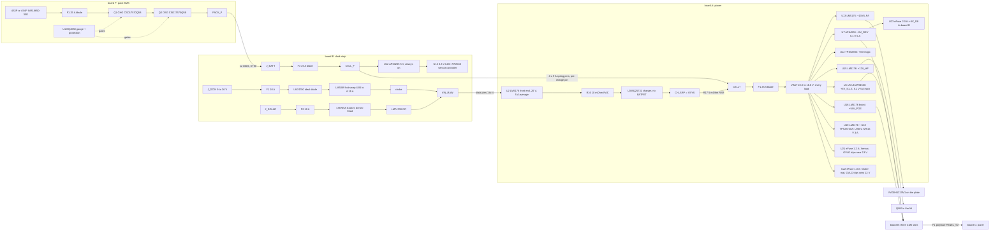

# W2 power architecture draft (MESHSAT-1357, round 2, input to ARCHITECTURE.md)

Round 2 of 25 September 2026, worktree `fnd/w2` at `82dd1e4d` (generators identical to round 1's `e6291404`).
**Status: PROVISIONAL.** Nothing in this kit has been built or powered; every current below is a datasheet figure, a
declaration in a generator, or an inference, and each row says which. The power states are adjudication A05's
(`scratchpad/adj/A05-modes-and-runtime-basis/`), which replaced round 1's M0 to M6 (their labels collided with W1's
missions); W1 owns the final IDs and the duty cycles. Circuit defects are in `w2-findings.md` (IDs F-..); runtime is
in `w2-runtime.md`. Round 2 also applies A01 (expander power-up) and A02 (charger without a host).

## 1. Documents read (all in this tree unless marked)

| document | revision / date | used for |
|---|---|---|
| `v2/ecad/tools/gen_sch_a.py` to `gen_sch_e.py`, `gen_sch_p.py` | `82dd1e4d` | the power tree, parts, nets, declared rails |
| committed netlists A (A65), B (B21), C (C24), D (D37P), E (E42P), P (P4), all tracked | 20 and 21 Sep 2026 | node lists; each named by its own title-block phase (w2-findings.md section 0) |
| `pcb_energy_chain.yaml`, `pcb_pack_protection.yaml`, `pcb_decisions.yaml` (n 40, 42) | `82dd1e4d` | protection chain, gauge configuration, decisions |
| `v2/docs/MESHSAT-709-geometry-appendix.md` 32.49, 32.52, 32.53, 32.55, 32.62 | `82dd1e4d` | the old budgets, pocket, pack proposal, rulings |
| `v2/docs/OPERATING-ENVELOPE.md`, `V2-SPEC.md`, `PANEL.md` | `82dd1e4d` | temperatures, modes, published figures, panel contract |
| Samsung INR18650-35E spec (`battery/samsung-35e-orbtronic.pdf`) | Ver. 1.1, 9 Jul 2015 | cell limits, capacity, temperature, cycle life |
| TI BQ4050 (`battery/ti-bq4050.pdf`) | SLUSC67B, Oct 2017 | protection thresholds, supply current |
| TI BQ25731 (`ti/bq25731-datasheet.pdf`) | SLUSE66A, Jan 2021 (TI's current revision, A02) | strap, defaults, sense scaling, input limit |
| TI BQ25730 SLUSE65A and TI E2E thread 1316778 (23 Jan 2024) | fetched by A02, not in the tree | the 256 mA default (A02) |
| TI PCA9555 (`ti/ti-pca9555.pdf`) | SCPS131J, Mar 2021 | internal pull-up, power-on state (A01) |
| TI TPS2596 (`power/tps2596.pdf`) | SLVSET8A, Aug 2019 | eFuse EN/UVLO and OVLO thresholds |
| TI LM5176 (`ti/lm5176-datasheet.pdf`), TI LM5069, ADI LTC2954, TI TPS62933, Diodes AP64500 (DS41979 Rev 5-2) | as filed | enables, limits, layout |
| Raspberry Pi CM5 datasheet; Quectel RM520N HD v1.1; RA30H1317M1; SA868 v1.3; E22-900M30S v1.20; RockBLOCK 9704; LG290P HD v1.1; TUSB8041; PI7C9X2G404SL; Xenarc 709GNK manual v2; QMX manual 1_04_004; RS PRO 245-556 | as filed | load figures |

Not held, so their rows are TBD: LimeSDR Mini 2.4 power, AW7915-AED power (its datasheet gives none), the NVMe drive (no
part picked), the five fans, the Geiger module, the camera, the KSZ9897R figure (datasheet filed, not read here).

## 2. The power tree

Two things the diagram makes visible: every load hangs on VBAT, **behind** the charge shunt R17, so the charger's
current loop regulates load plus pack (F-CH-03), and the only path from any input to VBAT runs through the charger;
and the monitor and heater eFuses lock out above about 13 V as drawn (F-SQ-06).

### 2.1 Sources and the stored-energy chain

| stage | element | rating | source |
|---|---|---|---|
| cells | 4S3P (12) or 4S4P (16) Samsung INR18650-35E | 3,350 mAh min (0.2C, 2.65 V, 23 C), 3.60 V nominal, 8 A continuous, 13 A pulse per cell; 144.7 or 193.0 Wh at minimum capacity | samsung-35e-orbtronic.pdf 3.1, 3.3, 3.8, 7.2 |
| pack fuse | F1 25 A ATOF blade | 1000 A interrupting at 32 VDC, 2.52 mOhm cold | pcb_energy_chain.yaml `PACK_CELLS` |
| pack switches | Q1 (charge), Q2 (discharge) CSD17570Q5B, high side, common drain | 30 V, 0.56 / 0.69 mOhm at VGS 10 V | ti-csd17570q5b.pdf; gen_sch_p.py:158 |
| gauge | U1 BQ4050, 2 mOhm shunt R10 in the negative | over-current 20 A 2 s, 30 A 20 ms; short circuit 60 A (not settable as written, F-PK-03); UV 2.50 V, OV 4.25 V; charge 0 to 45 C, discharge -10 to 60 C | pcb_pack_protection.yaml |
| lead | 12 AWG, Amass XT60 | 30 A continuous, 60 A instantaneous | pcb_energy_chain.yaml `PACK_LEAD` |
| dock strip | F3 25 A blade, CELL_F | | gen_sch_e.py:133 |
| dock block | 4 CELL+ and 4 return spring pins, 9 A each | 36 A | pcb_energy_chain.yaml `DOCK_BLOCK` |
| power board | F1 25 A blade to VBAT; C1, C2 47 uF, C3 10 uF, D1 SMCJ18A (orientation correct) | | gen_sch_a.py:161-167 |
| shore / vehicle | J_DCIN 9 to 36 V, F1 10 A, LM74700 + BSC039N06NS (60 V), LM5069-2 (UVLO 9 V, OVLO 40 V, RS 10 mOhm), SRF1260 choke, SMCJ40A clamps (drawn reversed, F-IN-01) | | gen_sch_e.py:138-226 |
| solar | J_SOLAR, F2 10 A, LT8705A (FBIN 17.6 V, output 15.1 V), ORed into VIN_RAW | bench-fitted | gen_sch_e.py:228-334 |
| RTC backup | CR2032 on board B | | gen_sch_b.py:599 |

### 2.2 Board A converters (all from VBAT unless noted)

Efficiencies are the generators' own datasheet floors (gen_sch_a.py:45-62): LM5176 0.93 at 12 to 20 V outputs, 0.88
for the 54 V boost, AP64500 0.90, TPS62933 0.88. The power-up column is A01's, until the panel firmware writes the
expanders.

| rail | converter | set point | declared typ / peak | limit that actually acts | enable | power-up state (A01) | source |
|---|---|---|---|---|---|---|---|
| VBUS20 | U2 LM5176 from VIN_RAW | 20 V | 6 / 8 A | ISNS 10 mOhm: 5 A average | own UVLO from VIN_RAW (en = VIN_RAW) | on whenever VIN_RAW is present | gen_sch_a.py:63, 310 |
| CELL+ (charge) | U3 BQ25731 | 16.8 V if strapped 4S (2S today, F-CH-01) | 10 / 18 A (node) | ChargeCurrent (256 mA at POR, A02), input limit TBD (F-CH-05) | ILIM_HIZ, CHG_INHIBIT via Q6 | CHG_INHIBIT undefined, error toward HiZ (F-SQ-07) | gen_sch_a.py:314-352 |
| +5V_S1..3 | U4, U5, U6 AP64500 | 5.1 V | 2.5 / 5.0 A each | IPEAK 6.8 to 9.2 A | SLOT_EN1..3 from the panel, 100 k down | **off, guaranteed** | gen_sch_a.py:71-74, 426-428 |
| +5V_DEV | U7 AP64500 | 5.1 V | 3.8 / 6.0 A (over the 5 A part, F-PR-04) | IPEAK 6.8 to 9.2 A | DEV_EN from U27, R42 100 k down | **on nominally, not guaranteed** (F-SQ-01) | gen_sch_a.py:75, 429 |
| +3V3 | U12 TPS62933 | 3.3 V | 0.3 / 0.6 A | 3 A part | RAIL_EN from LTC2954, pulled to VBAT (F-SQ-02) | on with MAIN | gen_sch_a.py:78, 434 |
| +13V8_PA | U13 LM5176 | 13.8 V | 5.0 / 6.0 A | ISNS 2 mOhm: 25 A; CS 5 mOhm: 13 to 19 A (F-PR-01) | PA_EN = EMCON_HW AND PA_SW_EN | off while EMCON_HW is low; PA_SW_EN undefined | gen_sch_a.py:81, 444 |
| +12V_HF | U15 LM5176 | 12.0 V (F-PR-07) | 1.0 / 2.0 A | ISNS 10 mOhm: 5 A | HF_EN = EMCON_HW AND HF_SW_EN | as PA | gen_sch_a.py:82, 449 |
| +54V_POE | U16 LM5176 boost | 54 V | 0.3 / 0.6 A | ISNS 20 mOhm: 2.5 A; TPS23861 port limits on B | POE_EN (expander) | off, guaranteed (0.30 V nominal) | gen_sch_a.py:84, 453 |
| PD_VPWR | U19 LM5176 + U18 TPS25740A | 5 / 9 / 15 V at 3 A | 3.0 A | ISNS 10 mOhm and R138 10 mOhm | PD_EN (expander) | off, guaranteed | gen_sch_a.py:484, 503, 507 |
| VMON | U21 TPS259631 eFuse | VBAT | under 1.2 A | ILM 750 R: 1.2 A; **OVLO 12.87 to 13.42 V** (F-SQ-06) | MON_EN | asserted nominally, but locked out above about 13 V | gen_sch_a.py:526-527 |
| VHEAT | U22 TPS259631 eFuse | VBAT (F-PR-06) | 1.0 A | ILM 909 R: 1.0 A; **OVLO as U21** | HEAT_EN | as U21 | gen_sch_a.py:528 |
| +5V_D8 | U23 TPS259631 eFuse from +5V_DEV | 5.1 V | 1.0 / 2.0 A | ILM 453 R: 2.0 A (OVLO pin 0.46 V, below its 0.5 V range) | D8_EN | asserted nominally | gen_sch_a.py:529 |

### 2.3 Board B distribution (from the slot rails and the device rail)

| rail | from | converter or pass element | declared typ / peak | loads | source |
|---|---|---|---|---|---|
| +5V_S1..3 | A | arrives on JST-VH | 2.5 / 5.0 A | CM5 1.6 A, card buck 2.2 A (apportioned for the RM520N), NVMe/switch buck 0.7 A, 1.0 V core 0.15 A, fan 0.1 A | gen_sch_b.py:37-66 |
| +3V3_SxA | +5V_Sx | AP64500 (buck33, 5 A) on PCIE_PWR_EN from the module | 0.5 / 1.5 A, contradicting the 2.2 A apportioned upstream (F-PR-05) | M.2 card | gen_sch_b.py:139-142, 406 |
| +3V3_SxB | +5V_Sx | AP64500 on EN33_Sx (module 3.3 V through 100 k / 100 k) | 0.9 / 1.8 A | NVMe, PCIe switch 3.3 V | gen_sch_b.py:146, 407-408 |
| +1V0_Sx | +5V_Sx | TPS62933 on EN33_Sx | 0.8 / 1.2 A | PCIe switch core | gen_sch_b.py:150, 409 |
| +1V1_Sx | +5V_DEV | TPS62933, always on with the device rail | 0.4 / 0.7 A (F-MS-01) | TUSB8041 hub core | gen_sch_b.py:154, 410 |
| +5V_DEV | A | arrives on JST-VH | 3.8 / 6.0 A | see `_DEV_LOADS` | gen_sch_b.py:69-84 |
| +3V3_DEV | +5V_DEV | buck, EN tied to input | 1.2 / 2.0 A | KSZ IO, hubs VDD33, muxes, supervisor LDOs, GNSS, E72 switch, the kit bus pull-ups | gen_sch_b.py:86-112, 748 |
| +3V3_IOCA..C | +5V_DEV | AP2112K LDOs | 0.12 / 0.25 A each | three STM32 I/O supervisors | gen_sch_b.py:171-178 |
| +1V2_KSZ, +2V5_KSZ | +5V_DEV, +3V3_DEV | buck, LDO | 0.5 / 0.8 A; 0.15 / 0.25 A | KSZ9897R | gen_sch_b.py:180-189 |
| +5V_LIME, +5V_RB | +5V_DEV | TPS2596 eFuses, ILM 3.0 A, gated EMCON_HW AND software (U19) | 1.2 / 3.0 A; 0.15 / 2.0 A | LimeSDR; RockBLOCK 9704 (datasheet max 1.4 W) | gen_sch_b.py:199-208, 699-704, 723-728 |
| +5V_LORA, +3V3_ZB, +5V_CAM | +5V_DEV, +3V3_DEV | TPS22810, TPS22810, TPS2065; LoRa and E72 gated EMCON_HW AND software (U19, U20) | 0.15 / 0.70; 0.10 / 0.30; 0.25 / 0.50 A | E22; two E72; camera | gen_sch_b.py:190-212, 723-728 |
| PANEL_5V, +5V_HDMI, VBUS_QMX | +5V_DEV | polyfuses F1 2.0 A, F2 0.5 A, F3 0.5 A | 0.6 / 1.0; 0.1 / 0.5; 0.3 / 0.5 A | board C; HDMI; QMX USB | pcb_energy_chain.yaml `B_*` |

Boards C, D and E: C's `+5V` from PANEL_5V and a TLV75533 3.3 V LDO whose EN is tied to its input (gen_sch_c.py:24,
99-123); D's `+5V_D8` from A's U23, `+5V_SA` through a ferrite to the SA868 (0.35 / 1.10 A), a local 3.3 V, and the PA
gate bias VGG switched from `+5V_D8` by a TPS22810 (gen_sch_d.py:39-82, 313); E's `+5V_E6` from an AP63205 whose EN is
tied to CELL_F (always on) and `+3V3_E6` from a TLV75533 (gen_sch_e.py:77-92, 339-347).

## 3. Enables and sequencing as wired (A01's sequence, defects marked)

| step | event | what comes up | depends on | status |
|---|---|---|---|---|
| S0 | pack connected, gauge FETs on | VBAT, CELL_F; board E's 5 V and 3.3 V; board A's LTC2954 | nothing | always on (F-BP-02 drain); RAIL_EN held low |
| S0' | shore or vehicle present, MAIN off | U2 front end and the charger at power-on defaults (256 mA, A02) | VIN_RAW only | charges slowly with no host (F-CH-02) |
| S1 | MAIN held 26 to 41 ms | RAIL_EN -> U12 -> board A +3V3 (expanders, INA226s, charger I2C side); KILL already high | LTC2954 | RAIL_EN and KILL pulled to VBAT, over the pins' absolute maxima (F-SQ-02) |
| S2 | U27 and U28 leave reset as inputs with internal pull-ups | DEV_EN about 1.7 V: U7 soft-starts over 4 ms; MON/HEAT/D8 asserted (monitor and heater then locked out by OVLO above about 13 V); PoE and PD off; PA and HF off while EMCON_HW is low | the PCA9555's unspecified pull-up | **nominal, not designed** (F-SQ-01, F-SQ-07) |
| S3 | +5V_DEV up | D8's 5 V, B's +3V3_DEV and U6, PANEL_5V, C's +3V3, the RP2040, EMCON_HW (high if the toggle is released) | S2 | PA_SW_EN, HF_SW_EN undefined from here until the firmware writes |
| S4 | panel firmware runs | writes output registers, then configuration (order matters, F-SQ-07); keeps DEV_EN = 1 and PI_KILL low; raises SLOT_EN1..3 -> +5V_S1..3 -> CM5, EN33_Sx -> NVMe, PCIe switch; PCIE_PWR_EN (module) -> card | the panel firmware | **without panel firmware the kit stops at S3 with no module running** |
| S5 | software enables | PA_SW_EN, HF_SW_EN, POE_EN, PD_EN, radio enables on B; EMCON_HW gates PA, HF, LimeSDR, RockBLOCK, LoRa, E72 in hardware | expanders on A and B | |
| off | PI button short / long, or MAIN long | PI_SHDN_REQ to every module; PI_KILL -> Q1 pulls KILL low -> RAIL_EN low | panel controller; LTC2954 | |

Module order: the CM5 needs its 5 V monotonic above 4.75 V before PMIC_EN, and "No pins should be powered before the
5 V rail is active" (cm5-datasheet.pdf 3.1). The slot's own converters follow the module's 3.3 V; the always-on
device-rail parts that touch module pins are the open back-power question (F-BP-03).

## 4. Power states (A05's table; W1 owns the final IDs)

W1's 14 operating modes (CONOPS.md:132-145) are states of use; these are power states, and W1's simultaneity cases
S1 to S5 are their counterparts. Mapping and every legacy figure: A05 section 2 (and w2-runtime.md section 1).

| ID | definition | round 1 | W1 counterpart |
|---|---|---|---|
| PS-OFF | pack connected, MAIN off: board E always-on, the gauge, the P clamp leak | M0 | Deploy, Shutdown, Storage with the pack in, Transport if unpowered |
| PS-IDLE | three CM5 idle (0.4 A), monitor dimmed (4 W placeholder), radios receiving, SDR off, no transmit | M1 | S1 by definition; Normal (quiet) |
| PS-IDLE-SPEC | PS-IDLE as V2-SPEC.md:23 words it: monitor on (6 W), APRS beacons (0.9 W average, interval TBD) | none | Normal (full) |
| PS-TYP | three CM5 at typical operation (0.9 A), monitor on, radios receiving with light traffic, SDR on, HF receiving: 32.52's "typical" re-derived | M2 | Normal (full); add as a W1 S-case |
| PS-RED | reduced, envelope definition (OPERATING-ENVELOPE.md:100): one module, monitor off, the other two slots off | M3 | S5; Reduced; Degraded to one module |
| PS-RED-b | reduced, 32.53 definition: cluster idle, monitor off | none | S5 alternative; Transport if powered |
| PS-EMCON | EMCON as generated: PS-TYP with the PA, HF, LimeSDR, RockBLOCK, LoRa and E72 rails gated off, 5G RF-off, cards idle | M4 less the gated loads | EMCON |
| PS-EMCON-L | EMCON "keep listening" (W1 D-05 option; needs a gate change) | M4 as drafted | EMCON if D-05 so rules |
| PS-ALLTX | every transmitter keyed at once, outlets off | M5 | S3 (outlets at minimum: contract TBD) |
| PS-ALLTX-OUT | PS-ALLTX plus PoE 0.6 A at 54 V and USB-C PD 45 W | M6 | none |
| PS-BUSY | three modules loaded, 5G and WiFi passing traffic, Iridium and LoRa sending | none | S2; **TBD** (needs duty cycles) |
| PS-CHG | MAIN on, panel and device rail up, slots off, monitor off: the least a charging host needs (INFERRED, not an A05 state; proposed to W1) | none | Charging |

## 5. Load budget per power state (PROVISIONAL)

Watts at the load. `eta` is the path from VBAT to that load: one converter's floor, or two in cascade (5.1 V then 3.3 V
= 0.90 x 0.88 = 0.79; 5.1 V then a 1.0 to 1.2 V buck = 0.77; 5.1 V then a 3.3 V LDO = 0.90 x 0.66 = 0.59). Battery-side
power adds 20 mOhm of distribution I2R (three 2.52 mOhm blades, two 0.69 mOhm FETs, the 2 mOhm shunt, and about 9 mOhm
of lead, contacts and copper, the last INFERRED). The monitor and heater rows are the intended loads, i.e. after
F-SQ-06's fix. Model: `drafts/_scratch/budget_r2.py` (scratch), which reproduces A05's independent model
(`adj/A05-modes-and-runtime-basis/model_a05.py`) to 0.01 W.

| load | eta | PS-IDLE | PS-TYP | PS-RED | PS-EMCON | PS-ALLTX | PS-ALLTX-OUT | source (status) |
|---|---|---|---|---|---|---|---|---|
| CM5 x3 | 0.90 | 6.0 | 13.5 | 4.5 | 13.5 | 24.0 | 24.0 | cm5-datasheet 3.3: 400 / 900 mA typical, no max (VERIFIED); 8 W stress = B's declared 1.6 A (INFERRED) |
| slot fans x3 | 0.90 | 1.5 | 1.5 | 0.5 | 1.5 | 1.5 | 1.5 | declared 0.1 A (gen_sch_b.py:46); fan part TBD |
| PCIe switch x3 | 0.78 | 1.9 | 1.9 | 0.6 | 1.9 | 3.2 | 3.2 | DS40068 Rev 5-2 Table 12-8: 624 mW typ, 1,067 mW max (VERIFIED) |
| NVMe x3 | 0.79 | 0.9 | 3.0 | 1.0 | 3.0 | 12.0 | 12.0 | no part (TBD); peak = declared 1.2 A at 3.3 V (gen_sch_b.py:148) |
| WiFi AW7915-AED x2 | 0.79 | 2.0 | 6.0 | 0 | 2.0 | 20.0 | 20.0 | datasheet gives none (TBD); 3 / 10 W per card from 32.52 item 3 (unsourced there) |
| 5G RM520N-GL | 0.79 | 0.2 | 1.5 | 0 | 0.02 | 5.0 | 5.0 | HD v1.1 Table 43: idle 60 mA, LTE CA 1,512 mA, RF-off 4.7 mA, x 3.3 V (VERIFIED); PS-TYP duty INFERRED; bursts to 4 A (3.3.1) |
| LimeSDR Mini 2.4 | 0.90 | 0 | 3.0 | 0 | 0 (gated) | 4.5 | 4.5 | no datasheet held (TBD); 3 W from 32.52; 4.5 W = a USB 3 port's 900 mA (INFERRED) |
| LoRa E22-900M30S | 0.90 | 0.07 | 0.3 | 0.07 | 0 (gated) | 3.25 | 3.25 | manual v1.20 2.2: TX 650 mA, RX 14 mA at 5 V (VERIFIED); duty INFERRED |
| RockBLOCK 9704 | 0.90 | 0.06 | 0.1 | 0.06 | 0 (gated) | 1.4 | 1.4 | "60mW Idle, 1.4W Max" (VERIFIED) |
| E72 x2 | 0.79 | 0.26 | 0.26 | 0.26 | 0 (gated) | 1.0 | 1.0 | declared +3V3_ZB (gen_sch_b.py:190); manual not read (INFERRED) |
| LG290P | 0.79 | 0.33 | 0.33 | 0.33 | 0.33 | 0.33 | 0.33 | HD v1.1: 99 mA, 326.7 mW (VERIFIED) |
| TUSB8041 x3 | 0.80 | 0.3 | 1.5 | 0.3 | 1.5 | 3.0 | 3.0 | SLLSEE4E 7.7: 2 SS U1/U2 about 0.5 W, 4 SS U0 about 1.0 W (VERIFIED); idle 0.1 W per hub INFERRED |
| KSZ9897R | 0.72 | 1.8 | 1.8 | 1.8 | 1.8 | 1.8 | 1.8 | declared rails (gen_sch_b.py:180-189); datasheet not read (TBD) |
| B logic (3 STM32, bridges, misc) | 0.59 | 1.5 | 1.5 | 1.5 | 1.5 | 1.5 | 1.5 | declared +3V3_IOC 0.12 A x 3 plus misc (INFERRED) |
| panel board C | 0.85 | 1.5 | 3.0 | 1.5 | 3.0 | 5.0 | 5.0 | declared +5V 0.6 / 1.0 A (gen_sch_c.py:24) |
| APRS board D | 0.90 | 0.6 | 0.8 | 0.6 | 0.6 | 3.3 | 3.3 | SA868 v1.3: RX 60 mA, TX low 450 to 550 mA (VERIFIED) plus declared rest |
| camera | 0.90 | 0 | 1.0 | 0 | 1.0 | 2.5 | 2.5 | port limit 0.5 A (gen_sch_b.py:209); part TBD |
| QMX USB, HDMI 5 V | 0.90 | 0.3 | 0.3 | 0.3 | 0.3 | 0.3 | 0.3 | declared (INFERRED) |
| Xenarc 709GNK | 1.00 | 4.0 | 6.0 | 0 | 6.0 | 10.0 | 10.0 | "Power Consumption: <= 10W" (VERIFIED); 6 W typical from 32.52, 4 W dim INFERRED |
| board E always-on + Geiger | 0.75 | 0.8 | 0.8 | 0.8 | 0.8 | 1.5 | 1.5 | declared +5V_E6 0.30 A (gen_sch_e.py:89); Geiger TBD |
| E mixer fans x2 | 1.00 | 0 | 1.4 | 1.4 | 1.4 | 2.9 | 2.9 | declared 0.1 A each on CELL_F (gen_sch_e.py:34) |
| board A logic | 0.88 | 0.5 | 0.5 | 0.5 | 0.5 | 1.0 | 1.0 | declared +3V3 0.3 / 0.6 A (gen_sch_a.py:78) |
| QMX (+12V_HF) | 0.93 | 0 | 1.0 | 0 | 0 (gated) | 12.0 | 12.0 | manual: receive "as low as 80mA" (VERIFIED); 12 W transmit from 32.52 (INFERRED) |
| 30 W PA | 0.93 | 0 | 0 | 0 | 0 | 75.0 | 75.0 | RA30H1317M1: 30 W at nT > 40 % (VERIFIED at 12.5 V; F-PR-02) |
| PoE out | 0.88 | 0 | 0 | 0 | 0 | 0 | 32.0 | declared 0.6 A at 54 V (gen_sch_a.py:84) |
| USB-C PD out | 0.93 | 0 | 0 | 0 | 0 | 0 | 45.0 | TPS25740A 15 V 3 A profile (gen_sch_a.py:484-507) |
| **sum at the loads** | | **24.5** | **51.0** | **16.0** | **40.6** | **196.0** | **273.0** | |
| **at the battery** | | **29.4** | **60.1** | **19.7** | **47.6** | **227.0** | **316.4** | |
| basis split S / D / T (battery W) | | 9.9 / 7.3 / 12.2 | 20.8 / 9.2 / 29.7 | 6.4 / 7.3 / 6.1 | 19.7 / 8.7 / 19.0 | 110.4 / 43.5 / 68.2 | 110.4 / 128.2 / 68.2 | S datasheet, D declaration, T TBD (A05 tiers) |
| pack current at 14.4 V | | 2.0 A | 4.2 A | 1.4 A | 3.3 A | 15.8 A | 22.0 A | |

Variants (battery-side, same model): **PS-IDLE-SPEC 32.4 W** (monitor 6 W, beacons 0.9 W on the PA rail);
**PS-RED-b 25.4 W** (PS-IDLE, monitor off); **PS-EMCON-L 52.5 W** (round 1's M4, radios kept listening); **PS-CHG
10.7 W** (INFERRED). **PS-OFF 0.37 to 1.87 W** (board E's always-on domain 0.2 to 1.7 W, TBD, plus 0.17 W from F-BP-01;
the gauge's 336 uA is negligible). Heater overlay (cold only): **PS-TYP + heater 71.0 W, PS-RED + heater 30.6 W**
(10.8 W at 14.4 V, F-PR-06).

**Comparison with appendix 32.52 item 3.** 32.52 summed 45 W at the loads and added a flat 12 % to reach "about 50 W"
(battery-side; w2-runtime.md section 1). The same state re-derived is 51.0 W at the loads and 60.1 W at the battery.
The 10 W difference is loads that entered the design after 7 September (three NVMe drives, three PCIe switches at their
real 1.9 W, the second WiFi card, board E's mixer fans and always-on controller, the camera) and the cascaded 3.3 V and
LDO paths, which cost 16 to 23 %, not 12 %. **Half of PS-TYP (29.7 of 60.1 W) rests on TBD loads.**

### 5.1 Peak checks per conductor (PROVISIONAL: arithmetic on INFERRED and TBD loads)

| path | worst state | current | against | margin | finding |
|---|---|---|---|---|---|
| pack, 4S3P, at 12.0 V under load | PS-ALLTX | about 19 A, 6.3 A per cell | over-current 20 A / 2 s; cell 8 A | about 1 A | F-PR-03 |
| pack, at 10.6 V (2.65 V per cell) | PS-ALLTX | 21 to 22 A | over-current 20 A | negative | F-PR-03 |
| pack, at 12.0 V | PS-ALLTX-OUT | 26 to 27 A; about 8.8 A per cell (3P), 6.6 A (4P) | 25 A blades; cell 8 A | negative | F-PR-03 |
| +5V_DEV | PS-ALLTX | about 6.0 A (and declared 6.0 A) | AP64500 5 A | negative | F-PR-04 |
| +5V_S2 (5G slot) | PS-ALLTX burst | about 5.8 A (INFERRED) | AP64500 5 A | negative | F-PR-04 |
| +3V3_S2A | 5G burst | 4 A (module requirement) | declared 1.5 A | declaration short | F-PR-05 |
| +13V8_PA | PS-ALLTX | 5.4 to 8.2 A | declared 6 A; no fuse | TBD | F-PR-01, F-PR-02 |
| VIN_RAW at a 12 V vehicle | host sets the charger to the FE's 100 W | about 9 A asked | LM5069 4.85 to 6.15 A | negative | F-IN-02 |
| R17 (only after F-CH-03 option 1) | PS-ALLTX-OUT | 22 A through 5 mOhm = 2.4 W | part rating TBD | TBD | F-CH-03 |

## 6. Start-up and inrush

| event | what charges | estimate | control element | status |
|---|---|---|---|---|
| pack lead mated live at the XT60 | about 360 uF nominal on CELL+/VBAT | peak limited by loop resistance and inductance only, microseconds; about 20 to 50 mJ (0.5 C V^2, derated to nominal capacitance) | none (F-IN-04) | INFERRED |
| gauge closes Q2 | the same capacitance | the gauge drives the FET gate through 5.1 k, a slow turn-on that acts as a soft start (INFERRED); SCD delay 183 or 244 us exceeds the RC time | BQ4050 | INFERRED |
| board A seated on the dock | CELL+ through R1 10 R on the longer pin | 1.7 A peak, 0.5 C V^2 in R1 | J_PRE1 (F-IN-05 for the fault case) | VERIFIED part, INFERRED energy |
| shore input connected | VIN_RAW bulk (C6, C7, C8 and A's FE input 2 x 10 uF) | dV/dt set by the LM5069 power limit and timer | U6 LM5069-2 | VERIFIED part |
| device rail enabled | U7's output capacitors, then B's and C's inputs | AP64500 soft start 4 ms (DS41979) | U7 | VERIFIED part |
| a slot rail enabled | the slot's converters' input capacitors, then the module | AP64500 soft start; module 5 V rises monotonic (CM5 3.1) | U4 to U6 | VERIFIED part |
| LimeSDR, RockBLOCK, D8 | their bulk (22 uF each) | dVdt 10 nF on each TPS2596 | eFuses | VERIFIED part |
| PA keyed | +13V8_PA output capacitors, then a 5 to 8 A step | the pack sees a 6 to 9 A step at VBAT; sag = step x (pack DCR + 20 mOhm): 0.5 to 1 V at 4S3P (pack DCR TBD, AC 47 mOhm) | none | INFERRED |

Brownout order on a falling pack (from the parts' own minima): the monitor first (10 V, F-PR-08), then the gauge's cell
under-voltage (2.50 V per cell, 4 s), then everything at once. The AP64500 (3.8 V minimum input) and LM5176 stages run
far below the pack's cut-off, so no rail fails before the pack cuts; a clean shutdown must come from the gauge's state
of charge, read by board E's controller and passed to the modules (W5 contract).

## 7. Charge path (as wired, and after the fixes)

**As wired:** the strap selects 2S (F-CH-01), so nothing charges a 4S pack. **After the strap fix, with the loads still
on CELL+:** the charger regulates the current into load plus pack (F-CH-03). Its power-on ChargeCurrent is 256 mA (A02,
INFERRED, bench owed); its input sense is scaled for 5 mOhm on a 10 mOhm R16 until a host writes RSNS_RAC = 0b (F-CH-05).

| source | input limit | power reaching CELL+ | pack current in PS-CHG (10.7 W, host running) | pack current in PS-TYP (60.1 W) | no host (MAIN off, PS-OFF) |
|---|---|---|---|---|---|
| shore at 24 V or higher | FE 5 A at 20 V = 100 W | about 95 W (charger efficiency 0.95 INFERRED) | 4.0 A (design; OCC trip 5 A) | about 2.4 A | 0.13 to 0.23 A (256 mA less the drain) |
| vehicle at 12 V | LM5069 4.85 A min = 58 W in | about 51 W | about 2.8 A | **negative: the pack discharges about 0.6 A** | as above |
| vehicle at 9 V | 44 W in | about 39 W | about 1.9 A | **negative: about 1.5 A** | as above |
| solar | LT8705A tracker, panel TBD | TBD | TBD | TBD | TBD |

A running kit's charging always needs a host that sets ChargeCurrent = load + wanted pack current (the pack current is
read from the BQ4050 through board E, F-CH-04), writes RSNS_RAC, sets `IIN_HOST` within what the input can carry
(F-IN-02), and keeps the watchdog satisfied or disabled. With F-CH-03 option 1 (loads on VSYS) the input carries the
load first and ChargeCurrent is the pack's current only. Cell limits: charge 0 to 45 C, 1,700 mA standard, 1,020 mA for
cycle life, 2,000 mA maximum per cell (samsung-35e-orbtronic.pdf 3.5, 3.7, 3.12). At 4 A that is 1.33 A per cell in 4S3P
(above the cycle-life current) and 1.0 A per cell in 4S4P (at it). Charge time: w2-runtime.md section 7.

## 8. For ARCHITECTURE.md (integrator)

1. The energy budget block is the section 5 table with its S / D / T split, headed by the state names; the headline is
   **PS-TYP 60.1 W and PS-ALLTX 227.0 W at the battery, PROVISIONAL**, replacing 32.52's 50 W / 200 W, with
   PS-IDLE-SPEC (32.4 W) beside it as V2-SPEC's "typical" worded for today's kit.
2. The power tree of section 2 and the sequence of section 3, with F-SQ-01, F-SQ-06 and F-SQ-07 marked open.
3. Candidate requirement records (W1 owns wording and IDs): runtime per power state at end of life; peak power and its
   duration versus state of charge; vehicle input power at 9, 12, 24 V and the surge claim; storage drain and
   procedure with the pack connected or not; cold start without shore power; panel-absent behaviour; power-up from MAIN
   without firmware dependence; charge-while-running power and charge with MAIN off; heater power limit.
4. Energy chain extension (the integrator writes `pcb_energy_chain.yaml` stages; W2 can draft them): the PA, HF, PoE and
   PD branches are not stages today (F-PR-01).
5. Set-level checks for W7: a cross-board enable graph that includes I2C-written enables and power-up states
   (F-SQ-01, F-SQ-07); clamp polarity and symbol from pad nets and roles (F-IN-01); OVLO and UVLO dividers against the
   rail they watch (F-SQ-06); `_needs_fan` counting numbered copper pads only (F-DC-02).
