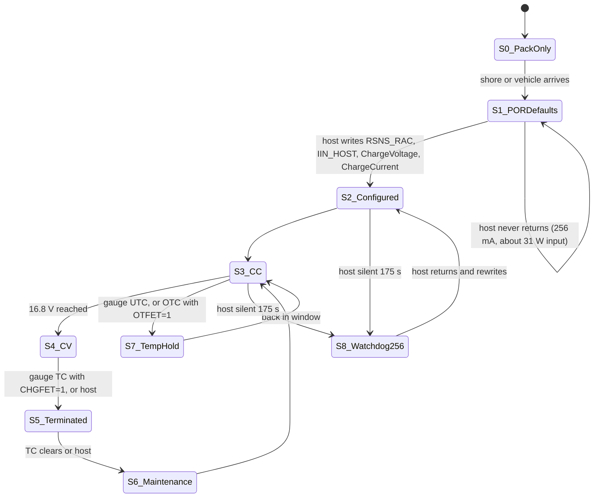

# Charging with the controller crashed: the BQ25731 and the pack as a state sequence

MeshSat field kit V2, MESHSAT-1357, review stream BAT, 26 September 2026. Prototype design: no board A has been built,
no charger has been powered, no register has been read on hardware. Every behaviour below comes from the datasheets and
the generators and is NOT_YET_TESTED. Labels: VERIFIED, INFERRED (step shown), TBD (with what it moves).

The review asks (section 2) whether "the complete kit charges safely and usefully with its controller crashed", as a
sequence of startup, watchdog expiry, temperature inhibition, termination and recovery, and notes that the 40-hour figure
is "an idealized capacity/current estimate, not a charging guarantee". Short answer, argued below: **with the round-6
board A candidate the kit charges SAFELY with its controller crashed, because every cell limit on charge is enforced by the
pack's own gauge and second level, not by the charger or its host; it does not charge USEFULLY: the pack is held roughly
where it is rather than charged. With board A as committed on main, it cannot charge at all.**

## 1. Revisions and actors

| | Main `1f614233` (board A as committed, A32) | Round-6 candidate (`wt/r4a`, uncommitted, `gen_sch_a.py` sha256 a0452054..., re-read 26 September 2026 about 15:40 CEST; the facts used here are unchanged from the 14:50 read of 17c204ad..., the line numbers moved) |
|---|---|---|
| Cell-count strap | R26 60.4k over R27 40.2k: 39.96 % of VDDA, the **2S** window (`gen_sch_a.py:350` on main) | R26 13.3k over R27 40.2k: 75.14 %, the 4S window (candidate `gen_sch_a.py:765-771`, finding F-CH-01) |
| Where the kit's loads sit | on the pack side of the charge shunt R17 (`gen_sch_a.py:322` on main: R17 from CH_SRP to CELL+) | on VSYS (net VBAT), with the pack beyond R17 (candidate `gen_sch_a.py:26-48, 716`, finding F-CH-03, TI's SLUSE66A Figure 10-1) |
| Charge inhibit | CHG_INHIBIT pulls ILIM_HIZ low through Q6 (HiZ) | the same, CHG_INHIBIT held low by R21 4.7k at power-up (candidate `:763`, S-08) |

Actors:
- **U3, BQ25731** on board A, an I2C target at 0x6B on the kit bus (`v2/docs/PANEL.md:145`). It has **no thermistor or TS
  input and no battery FET** (SLUSE66A features and device comparison; `v2/vendor/SOURCES.yaml` charger row).
- **The charger's host:** the panel controller (RP2040 on board C, master of the kit bus, `PANEL.md` section 7). It also
  drives SHORE_INHIBIT (GPIO 20; board A pulls it low with R118 100k, so a controller in reset leaves the inputs running,
  `PANEL.md:172`, candidate `gen_sch_a.py:1150`) and CHG_INHIBIT through the expander U27 bit P0.0 (candidate
  `gen_sch_a.py:1117-1119`).
- **U1, BQ4050** on board P, the pack's gauge and primary protection. **Its host** is a different controller: the RP2040
  sensor controller on board E, on the pack's SMBus (`gen_sch_e.py:501-508`), powered from the pack node whenever the pack
  is connected (`gen_sch_e.py:126`).
- **U2, BQ7720700**, the second level, which has no host.

So "the controller crashed" means the panel controller: the charger loses its host while the gauge keeps its own. The
sensor controller crashing is a separate case (section 4, row S9).

## 2. What the charger does by itself (SLUSE66A, `v2/vendor/ti/bq25731-datasheet.pdf`, sha256 3e5e927f...)

| Behaviour | Value | Source |
|---|---|---|
| Power-up | registers reset 5 ms after VBUS or VBAT is valid; the cell count is read from CELL_BATPRESZ and loads ChargeVoltage, VSYS_MIN and SYSOVP; then "Converter powers up" | 9.3.1 (VERIFIED) |
| 4S defaults | ChargeVoltage 16.800 V, SYSOVP 19.5 V, VSYS_MIN 12.3 V | Table 9-2 (VERIFIED) |
| ChargeCurrent at power-on | register reset value 0080h = 256 mA (9.6.2 heading, Table 9-11, Table 9-8 note); the 9.6.2 prose says 0 A; TI: "The POR value is indeed 256mA" | SLUSE66A; TI E2E 1316778, answer of 2024-01-23 (`v2/vendor/ti/ti-e2e-1316778-bq25731-chargecurrent-por.html`) (VERIFIED as TI's words) |
| Whether it charges without a host write | 9.6.3 says "After CHRG_OK goes high, the charge will start when the host writes the charging current to ChargeCurrent() register", which conflicts with a 256 mA default; the E2E asker's premise that it "will begin charging the battery at 256 mA prior to External MCU intervention" was not contradicted by TI, whose remedy was to hold CELL_BATPRESZ at 0 V | INFERRED: it charges at 256 mA; **TBD by the bench** (board A FW-A15 item 1) and question Q-TI-2 |
| Watchdog | 175 s default (WDTMR_ADJ = 11b); on expiry "all register values are kept unchanged except ChargeCurrent() resets to 256 mA"; restarted by a write of ChargeVoltage or ChargeCurrent | 9.3.21.1, Table 9-8 (VERIFIED) |
| Termination | "host terminates charge by setting CHRG_INHIBIT bit to 1b, or setting ChargeCurrent() to zero (WDTMR_ADJ=00 should be configured ..., otherwise charge current will reset to 256 mA after watch dog timer expires)" | 9.4.1 (VERIFIED): **the charger never terminates by itself** |
| Low-battery clamp | below VSYS_MIN (12.3 V for 4S) charge current is clamped at 384 mA | 9.6.2.1, 9.3.21.7 (VERIFIED) |
| Over-voltage | BATOVP at 104 % of ChargeVoltage (17.47 V) shuts the converter when charge is enabled; SYSOVP latches the converter off | 9.3.21.5, 9.3.21.4 (VERIFIED) |
| Input current limit | the lower of IIN_DPM and the ILIM_HIZ pin; IIN_HOST resets to 3.25 A at each adapter removal; ILIM_HIZ below 0.4 V is HiZ (converter off) | 9.3.6, pin table, 9.3.8 (VERIFIED) |
| Host-free input limit on this board | about 1.6 to 1.7 A at the 20 V bus: IIN_HOST's 3.25 A reset value is scaled for 5 mohm (RSNS_RAC = 1b at POR) and R16 is 10 mohm | candidate `gen_sch_a.py:596-598`, whose own figure is 1.72 A, and FW-A01 (INFERRED) |
| Temperature | junction shutdown at 155 C only (TSHUT); **no cell temperature input** | 9.3.21.9 (VERIFIED) |

## 3. What the pack does on the charge side (SLUUAQ3A, `v2/vendor/battery/ti-sluuaq3a-bq4050-trm.pdf`)

| Behaviour | Source |
|---|---|
| No FET moves at all until FET control is enabled: TI's Mfg Status Init is 0x0000, and FET_EN = 0 disables both charge and discharge; the image writes 0x01F8 (FET_EN, PF_EN, FUSE_EN and the rest) and the commissioning read-back of ManufacturingStatus() after a reset confirms it (`PRIMARY-CONFIGURATION.md` sections 1 and 2) | 4.12, 11.1, 14.3.1 |
| UTC (below 0 C) turns the charge FET off unconditionally | 2.11 |
| OTC (above 45 C, required value) turns the charge FET off only if FET Options[OTFET] = 1 (default 0) | 2.8, 14.2.1.1 |
| Charge inhibit and suspend on the temperature ranges act on the FET only if CHGIN and CHGSU = 1 (default 0) | 4.13, 4.14 |
| At valid charge termination, with CHGFET = 1, written explicitly (FET Options 0x3D; the TRM states CHGFET's default two ways: the header's 0x20 sets it, the bit text calls 0 the default, finding BAT-F13), the charge FET turns off: the gauge ends the charge without any host | 4.6, 4.7 ("When GaugingStatus() [FC] is set AND FET Option[CHGFET] = 1, the CHG FET turns off"), 14.2.1.1 |
| COV, OCC, overcharge (OC), CHGV and CHGC protections disable charge | 4.12 |
| Host watchdog: no valid SMBus transaction for HWD Delay (10 s) disables charge, **only when Enabled Protections C[HWDF] = 1**. SLUUAQ3A gives that bit two defaults ("1 = Enabled (default)" in 14.2.4.4, page 130; 0 in Table 14-1's 0xd5 at 0x447F, page 186), so this packet requires the golden image to write HWDF = 1 and HWD Delay = 10 s and commissioning to read them back (`PRIMARY-CONFIGURATION.md` section 2, finding BAT-F13) | 2.13, 14.2.4.4, 14.9.17, Table 14-1 |
| The second level: OV 4.325 V and OT at 62.7 to 77.5 C (conservative reading of TOT_ACC with the TS network's tolerance) open the fuse; it has no charge-temperature window | SLUSEG7D; `SECONDARY-OT-DECISION.md` |

The golden image values these depend on are in `PRIMARY-CONFIGURATION.md`; none is programmed yet.

**One loss the candidate topology still has (finding BAT-F06, INFERRED).** Board E's always-on domain, the 5 V buck U12
that feeds the sensor controller, sensors and the fans' logic, and the two mixer fans themselves, sit on board E's pack node
CELL_F (`gen_sch_e.py:32-34, 491, 571`), which is on the PACK side of board A's charge shunt R17: pack, board E, the dock,
board A's CELL+, F1, CELL_FUSED, R17, VSYS. The charger's ChargeCurrent is regulated through R17, so board E's always-on
load is paid out of it before the cells see any. Board E declares that rail at 0.30 A typical and 0.50 A peak at 5 V
(`gen_sch_e.py:125-129`), about 0.12 A at 14.4 V with its 0.88 efficiency, and each fan at 0.10 A on the pack node
(`gen_sch_e.py:34`). These are declarations, not measurements.

## 4. The sequence (round-6 candidate topology)

| # | State | Charger (U3) | Pack (U1, U2) | Safe? | Useful? |
|---|---|---|---|---|---|
| S0 | Pack only, kit off or on | battery-only low-power mode (EN_LWPWR = 1 at POR), converter off | normal; U1 host = sensor controller | yes | n/a |
| S1 | Shore or vehicle arrives; host still booting | POR defaults: 16.8 V, 256 mA (INFERRED), input limit about 1.6 to 1.7 A at 20 V (about 31 W into VSYS), watchdog 175 s | charge FET on if the gauge allows (0 to 45 C, below COV) | yes: 16.8 V strap, BATOVP 17.47 V, the gauge's window, U2 | partly: shore carries the loads up to about 31 W; at PS-IDLE 29.4 W (`CONOPS.md:238`) this roughly breaks even, above it the pack supplies the difference |
| S2 | Host configures | writes RSNS_RAC, IIN_HOST (FW-A16, 80 % of the entry), ChargeVoltage, ChargeCurrent up to 3.0 A (FW-A02), and services the watchdog | as S1 | yes | yes |
| S3 | Constant-current charge | regulates ChargeCurrent through R17; input DPM trims charge current when the loads rise; the pack supplements above the input limit (no battery FET) | counts, balances, protects | yes | yes |
| S4 | Constant voltage | holds 16.8 V at SRN; current tapers | balancing; COV at 4.25 V per cell guards a high cell | yes | yes |
| S5 | Termination | the charger does not terminate (9.4.1); the host ends it by CHRG_INHIBIT or ChargeCurrent 0 | with CHGFET = 1 the gauge turns the charge FET off at valid termination (TRM 4.6) | yes | yes |
| S6 | Maintenance | host decides a recharge; or, without the host, the gauge re-enables the charge FET when TC clears | the pack sits near full on shore | yes | yes, at a calendar-life cost: near 100 % charge in warm air (Samsung's storage figures are for 30 %) |
| S7 | Temperature out of window | nothing in U3 sees it | UTC below 0 C opens the charge FET; OTC above 45 C only with OTFET = 1; the host's own holds (the +25 C rule with three loaded modules, D-02b; heater before charge below -10 C, FW-A13) also act while the host lives | **yes only with the golden image's OTFET = 1** (default: no FET action on OTC) | n/a |
| S8 | Watchdog expiry (host silent for 175 s) | ChargeCurrent back to 256 mA; IIN_HOST, ChargeVoltage and CHRG_INHIBIT unchanged | as before | yes | see section 5 |
| S9 | Sensor controller (the gauge's host) crashed | unaffected | **with the golden image's explicit HWDF = 1 and HWD Delay 10 s, read back at commissioning**: host watchdog, charge FET off after 10 s; discharge unaffected. Without that write (the TRM's two defaults disagree) the charge FET stays under the gauge's own COV, OCC, temperature windows, termination and U2, with nothing reading the gauge | yes, either way: cell limits are the gauge's and U2's | with the write: no charging until it recovers. Without it: charging continues unobserved (the case BAT-F10's decision removes) |
| S10 | Adapter removed and back | ChargeCurrent resets (to 0 by 9.6.2's text, to 256 mA by TI's answer: TBD); IIN_HOST resets once to 3.25 A | as before | yes | the host must rewrite RSNS_RAC and IIN_HOST (FW-A16 b) |
| S11 | Host recovers (reboot) | nothing is reset in U3 by a host reboot; the PCA9555 U27 keeps its outputs (no reset pin) | as before | yes | yes, once the host rewrites the charger and U27 (FW-A08 order) |

## 5. The controller crashing in each state

| Host crashes during | What the charger keeps | Outcome | Safe? | Useful? |
|---|---|---|---|---|
| S1 (never configured) | POR defaults: 256 mA, about 31 W input | the kit roughly breaks even at idle on shore; the pack gains at most 256 mA less board E's always-on draw (about 0.12 A declared, above 0.25 A with both fans), about 0.14 A net or less, **or loses charge above idle load** | yes | **no**: the pack is held, not charged |
| S2 to S4 (configured, charging) | IIN_HOST as configured; ChargeCurrent as written for up to 175 s, then 256 mA | the kit is carried from shore up to the configured input limit; charge continues at up to 3.0 A for at most 175 s, then at 256 mA less board E's draw | yes: the host's temperature and rate policy stops, but the gauge's window (UTC, and OTC with OTFET = 1), COV, OCC, termination (CHGFET) and U2 continue | barely: about 0.14 A net at best; about 74 h from empty (10.07 Ah / 0.136 A, INFERRED), not counting the CV taper |
| S5 by ChargeCurrent 0 with the watchdog on | watchdog restores 256 mA after 175 s | charging resumes at 256 mA; the gauge's CHGFET holds the charge FET off until TC clears | yes | neutral |
| S5 by CHRG_INHIBIT = 1 | the bit (the watchdog resets only ChargeCurrent) | no charging until the host returns; the converter still supplies VSYS (TBD for this no-BATFET part, Q-TI-3) | yes | no charging |
| CHG_INHIBIT (U27) asserted | the expander output, which a host reboot does not clear | the charger is in HiZ: **the converter is off**, shore carries nothing, the kit runs from the pack to CUV | yes | **no**: the worst crash state; FW must rewrite U27 first on every boot (FW-A08, FW-A14) |
| SHORE_INHIBIT (GPIO 20) held high by a hung, not reset, controller | the pin | the front end is held off; as above | yes | no, until the RP2040's hardware watchdog resets it and R118 pulls the line low (firmware item: enable it) |
| S7 (temperature) | its last settings | the gauge alone holds the window; no JEITA current reduction (the gauge's ChargingCurrent() is a broadcast the BQ25731 cannot read) | yes, with OTFET = 1 | n/a |

**Main `1f614233`:** the strap selects 2S, so U3 loads 8.4 V and a 12 V SYSOVP and latches off against a 4S pack
(`PANEL.md:172` says so: "As generated nothing charges the 4S pack in any case"); and the loads sit on the pack side of
R17, so even a working charger could carry them only up to ChargeCurrent. Nothing charges, crashed controller or not.

## 6. Answer

- **Safe:** yes, in the candidate topology, **provided the golden image enables FET control (Mfg Status Init 0x01F8;
  TI's 0x0000 holds both FETs off, so a pack on TI's image does not charge at all), sets OTFET = 1 (and CHGIN, CHGSU, and
  CHGFET explicitly), the 4-cell count (TI's default is 3 cells) and the four thermistors as cell temperatures (TI's
  default makes TS2 a FET temperature; `PRIMARY-CONFIGURATION.md` section 1, items 8 and 9)**. With the host gone, every cell limit on charge is still enforced: voltage by the 16.8 V strap and BATOVP in the charger, COV in the
  gauge and OV in the second level (which opens F2); temperature by the gauge alone (UTC always, OTC with OTFET), with the
  second level's OT as a permanent backstop; current by the 256 mA default and the gauge's OCC; end of charge by the
  gauge's CHGFET. The charger contributes no temperature protection at all, by design of the part.
- **Useful:** no. The host-free charge current is 256 mA, of which board E's always-on domain takes about half by its
  own declaration (BAT-F06), and the host-free input limit (about 31 W into VSYS) is at the kit's idle load. The pack is
  held, not charged; above idle it discharges on shore. A charge from empty needs the host.
- **The 40-hour figure** is 145 Wh / 14.4 V = 10.07 Ah divided by 0.256 A = 39 h of constant current with nothing else on
  the node: an idealized number. With board E's declared draw it is about 74 h at best and unbounded with the fans on;
  the CV taper adds to either. It is not a charging guarantee and is withdrawn as a claim.

## 7. Items this produces (owners named; none written by this stream)

| ID | Item | Owner |
|---|---|---|
| BAT-F06 | Board E's always-on loads on the pack side of R17 share the host-free charge current. Options: accept and state it (CONOPS Charging row); or have the host set ChargeCurrent to cover them (software, lost on a crash); or feed board E's always-on domain from the VSYS side (a board A/E interface change). The session's recommendation is to state it now and put the interface option to Review R3 with the architecture page, because it touches board A's and board E's interface contract. | board A and E authors; architecture page |
| FW (panel controller) | enable the RP2040 hardware watchdog; on every boot write U27's outputs before its configuration, then RSNS_RAC, IIN_HOST, ChargeVoltage, ChargeCurrent (FW-A01, A08, A14, A16); terminate by ChargeCurrent 0 with the watchdog on, so a crash returns to a 256 mA trickle rather than leaving CHRG_INHIBIT set | firmware |
| FW (golden image) | every word of `PRIMARY-CONFIGURATION.md` section 2 written explicitly, never left to a default, and read back at commissioning after a reset; for the charge side in particular Mfg Status Init 0x01F8 (FET_EN), FET Options 0x3D (OTFET, CHGIN, CHGSU, CHGFET, PCHG_COMM), termination and TC clear thresholds, Enabled Protections C = 0xD7 (HWDF = 1) and HWD Delay = 10 s | golden image |
| Bench (FW-A15) | ChargeCurrent and the SRP-SRN current at POR and after 175 s with no host; after an adapter removal; the converter's behaviour with CHRG_INHIBIT = 1 | bench |
| Q-TI-2, Q-TI-3 | does the BQ25731 charge at 256 mA without any host write (9.6.3 against Table 9-11); with CHRG_INHIBIT = 1 and no battery FET, does the converter still supply VSYS | prepared in `REVIEW-REQUEST.md`, not sent |
| CONOPS Charging row | still describes main's topology ("the kit's loads sit on the pack side of the charger's sense resistor", `CONOPS.md:206`); proposed wording handed to the CONOPS owner with this stream's integration notes (not part of the packet) | CONOPS owner |

