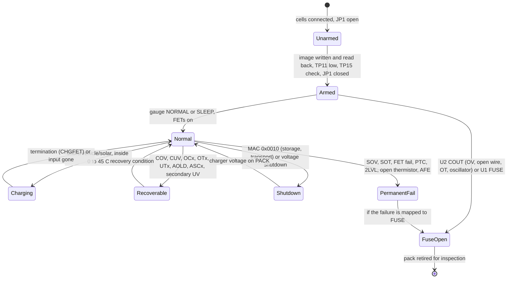

# Board P and the 4S3P pack: protection architecture

MeshSat field kit V2, MESHSAT-1357, review stream BAT, 26 September 2026. **Prototype design: no pack or board P has been
built, programmed or tested; every behaviour below is read from datasheets and the generator, and is NOT_YET_TESTED.**
This is the architecture the qualified battery-and-protection review (D-09) is asked to examine; it is not sign-off.

**Revision reviewed.** Board P's schematic as generated by `v2/ecad/tools/gen_sch_p.py` at main `1f614233` plus this
stream's change to the second level's temperature input (candidate, generator identity `4ce12f9caae757d0`, sha256
`e111e10a...fd7a`; files in `candidate/`; second cycle of 26 September 2026, which re-dimensioned the TS network to
270 ohm / 18 kohm). The committed board P layout (P4, 2 layers) predates the round-4 corrections and
is not part of this packet: board P is to be re-placed and routed at 4 layers, 2 oz (decision 28, open item O-11).
Line references `gen_sch_p.py:NNN` are to the candidate file.

Labels: **VERIFIED** = read in the named document or file; **INFERRED** = derived from verified facts, with the step shown;
**TBD** = not known, with what it moves.

## 1. The cells and the pack

Cell: Samsung INR18650-35E. Two maker specifications are in the tree and they differ in places; both are quoted.

| Cell limit | Ver. 1.1 (9 July 2015), `samsung-35e-orbtronic.pdf` | Version No. 1.0 (application 2016/04/11), `samsung-35e-akkuzentrum.pdf` |
|---|---|---|
| Charging voltage | 4.2 V (3.2) | 4.2 V (3.3) |
| Nominal voltage | 3.60 V (3.3) | 3.60 V (3.4) |
| Standard capacity | min 3,350 mAh (3.1) | min 3,350 mAh (3.1) |
| Charge current | standard 1,700 mA, cycle life 1,020 mA, maximum 2,000 mA "not for cycle life" (3.5, 3.7) | the same (3.6, 3.8) |
| Discharge current | 8,000 mA continuous, 13,000 mA not continuous (3.8) | the same (3.9) |
| Discharge cut-off | 2.65 V (3.9) | 2.65 V (3.10) |
| Operating temperature | charge 0 to 45 C, discharge -10 to 60 C, **cell surface** (3.12) | charge 0 to 45 C, discharge -10 to 60 C, **ambient**, with the note "Discharge OTP should not be over 60'C of the cell surface temperature ... based on the location of the cell surface with the highest temp increase" (3.15) |
| Storage (ex-factory 30 % charge) | 1 year -20 to 25 C; 3 months -20 to 45 C; 1 month -20 to 60 C (3.13) | 1 year 0 to 23 C; 3 months 0 to 45 C; 1 month 0 to 60 C (3.16) |
| Internal impedance | 35 mOhm or less, AC 1 kHz after standard charge (7.4) | the same (7.4) |

VERIFIED (both files, sections as given). **TBD: which revision governs the cells bought** (owner: the pack purchase).
It moves the pack's cold storage floor, -20 C or 0 C, and with it `OPERATING-ENVELOPE.md`'s "-20 to +45 C in storage"
(finding BAT-F09). The pack-design guideline values the project uses (terminate 2.50 V, over-discharge protection
2.30 V, BMS shut-down 2.00 V) are quoted from the Ver. 1.1 copy by `pcb_pack_protection.yaml:51-65`.

The pack (D-06): 4S3P, INFERRED from the cell figures: 14.4 V nominal, 16.8 V full, 10.6 V at the 2.65 V cut-off; at
least 10.05 Ah and about 145 Wh; 24 A continuous and 39 A short-term discharge, 6 A maximum charge (3.06 A at the
cycle-life rate). Declared kit currents: 10 A typical, 18 A peak (`pcb_energy_chain.yaml`, PACK_CELLS).

## 2. The protection layers

```
 cells 4S3P ─ W_BP ─ F1 25 A blade ─ FUSED ─ F2 SCF9550-30-05 ─ SCP_OUT ─ Q1 (CHG) ═ SW ═ Q2 (DSG) ─ PACK_P ─ W_P ─> kit
     │                               (fuse ends 1-2,  heater 3 ─ SCP_HTR ─ Q3 AO3400A ─ GND)
     └ W_BN ─ GND (cell B-) ─ R10 2 mOhm ─ PACK_N ─ W_N ─> kit        D1 SMBJ20A and C11+C12 across PACK_P/PACK_N
 U1 BQ4050:   taps VC1..VC4, BAT, PACK, VCC; SRP/SRN across R10; TS1..TS4 on J_TS; PTC on RT1; CHG->Q1, DSG->Q2; FUSE->FUSE_G
 U2 BQ7720700: taps through R24..R27, VDD through R23; TS on J_TS2 via R34 with R33; COUT->R29->FUSE_G; DOUT->Q5 pulls DSG_G
 FUSE_G ─ JP1 (open as built) ─ FUSE_GQ ─ Q3 gate
```

| Layer | Part | Functions | Where in the generator |
|---|---|---|---|
| Primary, firmware | U1 BQ4050RSMR (SLUSC67B) | COV, CUV, OCC, OCD, temperature windows in charge and discharge, charge inhibit and suspend, host watchdog, precharge and fast-charge timeouts, overcharge; permanent fails (SOV, SUV, SOT, FET, 2LVL, PTC, open thermistor, AFE, flash); FUSE output | `gen_sch_p.py:165-173`, thresholds and defaults in `PRIMARY-CONFIGURATION.md` |
| Primary, AFE hardware | inside U1 | short circuit in discharge (ASCD1/2), short circuit in charge (ASCC), overload in discharge (AOLD), acting on the FET drivers with thresholds held in AFE registers | SLUUAQ3A 2.6 |
| Primary, hardware PTC | RT1 Murata PRF15BB103RB6RC on U1 PTC/PTCEN | FETs off when the element beside Q1 and Q2 passes 1.2 to 3.95 Mohm (about 110 to 133 C at the element); "also works in SHUTDOWN mode" | `gen_sch_p.py:228-244`; SLUSC67B 6.23; SLUUAQ3A 3.15 |
| Secondary, fixed | U2 BQ7720700DSSR (SLUSEG7D) | cell OV 4.325 V (1 s), cell UV 2.25 V (1 s), open wire (4 s), over-temperature 70 C (4 s), oscillator health; COUT on OV, open wire, OT and oscillator; DOUT on UV, open wire, OT and oscillator; latch disabled | `gen_sch_p.py:351-430`, and `SECONDARY-OT-DECISION.md` for the TS network |
| Passive | F2 Eaton SCF9550-30-05 | chemical fuse: opens by its heater (commanded) or by overcurrent (200 % in 60 s maximum); 80 A breaking | `gen_sch_p.py:246-289`; `FUSE-INTERPRETATION.md` |
| Passive | F1 25 A mini blade in a Keystone 3568 holder | gross overcurrent; 1000 A interrupting at 32 VDC (Littelfuse 297) | `gen_sch_p.py:246` |
| Passive | D1 SMBJ20A (cathode on PACK_P), C11 + C12 in series | terminal transients and ESD | `gen_sch_p.py:295-346` |

Every firmware and AFE function of U1 above acts through its FETs, and the gauge moves its FETs only once FET control is
enabled: TI's shipped Manufacturing Status Init (0x0000) holds FET_EN = 0, which disables charge and discharge (SLUUAQ3A
4.12, 14.3.1). The image enables it (`PRIMARY-CONFIGURATION.md` section 2, 0x01F8).

Actuators: Q1 and Q2 (two CSD17570Q5B, common drain, high side) are driven by U1's CHG and DSG through 5.1 kohm, with
10 Mohm gate-to-source (`gen_sch_p.py:290-291`). Q5 (2N7002) pulls DSG_G to VSS when U2's DOUT is active (`:501-502`).
Q3 (AO3400A) sinks F2's heater when FUSE_G, through JP1, is high (`:475-479`). U1's FUSE pin is both an output and, via
R30, an input that reads U2's COUT (SLUSC67B 6.20, VIH 1.5 to 2.5 V; SLUUAQ3A 3.16).

## 3. Independence between primary and secondary

| Element | Shared? | Consequence |
|---|---|---|
| Cells and tap wires (J_CELL) | **Shared**: both levels sense the same five tap wires | an open tap is seen by U2 as open wire (fuse after 4 s once armed) and by U1 as a wrong cell voltage; one common-cause input |
| Tap filters | separate: U1 through R1..R4/C2..C5 (100 ohm), U2 through R24..R27/C15..C18 (1 kohm, TI's calibration value) | a failed filter part blinds one level on one cell |
| Supply | separate: U1 from BAT (R5) and PACK (R7); U2 from CELL4 through R23 (300 ohm) | independent |
| Temperature sensors | separate: U1 on four 103AT-2 through J_TS; U2 on its own 103AT-2 through J_TS2 | an unplugged socket blinds one level |
| Oscillator, reference, logic | separate chips | independent |
| Discharge actuator | **Shared**: Q2 is U1's DSG FET and U2's DOUT acts on the same gate through Q5 | a Q2 welded short defeats both levels' discharge action; F1 remains |
| Charge actuator | U1 only (Q1); U2 has no charge FET action | U2's charge-side protection is the fuse |
| Fuse actuator | **Shared**: F2 and Q3 serve U1's FUSE and U2's COUT (wired through R30 and R29) | a failed Q3 or an open JP1 removes the fuse for both levels |
| Firmware | U1 only; U2 has none | loss of U1's firmware leaves U2 whole (section 6) |
| Configuration | U1's thresholds live in data flash (`PRIMARY-CONFIGURATION.md`); U2's are fixed in silicon | a wrong image changes U1 only |

A note the reviewer should weigh (question Q-P1): SLUSEG7D 8.2 warns that "the open-wire feature of the BQ77207 device
may be affected if the primary protector or monitor device is actively measuring the cells" when both share the cells.
Here U1 measures and balances through its own 100 ohm filters on the same tap wires. The effect on U2's 200 mV open-wire
threshold is TBD; it moves how reliably open wire is detected and whether balancing current can raise a false open wire.

## 4. States



| State | How it is entered | Active protection | What the pack does |
|---|---|---|---|
| **Unarmed** (commissioning) | cells connected, JP1 open as built | U1 (on TI's shipped image both FETs are held off, FET_EN = 0: the pack is inert until the image is written, `PRIMARY-CONFIGURATION.md` section 3), AFE hardware, PTC, U2's DOUT hold on Q2, F1 | no path can open F2; the order of the arming procedure is in `FUSE-INTERPRETATION.md` section 5 |
| **Storage** (pack in the kit or alone) | the sensor controller sends MAC Shutdown 0x0010 (the storage path of record, `gen_sch_e.py:213`, F-BP-02) | U2 (all functions, about 2 uA, SLUSEG7D 6.5), the PTC (works in SHUTDOWN, SLUUAQ3A 3.15), F2 if armed, F1 | FETs off, terminals dead, U1 "completely disabled" (SLUSC67B 7.4); wakes when a charger puts more than about 2.25 V on PACK (SLUSC67B 6.3). Temperature stays within the cells' storage rating (section 1); the +71 C and -33 C margins are reconciled for the pack in `SECONDARY-OT-DECISION.md` section 5 |
| **Storage without shutdown** | kit off, pack connected, FETs on | all | board E's always-on domain (sensor controller, fans) draws from the pack node: INFERRED from board E's declared rail, 0.30 A typical at 5 V (`gen_sch_e.py:26-34`, 125-129), about 0.12 A at 14.4 V with 0.88 efficiency, so about 3.5 days from full. Storage must use the shutdown state |
| **Transport** | as storage, XT60 unplugged | as storage | electrically the storage state. The pack's UN 38.3 status and the applicable road (ADR) rules are outside this packet (review section 5; owner: the systems stream) |
| **Discharge** | load on the kit, FETs on | U1: CUV, OCD1/2, AOLD, ASCD, OTD and UTD (with OTFET = 1), SOV/SOT PFs; U2: UV (holds Q2), OV, open wire, OT; PTC; F1 | the kit runs; the gauge counts |
| **Charge** | shore, vehicle or solar through board A's BQ25731 | U1: COV, OCC, OTC and UTC (OTC needs OTFET = 1), charge inhibit and suspend (with CHGIN, CHGSU), overcharge, CHGV and CHGC; U2: OV, open wire, OT; PTC; F1, F2 | the charger has no thermistor input: every temperature limit on charge is the gauge's (`CHARGER-STATE-SEQUENCE.md`) |
| **Cold** (cells below 0 C) | ambient | U1 UTC opens the charge FET unconditionally (SLUUAQ3A 2.11); UTD at -10 C opens the discharge FET; U2 has no cold function (by design, `SECONDARY-OT-DECISION.md`) | charge blocked below 0 C; discharge to -10 C cell (D-02d: a cold-soaked kit needs external power or warming) |
| **Hot** (cells above 45 C) | ambient plus the internal rise (+10 K one module, +16 K three) | U1 OTC at 45 C (charge FET), OTD at 60 C (discharge FET), both only with OTFET = 1; SOT PF at 65 C (enabled by the image); U2 OT at 62.7 to 77.5 C (conservative reading; 63.6 to 76.6 C by the data sheet footnote's own reading): fuse; PTC at 110 to 133 C at the FET element | above 60 C at the cells the pack is outside its rating; from about 63 C it may be retired by F2 |
| **Recoverable fault** | any recoverable protection | the others | FET off in the affected direction until the recovery condition (SLUUAQ3A chapter 2); U2's UV hold ends at 2.35 V (UV + 100 mV hysteresis) |
| **Permanent fail (latched)** | an enabled PF | U2, PTC, F1 | FETs off, PF logged, data flash frozen, FUSE driven if the PF is mapped to FUSE and the stack is above Min Blow Fuse Voltage, or at any voltage for a FET failure (SLUUAQ3A 3.1) |
| **Fuse open** | F2's heater or overcurrent | none needed | the cell stack is disconnected from Q1 for good; the gauge reads its FUSE pin (2LVL) and logs; the pack is retired and inspected |

## 5. Sensor and wiring faults

| Fault | Primary (U1) | Secondary (U2) | Net effect |
|---|---|---|---|
| A cell NTC open (J_TS lead or 103AT-2) | reads very cold: UTC/UTD open the FETs (recoverable); open-thermistor PF (SLUUAQ3A 3.20, threshold 223.2 K), enabled by the image with Cell Delta written at 20.0 C (the TRM states that delta as 150.0 or 20.0 C, and at 150.0 C the check could not act in service; `PRIMARY-CONFIGURATION.md` section 1a) | unaffected | pack stops, safe |
| A cell NTC shorted | reads very hot: OTC/OTD (with OTFET), SOT PF (enabled by the image) | unaffected | pack stops, safe |
| Secondary NTC open (J_TS2 lead) | unaffected | reads as about 10 C (R33 caps the network at 18.3 kohm worst case, 15.0 % under the lowest UT resistance the chip may apply at TUT_ACC +-5 C, conservative reading; 13.8 % on the slope of TI's own two warmest UT thresholds, `SECONDARY-OT-DECISION.md` section 4): OT silently lost, and no UT trip even if the BQ7720700 carries UT | **latent**: found only by the TP15 check at commissioning and service (`SECONDARY-OT-DECISION.md` section 4) |
| Secondary NTC shorted, R33 shorted, TS to VSS | unaffected | reads over-temperature: COUT and DOUT after 4 s | F2 opens once armed (fail-safe); found before arming by reading TP11 low |
| J_TS2 unplugged on an armed pack (service) | unaffected | as NTC open: no fault, by the margin above | F2 intact; the procedure still unplugs J_TS2 only with JP1 open, because the margin rests on a conservative reading of a UT function the data sheet does not state for this variant (Q-TI-1) |
| TS lead shorted to a cell tab | unaffected | TS pin beyond its 1.5 V absolute maximum; TI FMA class A, "No OT detection" (SFFS317A Table 4-5) | secondary possibly damaged: pack-build insulation item |
| A tap wire open (J_CELL) | wrong cell voltages; the imbalance and open-cell PFs are off in the interim image (Q-P3) | open wire after 4 s: COUT and DOUT | F2 opens once armed; round-4 RP-18 keeps this on purpose |
| J_CELL unplugged | as above for all cells | open wire | as above |
| PTC element open | reads above the trip: PTC PF, FETs off (hardware) | unaffected | pack stops, permanent |
| PTC element shorted | PTC protection lost silently | unaffected | **latent**: the FETs' over-temperature is then covered by nothing but the pack NTCs' distance; a commissioning reading of RT1 (about 10 kohm at 25 C, Murata DM-SA16-E056) belongs in O-9 |
| SMBus lead open (J_SMB) | host watchdog: charging disabled after 10 s, **only if the golden image writes Enabled Protections C[HWDF] = 1** (SLUUAQ3A gives two defaults for that bit, `PRIMARY-CONFIGURATION.md` section 2) | unaffected | pack discharges normally, does not charge; the sensor controller reports it |
| Shunt R10 open | the negative return is open: the pack delivers nothing | unaffected | fails safe (no current) |

## 6. Loss of the primary controller

| How U1 is lost | What remains | Gap |
|---|---|---|
| Firmware hang with the AFE watchdog acting | SLUSC67B 6.8 specifies an AFE watchdog (tWDT settings of 500 to 4000 ms, 372 to 5024 ms with their tolerance) and a FET-off delay after reset (tFETOFF 409 to 614 ms), and SLUUAQ3A 5.4 notes a full reset after "the gauge or the AFE watchdog has been triggered". INFERRED: the FETs go off within about 5.6 s at worst (5.024 s plus 0.614 s at the longest setting) and the gauge restarts. | the exact AFE watchdog behaviour is not described beyond these parameters: TBD, reviewer question Q-P5 |
| Firmware alive but misconfigured | U2 (OV, UV, open wire, OT), PTC FET action, AFE short circuit at its thresholds, F1 | everything in `PRIMARY-CONFIGURATION.md` section 1 |
| U1 dead with the FETs held on (the worst case, not a documented mode) | U2: OV and OT and open wire open F2; UV holds Q2 off through Q5; F1 opens gross overcurrent | **not covered**: overcurrent between the cells' 24 A continuous and F1's 25 A rating, charge overcurrent (bounded by the charger's own current limit), charge below 0 C (bounded by the charger's 256 mA host-free current, `CHARGER-STATE-SEQUENCE.md`) |
| U1 dead with the FETs off | nothing needs to act: the pack is disconnected | the kit loses its pack; U2's DOUT has nothing to do |

## 7. Fault-state table

Thresholds: primary values are the REQUIRED golden-image values of `PRIMARY-CONFIGURATION.md` (none programmed yet);
secondary values are fixed in the BQ7720700 (SLUSEG7D section 4 and 6.5).

| Fault | Detected by | Threshold, delay | Protective action | Part that performs it | Recoverable? |
|---|---|---|---|---|---|
| Cell over-voltage, charging | U1 COV | 4.25 V, 2 s | charge FET off | U1 CHG, Q1 | yes, at 4.10 V |
| Cell over-voltage, primary failed | U2 OV | 4.325 V +-20 mV (0 to 60 C), 1 s | COUT high: heater on, F2 opens (60 s max); U1 sees FUSE high and opens both FETs (2LVL) | U2, R29, JP1, Q3, F2; U1 | no |
| Cell over-voltage, severe | U1 SOV PF | 4.50 V default, 5 s | FETs off; FUSE if mapped | U1, Q1, Q2, Q3, F2 | no |
| Cell under-voltage | U1 CUV | 2.50 V, 4 s | discharge FET off; charge allowed | U1 DSG, Q2 | yes, at 3.00 V with charge (Protection Configuration[CUV_RECOV_CHG] = 1, written by the image; the TRM states that bit's default two ways) |
| Cell under-voltage, primary failed | U2 UV | 2.25 V +-50 mV, 1 s | DOUT: Q5 pulls DSG_G to VSS, Q2 off; charge through Q2's body diode | U2, Q5, Q2 | yes, at about 2.35 V |
| Cell over-discharged (at or below 1.0 V, where Samsung says do not charge) | U1 SUV PF, checked at wake from shutdown with both FETs off (SUV_MODE = 1) | 1.0 V, 5 s | FETs off permanently; never mapped to the fuse | U1, Q1, Q2 | no (the pack is retired). Whether the hardware 0-V charge circuit can conduct first is Q-TI-7 and a bench item |
| Overcurrent in discharge | U1 OCD1 / AOLD | 20 A, 2 s / 30 A class, 20 ms | discharge FET off | U1, Q2 | yes |
| Short circuit in discharge | U1 AFE ASCD | about 55 to 67 A, about 183 to 244 us plus up to 160 us detection | both FETs off | U1 AFE, Q1, Q2 | yes (latch counting per image) |
| Short circuit with a welded FET | F1 | 25 A blade, melting about 2.7 to 10.9 ms at 480 to 240 A (INFERRED from the 297's I2t) | F1 opens | F1 | no (replace blade) |
| Overcurrent in charge | U1 OCC | 5 A, 2 s | charge FET off | U1, Q1 | yes |
| Charge outside 0 to 45 C | U1 UTC, OTC, charge inhibit and suspend | 0 C / 45 C, 2 s | charge FET off (OTC needs OTFET = 1) | U1, Q1 | yes |
| Discharge outside -10 to 60 C | U1 UTD, OTD | -10 C / 60 C, 2 s | discharge FET off (OTD needs OTFET = 1) | U1, Q2 | yes |
| Cells above the primary's limits | U1 SOT PF (enabled by the image, Enabled PF A); U2 OT | 65 C, 5 s; 62.7 to 77.5 C (conservative), 4 s | FETs off; F2 opens | U1; U2, Q3, F2 | no |
| Protection FETs overheating | RT1 PTC | about 110 to 133 C at the element, 40 to 145 ms | FETs off (hardware), PTC PF, FUSE if mapped | U1 AFE, RT1, Q3, F2 | no (power cycle clears for test only) |
| Open tap wire | U2 open wire | 200 mV below the neighbour, 4 s | COUT and DOUT: F2 opens, Q2 off | U2, Q3, F2, Q5 | no |
| U2 oscillator failure | U2 health check | below fOSC_FAULT | COUT and DOUT | U2, Q3, F2, Q5 | no |
| Charge or discharge FET failed short | U1 CFETF / DFETF PF | 5 mA through an off FET, 5 s | FUSE at any stack voltage | U1, Q3, F2 | no |
| Cell imbalance | U1 VIMR / VIMA PF, **not enabled** in the image until Q-P3 (Enabled PF B = 0x00) | the TRM states both thresholds two ways (VIMR 200 or 500 mV; VIMA 300 or 200 mV, 5 or 2 s); the image carries the fresh device's values | FETs off; FUSE if mapped | U1 | no |
| Gauge silent host | U1 HWD, with HWDF = 1 written by the image (not a default the TRM agrees on) | 10 s without SMBus | charge disabled | U1, Q1 | yes |
| External short at the kit with FETs working | U1 AFE ASCD | as above | FETs off; F1 intact (the test in `pcb_pack_protection.yaml:125-132`) | U1, Q1, Q2 | yes |
| Transient or ESD at the terminals | D1, C11 + C12 | SMBJ20A: 20 V stand-off; each capacitor 50 V, the pair survives one shorted part | clamp, filter | D1, C11, C12 | yes |
| Charger voltage above 20 V during a UV hold | none | Q2 gate-source rating 20 V; margin 3.2 V at 16.8 V | **none**: Q2's gate is at minus PACK_P (round-4 RP-02) | the charge path's own regulation upstream | open (O-9 bench item) |

## 8. Open items (bound, owner)

| ID | Item | Bound and effect | Owner |
|---|---|---|---|
| BAT-F05 / O-10 | the golden image | all firmware protections and every FUSE path depend on it (`PRIMARY-CONFIGURATION.md`); TI's default cell count is 3, not 4 | firmware (golden image author) |
| BAT-F13 | SLUUAQ3A states defaults two ways for thirteen settings and six permanent-fail thresholds (FET Options, Temperature Enable, Protection Configuration, Enabled Protections B, C and D, Enabled PF A to D, LED Configuration, Initial Battery Mode, ZVCHG Exit Threshold, Open Thermistor FET and Cell Delta, VIMR and VIMA thresholds, AFER Delay Period; `PRIMARY-CONFIGURATION.md` section 1a, found by `evidence/trm_defaults_check.py` over the whole of chapter 14) | every word in `PRIMARY-CONFIGURATION.md` section 2 is written explicitly and read back after a reset; the fresh device's data flash is archived first, which records the defaults TI actually ships; Q-TI-6 | golden image author; commissioning |
| Q-TI-7 | 0-V charging through the charge FET (PCHG_COMM = 1) against Samsung's "Under 1.0V voltage, do not charge the cell" | the SUV permanent fail at 1.0 V with SUV_MODE; whether the hardware circuit can conduct before that check, and the ZVCHG Exit Threshold that disables it | TI; bench (O-9) |
| BAT-F09 | the governing cell specification revision | cold storage floor -20 or 0 C | pack purchase |
| Q-P1 | U1 balancing and measurement versus U2 open-wire detection on shared taps | reliability of open wire; false trips | D-09 reviewer, bench |
| Q-P5 | AFE watchdog behaviour on a firmware hang | whether the FETs are certain to open | D-09 reviewer; TI |
| O-9 | commissioning readings: TP11, TP15 (by scope or by resistance, `SECONDARY-OT-DECISION.md` section 4), RT1, JP1 closure with polarity, Q2 gate under a UV hold with a charger fault, no charge current into a 4S string simulator at 0.9 V per cell | as listed | bench |
| O-11 | board P re-placement and routing at 4 layers with J_TS2, R34, TP15 | layout | placement owner |
| TBD | the hottest cell for the secondary NTC | delays the secondary by the gradient | pack build |

## 9. Interfaces and harness

Read from the candidate netlist (`candidate/pcb-p-pack.net`) and, for board E's end, from `gen_sch_e.py` at main
`1f614233`. Board P has no board-to-board connector; every interface is a lead.

| Connector (board P) | Pins | Mates with | Covered by a contract check? |
|---|---|---|---|
| W_P, W_N (2.5 mm2 lands, 12 AWG) | W_P = PACK_P, W_N = PACK_N | board E's XT60 J_BATT: pin 2 CELL+, pin 1 GND (`gen_sch_e.py:193`) | yes: `check_contracts.py` section 15b, three checks on polarity and one on F1; board P's verdict 4 of 4 PASS on the regenerated candidate (`evidence/regeneration/gates-new/check_contracts_p.verdict.json`, box 52646493) |
| J_SMB (JST-XH 1x4, B4B-XH-A) | 1 SMBC, 2 SMBD, 3 PACK_N (the pack side of the shunt, round-4 S-05), 4 PRES_J | board E's J_SMB (B4B-XH-A): 1 SMBC, 2 SMBD, 3 GND, 4 PRES_LEAD (`gen_sch_e.py:218-219`): a straight 1:1 lead | **no**: no rule of `check_contracts.py` names J_SMB (its pack section judges W_P, W_N, J_BATT and F1 only); this row is read by hand from both generators |
| J_CELL (JST-XH 1x5) | 1 GND (B-), 2 CELL1, 3 CELL2, 4 CELL3, 5 CELL4 (B+) | the cell block's tap wires | pack build (open wire on this lead opens F2 once armed, Q-P9) |
| J_TS (JST-PH 1x5) | 1 TS1, 2 TS2, 3 TS3, 4 TS4, 5 GND (VSS) | four 103AT-2, one per series group | pack build |
| J_TS2 (JST-PH 1x2, B2B-PH-K-S-GW) | 1 TS_SEC_J (through R34 to U2 TS), 2 GND (VSS) | the second level's own 103AT-2, on the hottest cell | pack build; the TP15 check proves it plugged |
| W_BP, W_BN (2.5 mm2 lands, 12 AWG) | W_BP = CELL4 (B+), W_BN = GND (B-) | the cell block's positive and negative strips | pack build |
